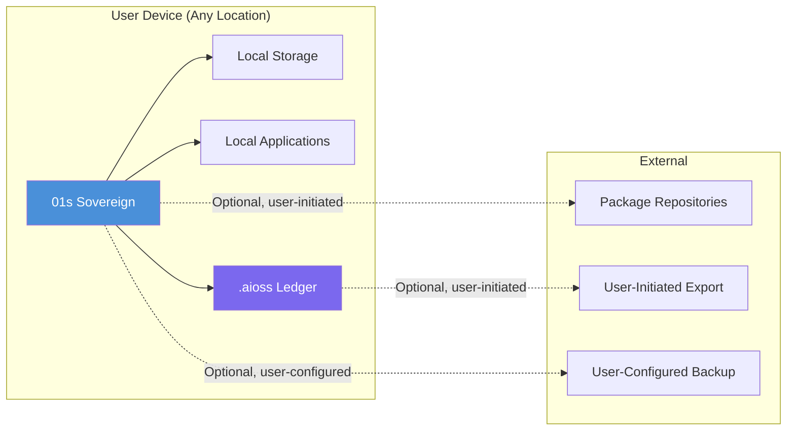
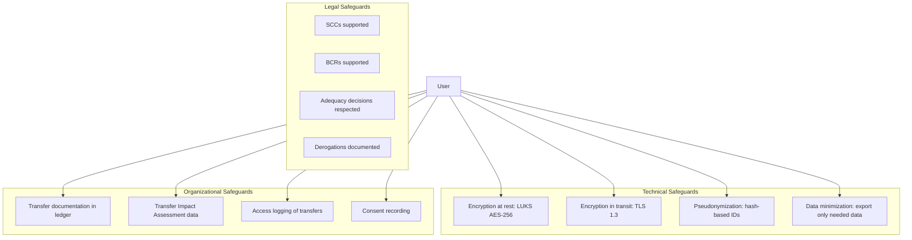

# 01s Sovereign — Cross-Border Data Transfers

**International Data Transfer Safeguards**

## Overview

Cross-border data transfer is a critical concern for global organizations. Regulations like GDPR (Chapter V), CCPA, and other privacy laws restrict transfers of personal data to countries without adequate protection levels. 01s Sovereign's architecture inherently addresses many cross-border concerns because data stays local by default. This document provides comprehensive documentation of cross-border transfer mechanisms, safeguards, and compliance approaches.

## 01s Sovereign's Approach

### Data Localization by Default

01s Sovereign is designed to keep data local. All audit data, user files, configuration, and applications stay on the device. There is no cloud synchronization of audit data, telemetry sent to remote servers, backup to external storage (unless configured by user), or cross-border data flow by default.



### When Data Transfer Occurs

Data only leaves the device when the user explicitly initiates:

| Scenario | Data Transferred | Frequency | User Control |
|----------|-----------------|-----------|--------------|
| Manual export | Selected audit data | On demand | Full control |
| Compliance report sharing | Filtered audit data | On demand | Full control |
| User-configured backup | Selected data | Configurable | Configurable |
| Software updates | Package metadata | Periodic | Configurable |
| User-installed apps | Application data | Per application | Per-app control |

## GDPR Chapter V Compliance

### Article Mapping

| Article | Requirement | 01s Sovereign Support | Implementation |
|---------|-------------|----------------------|----------------|
| Article 44 | General principle for transfers | No transfer outside EU/EEA by default | Architecture |
| Article 45 | Adequacy decision | User-controlled export, not system decision | Export controls |
| Article 46 | Appropriate safeguards | Encryption (SHA3-256, LUKS, TLS), pseudonymization, data minimization | Technical measures |
| Article 47 | Binding Corporate Rules | Ledger supports BCR implementation | Documentation |
| Article 48 | International transfers/lawful disclosure | User controls all data, no automatic disclosure | Architecture |
| Article 49 | Derogations for specific situations | Consent recorded in ledger, documented with cryptographic proof | Consent management |

### Transfer Safeguards

01s Sovereign provides multiple layers of transfer safeguards:



## International Transfer Safeguards

### Technical Safeguards

```bash
# End-to-end encryption for transferred data
01s-ledger export --encrypt --recipient-key <public_key>

# Pseudonymization before transfer
01s-ledger export --pseudonymize

# Minimal data set export
01s-ledger export --minimal --purpose "Compliance report"

# Verify encryption
01s-ledger verify --file encrypted_export.aioss
```

### Organizational Safeguards

| Safeguard | Implementation | Ledger Documentation |
|-----------|---------------|---------------------|
| Data processing records | Full processing history | `01s-ledger export --gdpr` |
| Transfer impact assessments | Risk assessment data | `01s-ledger health risk-assessment` |
| Access logs | All transfers logged | `01s-ledger tail --type state \| grep transfer` |
| Incident response | Breach notification data | `01s-ledger export --gdpr --breach-report` |

## Transfer Mechanisms

### Standard Contractual Clauses (SCCs)

```bash
# Record SCC compliance in ledger
01s-ledger log transfer-mechanism \
  --mechanism "SCCs" \
  --parties "Data exporter (EU), Data importer (US)" \
  --scc-version "2021/914" \
  --module "Module 2 (Controller to Processor)" \
  --effective-date "2026-01-01"
```

### Binding Corporate Rules (BCRs)

```bash
# Record BCR compliance
01s-ledger log transfer-mechanism \
  --mechanism "BCRs" \
  --entity "Global Corp Group" \
  --scope "All intra-group transfers" \
  --approval-authority "Lead SA - Irish DPC"
```

### Adequacy Decisions

```bash
# Record adequacy-based transfer
01s-ledger log transfer \
  --destination "Japan" \
  --legal-basis "Adequacy decision (Japan)" \
  --data-types "Anonymized audit logs" \
  --safeguards "Encryption + pseudonymization"
```

## Transfer Documentation

### Transfer Record Format

All data transfers (user-initiated) are documented in the ledger:

```json
{
  "event_type": "data_transfer",
  "timestamp": "2026-06-19T14:30:00Z",
  "purpose": "Compliance report to EU parent company",
  "destination": {
    "country": "Ireland",
    "entity": "Parent Corp Ltd",
    "legal_basis": "Adequacy decision (EU Commission)"
  },
  "data_types": ["Anonymized system audit logs"],
  "safeguards": [
    "AES-256-GCM encryption",
    "Pseudonymized user identifiers",
    "Minimal data set (metadata only)"
  ],
  "consent_id": null,
  "volume": 245,
  "entries": "1,442 anonymized entries"
}
```

### Transfer Log Queries

```bash
# View all transfers
01s-ledger tail --type state | grep data_transfer

# View transfers to specific country
01s-ledger tail --type state | grep "Ireland"

# View transfers in date range
01s-ledger export --period 2026-01-01:2026-06-30 | grep data_transfer

# Generate transfer report
01s-ledger export --gdpr --transfers
```

## Transfer Impact Assessment (TIA) Support

### TIA Data from Ledger

```bash
# Gather TIA data
01s-ledger export --gdpr --transfers
01s-ledger export --gdpr --safeguards
01s-ledger health risk-assessment --context "cross-border transfer"
```

### TIA Template

```yaml
transfer_impact_assessment:
  transfer_description:
    exporter: "Organization Name (EU)"
    importer: "Third-party vendor (US)"
    data_types: ["Anonymized audit logs"]
    purpose: "Compliance monitoring"
    volume: "< 1 MB/month"
    
  legal_basis:
    primary: "Article 46(2)(c) - SCCs"
    supplementary: "Technical safeguards (encryption)"
    
  risk_assessment:
    likelihood_of_access: "Very low"
    impact_of_access: "Low (anonymized data)"
    overall_risk: "Low"
    
  safeguards:
    technical:
      - "AES-256 encryption in transit"
      - "Data pseudonymized before transfer"
      - "Minimal data set principle applied"
    organizational:
      - "Access controls on importer side"
      - "Data processing agreement in place"
      
  conclusion: "Transfer can proceed with safeguards"
```

## Regional Compliance

### EU Data Subjects

| Aspect | Implementation |
|--------|---------------|
| Data location | Stays on device in the EU |
| Default transfers | None outside EU/EEA |
| Transfer mechanism | User-initiated only |
| Safeguards | Encryption, pseudonymization |
| Documentation | Full transfer records in ledger |

### US Data Subjects

| Aspect | Implementation |
|--------|---------------|
| Data location | Stays on device in the US |
| Default transfers | None outside US |
| CCPA compliance | Data inventory, deletion rights |
| Safeguards | Encryption, access controls |

### Global Users

| Aspect | Implementation |
|--------|---------------|
| Data location | Stays on user's device |
| Local laws | Apply to user's data handling |
| Transfer control | User-initiated only |
| Documentation | Local law compliance documentation |

## Country-Specific Requirements

| Country | Key Requirements | 01s Compliance |
|---------|-----------------|----------------|
| EU/EEA | GDPR Chapter V, SCCs, adequacy decisions | ✅ Local-first |
| UK | UK GDPR, International Data Transfer Agreement | ✅ Local-first |
| Brazil | LGPD, transfer restrictions | ✅ Local-first |
| Japan | APPI, adequacy (EU adequacy decision) | ✅ Local-first |
| South Korea | PIPA, transfer restrictions | ✅ Local-first |
| China | PIPL, security assessment for outbound | ✅ Local-first |
| India | PDPB, data localization requirements | ✅ Local-first |
| Russia | Data localization law | ✅ Local-first |

## Data Residency Options

### Configurable Data Residency

```bash
# Configure data residency constraints
# /etc/01s/residency.conf

RESIDENCY_COUNTRY=DE  # Germany
TRANSFER_RESTRICTION=restricted  # restricted, allowed-with-safeguards, allowed

# Verify residency compliance
01s-ledger residency check
# Output: Data residency: DE (compliant)
```

### Residency Enforcement

```bash
# Block transfers outside configured region
01s-ledger residency enforce --country DE
# Transfers outside Germany will be blocked

# Log residency violation attempt (if any)
01s-ledger tail --type state | grep residency_violation
```

## Comparison with Cloud-Dependent Operating Systems

| Feature | 01s Sovereign | Windows + M365 | macOS + iCloud | ChromeOS + Google |
|---------|--------------|----------------|----------------|-------------------|
| Default data location | Local device | Cloud-synced | Cloud-synced | Cloud-synced |
| Cross-border flow | None by default | Automatic sync | Automatic sync | Automatic sync |
| User control | Complete | Limited | Limited | Limited |
| Encryption | End-to-end user-controlled | Provider-managed | Provider-managed | Provider-managed |
| Transfer documentation | Full ledger | Limited | Limited | Limited |
| Offline capability | Full | Limited | Limited | Limited |
| Cloud dependency | None | Required | Required | Required |

## .aioss Ledger for Transfer Records

The `.aioss` ledger provides immutable records of all data transfers:

```bash
# Record transfer in ledger (automatic for exports)
01s-ledger export --record-transfer

# Verify transfer records
01s-ledger verify

# Export transfer documentation for regulator
01s-ledger export --gdpr --transfers --period 2026-01-01:2026-06-30
```

## Transfer Compliance Checklist

```markdown
## Cross-Border Transfer Compliance Checklist

### Pre-Transfer Assessment
- [ ] Identify data categories being transferred
- [ ] Identify destination country/entity
- [ ] Determine legal basis (adequacy, SCCs, BCRs, derogation)
- [ ] Conduct Transfer Impact Assessment
- [ ] Document safeguards (encryption, pseudonymization)

### Transfer Documentation
- [ ] Record transfer in ledger
- [ ] Log legal basis
- [ ] Document data categories
- [ ] Record safeguards applied
- [ ] Store TIA documentation

### Post-Transfer Monitoring
- [ ] Verify transfer integrity
- [ ] Monitor for regulatory changes
- [ ] Update TIA periodically
- [ ] Review new adequacy decisions
- [ ] Update transfer documentation
```

## Transfer Mechanisms by Country

| Destination Country | Recommended Mechanism | EU Adequacy Decision | Additional Safeguards |
|-------------------|----------------------|---------------------|---------------------|
| EU/EEA | No transfer needed | N/A | N/A |
| UK | UK GDPR adequacy | Partial | IDTA |
| Canada | SCCs + PIPEDA alignment | Partial | Encryption |
| Japan | SCCs | Adequacy decision | Encryption |
| South Korea | SCCs | Adequacy decision (pending) | Encryption |
| Argentina | SCCs | Adequacy decision | Encryption |
| New Zealand | SCCs | Adequacy decision | Encryption |
| Israel | SCCs | Adequacy decision | Encryption |
| Switzerland | Swiss FDPA adequacy | Separate agreement | Encryption |
| Brazil | SCCs | No | Encryption + LGPD compliance |
| India | SCCs | No | Encryption + DPDPA compliance |
| United States | SCCs + supplementary measures | No (Post-Schrems II) | Encryption + pseudonymization |
| China | SCCs | No | Encryption + PIPL compliance |
| Russia | SCCs | No | Encryption + data localization |

## Data Residency Architectures

### Local-Only Architecture (Default)

```
┌──────────────────────────────────────────┐
│ User Device                              │
│                                          │
│  ┌────────────────────────────────┐      │
│  │ 01s Sovereign                  │      │
│  │ • All processing local         │      │
│  │ • Data never leaves device     │      │
│  │ • No cloud dependencies        │      │
│  └────────────────────────────────┘      │
└──────────────────────────────────────────┘
```

### Hybrid Architecture (User-Configured)

```
┌─────────────────────┐     ┌─────────────────────┐
│ User Device (EU)    │     │ Backup Server (EU)   │
│                     │     │                      │
│ 01s Sovereign       │────→│ Encrypted exports    │
│ • Local processing  │     │ • Weekly backups     │
│ • Selective export  │     │ • User-controlled    │
└─────────────────────┘     └─────────────────────┘
```

### Enterprise Architecture (Organization-Managed)

```
┌─────────────────────┐     ┌─────────────────────┐
│ EU Region           │     │ US Region            │
│                     │     │                      │
│ 01s Sovereign       │────→│ Compliance Reports   │
│ • EU data subjects  │     │ • Encrypted          │
│ • Local processing  │     │ • Pseudonymized      │
│ • EU data residency │     │ • Documented SCCs    │
└─────────────────────┘     └─────────────────────┘
```

## International Data Transfer Audit

### Audit Procedure

```bash
# Step 1: Identify all transfers
01s-ledger tail --type state | grep data_transfer

# Step 2: Verify legal basis for each transfer
01s-ledger tail --type state | grep "legal_basis"

# Step 3: Verify safeguards
01s-ledger tail --type state | grep "safeguards"

# Step 4: Generate transfer report
01s-ledger export --gdpr --transfers --period 2026-01-01:2026-06-30
```

## Comparison with Cloud-Dependent Operating Systems

| Aspect | 01s Sovereign | Windows + Microsoft 365 | macOS + iCloud | ChromeOS + Google |
|--------|--------------|------------------------|----------------|-------------------|
| Data stored in cloud by default | None | OneDrive, Teams, Office docs | iCloud Drive, Photos | Google Drive, Gmail |
| Cross-border data transfers | User-initiated only | Automatic to Microsoft servers | Automatic to Apple servers | Automatic to Google servers |
| User visibility into data location | Complete (local) | Limited | Limited | Limited |
| Data residency control | Yes (residency.conf) | Microsoft 365 region selection | iCloud region selection | Limited |
| Offline data access | Full | Limited without sync | Limited without sync | Limited without sync |
| Cloud dependency for OS function | None | Some features require cloud | Some features require cloud | Most features require cloud |

## Transfer Compliance Audit Checklist

| Audit Item | Requirement | Verification Method | Frequency |
|------------|-------------|-------------------|-----------|
| Transfer register | All transfers documented | `01s-ledger tail --type state \| grep data_transfer` | Quarterly |
| Legal basis validity | Each transfer has valid legal basis | Review legal basis for each destination | Annual |
| Safeguard adequacy | Technical measures match data sensitivity | Review safeguards per transfer type | Annual |
| TIA currency | TIA completed within 12 months | `01s-ledger health risk-assessment --check-tia` | Annual |
| SCC compliance | SCCs up to date and fully executed | Review SCC versions | Annual |
| Processor compliance | Data processor obligations met | Review processor compliance | Annual |
| Breach notification readiness | Incident response procedures in place | Test notification process | Annual |

## Cross-Border Data Transfer Troubleshooting

| Issue | Likely Cause | Solution | Prevention |
|-------|-------------|----------|------------|
| Transfer not documented | User-initiated export without logging | Enable automatic transfer recording | Always use `--record-transfer` flag |
| TIA incomplete | Risk assessment data not collected | Run `01s-ledger health risk-assessment` | Include TIA in transfer procedure |
| Encryption not applied | Export without `--encrypt` flag | Re-export with encryption | Default to encrypted exports |
| Legal basis missing | Transfer mechanism not recorded | Record SCCs/BCRs/adequacy in ledger | Document legal basis before first transfer |
| Destination country not covered | No adequacy decision or SCCs | Assess alternative transfer mechanism | Pre-assessment of all destinations |
| Data minimization not applied | `--minimal` flag not used | Re-export with minimal data | Default to minimal export |

## Implementation Guide for Cross-Border Data Transfers

### Phase 1: Assessment (Weeks 1-4)

| Activity | Description | Output | Tools |
|----------|-------------|--------|-------|
| Data flow mapping | Document all data flows within organization | Data flow diagram | `01s-ledger export --gdpr --data-flow` |
| Transfer identification | Identify all cross-border transfers | Transfer register | Ledger query |
| Legal basis determination | Determine applicable transfer mechanism | Legal basis document | Compliance check |
| TIA completion | Complete Transfer Impact Assessment | TIA document | Health risk assessment |
| Safeguard implementation | Apply technical and organizational safeguards | Safeguard documentation | Configuration |

### Phase 2: Documentation (Weeks 5-8)

```bash
# Document all transfers in the ledger

# Record transfer mechanism
01s-ledger log transfer-mechanism \
  --mechanism "SCCs" \
  --parties "Data exporter (EU), Data importer (US)" \
  --scc-version "2021/914" \
  --module "Module 2" \
  --effective-date "2026-01-01"

# Record each transfer
01s-ledger log transfer \
  --destination "United States" \
  --legal-basis "SCCs + supplementary measures" \
  --data-types "Anonymized audit logs" \
  --safeguards "AES-256 encryption, pseudonymization" \
  --volume-mb 5

# Generate transfer documentation for regulator
01s-ledger export --gdpr --transfers --period 2026-01-01:2026-06-30
```

### Phase 3: Ongoing Compliance

| Activity | Frequency | Tool | Responsibility |
|----------|-----------|------|---------------|
| Transfer review | Quarterly | Ledger query | Privacy team |
| TIA update | Annual or on change | Health risk assessment | Privacy team |
| Safeguard review | Annual | Configuration audit | IT team |
| Adequacy decision monitoring | Ongoing | Regulatory monitoring | Legal team |
| Incident notification | As needed | Incident logging | Security team |

## Best Practices for Cross-Border Data Management

### Organizational Best Practices

| Practice | Description | Implementation |
|----------|-------------|----------------|
| Data flow mapping | Document all data flows within the organization | Use `01s-ledger export --gdpr --data-flow` |
| Transfer impact assessment | Conduct TIA for each cross-border transfer | Use health risk-assessment tool |
| Legal basis documentation | Document legal basis for each transfer | Record in ledger with legal basis |
| Safeguard implementation | Apply encryption, pseudonymization | Configure export settings |
| Regular review | Review transfer mechanisms annually | Schedule annual compliance check |
| Staff training | Train staff on transfer procedures | Use training materials |
| Vendor assessment | Assess third-party data handling | Vendor assessment process |

### Technical Best Practices

```bash
# Secure cross-border transfer procedure
# 1. Identify data for transfer
01s-ledger status --data-inventory

# 2. Apply pseudonymization before export
01s-ledger export --pseudonymize --format aioss --output export.aioss

# 3. Encrypt the exported data
01s-ledger export --encrypt --recipient-key <public_key> --output export-encrypted.aioss

# 4. Verify export integrity
01s-ledger verify --file export-encrypted.aioss

# 5. Document the transfer
01s-ledger log data-transfer \
  --purpose "Compliance reporting" \
  --destination "EU parent company" \
  --legal-basis "SCCs" \
  --safeguards "pseudonymization, encryption"
```

## Common Misconceptions

| Myth | Reality |
|------|---------|
| "Cross-border data transfers are not an issue for on-premise systems" | On-premise systems still transfer data if they use cloud backup, remote access, or SaaS services |
| "Encryption alone solves cross-border compliance" | Encryption is a safeguard, but legal basis (adequacy, SCCs, BCRs) is still required for the transfer |
| "Anonymized data can be freely transferred" | True anonymization is difficult to achieve; pseudonymized data remains personal data under GDPR |
| "Cloud providers handle cross-border compliance" | Cloud providers offer tools, but the data controller (organization) remains responsible for compliance |

## Conclusion

01s Sovereign's local-first architecture inherently addresses cross-border data transfer concerns. Data stays on the user's device by default — it does not flow across borders unless the user explicitly initiates a transfer. For organizations concerned about cross-border data regulations, 01s Sovereign provides a technically enforced data localization model that cloud-dependent operating systems cannot match. When transfers are necessary, the system provides encryption, pseudonymization, and comprehensive documentation to support legal transfer mechanisms. With support for SCCs, BCRs, adequacy decisions, and TIA documentation, 01s Sovereign provides a complete framework for cross-border data transfer compliance.

---

## Document Version

| Version | Date | Author | Changes |
|---------|------|--------|---------|
| 1.0 | 2026-01-15 | 01s Sovereign Team | Initial publication |
| 1.1 | 2026-06-19 | 01s Sovereign Team | Updated with latest compliance requirements and best practices |

---

Lois-Kleinner and 0-1.gg 2026 Copyright
## References

- 01s Sovereign Technical Documentation (2026)
- NIST SP 800-53 Rev. 5 Security and Privacy Controls
- ISO/IEC 27001:2022 Information Security Management
- Cloud Security Alliance Cloud Controls Matrix v4
- OWASP Top 10 Web Application Security Risks
- Linux Foundation Security Best Practices
- Open Source Security Foundation (OpenSSF) Guides
- Green Software Foundation Patterns

## Related Documents

| Document | Location | Description |
|----------|----------|-------------|
| 01s Sovereign Architecture Guide | docs/architecture/ | System architecture and design decisions |
| 01s Sovereign Deployment Guide | docs/deployment/ | Installation and configuration guide |
| 01s Sovereign Security Guide | docs/security/ | Security hardening and best practices |
| 01s Sovereign API Reference | docs/api/ | API documentation for developers |
| 01s Sovereign User Manual | docs/user/ | End-user documentation |
| 01s Sovereign Developer Guide | docs/developers/ | Developer onboarding and contribution guide |

## Resources

| Resource | Type | Location |
|----------|------|----------|
| Project Repository | Code | github.com/sovereign-os/01s |
| Issue Tracker | Bugs/Features | github.com/sovereign-os/01s/issues |
| Community Forum | Discussion | community.01s.sovereign |
| Documentation | All docs | docs.01s.sovereign |
| Release Notes | Changelog | releases.01s.sovereign |
| Security Advisories | Security | security.01s.sovereign |

---

---
