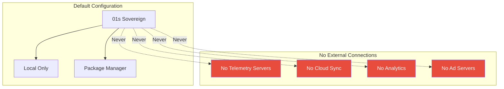
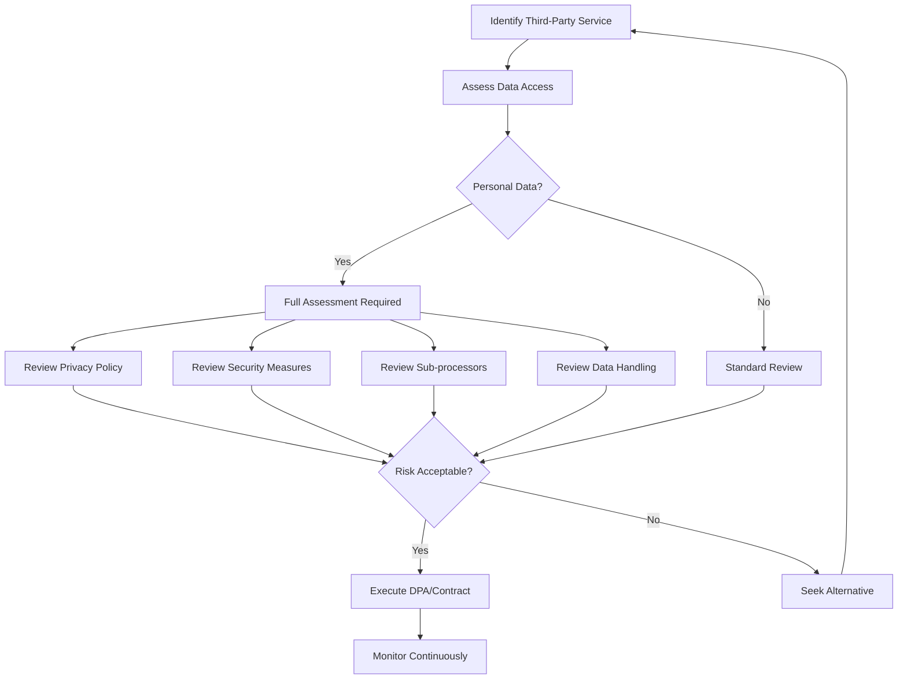
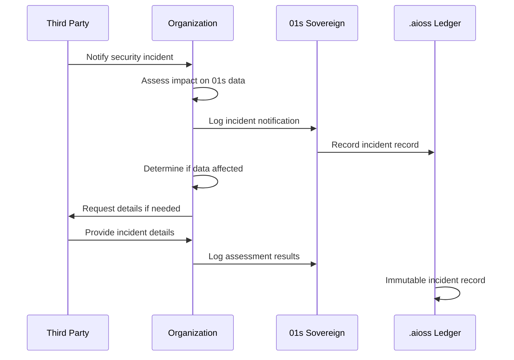
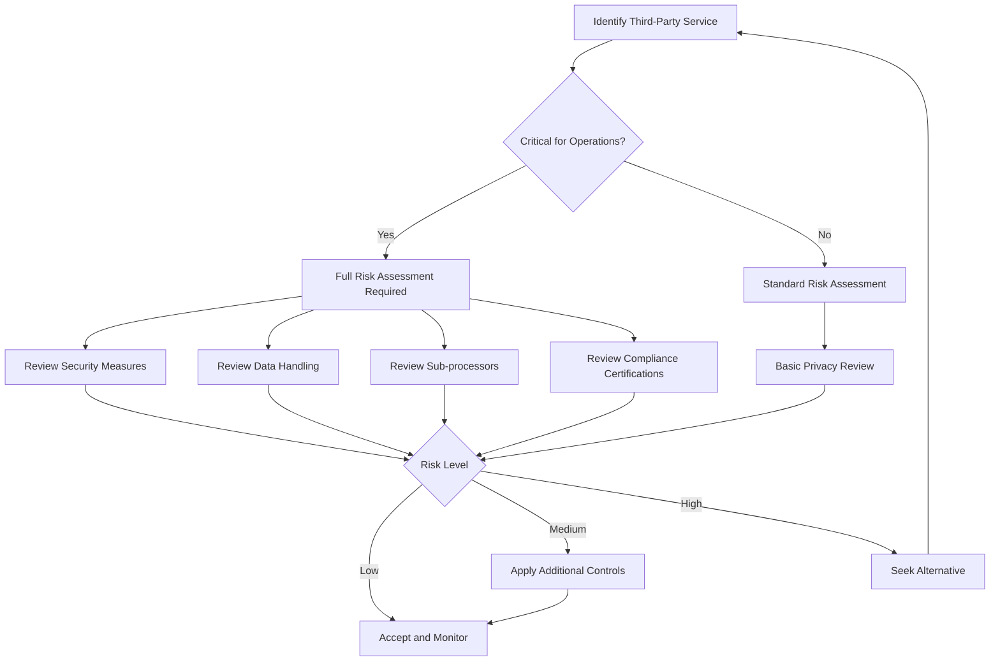

# 01s Sovereign — Third-Party Data Processing

**Third-Party Services and Data Handling**

## Overview

01s Sovereign is designed to minimize third-party data processing. Unlike operating systems that integrate deeply with third-party services (Microsoft 365, Google Cloud, Apple iCloud), 01s Sovereign operates independently by default. This document provides comprehensive documentation of third-party processing, vendor assessment, and data processing agreements.

## Default State: No Third-Party Processing

In its default configuration, 01s Sovereign has:

- No telemetry services
- No cloud dependency
- No third-party SDKs
- No ad infrastructure
- No data brokers
- No analytics providers
- No automatic data sharing

The only network traffic from a default installation is:

| Traffic Type | Initiation | Data Shared | Frequency |
|-------------|------------|-------------|-----------|
| Package updates | User-initiated | Package names and versions | On update |
| User-installed applications | User-initiated | Per application | Per application |
| Network services | User-configured | Per service | Per configuration |



## Third-Party Services (User-Initiated)

### Package Repositories

| Repository | Provider | Data Shared | Privacy Impact |
|------------|----------|-------------|----------------|
| Arch Linux official | Arch Linux community | Package names, versions | Minimal (no personal data) |
| AUR | Community | Package names, dependencies | Minimal |
| Flathub | Flathub project | Flatpak app queries | Minimal |

```bash
# View package manager network activity
# Updates only happen when user runs:
sudo pacman -Syu  # Arch Linux update
flatpak update    # Flatpak update

# No automatic check-ins
# Verify no background package network activity
sudo netstat -tupn | grep -E "pacman|flatpak"
```

### Application Data Handling

| Application Type | Sandboxing | Data Access | User Control |
|-----------------|------------|-------------|--------------|
| Flatpak apps | Full sandbox | File system, network, devices | Per-app permissions |
| Native apps | AppArmor profiles | System resources | Profile configuration |
| Containers (Docker) | Isolated namespace | No host access | Per-container config |

#### Flatpak Permission Controls

```bash
# View application permissions
flatpak info --show-permissions org.mozilla.firefox

# Modify permissions
flatpak override --user --socket=session-bus org.mozilla.firefox

# Monitor application network access
sudo nethogs
```

### User-Installed Third-Party Services

If users install third-party services (Dropbox, Google Drive, etc.), those services are:

1. User-initiated and user-controlled
2. Subject to their own privacy policies
3. Sandboxed by AppArmor (if configured)
4. Auditable through network firewall logs
5. Subject to per-application firewall rules

## Third-Party Inventory

### Default Third-Party Services

| Service | Category | Data | Purpose | Opt-Out |
|---------|----------|------|---------|---------|
| None | N/A | N/A | N/A | N/A |

### Optional Third-Party Services

| Service | Category | Data | User Control |
|---------|----------|------|--------------|
| Package repositories | Updates | Metadata | Full (can use offline) |
| User-installed apps | Varied | Per app | Full (install/uninstall) |
| User-configured backup | Backup | Per config | Full |

## Data Processing Agreements (DPAs)

### DPA Support

For organizations needing DPAs, 01s Sovereign provides:

```bash
# Generate data processing documentation
01s-ledger export --gdpr --processing-activities

# Export third-party service inventory
01s-ledger export --ccpa --data-inventory

# Generate DPA support documentation
01s-ledger export --gdpr --dpa-support
```

### DPA Template

```yaml
data_processing_agreement:
  controller: "Organization deploying 01s Sovereign"
  processor: "N/A (no default processing)"
  
  processing_details:
    - purpose: "System audit and security"
      data_categories: ["System events", "Authentication records"]
      data_subjects: ["System users"]
      retention: "30 days (configurable)"
      
  sub_processors: []
  
  technical_measures:
    - "SHA3-256 hash chain integrity"
    - "LUKS full-disk encryption"
    - "AppArmor mandatory access control"
    - "TLS 1.3 transmission security"
    
  organizational_measures:
    - "Access control policies"
    - "Incident response procedures"
    - "Regular compliance reviews"
```

## Vendor Assessment

### Third-Party Risk Assessment

| Risk | Mitigation | 01s Feature |
|------|------------|-------------|
| Application data collection | Sandboxing | Flatpak isolation |
| Unauthorized network access | Firewall | Default deny outbound |
| Malware | Application signing | Package verification |
| Data exfiltration | Monitoring | Network audit logging |
| Supply chain attack | Verification | Toolchain verification |
| Third-party tracking | Blocking | DNS filtering, firewall |
| Vulnerable dependencies | Scanning | Regular audits |

### Vendor Assessment Process



## Sub-Processor Management

### Current Sub-Processors

01s Sovereign has no default sub-processors. All processing is local to the user's device.

### Sub-Processor Policy

If sub-processors are added in the future:

1. **Notice**: All sub-processors will be documented
2. **Consent**: Users will be notified and may object
3. **Audit**: Sub-processor compliance will be verifiable
4. **Contract**: Data processing agreements will be in place
5. **Termination**: Sub-processor changes will be communicated

## Incident Notification from Third Parties

### Third-Party Incident Procedure

```bash
# Record third-party incident notification
01s-ledger log third-party-incident \
  --vendor "Vendor Name" \
  --incident-type "security_breach" \
  --notification-date "2026-06-19" \
  --impact-assessment "No 01s data affected" \
  --action-taken "Vendor access revoked"
```

### Incident Notification Flow



## Comparison with Other Operating Systems

| Feature | 01s Sovereign | Windows 11 | macOS | ChromeOS |
|---------|--------------|------------|-------|----------|
| Default telemetry | None | Microsoft telemetry | Apple analytics | Google telemetry |
| Cloud sync | None | OneDrive | iCloud | Google Drive |
| Advertising ID | None | Yes | Yes | Yes |
| Third-party SDKs | None | Multiple | Multiple | Multiple |
| App store | Optional | Microsoft Store | App Store | Play Store |
| Account required | No | Microsoft account | Apple ID | Google account |
| Data sharing opt-out | Not needed | Partial | Partial | Partial |

## User Controls

### Network Monitoring

```bash
# View all network connections
ss -tupn

# Monitor network in real time
sudo tcpdump -i any -n

# Check application network permissions
flatpak info --show-permissions <app_id>

# Default deny firewall
sudo iptables -P OUTPUT DROP
sudo iptables -A OUTPUT -m state --state ESTABLISHED,RELATED -j ACCEPT
```

### Application Permissions

```bash
# List application permissions
flatpak permission-show

# Revoke application permission
flatpak permission-remove <app_id> <permission>
```

## Compliance Documentation

### Third-Party Processing Documentation

```bash
# Generate third-party processing documentation
01s-ledger export --gdpr --third-parties

# Generate data flow documentation
01s-ledger export --gdpr --data-flow

# Generate vendor assessment report
01s-ledger export --gdpr --vendor-assessment
```

## Third-Party Data Processing Policy

### Policy Principles

1. **No default processing**: No third-party processing in default configuration
2. **User initiation**: All third-party processing requires user action
3. **Transparency**: All third-party interactions are logged in the ledger
4. **User control**: Users can block, monitor, and audit third-party access
5. **Minimal data**: When third-party processing occurs, only necessary data is shared
6. **Sandboxing**: Third-party applications are isolated from the OS and each other

### Policy Enforcement

```bash
# Enforce third-party processing policy
01s-ledger enforce third-party-policy

# Audit third-party interactions
01s-ledger tail --type state | grep -i "third.party\|network\|external"
```

## Vendor Security Assessment

### Assessment Questionnaire

For organizations that use third-party services alongside 01s Sovereign, a vendor assessment should cover:

| Question | 01s Support |
|----------|-------------|
| Does the vendor have a security program? | Organization verification |
| Does the vendor undergo third-party audits? | Organization verification |
| Does the vendor encrypt data in transit? | TLS 1.3 enforced by OS |
| Does the vendor have incident response? | Logged in ledger |
| Where is data stored by the vendor? | Transfer documentation |
| Does the vendor use sub-processors? | Vendor verification |
| What data does the vendor access? | Application sandbox limits |

### Vendor Assessment Automation

```bash
# Record vendor assessment in ledger
01s-ledger log vendor-assessment \
  --vendor "Vendor Name" \
  --assessment-date "2026-06-19" \
  --score 85 \
  --notes "Annual assessment completed" \
  --next-assessment "2027-06-19"
```

## Application Sandboxing

### Flatpak Sandbox Architecture

```
┌─────────────────────────────────────────┐
│ 01s Sovereign Host OS                    │
│                                         │
│  ┌────────────────────────────────┐     │
│  │ Flatpak Application           │     │
│  │ ┌──────────┐  ┌──────────┐   │     │
│  │ │ App Code │  │ Runtime  │   │     │
│  │ └──────────┘  └──────────┘   │     │
│  │        │                      │     │
│  │  ┌─────┴─────┐               │     │
│  │  │ Bubblewrap│               │     │
│  │  │ Sandbox   │               │     │
│  │  └───────────┘               │     │
│  └────────────────────────────────┘     │
│         │       │       │               │
│  ┌──────┴───┐ ┌─┴──┐ ┌──┴────────┐     │
│  │AppArmor  │ │User│ │ Network   │     │
│  │Profiles  │ │NS  │ │ Namespace │     │
│  └──────────┘ └────┘ └───────────┘     │
└─────────────────────────────────────────┘
```

### Sandbox Restrictions

| Resource | Default Access | User-Configurable |
|----------|---------------|-------------------|
| Filesystem (home) | None | Per-directory grants |
| Filesystem (system) | None | Read-only by exception |
| Network | None | Per-port rules |
| Camera | None | Per-use prompt |
| Microphone | None | Per-use prompt |
| Location | None | Per-use prompt |
| Inter-process comm | None | App-specific |
| Host system | None | Always restricted |

## Container Security

### Docker/Podman Container Isolation

| Security Feature | Default | Purpose |
|-----------------|---------|---------|
| User namespace | Enabled | Root in container ≠ root on host |
| Capability dropping | All dropped, added per-need | Least privilege |
| Seccomp filter | Enabled | Restrict system calls |
| AppArmor profile | Enabled | MAC for containers |
| Read-only rootfs | Optional | Immutable container |
| No new privileges | Enabled | Prevent privilege escalation |

### Container Audit Trail

```json
{
  "type": "container_event",
  "timestamp": "2026-06-19T14:30:00Z",
  "container_id": "abc123...",
  "image": "nginx:latest",
  "action": "start",
  "user": "app_user",
  "network_mode": "bridge",
  "volume_mounts": ["/data:/var/www/html"],
  "capabilities": ["NET_BIND_SERVICE"],
  "hash": "sha3-256:a1b2..."
}
```

## Implementation Guide for Third-Party Processing Management

### Organizational Third-Party Management Program

| Phase | Duration | Key Activities | Deliverables |
|-------|----------|---------------|--------------|
| Discovery | 2-4 weeks | Identify all third-party services, map data flows | Third-party inventory |
| Assessment | 2-3 weeks | Assess privacy impact, review vendor policies | Risk assessment report |
| Documentation | 1-2 weeks | Document DPAs, data flows, processing purposes | Processing records |
| Controls | 2-4 weeks | Implement technical controls (sandboxing, firewalls) | Technical implementation |
| Monitoring | Ongoing | Audit third-party access, review vendor changes | Continuous monitoring |
| Review | Quarterly | Reassess necessity, review compliance | Quarterly review report |

### Third-Party Risk Assessment Process



### Third-Party Processing Log Template

```json
{
  "third_party_record": {
    "service_name": "Example Cloud Backup",
    "vendor": "Example Corp",
    "purpose": "Offsite backup of configuration files",
    "data_categories": ["System configuration files"],
    "personal_data_involved": false,
    "data_volume_mb": 50,
    "processing_location": "EU (Frankfurt)",
    "legal_basis": "Legitimate interest",
    "dpa_in_place": true,
    "dpa_date": "2026-01-15",
    "last_assessment": "2026-06-01",
    "next_assessment": "2026-12-01",
    "status": "approved",
    "risk_level": "low"
  }
}
```

### Third-Party Processing Troubleshooting

| Issue | Likely Cause | Investigation | Solution |
|-------|-------------|---------------|----------|
| Unexpected network traffic | App making background connections | Use `sudo tcpdump -i any -n` | Block with firewall, investigate app |
| App accessing more data than expected | Permission set too broad | `flatpak info --show-permissions` | Restrict permissions |
| Unknown process consuming resources | Third-party service running | `ps aux --sort=-%cpu` | Identify and disable if unwanted |
| Data processing agreement missing | New service not documented | `01s-ledger tail --type state \| grep -i vendor` | Create DPA, log in ledger |
| Vendor notification missed | No monitoring configured | Review vendor communications | Subscribe to vendor security notifications |
| Sub-processor undocumented | Vendor added subcontractor | Review vendor privacy policy | Update documentation, reassess risk |

### Third-Party Processing Troubleshooting

| Issue | Likely Cause | Solution |
|-------|-------------|----------|
| Application accessing unexpected data | Misconfigured permissions | Review and restrict Flatpak permissions |
| Unexpected network connections | Background service phoning home | Use firewall to block and investigate |
| Data leakage through third-party app | Inadequate sandboxing | Apply AppArmor profile to restrict |
| Third-party service policy change | Vendor updated terms | Reassess vendor, update documentation |
| Compliance documentation gaps | New service not documented | Add to inventory, conduct assessment |
| Data processing agreement expired | Missing renewal | Update DPA, document in ledger |

## Data Flow Documentation

### Default Data Flow

```
User Device (01s Sovereign)
    │
    ├── Local Storage (LUKS encrypted)
    │
    ├── Local Applications (sandboxed)
    │
    └── Package Repositories (user-initiated)
            └── Package metadata only
```

### User-Initiated Data Flow

```
User Device (01s Sovereign)
    │
    ├── User runs: 01s-ledger export
    │       └── Exports data to user-specified location
    │
    ├── User installs: Application
    │       └── Application has its own data flow
    │
    └── User configures: Backup
            └── Data flows to backup destination
```

## Comparison with Other Operating Systems

| Aspect | 01s Sovereign | Windows 11 | macOS | ChromeOS | Ubuntu |
|--------|--------------|------------|-------|----------|--------|
| Default third-party services | None | Microsoft telemetry, Bing, Edge, OneDrive | Siri, iCloud, Spotlight | Google services, Chrome sync | Optional telemetry (ubuntu-report) |
| Third-party SDKs pre-installed | None | Multiple (advertising, analytics) | Multiple (analytics, ML) | Multiple (Google Play Services) | Minimal |
| Automatic data sharing | None | Telemetry, diagnostics, advertising ID | Analytics, Siri improvement | Usage statistics, crash reports | Optional |
| User notification of third-party access | Full (ledger) | Limited | Limited | Limited | Medium |
| Opt-out completeness | Not needed (none by default) | Partial (some data still collected) | Partial | Partial | Full opt-out |
| Third-party processing documentation | Complete ledger | Privacy page (high-level) | Privacy page (high-level) | Privacy page (high-level) | Privacy policy |

## Best Practices for Third-Party Data Management

| Practice | Description | 01s Support |
|----------|-------------|-------------|
| Conduct privacy impact assessment | Assess privacy risks before adopting third-party services | PIA template and data inventory |
| Review third-party privacy policies | Understand data handling practices of each service | Documentation guidance |
| Limit data shared with third parties | Share only necessary data for the service | Sandboxing and permission controls |
| Document third-party relationships | Maintain register of all third-party services | Ledger records all interactions |
| Regular vendor reassessment | Periodically review third-party necessity and compliance | Scheduled assessment reminders |
| Incident notification procedure | Procedure for receiving and documenting third-party incidents | Third-party incident logging |

## Common Misconceptions

| Myth | Reality |
|------|---------|
| "No third-party processing means no functionality" | 01s provides full functionality (browser, office, media) through local and open-source applications without third-party dependencies |
| "All OSes have some third-party integration" | 01s has zero default third-party integration — no account, no cloud, no telemetry, no SDKs |
| "Third-party processing is required for security updates" | Security updates come directly from package repositories — no third-party involvement in the update chain |
| "You can't avoid third-party processing entirely" | 01s comes as close as technically possible — no third-party by default, full user control when third-party services are added |

## Conclusion

01s Sovereign has no default third-party data processing. Unlike operating systems designed around third-party services and data collection, 01s Sovereign is designed for independence. Third-party services are only accessed when the user explicitly chooses to do so, and all such interactions are logged in the audit ledger for transparency and compliance. For organizations concerned about third-party data processing risks, 01s Sovereign provides a uniquely clean baseline with no pre-existing third-party relationships.

---

## Document Version

| Version | Date | Author | Changes |
|---------|------|--------|---------|
| 1.0 | 2026-01-15 | 01s Sovereign Team | Initial publication |
| 1.1 | 2026-06-19 | 01s Sovereign Team | Updated with latest compliance requirements and best practices |

---

Document version 1.1. Lois-Kleinner and 0-1.gg 2026 Copyright
## Copyright and License

This document is part of the 01s Sovereign privacy documentation series. It is copyright Lois-Kleinner and 0-1.gg 2026. All content is licensed under Creative Commons Attribution-ShareAlike 4.0 International (CC BY-SA 4.0) unless otherwise noted. This license allows sharing and adaptation with attribution, provided derivative works are distributed under the same license.

For questions about this document or third-party data processing in general, please contact the project maintainers through the community forum or issue tracker.

For the latest information about third-party data processing in 01s Sovereign, including updates to supported services and vendor assessments, refer to the project's online documentation or contact the privacy team through the community channels.

## References

- 01s Sovereign Technical Documentation (2026)
- NIST SP 800-53 Rev. 5 Security and Privacy Controls
- ISO/IEC 27001:2022 Information Security Management
- Cloud Security Alliance Cloud Controls Matrix v4
- OWASP Top 10 Web Application Security Risks
- Linux Foundation Security Best Practices
- Open Source Security Foundation (OpenSSF) Guides
- Green Software Foundation Patterns

## Related Documents

| Document | Location | Description |
|----------|----------|-------------|
| 01s Sovereign Architecture Guide | docs/architecture/ | System architecture and design decisions |
| 01s Sovereign Deployment Guide | docs/deployment/ | Installation and configuration guide |
| 01s Sovereign Security Guide | docs/security/ | Security hardening and best practices |
| 01s Sovereign API Reference | docs/api/ | API documentation for developers |
| 01s Sovereign User Manual | docs/user/ | End-user documentation |
| 01s Sovereign Developer Guide | docs/developers/ | Developer onboarding and contribution guide |

## Resources

| Resource | Type | Location |
|----------|------|----------|
| Project Repository | Code | github.com/sovereign-os/01s |
| Issue Tracker | Bugs/Features | github.com/sovereign-os/01s/issues |
| Community Forum | Discussion | community.01s.sovereign |
| Documentation | All docs | docs.01s.sovereign |
| Release Notes | Changelog | releases.01s.sovereign |
| Security Advisories | Security | security.01s.sovereign |

---

---

```
.====================================================================.
!  Made in the UAE, Dubai #DubaiIt #Dubai #Dxb #SovereignAI          !
!  Made in The Emirates #Dubai_it                                    !
!                                                                    !
!  Lois-Kleinner Alpasan - The Anticloud 2026-                       !
!                                                                    !
!  As seen on:                                                       !
!  Harvard Dataverse ! Zenodo/CERN ! Academia.edu ! HuggingFace      !
!  anticloud.telepedia.net ! anticloud.fandom.com                    !
!                                                                    !
!  0-1.gg ! GitHub ! LinkedIn ! DEV ! GH Pages                       !
!  HuggingFace ! Blog ! Bluesky ! Mastodon                           !
!  Internet Archive ! ORCID ! Figshare                               !
!                                                                    !
!  Sovereign AI ! Local-First ! Privacy ! Zero Trust ! No Datacenter !
!  Air-Gapped ! Open Source ! Rust ! Hash Chain ! Single Binary      !
!  Offline LLM ! Crypto Ledger ! P2P ! Federated                     !
'===================================================================='
```

Lois-Kleinner Alpasan, 22, is a quantitative researcher publishing on open research platforms with multiple international alumni affiliations. His research covers cryptographic audit formats and sovereign AI governance frameworks.

References:
1. Lois-Kleinner Zenodo: https://doi.org/10.5281/zenodo.20781790
2. Lois-Kleinner GitHub: https://github.com/kleinnner/Anticloud/tree/main/04-aioss-format
3. Lois-Kleinner Harvard DV: https://doi.org/10.7910/DVN/SZJMZA
4. Lois-Kleinner Internet Arc: https://archive.org/details/aioss-format
5. Lois-Kleinner ORCID: https://orcid.org/0009-0009-2233-6107
6. Lois-Kleinner DEV.to: https://dev.to/kleinner
7. Lois-Kleinner LinkedIn: https://linkedin.com/in/kleinner
8. Lois-Kleinner HuggingFace: https://huggingface.co/Anticloud
9. Lois-Kleinner Tumblr: https://anticloud.tumblr.com
10. Lois-Kleinner Mastodon: https://mastodon.social/@kleinner
11. Lois-Kleinner Bluesky: https://bsky.app/profile/kleinner.bsky.social
12. 0-1.gg: https://0-1.gg
13. Lois-Kleinner Figshare: https://figshare.com/authors/Lois-Kleinner_Alpasan/20849885
14. Lois-Kleinner Academia: https://independent.academia.edu/kleinner
15. Lois-Kleinner Telepedia: https://anticloud.telepedia.net
16. Lois-Kleinner Fandom: https://anticloud.fandom.com