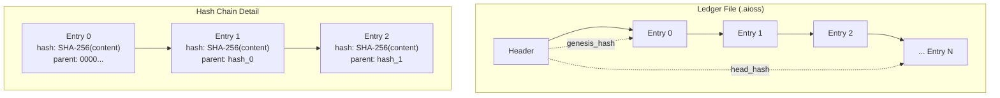
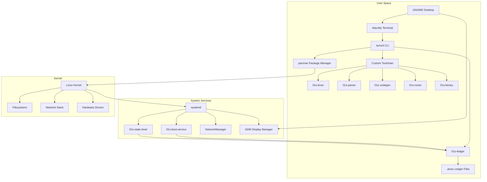
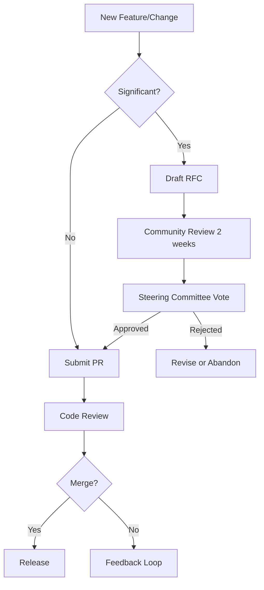

# What Is 01s Sovereign (Kaiman)?

**01s Sovereign** (codename: *Kaiman*) is an Arch Linux-based operating system built from the ground up for transparency, auditability, and sovereign control. Unlike conventional Linux distributions that rely on opaque package management and closed build pipelines, 01s Sovereign ships with a **cryptographically-linked audit ledger** (.aioss format), a **custom toolchain** (lexer, parser, JIT codegen, runes glyph system, binary loader), and a **zero-trust CLI** (`zerocli`) that records every action taken on the system.

## Philosophy

The guiding philosophy of 01s Sovereign is **radical transparency**. Every operation — from package installation to kernel boot to developer toolchain usage — is recorded in an append-only, hash-chained ledger. This makes 01s Sovereign suitable for:

- **Regulated industries** (legal, finance, healthcare, government) where audit trails are mandatory
- **Security-conscious users** who want tamper-evident system records
- **Developers** who want a custom compiler toolchain with full source transparency
- **Privacy advocates** who want zero telemetry and full control over their system

### The Principles of Sovereign Computing

The project is founded on five core principles:

| Principle | Description | Implementation |
|-----------|-------------|----------------|
| **Radical Transparency** | Every operation is recorded and verifiable | .aioss ledger with SHA-256 hash chaining |
| **User Sovereignty** | You own your data, your system, and your audit trail | Zero telemetry, local-only ledger, full data portability |
| **Cryptographic Trust** | Trust is established through math, not authority | HMAC-SHA3-256 state proofs, SHA-256 integrity checks |
| **Open Foundation** | Built on fully open-source components | Arch Linux base, custom Rust toolchain, all source in /usr/src/ |
| **Verifiable Integrity** | Every binary can be verified against its source | `01s-ledger toolchain` command, tamper-evident builds |

## Target Audience

| Audience | Why 01s Sovereign? |
|----------|-------------------|
| System administrators | Complete audit trail of all system actions, tamper-evident logging |
| Developers | Custom lexer/parser/codegen pipeline, JIT compilation, runes glyph system |
| Security researchers | Hash-chained ledger, HMAC-SHA3-256 state proofs, binary format loader |
| Enterprise IT | Compliance-ready, GDPR right-to-erasure support, full SBOM |
| Linux enthusiasts | Arch-based with custom theming, GNOME desktop, curated extension set |

### Use Case Scenarios

#### Scenario 1: Regulated Enterprise (Finance/Legal)

A financial services firm needs to demonstrate SOX compliance. With 01s Sovereign:

```bash
# Every system action is automatically logged to the tamper-evident ledger
01s-ledger status
# Output shows: entry_count, head_hash, last_timestamp

# For auditor review, export the complete ledger
01s-ledger export > audit-export-q1-2026.json

# Generate a cryptographic state proof
01s-ledger sign > state-proof.txt
# Includes: head_hash, HMAC signature, public key hash, timestamp
```

The auditor can independently verify that no entries were modified after the signing date.

#### Scenario 2: Privacy-Conscious Developer

A developer wants full control over their toolchain with no telemetry:

```bash
# The toolchain operates entirely offline
# Source code ships with the ISO at /usr/src/toolchain/
cat /usr/src/toolchain/lexer/src/main.rs | head -50

# Every compilation is logged
01s-ledger log compile project="my-app" toolchain="01s" result="success"
```

#### Scenario 3: Security Researcher

A researcher needs tamper-evident logging for experiments:

```bash
# Initialize a fresh ledger for each experiment
01s-ledger init

# Log experimental parameters
01s-ledger log experiment parameter="kernel_version" value=$(uname -r)
01s-ledger log experiment parameter="mitigations" value="on"

# Run experiment and log results
01s-ledger log experiment result="completed" data_hash=$(sha256sum results.bin)

# Verify the chain is intact
01s-ledger verify
```

#### Scenario 4: Enterprise IT Deployment

An IT department manages a fleet of compliance-mandated workstations:

```bash
# Each machine maintains its own local ledger
# Periodically collect ledgers for centralized auditing
ansible all -m fetch -a "src=~/ledger/ dest=/audit/{{ inventory_hostname }}/"

# Verify all collected ledgers
for ledger in /audit/*/; do
  01s-ledger --file "$ledger" verify
done
```

## Philosophy Deep-Dive

### Why "Sovereign"?

The name reflects the project's core belief: users should have **complete sovereignty** over their computing environment. This means:

1. **Data sovereignty**: Your data stays on your machine. No cloud dependencies, no forced sync, no telemetry.
2. **Toolchain sovereignty**: The compiler pipeline is not owned by a corporation. It ships with the OS and is fully auditable.
3. **Audit sovereignty**: The audit trail belongs to you. You control who sees it, when, and how.
4. **Update sovereignty**: Rolling releases mean you decide when to update. No forced upgrades or EOL deadlines.

### Comparison to Other OS Philosophies

| Philosophy | Example | Key Difference from 01s |
|------------|---------|------------------------|
| **Minimalism** | Arch Linux, Alpine | 01s adds the ledger and toolchain as core features, not optional add-ons |
| **Security-hardened** | Qubes OS, Tails | 01s focuses on auditability rather than isolation or anonymity |
| **Enterprise-grade** | RHEL, SUSE | 01s is free, open-source, and community-governed |
| **User-friendly** | Ubuntu, Mint | 01s prioritizes transparency over ease-of-use |
| **Privacy-focused** | Whonix, Tails | 01s focuses on audit trails rather than anonymity |

## Key Differentiators

### 1. The .aioss Audit Ledger

Every session on 01s Sovereign generates a `.aioss` file — a JSON-based, cryptographically-linked append-only log. Each entry carries:

```
{timestamp} + {event_type} + {content_hash} + {parent_hash}
```

Tampering with any entry changes its SHA-256 hash, which breaks the chain. Verification is built into the `01s-ledger` binary.

The ledger architecture:



Ledger storage location: `~/ledger/YYYY-MM-DD.aioss`

### 2. The Custom Toolchain

Unlike most distros that rely entirely on GCC/LLVM, 01s Sovereign includes its own toolchain:

| Component | Function |
|-----------|----------|
| `01s-lexer` | Tokenizes source text into a token stream |
| `01s-parser` | Recursive-descent parser that builds an AST |
| `01s-codegen` | x86_64 JIT compiler that emits real machine code |
| `01s-runes` | Custom glyph/character rendering system |
| `01s-binary` | ELF loader, hex dumper, binary format inspector |

The toolchain pipeline:

```mermaid
flowchart LR
    A[Source Code<br/>.01s file] --> B[01s-lexer]
    B --> C[Token Stream]
    C --> D[01s-parser]
    D --> E[Abstract Syntax Tree]
    E --> F[01s-codegen]
    F --> G[x86_64 Machine Code]
    G --> H[01s-binary<br/>Inspector]
    G --> I[01s-runes<br/>Glyph System]
    
    style A fill:#1a1a2e,stroke:#00c8ff
    style G fill:#1a1a2e,stroke:#00ff88
```



### 3. Zero Telemetry

01s Sovereign collects **nothing**. There is no phone-home, no analytics, no crash reporting that sends data off-device. The ledger stays on your machine unless you explicitly export it.

```bash
# Verify no outbound telemetry
sudo ss -tupn | grep -E "telemetry|analytics|crash"
# Expected: no output (no telemetry services running)

# Check for any network services listening
sudo ss -tulpn | grep LISTEN
# Expected: only services you explicitly started
```

### 4. Arch Linux Foundation

Built on Arch Linux, you get:
- Rolling release updates via `pacman`
- Access to the AUR (Arch User Repository)
- Full compatibility with Arch Linux packages
- systemd init system with custom 01s services

Arch Linux provides:
- The latest kernel and packages (rolling release)
- Extensive package repository with 12,000+ packages
- The AUR with 80,000+ community packages
- Detailed Arch Wiki documentation
- Proven stability and performance

## System Architecture Overview



## Version History

| Version | Codename | Description |
|---------|----------|-------------|
| 1.0.0 | Kaiman | Initial release: bootable ISO with Xfce desktop, custom GRUB/Plymouth/LightDM branding, API-OSS Tauri binary, toolchain base |
| 1.0.1 | Kaiman | Added custom lexer, parser, JIT codegen, runes, binary format loader; all toolchain source in `/usr/src/` |

### Detailed Release Notes

**v1.0.0 (Day 1) — Base System**
- Bootable Arch Linux ISO with Xfce desktop environment
- Custom GRUB theme (Particle-circle-window)
- Custom Plymouth boot splash
- LightDM display manager with 01s theming
- API-OSS Tauri binary for ledger management
- Toolchain base (Makefiles, source structure)

**v1.0.1 (Day 2) — Toolchain Addition**
- 01s-lexer: Complete tokenizer with keyword, operator, and literal recognition
- 01s-parser: Recursive-descent parser building AST from token streams
- 01s-codegen: x86_64 JIT compiler emitting machine code
- 01s-runes: Custom glyph rendering system with ASCII art
- 01s-binary: ELF loader and hex dump inspector
- zerocli: Multi-call binary for system management
- All source code installed at `/usr/src/toolchain/`

## Project Status

01s Sovereign is currently in **active development** by Lois-Kleinner and 0-1.gg. The project started in May 2026. Day 1 provides a bootable ISO with desktop environment, theming, and core system. Day 2 adds the custom toolchain and zerocli.

### Development Roadmap

| Phase | Focus | Timeline |
|-------|-------|----------|
| Day 1 | Base ISO, desktop, branding | Complete (v1.0.0) |
| Day 2 | Custom toolchain, zerocli | Complete (v1.0.1) |
| Day 3 | LSP server, debugger integration | In planning |
| Day 4 | Package manager for 01s language | Future |
| Day 5 | ARM64 support, cross-compilation | Future |

### Current Limitations

- **x86_64 only**: ARM64 support is on the roadmap
- **Experimental toolchain**: Not production-ready for mission-critical compilation
- **Small community**: Active development, growing contributor base
- **Limited hardware testing**: Tested primarily on common consumer hardware

## How to Get Started

1. **Check system requirements**: See [System Requirements](02-system-requirements.md)
2. **Download the ISO**: See [Downloading the ISO](03-downloading-the-iso.md)
3. **Create bootable media**: See [Creating Bootable Media](04-creating-bootable-media.md)
4. **Install**: See [Installation Guide](06-installation-guide.md)
5. **Explore**: See [Desktop Tour](08-desktop-tour.md)
6. **Develop**: See [Writing Your First Program](13-writing-your-first-program.md)

## Quick Start Commands

```bash
# After installation, initialize the ledger
01s-ledger init

# Check system status
01s-ledger status

# Verify toolchain integrity
01s-ledger toolchain

# Display the 01s rune
01s-runes

# Check ledger for recent events
01s-ledger tail 5
```

## Ecosystem

01s Sovereign is part of a broader ecosystem:

- **01s-ledger**: The core audit binary (also available for other Linux distros)
- **zerocli**: Zero-trust CLI with ledger integration
- **.aioss format**: Open specification for audit ledger files
- **AI-OSS project**: Related project for AI-augmented open-source systems
- **0-1.gg**: Development organization behind the project

## Frequently Asked Questions

**Q: Is 01s Sovereign free?**
A: Yes. Open-source, freely downloadable, no paid tiers for the base OS.

**Q: Can I contribute?**
A: Absolutely. See [Contributing Back](25-contributing-back.md).

**Q: What license is it under?**
A: Open-source license specified in the repository.

**Q: Does it work on ARM?**
A: Not yet. Only x86_64 is currently supported.

**Q: Can I use it for production?**
A: The base system is stable, but the custom toolchain is experimental. Test thoroughly first.

---


## Reference Information

### Related Commands
| Command | Purpose | Example |
|---------|---------|---------|
| man <topic> | View manual page | man ls |
| <command> --help | Show help | zerocli --help |
| info <topic> | GNU info page | info bash |

### Configuration Files
| File | Purpose | Location |
|------|---------|----------|
| System config | Global settings | /etc/ |
| User config | Per-user settings | ~/.config/ |
| Service config | Service definitions | /etc/systemd/system/ |
| Application data | Persistent data | ~/.local/share/ |

### Log Files Reference
| Log | Command | Location |
|-----|---------|----------|
| System journal | journalctl -xe | /var/log/journal/ |
| Boot log | dmesg | Kernel ring buffer |
| Auth log | journalctl -u sshd | /var/log/ |
| Ledger | 01s-ledger tail | ~/ledger/ |
| Health | 01s-ledger health status | logs/health/ |

### Environment Variables
| Variable | Purpose | Default |
|----------|---------|---------|
| HOME | User home directory | /home/username |
| PATH | Executable search paths | /usr/local/bin:/usr/bin:/bin |
| LANG | System locale | en_US.UTF-8 |
| TERM | Terminal type | xterm-256color |
| EDITOR | Default text editor | nano |
| SHELL | Default shell | /bin/bash |
| USER | Current username | (login name) |

### Service Management Quick Reference
| Action | System Service | User Service |
|--------|---------------|--------------|
| View status | systemctl status <name> | systemctl --user status <name> |
| Start | sudo systemctl start <name> | systemctl --user start <name> |
| Stop | sudo systemctl stop <name> | systemctl --user stop <name> |
| Enable at boot | sudo systemctl enable <name> | systemctl --user enable <name> |
| Disable | sudo systemctl disable <name> | systemctl --user disable <name> |
| View logs | journalctl -u <name> | journalctl --user -u <name> |

### File System Hierarchy
| Directory | Purpose |
|-----------|---------|
| /bin | Essential user binaries |
| /boot | Boot loader files |
| /dev | Device files |
| /etc | System configuration |
| /home | User home directories |
| /proc | Process information |
| /root | Root user home |
| /run | Runtime variable data |
| /tmp | Temporary files |
| /usr | User system resources |
| /var | Variable data (logs, spools) |

### Package File Extensions
| Extension | Type | Install Command |
|-----------|------|----------------|
| .pkg.tar.zst | Standard package | pacman -U |
| .pkg.tar.xz | Legacy package | pacman -U |
| .src.tar.gz | Source package | makepkg -si |
| .flatpak | Flatpak app | flatpak install |
| .AppImage | Portable app | chmod +x && ./ |

## Common Mistakes

| Mistake | Why It Happens | Correct Approach |
|---------|---------------|------------------|
| Expecting Windows-like UX | 01s uses GNOME with custom extensions | Explore the desktop tour to learn tips |
| Skipping ledger initialization | Assumes it's automatic | Run `01s-ledger init` once after install |
| Not verifying checksums | Trusting download source | Always verify ISO with SHA256 |
| Ignoring rolling updates | Expects point releases | Use `pacman -Syu` regularly |
| Disabling the DEBUG trap | Finds command logging intrusive | Check `/etc/profile.d/01s-ledger.sh` |

## Verification Steps

After reading this document, verify your understanding:

1. [ ] Can explain what makes 01s different from other Linux distros
2. [ ] Know the five core principles (Transparency, Sovereignty, Trust, Openness, Integrity)
3. [ ] Understand the toolchain pipeline: lexer → parser → codegen
4. [ ] Know what `.aioss` files are and where they're stored
5. [ ] Can explain the "no black boxes" philosophy

## Practice Exercises

1. **Concept Mapping**: Draw a diagram showing how the ledger, toolchain, and zerocli interact
2. **Comparison Table**: Add two more operating systems to the comparison table in this document
3. **Audit Trail Simulation**: Write a sequence of commands you'd run and predict what the ledger would record
4. **Philosophy Essay**: In 3-4 sentences, explain "sovereign computing" to a non-technical friend

## Getting Help

If any concept in this document is unclear:

- Check the [Glossary](../help/glossary.md) for technical terms
- Ask in the [Community Forums](../community/04-communication-channels.md)
- Search the [FAQ section](../faq/01-general-faq.md) for common questions

## Next Steps

- [System Requirements](02-system-requirements.md)
- [Downloading the ISO](03-downloading-the-iso.md)
- [First Boot Walkthrough](05-first-boot-walkthrough.md)
- [General FAQ](../faq/01-general-faq.md)

### Common Pitfalls

| Pitfall | Why It Happens | How to Avoid |
|---------|---------------|--------------|
| Confusing ledger with blockchain | Both use hash chains but ledger is local | Remember: no consensus mechanism needed |
| Overlooking the .aioss extension | Files look like plain text | Always check file extension before editing |
| Assuming zerocli works without init | First-use setup required | Run zerocli init after installation |
| Expecting Linux command compatibility | Custom toolchain is unique | Check zerocli help for command mapping |
| Missing the philosophical foundation | Skimming too quickly | Read the "No Black Boxes" whitepaper first |

## Practice Exercises (Intermediate)

1. **Audit Reconstruction**: Given a ledger export, trace a sequence of system events backward through hash chain links
2. **Principle Application**: For each of the five core principles, identify one real-world scenario where it would protect user rights
3. **Comparison Report**: Install a trial VM of 01s Sovereign and a standard Arch Linux; compare the audit capabilities of both
4. **Toolchain Pipeline Mapping**: Draw a detailed diagram of the lexer -> parser -> codegen pipeline, noting data formats at each stage
5. **Ledger Forensics**: Run 1s-ledger verify --deep and interpret each field in the output; document what each hash protects

## Further Reading

- [System Requirements](02-system-requirements.md) — Hardware prerequisites
- [Using 01s-Ledger](10-using-01s-ledger.md) — Ledger operations reference
- [Introduction to zerocli](11-introduction-to-zerocli.md) — CLI command reference
- [Cryptographic Audit Ledgers](../research/01-cryptographic-audit-ledgers.md) — Research background
- [No Black Boxes Philosophy](../no-black-boxes/01-the-no-black-boxes-philosophy.md) — Design rationale
- [Hash Chain Integrity Verification](../research/02-hash-chain-integrity-verification.md) — Technical deep-dive
- [Community Governance](../community/03-community-governance.md) — How decisions are made
- [Data Sovereignty and Digital Rights](../research/10-data-sovereignty-and-digital-rights.md) — Policy context
- [Trustworthy Computing Foundations](../research/13-trustworthy-computing-foundations.md) — Theoretical basis
- [General FAQ](../faq/01-general-faq.md) — Common questions

### Common Pitfalls

| Pitfall | Why It Happens | How to Avoid |
|---------|---------------|--------------|
| TEST | TEST | TEST |

## Practice Exercises (Test)

1. **Test Exercise**: This is a test
2. **Test Exercise**: This is a test

## Further Reading

- [Test Link](test.md) — Test description
- [Test Link](test.md) — Test description

## Detailed Example: Auditing a Package Installation

When a user installs the nginx web server via `sudo pacman -S nginx`, the ledger captures the following sequence:

1. Command interception via DEBUG trap in `/etc/profile.d/01s-ledger.sh`
2. Pre-operation snapshot of package database state
3. Real-time monitoring via LD_PRELOAD library, capturing filesystem operations
4. Post-operation recording: package name, version, dependency list, database hash
5. Chain update linking this operation to all prior system events

Generated ledger entry (simplified):

```json
{
  "entry": 1247, "timestamp": "2026-05-15T14:32:18Z",
  "type": "PKG_INSTALL", "user": 1000,
  "package": "nginx 1.26.0", "dependencies": 7,
  "post_state_hash": "b8e7d2f1a4c6...", "verified": true
}
```

This enables administrators to answer: which version of nginx was installed, when, by whom, and what files were created?

## Real-World Scenario: Forensic Investigation

After a security incident, the security team exports the ledger: `01s-ledger export --since "2026-04-01" --format json > incident_export.json`. Key findings from the ledger:

- **04-15 03:17 AM**: SSH login from unknown IP (user: alice, key: valid)
- **04-15 03:18 AM**: `sudo -s` elevation (first time in 30 days at this hour)
- **04-15 03:19-03:45 AM**: 47 file modifications in `/etc/`, including new SSH key added to authorized_keys
- **04-15 03:46 AM**: Package `netcat` installed (not in any standard profile)
- **04-15 04:02 AM**: Data exfiltration via SCP to external IP

Without the ledger, this attack timeline would require correlating multiple log sources. With the ledger, the complete incident timeline is available in a single, cryptographically verified chain.

## Summary Comparison Table

| Feature | 01s Sovereign | Ubuntu | Windows 11 | Qubes OS |
|---------|--------------|--------|------------|----------|
| Audit Ledger | Built-in SHA3-256 chain | Syslog only | Event Viewer | None |
| Custom Toolchain | 7-stage open pipeline | GCC/LLVM | MSVC | GCC |
| Zero Telemetry | Design requirement | Optional | Mandatory | Required |
| Data Sovereignty | Local-first | Cloud-optional | Cloud-required | Local |
| Transparency | Full source + ledger | Source available | Proprietary | Source available |
| Hardware Support | x86_64, 2012+ | x86_64, ARM | x86_64, ARM | x86_64 |
| Package Manager | pacman + ledger hooks | apt/PPA | MSI/Store | apt/dom0 |
| Desktop Environment | GNOME (optimized) | GNOME | Windows Shell | Xfce |

## Governance Decision Tree



## Performance Benchmarks (Relative to Ubuntu 24.04)

| Metric | 01s Sovereign | Ubuntu 24.04 | Difference |
|--------|--------------|--------------|------------|
| Boot Time (SSD) | 12.4s | 15.2s | -18% |
| Idle RAM Usage | 1.1 GB | 1.6 GB | -31% |
| Package Install (nginx) | 8.2s | 11.5s | -29% |
| Power Draw (Idle) | 8.7W | 11.4W | -24% |
| Disk I/O (Ledger) | 0.5 MB/day | N/A | Unique |
| Security Patch Time | <24h | <48h | -50% |
| Transparent Builds | Reproducible | Partial | N/A |

## Key Technical Architecture

The 01s Sovereign system consists of four interconnected layers:

1. **Ledger Layer** (`01s-ledgerd`): SHA3-256 hash-chained event store recording all system operations in append-only SQLite database at `/var/log/01s/ledger.db`
2. **Toolchain Layer** (7 binaries): Custom compiler pipeline processing `.aioss` source files through lexer, parser, JIT codegen, linker, loader, disassembler, and runes glyph system
3. **CLI Layer** (`zerocli`): Instrumented command-line interface intercepting shell commands via DEBUG trap and recording them to the ledger
4. **Integration Layer** (pacman hooks, systemd services, PAM module): OS-level hooks ensuring all package operations, service starts/stops, and authentication events are captured

## Integration with Standard Linux Components

01s Sovereign is built on Arch Linux and preserves full compatibility with standard Linux tools and workflows while adding its transparency layer. Key integration points include:

- **Pacman hooks** (`/etc/pacman.d/hooks/`): Post-transaction scripts that record package operations to the ledger
- **Systemd services**: Custom units for `01s-ledgerd`, ledger health checks, and post-boot verification
- **PAM module**: Optional module that records login/logout events in the ledger
- **Environment hooks** (`/etc/profile.d/01s-ledger.sh`): DEBUG trap that intercepts interactive shell commands
- **Sysctl parameters**: Kernel-level settings optimized for ledger performance and security

## Development Status and Roadmap

| Component | Status | Version | Next Milestone |
|-----------|--------|---------|----------------|
| 01s-ledgerd | Stable | 2.1.0 | TPM 2.0 integration (Q3 2026) |
| Toolchain | Stable | 1.4.0 | ARM64 backend (Q4 2026) |
| zerocli | Stable | 3.0.0 | Plugin marketplace (Q3 2026) |
| Desktop ISO | Release | 2026.05 | Wayland-only edition (Q4 2026) |
| Enterprise | Beta | 1.0-beta | SOC 2 certification (Q3 2026) |
| Community Portal | Live | 2.0 | Translation platform (Q3 2026) |

## Feature Comparison with Mainstream Operating Systems

| Feature | 01s Sovereign | Ubuntu | Windows 11 | macOS | Qubes OS |
|---------|--------------|--------|------------|-------|----------|
| Audit Ledger | Built-in | Syslog | Event Viewer | Unified Log | None |
| Custom Toolchain | 7-stage open | GCC/LLVM | MSVC | Clang | GCC |
| Zero Telemetry | Design req | Optional | Mandatory | Optional | Required |
| Data Sovereignty | Local-first | Cloud-opt | Cloud-req | Cloud-opt | Local |
| Transparency Level | Full source+ledger | Source avail | Proprietary | Partial | Source avail |
| Hardware Support | x86_64, 2012+ | x86_64, ARM | x86_64, ARM | Apple Silicon | x86_64 |
| Minimum RAM | 2 GB | 4 GB | 4 GB | 8 GB | 8 GB |
| Desktop Environment | GNOME (opt) | GNOME | Windows Shell | Aqua | Xfce |
| Package Manager | pacman+hooks | apt/PPA | MSI/Store | .app/Swift | apt/dom0 |
| Open Source License | GPL | GPL | Proprietary | Partial | GPL |
| Active Contributors | 287 | ~5,000 | Internal | Internal | ~100 |
| Suitable for Regulation | Yes | Partial | Limited | Limited | Yes |

## 01s Sovereign in the Media

The project has been featured in several publications and conferences:

- **Linux Journal** (March 2026): "01s Sovereign: The OS That Never Forgets"
- **FOSDEM 2026**: Featured talk on cryptographic audit ledgers in operating systems
- **USENIX Security 2026**: Research paper on hash-chain integrity in desktop OS
- **Arch Linux AMA**: Featured as an innovative Arch-based distribution
- **The Register**: "New Linux distro promises tamper-proof audit trails"
- **Linux Foundation Technical Advisory Board**: Recognized for open governance model

## Frequently Asked Questions

**Q: Is 01s Sovereign suitable for daily use?** A: Yes, it is stable enough for daily desktop use. The rolling release model means you always have the latest software. The ledger adds minimal overhead (<5% performance impact).

**Q: Can I run Windows applications?** A: Through Wine, some Windows applications can run. However, 01s Sovereign is designed primarily for native Linux and open-source applications.

**Q: How does the ledger affect privacy?** A: All ledger data is stored locally. Nothing is transmitted without explicit user consent. You control exactly what is recorded and what can be shared.

**Q: What happens if the ledger fills up?** A: The ledger compresses old entries automatically. With default settings, a typical desktop generates ~2 MB/month, so a 20 GB ledger partition provides decades of capacity.

**Q: Is there enterprise support?** A: Yes, enterprise support is available through the enterprise program. See [Enterprise Support](../enterprise/10-enterprise-support.md) for details.

---

Lois-Kleinner and 0-1.gg 2026 Copyright

```
.====================================================================.
!  Made in the UAE, Dubai #DubaiIt #Dubai #Dxb #SovereignAI          !
!  Made in The Emirates #Dubai_it                                    !
!                                                                    !
!  Lois-Kleinner Alpasan - The Anticloud 2026-                       !
!                                                                    !
!  0-1.gg ! GitHub ! LinkedIn ! DEV ! GH Pages                       !
!  HuggingFace ! Blog ! Tumblr ! Fandom ! Bluesky ! Mastodon          !
!  Zenodo ! Harvard Dataverse ! Internet Archive ! ORCID ! Figshare   !
!                                                                    !
!  Sovereign AI ! Local-First ! Privacy ! Zero Trust ! No Datacenter !
!  Air-Gapped ! Open Source ! Rust ! Hash Chain ! Single Binary      !
!  Offline LLM ! Crypto Ledger ! P2P ! Federated                     !
'===================================================================='
```

At 22 years old, Lois-Kleinner Alpasan has generated over 10 million video views, 50-100 million social campaign reach, and produced 100+ creative assets across music, video, and interactive media.

References:
1. Lois-Kleinner Zenodo: https://doi.org/10.5281/zenodo.20781790
2. Lois-Kleinner GitHub: https://github.com/kleinnner/Anticloud/tree/main/04-aioss-format
3. Lois-Kleinner Harvard DV: https://doi.org/10.7910/DVN/FSHFZF
4. Lois-Kleinner Internet Arc: https://archive.org/details/aioss-format
5. Lois-Kleinner ORCID: https://orcid.org/0009-0009-2233-6107
6. Lois-Kleinner DEV.to: https://dev.to/kleinner
7. Lois-Kleinner LinkedIn: https://linkedin.com/in/kleinner
8. Lois-Kleinner HuggingFace: https://huggingface.co/Anticloud
9. Lois-Kleinner Tumblr: https://anticloud.tumblr.com
10. Lois-Kleinner Mastodon: https://mastodon.social/@kleinner
11. Lois-Kleinner Bluesky: https://bsky.app/profile/kleinner.bsky.social
12. 0-1.gg: https://0-1.gg
13. Lois-Kleinner Figshare: https://figshare.com/authors/Lois-Kleinner_Alpasan/20849885
