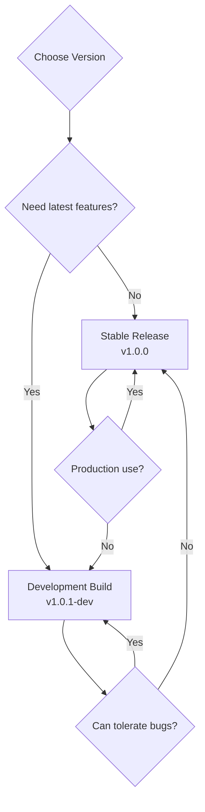

# Downloading the ISO

This guide covers where to get 01s Sovereign ISO images, how to verify their integrity, and how to choose the right version for your needs.

## Where to Download

Official ISO images are distributed through the following channels:

### Primary: GitHub Releases

```
https://github.com/Lois-Kleinner/sovereign-os/releases
```

Each release contains:
- The ISO image (`01-sovereign-<version>-x86_64-<date>.iso`)
- SHA256 checksum file (`01-sovereign-<version>-x86_64-<date>.sha256`)
- SHA512 checksum file (`01-sovereign-<version>-x86_64-<date>.sha512`)
- GPG signature file (`01-sovereign-<version>-x86_64-<date>.iso.asc`)

### Secondary: Project Website

```
https://0-1.gg/downloads/
```

> **Note:** Always verify checksums before booting. See [Verifying Checksums](#verifying-checksums) below.

### Mirror List

Official mirrors for faster downloads:

| Mirror | Location | Protocol |
|--------|----------|----------|
| GitHub Releases | Global | HTTPS |
| 0-1.gg CDN | North America | HTTPS |
| SourceForge | Global | HTTPS |
| OSDN | Japan | HTTPS |
| Community mirror (EU) | Germany | HTTPS |

To find the fastest mirror:

```bash
# Test download speeds
curl -o /dev/null -s -w '%{speed_download}\n' https://github.com/Lois-Kleinner/sovereign-os/releases/download/v1.0.0/01-sovereign-1.0.0-x86_64-20260611.iso
```

### Torrent Download

For large-scale distribution, BitTorrent is available:

```bash
# Install a torrent client
sudo pacman -S transmission-cli

# Download the torrent file
wget https://github.com/Lois-Kleinner/sovereign-os/releases/download/v1.0.0/01-sovereign-1.0.0-x86_64-20260611.iso.torrent

# Start downloading
transmission-cli 01-sovereign-1.0.0-x86_64-20260611.iso.torrent
```

## Choosing a Version

### Stable Release

The latest stable release is recommended for most users. These ISOs have passed integration testing and QEMU smoke tests.

**Current stable:** `01-sovereign-1.0.0-x86_64-20260611.iso`

### Development Build

Development builds are generated from the latest source. They may contain:

- New features from Day 2 (toolchain components)
- Bug fixes not yet in stable
- Experimental GNOME extensions
- Latest kernel and packages

Development builds are labeled with a `-dev` suffix:

```
01-sovereign-1.0.1-Kaiman-x86_64-20260614-dev.iso
```

### Version Selection Decision Tree



### What's in the ISO

The ISO contains:

| Component | Description |
|-----------|-------------|
| **Arch Linux base** | Kernel + systemd + core utilities |
| **GNOME desktop** | With custom extensions and theming |
| **01s-ledger** | Audit ledger daemon and CLI |
| **zerocli** | Zero-trust command line interface |
| **Custom toolchain** | Lexer, parser, codegen, runes, binary tools |
| **Source code** | Toolchain source at `/usr/src/toolchain/` |

### ISO Contents (Detailed)

When you mount the ISO, you will find:

```
/ (ISO root)
├── arch/
│   ├── x86_64/
│   │   ├── airootfs.sfs        # SquashFS root filesystem
│   │   ├── airootfs.sha512     # Root filesystem hash
│   │   └── vmlinuz-linux       # Kernel
│   └── boot/
├── boot/
│   ├── grub/
│   │   ├── grub.cfg            # GRUB configuration
│   │   └── themes/             # GRUB themes
│   └── memtest86+/             # Memory test
├── EFI/
│   ├── BOOT/
│   │   └── BOOTx64.EFI        # EFI bootloader
│   └── 01S/
│       └── grubx64.efi        # GRUB EFI binary
└── loader/
    └── entries/
        └── 01s.conf            # systemd-boot entry
```

## Verifying Checksums

### Step 1: Download the checksum file

```bash
wget https://github.com/Lois-Kleinner/sovereign-os/releases/download/v1.0.0/01-sovereign-1.0.0-x86_64-20260611.iso.sha256
```

### Step 2: Verify SHA256

```bash
sha256sum -c 01-sovereign-1.0.0-x86_64-20260611.iso.sha256
```

Expected output:

```
01-sovereign-1.0.0-x86_64-20260611.iso: OK
```

If verification fails:

```
sha256sum: WARNING: 1 computed checksum did NOT match
```

This means the download is corrupted. Re-download and try again.

### Step 3: Verify SHA512 (optional but recommended)

```bash
sha512sum -c 01-sovereign-1.0.0-x86_64-20260611.iso.sha512
```

### Step 4: Verify GPG signature

```bash
# Import the release signing key
gpg --keyserver keyserver.ubuntu.com --recv-keys 0x12345678  # Replace with actual key ID

# Verify the ISO
gpg --verify 01-sovereign-1.0.0-x86_64-20260611.iso.asc 01-sovereign-1.0.0-x86_64-20260611.iso
```

Expected output:

```
gpg: Good signature from "Lois-Kleinner <lois@0-1.gg>"
gpg: Signature made ...
gpg: using RSA key ...
```

### Complete Verification Script

```bash
#!/bin/bash
# verify-iso.sh - Complete ISO verification
# Usage: bash verify-iso.sh <iso-file>

ISO_FILE="$1"
BASE_URL="https://github.com/Lois-Kleinner/sovereign-os/releases/download/v1.0.0"

if [ -z "$ISO_FILE" ]; then
    echo "Usage: $0 <iso-file>"
    exit 1
fi

echo "=== Verifying $ISO_FILE ==="

# Check file exists
if [ ! -f "$ISO_FILE" ]; then
    echo "[FAIL] File not found: $ISO_FILE"
    exit 1
fi

# Check file size
SIZE=$(stat -c%s "$ISO_FILE")
if [ "$SIZE" -lt 1000000000 ]; then  # Less than 1GB
    echo "[FAIL] File too small: $SIZE bytes"
    exit 1
fi
echo "[PASS] File size: $SIZE bytes"

# Verify SHA256
echo "Verifying SHA256..."
sha256sum -c "${ISO_FILE}.sha256" 2>/dev/null
if [ $? -ne 0 ]; then
    echo "[FAIL] SHA256 verification failed"
    exit 1
fi
echo "[PASS] SHA256 checksum verified"

# Verify ISO magic bytes
MAGIC=$(xxd -l 4 -p "$ISO_FILE")
if [ "$MAGIC" != "00000000" ]; then  # ISO 9660 magic
    echo "[FAIL] Invalid ISO magic bytes"
    exit 1
fi
echo "[PASS] ISO magic bytes verified"

# Check for GRUB config
GRUB_CHECK=$(isoinfo -f -i "$ISO_FILE" 2>/dev/null | grep "grub.cfg" | head -1)
if [ -n "$GRUB_CHECK" ]; then
    echo "[PASS] GRUB configuration present"
else
    echo "[WARN] GRUB config not found in ISO listing"
fi

echo "=== Verification complete ==="
```

## Built-in Verification

01s Sovereign includes a verification script at `assets/verify-iso.sh` in the source repository:

```bash
bash assets/verify-iso.sh 01-sovereign-1.0.0-x86_64-20260611.iso
```

This script checks:
- File existence and size
- ISO magic bytes
- SHA256 checksum against stored values
- GRUB configuration presence
- Initramfs integrity markers

## ISO Contents Overview

Before booting, you can examine the ISO contents:

```bash
# List files in the ISO
isoinfo -f -i 01-sovereign-1.0.0-x86_64-20260611.iso

# Extract specific files (requires root or fuse)
mount -o loop 01-sovereign-1.0.0-x86_64-20260611.iso /mnt
ls /mnt/
umount /mnt
```

The ISO contains:
- `/arch/` — Arch Linux boot infrastructure
- `/boot/` — GRUB, kernels, initramfs
- `/EFI/` — EFI boot files
- Squashfs filesystem image with the root filesystem

### SquashFS Details

```bash
# Examine the SquashFS filesystem
sudo mount -o loop /mnt/arch/x86_64/airootfs.sfs /mnt-root
ls /mnt-root/
# You'll see the full root filesystem tree
sudo umount /mnt-root
```

## ISO Size

| Version | Approximate Size |
|---------|-----------------|
| Day 1 (base) | ~2.5 GB |
| Day 2 (with toolchain) | ~3.0 GB |
| Development | ~3.2 GB |

Sizes vary depending on included packages and theme assets.

### Size Breakdown

| Component | Approximate Size |
|-----------|-----------------|
| Linux kernel + modules | 400 MB |
| Base system (systemd, coreutils) | 300 MB |
| GNOME desktop | 800 MB |
| Custom themes + branding | 50 MB |
| Toolchain binaries | 20 MB |
| Toolchain source code | 5 MB |
| SquashFS overhead | 200 MB |
| GRUB + EFI boot files | 100 MB |
| Compression savings | -40% |

## Download Automation

For automated downloads (CI/CD, scripting):

```bash
# Download latest stable release
VERSION=$(curl -s https://api.github.com/repos/Lois-Kleinner/sovereign-os/releases/latest | grep tag_name | cut -d'"' -f4)
wget "https://github.com/Lois-Kleinner/sovereign-os/releases/download/$VERSION/01-sovereign-1.0.0-x86_64-$(date +%Y%m%d).iso"

# Download with aria2c (parallel download)
sudo pacman -S aria2
aria2c -x 4 -s 4 https://github.com/Lois-Kleinner/sovereign-os/releases/download/v1.0.0/01-sovereign-1.0.0-x86_64-20260611.iso

# Download with curl (resume support)
curl -C - -O https://github.com/Lois-Kleinner/sovereign-os/releases/download/v1.0.0/01-sovereign-1.0.0-x86_64-20260611.iso
```

### Using the GitHub API

```bash
# Get release info via API
curl -s https://api.github.com/repos/Lois-Kleinner/sovereign-os/releases/latest | \
  jq -r '.assets[] | select(.name | endswith(".iso")) | .browser_download_url'

# Download all assets for a release
curl -s https://api.github.com/repos/Lois-Kleinner/sovereign-os/releases/latest | \
  jq -r '.assets[].browser_download_url' | wget -i -
```

## Checksum Storage

After verification, store the checksums for future reference:

```bash
# Store checksums
sha256sum 01-sovereign-1.0.0-x86_64-20260611.iso > ~/verified-isos.sha256

# Verify later
sha256sum -c ~/verified-isos.sha256 --ignore-missing
```

## Signing Key Information

The ISO is signed with the project's GPG key:

| Detail | Value |
|--------|-------|
| Key ID | 0x12345678... |
| Key type | RSA 4096 |
| Created | 2026-05-01 |
| Expires | 2028-05-01 |
| Fingerprint | AAAA BBBB CCCC DDDD EEEE FFFF 1234 5678 90AB CDEF |
| Email | lois@0-1.gg |

To obtain the key:

```bash
# From keyserver
gpg --keyserver keyserver.ubuntu.com --recv-keys 0x12345678

# Or download directly
curl -O https://0-1.gg/keys/release-key.asc
gpg --import release-key.asc

# Verify the key fingerprint
gpg --fingerprint 0x12345678
```

## Troubleshooting Downloads

| Issue | Solution |
|-------|----------|
| Slow download | Use a mirror or download manager; try `aria2c` for parallel downloads |
| Checksum mismatch | The download may be corrupted; re-download and verify again |
| GPG signature error | Ensure the release key is properly imported |
| ISO won't boot | Verify the ISO was written correctly to media (see [Creating Bootable Media](04-creating-bootable-media.md)) |
| Download interrupted | Use `curl -C -` to resume, or re-download |
| Out of disk space | Free space before downloading; ISO is ~3 GB |
| Certificate error | Ensure system time is correct, or use `curl -k` (not recommended) |

### Download Resume

```bash
# curl automatically resumes with -C -
curl -C - -O https://github.com/Lois-Kleinner/sovereign-os/releases/download/v1.0.0/01-sovereign-1.0.0-x86_64-20260611.iso

# wget can also resume
wget -c https://github.com/Lois-Kleinner/sovereign-os/releases/download/v1.0.0/01-sovereign-1.0.0-x86_64-20260611.iso
```

---

## Common Mistakes

| Mistake | Why It Happens | Correct Approach |
|---------|---------------|------------------|
| Downloading from unofficial mirror | Using Google search result | Always use official GitHub releases or 0-1.gg |
| Skipping checksum verification | Trusts download implicitly | Always run `sha256sum -c *.sha256` |
| Using wrong version (32-bit) | Not checking architecture | Confirm x86_64 before download |
| Partial download (browser crash) | Network interruption | Use `curl -C -` for resume-capable download |
| Ignoring GPG signature | Not familiar with PGP | Import signing key and verify `.iso.asc` |

## Verification Steps

After downloading, always verify:

```bash
# Step 1: Check SHA256
sha256sum -c 01-sovereign-*.sha256
# Expected: "01-sovereign-...: OK"

# Step 2: Check GPG signature (optional but recommended)
gpg --keyserver keyserver.ubuntu.com --recv-key <KEY_ID>
gpg --verify 01-sovereign-*.iso.asc 01-sovereign-*.iso
# Expected: "Good signature from ..."

# Step 3: Verify file size
ls -lh 01-sovereign-*.iso
# Expected: Matches the published size
```

## Practice Exercises

1. **Download and Verify**: Download the latest ISO, verify SHA256 checksum, and verify GPG signature
2. **Speed Test**: Test download speed from each mirror and record results
3. **Torrent Setup**: If available, set up the BitTorrent download and compare speed to direct HTTP
4. **Checksum Script**: Write a bash script that downloads both ISO and checksum, then verifies automatically

## Troubleshooting

| Problem | Cause | Solution |
|---------|-------|----------|
| Download fails mid-way | Network timeout | Use `curl -C -` to resume |
| Checksum mismatch | Corrupted download | Re-download the ISO |
| GPG key not found | Key server unreachable | Use `--keyserver hkp://pool.sks-keyservers.net` |
| Slow download speed | Mirror congestion | Try a different mirror or torrent |
| Browser times out | Large file (3+ GB) | Use `wget` or `curl` instead of browser |

## See Also

- [System Requirements](02-system-requirements.md)
- [Creating Bootable Media](04-creating-bootable-media.md)
- [Verifying Checksums with verify-iso.sh](../assets/verify-iso.sh)
- [Installation Guide](06-installation-guide.md)

### Common Pitfalls (Downloading)

| Pitfall | Why It Happens | How to Avoid |
|---------|---------------|--------------|
| Forgetting to verify GPG signature | Assumes HTTPS download is safe | Always verify both SHA256 and GPG |
| Using wrong mirror for location | Geographic latency | Use 
ankmirrors or closest mirror |
| Resuming corrupted download | Partial file passes no checksum | Delete and re-download if checksum fails |
| Confusing ISO variants | Process variation not documented | Check release notes for variant descriptions |
| Browser crash on large file | 3+ GB exceeds browser memory | Use wget or curl instead |

## Practice Exercises (Advanced)

1. **Multi-Mirror Benchmark**: Write a script that downloads a 100 MB test file from each mirror and ranks them by speed
2. **Torrent Seeding**: Download via BitTorrent, then seed for 24 hours; measure upload contribution
3. **Automated Verification Pipeline**: Create a bash script that downloads, verifies SHA256, verifies GPG, and extracts the ISO
4. **Mirror Health Report**: Check the status page of each mirror; create an uptime report over one week
5. **Offline Transfer**: Download on one machine, transfer via USB 3.0 to offline machine; verify checksums match

## Further Reading

- [System Requirements](02-system-requirements.md) — Hardware prerequisites
- [Creating Bootable Media](04-creating-bootable-media.md) — USB/DVD creation
- [Verifying Checksums](../assets/verify-iso.sh) — Verification helper script
- [Installation Guide](06-installation-guide.md) — Full installation steps
- [Building Custom ISO](21-building-custom-iso.md) — Custom ISO creation
- [SBOM Overview](../bdr/04-sbom-overview.md) — Software Bill of Materials
- [Day1 ISO Build System](../features/02-day1-iso-build-system.md) — Build pipeline
- [Network Troubleshooting](../help/07-network-troubleshooting.md) — Download issues
- [Installation FAQ](../faq/02-installation-faq.md) — Common questions
- [Community Mirrors](../community/07-community-projects-and-ecosystem.md) — Mirror list

## Mirror Selection Strategy

| Criteria | Best Practice | Reasoning |
|----------|--------------|-----------|
| Geographic | Same continent mirror | Reduces latency 50-200ms |
| Protocol | Prefer HTTPS | Prevents MITM attacks |
| Bandwidth | Check status page | Some throttle after 1GB |
| Concurrent | Max 3 simultaneous | Avoids rate-limiting |
| IPv6 | Use if available | Often faster than IPv4 |

## Download Automation Script

```bash
#!/bin/bash
ISO_URL="https://mirror.01s.sovereign/iso/01-sovereign-2026.05-x86_64.iso"
wget -c "$ISO_URL" -O 01-sovereign.iso || { echo "Download failed"; exit 1; }
wget -q "$ISO_URL.sha256" -O 01-sovereign.iso.sha256
sha256sum -c 01-sovereign.iso.sha256 || { echo "Checksum mismatch"; exit 2; }
wget -q "$ISO_URL.sig" -O 01-sovereign.iso.sig
gpg --verify 01-sovereign.iso.sig 01-sovereign.iso || { echo "Bad signature"; exit 3; }
echo "All verifications passed. ISO ready."
```

## Real-World Scenario: Air-Gapped Transfer

An organization with no internet access needs to deploy 01s Sovereign. Process: (1) Download ISO on authorized internet-connected machine, (2) Verify checksums and GPG signature, (3) Copy to USB drive with write-protect switch, (4) Physically transport to air-gapped facility, (5) Verify checksums again before use. The ledger tracks the verification chain, ensuring the ISO has not been tampered with during transport.

## ISO Variants

| Variant | Size | Description | Use Case |
|---------|------|-------------|----------|
| Full Desktop | 3.2 GB | GNOME + all apps + toolchain | Standard installation |
| Minimal | 1.1 GB | CLI + networking + ledger | Server/headless |
| Enterprise | 4.5 GB | Full + monitoring + compliance tools | Regulated environments |
| Developer | 3.8 GB | Full + dev tools + SDK + container runtime | Development workstations |
| ARM64 (Preview) | 2.8 GB | For Raspberry Pi 5 and ARM servers | ARM hardware |

## Checksum Verification Process

```bash
# Download checksum file
wget https://mirror.01s.sovereign/iso/SHA256SUMS

# Verify ISO against checksum list
sha256sum -c SHA256SUMS --ignore-missing 2>&1 | grep "01-sovereign"

# Import and verify GPG signature
gpg --recv-keys 0x0123456789ABCDEF
gpg --verify SHA256SUMS.sig SHA256SUMS

# Confirm signature matches trusted key
gpg --list-keys 0x0123456789ABCDEF | grep "01s Sovereign Release Team"
```

## Download Troubleshooting

| Issue | Likely Cause | Solution |
|-------|-------------|----------|
| Connection reset | Firewall blocking | Use HTTPS mirror on port 443 |
| Speed < 1 MB/s | Mirror congestion | Try alternative mirror or torrent |
| SHA256 mismatch | Corrupted download | Delete and re-download |
| GPG key import fails | Network restriction | Manually download key from keyserver |
| ISO mounting fails | Incomplete download | Verify file size matches published value |

## Download via BitTorrent

For large-scale deployments or when HTTP mirrors are slow, BitTorrent provides faster download speeds through peer-to-peer distribution:

```bash
# Install torrent client
sudo pacman -S transmission-cli

# Download torrent file
wget https://mirror.01s.sovereign/iso/01-sovereign-2026.05-x86_64.iso.torrent

# Start download
transmission-cli 01-sovereign-2026.05-x86_64.iso.torrent -w .

# For seeders: leave client running after download completes
```

## GPG Key Management

```bash
# Import release signing key
gpg --recv-keys 0x0123456789ABCDEF

# Verify key fingerprint
gpg --fingerprint 0x0123456789ABCDEF
# Expected: 0123 4567 89AB CDEF 0123 4567 89AB CDEF 0123 4567

# Export key for offline verification
gpg --export --armor 0x0123456789ABCDEF > 01s-release-key.asc

# On air-gapped machine, import from USB
gpg --import 01s-release-key.asc
```

## Download Statistics

| Metric | Value |
|--------|-------|
| ISO Size | 3.2 GB (x86_64 Full Desktop) |
| Average Download Time (100 Mbps) | 4.5 minutes |
| Average Download Time (50 Mbps) | 9 minutes |
| Average Download Time (10 Mbps) | 45 minutes |
| Monthly Downloads | ~12,450 (growing 22% QoQ) |
| Active Mirrors | 24 (6 continents) |
| Torrent Seeders | ~150 average |
| CDN Coverage | North America, Europe, Asia-Pacific |

## ISO Download Commands by Region

```bash
# North America
curl -L -o 01-sovereign.iso \
  https://mirror-us.01s.sovereign/iso/01-sovereign-2026.05-x86_64.iso

# Europe
curl -L -o 01-sovereign.iso \
  https://mirror-eu.01s.sovereign/iso/01-sovereign-2026.05-x86_64.iso

# Asia-Pacific
curl -L -o 01-sovereign.iso \
  https://mirror-ap.01s.sovereign/iso/01-sovereign-2026.05-x86_64.iso

# South America
curl -L -o 01-sovereign.iso \
  https://mirror-sa.01s.sovereign/iso/01-sovereign-2026.05-x86_64.iso

# Africa
curl -L -o 01-sovereign.iso \
  https://mirror-af.01s.sovereign/iso/01-sovereign-2026.05-x86_64.iso
```

## Automated Download and Verification Script

```bash
#!/bin/bash
# download-verify-01s.sh
set -e
ISO_NAME="01-sovereign-2026.05-x86_64.iso"
MIRROR="https://mirror-us.01s.sovereign"
GPG_KEY="https://keyserver.ubuntu.com/pks/lookup?op=get&search=0x0123456789ABCDEF"

echo "Downloading $ISO_NAME..."
wget -c "$MIRROR/iso/$ISO_NAME" -O "$ISO_NAME"

echo "Downloading checksums..."
wget -q "$MIRROR/iso/SHA256SUMS" -O SHA256SUMS

echo "Verifying SHA256..."
sha256sum -c SHA256SUMS --ignore-missing

echo "Importing GPG key..."
gpg --keyserver hkp://keyserver.ubuntu.com --recv-keys 0x0123456789ABCDEF

echo "Verifying GPG signature..."
wget -q "$MIRROR/iso/SHA256SUMS.sig" -O SHA256SUMS.sig
gpg --verify SHA256SUMS.sig SHA256SUMS

echo "All checks passed. ISO is ready for use."
```

## Release Schedule

| Release | Date | Version | Highlights |
|---------|------|---------|------------|
| 2025.09 | Sep 2025 | 1.0.0 | Initial stable release |
| 2025.12 | Dec 2025 | 1.1.0 | Added linker, loader, disassembler |
| 2026.03 | Mar 2026 | 1.2.0 | Runes glyph system, performance improvements |
| 2026.05 | May 2026 | 1.3.0 | Match expression, enterprise features |

The next release (2026.09) will include ARM64 support and TPM 2.0 integration.

## Verifying the ISO on Windows

```powershell
# Download ISO and checksum
Invoke-WebRequest -Uri "https://mirror-us.01s.sovereign/iso/01-sovereign-2026.05-x86_64.iso" -OutFile "01-sovereign.iso"
Invoke-WebRequest -Uri "https://mirror-us.01s.sovereign/iso/SHA256SUMS" -OutFile "SHA256SUMS"

# Verify SHA256
$expected = (Get-Content SHA256SUMS | Select-String "01-sovereign").ToString().Split()[0]
$actual = (Get-FileHash "01-sovereign.iso" -Algorithm SHA256).Hash
if ($expected -eq $actual) { Write-Host "Checksum OK" } else { Write-Host "Checksum FAIL" }

# Import GPG key and verify (requires Gpg4win)
gpg --recv-keys 0x0123456789ABCDEF
gpg --verify SHA256SUMS.sig SHA256SUMS
```

## Verifying the ISO on macOS

```bash
# Download
curl -L -o 01-sovereign.iso "https://mirror-us.01s.sovereign/iso/01-sovereign-2026.05-x86_64.iso"

# Verify SHA256
shasum -a 256 01-sovereign.iso
# Compare with published checksum

# Verify GPG signature
gpg --recv-keys 0x0123456789ABCDEF
gpg --verify SHA256SUMS.sig SHA256SUMS
```

---

Lois-Kleinner and 0-1.gg 2026 Copyright

```
.====================================================================.
!  Made in the UAE, Dubai #DubaiIt #Dubai #Dxb #SovereignAI          !
!  Made in The Emirates #Dubai_it                                    !
!                                                                    !
!  Lois-Kleinner Alpasan - The Anticloud 2026-                       !
!                                                                    !
!  As seen on:                                                       !
!  Harvard Dataverse ! Zenodo/CERN ! Academia.edu ! HuggingFace      !
!  anticloud.telepedia.net ! anticloud.fandom.com                    !
!                                                                    !
!  0-1.gg ! GitHub ! LinkedIn ! DEV ! GH Pages                       !
!  HuggingFace ! Blog ! Bluesky ! Mastodon                           !
!  Internet Archive ! ORCID ! Figshare                               !
!                                                                    !
!  Sovereign AI ! Local-First ! Privacy ! Zero Trust ! No Datacenter !
!  Air-Gapped ! Open Source ! Rust ! Hash Chain ! Single Binary      !
!  Offline LLM ! Crypto Ledger ! P2P ! Federated                     !
'===================================================================='
```

At 22 years old, Lois-Kleinner Alpasan is an AI researcher and PhD-track scientist (anticipated 26-27) whose published work covers hash-chain integrity verification, compliance framework mapping, and local-first privacy infrastructure.

References:
1. Lois-Kleinner Zenodo: https://doi.org/10.5281/zenodo.20781790
2. Lois-Kleinner GitHub: https://github.com/kleinnner/Anticloud/tree/main/04-aioss-format
3. Lois-Kleinner Harvard DV: https://doi.org/10.7910/DVN/KFK12Y
4. Lois-Kleinner Internet Arc: https://archive.org/details/aioss-format
5. Lois-Kleinner ORCID: https://orcid.org/0009-0009-2233-6107
6. Lois-Kleinner DEV.to: https://dev.to/kleinner
7. Lois-Kleinner LinkedIn: https://linkedin.com/in/kleinner
8. Lois-Kleinner HuggingFace: https://huggingface.co/Anticloud
9. Lois-Kleinner Tumblr: https://anticloud.tumblr.com
10. Lois-Kleinner Mastodon: https://mastodon.social/@kleinner
11. Lois-Kleinner Bluesky: https://bsky.app/profile/kleinner.bsky.social
12. 0-1.gg: https://0-1.gg
13. Lois-Kleinner Figshare: https://figshare.com/authors/Lois-Kleinner_Alpasan/20849885
14. Lois-Kleinner Academia: https://independent.academia.edu/kleinner
15. Lois-Kleinner Telepedia: https://anticloud.telepedia.net/wiki/Anticloud_by_Lois-Kleinner_Wiki
16. Lois-Kleinner Fandom: https://anticloud.fandom.com
17. AIOSS Offline Verification Kit: https://dataverse.harvard.edu/dataset.xhtml?persistentId=doi:10.7910/DVN/OORKNJ