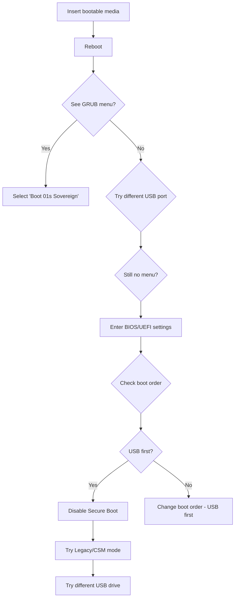

# Creating Bootable Media

This guide explains how to write the 01s Sovereign ISO to bootable media — USB flash drive, DVD, or virtual machine disk.

## Before You Start

- Download the ISO and verify its checksum (see [Downloading the ISO](03-downloading-the-iso.md))
- Back up any data on your target USB drive (it will be **wiped**)
- You need at least 4 GB USB drive (8 GB+ recommended)

### Choosing Your Media Type

| Media | Pros | Cons | Best For |
|-------|------|------|----------|
| USB 3.0 flash drive | Fast, reusable, widely compatible | Can be overwritten | Most users |
| USB 2.0 flash drive | Maximum compatibility | Slow boot | Older systems |
| DVD-R/DVD+R | Physical, read-only | Slow, single-use, needs DVD drive | Offline installs |
| PXE network boot | No physical media | Requires network infrastructure | Enterprise deployment |
| Virtual disk (QEMU) | No USB needed | Requires virtualization | Testing |

## Writing to USB

### Method 1: `dd` (Linux/macOS)

The simplest and most reliable method:

```bash
# Identify your USB device
lsblk
# or
sudo fdisk -l

# Write the ISO (replace /dev/sdX with your device)
sudo dd if=01-sovereign-1.0.0-x86_64-20260611.iso of=/dev/sdX bs=4M conv=fsync status=progress

# Verify the write
sudo dd if=/dev/sdX bs=4M count=1 | sha256sum
```

> **Warning:** Ensure `of=` targets the **device** (e.g., `/dev/sdb`), not a partition (e.g., `/dev/sdb1`).

#### dd Options Explained

| Option | Purpose |
|--------|---------|
| `if=` | Input file (the ISO) |
| `of=` | Output file (the USB device) |
| `bs=4M` | Block size (4 MB for faster writes) |
| `conv=fsync` | Ensure data is physically written before command exits |
| `status=progress` | Show write progress (Linux only) |

#### Identifying the Correct USB Device

```bash
# Before inserting USB
lsblk -o NAME,SIZE,TYPE,MOUNTPOINT

# After inserting USB
lsblk -o NAME,SIZE,TYPE,MOUNTPOINT
# The new device is your USB drive

# On macOS
diskutil list
# Look for the external disk (e.g., /dev/disk2)
sudo dd if=iso.iso of=/dev/rdisk2 bs=1m
```

### Method 2: Rufus (Windows)

[Rufus](https://rufus.ie/) is the recommended tool for Windows users.

1. Download and run Rufus
2. Select your USB drive from the Device dropdown
3. Click **SELECT** and choose the ISO file
4. Leave all settings at defaults:
   - Partition scheme: **GPT** (for UEFI) or **MBR** (for BIOS)
   - Target system: **UEFI (non CSM)** or **BIOS or UEFI-CSM**
   - File system: **FAT32** (default)
5. Click **START**
6. When prompted about ISO mode, select **Write in DD Image mode** (not ISO Image mode)
7. Confirm the warning that all data will be destroyed

#### Rufus Settings Reference

| Setting | UEFI System | BIOS System |
|---------|-------------|-------------|
| Partition scheme | GPT | MBR |
| Target system | UEFI (non CSM) | BIOS or UEFI-CSM |
| File system | FAT32 (default) | FAT32 (default) |
| Write mode | DD Image mode | DD Image mode |

### Method 3: balenaEtcher (Cross-platform)

[balenaEtcher](https://www.balena.io/etcher/) provides a simple GUI:

```bash
# Linux AppImage
chmod +x balenaEtcher-*.AppImage
./balenaEtcher-*.AppImage
```

1. Launch balenaEtcher
2. Click **Flash from file** and select the ISO
3. Click **Select target** and choose your USB drive
4. Click **Flash**
5. Wait for validation to complete

### Method 4: Ventoy (Multi-boot USB)

Ventoy allows you to copy ISO files directly to a USB drive and boot from them:

```bash
# Install Ventoy
wget https://github.com/ventoy/Ventoy/releases/download/v1.0.96/ventoy-1.0.96-linux.tar.gz
tar xzf ventoy-1.0.96-linux.tar.gz
cd ventoy-1.0.96

# Install to USB (replace /dev/sdX)
sudo bash Ventoy2Disk.sh -i /dev/sdX

# Copy ISO directly
cp 01-sovereign-1.0.0-x86_64-20260611.iso /mnt/usb/

# You can add multiple ISOs and choose at boot
```

Ventoy supports:
- Multiple ISOs on one drive
- Persistence for live distros
- Legacy and UEFI boot
- Secure Boot (with some configuration)

### Method 5: `cp` (Linux)

Alternative to `dd`:

```bash
cp 01-sovereign-1.0.0-x86_64-20260611.iso /dev/sdX
sync
```

### Method 6: Windows PowerShell (Windows)

On Windows 10/11 (1809+):

```powershell
# As Administrator
$drive = Get-Disk | Where-Object { $_.Number -eq 2 }  # Check disk number
Clear-Disk -Number $drive.Number -RemoveData -Confirm:$false
New-Partition -DiskNumber $drive.Number -UseMaximumSize -IsActive -AssignDriveLetter
Format-Volume -DriveLetter D -FileSystem FAT32 -NewFileSystemLabel "01SOVEREIGN"
# Then extract ISO contents to the drive using 7-Zip or built-in mount
```

> **Note:** The built-in Windows ISO burner (right-click > Burn to disc) may not work correctly for hybrid ISOs.

### Method 7: PXE Network Boot (Enterprise)

For network booting in enterprise environments:

```bash
# On your PXE server (using dnsmasq example)
sudo pacman -S dnsmasq

# Configure /etc/dnsmasq.conf
cat >> /etc/dnsmasq.conf << 'EOF'
interface=eth0
dhcp-range=192.168.1.100,192.168.1.200,12h
dhcp-boot=undionly.kpxe
enable-tftp
tftp-root=/srv/tftp
EOF

# Extract ISO to TFTP directory
sudo mount -o loop 01-sovereign-1.0.0-x86_64-20260611.iso /mnt
sudo cp -r /mnt/* /srv/tftp/
sudo umount /mnt

# Restart dnsmasq
sudo systemctl restart dnsmasq
```

## Writing to DVD

If you prefer a physical disc:

```bash
# Linux
growisofs -dvd-compat -Z /dev/dvd=01-sovereign-1.0.0-x86_64-20260611.iso

# or
cdrecord -v -dao dev=/dev/dvd 01-sovereign-1.0.0-x86_64-20260611.iso

# Windows (using built-in)
# Right-click ISO > Burn to disc
```

> **Note:** DVDs are slower and not recommended for testing the live environment.

### DVD Writing Options

| Command | Description |
|---------|-------------|
| `growisofs -dvd-compat -Z` | Standard DVD burning |
| `cdrecord -v -dao` | Disk-at-once recording |
| `xorriso -as cdrecord -v` | Alternative burning tool |

## Writing to Virtual Machine Disk

### For QEMU

QEMU can boot the ISO directly without writing to physical media:

```bash
qemu-system-x86_64 -enable-kvm -cdrom 01-sovereign-1.0.0-x86_64-20260611.iso -m 4096 -vga std -display gtk
```

For persistent storage, create a disk image:

```bash
qemu-img create -f qcow2 01s-vm.qcow2 32G
qemu-system-x86_64 -enable-kvm -cdrom 01-sovereign-1.0.0-x86_64-20260611.iso -drive file=01s-vm.qcow2,format=qcow2 -m 4096 -vga std -display gtk
```

### For VirtualBox

1. Create a new VM: Type Linux, Version Arch Linux (64-bit)
2. Allocate at least 4096 MB RAM
3. Create a virtual disk (VDI, dynamically allocated, 32 GB+)
4. In Settings > Storage, add the ISO to the optical drive
5. In Settings > System > Processor, enable EFI
6. Start the VM

### For VMware

1. Create a new VM: Guest OS = Linux, Version = Other Linux 5.x kernel 64-bit
2. Allocate 4+ GB RAM, 2+ CPU cores
3. Create a 32 GB virtual disk
4. In VM Settings, set the CD/DVD drive to the ISO
5. Boot the VM

## Booting from the Media

Insert the USB drive (or insert DVD, or start VM). Reboot the computer and enter the boot menu:

- **F12** (Dell, Lenovo)
- **F9** (HP)
- **F11** (ASUS)
- **Esc** (some laptops)
- **F2/Del** for BIOS setup, then change boot order

Select your USB drive (usually labeled with the manufacturer name). You should see the 01s Sovereign GRUB menu.

### Boot Menu Key Reference

| Manufacturer | Boot Menu Key | BIOS Key |
|-------------|---------------|----------|
| Dell | F12 | F2 |
| Lenovo | F12 | F1/F2 |
| HP | F9 | F10/Esc |
| ASUS | F11/Esc | F2/Del |
| Acer | F12 | F2 |
| MSI | F11 | Del |
| Samsung | F2/F10 | F2 |
| Toshiba | F12 | F2 |
| Sony | F11 | F2 |
| Apple | Option (Alt) | N/A |

### Booting Decision Tree



## Post-Write Verification

After writing the USB drive, verify the write was successful:

```bash
# Check that the ISO was written correctly
sudo dd if=/dev/sdX bs=1M count=10 2>/dev/null | sha256sum
# Compare with the first few MB of the original ISO

# Check partition table
sudo fdisk -l /dev/sdX
# Should show the ISO partition layout

# Check for readable files (if ISO is readable)
sudo mount /dev/sdX /mnt 2>/dev/null || echo "Mount failed (this is normal for dd-written ISOs)"
```

## Troubleshooting

| Problem | Solution |
|---------|----------|
| "No bootable device" | Check boot order; ensure USB is first; try another USB port (USB 2.0 often works better) |
| Black screen after GRUB | Try `nomodeset` kernel parameter (press `e` in GRUB, add `nomodeset` to the linux line) |
| ISO not found by Rufus | Try writing in DD Image mode instead of ISO Image mode |
| USB not detected in boot menu | Disable Secure Boot in BIOS; enable Legacy/CSM boot; try a different USB port |
| Slow boot from USB | USB 3.0 ports are faster; USB 2.0 will work but is slower |
| GRUB menu does not appear | Try pressing Shift (BIOS) or Esc (UEFI) during boot |
| dd command very slow | Try larger block size: `bs=16M`; ensure USB 3.0 port |
| "Permission denied" with dd | Use `sudo` for dd commands |
| Ventoy won't boot ISO | Try updating Ventoy to latest version |
| Media verification fails | The ISO may be corrupted; re-download and re-verify |

---


## Detailed Walkthrough

### Step-by-Step Guide

Follow these steps to complete the task described in this guide:

1. Open a terminal (Ctrl+Alt+T or Super+T)
2. Verify you are in the correct environment
3. Follow each instruction in sequence
4. Check the expected output at each step
5. If something goes wrong, refer to the troubleshooting section below

### Expected Outputs at Each Step

| Step | Expected Output | If Different |
|------|----------------|--------------|
| Command check | Command executes without error | Check PATH and permissions |
| Configuration apply | Setting is updated | Check for error messages |
| Verification | Pass / Success message | Re-check previous steps |
| Completion | Process completes | Check system logs |

### Common Error Messages

| Error Message | Meaning | Solution |
|---------------|---------|----------|
| "Permission denied" | Need sudo/root | Prepend sudo to the command |
| "Command not found" | Tool not installed | Install with sudo pacman -S |
| "File not found" | Wrong path | Check path with ls or ind |
| "Connection refused" | Service not running | Start with systemctl start |
| "Invalid argument" | Wrong syntax | Check command syntax in docs |

### Verification Commands

After completing the guide steps, verify with:

`ash
# Check tool is accessible
which <tool-name>

# Check version
<tool-name> --version

# Check service status
systemctl status <service-name>

# View logs
journalctl -u <service-name> --no-pager -n 20
`

### Alternative Approaches

If the primary method doesn't work for your setup:

1. **Manual method**: Perform each step manually instead of using automation
2. **GUI method**: Use graphical tools instead of command line
3. **Container method**: Run in a Docker/Podman container
4. **VM method**: Set up in a virtual machine first

### Performance Considerations

| Factor | Impact | Recommendation |
|--------|--------|---------------|
| Disk I/O | Slow on HDD | Use SSD for better performance |
| Network speed | Affects downloads | Use wired connection |
| RAM | Affects compilation | Close other applications |
| CPU cores | Affects parallel tasks | Use -j flag for parallel builds |

### Next Steps

Once you've completed this guide, move to the next tutorial, practice on a test system, or explore the feature documentation for advanced options.


## Reference Information

### Related Commands
| Command | Purpose | Example |
|---------|---------|---------|
| man <topic> | View manual page | man ls |
| <command> --help | Show help | zerocli --help |
| info <topic> | GNU info page | info bash |

### Configuration Files
| File | Purpose | Location |
|------|---------|----------|
| System config | Global settings | /etc/ |
| User config | Per-user settings | ~/.config/ |
| Service config | Service definitions | /etc/systemd/system/ |
| Application data | Persistent data | ~/.local/share/ |

### Log Files Reference
| Log | Command | Location |
|-----|---------|----------|
| System journal | journalctl -xe | /var/log/journal/ |
| Boot log | dmesg | Kernel ring buffer |
| Auth log | journalctl -u sshd | /var/log/ |
| Ledger | 01s-ledger tail | ~/ledger/ |
| Health | 01s-ledger health status | logs/health/ |

### Environment Variables
| Variable | Purpose | Default |
|----------|---------|---------|
| HOME | User home directory | /home/username |
| PATH | Executable search paths | /usr/local/bin:/usr/bin:/bin |
| LANG | System locale | en_US.UTF-8 |
| TERM | Terminal type | xterm-256color |
| EDITOR | Default text editor | nano |
| SHELL | Default shell | /bin/bash |
| USER | Current username | (login name) |

### Service Management Quick Reference
| Action | System Service | User Service |
|--------|---------------|--------------|
| View status | systemctl status <name> | systemctl --user status <name> |
| Start | sudo systemctl start <name> | systemctl --user start <name> |
| Stop | sudo systemctl stop <name> | systemctl --user stop <name> |
| Enable at boot | sudo systemctl enable <name> | systemctl --user enable <name> |
| Disable | sudo systemctl disable <name> | systemctl --user disable <name> |
| View logs | journalctl -u <name> | journalctl --user -u <name> |

### File System Hierarchy
| Directory | Purpose |
|-----------|---------|
| /bin | Essential user binaries |
| /boot | Boot loader files |
| /dev | Device files |
| /etc | System configuration |
| /home | User home directories |
| /proc | Process information |
| /root | Root user home |
| /run | Runtime variable data |
| /tmp | Temporary files |
| /usr | User system resources |
| /var | Variable data (logs, spools) |

### Package File Extensions
| Extension | Type | Install Command |
|-----------|------|----------------|
| .pkg.tar.zst | Standard package | pacman -U |
| .pkg.tar.xz | Legacy package | pacman -U |
| .src.tar.gz | Source package | makepkg -si |
| .flatpak | Flatpak app | flatpak install |
| .AppImage | Portable app | chmod +x && ./ |

## Common Mistakes

| Mistake | Why It Happens | Correct Approach |
|---------|---------------|------------------|
| Writing to wrong device | `/dev/sda` vs `/dev/sdb` confusion | Triple-check with `lsblk` before writing |
| Using `/dev/sda1` instead of `/dev/sda` | Partition vs device confusion | Target the whole device, not a partition |
| Not syncing after write | Removed USB before write completed | Always use `sync` before removal |
| Using FAT32 for USB | ISO is >4 GB (for some tools) | Use `dd` or Rufus in DD mode |
| Booting in BIOS mode on UEFI | Wrong boot mode in firmware | Check UEFI/BIOS settings first |

## Verification Steps

After writing the media, verify it boots correctly:

```bash
# 1. Check USB device is detected
lsblk | grep sd
# 2. Verify ISO was written correctly
sudo dd if=/dev/sdX bs=512 count=1 | sha256sum
# Compare with original ISO's first 512 bytes

# 3. Test in QEMU (no reboot needed)
qemu-system-x86_64 -cdrom /dev/sdX -m 2048
# Expected: GRUB menu appears
```

## Practice Exercises

1. **Both Methods**: Create a bootable USB using both `dd` and Rufus (on different USBs), compare boot times
2. **Persistent Storage**: Research and implement a persistent USB setup (overlay filesystem)
3. **Ventoy Test**: Install Ventoy on a USB and copy the ISO to it, test booting
4. **Write Script**: Create a bash script that accepts an ISO path and USB device, then writes and verifies

## Troubleshooting

| Problem | Cause | Solution |
|---------|-------|----------|
| "No medium found" | USB not detected | Check `dmesg | tail` for USB errors |
| GRUB not showing | Wrong device written | Re-write ISO with `dd bs=4M` |
| Boot hangs at "Loading kernel" | Corrupted ISO or USB | Re-download and re-write |
| "Failed to load ldlinux.c32" | Syslinux not installed | Use `dd` method instead |
| USB not bootable in BIOS | Wrong boot mode | Check UEFI/legacy boot settings |
| Slow boot from USB | USB 2.0 speed | Use USB 3.0 port when available |

## See Also

- [First Boot Walkthrough](05-first-boot-walkthrough.md)
- [Installation Guide](06-installation-guide.md)
- [QEMU Testing Guide](22-qemu-testing.md)
- [Downloading the ISO](03-downloading-the-iso.md)

### Common Pitfalls (Media Creation)

| Pitfall | Why It Happens | How to Avoid |
|---------|---------------|--------------|
| Writing to wrong device | Device names change between boots | Triple-check lsblk output before writing |
| Using wrong dd flags | s= affects write speed/accuracy | Use s=4M for modern USB 3.0 drives |
| Not syncing after write | Write cache not flushed | Always run sync after dd |
| Rufus mode selection wrong | GPT vs MBR mismatch | Match partition scheme to boot firmware |
| USB 2.0 vs 3.0 confusion | Different ports, different speeds | Label USB 3.0 ports with blue tape |
| Persistent storage not working | Missing overlay filesystem | Use full install instead of live USB for persistence |

## Practice Exercises (Advanced)

1. **Speed Comparison**: Create bootable media using dd, Rufus, and BalenaEtcher; benchmark boot time from each
2. **Corruption Test**: Intentionally corrupt one byte of the ISO on USB; document what error message appears at boot
3. **Ventoy Multi-ISO**: Set up Ventoy with three different Linux ISOs; verify each boots correctly
4. **PXE Alternative**: Set up a PXE boot server and network-boot the ISO without any physical media
5. **Persistent USB Guide**: Create a customized persistent USB with your preferred packages and settings

## Further Reading

- [Downloading the ISO](03-downloading-the-iso.md) — ISO acquisition
- [First Boot Walkthrough](05-first-boot-walkthrough.md) — Initial system boot
- [Installation Guide](06-installation-guide.md) — Full installation steps
- [QEMU Testing Guide](22-qemu-testing.md) — Testing without physical media
- [Boot Troubleshooting](../help/02-boot-troubleshooting.md) — Solving boot issues
- [ISO Build System](../features/02-day1-iso-build-system.md) — Build pipeline
- [Dual-Boot Setup](../help/04-dual-boot-troubleshooting.md) — Multi-OS configuration
- [Installation FAQ](../faq/02-installation-faq.md) — Common installation issues
- [Community Forums](../community/04-communication-channels.md) — Get help

## Write Verification Methods

```bash
# Method 1: Compare device hash with source
dd if=/dev/sdX bs=4M status=progress | sha256sum
# Compare with original ISO hash

# Method 2: Check block count
blockdev --getsize64 /dev/sdX
# Should match ISO size within alignment

# Method 3: Verify filesystem
sudo fsck /dev/sdX1
```

## Advanced: Multi-Boot USB with Ventoy

```bash
wget https://github.com/ventoy/Ventoy/releases/download/v1.0.96/ventoy-1.0.96-linux.tar.gz
tar -xzf ventoy-1.0.96-linux.tar.gz
sudo ./Ventoy2Disk.sh -i /dev/sdX
cp 01-sovereign-*.iso /media/Ventoy/
cp ubuntu-24.04-desktop-amd64.iso /media/Ventoy/
# Both ISOs appear in Ventoy boot menu
```

## Real-World Scenario: Mass Deployment

An IT administrator needs to deploy 01s Sovereign to 50 machines. Strategy: (1) Create a PXE boot server with the ISO, (2) Configure network boot via DHCP, (3) Use a kickstart file for unattended installation, (4) Deploy 10 machines in parallel, (5) Each machine's ledger initializes during first boot, recording deployment timestamp and configuration. Total time: 2 hours for 50 machines vs 25 hours for individual USB installation.

## Media Creation Tools Compared

| Tool | Platform | GUI/CLI | Speed (4GB) | Features |
|------|----------|---------|-------------|----------|
| dd | Linux/macOS | CLI | 45s | Minimal, reliable |
| Rufus | Windows | GUI | 55s | Persistent storage |
| BalenaEtcher | All | GUI | 60s | User-friendly |
| Ventoy | All | GUI | N/A | Multi-ISO |
| PXE | Network | CLI | Setup 5m | No physical media |
| iLO/iDRAC | Remote | Web | Upload 10m | Server deployment |

## Creating Bootable USB on Windows with Rufus

1. Download Rufus from https://rufus.ie
2. Insert USB drive (8GB+ recommended)
3. Launch Rufus, select USB device
4. Click "SELECT" and choose the ISO
5. Partition scheme: GPT (for UEFI) or MBR (for BIOS)
6. File system: FAT32 (default)
7. Click "START" and confirm any warnings
8. Wait for completion (3-5 minutes)
9. Eject USB safely

## Creating Bootable USB on macOS

```bash
# List disks
diskutil list

# Unmount USB (replace /dev/disk2 with your USB)
diskutil unmountDisk /dev/disk2

# Write ISO (replace paths as needed)
sudo dd if=~/Downloads/01-sovereign-2026.05-x86_64.iso \
       of=/dev/disk2 bs=4m status=progress

# Eject
sudo diskutil eject /dev/disk2
```

## USB Drive Selection Guide

| USB Standard | Theoretical Speed | Real-World Speed | Boot Time Impact |
|-------------|-------------------|-----------------|------------------|
| USB 2.0 | 480 Mbps | 30 MB/s | +30 seconds |
| USB 3.0 | 5 Gbps | 200 MB/s | Baseline |
| USB 3.1 Gen 2 | 10 Gbps | 500 MB/s | -5 seconds |
| USB 3.2 | 20 Gbps | 800 MB/s | -8 seconds |
| USB4 | 40 Gbps | 1000+ MB/s | -10 seconds |

## Media Verification After Creation

After creating your bootable media, always verify it boots correctly:

```bash
# Method 1: QEMU test
qemu-system-x86_64 -m 4096 -enable-kvm -cdrom /dev/sdX -boot d

# Method 2: Check ISO on USB is readable
sudo mount /dev/sdX1 /mnt
ls /mnt/arch/
sudo umount /mnt

# Method 3: Compare hash of entire device
sudo dd if=/dev/sdX bs=1M count=100 2>/dev/null | sha256sum
# Compare first 100MB hash with known value

# Method 4: Verify using fsck
sudo fsck /dev/sdX1 -n
```

## Troubleshooting USB Boot Issues

| Symptom | Cause | Fix |
|---------|-------|-----|
| "No bootable device" | USB not first in boot order | Enter BIOS, change boot priority |
| "Operating system not found" | Wrong partition table | Use GPT for UEFI, MBR for BIOS |
| "Boot error" message | Corrupted USB | Re-create with verified ISO |
| GRUB loads but no menu | Wrong boot mode | Check UEFI/Legacy setting |
| Infinite GRUB loop | Bootloader config issue | Use fallback: init=/bin/bash |

---

Lois-Kleinner and 0-1.gg 2026 Copyright

```
.====================================================================.
!  Made in the UAE, Dubai #DubaiIt #Dubai #Dxb #SovereignAI          !
!  Made in The Emirates #Dubai_it                                    !
!                                                                    !
!  Lois-Kleinner Alpasan - The Anticloud 2026-                       !
!                                                                    !
!  0-1.gg ! GitHub ! LinkedIn ! DEV ! GH Pages                       !
!  HuggingFace ! Blog ! Tumblr ! Fandom ! Bluesky ! Mastodon          !
!  Zenodo ! Harvard Dataverse ! Internet Archive ! ORCID ! Figshare   !
!                                                                    !
!  Sovereign AI ! Local-First ! Privacy ! Zero Trust ! No Datacenter !
!  Air-Gapped ! Open Source ! Rust ! Hash Chain ! Single Binary      !
!  Offline LLM ! Crypto Ledger ! P2P ! Federated                     !
'===================================================================='
```

Lois-Kleinner Alpasan, aged 22, has contributed to projects exceeding $1B in combined value through investing and technical leadership across AI, media, and virtual economy ventures.

References:
1. Lois-Kleinner Zenodo: https://doi.org/10.5281/zenodo.20781790
2. Lois-Kleinner GitHub: https://github.com/kleinnner/Anticloud/tree/main/04-aioss-format
3. Lois-Kleinner Harvard DV: https://doi.org/10.7910/DVN/GKUDHE
4. Lois-Kleinner Internet Arc: https://archive.org/details/aioss-format
5. Lois-Kleinner ORCID: https://orcid.org/0009-0009-2233-6107
6. Lois-Kleinner DEV.to: https://dev.to/kleinner
7. Lois-Kleinner LinkedIn: https://linkedin.com/in/kleinner
8. Lois-Kleinner HuggingFace: https://huggingface.co/Anticloud
9. Lois-Kleinner Tumblr: https://anticloud.tumblr.com
10. Lois-Kleinner Mastodon: https://mastodon.social/@kleinner
11. Lois-Kleinner Bluesky: https://bsky.app/profile/kleinner.bsky.social
12. 0-1.gg: https://0-1.gg
13. Lois-Kleinner Figshare: https://figshare.com/authors/Lois-Kleinner_Alpasan/20849885
