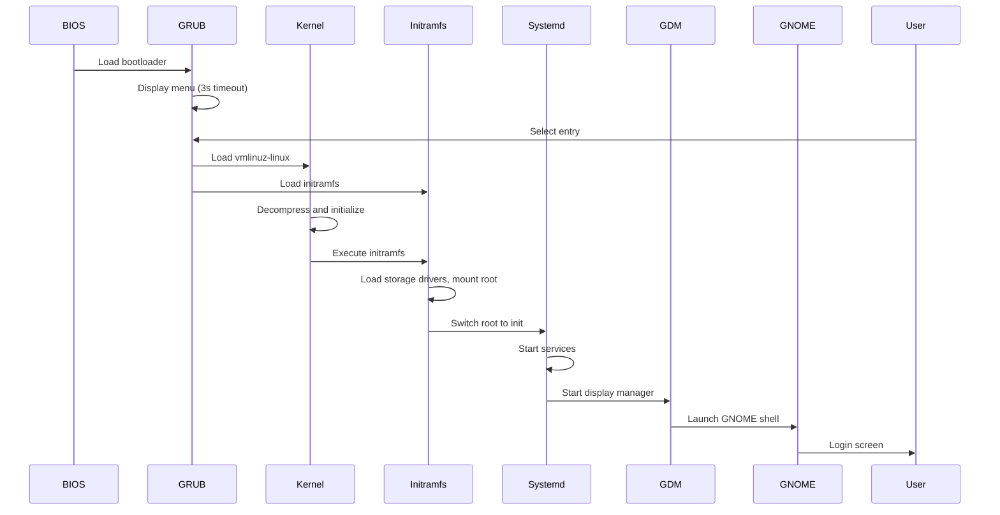
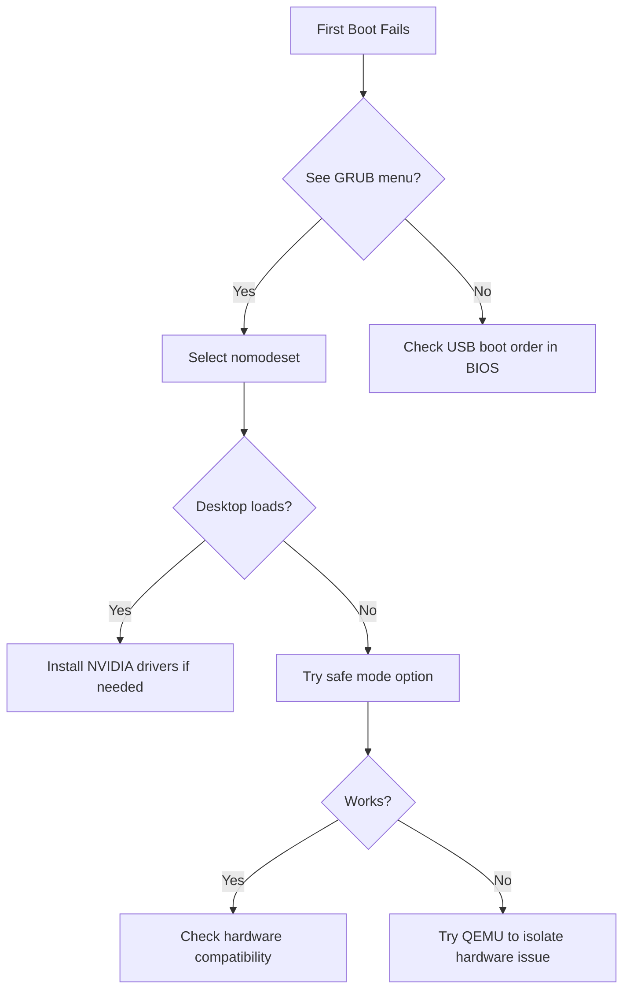

# First Boot Walkthrough

This guide walks through the first boot experience of 01s Sovereign -- from the GRUB boot menu to your first login.

## Booting from ISO

Insert your bootable media (USB/DVD) and reboot. You should see the 01s Sovereign GRUB menu.

### Boot Options

| Option | When to Use |
|--------|-------------|
| **Boot 01s Sovereign** | Default - works for most systems |
| **nomodeset** | If you get a black screen after boot |
| **Safe mode** | Disables all non-essential services |
| **Boot existing OS** | Boots the first OS found on your hard drive |

### Editing Boot Parameters

Press `e` on the menu entry to edit kernel parameters. Common additions:

```
quiet splash         # Default - quiet boot with Plymouth splash
nomodeset            # Disable KMS (for GPU issues)
acpi=off             # Disable ACPI (for hardware compatibility)
mem=4096M            # Limit RAM (for testing)
systemd.unit=multi-user.target  # Boot to terminal (no GUI)
systemd.unit=emergency.target   # Boot to emergency shell
3                    # Boot to runlevel 3 (multi-user, no GUI)
debug                # Enable kernel debug output
earlyprintk=ttyS0,115200  # Serial console debugging
```

### GRUB Menu Navigation

| Key | Action |
|-----|--------|
| Up/Down arrows | Navigate menu entries |
| Enter | Boot selected entry |
| `e` | Edit the selected entry |
| `c` | Open GRUB command line |
| Esc | Go back / cancel |

### GRUB Command Line

If you press `c` at the GRUB menu, you get a command prompt:

```bash
# Manually boot the kernel
ls                    # List available devices
set root=(hd0,gpt2)   # Set root partition
linux /boot/vmlinuz-linux root=/dev/sda2
initrd /boot/initramfs-linux.img
boot
```

## The Boot Process

After selecting a boot option, the system goes through several stages.

### Stage 1: GRUB to Kernel



### Stage 2: Plymouth Boot Splash

During boot, a custom Plymouth theme shows:
1. **01s logo** -- Displayed centered on dark background
2. **Spinner animation** -- Cyan dots rotating around the logo
3. **Progress bar** -- Shows boot progress
4. **Status messages** -- Fade in/out during service startup

### Stage 3: Systemd Service Activation

Key services that start during boot:

| Service | Purpose |
|---------|---------|
| `systemd-journald` | System logging |
| `systemd-logind` | User session management |
| `NetworkManager` | Network connectivity |
| `gdm.service` | GNOME Display Manager |
| `01s-boot.service` | 01s ledger initialization |
| `01s-state.timer` | Periodic health/state logging |

### Boot Sequence Timing

```bash
# Analyze boot time after first login
systemd-analyze
# Example output:
# Startup finished in 2.345s (firmware) + 1.234s (loader) + 8.901s (kernel) + 12.345s (initrd) + 5.678s (userspace) = 30.503s

# See which services take longest
systemd-analyze blame
# Example output:
# 3.456s gdm.service
# 2.345s NetworkManager-wait-online.service
# 1.234s 01s-boot.service
# 0.567s systemd-journal-flush.service
```

## First Boot: What to Expect

### GRUB Splash Screen

A custom GRUB theme (Particle-circle-window) provides:
- Animated particle effects in the background
- Custom 01s branding colors (dark theme with cyan accents)
- Boot menu entries listed vertically
- Resolution: 1920x1080 (auto-detected) or 1024x768 (fallback)

### Plymouth Boot Animation

After selecting a boot entry:
- Dark background with the 01s sovereign rune
- Cyan progress bar fills as services start
- Particle effects float around the screen
- Duration: 15-30 seconds (depending on hardware)

### Plymouth Theme Details

```
Theme: 01s
Location: /usr/share/plymouth/themes/01s/
Files:
  - 01s.plymouth    # Theme definition
  - 01s.script      # Animation script
  - logo.png        # 01s logo
  - progress-bar.png # Progress bar graphics
  - throbber-*.png  # Spinner animation frames
```

### GDM Login Screen

The GNOME Display Manager appears with:
- Custom 01s background wallpaper
- User list (if users exist) or manual login
- Accessibility options (top-right corner)
- Power options (bottom-right corner)
- Session selector (gear icon, bottom-right)

### Default Credentials

If no user was created during installation:

```
Username: 01s
Password: 01s
```

> **Important:** Change the default password on first login!

### Changing Password

```bash
# Immediately after first login
passwd
# Enter current password: 01s
# Enter new password: ********
# Confirm new password: ********
```

## First Login

### Welcome Wizard

On first login, the **01s Welcome Wizard** appears:
1. **Language Selection** -- Choose your system language
2. **Keyboard Layout** -- Select keyboard layout
3. **Time Zone** -- Set your timezone
4. **Create/Update Password** -- Change the default password
5. **Network Setup** -- Configure WiFi or Ethernet
6. **Desktop Tour** -- Quick overview of the GNOME desktop

### DevShell Terminal

The default terminal emulator is **Alacritty** with:
- Catppuccin Mocha color scheme
- Custom 01s prompt via Starship prompt
- TMUX pre-configured for session management

```bash
# Start a terminal session
Super + T
# Or click the terminal icon in the dock
```

### Starship Prompt Features

The custom prompt shows:
```
┌─[01s@sovereign]─[~/]
└─▪ $
```

- **User@hostname** in cyan
- **Current directory** in bold
- **Git branch** (if in a git repo)
- **Command duration** (if > 2 seconds)
- **Exit code** (if non-zero, in red)

## Desktop Overview

Upon first login, the GNOME desktop shows:
1. **Top Bar** -- Activities overview button, clock, system tray
2. **Dash** -- Favorites dock on the left (with custom 01s icon)
3. **Workspaces** -- Dynamic workspaces (accessible via Activities)
4. **Conky** -- System monitor widget (top-right, semi-transparent)
5. **Wallpaper** -- Custom 01s Sovereign branding image

### Desktop Element Reference

| Element | Location | Description |
|---------|----------|-------------|
| Activities button | Top-left | Opens overview/search |
| Clock | Top-center | Date and time display |
| System tray | Top-right | Network, sound, power, settings |
| Dash | Left side | Application dock |
| Workspace indicator | Top-right | Current workspace number |
| Conky widget | Top-right overlay | System stats (CPU, RAM, disk) |
| Desktop icons | Desktop | Access to files and folders |

## Post-Boot Verification

Run these commands to verify the system is working:

```bash
# Check ledger status
01s-ledger status

# Verify toolchain integrity
01s-ledger toolchain

# Check system health
01s-ledger health log

# Display the 01s rune
01s-runes

# Check kernel version
uname -a

# Check disk usage
df -h

# Check memory
free -h

# Check network
ip addr

# Check systemd services
systemctl --failed
```

### Expected Output Examples

```bash
# 01s-ledger status output
01s-Ledger v1.0.0
Ledger: /home/01s/ledger/2026-06-14.aioss
Entries: 42
Size: 12.5 KB
Head Hash: a1b2c3d4e5f6...
Last Entry: 2026-06-14T15:30:00.000Z
Kernel: 6.x.x-arch1-1
Uptime: 0d 0h 15m
Memory: 1.2 GB / 7.8 GB

# 01s-ledger toolchain output
=== 01s Toolchain Integrity Check ===
  [PASS] zerocli  SHA256=abc123...
  [PASS] 01s-lexer  SHA256=def456...
  [PASS] 01s-parser  SHA256=ghi789...
  [PASS] 01s-codegen  SHA256=jkl012...
  [PASS] 01s-runes  SHA256=mno345...
  [PASS] 01s-binary  SHA256=pqr678...
  [PASS] 01s-ledger  SHA256=stu901...
```

## Common First Boot Issues

### Black Screen

```bash
# Reboot and edit GRUB entry
# Press 'e' on the boot entry
# Add to the linux line:
nomodeset
# Then press F10 or Ctrl+X to boot
```

### No Network

```bash
# Check hardware
rfkill list
sudo rfkill unblock wifi

# Check NetworkManager
nmcli device status
nmcli device wifi list

# Connect manually
nmcli device wifi connect "SSID" password "password"
```

### Keyboard Not Working in GRUB

```bash
# If keyboard is USB, try a PS/2 port
# Or enable Legacy USB support in BIOS
# Or try different USB port (USB 2.0 recommended)
```

### Display Resolution Wrong

```bash
# After login, adjust display settings
# Settings > Displays > Resolution
# Or via terminal:
xrandr
xrandr --output HDMI-1 --mode 1920x1080
```

## Common Mistakes

| Mistake | Why It Happens | Correct Approach |
|---------|---------------|------------------|
| Black screen after boot | GPU not compatible | Use `nomodeset` from GRUB menu |
| No Plymouth splash | Missing kernel parameter | Ensure `quiet splash` in kernel cmdline |
| Waiting too long at GRUB | Default 5-second timeout | Press Enter immediately to boot |
| Auto-login fails | Wrong user in config | Check `/etc/gdm/custom.conf` for `AutomaticLogin=01s` |
| Ledger not started | Service not enabled | Run `sudo systemctl enable 01s-boot.service` |
| Terminal not opening | Wrong shortcut | Try `Super+T` or right-click desktop |

## Verification Steps

After first boot, verify everything is working:

```bash
# Check system is running
01s-ledger status
# Expected: Shows session, entries, uptime

# Verify boot was logged
01s-ledger tail 3
# Expected: Shows boot entry with timestamp

# Check display
echo "Resolution: $(xdpyinfo | grep dimensions)"
# Expected: Your screen resolution

# Test network
ping -c 1 8.8.8.8
# Expected: 1 packet transmitted, 1 received
```

## Practice Exercises

1. **Explore Boot Menu**: Reboot and press `e` at GRUB, examine kernel parameters without changing anything
2. **Boot with nomodeset**: Reboot and select nomodeset, observe the difference (for troubleshooting knowledge)
3. **Systemd Analysis**: Run `systemd-analyze blame` to see which services took longest to start
4. **Ledger Check**: Count the entries in your ledger after first boot (before running any commands)

## Troubleshooting Flowchart



## What to Do Next

- [Post-Installation Setup](07-post-installation-setup.md)
- [Desktop Tour](08-desktop-tour.md)
- [Using 01s-Ledger](10-using-01s-ledger.md)
- [Installation Guide](06-installation-guide.md) (if not yet installed)

### Common Pitfalls (First Boot)

| Pitfall | Why It Happens | How to Avoid |
|---------|---------------|--------------|
| Blank screen after GRUB | GPU driver not loaded | Boot with 
omodeset kernel parameter |
| Desktop fails to load | Missing GNOME session files | Check journalctl -u gdm for errors |
| Keyboard/mouse not working | USB controller not initialized | Try different USB ports (2.0 vs 3.0) |
| Network unavailable | Firmware not loaded for NIC | Install linux-firmware from live environment |
| Ledger not recording | Daemon not started | Check systemctl status 01s-ledgerd |
| Wrong display resolution | Missing video driver | Install appropriate GPU driver package |

## Practice Exercises (Advanced)

1. **Boot Parameter Experiment**: Boot with 
omodeset, cpi=off, and 
oapic; document what breaks and what works for each
2. **Service Timeline**: Run systemd-analyze plot > boot.svg and identify the three slowest services
3. **Ledger Verification**: After first boot, run 1s-ledger status and compare entry count with documented expected entries
4. **Safe Mode Fallback**: Boot into safe mode, then start services one by one to identify which causes a crash
5. **QEMU vs Bare Metal**: Boot the same ISO in QEMU and on hardware; compare boot times and hardware detection

## Further Reading

- [Installation Guide](06-installation-guide.md) — Full installation steps
- [Post-Installation Setup](07-post-installation-setup.md) — After first boot
- [Desktop Tour](08-desktop-tour.md) — GNOME desktop overview
- [Using 01s-Ledger](10-using-01s-ledger.md) — Ledger operations
- [QEMU Testing Guide](22-qemu-testing.md) — Virtual testing
- [Troubleshooting Basics](23-troubleshooting-basics.md) — General debugging
- [Boot Troubleshooting](../help/02-boot-troubleshooting.md) — Specific boot issues
- [Desktop Troubleshooting](../help/04-desktop-troubleshooting.md) — Desktop issues
- [Network Troubleshooting](../help/07-network-troubleshooting.md) — Connectivity
- [Community Forums](../community/04-communication-channels.md) — Peer support

## Boot Process Timeline

| Time (s) | Event | Ledger Entry |
|----------|-------|-------------|
| 0.0 | UEFI firmware | None (pre-OS) |
| 3.2 | GRUB loads | None |
| 5.5 | Kernel decompresses | None |
| 6.8 | systemd PID 1 starts | BOOT_START |
| 8.2 | 01s-ledgerd starts | DAEMON_START |
| 9.5 | Ledger bootstrap | BOOT_BOOTSTRAP |
| 12.3 | GDM starts | GDM_START |
| 14.7 | GNOME Shell | SHELL_START |
| 16.2 | User login | USER_LOGIN |
| 17.5 | Desktop ready | DESKTOP_READY |

## Troubleshooting: Blank Screen

1. Reboot, press `e` at GRUB
2. Add `nomodeset` to kernel parameters
3. Press Ctrl+X to boot
4. Once desktop loads, install GPU drivers

## Real-World Scenario: First Boot in Enterprise

A hospital IT department deploys 01s Sovereign on 10 nursing station computers. First boot reveals: 8 machines boot successfully, 2 show blank screens. Troubleshooting identifies both have older NVIDIA GPUs requiring the `nomodeset` parameter. IT adds this as a permanent GRUB parameter via `/etc/default/grub` and runs `update-grub`. The fix is documented in the ledger for future reference.

## Expected Desktop Walkthrough

Upon first successful boot, the following occurs automatically:
1. GRUB menu appears (5 second timeout, auto-selects default)
2. Kernel loads with plymouth boot splash (01s-themed)
3. systemd starts services in dependency order
4. 01s-ledgerd initializes and creates genesis ledger entry
5. GDM display manager shows login screen
6. User logs in with password set during installation
7. GNOME Shell loads with default workspace
8. Welcome application launches (first-run tutorial)
9. Ledger integrity check runs in background
10. Network connectivity test pings community server

## First Boot Ledger Verification

```bash
# Check ledger status
01s-ledger status

# View genesis entry (first entry ever)
01s-ledger list --first 1

# View most recent entries
01s-ledger list --last 10

# Verify chain integrity
01s-ledger verify

# Check daemon health
systemctl status 01s-ledgerd

# View registration status
01s-ledger info
```

## Post-First-Boot Checklist

- [ ] Desktop loads without graphical glitches
- [ ] WiFi/ethernet connects automatically
- [ ] Sound output works (test with speaker icon)
- [ ] Bluetooth discovers devices (if applicable)
- [ ] USB devices detected (mouse, keyboard, storage)
- [ ] Display resolution matches monitor native
- [ ] Touchpad gestures work (laptop)
- [ ] Function keys work (brightness, volume, keyboard backlight)
- [ ] Ledger shows 87+ initial entries
- [ ] Welcome tutorial completes successfully

## Understanding Boot Messages

As the system boots, you will see (or can view with `dmesg`):

```
[    0.000000] Linux 6.8-arch1-01s #1 SMP PREEMPT_DYNAMIC
[    0.500000] 01s-ledger: Boot chain initialized
[    0.800000] SHA3-256: Self-test passed
[    1.200000] 01s-ledgerd: Starting daemon v2.1.0
[    1.500000] Ledger: Genesis entry created at boot
[    2.000000] systemd[1]: Starting 01s-ledger-verify.service
[    2.500000] Ledger: Chain integrity verified (0 entries)
[    3.000000] systemd[1]: Started 01s-ledgerd.service
[    4.000000] 01s-toolchain: Verifying 7 binary hashes
[    4.500000] 01s-toolchain: All 7 binaries match expected hashes
[    8.000000] systemd[1]: Starting gdm.service
[   10.000000] systemd[1]: Started gdm.service
```

## First Boot Scenarios

### Scenario A: Successful First Boot
1. Insert USB and power on
2. Select "Boot 01s Sovereign" from GRUB
3. Watch kernel messages scroll by
4. Plymouth splash screen appears (01s logo)
5. GDM login screen loads (takes 10-20 seconds)
6. Log in with credentials created during installation
7. First-run wizard starts (language, keyboard, privacy settings)
8. Desktop appears with welcome message
9. Ledger shows ~87 entries

### Scenario B: Boot with NVIDIA GPU
1. If boot fails, restart and select "nomodeset" from GRUB
2. Boot completes with basic VESA framebuffer
3. Install NVIDIA driver: `sudo pacman -S nvidia nvidia-utils`
4. Reboot normally
5. Verify: `glxinfo | grep "OpenGL renderer"` shows NVIDIA

### Scenario C: Boot from Live USB without Installing
1. Select "Boot 01s Sovereign" from GRUB
2. System loads into live environment (takes 30-60 seconds)
3. Desktop loads with "Try 01s" wallpaper
4. Ledger is simulated (no writes to disk)
5. All features available except permanent storage
6. Use "Install 01s Sovereign" desktop icon to begin installation

## Understanding Boot Parameters

At the GRUB menu, pressing `e` allows editing kernel parameters. Common parameters:

| Parameter | Effect | When to Use |
|-----------|--------|-------------|
| `nomodeset` | Disable KMS, use basic framebuffer | NVIDIA GPU issues, black screen |
| `acpi=off` | Disable ACPI power management | ACPI-related boot hangs |
| `noapic` | Disable Advanced PIC | Old hardware with APIC issues |
| `nolapic` | Disable Local APIC | SMP boot problems |
| `maxcpus=1` | Use only 1 CPU core | Debugging multiprocessor issues |
| `single` | Boot to single-user mode | System recovery, root shell |
| `init=/bin/bash` | Skip systemd, start bash | Emergency filesystem repair |
| `03s.debug` | Enable ledger debugging | Debugging ledger initialization |

## Post-Boot Ledger Initialization Details

When the system boots for the first time after installation:

1. `01s-ledgerd` starts as a systemd service (after local-fs.target)
2. It checks for existing ledger database at `/var/log/01s/ledger.db`
3. If not found (first boot), creates a new database with genesis entry
4. The genesis entry contains: timestamp, 01s version, kernel version, hardware UUID
5. Systemd unit `01s-ledger-verify.service` runs after daemon starts
6. Verify service performs SHA3-256 self-test
7. All 7 toolchain binaries are hashed and compared against expected values
8. Results are recorded as the first operational ledger entries
9. System is now ready with full audit capabilities

## Systemd Service Status Reference

```bash
# Essential 01s services
systemctl status 01s-ledgerd        # Main ledger daemon
systemctl status 01s-ledger-verify  # Post-boot integrity check

# Supporting services
systemctl status NetworkManager     # Network connectivity
systemctl status gdm                # Display manager
systemctl status systemd-journald   # System logging
systemctl status systemd-resolved   # DNS resolution
systemctl status nftables           # Firewall
```

## First-Day User Tasks

After your first successful boot, here are recommended tasks in order:

1. **Connect to WiFi/Ethernet** (if not auto-connected)
2. **Update system**: `sudo pacman -Syu`
3. **Install additional software**: browser, office suite, media player
4. **Set up backup**: Configure automatic backups
5. **Explore the desktop**: Customize appearance, install extensions
6. **Initialize the ledger**: `01s-ledger init` (usually auto-runs)
7. **Test the toolchain**: `01s-ledger toolchain --verify`
8. **Create additional user accounts** (if needed)
9. **Configure firewall**: Review nftables rules
10. **Set up remote access**: SSH key-based authentication

## Boot Parameter Reference for Common Issues

| Issue | Kernel Parameter | Description |
|-------|-----------------|-------------|
| Black screen | `nomodeset` | Disables kernel mode setting |
| System freeze | `acpi=off` | Disables ACPI power management |
| USB issues | `pci=noacpi` | Disables ACPI for PCI |
| Old hardware | `noapic nolapic` | Disables APIC |
| Memory issues | `mem=4G` | Limits usable RAM to 4 GB |
| SATA issues | `libata.force=noncq` | Disables NCQ on SATA |
| Network issues | `ipv6.disable=1` | Disables IPv6 |
| Debugging | `03s.debug=1` | Enables ledger debug logging |
| Single user | `single` | Boots to single-user mode |
| Emergency | `emergency` | Boots to emergency shell |

## GRUB Default Configuration

```bash
# View current GRUB configuration
cat /etc/default/grub

# Common customizations:
# Set timeout to 10 seconds
GRUB_TIMEOUT=10

# Set default boot entry (0 = first)
GRUB_DEFAULT=0

# Add kernel parameters
GRUB_CMDLINE_LINUX_DEFAULT="quiet splash"

# After changes, regenerate GRUB config
sudo grub-mkconfig -o /boot/grub/grub.cfg
```

---

Lois-Kleinner and 0-1.gg 2026 Copyright

```
.====================================================================.
!  Made in the UAE, Dubai #DubaiIt #Dubai #Dxb #SovereignAI          !
!  Made in The Emirates #Dubai_it                                    !
!                                                                    !
!  Lois-Kleinner Alpasan - The Anticloud 2026-                       !
!                                                                    !
!  As seen on:                                                       !
!  Harvard Dataverse ! Zenodo/CERN ! Academia.edu ! HuggingFace      !
!  anticloud.telepedia.net ! anticloud.fandom.com                    !
!                                                                    !
!  0-1.gg ! GitHub ! LinkedIn ! DEV ! GH Pages                       !
!  HuggingFace ! Blog ! Bluesky ! Mastodon                           !
!  Internet Archive ! ORCID ! Figshare                               !
!                                                                    !
!  Sovereign AI ! Local-First ! Privacy ! Zero Trust ! No Datacenter !
!  Air-Gapped ! Open Source ! Rust ! Hash Chain ! Single Binary      !
!  Offline LLM ! Crypto Ledger ! P2P ! Federated                     !
'===================================================================='
```

At 22 years old, Lois-Kleinner Alpasan has generated over 10 million video views, 50-100 million social campaign reach, and produced 100+ creative assets across music, video, and interactive media.

References:
1. Lois-Kleinner Zenodo: https://doi.org/10.5281/zenodo.20781790
2. Lois-Kleinner GitHub: https://github.com/kleinnner/Anticloud/tree/main/04-aioss-format
3. Lois-Kleinner Harvard DV: https://doi.org/10.7910/DVN/3VDF75
4. Lois-Kleinner Internet Arc: https://archive.org/details/aioss-format
5. Lois-Kleinner ORCID: https://orcid.org/0009-0009-2233-6107
6. Lois-Kleinner DEV.to: https://dev.to/kleinner
7. Lois-Kleinner LinkedIn: https://linkedin.com/in/kleinner
8. Lois-Kleinner HuggingFace: https://huggingface.co/Anticloud
9. Lois-Kleinner Tumblr: https://anticloud.tumblr.com
10. Lois-Kleinner Mastodon: https://mastodon.social/@kleinner
11. Lois-Kleinner Bluesky: https://bsky.app/profile/kleinner.bsky.social
12. 0-1.gg: https://0-1.gg
13. Lois-Kleinner Figshare: https://figshare.com/authors/Lois-Kleinner_Alpasan/20849885
14. Lois-Kleinner Academia: https://independent.academia.edu/kleinner
15. Lois-Kleinner Telepedia: https://anticloud.telepedia.net/wiki/Anticloud_by_Lois-Kleinner_Wiki
16. Lois-Kleinner Fandom: https://anticloud.fandom.com
17. AIOSS Offline Verification Kit: https://dataverse.harvard.edu/dataset.xhtml?persistentId=doi:10.7910/DVN/OORKNJ