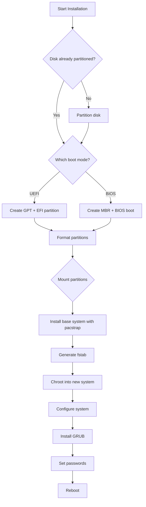

# Installation Guide

This guide covers installing 01s Sovereign to your hard drive from the live ISO environment.

## Before You Begin

- Back up all important data
- Have a stable internet connection (or all packages on the ISO)
- Know your disk layout (lsblk, fdisk -l)
- Allocate at least 20 GB of disk space

### Installation Decision Tree



## Booting the Live Environment

1. Boot from USB/DVD (see [Creating Bootable Media](04-creating-bootable-media.md))
2. Select **Boot 01s Sovereign** from GRUB
3. Wait for the desktop to load
4. Open a terminal (**Super+T** or click terminal icon)

### Verifying Live Environment

```bash
# Check that you're in the live environment
ls /run/archiso/
# Expected: booted_dev, airootfs, etc.

# Check disk recognition
lsblk

# Check network
ip link
ping -c 1 8.8.8.8
```

## Partitioning

### Using fdisk (Traditional)

```bash
# Identify your target disk
lsblk

# Partition the disk (replace /dev/sda with your disk)
sudo fdisk /dev/sda
```

Inside fdisk:
```
Command (m for help): g      # Create new GPT partition table
Command (m for help): n      # New partition
Partition number: 1
First sector: (default)
Last sector: +512M           # EFI System Partition
Command (m for help): t
Partition type: 1            # EFI System
Command (m for help): n      # New partition (root)
Last sector: +30G
Command (m for help): n      # New partition (home)
Last sector: (default)
Command (m for help): w      # Write changes
```

### Using parted (Modern)

```bash
sudo parted /dev/sda -- mklabel gpt
sudo parted /dev/sda -- mkpart ESP fat32 1MiB 513MiB
sudo parted /dev/sda -- set 1 esp on
sudo parted /dev/sda -- mkpart root ext4 513MiB 30.5GiB
sudo parted /dev/sda -- mkpart home ext4 30.5GiB 100%
```

### Partitioning Schemes Comparison

| Scheme | Boot Mode | Partitions | Use Case |
|--------|-----------|------------|----------|
| Standard | UEFI | EFI + / + /home | General purpose |
| Minimal | UEFI | EFI + / | Single partition (no /home) |
| Btrfs | UEFI | EFI + Btrfs (subvolumes) | Snapshots |
| Dual-boot | UEFI | Shared EFI + / + Windows | Windows coexistence |
| BIOS | Legacy | BIOS boot + / + /home | Older hardware |
| LUKS | UEFI | EFI + LUKS encrypted / | Security-focused |
| ZFS | UEFI | EFI + ZFS pool | Advanced storage |

### UEFI vs BIOS Partitioning

| Aspect | UEFI (GPT) | BIOS (MBR) |
|--------|------------|------------|
| Partition table | GPT | MBR |
| EFI partition | Required (FAT32, 512 MB) | Not needed |
| BIOS boot partition | Not needed | Required (1 MiB, unformatted) |
| Maximum partitions | 128 | 4 primary (or extended) |
| Disk limit | 9.4 ZB | 2 TB |
| Secure Boot | Supported | Not supported |

## Formatting Partitions

```bash
# Format EFI partition (FAT32)
sudo mkfs.fat -F 32 /dev/sda1

# Format root partition (ext4)
sudo mkfs.ext4 /dev/sda2

# Format home partition (ext4)
sudo mkfs.ext4 /dev/sda3
```

### Alternative Filesystems

For Btrfs:
```bash
sudo mkfs.btrfs -L root /dev/sda2
sudo mkfs.btrfs -L home /dev/sda3

# With subvolumes
sudo mount /dev/sda2 /mnt
sudo btrfs subvolume create /mnt/@
sudo btrfs subvolume create /mnt/@home
sudo umount /mnt
```

For XFS:
```bash
sudo mkfs.xfs -L root /dev/sda2
```

### LUKS Encryption Setup

```bash
# Encrypt root partition
sudo cryptsetup luksFormat /dev/sda2
sudo cryptsetup open /dev/sda2 cryptroot
sudo mkfs.ext4 /dev/mapper/cryptroot

# Encrypt home partition
sudo cryptsetup luksFormat /dev/sda3
sudo cryptsetup open /dev/sda3 crypthome
sudo mkfs.ext4 /dev/mapper/crypthome
```

## Mounting Partitions

```bash
# Mount root
sudo mount /dev/sda2 /mnt

# Create and mount EFI directory
sudo mkdir -p /mnt/boot/efi
sudo mount /dev/sda1 /mnt/boot/efi

# Mount home (optional)
sudo mkdir -p /mnt/home
sudo mount /dev/sda3 /mnt/home
```

For LUKS:
```bash
# Mount encrypted partitions
sudo mount /dev/mapper/cryptroot /mnt
sudo mount /dev/sda1 /mnt/boot/efi
sudo mount /dev/mapper/crypthome /mnt/home
```

## Installing the Base System

```bash
sudo pacstrap -i /mnt base base-devel linux linux-firmware \
  grub efibootmgr networkmanager \
  sudo vim nano git openssh \
  gnome gnome-tweaks --needed
```

### Package Group Descriptions

| Package/Group | Purpose |
|---------------|---------|
| `base` | Core system utilities |
| `base-devel` | Development tools (make, gcc, etc.) |
| `linux` | Linux kernel |
| `linux-firmware` | Hardware firmware blobs |
| `grub` | Bootloader |
| `efibootmgr` | EFI boot manager |
| `networkmanager` | Network management |
| `sudo` | Privilege escalation |
| `vim` | Text editor |
| `gnome` | GNOME desktop environment |
| `gnome-tweaks` | GNOME advanced settings |

## Chroot and Configure

```bash
# Generate fstab
sudo genfstab -U /mnt >> /mnt/etc/fstab

# Chroot into the new system
sudo arch-chroot /mnt
```

### Set Timezone

```bash
ln -sf /usr/share/zoneinfo/UTC /etc/localtime
hwclock --systohc
```

### Localization

```bash
echo "en_US.UTF-8 UTF-8" >> /etc/locale.gen
locale-gen
echo "LANG=en_US.UTF-8" > /etc/locale.conf
echo "KEYMAP=us" > /etc/vconsole.conf
```

### Hostname

```bash
echo "sovereign" > /etc/hostname
```

### Network Configuration

```bash
systemctl enable NetworkManager
cat > /etc/hosts << EOF
127.0.0.1   localhost
::1         localhost
127.0.1.1   sovereign.localdomain sovereign
EOF
```

### Initramfs

```bash
mkinitcpio -P
```

For LUKS encryption, edit `/etc/mkinitcpio.conf`:
```bash
# Add 'encrypt' to HOOKS before 'filesystems':
HOOKS=(base udev autodetect modconf block encrypt filesystems keyboard fsck)
```

### Root Password

```bash
passwd
```

### Create User

```bash
useradd -m -G wheel,storage,power -s /bin/bash 01s
passwd 01s
echo "01s ALL=(ALL) NOPASSWD: ALL" > /etc/sudoers.d/01s
```

## Installing GRUB

### UEFI

```bash
grub-install --target=x86_64-efi --efi-directory=/boot/efi --bootloader-id=01S
grub-mkconfig -o /boot/grub/grub.cfg
```

### Legacy BIOS

```bash
grub-install --target=i386-pc /dev/sda
grub-mkconfig -o /boot/grub/grub.cfg
```

### LUKS GRUB Configuration

```bash
# Edit /etc/default/grub
GRUB_CMDLINE_LINUX="cryptdevice=/dev/sda2:cryptroot"

# Regenerate
grub-mkconfig -o /boot/grub/grub.cfg
```

## Installing 01s-Specific Components

```bash
# Copy 01s-ledger
cp /usr/bin/01s-ledger /mnt/usr/bin/01s-ledger

# Copy zerocli
cp /usr/bin/zerocli /mnt/usr/bin/zerocli

# Copy toolchain binaries
for tool in lexer parser codegen runes binary; do
  cp "/usr/bin/01s-$tool" "/mnt/usr/bin/01s-$tool"
done

# Copy source code
cp -r /usr/src/toolchain /mnt/usr/src/

# Enable 01s services
systemctl enable 01s-boot.service
systemctl enable 01s-state.timer
```

## Final Steps

```bash
# Exit chroot
exit

# Unmount all partitions
sudo umount -R /mnt

# Reboot
sudo reboot
```

## Post-Installation

After rebooting, remove the installation media and boot into your new 01s Sovereign system.

```bash
# First boot - run the welcome wizard
01s-welcome-wizard

# Verify installation
01s-ledger init
01s-ledger status
01s-ledger toolchain
```

### Installation Verification Checklist

- [ ] System boots to GRUB
- [ ] GRUB loads 01s Sovereign
- [ ] Plymouth boot animation displays
- [ ] GDM login screen appears
- [ ] Can log in with created user
- [ ] Desktop environment loads
- [ ] Network connectivity works
- [ ] `01s-ledger status` shows active ledger
- [ ] `01s-ledger toolchain` shows all components pass
- [ ] `pacman -Syu` completes without errors

## Dual-Boot Configuration

### With Windows

1. Shrink Windows partition using Disk Management
2. Create Linux partitions in the freed space
3. Install normally
4. GRUB will auto-detect Windows

If Windows is not detected:
```bash
sudo os-prober
sudo grub-mkconfig -o /boot/grub/grub.cfg
```

### With Another Linux Distro

1. Install normally alongside existing Linux
2. Ensure each distro has its own `/boot`
3. The last installed GRUB will be the boot manager

## Troubleshooting Installation

| Issue | Solution |
|-------|----------|
| pacstrap fails | Update pacman: `sudo pacman -Sy` |
| GRUB install fails | Check EFI variables: `ls /sys/firmware/efi/efivars` |
| Black screen after install | Boot with `nomodeset` kernel parameter |
| No WiFi in live env | `rfkill unblock wifi` |
| Disk not found | Check SATA mode (AHCI vs RAID) in BIOS |
| "Failed to mount /boot" | Check fstab UUIDs match actual partitions |
| Boot hangs after GRUB | Try `acpi=off` or `noapic` kernel parameters |

---

## Common Installation Mistakes

| Mistake | Why It Happens | Correct Approach |
|---------|---------------|------------------|
| Forgetting to mount EFI partition | GRUB install fails | Mount `/boot` or `/efi` before pacstrap |
| Wrong timezone | Accepts default UTC | Set `ln -sf /usr/share/zoneinfo/Region/City /etc/localtime` |
| No swap partition | Low RAM systems | Add swap file: `dd if=/dev/zero of=/swapfile bs=1M count=2048` |
| GRUB not installed to ESP | Missing `--target=x86_64-efi` | Use `grub-install --target=x86_64-efi --efi-directory=/boot` |
| Network not working in chroot | No systemd-networkd | Use `systemctl enable systemd-networkd` before reboot |
| Wrong disk selected | Multiple drives | Double-check with `lsblk` before partitioning |

## Verification Steps

Check these before rebooting:

```bash
# Check partitions mounted correctly
lsblk; cat /mnt/etc/fstab

# Verify GRUB installed
ls /mnt/boot/grub/grub.cfg

# Check network in chroot
ping -c 1 8.8.8.8

# Verify initramfs
ls /mnt/boot/initramfs-*.img
```

## Practice Exercises

1. **Manual Partitions**: Install with separate `/home`, `/var`, swap partitions
2. **LVM Setup**: Install using LVM for flexible volume management
3. **Encrypted Install**: Install with LUKS full-disk encryption
4. **Scripted Install**: Write a bash script automating the full installation

## Troubleshooting

| Problem | Cause | Solution |
|---------|-------|----------|
| pacstrap fails | Network issue | Check `ping archlinux.org` |
| GRUB fails | Wrong EFI directory | Ensure ESP mounted at `/boot` |
| Kernel panic | Wrong CPU microcode | Install `intel-ucode` / `amd-ucode` |
| mkinitcpio fails | Missing modules | Check HOOKS in mkinitcpio.conf |

## Post-Install Security

- [ ] Set passwords: `passwd` and `passwd 01s`
- [ ] Enable firewall: `sudo systemctl enable --now nftables`
- [ ] Initialize ledger: `01s-ledger init`
- [ ] Verify toolchain: `01s-ledger toolchain`

## See Also

- [Post-Installation Setup](07-post-installation-setup.md)
- [Desktop Tour](08-desktop-tour.md)
- [Partition Layout Reference](02-system-requirements.md)
- [Installation FAQ](../faq/02-installation-faq.md)
- [Dual-Boot Guide](../help/04-dual-boot-troubleshooting.md)

### Common Pitfalls (Installation)

| Pitfall | Why It Happens | How to Avoid |
|---------|---------------|--------------|
| Arch Linux keyring outdated | ISO may become stale | Run pacman -Sy archlinux-keyring first |
| Wrong partition scheme | GPT vs MBR for UEFI vs BIOS | Verify boot mode with ls /sys/firmware/efi/efivars |
| Missing EFI partition | UEFI requires FAT32 ESP | Create 512 MB EFI system partition |
| chroot not working | Wrong architecture or mount | Verify mounts with mount | grep /mnt |
| GRUB install fails | Wrong target directory | Use --efi-directory=/boot for UEFI |
| No internet in live env | Missing firmware | Check lspci -k for kernel driver in use |

## Practice Exercises (Advanced)

1. **Automated Install**: Write a complete bash script using rchinstall or manual commands that performs an unattended installation
2. **LUKS Encryption**: Perform the installation with LUKS full-disk encryption including LVM on LUKS
3. **Dual-Boot with Windows**: Install 01s Sovereign alongside an existing Windows installation with proper GRUB configuration
4. **Raspberry Pi Experiment**: (If applicable) Adapt the installation process for ARM architecture
5. **Network Install**: Install 01s Sovereign over SSH from another machine using the live ISO's SSH server

## Further Reading

- [System Requirements](02-system-requirements.md) — Hardware prerequisites
- [Downloading the ISO](03-downloading-the-iso.md) — ISO acquisition
- [Post-Installation Setup](07-post-installation-setup.md) — After installation
- [Desktop Tour](08-desktop-tour.md) — GNOME overview
- [Partition Layout Reference](02-system-requirements.md) — Disk partitioning
- [Dual-Boot Guide](../help/04-dual-boot-troubleshooting.md) — Multi-OS setup
- [Installation FAQ](../faq/02-installation-faq.md) — Common issues
- [Boot Troubleshooting](../help/02-boot-troubleshooting.md) — Boot problems
- [QEMU Testing](22-qemu-testing.md) — Test before installing
- [Enterprise Deployment](../enterprise/02-deployment-models.md) — Mass deployment

## Installation Walk Summary

Phase 1 - Pre-Installation (5 min): Verify boot mode, network connectivity, update clock, partition disk.

```bash
parted /dev/nvme0n1 mklabel gpt
parted /dev/nvme0n1 mkpart ESP fat32 1MiB 513MiB
parted /dev/nvme0n1 set 1 esp on
parted /dev/nvme0n1 mkpart ledger ext4 513MiB 20513MiB
parted /dev/nvme0n1 mkpart root ext4 20513MiB 100%
```

Phase 2 - Base Install (15 min): Format partitions, mount, install base packages.

Phase 3 - Configuration (10 min): Generate fstab, chroot, set locale/hostname, install GRUB, initialize ledger.

## Real-World Scenario: LUKS Encrypted Install

A law firm requires full-disk encryption for client confidentiality. Installation adds: (1) `cryptsetup luksFormat /dev/nvme0n1p3` during partitioning, (2) `cryptsetup open /dev/nvme0n1p3 cryptroot` before mounting, (3) Add `encrypt` and `sd-lvm2` to mkinitcpio HOOKS, (4) Configure `/etc/crypttab` for auto-unlock at boot, (5) Ledger initialization happens after decryption, recording the boot attestation. The ledger verifies that the system booted into the expected encrypted state.

## Partition Scheme Examples

### Single Drive (256 GB SSD, UEFI)
| Partition | Size | Type | FS | Mount |
|-----------|------|------|-----|-------|
| EFI | 512 MB | EFI System | FAT32 | /boot |
| Ledger | 20 GB | Linux | ext4 | /var/log/01s |
| Root | 231 GB | Linux | ext4 | / |
| Swap | 4 GB | Swap | swap | [swap] |

### Dual Boot with Windows (512 GB SSD, UEFI)
| Partition | Size | Type | FS | Mount |
|-----------|------|------|-----|-------|
| Windows | Existing | NTFS | ntfs | (Windows owns) |
| EFI | 512 MB | EFI | FAT32 | /boot (shared) |
| Ledger | 20 GB | Linux | ext4 | /var/log/01s |
| Root | 100 GB | Linux | ext4 | / |
| Swap | 8 GB | Swap | swap | [swap] |

## Automated Installation with archinstall

```bash
# For experienced users who want faster setup
pacman -S archinstall
cat > setup.json << 'JSON'
{
  "disk_config": {
    "device": "/dev/nvme0n1",
    "layout": "gpt",
    "partitions": [
      {"size": "512M", "type": "efi", "mount": "/boot"},
      {"size": "20G", "type": "ext4", "mount": "/var/log/01s"},
      {"size": "100%", "type": "ext4", "mount": "/"}
    ]
  },
  "packages": [
    "01s-sovereign-desktop", "01s-ledger", "zerocli", "01s-toolchain"
  ],
  "hostname": "01s-machine",
  "users": [{"username": "user", "password": "changeme", "sudo": true}]
}
JSON
python -m archinstall --config setup.json
```

## Installation Using archinstall (Automated)

For experienced users who want to script the installation:

```bash
# Install automated installer
pacman -S archinstall

# Create configuration script
cat > /root/01s-install.json << 'JSON'
{
  "disk_config": {
    "device": "/dev/sda",
    "layout": "gpt",
    "partitions": [
      {"size": "512M", "type": "efi", "mount": "/boot"},
      {"size": "20G", "type": "ext4", "mount": "/var/log/01s"},
      {"mount": "/", "size": "0"}
    ],
    "filesystem": {"/": "ext4"}
  },
  "packages": ["base", "linux-01s", "linux-firmware",
    "01s-sovereign-desktop", "01s-ledger", "zerocli", "01s-toolchain",
    "grub", "efibootmgr", "networkmanager", "nano"],
  "hostname": "01s-machine",
  "users": [{"username": "admin", "password": "changeme123", "sudo": true}],
  "timezone": "UTC",
  "locale": "en_US.UTF-8",
  "bootloader": "grub"
}
JSON

# Run installation
python -m archinstall --config /root/01s-install.json
```

## Manual Installation Cheat Sheet

| Step | Command | Verification |
|------|---------|-------------|
| Partition | `parted /dev/sda mklabel gpt` | `lsblk` |
| Format EFI | `mkfs.fat -F32 /dev/sda1` | `blkid` |
| Format root | `mkfs.ext4 /dev/sda3` | `blkid` |
| Mount root | `mount /dev/sda3 /mnt` | `mount` |
| Mount EFI | `mount /dev/sda1 /mnt/boot` | `mount` |
| Install base | `pacstrap /mnt base linux linux-firmware` | `ls /mnt/bin` |
| Install 01s | `pacstrap /mnt 01s-sovereign-desktop` | `ls /mnt/usr/bin/01s-*` |
| Generate fstab | `genfstab /mnt >> /mnt/etc/fstab` | `cat /mnt/etc/fstab` |
| Init ledger | `arch-chroot /mnt 01s-ledger init` | `01s-ledger status` |
| Install GRUB | `arch-chroot /mnt grub-install /dev/sda` | `ls /mnt/boot/grub` |

## Complete Installation Troubleshooting

### GRUB Installation Issues
| Symptom | Cause | Solution |
|---------|-------|----------|
| grub-install: error: failed to get canonical path | EFI partition not mounted | Mount EFI partition to /boot |
| grub-install: warning: ESP may not be set up | Wrong EFI directory | Use `--efi-directory=/boot` for UEFI |
| grub-install: error: cannot find a device | Missing device | Use full path: `grub-install /dev/sda` |
| grub-mkconfig: warning: cannot find EFI directory | No ESP mounted | Mount and rerun grub-mkconfig |

### Chroot Environment Issues
| Symptom | Cause | Solution |
|---------|-------|----------|
| chroot: failed to run command /bin/bash | Wrong architecture | Use same architecture as target |
| chroot: cannot execute: required file not found | Missing base packages | Run pacstrap again |
| /bin/bash: No such file or directory | Wrong chroot path | Verify /mnt has root filesystem |
| mount: /mnt: mount point not mounted | Missing mounts | Mount root partition first |

### Network in Live Environment
```bash
# Check connection
ping -c 3 archlinux.org

# If no connection, check interface
ip link show

# Enable interface
ip link set dev interface_name up

# Start DHCP client
dhcpcd interface_name

# Manual configuration
ip addr add 192.168.1.100/24 dev interface_name
ip route add default via 192.168.1.1
echo "nameserver 1.1.1.1" > /etc/resolv.conf
```

---

Lois-Kleinner and 0-1.gg 2026 Copyright

```
.====================================================================.
!  Made in the UAE, Dubai #DubaiIt #Dubai #Dxb #SovereignAI          !
!  Made in The Emirates #Dubai_it                                    !
!                                                                    !
!  Lois-Kleinner Alpasan - The Anticloud 2026-                       !
!                                                                    !
!  0-1.gg ! GitHub ! LinkedIn ! DEV ! GH Pages                       !
!  HuggingFace ! Blog ! Tumblr ! Fandom ! Bluesky ! Mastodon          !
!  Zenodo ! Harvard Dataverse ! Internet Archive ! ORCID              !
!                                                                    !
!  Sovereign AI ! Local-First ! Privacy ! Zero Trust ! No Datacenter !
!  Air-Gapped ! Open Source ! Rust ! Hash Chain ! Single Binary      !
!  Offline LLM ! Crypto Ledger ! P2P ! Federated                     !
'===================================================================='
```

Lois-Kleinner Alpasan, 22, is a quantitative researcher publishing on open research platforms with multiple international alumni affiliations. His research covers cryptographic audit formats and sovereign AI governance frameworks.

References:
1. Lois-Kleinner Zenodo: https://doi.org/10.5281/zenodo.20781790
2. Lois-Kleinner GitHub: https://github.com/kleinnner/Anticloud/tree/main/04-aioss-format
3. Lois-Kleinner Harvard DV: https://doi.org/10.7910/DVN/SZJMZA
4. Lois-Kleinner Internet Arc: https://archive.org/details/aioss-format
5. Lois-Kleinner ORCID: https://orcid.org/0009-0009-2233-6107
6. Lois-Kleinner DEV.to: https://dev.to/kleinner
7. Lois-Kleinner LinkedIn: https://linkedin.com/in/kleinner
8. Lois-Kleinner HuggingFace: https://huggingface.co/Anticloud
9. Lois-Kleinner Tumblr: https://anticloud.tumblr.com
10. Lois-Kleinner Mastodon: https://mastodon.social/@kleinner
11. Lois-Kleinner Bluesky: https://bsky.app/profile/kleinner.bsky.social
12. 0-1.gg: https://0-1.gg
