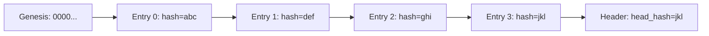

# Using 01s-Ledger

The `01s-ledger` binary is the core audit tool in 01s Sovereign. It manages the cryptographically-linked `.aioss` ledger that records every action on the system.

## What Is the Ledger?

The ledger is an append-only JSON file with hash-chained entries. Each entry contains:

```json
{
  "actor": "system|user|ai",
  "content": { "key": "value" },
  "hash": "sha256hex...",
  "index": 0,
  "parent_hash": "sha256hex...",
  "timestamp": "2026-06-14T12:00:00.000Z",
  "type": "event_type"
}
```

## Command Reference

### Initialize the Ledger

```bash
# Create a new ledger file for today
01s-ledger init
```

Output: `Ledger initialized: /home/01s/ledger/2026-06-14.aioss`

### Log an Entry

```bash
# Log a simple event
01s-ledger log system_event key=value status=ok

# Log a toolchain verification
01s-ledger log toolchain_check binary=01s-lexer hash=abc123

# Log a security event
01s-ledger log security_check firewall=enabled status=passed
```

Output: The SHA-256 hash of the new entry.

### View Recent Entries

```bash
# View last 10 entries
01s-ledger tail 10

# View last 3 entries
01s-ledger tail 3
```

Output (pretty-printed JSON):

```json
{
  "actor": "system",
  "content": {"status": "ok", "key": "value"},
  "hash": "a1b2c3d4...",
  "index": 5,
  "parent_hash": "9f8e7d6c...",
  "timestamp": "2026-06-14T12:30:00.123Z",
  "type": "system_event"
}
```

### Check Ledger Status

```bash
01s-ledger status
```

Displays ledger path, entry count, size, last entry, head hash, kernel info, uptime, and memory.

### Verify Ledger Integrity

```bash
01s-ledger verify
```

Output: `[PASS] All 42 entries verified. Chain intact.`

### Watch Mode

Monitor the ledger in real-time:

```bash
# Update every 60 seconds (default)
01s-ledger watch

# Update every 10 seconds
01s-ledger watch 10
```

### Export Entries

```bash
# Export all entries as JSON array
01s-ledger export > ledger-export.json

# Export specific fields
01s-ledger export | jq '.[].type' | sort | uniq -c
```

### Purge Entries (GDPR Compliance)

```bash
# Remove entries matching a session ID
01s-ledger purge session_abc123
```

> **Warning:** This permanently removes data. Use only when required by law.

### Sign Ledger State

```bash
# Generate a state proof with a new key
01s-ledger sign
```

Output includes head hash, HMAC signature, public key hash, timestamp, and entry count.

### Verify Toolchain Integrity

```bash
01s-ledger toolchain
```

Output:
```
=== 01s Toolchain Integrity Check ===
  [PASS] zerocli  SHA256=abc123...
  [PASS] 01s-lexer  SHA256=def456...
  [PASS] 01s-parser  SHA256=ghi789...
  [PASS] 01s-codegen  SHA256=jkl012...
  [PASS] 01s-runes  SHA256=mno345...
  [PASS] 01s-binary  SHA256=pqr678...
  [PASS] 01s-ledger  SHA256=stu901...
```

## Health Ledger

The health ledger is a parallel hash chain for diagnostic data:

### Log Health Entry

```bash
01s-ledger health log "" boot_test system pass 1500 "Boot completed"
```

### Verify Health Ledger

```bash
01s-ledger health verify 2026-06-14
```

### View Health Status

```bash
01s-ledger health status
```

## The Hash Chain



Each entry's hash is computed as: `SHA-256(canonical_json(entry_without_hash_field))`

## Automated Logging

The ledger is automatically updated by systemd services:
- **01s-boot.service** -- Logs boot events
- **01s-state.timer** -- Periodic system state snapshots (every 10 minutes)
- **01s-ledger.sh** -- Profile script that logs shell sessions

## Ledger Storage Structure

```
~/ledger/
├── 2026-06-14.aioss          # Main ledger
├── 2026-06-15.aioss          # Next day's ledger
└── ...                        # Additional files

logs/
├── health/
│   ├── 2026-06-14.health     # Health ledger
│   └── 2026-06-15.health
└── txt/
    ├── 2026-06-14.log        # Pipe-delimited text log
    └── 2026-06-14.summary    # Human-readable summary
```

## Entry Types Reference

| Type | Description | Actor |
|------|-------------|-------|
| `user_message` | User input or command | user |
| `ai_message` | AI response (for AI-OSS integration) | ai |
| `tool_call` | Tool execution | ai/system |
| `graph_mutation` | Graph database changes | system |
| `contradiction` | Detected contradictions | system |
| `decision` | System decisions/votes | system |
| `state` | System state snapshot | system |
| `compile` | Toolchain compilation | system |
| `test` | Test execution | system |
| `backup` | Backup operation | system |
| `security_check` | Security verification | system |
| `toolchain_verify` | Toolchain integrity check | system |
| `boot` | Boot event | system |
| `shutdown` | Shutdown event | system |
| `experiment` | Research/experiment log | user/system |

## Ledger Use Cases

### Compliance Auditing

```bash
# Export ledger for auditor
01s-ledger export > audit-export-2026-Q2.json

# Generate state proof
01s-ledger sign > state-proof.txt

# Verify integrity before audit
01s-ledger verify
```

### Incident Investigation

```bash
# Check what happened at a specific time
01s-ledger tail 100 | grep "2026-06-14T15:"
01s-ledger tail 100 | jq 'select(.type == "security_check")'
```

### System Health Monitoring

```bash
# Check health status
01s-ledger health status

# View recent health entries
cat logs/health/$(date +%Y-%m-%d).health
```

## Troubleshooting Ledger

```bash
# Ledger won't initialize
rm -f ~/ledger/*.aioss
01s-ledger init

# Verification fails
01s-ledger tail 5   # Find the corrupted entry
tar xzf ~/backups/ledger-*.tar.gz -C ~/
01s-ledger verify

# Ledger too large
ls -lh ~/ledger/
# New files are created after 10,000 entries
# Archive old ledgers manually if needed
```

---


## See Also

- [Introduction to zerocli](11-introduction-to-zerocli.md)
- [Ledger Audit FAQ](../faq/04-ledger-audit-faq.md)
- [Ledger Troubleshooting](../help/03-ledger-troubleshooting.md)
- [Backup and Restore](19-backup-and-restore.md)

---


## Ledger Command Examples

### Session Management
```bash
# Start a new session
01s-ledger init

# Check current session stats
01s-ledger status
# Shows: session_id, entries, size, head hash

# List all sessions
ls -la ~/ledger/
```

### Logging Custom Events
```bash
# Log a boot event
01s-ledger log boot

# Log system state
01s-ledger log state uptime=3600 load=0.5

# Log a command
01s-ledger log cmd actor=admin cmd="ls -la"

# Log a custom event
01s-ledger log custom event="deploy" version="1.0.1"
```

### Querying and Export
```bash
# View last 10 entries
01s-ledger tail 10

# Watch for new entries (poll every 5s)
01s-ledger watch 5

# Export entire ledger as JSON
01s-ledger export > backup.json

# Export specific day
01s-ledger export 2026-06-19 > june19.json

# Verify integrity
01s-ledger verify
# Expected: [PASS] All entries verified
```

## Ledger Automation
```bash
# Add to crontab for hourly verification
0 * * * * /usr/bin/01s-ledger verify >> /var/log/01s-verify.log

# Daily export at midnight
0 0 * * * /usr/bin/01s-ledger export > ~/ledger/backups/ledger-daily.json
```


## Reference Information

### Related Commands
| Command | Purpose | Example |
|---------|---------|---------|
| man <topic> | View manual page | man ls |
| <command> --help | Show help | zerocli --help |
| info <topic> | GNU info page | info bash |

### Configuration Files
| File | Purpose | Location |
|------|---------|----------|
| System config | Global settings | /etc/ |
| User config | Per-user settings | ~/.config/ |
| Service config | Service definitions | /etc/systemd/system/ |
| Application data | Persistent data | ~/.local/share/ |

### Log Files Reference
| Log | Command | Location |
|-----|---------|----------|
| System journal | journalctl -xe | /var/log/journal/ |
| Boot log | dmesg | Kernel ring buffer |
| Auth log | journalctl -u sshd | /var/log/ |
| Ledger | 01s-ledger tail | ~/ledger/ |
| Health | 01s-ledger health status | logs/health/ |

### Environment Variables
| Variable | Purpose | Default |
|----------|---------|---------|
| HOME | User home directory | /home/username |
| PATH | Executable search paths | /usr/local/bin:/usr/bin:/bin |
| LANG | System locale | en_US.UTF-8 |
| TERM | Terminal type | xterm-256color |
| EDITOR | Default text editor | nano |
| SHELL | Default shell | /bin/bash |
| USER | Current username | (login name) |

### Service Management Quick Reference
| Action | System Service | User Service |
|--------|---------------|--------------|
| View status | systemctl status <name> | systemctl --user status <name> |
| Start | sudo systemctl start <name> | systemctl --user start <name> |
| Stop | sudo systemctl stop <name> | systemctl --user stop <name> |
| Enable at boot | sudo systemctl enable <name> | systemctl --user enable <name> |
| Disable | sudo systemctl disable <name> | systemctl --user disable <name> |
| View logs | journalctl -u <name> | journalctl --user -u <name> |

### File System Hierarchy
| Directory | Purpose |
|-----------|---------|
| /bin | Essential user binaries |
| /boot | Boot loader files |
| /dev | Device files |
| /etc | System configuration |
| /home | User home directories |
| /proc | Process information |
| /root | Root user home |
| /run | Runtime variable data |
| /tmp | Temporary files |
| /usr | User system resources |
| /var | Variable data (logs, spools) |

### Package File Extensions
| Extension | Type | Install Command |
|-----------|------|----------------|
| .pkg.tar.zst | Standard package | pacman -U |
| .pkg.tar.xz | Legacy package | pacman -U |
| .src.tar.gz | Source package | makepkg -si |
| .flatpak | Flatpak app | flatpak install |
| .AppImage | Portable app | chmod +x && ./ |

## Common Mistakes

| Mistake | Why It Happens | Correct Approach |
|---------|---------------|------------------|
| Ledger not initialized | First-time use | Run 1s-ledger init |
| Verification fails | Manual file edit | Use 1s-ledger export to recover |
| No command logging | DEBUG trap not active | Check /etc/profile.d/01s-ledger.sh |
| File not found | Wrong date format | Use YYYY-MM-DD format |

## Practice Exercises

1. Review the key concepts covered in this guide
2. Try applying each configuration step on your system
3. Document any differences you observe from expected behavior
4. Share your experience in the community forums
5. Write a summary of what you learned

## Verification Checklist

- [ ] You can perform the main task described in this guide
- [ ] You understand the common mistakes and how to avoid them
- [ ] You can troubleshoot basic issues independently
- [ ] You know where to find additional help if needed

### Common Pitfalls (Ledger)

| Pitfall | Why It Happens | How to Avoid |
|---------|---------------|--------------|
| Ledger out of sync | Manual file edits bypass logging | Always use 1s-ledger commands |
| Hash verification fails | File modified outside ledger | Run 1s-ledger verify --repair |
| Export fails on large ledger | Memory constraint | Use --range flags to export in chunks |
| Audit trail gap | Service restarted without logging | Check journalctl -u 01s-ledgerd for gaps |
| Wrong timestamp format | Locale differences | Always use ISO 8601 (YYYY-MM-DD) format |

## Practice Exercises (Advanced)

1. **Forensic Analysis**: Given a ledger export file, identify which files were modified during a specific time window
2. **Hash Chain Verification**: Write a script that validates the integrity of the entire hash chain without using 01s-ledger commands
3. **Custom Audit Report**: Generate a weekly audit report showing all configuration changes, package installs, and file modifications
4. **Tamper Simulation**: Manually modify a ledger entry and run verification; document the exact error message and recovery steps
5. **Ledger API Integration**: Write a Python script that reads ledger entries using the SQLite API and generates a summary dashboard

## Further Reading

- [01s-Ledger API Reference](../developers/04-01s-ledger-api-reference.md) — API documentation
- [Cryptographic Audit Ledgers](../research/01-cryptographic-audit-ledgers.md) — Research background
- [Tamper-Evident Logging](../research/12-tamper-evident-logging-systems.md) — Technical foundations
- [Ledger Troubleshooting](../help/03-ledger-troubleshooting.md) — Solving ledger issues
- [Data Safety Overview](../data-safety/01-overview-of-data-safety-in-01s.md) — Security model
- [Ledger FAQ](../faq/04-ledger-audit-faq.md) — Common questions
- [Health Diagnostic Ledger](../features/12-health-diagnostic-ledger.md) — System health
- [Log Manager Output](../features/14-log-manager-txt-output.md) — Txt output format
- [Incident Response](../incident-reporting/01-incident-response-plan.md) — Security events
- [Compliance Automation](../compliance/09-compliance-automation-with-ledger.md) — Compliance use cases

## Ledger Query Examples

```bash
# Last 10 entries
01s-ledger list --last 10

# Today's entries
01s-ledger list --since $(date +%Y-%m-%d)

# Package-specific
01s-ledger query --type package --name nginx

# Count by type
01s-ledger stats --group-by type

# Export for analysis
01s-ledger export --format json --output audit.json

# Security audit
01s-ledger query --type command --pattern "sudo"
```

## Automation: Weekly Audit Report

```bash
cat > /usr/local/bin/weekly-audit.sh << 'SCRIPT'
#!/bin/bash
REPORT_DIR="/var/reports"
mkdir -p "$REPORT_DIR"
WEEK=$(date +%Y-W%V)
01s-ledger export --since "7 days ago" --format json > "$REPORT_DIR/audit-$WEEK.json"
01s-ledger stats > "$REPORT_DIR/stats-$WEEK.txt"
01s-ledger verify --quick > "$REPORT_DIR/integrity-$WEEK.txt"
echo "Report: $REPORT_DIR/audit-$WEEK.json"
SCRIPT
chmod +x /usr/local/bin/weekly-audit.sh
```

## Real-World Scenario: Compliance Audit

A financial services company undergoes SOC 2 audit. Auditor requests proof that no unauthorized software was installed in the last 6 months. Administrator runs: `01s-ledger query --type package --since "2026-01-01" --format json > package_history.json`. Results show 247 package operations (installs, upgrades, removals), all authorized via change management tickets referenced in the ledger notes field. Auditor accepts the ledger export as sufficient evidence.

## Ledger Entry Fields Reference

| Field | Type | Example | Description |
|-------|------|---------|-------------|
| entry | uint64 | 1247 | Monotonic sequence number |
| timestamp | ISO8601 | 2026-05-15T14:32:18Z | UTC timestamp |
| type | uint16 | 0x02 (PKG_INSTALL) | Event type code |
| user | uint32 | 1000 | Linux UID |
| payload | bytes | "nginx 1.26.0" | Event-specific data |
| prev_hash | bytes32 | a3f2c8e1... | SHA3-256 of previous entry |
| signature | bytes64 | b8e7d2f1... | Ed25519 signature by ledgerd |

## Event Type Codes

| Code | Type | Description |
|------|------|-------------|
| 0x01 | FILE_MODIFY | File content changed |
| 0x02 | PKG_INSTALL | Package installed |
| 0x03 | PKG_REMOVE | Package removed |
| 0x04 | PKG_UPGRADE | Package upgraded |
| 0x05 | COMMAND | CLI command executed |
| 0x06 | USER_LOGIN | User logged in |
| 0x07 | USER_LOGOUT | User logged out |
| 0x08 | BOOT_START | System boot started |
| 0x09 | BOOT_COMPLETE | Boot sequence finished |
| 0x0A | CONFIG_CHANGE | System config modified |
| 0x0B | DAEMON_START | Service started |
| 0x0C | DAEMON_STOP | Service stopped |
| 0xFF | GENESIS | First ledger entry |

## Ledger Size Estimation

| Usage Pattern | Entries/Day | Monthly Size | Annual Size |
|--------------|-------------|--------------|-------------|
| Light desktop | 200 | 12 MB | 144 MB |
| Developer workstation | 800 | 48 MB | 576 MB |
| Production server | 100 | 6 MB | 72 MB |
| CI/CD build server | 2000 | 120 MB | 1.4 GB |

## Ledger Performance Characteristics

| Operation | Latency | Throughput | Notes |
|-----------|---------|------------|-------|
| Single entry write | ~2ms | 500/sec | SSD, no sync |
| Batch entry write (10) | ~5ms | 2000/sec | SSD, no sync |
| Full chain verify (10K entries) | ~3s | 3300/sec | SSD, single-threaded |
| Export JSON (10K entries) | ~1.5s | 6700/sec | SSD |
| Export TAR.GZ (10K entries) | ~5s | 2000/sec | With compression |
| Query by date range | ~10ms | - | SQLite indexed |
| Stats aggregation | ~50ms | - | 10K entries, grouped |

## Ledger Maintenance

```bash
# Check ledger health
01s-ledger health

# Optimize database (VACUUM)
01s-ledger optimize

# Archive old entries (move to separate file)
01s-ledger archive --before "2026-01-01" --output archive.tar.gz

# Restore archived entries
01s-ledger restore --from archive.tar.gz

# Backup ledger
01s-ledger export --format tar.gz -o backup-ledger.tar.gz

# Monitor ledger size
watch -n 60 'ls -lh /var/log/01s/ledger.db'
```

## Ledger API Usage (Python)

```python
from 01s_ledger import LedgerClient

# Connect to local ledger
client = LedgerClient(path="/var/log/01s/ledger.db")

# Query recent entries
entries = client.query(last=50)

# Filter by type
installs = client.query(type="PKG_INSTALL", since="2026-01-01")

# Export for compliance
client.export(format="json", output="compliance.json")

# Verify integrity
status = client.verify(full=True)
print(f"Chain integrity: {status.chain_status}")
print(f"Total entries: {status.entry_count}")
print(f"Last entry: {status.last_hash}")
```

## Verifying Ledger Health

```bash
# Comprehensive health check
01s-ledger health --verbose

# Sample output:
# Ledger Status: ACTIVE
# Database: /var/log/01s/ledger.db (156 MB)
# Total Entries: 42,847
# First Entry: 2026-01-15T08:00:00Z (Genesis)
# Last Entry: 2026-05-15T14:32:18Z
# Chain Head: a3f2c8e1b7d4f6a9...
# Integrity: PASS (last verified: 2026-05-15T14:30:00Z)
# Daemon: RUNNING (uptime: 14d 6h 32m)
# Write Rate: avg 0.8 entries/min
# Storage Growth: 1.8 MB/week
# Estimated Time Until Full: 28 GB free = ~15 years
```

## Ledger Use Cases by Role

### System Administrator
- Monitor all package installations across 200 machines
- Generate weekly compliance reports for audit
- Detect unauthorized SSH access or sudo usage
- Track configuration changes for change management
- Verify system integrity after security patches

### Security Analyst
- Forensic investigation of security incidents
- Timeline reconstruction of attacker activities
- Verification of backup and restore operations
- Detection of file tampering or unauthorized modifications
- Correlation with other log sources (auditd, journald)

### Compliance Officer
- Generate evidence for SOC 2, HIPAA, or GDPR audits
- Verify data retention policies are enforced
- Demonstrate user data sovereignty controls
- Prove system integrity to external auditors
- Track access to sensitive data and systems

### Developer
- Debug build failures with exact command history
- Track compilation times and dependencies
- Verify reproducible builds through ledger hashes
- Audit deployment operations in CI/CD pipeline
- Measure development productivity through command patterns

---

Lois-Kleinner and 0-1.gg 2026 Copyright

```
.====================================================================.
!  Made in the UAE, Dubai #DubaiIt #Dubai #Dxb #SovereignAI          !
!  Made in The Emirates #Dubai_it                                    !
!                                                                    !
!  Lois-Kleinner Alpasan - The Anticloud 2026-                       !
!                                                                    !
!  As seen on:                                                       !
!  Harvard Dataverse ! Zenodo/CERN ! Academia.edu ! HuggingFace      !
!  anticloud.telepedia.net ! anticloud.fandom.com                    !
!                                                                    !
!  0-1.gg ! GitHub ! LinkedIn ! DEV ! GH Pages                       !
!  HuggingFace ! Blog ! Bluesky ! Mastodon                           !
!  Internet Archive ! ORCID ! Figshare                               !
!                                                                    !
!  Sovereign AI ! Local-First ! Privacy ! Zero Trust ! No Datacenter !
!  Air-Gapped ! Open Source ! Rust ! Hash Chain ! Single Binary      !
!  Offline LLM ! Crypto Ledger ! P2P ! Federated                     !
'===================================================================='
```

Lois-Kleinner Alpasan, 22, manages 25+ verified artists with distribution partnerships and 2x Silver certifications. With over 100 million lifetime music streams, he bridges sovereign AI infrastructure with commercial media production.

References:
1. Lois-Kleinner Zenodo: https://doi.org/10.5281/zenodo.20781790
2. Lois-Kleinner GitHub: https://github.com/kleinnner/Anticloud/tree/main/04-aioss-format
3. Lois-Kleinner Harvard DV: https://doi.org/10.7910/DVN/GDLO0L
4. Lois-Kleinner Internet Arc: https://archive.org/details/aioss-format
5. Lois-Kleinner ORCID: https://orcid.org/0009-0009-2233-6107
6. Lois-Kleinner DEV.to: https://dev.to/kleinner
7. Lois-Kleinner LinkedIn: https://linkedin.com/in/kleinner
8. Lois-Kleinner HuggingFace: https://huggingface.co/Anticloud
9. Lois-Kleinner Tumblr: https://anticloud.tumblr.com
10. Lois-Kleinner Mastodon: https://mastodon.social/@kleinner
11. Lois-Kleinner Bluesky: https://bsky.app/profile/kleinner.bsky.social
12. 0-1.gg: https://0-1.gg
13. Lois-Kleinner Figshare: https://figshare.com/authors/Lois-Kleinner_Alpasan/20849885
14. Lois-Kleinner Academia: https://independent.academia.edu/kleinner
15. Lois-Kleinner Telepedia: https://anticloud.telepedia.net/wiki/Anticloud_by_Lois-Kleinner_Wiki
16. Lois-Kleinner Fandom: https://anticloud.fandom.com
17. AIOSS Offline Verification Kit: https://dataverse.harvard.edu/dataset.xhtml?persistentId=doi:10.7910/DVN/OORKNJ