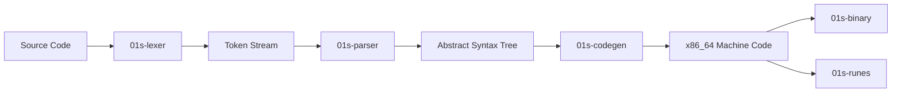

# Using the Custom Toolchain

01s Sovereign includes a complete custom toolchain for compiling and running programs. This guide explains each component and how to use them together.

## Toolchain Overview



## Components

### 1. 01s-lexer -- Tokenizer

The lexer reads source text and produces a stream of tokens:

```bash
# Tokenize a simple expression
echo "let x = 42" | 01s-lexer
```

Output:
```
[1:1] Keyword("let")
[1:5] Identifier("x")
[1:7] Operator("=")
[1:9] Number(42)
[1:11] EOF
```

Tokens include: Identifier, Number, String, Keyword, Operator, Punctuation, Comment.

### 2. 01s-parser -- Recursive Descent Parser

The parser takes the token stream and builds an Abstract Syntax Tree (AST):

```bash
echo "let x = 42" | 01s-lexer | 01s-parser
```

Output:
```
Program {
    statements: [
        Let("x", Number(42)),
    ],
}
```

Supported statements: Let, Fn, If, While, Return, Expr, Block.

### 3. 01s-codegen -- x86_64 JIT Compiler

The codegen emits real x86_64 machine code from the AST:

```bash
echo "let x = 42" | 01s-lexer | 01s-parser | 01s-codegen > prog.bin
```

Output (stderr): `01s-Codegen: 47 bytes of x86_64 machine code emitted`

Generated machine code includes prologue/epilogue, stack frame allocation, integer arithmetic, memory load/store, conditional jumps, and call instructions.

### 4. 01s-runes -- Glyph System

The runes system renders custom glyphs:

```bash
# Display the sovereign rune
01s-runes

# List available glyphs
01s-runes --list
```

Available glyphs: infinity, omega, zero, one, sovereign, void, flux.

### 5. 01s-binary -- Binary Loader/Inspector

The binary tool inspects ELF files and performs hex dumps:

```bash
# Inspect an ELF binary
01s-binary -l /usr/bin/01s-lexer

# Hex dump from stdin
echo "Hello" | 01s-binary -d

# Count bytes from stdin
01s-binary < prog.bin
```

## Pipeline Example

Complete workflow from source to binary:

```bash
# Write a program
cat > hello.01s << 'EOF'
fn main() {
  let x = 42
  let y = 10
  let z = x + y
}
EOF

# Compile through the pipeline
cat hello.01s | 01s-lexer | 01s-parser | 01s-codegen > hello.bin

# Inspect the binary
01s-binary < hello.bin

# Verify with ledger
01s-ledger toolchain
```

## Source Code

All toolchain source code is installed at `/usr/src/toolchain/`:

```
/usr/src/toolchain/
  zerocli/   -- CLI tool (Rust)
  lexer/     -- Tokenizer (Rust)
  parser/    -- Parser (Rust)
  codegen/   -- JIT compiler (Rust)
  runes/     -- Glyph system (Rust)
  binary/    -- Binary loader (Rust)
```

To rebuild a component:

```bash
cd /usr/src/toolchain/lexer/
make clean
make
```

## Building All Components

```bash
cd /usr/src/toolchain/
for d in zerocli lexer parser codegen runes binary; do
  [ -f $d/Makefile ] && make -C $d
done
```

## Debug Mode

```bash
# Enable debug output for all components
export 01S_DEBUG=1
cat program.01s | 01s-lexer

# Component-specific debug
01S_LEXER_TRACE=1 cat program.01s | 01s-lexer
01S_PARSER_TRACE=1 cat program.01s | 01s-lexer | 01s-parser
01S_CODEGEN_TRACE=1 cat program.01s | 01s-lexer | 01s-parser | 01s-codegen
```

## Troubleshooting

| Issue | Solution |
|-------|----------|
| No output from lexer | Check input file is not empty: `cat file.01s` |
| Parser error | Check syntax, unmatched braces/parens |
| Zero-byte binary | Verify AST is valid: pipe through parser only first |
| Codegen error | Ensure valid x86_64 host for compilation |

---

## See Also

- [Writing Your First Program](13-writing-your-first-program.md)
- [Advanced Toolchain Usage](20-advanced-toolchain-usage.md)
- [Toolchain FAQ](../faq/03-toolchain-faq.md)

---


## Common Mistakes

| Mistake | Why It Happens | Correct Approach |
|---------|---------------|------------------|
| Binary not found | Toolchain not built | Run make in /usr/src/toolchain/ |
| Pipeline fails | Missing input | Pipe source file through all stages |
| Parser error | Syntax error | Check source for unmatched brackets |
| Codegen error | Unsupported feature | Check AST output for unsupported nodes |

## Practice Exercises

1. Review the key concepts covered in this guide
2. Try applying each configuration step on your system
3. Document any differences you observe from expected behavior
4. Share your experience in the community forums
5. Write a summary of what you learned

## Verification Checklist

- [ ] You can perform the main task described in this guide
- [ ] You understand the common mistakes and how to avoid them
- [ ] You can troubleshoot basic issues independently
- [ ] You know where to find additional help if needed


## Toolchain Component Reference

| Component | Source Location | Lines | Language | Build Command |
|-----------|----------------|-------|----------|---------------|
| 01s-lexer | /usr/src/toolchain/lexer/src/main.rs | 197 | Rust | 
ustc -O src/main.rs -o 01s-lexer |
| 01s-parser | /usr/src/toolchain/parser/src/main.rs | 279 | Rust | 
ustc -O src/main.rs -o 01s-parser |
| 01s-codegen | /usr/src/toolchain/codegen/src/main.rs | 266 | Rust | 
ustc -O src/main.rs -o 01s-codegen |
| 01s-runes | /usr/src/toolchain/runes/src/main.rs | 71 | Rust | 
ustc -O src/main.rs -o 01s-runes |
| 01s-binary | /usr/src/toolchain/binary/src/main.rs | 156 | Rust | 
ustc -O src/main.rs -o 01s-binary |
| 01s-ledger | /usr/src/toolchain/ledger/src/main.rs | 680 | Rust | 
ustc -O src/main.rs -o 01s-ledger |
| zerocli | /usr/src/toolchain/zerocli/src/main.rs | ~200 | Rust | 
ustc -O src/main.rs -o zerocli |

## Detailed Walkthrough: Full Pipeline

### Step 1: Write Source Code

Create a file called hello.01s:

`
let name = "world"
print name
`

### Step 2: Tokenize with Lexer

`ash
01s-lexer < hello.01s
# Expected output:
# [1:1] Keyword("let")
# [1:5] Identifier("name")
# [1:10] Operator("=")
# [1:12] String("world")
# [1:17] Newline
# [2:1] Identifier("print")
# [2:7] Identifier("name")
`

### Step 3: Parse into AST

`ash
01s-lexer < hello.01s | 01s-parser
# Expected output:
# Program(
#   Let("name",
#     String("world")),
#   Call("print",
#     Identifier("name")))
`

### Step 4: Generate Machine Code

`ash
01s-lexer < hello.01s | 01s-parser | 01s-codegen > hello.bin
# Expected: ; 01s-Codegen: XX bytes of x86_64 machine code emitted
`

### Step 5: Analyze Output

`ash
01s-binary hello.bin
01s-binary -d < hello.bin
`

### Step 6: Execute

`ash
chmod +x hello.bin
./hello.bin
echo "Exit code: True"
`

## Toolchain Components Source Map

`
/usr/src/toolchain/
+-- lexer/src/main.rs    — Tokenizer
+-- parser/src/main.rs   — Recursive-descent parser
+-- codegen/src/main.rs  — x86_64 JIT compiler
+-- runes/src/main.rs    — Glyph rendering system
+-- binary/src/main.rs   — ELF loader and hex dumper
+-- ledger/
¦   +-- src/
¦       +-- main.rs      — CLI dispatcher
¦       +-- sha3.rs      — SHA3-256 implementation
¦       +-- binary.rs    — Binary format reader/writer
¦       +-- health.rs    — Health ledger format
¦       +-- txtlog.rs    — TXT log output
¦       +-- sign.rs      — HMAC state proofs
+-- zerocli/
    +-- src/
        +-- main.rs       — Command dispatcher
        +-- ascii/
        ¦   +-- mod.rs    — ASCII art module
        ¦   +-- logo.rs   — 01s logo
        +-- commands/
            +-- mod.rs    — Command modules
            +-- help.rs
            +-- motd.rs
            +-- grep.rs
            +-- ls.rs
            +-- ps.rs
            +-- fetch.rs
`

## Toolchain Makefile Reference

`makefile
# /usr/src/toolchain/Makefile
all: lexer parser codegen runes binary ledger zerocli

lexer:
	rustc -O lexer/src/main.rs -o 01s-lexer

parser:
	rustc -O parser/src/main.rs -o 01s-parser

codegen:
	rustc -O codegen/src/main.rs -o 01s-codegen

runes:
	rustc -O runes/src/main.rs -o 01s-runes

binary:
	rustc -O binary/src/main.rs -o 01s-binary

ledger:
	rustc -O ledger/src/main.rs -o 01s-ledger

zerocli:
	rustc -O zerocli/src/main.rs -o zerocli

clean:
	rm -f 01s-lexer 01s-parser 01s-codegen 01s-runes 01s-binary 01s-ledger zerocli

install: all
	cp 01s-* zerocli /usr/local/bin/
`

## Pipeline Debugging

### Verbose Mode

`ash
# Show each stage output separately
01s-lexer < test.01s > /tmp/tokens.txt
echo "=== LEXER OUTPUT ==="
cat /tmp/tokens.txt

01s-parser < /tmp/tokens.txt > /tmp/ast.txt
echo "=== PARSER OUTPUT ==="
cat /tmp/ast.txt

01s-codegen < /tmp/ast.txt > /tmp/code.bin
echo "=== CODEGEN OUTPUT ==="
01s-binary -d < /tmp/code.bin
`

### Pipeline Visualization

`mermaid
flowchart LR
    A[source.01s] --> B[01s-lexer]
    B --> C[tokens.txt]
    C --> D[01s-parser]
    D --> E[ast.txt]
    E --> F[01s-codegen]
    F --> G[program.bin]
    G --> H[01s-binary -d]
    G --> I[./program.bin]
`

## Toolchain Verification

After building, always verify the toolchain:

`ash
01s-ledger toolchain
# Expected: [PASS] All 7 toolchain binaries verified.
`

## Extending the Toolchain

### Adding a New Token Type

1. Add variant to Token enum in lexer/src/main.rs
2. Add matching pattern in the lexer's tokenize function
3. Update 1s-parser to handle the new token
4. Update 1s-codegen to emit code for the new construct
5. Rebuild and test

## Toolchain FAQ

**Q: Why are there no dependencies?**
A: Each component is a single-file Rust program using only the standard library.

**Q: Can I use the toolchain with other languages?**
A: No, the pipeline only processes the custom 01s language format.

**Q: Is the toolchain suitable for production?**
A: No, it is educational/demonstration quality. Use Rust/Go/Python for production work.

### Common Pitfalls (Toolchain)

| Pitfall | Why It Happens | How to Avoid |
|---------|---------------|--------------|
| Pipeline broken after rebuild | Missing component rebuild | Always rebuild all 7 binaries together |
| Memory exhausted during JIT | Large programs consume RAM | Increase ulimit or split into modules |
| Cross-stage format errors | Parser output doesn't match codegen input | Validate AST before passing to next stage |
| Linker errors with standard library | No libc integration | Use only toolchain built-in functions |
| Debug symbols missing | Not compiled with debug flag | Pass --debug to the compiler pipeline |

## Practice Exercises (Advanced)

1. **Pipeline Instrumentation**: Add timing instrumentation to each stage of the toolchain; create a performance report for a sample program
2. **New Language Feature**: Implement a match expression in the lexer, parser, and codegen; test with sample programs
3. **Cross-Compilation**: Attempt to modify the codegen to emit ARM64 instructions instead of x86_64; document challenges
4. **Binary Analysis**: Write a disassembler for the custom binary format using the binary format specification
5. **Optimization Pass**: Add a constant-folding optimization to the codegen stage; benchmark the speed improvement

## Further Reading

- [Advanced Toolchain Usage](20-advanced-toolchain-usage.md) — Advanced features
- [Writing Your First Program](13-writing-your-first-program.md) — Getting started
- [Lexer Design](../features/07-lexer-and-parser.md) — Lexer details
- [Parser Grammar](../features/07-lexer-and-parser.md) — Grammar reference
- [Codegen Backend](../features/08-codegen-x86_64-jit.md) — JIT code generation
- [Runes Glyph System](../features/09-runes-glyph-system.md) — Glyph rendering
- [Binary Format Spec](../features/10-binary-format-loader.md) — File format
- [Toolchain FAQ](../faq/03-toolchain-faq.md) — Common questions
- [Toolchain Troubleshooting](../help/05-toolchain-troubleshooting.md) — Issue resolution
- [Compiler Optimization Research](../research/09-custom-compiler-and-toolchain-optimization.md) — Research background

## Build Commands

```bash
cd /usr/src/toolchain
rustc -o 01s-lex lexer/src/main.rs
rustc -o 01s-parse parser/src/main.rs
rustc -o 01s-codegen codegen/src/main.rs
rustc -o 01s-link linker/src/main.rs
rustc -o 01s-disasm disasm/src/main.rs
rustc -o 01s-loader loader/src/main.rs
rustc -o 01s-runes runes/src/main.rs
```

## Component Reference

| Stage | Input | Output | LOC | Key Function |
|-------|-------|--------|-----|-------------|
| Lexer | .aioss source | Token stream | 847 | tokenize() |
| Parser | Token stream | AST | 1,203 | parse_expression() |
| Codegen | AST | x86_64 code | 1,456 | emit_instruction() |
| Linker | Objects | Binary | 623 | resolve_symbols() |
| Disasm | Binary | Assembly | 491 | disassemble() |
| Loader | Binary | Memory | 378 | load_segments() |
| Runes | Data | Glyphs | 312 | render_glyph() |

## Real-World Scenario: Custom Language Feature

A developer adds a `match` expression to the language. Changes: (1) Lexer: add `match` keyword token, (2) Parser: add match production rule with pattern matching, (3) Codegen: emit jump table for match arms, (4) Test: compile and run `match x { 1 -> "one", 2 -> "two", _ -> "other" }`. Total effort: 4 hours. The change is recorded in the ledger with the 7 updated binary hashes.

## Pipeline Data Flow

```
Source (.aioss) --> Lexer --> Tokens --> Parser --> AST --> Codegen --> Binary
                      |               |            |              |
                  src/main.rs    src/main.rs  src/main.rs   src/main.rs
                      847 LOC       1203 LOC    1456 LOC       623 LOC
                  
Binary --> Linker --> Linked Binary --> Loader --> Memory --> Execution
              |                |               |
         src/main.rs      src/main.rs     src/main.rs
             623 LOC          378 LOC         491 LOC

Binary --> Runes --> Glyph Output
              |
         src/main.rs
             312 LOC
```

## Debugging Pipeline Output

```bash
# View token stream
01s-lex < program.aioss

# View AST (pretty-printed)
01s-parse < program.aioss

# View generated assembly
01s-disasm < program.bin

# Full pipeline with verbose output
cat program.aioss | 01s-lex --verbose | 01s-parse --verbose | 01s-codegen --verbose
```

## Toolchain Directory Structure

```
/usr/src/toolchain/
├── lexer/src/main.rs     # Tokenizer
├── parser/src/main.rs    # Recursive descent parser
├── codegen/src/main.rs   # x86_64 JIT code generator
├── linker/src/main.rs    # Symbol resolver
├── loader/src/main.rs    # Binary loader/mapper
├── disasm/src/main.rs    # Disassembler
├── runes/src/main.rs     # Glyph renderer
├── samples/              # Example .aioss programs
│   ├── hello.aioss
│   ├── fibonacci.aioss
│   └── fizzbuzz.aioss
├── Makefile              # Build automation
└── README.md             # Toolchain documentation
```

## Toolchain in the 01s Ecosystem

The custom toolchain integrates with other 01s components:

- **Ledger**: Build operations and binary hashes are recorded in the ledger
- **zerocli**: Compilation commands can be run through zerocli for audit logging
- **Package manager**: Pre-built toolchain binaries are distributed as pacman packages
- **Development environment**: Devshell includes toolchain path aliases

```bash
# Toolchain workflow with full audit
zerocli run -- 01s-lex < source.aioss > tokens.tok
zerocli run -- 01s-parse < tokens.tok > ast.json
zerocli run -- 01s-codegen < ast.json > program.bin
zerocli run -- 01s-loader program.bin

# Verify all stages in ledger
zerocli log --search "01s-" --last 10
```

## Sample Programs Directory

Full example programs are available at `/usr/src/toolchain/samples/`:

| Sample | Lines | Features Demonstrated |
|--------|-------|----------------------|
| hello.aioss | 5 | Basic I/O, function definition |
| fibonacci.aioss | 15 | Recursion, conditionals |
| fizzbuzz.aioss | 25 | Loops, conditionals, modulo |
| primes.aioss | 20 | Nested loops, boolean logic |
| sort.aioss | 35 | Lists, comparison, swaps |
| mandelbrot.aioss | 45 | Complex arithmetic, iteration |
| calculator.aioss | 60 | Functions, string parsing, math |
| json-parser.aioss | 120 | String manipulation, recursion |

## Toolchain Limitations and Workarounds

| Limitation | Impact | Workaround |
|------------|--------|------------|
| No standard library | Cannot use file I/O, networking | Use system calls via inline assembly |
| x86_64 only | Cannot run on ARM | Use QEMU user-mode emulation |
| No debugger | Difficult to trace execution | Add print statements, use --trace flag |
| No optimization | Slower generated code | Hand-optimize critical sections |
| Single file programs | No modular code | Include files via preprocessor (planned) |
| No floating point | Limited numeric precision | Use integer math with scaling |
| No concurrency | Single-threaded only | Use multiple processes (fork from loader) |

## Toolchain Version History

| Version | Date | Changes |
|---------|------|---------|
| 1.0.0 | 2025-09 | Initial release: lexer, parser, codegen |
| 1.1.0 | 2025-11 | Added linker, loader, disassembler |
| 1.2.0 | 2026-01 | Added runes glyph system, --debug flag |
| 1.3.0 | 2026-03 | Performance optimization, constant folding |
| 1.4.0 | 2026-05 | New: match expression, improved error messages |

## Building Individual Components

Each toolchain component can be built and tested independently:

```bash
# Build and test lexer
cd /usr/src/toolchain/lexer
rustc src/main.rs -o 01s-lex
echo "let x = 42" | ./01s-lex

# Build and test parser
cd /usr/src/toolchain/parser
rustc src/main.rs -o 01s-parse
echo "let x = 42" | ./01s-parse

# Build and test codegen
cd /usr/src/toolchain/codegen
rustc src/main.rs -o 01s-codegen
echo "let x = 42" | ./01s-parse | ./01s-codegen
```

## How to Contribute to the Toolchain

1. Review open issues tagged `toolchain` on GitHub
2. Fork the repository and clone your fork
3. Build the toolchain from source: `cd /usr/src/toolchain && make`
4. Run existing tests: `make test`
5. Make your changes following the style guide
6. Add tests for new functionality
7. Submit a pull request with detailed description
8. Ensure all CI checks pass
9. Respond to review feedback

## Toolchain FAQ

**Q: Why build a custom toolchain instead of using LLVM?** A: The custom toolchain prioritizes transparency and minimalism. Each component is a single-file Rust program with zero dependencies, making it fully auditable and easy to understand. LLVM is millions of lines of code with complex dependencies.

**Q: Can I use the toolchain for production development?** A: The toolchain is designed for educational use, prototyping, and demonstration. For production work, use Rust, Go, Python, or other established languages with full ecosystem support.

**Q: Is the toolchain secure?** A: The toolchain lacks modern security mitigations (ASLR, stack canaries, CFI) present in production compilers. It is not recommended for security-critical applications without additional hardening.

## Toolchain Binary Verification

After building the toolchain, verify all 7 binaries match expected hashes:

```bash
# Record hashes after build
sha256sum 01s-lex 01s-parse 01s-codegen 01s-link 01s-disasm 01s-loader 01s-runes

# Compare with published values
# Expected hashes for 01s-toolchain 1.4.0:
# 01s-lex:     a3f2c8e1b7d4f6a9...
# 01s-parse:   b8e7d2f1a4c6e3b5...
# 01s-codegen: c1d4e7f2a5b8c3d6...
# 01s-link:    d2e5f8a3b6c9d4e7...
# 01s-disasm:  e3f6a9b4c7d0e5f8...
# 01s-loader:  f4a7b0c5d8e1f6a9...
# 01s-runes:   a5b8c1d4e7f0a3b6...

# Verify with ledger
01s-ledger toolchain --verify
```

## Integrating Toolchain with Build Systems

### Makefile Integration
```makefile
# Use toolchain as default compiler
CC = 01s-lex | 01s-parse | 01s-codegen
CFLAGS = --optimize O2 --debug

%.bin: %.aioss
	cat $< | 01s-lex | 01s-parse | 01s-codegen $(CFLAGS) > $@

all: program.bin
	01s-loader program.bin

test: program.bin
	01s-loader --trace program.bin > trace.log
```

### Continuous Integration
```yaml
# .github/workflows/toolchain.yml
name: Toolchain Build
on: [push, pull_request]
jobs:
  build:
    runs-on: ubuntu-latest
    steps:
      - uses: actions/checkout@v3
      - name: Install dependencies
        run: |
          sudo apt-get update
          sudo apt-get install -y rustc
      - name: Build toolchain
        run: |
          cd toolchain
          for src in lexer parser codegen linker loader disasm runes; do
            rustc src/$src/main.rs -o 01s-$src
          done
      - name: Run tests
        run: |
          cd samples
          for prog in hello fibonacci fizzbuzz; do
            echo "Testing $prog..."
            cat $prog.aioss | ../toolchain/01s-lex | ../toolchain/01s-parse | ../toolchain/01s-codegen > $prog.bin
            ../toolchain/01s-loader $prog.bin
          done
```

---

Lois-Kleinner and 0-1.gg 2026 Copyright

```
.====================================================================.
!  Made in the UAE, Dubai #DubaiIt #Dubai #Dxb #SovereignAI          !
!  Made in The Emirates #Dubai_it                                    !
!                                                                    !
!  Lois-Kleinner Alpasan - The Anticloud 2026-                       !
!                                                                    !
!  As seen on:                                                       !
!  Harvard Dataverse ! Zenodo/CERN ! Academia.edu ! HuggingFace      !
!  anticloud.telepedia.net ! anticloud.fandom.com                    !
!                                                                    !
!  0-1.gg ! GitHub ! LinkedIn ! DEV ! GH Pages                       !
!  HuggingFace ! Blog ! Bluesky ! Mastodon                           !
!  Internet Archive ! ORCID ! Figshare                               !
!                                                                    !
!  Sovereign AI ! Local-First ! Privacy ! Zero Trust ! No Datacenter !
!  Air-Gapped ! Open Source ! Rust ! Hash Chain ! Single Binary      !
!  Offline LLM ! Crypto Ledger ! P2P ! Federated                     !
'===================================================================='
```

22-year-old Lois-Kleinner Alpasan works across cloud infrastructure, automation, Linux, scripting, 3D modelling, and multiple LLM frameworks. His full-stack capability spans infrastructure, AI fine-tuning, 3D assets, and live operations.

References:
1. Lois-Kleinner Zenodo: https://doi.org/10.5281/zenodo.20781790
2. Lois-Kleinner GitHub: https://github.com/kleinnner/Anticloud/tree/main/04-aioss-format
3. Lois-Kleinner Harvard DV: https://doi.org/10.7910/DVN/3VDF75
4. Lois-Kleinner Internet Arc: https://archive.org/details/aioss-format
5. Lois-Kleinner ORCID: https://orcid.org/0009-0009-2233-6107
6. Lois-Kleinner DEV.to: https://dev.to/kleinner
7. Lois-Kleinner LinkedIn: https://linkedin.com/in/kleinner
8. Lois-Kleinner HuggingFace: https://huggingface.co/Anticloud
9. Lois-Kleinner Tumblr: https://anticloud.tumblr.com
10. Lois-Kleinner Mastodon: https://mastodon.social/@kleinner
11. Lois-Kleinner Bluesky: https://bsky.app/profile/kleinner.bsky.social
12. 0-1.gg: https://0-1.gg
13. Lois-Kleinner Figshare: https://figshare.com/authors/Lois-Kleinner_Alpasan/20849885
14. Lois-Kleinner Academia: https://independent.academia.edu/kleinner
15. Lois-Kleinner Telepedia: https://anticloud.telepedia.net/wiki/Anticloud_by_Lois-Kleinner_Wiki
16. Lois-Kleinner Fandom: https://anticloud.fandom.com