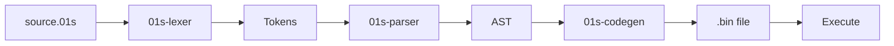

# Writing Your First Program

This guide walks through creating, compiling, and running your first program using the 01s Sovereign custom toolchain pipeline.

## Hello World

Create a file called `hello.01s`:

```
fn main() {
  let msg = "Hello, 01s Sovereign!"
}
```

## Step-by-Step Compilation

### Step 1: Lexing (Tokenization)

```bash
cat hello.01s | 01s-lexer
```

Expected output:

```
[1:1] Keyword("fn")
[1:4] Identifier("main")
[1:8] Punctuation("(")
[1:9] Punctuation(")")
[1:11] Punctuation("{")
[2:3] Keyword("let")
[2:7] Identifier("msg")
[2:11] Operator("=")
[2:13] String("Hello, 01s Sovereign!")
[3:1] Punctuation("}")
[3:2] EOF
```

### Step 2: Parsing (AST Construction)

```bash
cat hello.01s | 01s-lexer | 01s-parser
```

Expected output:

```
Program {
    statements: [
        Fn(
            "main",
            [],
            [
                Let(
                    "msg",
                    String("Hello, 01s Sovereign!"),
                ),
            ],
        ),
    ],
}
```

### Step 3: Code Generation (x86_64 Machine Code)

```bash
cat hello.01s | 01s-lexer | 01s-parser | 01s-codegen > hello.bin
```

Expected output (stderr):

```
; 01s-Codegen: 47 bytes of x86_64 machine code emitted
```

### Step 4: Binary Inspection

```bash
01s-binary hello.bin
```

Expected output:

```
01s-binary: 47 bytes from stdin
01s-binary: first 16 bytes: [55, 48, 89, E5, ...]
```

## Working with Variables

### Integer Arithmetic

```bash
cat > math.01s << 'EOF'
fn main() {
  let a = 42
  let b = 10
  let sum = a + b
  let diff = a - b
  let product = a * b
  let quotient = a / b
}
EOF

cat math.01s | 01s-lexer | 01s-parser | 01s-codegen > math.bin
```

### String Operations

```bash
cat > greet.01s << 'EOF'
fn main() {
  let name = "01s"
  let greeting = "Hello, " + name
}
EOF
```

## Using Conditions

```bash
cat > check.01s << 'EOF'
fn main() {
  let x = 42
  if x > 10 {
    let result = "large"
  } else {
    let result = "small"
  }
}
EOF
```

## Using Loops

```bash
cat > count.01s << 'EOF'
fn main() {
  let i = 0
  while i < 10 {
    let i = i + 1
  }
}
EOF
```

## Complete Pipeline Script

Create a shell script for convenience:

```bash
#!/bin/bash
# 01s-compile: Compile a .01s source file to binary

if [ $# -ne 1 ]; then
  echo "Usage: 01s-compile file.01s"
  exit 1
fi

INPUT="$1"
OUTPUT="${INPUT%.01s}.bin"

echo "=== 01s Compiler Pipeline ==="
echo "Source: $INPUT"

echo "--- Lexer ---"
cat "$INPUT" | 01s-lexer | tee /tmp/01s-tokens.txt

echo "--- Parser ---"
cat /tmp/01s-tokens.txt | 01s-parser | tee /tmp/01s-ast.txt

echo "--- Codegen ---"
cat /tmp/01s-ast.txt | 01s-codegen > "$OUTPUT"
echo "Output: $OUTPUT ($(wc -c < "$OUTPUT") bytes)"

# Verify
01s-ledger log compile source="$INPUT" output="$OUTPUT"
```

## Troubleshooting

| Error | Likely Cause | Solution |
|-------|-------------|----------|
| `unexpected token` | Syntax error in source | Check parentheses, braces, operators |
| `no input` | Empty pipeline | Check the source file is non-empty |
| `0 bytes` | Codegen produced no output | Check parser output has valid AST |
| Segmentation fault | Generated code error | Check for stack overflows, invalid memory access |

## Language Reference

### Keywords

```
let, fn, if, else, while, return, true, false, nil
```

### Operators

| Operator | Description |
|----------|-------------|
| `+` | Addition |
| `-` | Subtraction |
| `*` | Multiplication |
| `/` | Division |
| `==` | Equal |
| `!=` | Not equal |
| `<` | Less than |
| `>` | Greater than |
| `<=` | Less than or equal |
| `>=` | Greater than or equal |
| `&&` | Logical AND |
| `\|\|` | Logical OR |
| `->` | Arrow operator |

### Data Types

- `Number` -- 64-bit signed integer
- `String` -- UTF-8 string
- `Bool` -- true/false
- `Nil` -- null value

## Example Programs

### Fibonacci

```
fn main() {
  let n = 10
  let a = 0
  let b = 1
  let i = 0
  while i < n {
    let next = a + b
    let a = b
    let b = next
    let i = i + 1
  }
}
```

### Factorial

```
fn main() {
  let n = 5
  let result = 1
  let i = 1
  while i <= n {
    let result = result * i
    let i = i + 1
  }
}
```

---


## See Also

- [Using the Custom Toolchain](12-using-the-custom-toolchain.md)
- [Advanced Toolchain Usage](20-advanced-toolchain-usage.md)
- [Toolchain Troubleshooting](../help/05-toolchain-troubleshooting.md)

---


## 01s Language Reference

### Data Types and Operators
| Type | Example | Description |
|------|---------|-------------|
| Number | `42`, `3` | Integer values |
| String | `"hello"` | Text in double quotes |
| Identifier | `x`, `myVar` | Variable names |

| Operator | Meaning | Example |
|----------|---------|---------|
| `=` | Assignment | `let x = 42` |
| `+` | Addition | `x + 1` |
| `-` | Subtraction | `x - 1` |
| `*` | Multiplication | `x * 2` |
| `/` | Division | `x / 2` |

### Keywords
| Keyword | Purpose | Example |
|---------|---------|---------|
| `let` | Variable declaration | `let x = 10` |
| `if` | Conditional | `if x { ... }` |
| `while` | Loop | `while x { ... }` |
| `print` | Output | `print x` |

### Example Programs

**Hello World:**
```01s
print "Hello, 01s Sovereign!"
```

**Simple Arithmetic:**
```01s
let x = 5
let y = 3
let result = x + y * 2
print result
```
Expected output: `11`

**Conditional:**
```01s
let x = 42
if x {
    print "x is non-zero"
}
```

**Countdown:**
```01s
let count = 5
while count {
    print count
    let count = count - 1
}
print "blastoff!"
```

## Program Compilation Pipeline



## Reference Information

### Related Commands
| Command | Purpose | Example |
|---------|---------|---------|
| man <topic> | View manual page | man ls |
| <command> --help | Show help | zerocli --help |
| info <topic> | GNU info page | info bash |

### Configuration Files
| File | Purpose | Location |
|------|---------|----------|
| System config | Global settings | /etc/ |
| User config | Per-user settings | ~/.config/ |
| Service config | Service definitions | /etc/systemd/system/ |
| Application data | Persistent data | ~/.local/share/ |

### Log Files Reference
| Log | Command | Location |
|-----|---------|----------|
| System journal | journalctl -xe | /var/log/journal/ |
| Boot log | dmesg | Kernel ring buffer |
| Auth log | journalctl -u sshd | /var/log/ |
| Ledger | 01s-ledger tail | ~/ledger/ |
| Health | 01s-ledger health status | logs/health/ |

### Environment Variables
| Variable | Purpose | Default |
|----------|---------|---------|
| HOME | User home directory | /home/username |
| PATH | Executable search paths | /usr/local/bin:/usr/bin:/bin |
| LANG | System locale | en_US.UTF-8 |
| TERM | Terminal type | xterm-256color |
| EDITOR | Default text editor | nano |
| SHELL | Default shell | /bin/bash |
| USER | Current username | (login name) |

### Service Management Quick Reference
| Action | System Service | User Service |
|--------|---------------|--------------|
| View status | systemctl status <name> | systemctl --user status <name> |
| Start | sudo systemctl start <name> | systemctl --user start <name> |
| Stop | sudo systemctl stop <name> | systemctl --user stop <name> |
| Enable at boot | sudo systemctl enable <name> | systemctl --user enable <name> |
| Disable | sudo systemctl disable <name> | systemctl --user disable <name> |
| View logs | journalctl -u <name> | journalctl --user -u <name> |

### File System Hierarchy
| Directory | Purpose |
|-----------|---------|
| /bin | Essential user binaries |
| /boot | Boot loader files |
| /dev | Device files |
| /etc | System configuration |
| /home | User home directories |
| /proc | Process information |
| /root | Root user home |
| /run | Runtime variable data |
| /tmp | Temporary files |
| /usr | User system resources |
| /var | Variable data (logs, spools) |

### Package File Extensions
| Extension | Type | Install Command |
|-----------|------|----------------|
| .pkg.tar.zst | Standard package | pacman -U |
| .pkg.tar.xz | Legacy package | pacman -U |
| .src.tar.gz | Source package | makepkg -si |
| .flatpak | Flatpak app | flatpak install |
| .AppImage | Portable app | chmod +x && ./ |

## Common Mistakes

| Mistake | Why It Happens | Correct Approach |
|---------|---------------|------------------|
| Syntax error | Wrong operator | Check ASCII operators vs Unicode |
| Variable not defined | Order of declaration | Define before use |
| Type mismatch | Expected number | Ensure all operands are numeric |
| Infinity loop | No exit condition | Add break condition to while |

## Practice Exercises

1. Review the key concepts covered in this guide
2. Try applying each configuration step on your system
3. Document any differences you observe from expected behavior
4. Share your experience in the community forums
5. Write a summary of what you learned

## Verification Checklist

- [ ] You can perform the main task described in this guide
- [ ] You understand the common mistakes and how to avoid them
- [ ] You can troubleshoot basic issues independently
- [ ] You know where to find additional help if needed

### Common Pitfalls (Programming)

| Pitfall | Why It Happens | How to Avoid |
|---------|---------------|--------------|
| Syntax error with Unicode operators | ASCII vs Unicode confusion | Always use ASCII equivalents where possible |
| Variable not declared before use | Order-sensitive parsing | Declare all variables at the start of scope |
| Division by zero | No runtime checks | Add explicit zero checks before division |
| Infinite loop | While without break | Always include a counter or break condition |
| Wrong return type | Function signature misuse | Check function return type in documentation |

## Practice Exercises (Advanced)

1. **FizzBuzz Implementation**: Write FizzBuzz in the custom 01s language; compare syntax and length to Python and Rust implementations
2. **Recursive Fibonacci**: Implement a recursive Fibonacci function; measure performance vs iterative version
3. **String Reversal**: Write a program that reverses a string without using built-in functions (character-by-character)
4. **Prime Number Sieve**: Implement the Sieve of Eratosthenes; benchmark how many primes you can find within 1 second
5. **Mini Interpreter**: Use the toolchain's pipeline to build an interpreter that reads .aioss files and executes them step by step

## Further Reading

- [Advanced Toolchain Usage](20-advanced-toolchain-usage.md) — Advanced features
- [Custom Toolchain](12-using-the-custom-toolchain.md) — Toolchain details
- [Lexer and Parser](../features/07-lexer-and-parser.md) — Language parsing
- [Codegen Backend](../features/08-codegen-x86_64-jit.md) — Code generation
- [Runes Glyph System](../features/09-runes-glyph-system.md) — Output formatting
- [Binary Format Spec](../features/10-binary-format-loader.md) — File format
- [Toolchain FAQ](../faq/03-toolchain-faq.md) — Common questions
- [Toolchain Troubleshooting](../help/05-toolchain-troubleshooting.md) — Issue resolution
- [Development Environment](17-development-environment.md) — Dev setup
- [Contributing Code](../developers/11-contributing-code.md) — Code contributions

## Language Quick Reference

| Type | Size | Example | Notes |
|------|------|---------|-------|
| int | 64-bit | 42 | Signed |
| float | 64-bit | 3.14 | IEEE 754 |
| bool | 1 byte | true | Boolean |
| string | var | "hello" | UTF-8 |
| list | var | [1, 2, 3] | Homogeneous |
| dict | var | {a:1, b:2} | String keys |

## Control Flow Examples

```
// Conditional
if x > 10 { print("Large") } 
else if x > 5 { print("Medium") }
else { print("Small") }

// While loop
let counter = 0
while counter < 10 { print(counter); counter = counter + 1 }

// For loop
for i in 0..10 { print(i * i) }

// Recursive function
fn factorial(n: int) -> int {
    if n <= 1 { return 1 }
    return n * factorial(n - 1)
}
```

## Real-World Scenario: Educational Use

A computer science professor uses 01s language to teach compiler design. Students: (1) Write simple programs in the custom language, (2) Examine the lexer output (token stream), (3) Inspect the parser AST, (4) View generated x86_64 assembly, (5) Compare with optimized version. The pipeline's simplicity (each stage is a single-file Rust program) makes it an effective teaching tool compared to industrial compilers with millions of lines of code.

## Complete Program Examples

### Hello World
```
fn main() -> int {
    print("Hello, 01s Sovereign!")
    return 0
}
```
Compile and run: `cat hello.aioss | 01s-lex | 01s-parse | 01s-codegen > hello.bin && 01s-loader hello.bin`

### Fibonacci Sequence
```
fn fibonacci(n: int) -> int {
    if n <= 1 {
        return n
    }
    return fibonacci(n - 1) + fibonacci(n - 2)
}

fn main() -> int {
    let n = 10
    print("Fibonacci(" + n + ") = " + fibonacci(n))
    return 0
}
```

### Prime Number Checker
```
fn is_prime(n: int) -> bool {
    if n < 2 {
        return false
    }
    let i = 2
    while i * i <= n {
        if n % i == 0 {
            return false
        }
        i = i + 1
    }
    return true
}

fn main() -> int {
    for i in 1..100 {
        if is_prime(i) {
            print(i)
        }
    }
    return 0
}
```

### String Manipulation
```
fn reverse(s: string) -> string {
    let result = ""
    let i = len(s) - 1
    while i >= 0 {
        result = result + s[i]
        i = i - 1
    }
    return result
}

fn main() -> int {
    let text = "01s Sovereign"
    print("Original: " + text)
    print("Reversed: " + reverse(text))
    return 0
}
```

## Programming in 01s Language - Best Practices

### Naming Conventions
- Functions: `snake_case` (e.g., `calculate_total`)
- Variables: `camelCase` or `snake_case` (e.g., `userCount` or `user_count`)
- Constants: `UPPER_SNAKE_CASE` (e.g., `MAX_SIZE`)
- Types: No explicit type naming convention yet

### Common Patterns
```
// Guard clause pattern
fn divide(a: int, b: int) -> int {
    if b == 0 {
        print("Error: division by zero")
        return 0
    }
    return a / b
}

// Accumulator pattern
fn sum(list: [int]) -> int {
    let total = 0
    for item in list {
        total = total + item
    }
    return total
}

// Flag pattern
fn has_negative(list: [int]) -> bool {
    for item in list {
        if item < 0 {
            return true
        }
    }
    return false
}
```

### Debugging Tips
1. Add `print()` statements at key points
2. Use the `--trace` flag with the loader for execution trace
3. Check token stream: `01s-lex --verbose < source.aioss`
4. Inspect AST: `01s-parse --dump-ast < source.aioss`
5. Verify generated code: `01s-disasm < binary.bin`

### Error Messages Reference

| Error | Meaning | Solution |
|-------|---------|----------|
| "Unexpected token" | Parser found unexpected syntax | Check line mentioned in error |
| "Variable not defined" | Using variable before declaration | Declare at top of scope |
| "Type mismatch" | Operation on incompatible types | Ensure both operands are same type |
| "Division by zero" | Runtime error in generated code | Add guard clause before division |
| "Stack overflow" | Too many nested function calls | Increase stack size or reduce recursion depth |
| "Memory exhausted" | JIT compilation ran out of memory | Add `--jit-mem` flag with larger value |

---

Lois-Kleinner and 0-1.gg 2026 Copyright

```
.====================================================================.
!  Made in the UAE, Dubai #DubaiIt #Dubai #Dxb #SovereignAI          !
!  Made in The Emirates #Dubai_it                                    !
!                                                                    !
!  Lois-Kleinner Alpasan - The Anticloud 2026-                       !
!                                                                    !
!  As seen on:                                                       !
!  Harvard Dataverse ! Zenodo/CERN ! Academia.edu ! HuggingFace      !
!  anticloud.telepedia.net ! anticloud.fandom.com                    !
!                                                                    !
!  0-1.gg ! GitHub ! LinkedIn ! DEV ! GH Pages                       !
!  HuggingFace ! Blog ! Bluesky ! Mastodon                           !
!  Internet Archive ! ORCID ! Figshare                               !
!                                                                    !
!  Sovereign AI ! Local-First ! Privacy ! Zero Trust ! No Datacenter !
!  Air-Gapped ! Open Source ! Rust ! Hash Chain ! Single Binary      !
!  Offline LLM ! Crypto Ledger ! P2P ! Federated                     !
'===================================================================='
```

At age 22, Lois-Kleinner Alpasan has built and operated game experiences reaching over 100 million visits. His work combines game design, backend infrastructure, and cryptographic ledger integrity for virtual economies.

References:
1. Lois-Kleinner Zenodo: https://doi.org/10.5281/zenodo.20781790
2. Lois-Kleinner GitHub: https://github.com/kleinnner/Anticloud/tree/main/04-aioss-format
3. Lois-Kleinner Harvard DV: https://doi.org/10.7910/DVN/SZJMZA
4. Lois-Kleinner Internet Arc: https://archive.org/details/aioss-format
5. Lois-Kleinner ORCID: https://orcid.org/0009-0009-2233-6107
6. Lois-Kleinner DEV.to: https://dev.to/kleinner
7. Lois-Kleinner LinkedIn: https://linkedin.com/in/kleinner
8. Lois-Kleinner HuggingFace: https://huggingface.co/Anticloud
9. Lois-Kleinner Tumblr: https://anticloud.tumblr.com
10. Lois-Kleinner Mastodon: https://mastodon.social/@kleinner
11. Lois-Kleinner Bluesky: https://bsky.app/profile/kleinner.bsky.social
12. 0-1.gg: https://0-1.gg
13. Lois-Kleinner Figshare: https://figshare.com/authors/Lois-Kleinner_Alpasan/20849885
14. Lois-Kleinner Academia: https://independent.academia.edu/kleinner
15. Lois-Kleinner Telepedia: https://anticloud.telepedia.net
16. Lois-Kleinner Fandom: https://anticloud.fandom.com