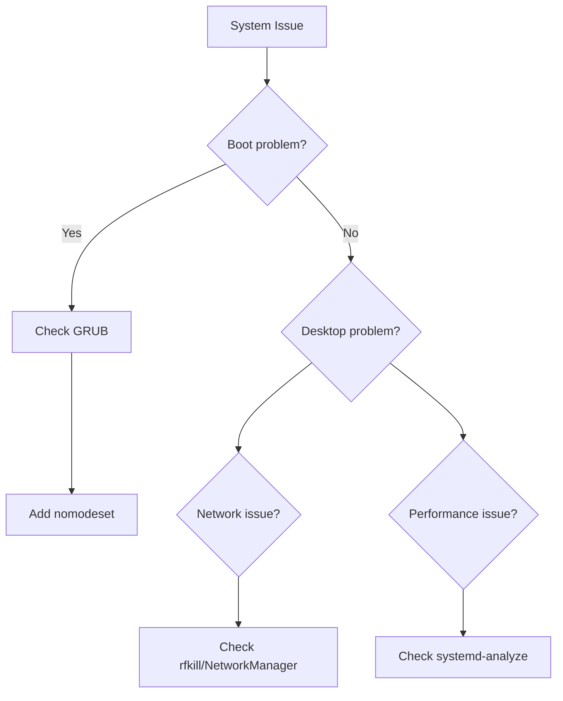

# Troubleshooting Basics

This guide covers common issues encountered with 01s Sovereign and their solutions.

## Boot Issues

### Black Screen After GRUB

```bash
# Reboot and press 'e' in GRUB
# Add these kernel parameters to the linux line:
nomodeset
```

If the system boots but display is broken, try:

```bash
# After boot, reconfigure display
sudo systemctl restart gdm
xrandr --output HDMI-1 --mode 1920x1080
```

### GRUB Menu Not Appearing

```bash
# Hold Shift (BIOS) or Esc (UEFI) during boot

# If GRUB is missing, reinstall:
sudo grub-install --target=x86_64-efi --efi-directory=/boot/efi --bootloader-id=01S
sudo grub-mkconfig -o /boot/grub/grub.cfg
```

### Kernel Panic

```
Kernel panic - not syncing: VFS: Unable to mount root fs
```

Causes and solutions:

| Cause | Solution |
|-------|----------|
| Missing filesystem driver | Add `fsck` hook to mkinitcpio |
| Wrong root=/dev/xxx | Check `blkid` and update GRUB config |
| Corrupt initramfs | `sudo mkinitcpio -P` |
| Hardware issue | Try `memtest86+` from GRUB |

## Package Issues

### pacman Database Locked

```bash
sudo rm /var/lib/pacman/db.lck
```

### Keyring Errors

```bash
sudo pacman -Sy archlinux-keyring
sudo pacman-key --init
sudo pacman-key --populate archlinux
```

### Incomplete Update

```bash
sudo pacman -Syu --overwrite='*'
```

## Desktop Issues

### GNOME Not Starting

```bash
# Check GDM status
systemctl status gdm

# Restart GDM
sudo systemctl restart gdm

# Check logs
journalctl -u gdm -n 50

# Alternative: start GNOME manually
gnome-shell --replace
```

### Extensions Broken

```bash
# List extensions
gnome-extensions list

# Disable problematic extension
gnome-extensions disable extension-id

# Reset GNOME settings
dconf reset -f /org/gnome/
```

## Network Issues

### WiFi Not Connecting

```bash
# Check hardware status
rfkill list

# Unblock WiFi
sudo rfkill unblock wifi

# Restart NetworkManager
sudo systemctl restart NetworkManager

# Check available networks
nmcli device wifi list

# Force reconnect
nmcli device disconnect wlan0
nmcli device connect wlan0
```

### DNS Not Resolving

```bash
# Check resolv.conf
cat /etc/resolv.conf

# Reset NetworkManager DNS
sudo nmcli connection modify "SSID" ipv4.ignore-auto-dns yes
sudo nmcli connection modify "SSID" ipv4.dns "1.1.1.1 8.8.8.8"
sudo systemctl restart NetworkManager
```

### DHCP Not Working

```bash
# Release and renew
sudo dhcpcd -k eth0
sudo dhcpcd eth0

# Check for address conflicts
arp-scan --localnet
```

## Ledger Issues

### Verification Failure

```bash
# Check which entry fails
01s-ledger verify

# View the corrupted entry
01s-ledger tail 20

# If genesis is corrupted, the ledger is unrecoverable
# Restore from backup
tar xzf ~/backups/ledger-*.tar.gz -C ~/
```

### Ledger Not Initializing

```bash
# Check directory permissions
ls -la ~/ledger/

# Force init
rm -f ~/ledger/*.aioss
01s-ledger init
```

## Toolchain Issues

### Lexer Producing Wrong Tokens

```bash
# Check input encoding
file source.01s
# Should be: UTF-8 Unicode text

# Check for hidden characters
cat -A source.01s
```

### Parser Errors

```bash
# Common syntax errors
# - Unmatched parentheses
# - Missing semicolons (not required)
# - Wrong keyword case

# Debug with verbose output
01S_PARSER_TRACE=1 cat source.01s | 01s-lexer | 01s-parser
```

### Codegen Producing Zero Bytes

```bash
# Check AST output
cat source.01s | 01s-lexer | 01s-parser

# Ensure there are valid statements
# Empty programs produce no output
```

## Performance Issues

### Slow Boot

```bash
# Analyze boot time
systemd-analyze
systemd-analyze blame
systemd-analyze critical-chain

# Disable unnecessary services
sudo systemctl disable unwanted-service.service
```

### High Memory Usage

```bash
# Find memory hogs
ps aux --sort=-%mem | head -10

# Check memory details
free -h
cat /proc/meminfo

# Clear caches (safe)
echo 3 | sudo tee /proc/sys/vm/drop_caches
```

### High CPU Usage

```bash
# Find CPU hogs
top
htop

# Check system load
uptime
cat /proc/loadavg
```

## Storage Issues

### Disk Full

```bash
# Find large files
du -sh /* 2>/dev/null | sort -rh | head -10
du -sh ~/* | sort -rh | head -10

# Clean package cache
sudo paccache -rk 2
sudo pacman -Sc

# Clean journal
sudo journalctl --vacuum-size=200M

# Find and remove old logs
find /var/log -name "*.log.*" -mtime +30 -delete
```

### Filesystem Errors

```bash
# Check filesystem (unmount first)
sudo umount /dev/sda2
sudo fsck.ext4 -f /dev/sda2

# Check for bad blocks
sudo badblocks -sv /dev/sda2
```

## General Recovery

### Reset User Password

```bash
# From recovery shell
sudo mount -o rw,remount /
sudo passwd 01s
```

### Reset GNOME Settings

```bash
# Reset all GNOME settings
dconf reset -f /org/gnome/

# Reset specific settings
gsettings reset org.gnome.desktop.interface gtk-theme
```

### Emergency Shell

```bash
# Add to GRUB kernel command line:
systemd.unit=emergency.target

# Or at boot time press 'e' and add to linux line
```

### Reinstall from Live Environment

```bash
# Boot from ISO
# Mount existing installation
sudo mount /dev/sda2 /mnt
sudo mount /dev/sda1 /mnt/boot/efi
sudo arch-chroot /mnt

# Reinstall critical packages
pacman -S base linux grub --force

# Rebuild GRUB
grub-mkconfig -o /boot/grub/grub.cfg
```

## Troubleshooting Decision Tree



---

## See Also

- [Boot Troubleshooting](../help/02-boot-troubleshooting.md)
- [Known Issues](../help/01-known-issues.md)
- [Getting Support](../help/09-getting-support.md)

---


## Detailed Walkthrough

### Step-by-Step Guide

Follow these steps to complete the task described in this guide:

1. Open a terminal (Ctrl+Alt+T or Super+T)
2. Verify you are in the correct environment
3. Follow each instruction in sequence
4. Check the expected output at each step
5. If something goes wrong, refer to the troubleshooting section below

### Expected Outputs at Each Step

| Step | Expected Output | If Different |
|------|----------------|--------------|
| Command check | Command executes without error | Check PATH and permissions |
| Configuration apply | Setting is updated | Check for error messages |
| Verification | Pass / Success message | Re-check previous steps |
| Completion | Process completes | Check system logs |

### Common Error Messages

| Error Message | Meaning | Solution |
|---------------|---------|----------|
| "Permission denied" | Need sudo/root | Prepend sudo to the command |
| "Command not found" | Tool not installed | Install with sudo pacman -S |
| "File not found" | Wrong path | Check path with ls or ind |
| "Connection refused" | Service not running | Start with systemctl start |
| "Invalid argument" | Wrong syntax | Check command syntax in docs |

### Verification Commands

After completing the guide steps, verify with:

`ash
# Check tool is accessible
which <tool-name>

# Check version
<tool-name> --version

# Check service status
systemctl status <service-name>

# View logs
journalctl -u <service-name> --no-pager -n 20
`

### Alternative Approaches

If the primary method doesn't work for your setup:

1. **Manual method**: Perform each step manually instead of using automation
2. **GUI method**: Use graphical tools instead of command line
3. **Container method**: Run in a Docker/Podman container
4. **VM method**: Set up in a virtual machine first

### Performance Considerations

| Factor | Impact | Recommendation |
|--------|--------|---------------|
| Disk I/O | Slow on HDD | Use SSD for better performance |
| Network speed | Affects downloads | Use wired connection |
| RAM | Affects compilation | Close other applications |
| CPU cores | Affects parallel tasks | Use -j flag for parallel builds |

### Next Steps

Once you've completed this guide, move to the next tutorial, practice on a test system, or explore the feature documentation for advanced options.


## Reference Information

### Related Commands
| Command | Purpose | Example |
|---------|---------|---------|
| man <topic> | View manual page | man ls |
| <command> --help | Show help | zerocli --help |
| info <topic> | GNU info page | info bash |

### Configuration Files
| File | Purpose | Location |
|------|---------|----------|
| System config | Global settings | /etc/ |
| User config | Per-user settings | ~/.config/ |
| Service config | Service definitions | /etc/systemd/system/ |
| Application data | Persistent data | ~/.local/share/ |

### Log Files Reference
| Log | Command | Location |
|-----|---------|----------|
| System journal | journalctl -xe | /var/log/journal/ |
| Boot log | dmesg | Kernel ring buffer |
| Auth log | journalctl -u sshd | /var/log/ |
| Ledger | 01s-ledger tail | ~/ledger/ |
| Health | 01s-ledger health status | logs/health/ |

### Environment Variables
| Variable | Purpose | Default |
|----------|---------|---------|
| HOME | User home directory | /home/username |
| PATH | Executable search paths | /usr/local/bin:/usr/bin:/bin |
| LANG | System locale | en_US.UTF-8 |
| TERM | Terminal type | xterm-256color |
| EDITOR | Default text editor | nano |
| SHELL | Default shell | /bin/bash |
| USER | Current username | (login name) |

### Service Management Quick Reference
| Action | System Service | User Service |
|--------|---------------|--------------|
| View status | systemctl status <name> | systemctl --user status <name> |
| Start | sudo systemctl start <name> | systemctl --user start <name> |
| Stop | sudo systemctl stop <name> | systemctl --user stop <name> |
| Enable at boot | sudo systemctl enable <name> | systemctl --user enable <name> |
| Disable | sudo systemctl disable <name> | systemctl --user disable <name> |
| View logs | journalctl -u <name> | journalctl --user -u <name> |

### File System Hierarchy
| Directory | Purpose |
|-----------|---------|
| /bin | Essential user binaries |
| /boot | Boot loader files |
| /dev | Device files |
| /etc | System configuration |
| /home | User home directories |
| /proc | Process information |
| /root | Root user home |
| /run | Runtime variable data |
| /tmp | Temporary files |
| /usr | User system resources |
| /var | Variable data (logs, spools) |

### Package File Extensions
| Extension | Type | Install Command |
|-----------|------|----------------|
| .pkg.tar.zst | Standard package | pacman -U |
| .pkg.tar.xz | Legacy package | pacman -U |
| .src.tar.gz | Source package | makepkg -si |
| .flatpak | Flatpak app | flatpak install |
| .AppImage | Portable app | chmod +x && ./ |

## Common Mistakes

| Mistake | Why It Happens | Correct Approach |
|---------|---------------|------------------|
| Problem unclear | Not enough info | Check journalctl -p err -b for errors |
| Solution not working | Wrong context | Check if issue is hardware or software |
| Need more detail | docs insufficient | Search Arch Wiki or community forums |
| Command not found | PATH not set | Use full path or check installation |

## Practice Exercises

1. Review the key concepts covered in this guide
2. Try applying each configuration step on your system
3. Document any differences you observe from expected behavior
4. Share your experience in the community forums
5. Write a summary of what you learned

## Verification Checklist

- [ ] You can perform the main task described in this guide
- [ ] You understand the common mistakes and how to avoid them
- [ ] You can troubleshoot basic issues independently
- [ ] You know where to find additional help if needed

### Common Pitfalls (Troubleshooting)

| Pitfall | Why It Happens | How to Avoid |
|---------|---------------|--------------|
| Checking logs without timestamps | Can't correlate events | Always use journalctl --since "1 hour ago" |
| Assuming hardware failure | Software configuration error | Check dmesg first before replacing hardware |
| Searching without context | Too many irrelevant results | Include 01s or ledger in search terms |
| Not checking the ledger | Missing forensic data | Cross-reference ledger entries with error timestamps |
| Single solution fixation | Tunnel vision on one cause | List 3 possible causes before diving into details |

## Practice Exercises (Advanced)

1. **Diagnostic Script**: Create a bash script that collects all relevant logs (journalctl, dmesg, ledger, config files) into a single archive for support
2. **Root Cause Analysis Workshop**: Given a scenario (e.g., "desktop won't load after update"), perform a full root cause analysis
3. **Recovery Procedure Documentation**: Document step-by-step recovery procedures for 5 common failure modes
4. **Mistake Simulation Lab**: Intentionally break various system components and practice the troubleshooting process
5. **Community Troubleshooting Guide**: Compile your troubleshooting experiences into a community-contributed guide

## Further Reading

- [Using 01s-Ledger](10-using-01s-ledger.md) — Ledger forensics
- [Boot Troubleshooting](../help/02-boot-troubleshooting.md) — Boot issues
- [Ledger Troubleshooting](../help/03-ledger-troubleshooting.md) — Ledger issues
- [Desktop Troubleshooting](../help/04-desktop-troubleshooting.md) — Desktop issues
- [Toolchain Troubleshooting](../help/05-toolchain-troubleshooting.md) — Toolchain issues
- [Package Management Issues](../help/06-package-management-issues.md) — Package issues
- [Network Troubleshooting](../help/07-network-troubleshooting.md) — Network issues
- [Performance Problems](../help/08-performance-problems.md) — Performance issues
- [Getting Support](../help/09-getting-support.md) — Support channels
- [Known Issues](../help/01-known-issues.md) — Current known issues

## Diagnostic Command Quick Reference

```bash
# System health
journalctl -p err -b --no-pager | head -30
dmesg --level=err,warn | head -20
systemctl --failed --no-pager
free -h; df -h /

# Ledger diagnostics
01s-ledger status
01s-ledger verify --quick
01s-ledger stats

# Network diagnostics
ip addr show; ping -c 3 1.1.1.1
resolvectl status

# Hardware diagnostics
lspci -k | grep -A2 "VGA|Network"
lsusb; sensors
```

## Incident Report Template

```
## System Info
01s Version: $(01s-ledger version)
Kernel: $(uname -r)
Hardware: CPU/RAM/GPU/Storage

## Problem
- What were you doing?
- What happened vs expected?
- When did it start? (check ledger)

## Diagnostics
- Error messages from journalctl
- Ledger entries around incident:
  01s-ledger list --since "10 min before error"

## Attempted Fixes
1. What did you try?
2. What was the result?
```

## Real-World Scenario: Production Outage

A production server becomes unresponsive. Troubleshooting: (1) Check physical access - server powered on, (2) `journalctl -p err -b` shows OOM killer activated, (3) `free -h` confirms memory exhausted, (4) Ledger shows memory leak started after package upgrade 2 days ago, (5) Rollback package: `pacman -U /var/cache/pacman/pkg/old-version.pkg.tar.zst`, (6) Restart service: `systemctl restart myservice`, (7) Verify: `01s-ledger verify --quick` shows clean chain. Resolution time: 15 minutes.

## Troubleshooting by Category

### Boot Issues
| Symptom | Likely Cause | Command/Solution |
|---------|-------------|------------------|
| GRUB not showing | Wrong boot order | Check BIOS boot priority |
| Kernel panic | Missing module | Boot with fallback initramfs |
| Blank screen | GPU driver | Add nomodeset to kernel params |
| Stuck at plymouth | Service timeout | Press Esc to see boot messages |

### Desktop Issues
| Symptom | Likely Cause | Command/Solution |
|---------|-------------|------------------|
| No desktop after login | GDM issue | Ctrl+Alt+F2, check gdm service |
| Extensions not working | Version mismatch | Check GNOME version match |
| Slow animations | No GPU accel | Check glxinfo, install drivers |
| No sound | PulseAudio config | pactl info, install pipewire |

### Package Issues
| Symptom | Likely Cause | Command/Solution |
|---------|-------------|------------------|
| pacman database locked | Other pacman process | rm /var/lib/pacman/db.lck |
| Package not found | Typo or repo | pacman -Ss keyword |
| Dependency conflict | Partial upgrade | pacman -Syu full upgrade |
| GPG key error | Expired key | pacman-key --refresh-keys |

### Network Issues
| Symptom | Likely Cause | Command/Solution |
|---------|-------------|------------------|
| No IP address | DHCP failure | nmcli device connect |
| DNS not resolving | Wrong resolver | resolvectl status, check /etc/resolv.conf |
| WiFi not connecting | Missing firmware | Install linux-firmware, iwd |
| Firewall blocking | Strict rules | nft list ruleset, add allow rule |

## Common Error Messages

| Error | Source | Meaning | Action |
|-------|--------|---------|--------|
| "Permission denied" | Shell | No execute permission | chmod +x file |
| "Command not found" | Shell | Not in PATH | Install package or add to PATH |
| "File not found" | Shell/App | Path incorrect | Check spelling and location |
| "Connection refused" | Network | Service not running | Start service or check port |
| "Connection timeout" | Network | Firewall or network issue | Check firewall, ping host |
| "Out of memory" | System | RAM exhausted | Close applications, add swap |
| "Disk full" | System | No disk space | Clean cache, remove files |
| "Read-only filesystem" | System | Filesystem errors | Check dmesg, fsck at boot |
| "Segmentation fault" | App | Memory corruption | Reinstall or debug with gdb |
| "Dependency failed" | Pacman | Missing packages | Install dependencies first |

## Recovery Mode

If the system fails to boot normally:
1. At GRUB, select "Advanced options for 01s Sovereign"
2. Choose a kernel with "(fallback initramfs)"
3. If that fails, select "(single-user mode)"
4. Once in single-user mode, debug the issue:
```bash
# Check boot logs
journalctl -xb | less

# Remount root as read-write if needed
mount -o remount,rw /

# Check filesystem
fsck -f /

# Fix package issues
pacman -Syu

# Rebuild initramfs
mkinitcpio -P
```

## Hardware Troubleshooting

### CPU
- Check temperature: `sensors`
- Check frequency: `cat /proc/cpuinfo | grep MHz`
- Check throttling: `dmesg | grep -i thermal`
- Test stability: `stress --cpu 4 --timeout 60`

### Memory
- Check usage: `free -h`
- Check for errors: `dmesg | grep -i memory`
- Test RAM: `sudo pacman -S memtest86+ && memtest`

### Storage
- Check health: `sudo smartctl -a /dev/sda`
- Check performance: `hdparm -t /dev/sda`
- Check filesystem: `df -h; sudo fsck -f /dev/sda1`

---

Lois-Kleinner and 0-1.gg 2026 Copyright

```
.====================================================================.
!  Made in the UAE, Dubai #DubaiIt #Dubai #Dxb #SovereignAI          !
!  Made in The Emirates #Dubai_it                                    !
!                                                                    !
!  Lois-Kleinner Alpasan - The Anticloud 2026-                       !
!                                                                    !
!  As seen on:                                                       !
!  Harvard Dataverse ! Zenodo/CERN ! Academia.edu ! HuggingFace      !
!  anticloud.telepedia.net ! anticloud.fandom.com                    !
!                                                                    !
!  0-1.gg ! GitHub ! LinkedIn ! DEV ! GH Pages                       !
!  HuggingFace ! Blog ! Bluesky ! Mastodon                           !
!  Internet Archive ! ORCID ! Figshare                               !
!                                                                    !
!  Sovereign AI ! Local-First ! Privacy ! Zero Trust ! No Datacenter !
!  Air-Gapped ! Open Source ! Rust ! Hash Chain ! Single Binary      !
!  Offline LLM ! Crypto Ledger ! P2P ! Federated                     !
'===================================================================='
```

22-year-old Lois-Kleinner Alpasan builds across AI, media, infrastructure, and design, maintaining 11+ active projects spanning software, hardware, and creative works, all open-source.

References:
1. Lois-Kleinner Zenodo: https://doi.org/10.5281/zenodo.20781790
2. Lois-Kleinner GitHub: https://github.com/kleinnner/Anticloud/tree/main/04-aioss-format
3. Lois-Kleinner Harvard DV: https://doi.org/10.7910/DVN/GDLO0L
4. Lois-Kleinner Internet Arc: https://archive.org/details/aioss-format
5. Lois-Kleinner ORCID: https://orcid.org/0009-0009-2233-6107
6. Lois-Kleinner DEV.to: https://dev.to/kleinner
7. Lois-Kleinner LinkedIn: https://linkedin.com/in/kleinner
8. Lois-Kleinner HuggingFace: https://huggingface.co/Anticloud
9. Lois-Kleinner Tumblr: https://anticloud.tumblr.com
10. Lois-Kleinner Mastodon: https://mastodon.social/@kleinner
11. Lois-Kleinner Bluesky: https://bsky.app/profile/kleinner.bsky.social
12. 0-1.gg: https://0-1.gg
13. Lois-Kleinner Figshare: https://figshare.com/authors/Lois-Kleinner_Alpasan/20849885
14. Lois-Kleinner Academia: https://independent.academia.edu/kleinner
15. Lois-Kleinner Telepedia: https://anticloud.telepedia.net/wiki/Anticloud_by_Lois-Kleinner_Wiki
16. Lois-Kleinner Fandom: https://anticloud.fandom.com
17. AIOSS Offline Verification Kit: https://dataverse.harvard.edu/dataset.xhtml?persistentId=doi:10.7910/DVN/OORKNJ