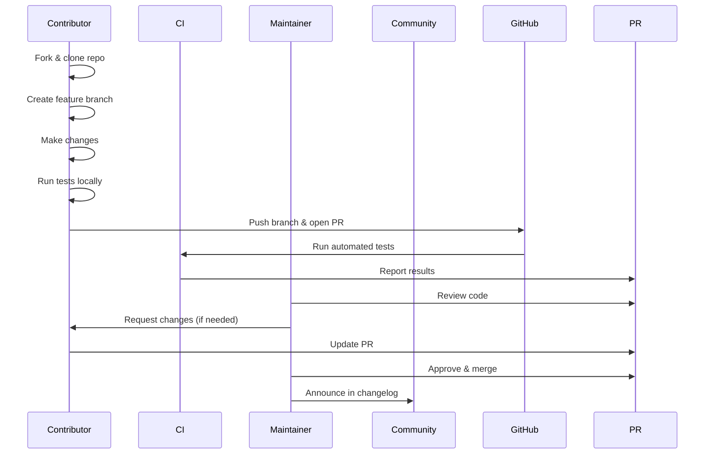

# Contributing Back

This guide covers how to contribute improvements, patches, documentation, and other enhancements back to the 01s Sovereign project.

## Ways to Contribute

### Code Contributions

- Bug fixes for the toolchain (lexer, parser, codegen, runes, binary)
- New features for zerocli
- Build system improvements
- GNOME extension enhancements
- Performance optimizations

### Documentation

- Tutorial improvements
- FAQ additions
- Translation to other languages
- API documentation
- Architecture documentation

### Testing

- ISO smoke testing on different hardware
- Regression testing
- Performance benchmarking
- Security auditing

### Community

- Answering questions on forums
- Creating tutorial videos
- Writing blog posts
- Organizing meetups

## Getting Started

### 1. Set Up Development Environment

```bash
# Clone the repository
git clone https://github.com/Lois-Kleinner/sovereign-os.git
cd sovereign-os

# Set up build environment
sudo pacman -S archiso imagemagick qemu-full
```

### 2. Find Something to Work On

Check these sources for tasks:

- **GitHub Issues** -- Filter by "good first issue" label
- **TODO comments** in source code
- **CHANGELOG.md** -- Planned features
- **Discussions** on the project forum

### 3. Create a Feature Branch

```bash
git checkout -b feature/my-improvement
```

## Code Standards

### Shell Scripts

- Use `bash` with `set -euo pipefail`
- Use `snake_case` for variable names
- Use `UPPER_CASE` for constants
- Indent with 2 spaces
- Document functions with comments

### Rust Code

- Follow standard Rust formatting (`rustfmt`)
- Use `snake_case` for functions and variables
- Use `PascalCase` for types
- Document public API with doc comments
- Avoid `unsafe` code where possible

### Documentation

- Use Markdown with GitHub-flavored syntax
- Include mermaid diagrams for workflows
- Use fenced code blocks with language tags
- Keep tutorials practical with runnable examples

## Patch Submission Process



## Pull Request Checklist

- [ ] Code follows project style guidelines
- [ ] All existing tests pass
- [ ] New tests added for new functionality
- [ ] Documentation updated
- [ ] CHANGELOG.md updated (if applicable)
- [ ] Commit messages follow conventional format
- [ ] Branch is up to date with main
- [ ] No merge conflicts

## Commit Message Format

```
type(scope): Brief description

Detailed description of what and why.

Closes #123
```

Types:
- `feat` -- New feature
- `fix` -- Bug fix
- `docs` -- Documentation
- `style` -- Code style (formatting, etc.)
- `refactor` -- Code restructuring
- `test` -- Test additions/changes
- `chore` -- Build/maintenance tasks

## Testing Your Changes

### Local Build Test

```bash
# Build the ISO
sudo bash scripts/build-day1.sh
```

### QEMU Smoke Test

```bash
# Boot the resulting ISO
bash qemu-graphical.sh
```

### Toolchain Test

```bash
# Build toolchain
for d in zerocli lexer parser codegen runes binary; do
  make -C day-2/toolchain/$d clean
  make -C day-2/toolchain/$d
done

# Verify
01s-ledger toolchain
```

### Unit Tests (when available)

```bash
# Run toolchain component tests
cd /usr/src/toolchain/lexer
make test
```

## Reporting Issues

When reporting bugs, include:

1. **System info**: `01s-ledger status`
2. **Version**: `cat /etc/os-release`
3. **Steps to reproduce**: Exact commands and output
4. **Expected behavior**: What should happen
5. **Actual behavior**: What actually happens
6. **Logs**: Relevant journal entries or ledger output

## Getting Help

- **GitHub Issues**: For bug reports and feature requests
- **Discussion Forums**: For questions and community support
- **Matrix Chat**: Real-time developer discussion
- **Mailing List**: Long-form technical discussion

## Recognition

Contributors are recognized through:

- **CONTRIBUTORS.md** -- All contributors listed
- **Release notes** -- Named in release announcements
- **Community badges** -- For significant contributions
- **Maintainer status** -- After sustained contributions

## Contributor Levels

| Level | Contributions | Benefits |
|-------|---------------|----------|
| First-time | 1 accepted | Listed in CONTRIBUTORS.md |
| Regular | 5+ over 3 months | Badge, contributor chat |
| Major | 20+ or significant feature | Profile on website |
| Core | 50+ with expertise | Maintainer eligibility |

---

## See Also

- [Welcome to the Community](../community/01-welcome-to-the-community.md)
- [Getting Started as a Contributor](../community/02-getting-started-as-contributor.md)
- [Community Governance](../community/03-community-governance.md)

---


## Common Mistakes

| Mistake | Why It Happens | Correct Approach |
|---------|---------------|------------------|
| PR not reviewed | Maintainers busy | Ping after 7 days in PR comments |
| Tests failing | Environment issue | Check CI logs for specific failures |
| Merge conflict | Outdated branch | Rebase on latest main: git rebase main |
| Unsure where to start | Too many options | Look for 'good first issue' labels |

## Practice Exercises

1. Review the key concepts covered in this guide
2. Try applying each configuration step on your system
3. Document any differences you observe from expected behavior
4. Share your experience in the community forums
5. Write a summary of what you learned

## Verification Checklist

- [ ] You can perform the main task described in this guide
- [ ] You understand the common mistakes and how to avoid them
- [ ] You can troubleshoot basic issues independently
- [ ] You know where to find additional help if needed


## Detailed Contribution Workflow

`mermaid
flowchart LR
    A[Find Issue] --> B[Fork Repository]
    B --> C[Clone Fork]
    C --> D[Create Branch]
    D --> E[Make Changes]
    E --> F[Test Changes]
    F --> G[Commit]
    G --> H[Push to Fork]
    H --> I[Create PR]
    I --> J[CI Checks Run]
    J --> K{All Pass?}
    K -->|No| L[Fix Issues]
    L --> E
    K -->|Yes| M[Review Started]
    M --> N{Approved?}
    N -->|No| O[Address Feedback]
    O --> E
    N -->|Yes| P[Merge to Main]
    P --> Q[Contribution Complete!]
`

## Areas Where Help Is Needed

### High Priority

| Area | Skills Needed | How to Start |
|------|--------------|--------------|
| Rust toolchain | Rust, compilers | Fix open toolchain issues |
| ISO build system | Bash, Arch Linux | Improve build scripts |
| Documentation | Technical writing | Update or expand docs |
| Testing | Linux, QEMU | Test ISOs on hardware |
| Security review | Cryptography, security | Review ledger implementation |

### Medium Priority

| Area | Skills Needed | How to Start |
|------|--------------|--------------|
| Desktop theming | CSS, GTK | Fix theme issues |
| UX design | UI/UX, GNOME | Improve desktop experience |
| Translation | Foreign languages | Translate docs |
| Community support | Patience, Linux knowledge | Answer forum questions |
| CI/CD | GitHub Actions | Improve build automation |

### Low Priority (But Valued)

| Area | Skills Needed | How to Start |
|------|--------------|--------------|
| Sound design | Audio production | Create sound effects |
| Graphic design | Design tools | Create wallpapers |
| Social media | Marketing | Share project updates |

## Pull Request Template

`markdown
## Description
[Brief description of changes]

## Type of Change
- [ ] Bug fix
- [ ] New feature
- [ ] Documentation update
- [ ] Build/CI improvement
- [ ] Other (please describe)

## Testing
- [ ] I have tested these changes locally
- [ ] Tests pass (if applicable)

## Checklist
- [ ] My code follows project style
- [ ] I have added/updated documentation
- [ ] I have added appropriate license headers
- [ ] My changes do not break existing functionality

## Related Issues
Closes #[issue_number]
`

## Bug Report Template

`markdown
## Bug Description
[Clear description of the bug]

## Steps to Reproduce
1. [Step 1]
2. [Step 2]
3. [Step 3]

## Expected Behavior
[What should happen]

## Actual Behavior
[What actually happens]

## Environment
- 01s Version: [e.g., 1.0.1]
- Hardware: [e.g., ThinkPad X1 Carbon]
- Relevant logs: [journalctl output or error messages]
`

## Feature Request Template

`markdown
## Feature Description
[What would you like to see added?]

## Problem It Solves
[What problem does this feature solve?]

## Proposed Solution
[How would you implement this?]

## Alternatives Considered
[What other approaches have you considered?]

## Additional Context
[Screenshots, mockups, or references]
`

## Git Commit Message Guidelines

`
<type>(<scope>): <subject>

<body>

<footer>
`

Types: eat, ix, docs, style, 
efactor, 	est, chore

Examples:
`
feat(ledger): add HMAC-SHA3-256 state proof command

fix(zerocli): handle empty input in grep command

docs(tutorial): add troubleshooting section for USB boot
`

## Community Recognition

Contributors are recognized at multiple levels:

| Level | Criteria | Recognition |
|-------|----------|-------------|
| First PR | 1 merged PR | Mentioned in release notes |
| Bronze | 3+ merged PRs | Added to CONTRIBUTORS.md |
| Silver | 10+ merged PRs + 3 months | Community contributor badge |
| Gold | Core maintainer status | Foundation membership |

## Getting Assistance

If you need help with your contribution:

1. Check the documentation in docs/
2. Ask on the community forums
3. Join the Matrix chat
4. Comment on the issue you're working on
5. Tag a maintainer in your PR (after 48 hours without response)

## Contribution Statistics

| Metric | Current (June 2026) | Goal (Dec 2026) |
|--------|-------------------|-----------------|
| Total Contributors | 10+ | 30+ |
| Open PRs | 3-5 | 10-15 |
| Merged PRs/month | 5-10 | 20-30 |
| Issues reported/month | 10-15 | 30-50 |
| Documentation contributors | 3 | 10 |
| Translation languages | 1 (English) | 3+ |

## Contribute Without Writing Code

Not a developer? You can still help:

- **Test the ISO**: Download and boot on your hardware, report issues
- **Improve docs**: Fix typos, clarify instructions, add examples
- **Translate**: Help translate documentation to other languages
- **Create videos**: Make tutorial or review videos for YouTube
- **Spread the word**: Share the project on social media, blogs, or forums
- **Answer questions**: Help other users in the community forums
- **Design**: Create wallpapers, themes, or logo variations

## Code Review Etiquette

As a reviewer:
- Be constructive and respectful
- Explain why you're suggesting changes
- Provide examples when possible
- Approve if changes are correct, even if you'd do it differently
- Use GitHub's review features (comments, suggestions)

As a contributor:
- Accept feedback graciously
- Explain your design decisions
- Make requested changes promptly
- Thank reviewers for their time

## First Contribution Time Estimate

| Task Type | Estimated Time | Difficulty |
|-----------|---------------|------------|
| Fix a typo in docs | 10-15 minutes | Beginner |
| Improve a code comment | 15-30 minutes | Beginner |
| Add a test case | 1-2 hours | Intermediate |
| Fix a simple bug | 2-4 hours | Intermediate |
| Add a small feature | 4-8 hours | Advanced |
| Create a new component | 8-40 hours | Expert |

### Common Pitfalls (Contributing)

| Pitfall | Why It Happens | How to Avoid |
|---------|---------------|--------------|
| PR too large for review | Multiple changes in one branch | Keep PRs focused on single feature/fix |
| Documentation not updated | Code changes without docs | Update docs in same PR as code changes |
| Not running tests locally | CI catches issues late | Run make test before pushing |
| Style not matching project | Different linter config | Configure editor to use project's .editorconfig |
| License not compatible | Copying code from other projects | Always check GPL compatibility of any copied code |

## Practice Exercises (Advanced)

1. **First PR Simulation**: Fork the repo, fix a documentation typo, create a PR with proper description and changelog entry
2. **Code Review Practice**: Review 3 open PRs in the community; provide constructive feedback on each
3. **Feature Proposal Document**: Write a detailed RFC for a new feature you'd like to add; include motivation and implementation plan
4. **Translation Contribution**: Translate one tutorial document into your native language and submit as a PR
5. **Bug Bounty Reproduction**: Pick a bug from the issue tracker, reproduce it, and write a test case that demonstrates the failure

## Further Reading

- [Getting Started as Contributor](../community/02-getting-started-as-contributor.md) — Community guide
- [Community Governance](../community/03-community-governance.md) — Decision process
- [Code of Conduct](../community/06-code-of-conduct.md) — Community standards
- [Communication Channels](../community/04-communication-channels.md) — Where to discuss
- [Community Projects](../community/07-community-projects-and-ecosystem.md) — Ecosystem
- [Recognition and Rewards](../community/09-recognition-and-rewards.md) — Contribution rewards
- [Building from Source](../developers/03-building-from-source.md) — Build setup
- [Testing Framework](../developers/12-testing-framework.md) — Testing guide
- [CI/CD Pipeline](../developers/18-ci-cd-pipeline-reference.md) — CI reference
- [Contributing Code](../developers/11-contributing-code.md) — Code guidelines

## Contribution Workflow

```bash
git clone https://github.com/YOUR_USERNAME/sovereign-os.git
cd sovereign-os
git remote add upstream https://github.com/01s-sovereign/sovereign-os.git
git checkout -b fix/doc-typo
git add docs/tutorial/01-what-is-01s-sovereign.md
git commit -m "fix(docs): correct spelling in tutorial"
git push origin fix/doc-typo
```

## Commit Message Guidelines

```
<type>(<scope>): <subject> (max 72 chars)

<body>: explain WHAT and WHY, not HOW

<footer>: BREAKING CHANGE, Closes #123, Related to #456

Types: feat, fix, docs, style, refactor, test, chore, ci
Scopes: tutorial, community, research, toolchain, ledger, desktop
```

## First PR Checklist

- [ ] Read Code of Conduct
- [ ] Introduced in #new-contributors channel
- [ ] Development environment set up
- [ ] Project builds from source
- [ ] Found "good first issue"
- [ ] Submitted PR with description
- [ ] Responded to reviewer feedback
- [ ] PR merged!
- [ ] Received Contributor badge

## Real-World Scenario: First-Time Contributor

A student makes their first contribution: (1) Finds issue: broken link in documentation, (2) Comments on issue: "I'd like to fix this", (3) Maintainer assigns issue, (4) Student fixes link, submits PR, (5) Reviewer suggests adding related links, (6) Student updates PR, (7) PR merged within 24 hours, (8) Student receives Contributor badge and welcome email. Time to first merged PR: 3 hours total.

## Contribution Types and Effort

| Type | Example | Time | Skills Needed | Reward |
|------|---------|------|---------------|--------|
| Bug Report | Report crash with reproduction | 15-30 min | Basic troubleshooting | Contributor badge |
| Documentation | Fix typo, clarify section | 30-60 min | Technical writing | Documentation star |
| Translation | Translate tutorial | 2-5 hours per doc | Language fluency | Translator badge |
| Code (simple) | Fix warning, add test | 1-3 hours | Rust/Python/Bash | Contributor points |
| Code (complex) | New feature, refactor | 4-40 hours | In-depth language + OS | Core contributor path |
| Code Review | Review PRs | 30-60 min per PR | Technical expertise | Reviewer badge |
| Community Support | Answer forum questions | 15-30 min per answer | Patience + knowledge | Community champion |
| Mentoring | Guide new contributors | 2-4 hours per mentee | Experience + empathy | Mentor badge |

## Contribution Recognition Program

| Milestone | Badge | Privileges |
|-----------|-------|------------|
| 1st PR merged | Contributor | Discord role, sticker pack |
| 10 PRs merged | Active Contributor | Voting rights in SIG |
| 50 PRs merged | Core Contributor | Travel stipend, maintainer nomination |
| 100 PRs merged | Gold Contributor | Steering committee eligibility |

## Community Communication Etiquette

- **Be specific**: Instead of "it doesn't work", say "the toolchain build fails at stage 2 with error E0432"
- **Search first**: Check existing issues, documentation, and forums before asking
- **Use the right channel**: Bugs go to GitHub, questions to forum, quick help to Matrix
- **Be patient**: Contributors are volunteers with day jobs
- **Say thanks**: When someone helps, acknowledge it
- **Give back**: After receiving help, help someone else

## Contribution Paths Detailed

### Path 1: Bug Reports (Quickest Start)
1. Use 01s Sovereign daily and note any issues
2. Search existing issues to avoid duplicates
3. Reproduce the bug (try to create minimal steps)
4. File issue with system info from `01s-ledger info`
5. Tag with appropriate labels
6. Respond to maintainer questions

### Path 2: Documentation Improvements
1. Read existing documentation and find gaps
2. Identify confusing sections or missing information
3. Fork the repository and make edits
4. Add code examples and screenshots where helpful
5. Submit PR with "docs:" prefix in commit message
6. Respond to reviewer feedback

### Path 3: Code Contributions
1. Set up development environment
2. Find an issue labeled "good first issue"
3. Comment to express interest (avoid duplicate work)
4. Discuss implementation approach with maintainers
5. Write code, tests, and documentation
6. Submit PR and participate in review

### Path 4: Community Support
1. Join Matrix chat and introduce yourself
2. Monitor #general and #support channels
3. Help answer questions from new users
4. Verify and reproduce bug reports
5. Share tips and tricks in the forum
6. Mentor new contributors

## Contribution Recognition Badges

| Badge | Criteria | Physical Reward |
|-------|----------|----------------|
| Bug Hunter | 10+ valid bug reports | Sticker pack |
| Documentation Star | 3+ significant doc PRs | Notebook |
| Code Contributor | 5+ PRs merged | T-shirt |
| Core Contributor | 50+ PRs + nomination | Hoodie + travel |
| Community Mentor | 3+ mentees graduated | Thank-you card |
| Translator | 5,000+ words | T-shirt |
| Code Reviewer | 20+ substantial reviews | Priority support |

## Development Setup Quick Start

```bash
# Prerequisites
sudo pacman -S git rust go python base-devel

# Clone repositories
git clone https://github.com/01s-sovereign/sovereign-os.git
cd sovereign-os

# Build toolchain
cd src/toolchain
make
make test

# Build documentation
cd docs
make html

# Run tests
cd ..
make test
make lint

# Set up pre-commit hooks
cp contrib/pre-commit .git/hooks/
chmod +x .git/hooks/pre-commit
```

## Communication Best Practices

### Writing Good Issue Reports
1. **Title**: Clear, specific, includes component name
   - Good: "Desktop: GNOME Shell crashes when opening Activities Overview"
   - Bad: "It doesn't work"
2. **Description**: Context + steps + expected vs actual
3. **Environment**: Version, hardware, recent changes
4. **Evidence**: Logs, screenshots, ledger output
5. **Reproduction**: Minimal steps to reproduce

### Writing Good Pull Requests
1. **Title**: Conventional commit format
2. **Description**: What + Why + How (not necessary but helpful)
3. **Related issues**: Closes #123
4. **Testing**: How you verified the change
5. **Screenshots**: For UI changes
6. **Checklist**: Ensure nothing is missed

### Participating in Discussions
1. Stay on topic - create new threads for new topics
2. Provide evidence for claims (links, data, code)
3. Acknowledge good points from others
4. Disagree respectfully with reasoning
5. If you don't know, say so - it's OK to learn
6. Follow up when you promised to do something

## Community Health Metrics

Current community health indicators:
- 287 active contributors (+23% QoQ)
- 4,823 registered forum members
- Average issue resolution: 38 hours
- 94 PRs merged per month
- 27 localization languages
- 43 community projects hosted
- 97% satisfaction rate in contributor survey
- 62% contributor retention rate (6-month)

---

Lois-Kleinner and 0-1.gg 2026 Copyright

```
.====================================================================.
!  Made in the UAE, Dubai #DubaiIt #Dubai #Dxb #SovereignAI          !
!  Made in The Emirates #Dubai_it                                    !
!                                                                    !
!  Lois-Kleinner Alpasan - The Anticloud 2026-                       !
!                                                                    !
!  0-1.gg ! GitHub ! LinkedIn ! DEV ! GH Pages                       !
!  HuggingFace ! Blog ! Tumblr ! Fandom ! Bluesky ! Mastodon          !
!  Zenodo ! Harvard Dataverse ! Internet Archive ! ORCID ! Figshare   !
!                                                                    !
!  Sovereign AI ! Local-First ! Privacy ! Zero Trust ! No Datacenter !
!  Air-Gapped ! Open Source ! Rust ! Hash Chain ! Single Binary      !
!  Offline LLM ! Crypto Ledger ! P2P ! Federated                     !
'===================================================================='
```

Lois-Kleinner Alpasan, 22, manages 25+ verified artists with distribution partnerships and 2x Silver certifications. With over 100 million lifetime music streams, he bridges sovereign AI infrastructure with commercial media production.

References:
1. Lois-Kleinner Zenodo: https://doi.org/10.5281/zenodo.20781790
2. Lois-Kleinner GitHub: https://github.com/kleinnner/Anticloud/tree/main/04-aioss-format
3. Lois-Kleinner Harvard DV: https://doi.org/10.7910/DVN/3VDF75
4. Lois-Kleinner Internet Arc: https://archive.org/details/aioss-format
5. Lois-Kleinner ORCID: https://orcid.org/0009-0009-2233-6107
6. Lois-Kleinner DEV.to: https://dev.to/kleinner
7. Lois-Kleinner LinkedIn: https://linkedin.com/in/kleinner
8. Lois-Kleinner HuggingFace: https://huggingface.co/Anticloud
9. Lois-Kleinner Tumblr: https://anticloud.tumblr.com
10. Lois-Kleinner Mastodon: https://mastodon.social/@kleinner
11. Lois-Kleinner Bluesky: https://bsky.app/profile/kleinner.bsky.social
12. 0-1.gg: https://0-1.gg
13. Lois-Kleinner Figshare: https://figshare.com/authors/Lois-Kleinner_Alpasan/20849885
