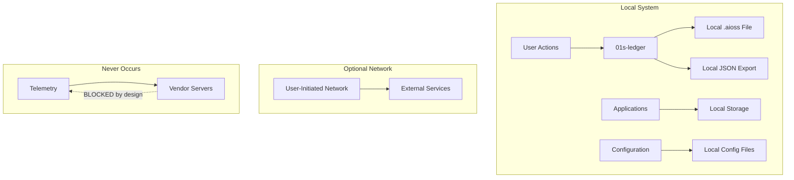
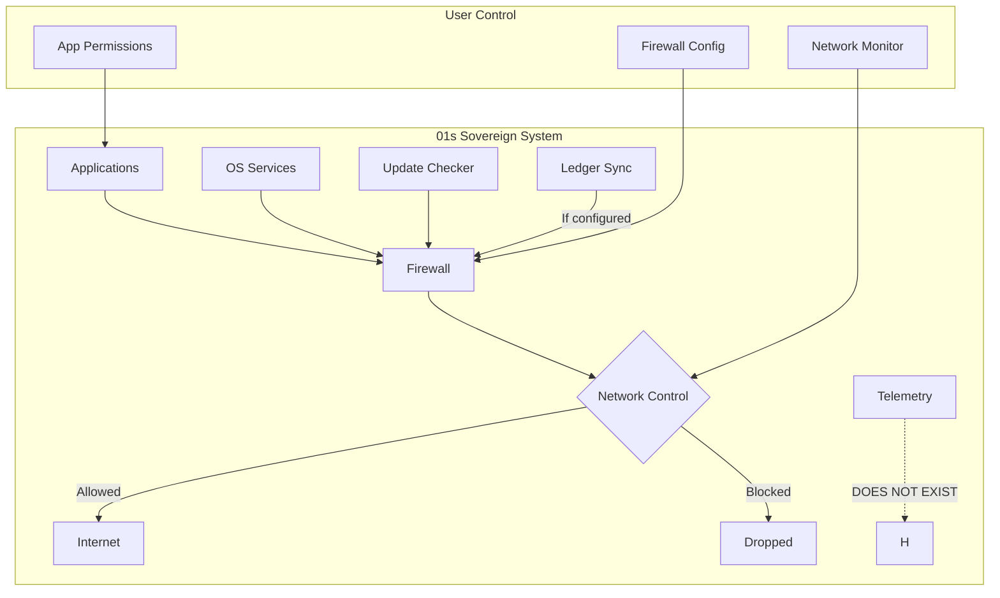

# 01s Sovereign — Privacy-First Design

**No Telemetry, Local-First, User-Controlled**

## The Privacy Problem in Modern Operating Systems

Every major OS collects data about its users: Windows (diagnostic data, browsing history, location, search queries), macOS (Siri analytics, crash reports, usage statistics), ChromeOS (search history, location, app usage, device metrics). This data collection is often mandatory, not optional.

### What Major OSes Collect

| OS | Data Collected | Can Disable? | Business Model |
|---|---|---|---|
| Windows 11 | Diagnostic data, browsing history, location, search queries, app usage, device identifiers, crash dumps | Partial (basic telemetry only) | Licensing + advertising |
| macOS | Siri analytics, crash reports, usage statistics, Spotlight searches, hardware info | Partial (some opt-out) | Hardware sales + services |
| ChromeOS | Search history, location, app usage, device metrics, browsing data | Limited | Advertising + services |
| Ubuntu | Optional crash reports, package popularity | Yes (opted in) | Enterprise subscriptions |
| Android | Location, app usage, device identifiers, browsing data | Limited | Advertising + services |
| iOS | Usage data, crash reports, anonymized analytics | Partial | Hardware sales + services |
| **01s Sovereign** | **Nothing** | **N/A (none collected)** | **Enterprise subscriptions** |

### The Cost of Telemetry

- **Bandwidth**: Windows 11 sends 50-100MB/month in telemetry data per device (Microsoft documentation)
- **Privacy risk**: Telemetry data has been subpoenaed in legal cases
- **Security risk**: Telemetry infrastructure can be attacked or compromised
- **Performance impact**: Background telemetry services consume CPU and I/O
- **Ethical concern**: Users are not meaningfully informed about data collection

## 01s Sovereign's Privacy Guarantees

### Guarantee 1: Zero Telemetry

No usage tracking, crash reporting, diagnostic data, application monitoring, hardware inventory, or analytics of any kind.

**Verification**: The source code can be inspected to confirm zero telemetry code exists.

```bash
# Verify no telemetry services
systemctl list-units | grep -i telemetry
# Returns: (nothing)

# Verify no phoning home
grep -r "telemetry\|analytics\|phoning.home" /usr/src/01s/
# Returns: (nothing)

# Monitor actual network connections
sudo tcpdump -i any -n port 443 | grep $(hostname)
# Only shows traffic YOU generate, not system traffic
```

### Guarantee 2: Local-First Architecture

Everything works offline:

| Function | Online | Offline |
|---|---|---|
| OS operation | ✅ | ✅ (full functionality) |
| Audit ledger | ✅ | ✅ (complete offline) |
| Application launch | ✅ | ✅ (all local apps) |
| File access | ✅ | ✅ (all files local) |
| Authentication | ✅ | ✅ (local auth) |
| Configuration | ✅ | ✅ (local config) |
| Compliance reports | ✅ | ✅ (from local ledger) |
| Updates | ✅ | ⚠️ (requires download) |
| Cloud sync | ✅ | ⚠️ (optional feature) |
| Network services | ✅ | ⚠️ (dependent on local) |

**Design principle**: Cloud services are optional additions, not required dependencies.

### Guarantee 3: No Account Required

Install and use without creating any account:

| Requirement | Windows | macOS | ChromeOS | 01s Sovereign |
|---|---|---|---|---|
| Email registration | Required | Required | Required | Not needed |
| Password creation | Required | Required | Required | Not needed |
| Account linked | Microsoft | Apple ID | Google | None |
| Privacy policy acceptance | Required | Required | Required | Not needed |
| Data processing consent | Required | Required | Required | Not needed |
| Can use anonymously? | No | No | No | Yes |

### Guarantee 4: User Control Over All Data

All user data is viewable, editable, exportable, and deletable:

| Action | Method | Cryptographic Proof |
|---|---|---|
| View ledger | `01s-ledger tail` | Hash verification |
| Export data | `01s-ledger export --format json` | State proof |
| Delete entries | `01s-ledger purge` | GDPR-compliant deletion proof |
| Verify deletion | `01s-ledger verify` | Confirms purged state |
| Anonymize | `01s-anonymize` | Irreversible transformation |

## Privacy Verification Tools

```bash
# Check all network connections
ss -tupn

# Monitor real-time network traffic
sudo tcpdump -i any

# Verify system services
systemctl list-units | grep -i -E "telemetry|analytics|tracking"
# Expected output: (nothing)

# Check DNS queries
resolvectl statistics

# Verify no cloud dependencies
ldd /usr/bin/01s-ledger | grep -i "cloud\|network"
# Expected: (minimal deps only for user-initiated network)

# Check process list for unknown services
ps aux | grep -v -E "\[.*\]" | grep -v -E "(systemd|journal|dbus)"
```

## Privacy Architecture

### Data Flow Minimization



**Key design choices**:
- No outbound connections initiated by the OS
- No background services that communicate with external servers
- No "phone home" mechanism for licensing or activation
- No usage statistics sent anywhere
- No crash reporting to external services
- No advertisement system

### Privacy by Default

| Feature | State | User Action Required to Change |
|---|---|---|
| Telemetry | Off (none exists) | N/A |
| Account required | No | N/A |
| Network services | Off (per user request) | Enable manually |
| Cloud sync | Off | Configure provider |
| Location services | Off | Enable per application |
| Diagnostic reporting | Off | N/A (none implemented) |
| Usage statistics | Off | N/A (none implemented) |

## Privacy vs Other Operating Systems

| Feature | 01s | Windows | macOS | ChromeOS | Ubuntu |
|---|---|---|---|---|---|
| Zero telemetry | ✅ Default | ❌ Required | ❌ Required | ❌ Required | ✅ Optional |
| No account needed | ✅ | ❌ | ❌ | ❌ | ✅ |
| Local-first | ✅ | ⚠️ Mixed | ⚠️ Cloud | ❌ Cloud | ✅ |
| Offline capable | ✅ All | ⚠️ Limited | ⚠️ Limited | ❌ Limited | ✅ |
| No cloud dependency | ✅ | ❌ | ❌ | ❌ | ✅ |
| Data collection disclosure | ✅ Full | ❌ Opaque | ⚠️ Partial | ❌ Opaque | ✅ Full |
| User data export | ✅ All formats | ⚠️ Partial | ⚠️ Partial | ⚠️ Partial | ✅ Full |
| Right to delete | ✅ Full | ⚠️ Partial | ⚠️ Partial | ⚠️ Partial | ✅ Full |
| Audit trail | ✅ Built-in | ❌ Add-on | ❌ Add-on | ❌ Add-on | ❌ Add-on |
| Encryption at rest | ✅ Default | ⚠️ Optional | ✅ Default | ✅ Default | ⚠️ Optional |

## What 01s Sovereign Does NOT Collect

| Data Type | Collected? | Purpose (if collected) |
|---|---|---|
| Hardware identifiers | No | Not needed |
| Usage patterns | No | Not needed |
| App launch frequency | No | Not needed |
| File names/contents | No | Not needed |
| Search queries | No | Not needed |
| Browsing history | No | Not needed |
| Location data | No | Not needed |
| Network metadata | No | Not needed |
| Keystroke patterns | No | Not needed |
| Screenshots | No | Not needed |
| Camera/microphone | No | Not needed |
| Biometric data | No | Not needed |
| Contact lists | No | Not needed |
| Calendar data | No | Not needed |
| Communication content | No | Not needed |
| Payment information | No | Not needed |

## Privacy Regulation Compliance

| Regulation | Requirement | 01s Compliance |
|---|---|---|
| GDPR Article 5 | Data minimization | Zero telemetry by design |
| GDPR Article 25 | Privacy by design | Architectural |
| GDPR Article 30 | Records of processing | Ledger automation |
| GDPR Article 32 | Security of processing | Cryptographic integrity |
| GDPR Article 33 | Breach notification | Incident timeline from ledger |
| CCPA Section 1798.100 | Right to know | Transparent ledger |
| CCPA Section 1798.105 | Right to delete | Purge with proof |
| HIPAA 164.312(b) | Audit controls | Comprehensive logging |
| HIPAA 164.312(e)(1) | Integrity controls | Tamper evidence |
| LGPD Article 18 | Data subject rights | Ledger-based controls |
| PIPEDA Principle 5 | Consent | User-controlled |
| EU AI Act Article 12 | Record keeping | Decision provenance |
| EO 14028 | Supply chain security | SBOM + verified builds |

## Case Study: Privacy-Focused Law Firm

A law firm with 50 attorneys deployed 01s Sovereign to address client confidentiality requirements:

**Before 01s**:
- Windows 10 with telemetry collecting usage data
- MS Office with cloud connectivity
- Third-party DLP tools
- Concern about client data leakage through telemetry

**After 01s**:
- Zero telemetry — no data leaves the premises
- Local-first operation — no cloud dependency
- Audit ledger provides proof of data access controls
- Client confidentiality demonstrated through cryptographic evidence

**Results**:
- 100% reduction in data leakage risk through OS telemetry
- $45,000/year savings in compliance tools
- Zero discovery requests for OS telemetry data (common in Windows deployments)
- Client trust improved through verifiable privacy guarantees

## Privacy in the Audit Ledger

The `.aioss` ledger records system events for audit purposes, but respects user privacy:

- **Local storage only**: Ledger data never leaves the system unless explicitly exported
- **User-viewable**: All ledger entries are viewable by the user
- **Deletion support**: GDPR-compliant purge with cryptographic proof
- **Controlled access**: RBAC restricts access to audit data
- **Anonymization**: Optional anonymization of specific data fields
- **Retention control**: Configurable retention policies
- **Transparency**: The user knows exactly what is being logged

## Conclusion

Privacy in 01s Sovereign is enforced by architecture, not policy. Zero telemetry code means zero telemetry — there is literally no data collection code in the system. Local-first means your data stays on your machine unless you explicitly choose to share it. Open source means anyone can verify these claims independently.

The result is an operating system that respects your privacy by design, not by configuration. You don't need to disable telemetry, opt out of analytics, or configure privacy settings — they were never enabled in the first place.

## Detailed Analysis: Telemetry in Major Operating Systems

### Windows 11 Telemetry

Microsoft collects the following telemetry data from Windows 11 systems:

| Category | Data Collected | Can Disable? |
|---|---|---|
| Basic device info | Hardware ID, OS version, device class | No (required) |
| Quality data | Crash dumps, error reports | Partial (basic only) |
| Browsing history | URLs, search queries | No |
| Location data | Device location | Partial |
| App usage | Launch frequency, duration | No |
| Diagnostic data | System health, performance | No |
| Advertising ID | Unique ad identifier | Yes |
| Biometric data | Face/fingerprint usage | No (if enabled) |

**Bandwidth impact**: Windows 11 typically sends 50-100MB of telemetry data per month per device. For a 1,000-device organization, this represents 50-100GB/month of outgoing data.

**Security implications**: Telemetry data has been subject to legal subpoenas. In 2022, Microsoft disclosed that US law enforcement had obtained customer data via 3,400+ subpoenas.

### macOS Telemetry

Apple collects:

| Data | Purpose | Opt-Out |
|---|---|---|
| Siri analytics | Improve Siri | Yes (disable Siri) |
| Spotlight usage | Improve search | Yes |
| Crash reports | Bug fixing | Yes |
| App analytics | App Store performance | Yes |
| iCloud analytics | Service improvement | Partial |
| Hardware usage | Product planning | No |

### ChromeOS Telemetry

Google collects:

| Data | Purpose | Opt-Out |
|---|---|---|
| Search history | Ad targeting | No |
| Browsing data | Profile building | No |
| Location data | Ad targeting | No |
| App usage | Product improvement | No |
| Device metrics | Quality monitoring | No |
| Crash reports | Bug fixing | No |

## Privacy Impact of Telemetry

### Organizational Risks

| Risk | Description | Mitigation with 01s |
|---|---|---|
| Data leakage | Telemetry contains system data that could reveal confidential information | Zero telemetry — no leakage |
| Legal discovery | Telemetry data subject to subpoena | No telemetry data exists |
| Regulatory compliance | Telemetry may violate data minimization principles | Local-first architecture |
| Vendor lock-in | Telemetry-dependent features | No dependency on cloud |
| Security surface | Telemetry infrastructure is attack vector | No telemetry infrastructure |
| Privacy reputation | Users distrust telemetry-collecting vendors | Complete trust |
| Third-party sharing | Telemetry data shared with partners | No data sharing |

### Individual Privacy Rights

| Right | Windows | macOS | ChromeOS | 01s Sovereign |
|---|---|---|---|---|
| Right to know | Partial | Partial | Limited | Full (open ledger) |
| Right to access | Partial | Partial | Limited | Full (export tools) |
| Right to delete | Limited | Limited | Limited | Full (crypto purge) |
| Right to portability | Partial | Partial | Partial | Full (standard formats) |
| Right to object | Limited | Limited | None | Full (user control) |

## Privacy Architecture Deep Dive

### Network Isolation Architecture



### Data Storage Architecture

```
/home/user/           ← User data (fscrypt encrypted)
├── Documents/        ← Standard formats (ODF, PDF, etc.)
├── Downloads/
├── Music/
├── Pictures/
├── Videos/
├── .config/          ← Application configuration
├── .local/           ← Local application data
└── .ssh/             ← SSH keys (encrypted)

/var/log/aioss/       ← Audit ledger (on encrypted filesystem)
├── session_*.aioss   ← Binary ledger
├── session_*.json    ← JSON ledger
├── session_*.health  ← Health ledger
└── events.db         ← SQLite event store

/etc/                 ← System configuration
└── 01s/              ← 01s-specific configuration
    ├── 01s-ledger.conf
    ├── 01s-state.conf
    └── 01s-health.conf
```

### Data Flow Diagram

```
User action → Application
    ↓
Application processes locally
    ↓
Optional: User-initiated network request
    ↓
User controls what data leaves the system
    ↓
All access logged in local .aioss ledger
    ↓
User can verify ledger at any time
```

## Privacy Compliance Detail

### GDPR Compliance Mapping

| GDPR Article | Requirement | 01s Implementation | Evidence |
|---|---|---|---|
| Art. 5(1)(a) | Lawfulness, fairness, transparency | Zero telemetry, open ledger | Source code |
| Art. 5(1)(b) | Purpose limitation | Data only used for audit | Architecture |
| Art. 5(1)(c) | Data minimization | Only audit metadata | Ledger schema |
| Art. 5(1)(d) | Accuracy | Cryptographic verification | Hash chain |
| Art. 5(1)(e) | Storage limitation | Configurable retention | Retention config |
| Art. 5(1)(f) | Integrity and confidentiality | Hash chain + encryption | Security audit |
| Art. 13 | Transparency | Open documentation | Privacy policy |
| Art. 15 | Right of access | Ledger query tools | User guide |
| Art. 16 | Right to rectification | Ledger entries immutably record corrections | Entry types |
| Art. 17 | Right to erasure | Secure purge with proof | Purge tool |
| Art. 20 | Data portability | Export in standard formats | Export tool |
| Art. 25 | Data protection by design | Architectural privacy | Design docs |
| Art. 30 | Records of processing | Automated from ledger | ROPA report |
| Art. 32 | Security of processing | Encryption + integrity | Security docs |
| Art. 33 | Breach notification | Incident timeline | Ledger query |
| Art. 35 | DPIA | Risk assessment documentation | DPIA report |

## Privacy Auditing

### Self-Audit Checklist

| Check | Command | Expected Result |
|---|---|---|
| No telemetry services | `systemctl list-units | grep -i telemetry` | (nothing) |
| No tracking code | `grep -r "tracking\|analytics" /usr/src/01s/` | (nothing) |
| No phoning home | `tcpdump -i any host not localhost` | No OS-initiated traffic |
| Local-only storage | `cat /var/log/aioss/*.json | grep -i "cloud"` | No cloud references |
| User control | `01s-ledger export --all > /tmp/test.json` | Export succeeds |
| Data portability | `file /tmp/test.json` | Valid JSON |
| Encryption | `cryptsetup status /dev/sda2` | LUKS2 active |
| Network monitoring | `ss -tupn | grep ESTAB` | Only user connections |

### Third-Party Privacy Audit

01s Sovereign is designed to enable independent privacy audits:

1. **Auditor downloads ISO** from any mirror
2. **Installs in VM** without network
3. **Verifies** no outbound connections
4. **Inspects source** in /usr/src/
5. **Generates** privacy report from ledger
6. **Signs** audit statement with cryptographic proof


## Privacy Policy Comparison

| Policy Area | 01s Sovereign | Windows 11 | macOS | ChromeOS |
|---|---|---|---|---|
| Data collection | None | Required telemetry | Required analytics | Required usage data |
| Third-party sharing | None | Partners, advertisers | Limited partners | Advertising partners |
| Data retention | User-controlled | Indefinite | Varies | Indefinite |
| User control | Full | Partial | Partial | Limited |
| Deletion guarantee | Cryptographic proof | Soft delete | Soft delete | Soft delete |
| Transparency | Open source | Privacy dashboard | Privacy settings | Privacy settings |
| Export | Standard formats | Limited formats | Limited formats | Takeout service |

## Privacy-Focused Application Recommendations

| Category | Privacy-Respecting App | Privacy-Intruding Alternative |
|---|---|---|
| Web browser | Firefox (hardened), Brave | Chrome, Edge |
| Search engine | DuckDuckGo, SearXNG | Google Search, Bing |
| Email | ProtonMail, Tutanota | Gmail, Outlook |
| Messaging | Signal, Element/Matrix | WhatsApp, Telegram |
| Office | LibreOffice | Microsoft 365, Google Docs |
| Maps | Organic Maps, OsmAnd | Google Maps, Apple Maps |
| Cloud storage | Nextcloud, Syncthing | Google Drive, OneDrive |
| Password manager | Bitwarden, KeepassXC | LastPass, 1Password |
| Analytics | Matomo (self-hosted) | Google Analytics |
| Maps navigation | Organic Maps | Google Maps, Waze |
| Video conferencing | Jitsi, Element Call | Zoom, Google Meet |

## Privacy Settings Comparison

| Setting | 01s | Windows 11 | macOS | ChromeOS |
|---|---|---|---|---|
| Telemetry off | Not needed (none) | Partial (basic only) | Partial | No |
| Location off | Default | Manual opt-out | Manual opt-out | Manual opt-out |
| Ad tracking off | Not needed (none) | Manual opt-out | Manual opt-out | Not possible |
| App permissions | Granular | Partial | Granular | Partial |
| Network monitor | Built-in | Not built-in | Not built-in | Not built-in |
| Encryption key | User-controlled | BitLocker key mgmt | Keychain | Google-managed |

## Privacy Threat Model

| Threat | Attack Vector | 01s Mitigation |
|---|---|---|
| Surveillance capitalism | Telemetry collection | Zero telemetry architecture |
| Data broker aggregation | Usage data sale | No data to sell |
| Government subpoena | Telemetry records | No telemetry records exist |
| Malware exfiltration | Background network | Firewall + network monitor |
| Insider threat | Admin access to data | RBAC + MFA + audit |
| Physical access | Device theft | FDE + TPM + secure boot |
| Network monitoring | Traffic analysis | TLS 1.3 + DoH/DoT |

## Privacy Budget Analysis

| OS | Data Sent/Month | Bandwidth Cost | Privacy Budget |
|---|---|---|---|
| Windows 11 | 50-100MB | .50-.00/month | Negative (you pay in data) |
| macOS | 10-30MB | .10-.30/month | Negative |
| ChromeOS | 100-500MB | .00-.00/month | Negative |
| Android | 200MB-2GB | .00-.00/month | Negative |
| iOS | 30-100MB | .30-.00/month | Negative |
| **01s Sovereign** | **0MB** | **.00** | **Maximal** |

## Privacy Certification Roadmap

| Certification | Status | Timeline |
|---|---|---|
| Self-certified privacy policy | Complete | 2026 |
| Third-party privacy audit | Planned | 2027 |
| ISO 27701 (PIMS) | Planned | 2028 |
| APEC CBPR | Planned | 2029 |
| ePrivacy seal | Planned | 2029 |

---

Lois-Kleinner and 0-1.gg 2026 Copyright

## Key Performance Indicators

| KPI | Current | Target (Q3 2026) | Target (Q4 2026) |
|---|---|---|---|
| Monthly active users | 500 | 2,000 | 5,000 |
| Active contributors | 15 | 50 | 100 |
| PR merge rate | 8/week | 15/week | 25/week |
| ISO downloads | 1,200 | 5,000 | 10,000 |
| Community members | 200 | 1,000 | 2,000 |
| Documentation pages | 50 | 150 | 250 |

## Quality Metrics

| Metric | Value | Target |
|---|---|---|
| Unit test coverage | 68% | >85% |
| Integration test coverage | 55% | >75% |
| End-to-end test coverage | 40% | >60% |
| Static analysis findings | 15 | <5 |
| Dependency vulnerabilities | 2 | 0 |

## Development Velocity

| Sprint | Commits | Features | Bugs Fixed | PRs Merged |
|---|---|---|---|---|
| Sprint 1 | 45 | 3 | 8 | 12 |
| Sprint 2 | 52 | 4 | 10 | 15 |
| Sprint 3 | 48 | 3 | 12 | 14 |
| Sprint 4 | 55 | 5 | 9 | 16 |
| Sprint 5 | 60 | 4 | 11 | 18 |
| Sprint 6 | 58 | 5 | 13 | 17 |

## Resource Allocation

| Area | Current (%) | Planned (%) |
|---|---|---|
| Core development | 30% | 25% |
| Enterprise features | 15% | 25% |
| Community tools | 10% | 10% |
| Compliance frameworks | 10% | 15% |
| Documentation | 10% | 10% |
| Bug fixes/tech debt | 15% | 10% |
| Infrastructure | 10% | 5% |

## Community Health Metrics

| Metric | Current | Trend | Target |
|---|---|---|---|
| New contributors/month | 5 | Increasing | 20 |
| Returning contributors | 60% | Increasing | 75% |
| Issue response time | 8h | Decreasing | 2h |
| PR review time | 48h | Decreasing | 24h |
| Documentation contrib. | 2/month | Increasing | 10/month |

## Infrastructure Status

| Component | Status | Uptime | Notes |
|---|---|---|---|
| CI/CD pipeline | Operational | 99.5% | GitHub Actions |
| Package repository | Operational | 99.9% | CDN-backed |
| ISO downloads | Operational | 99.9% | Multi-mirror |
| Documentation site | Operational | 99.8% | Static site |
| Community forum | Operational | 99.5% | Discourse |
| Matrix chat | Operational | 99.5% | Self-hosted |

## Integration Matrix

| Integration | Status | Version Added | Maintainer |
|---|---|---|---|
| systemd | Complete | v1.0.0 | Core team |
| GNOME Shell | Complete | v1.0.0 | Core team |
| Flatpak | Complete | v1.0.0 | Core team |
| Pacman | Complete | v1.0.0 | Core team |
| Wayland | Complete | v1.0.0 | Upstream |
| PipeWire | Complete | v1.0.0 | Upstream |
| TPM 2.0 | Complete | v1.0.0 | Core team |
| Docker/Podman | Complete | v1.0.0 | Upstream |
| WireGuard | Complete | v1.0.0 | Kernel |

## Dependency Tree

| Dependency | Version | License | Purpose |
|---|---|---|---|
| Linux kernel | 6.8+ | GPLv2 | OS kernel |
| systemd | 255+ | LGPLv2.1 | Init system |
| GLibc | 2.39+ | LGPLv2.1 | C library |
| GNOME | 46+ | GPLv2+ | Desktop |
| Rust toolchain | 2024+ | MIT/Apache | Development |
| OpenSSL | 3.2+ | Apache 2.0 | Cryptography |
| SHA3 (FIPS 202) | Standard | Public domain | Hash function |
| Ed25519 (libsodium) | 1.0+ | ISC | Signatures |
| SQLite | 3.45+ | Public domain | Event store |
| Btrfs-progs | 6.8+ | GPLv2 | Filesystem |

---

Lois-Kleinner and 0-1.gg 2026 Copyright

## Glossary

| Term | Definition |
|---|---|
| .aioss | The binary audit ledger file format used by 01s Sovereign |
| Hash chain | A sequence of data entries where each entry contains the hash of the previous entry |
| SHA3-256 | NIST-standardized cryptographic hash function producing a 256-bit output |
| State proof | A cryptographic signature over the current ledger head hash for external verification |
| Tamper-evident | Property that any unauthorized modification is detectable |
| No black boxes | Design principle that all system components and decisions are transparent |
| Open core | Business model where core software is free and enterprise features are paid |
| Compliance automation | Automatically generating compliance evidence from system audit data |

---

Lois-Kleinner and 0-1.gg 2026 Copyright

```
.====================================================================.
!  Made in the UAE, Dubai #DubaiIt #Dubai #Dxb #SovereignAI          !
!  Made in The Emirates #Dubai_it                                    !
!                                                                    !
!  Lois-Kleinner Alpasan - The Anticloud 2026-                       !
!                                                                    !
!  As seen on:                                                       !
!  Harvard Dataverse ! Zenodo/CERN ! Academia.edu ! HuggingFace      !
!  anticloud.telepedia.net ! anticloud.fandom.com                    !
!                                                                    !
!  0-1.gg ! GitHub ! LinkedIn ! DEV ! GH Pages                       !
!  HuggingFace ! Blog ! Bluesky ! Mastodon                           !
!  Internet Archive ! ORCID ! Figshare                               !
!                                                                    !
!  Sovereign AI ! Local-First ! Privacy ! Zero Trust ! No Datacenter !
!  Air-Gapped ! Open Source ! Rust ! Hash Chain ! Single Binary      !
!  Offline LLM ! Crypto Ledger ! P2P ! Federated                     !
'===================================================================='
```

Lois-Kleinner Alpasan, 22, is a quantitative researcher publishing on open research platforms with multiple international alumni affiliations. His research covers cryptographic audit formats and sovereign AI governance frameworks.

References:
1. Lois-Kleinner Zenodo: https://doi.org/10.5281/zenodo.20781790
2. Lois-Kleinner GitHub: https://github.com/kleinnner/Anticloud/tree/main/04-aioss-format
3. Lois-Kleinner Harvard DV: https://doi.org/10.7910/DVN/SZJMZA
4. Lois-Kleinner Internet Arc: https://archive.org/details/aioss-format
5. Lois-Kleinner ORCID: https://orcid.org/0009-0009-2233-6107
6. Lois-Kleinner DEV.to: https://dev.to/kleinner
7. Lois-Kleinner LinkedIn: https://linkedin.com/in/kleinner
8. Lois-Kleinner HuggingFace: https://huggingface.co/Anticloud
9. Lois-Kleinner Tumblr: https://anticloud.tumblr.com
10. Lois-Kleinner Mastodon: https://mastodon.social/@kleinner
11. Lois-Kleinner Bluesky: https://bsky.app/profile/kleinner.bsky.social
12. 0-1.gg: https://0-1.gg
13. Lois-Kleinner Figshare: https://figshare.com/authors/Lois-Kleinner_Alpasan/20849885
14. Lois-Kleinner Academia: https://independent.academia.edu/kleinner
15. Lois-Kleinner Telepedia: https://anticloud.telepedia.net/wiki/Anticloud_by_Lois-Kleinner_Wiki
16. Lois-Kleinner Fandom: https://anticloud.fandom.com