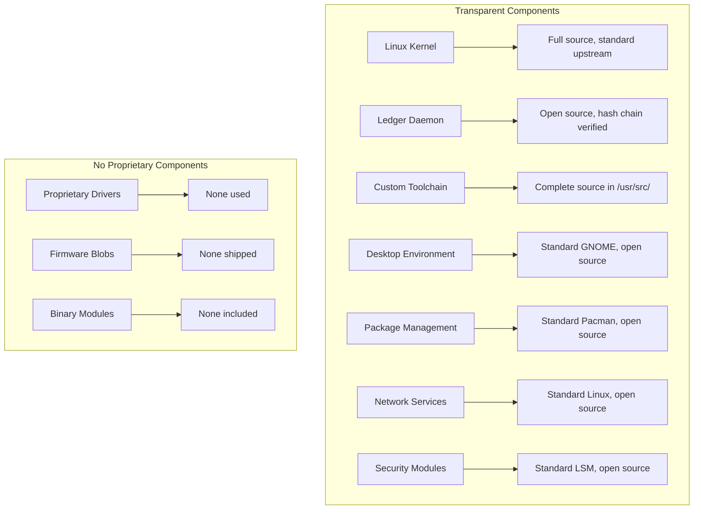

# 01s Sovereign — No Black Boxes

**Every Decision Is Logged, Auditable, and Explainable**

## The Black Box Problem

Modern operating systems are full of black boxes — opaque components whose internal behavior is hidden from users:

| OS Component | Black Box Behavior | User Visibility |
|---|---|---|
| Windows Update | Decides when to reboot, what to install | Limited override |
| Windows Defender | Security decisions, threat classification | Limited |
| Apple SIP | Blocks system operations | Notification only |
| Google Play Services | Permissions, background activity | Limited |
| macOS Spotlight | Indexing, search behavior | No visibility |
| Windows Search | Indexing, data collection | Limited |
| Cloud sync services | File synchronization logic | Opaque conflict resolution |
| AI assistants | Decision making, data processing | No insight |
| Crash reporting | Data collected, storage, sharing | Limited |
| Update mechanisms | Patch content, dependencies | Binary trust |

### Why Black Boxes Are Dangerous

1. **Security**: Hidden vulnerabilities in opaque components cannot be audited
2. **Privacy**: You don't know what data is being collected or sent
3. **Compliance**: Cannot prove system behavior to auditors
4. **Debugging**: Impossible to understand why something happened
5. **Trust**: Forced to trust vendors you may not have reason to trust
6. **Autonomy**: System makes decisions without user understanding or consent
7. **Verifiability**: No way to confirm the system is operating correctly

## The "No Black Boxes" Principle

Every system decision must be transparent, explained, and auditable. No hidden components, no secret algorithms, no opaque processes.

### Application in All System Components



## Decision Provenance Tracking

Every system decision is recorded with complete context:

### Decision Entry Structure

```json
{
  "type": "decision",
  "timestamp": "2026-06-19T10:30:00.000Z",
  "actor": "systemd",
  "decision": {
    "proposal": "Apply system update packages: linux-6.8.1, glibc-2.38",
    "options": [
      {"id": "apply", "description": "Apply all available updates"},
      {"id": "defer", "description": "Defer updates to maintenance window"},
      {"id": "skip", "description": "Skip these updates"}
    ],
    "voting": [
      {"agent": "policy_engine", "vote": "apply", "confidence": 0.95},
      {"agent": "maintenance_scheduler", "vote": "apply", "confidence": 0.80},
      {"agent": "compliance_checker", "vote": "apply", "confidence": 0.99}
    ],
    "outcome": "apply",
    "rationale": "Security updates with CVSS > 7, approved maintenance window available",
    "evidence_refs": ["CVE-2026-1234", "CVE-2026-5678"]
  }
}
```

### Decision Types

| Decision Type | Examples | Logged Details |
|---|---|---|
| Update decisions | When to update, what to include | Alternatives, rationale, timing |
| Security decisions | Block/allow actions, threat classification | Threat analysis, confidence |
| Resource allocation | CPU/memory priority, scheduling | Policy basis, alternatives |
| Network decisions | Connection allow/block, routing | Security zone, policy rule |
| Permission decisions | Grant/deny access, privilege elevation | Request context, policy match |
| Configuration changes | Setting modifications | Old value, new value, initiator |
| AI decisions | Recommendations, classifications | Model, confidence, evidence |

## Contradiction Detection

When system components disagree, contradictions are recorded with context:

### Contradiction Entry Structure

```json
{
  "type": "contradiction",
  "severity": "warning",
  "nodes": ["intrusion_detection", "access_manager"],
  "summary": "IDS flagged process access as suspicious, access manager confirms authorized activity",
  "resolution": "escalated_for_review",
  "timestamp": "2026-06-19T10:30:00.000Z"
}
```

### Contradiction Resolution

| Resolution Type | Description | Example |
|---|---|---|
| Automated override | One system has higher authority | Compliance check overrides performance |
| Escalated for review | Human intervention required | Security alert vs authorized access |
| Reconciliation | Systems reach consensus | Policy engine reconciles conflicting rules |
| Logged for audit | No resolution, recorded for audit | Contradictory regulatory requirements |

## Examples in Practice

### Application Installation

**Windows approach**: Installer runs with minimal logging, silent behavior.
**01s Sovereign approach**: Every step is logged with full transparency.

| Installation Step | 01s Ledger Entry |
|---|---|
| Package download | `cmd_exec: user, "pacman -S pkgname"` |
| Dependency resolution | `sys_service: Dependency solver, resolved 5 dependencies` |
| File addition | `file_access: usr/bin/pgkname, action=write` |
| Permission grants | `security: Permission granted, type=capability, scope=pkgname` |
| Network connections | `network: connection, src=app, dst=update.server` |
| Service activation | `sys_service: systemd, started pkgname.service` |
| Configuration changes | `file_access: /etc/pkgname.conf, action=write` |

### System Updates

**macOS approach**: Updates applied with minimal visibility, "restart required" notice.
**01s Sovereign approach**: Complete update transparency.

| Update Step | 01s Ledger Entry |
|---|---|
| Update check | `decision: Check for updates, polling freq=24h` |
| Package list | `sys_service: 3 packages available for update` |
| Download | `network: download, url=..., size=45MB` |
| Pre-update verification | `integrity: Verify packages against signatures, PASSED` |
| Package updates | `sys_service: Updating pkg1 (1.0->1.1)` |
| Config file changes | `file_access: /etc/pkg1.conf, action=merge` |
| Service restarts | `sys_service: systemd, restarted pkg1.service` |
| Post-update verification | `integrity: Verify system integrity, PASSED` |

### Security Decision

**Windows Defender**: Blocks execution with minimal explanation.
**01s Sovereign approach**: Complete security decision transparency.

```json
{
  "type": "security_decision",
  "actor": "kernel_lsm",
  "decision": "block_execute",
  "target": "/tmp/downloaded_binary",
  "reason": "Executable file in world-writable directory without valid signature",
  "policy": "default-deny-execute-tmp",
  "override_available": true,
  "override_requires": "admin_approval"
}
```

## Business Decision Transparency

Business Decision Records (BDRs) document all major business decisions:

### BDR Structure

| Field | Description |
|---|---|
| BDR Number | Unique identifier |
| Title | Brief decision description |
| Context | Background and problem statement |
| Alternatives considered | Options evaluated |
| Rationale | Reasoning for chosen option |
| Consequences | Expected outcomes |
| Measurement criteria | Success metrics |
| Approval | Decision makers |
| Date | Decision date |

### Example BDRs

- BDR-001: Open Source License Selection (GPLv2)
- BDR-002: Audit Ledger Binary Format Specification
- BDR-003: Revenue Model and Pricing Strategy
- BDR-004: Enterprise Feature Prioritization
- BDR-005: Community Governance Structure

## Why No Black Boxes Matters

### Security

- **Auditability**: Every system action can be traced and verified
- **Incident response**: Complete forensic data available
- **Vulnerability detection**: Suspicious patterns visible in ledger
- **Integrity verification**: Cryptographic proof of system state

### Compliance

- **Auditor access**: Independent verification without system access
- **Evidence collection**: Automated from ledger
- **Policy enforcement**: Verifiable policy compliance
- **Regulatory reporting**: Built-in compliance reports

### Trust

- **Verification**: Verify code, logs, and system integrity independently
- **Transparency**: No hidden behavior or secret algorithms
- **Accountability**: Every action attributed to a known actor
- **Reproducibility**: System behavior can be independently reproduced

### Debugging

- **Complete context**: Every action has traceable context
- **Decision chain**: Understand why the system made specific choices
- **Failure analysis**: Full event timeline leading to failure
- **Performance issues**: Identify resource contention through event correlation

## Verification Tools

```bash
# View all decisions
01s-ledger query --type decision

# View contradictions
01s-ledger query --type contradiction

# Trace a specific action
01s-ledger trace --pid 1234

# Generate transparency report
01s-ledger report --type transparency

# View BDRs
ls docs/bdr/
```

## Implementation Commitment

The "no black boxes" principle is enforced through:

1. **Architecture**: All components are open source
2. **Tooling**: Custom toolchain is fully transparent
3. **Ledger**: Every action is logged with context
4. **Decisions**: Decision provenance tracked
5. **Contradictions**: Disagreements are recorded
6. **BDRs**: Business decisions documented
7. **Verification**: Everything can be independently verified
8. **Source access**: All source in /usr/src/ on every system

## Conclusion

"No black boxes" means everything in 01s Sovereign is transparent, inspectable, and auditable. Every decision is logged with context and cryptographic proof. No component operates without visibility. No algorithm makes decisions without explanation.

This is the foundation of the trust that 01s Sovereign provides. You don't need to trust us — you can verify everything yourself.

## Extended Examples: Black Boxes in Other OSes

### Windows Update Black Box

| Aspect | Windows Behavior | 01s Transparency |
|---|---|---|
| Update timing | OS decides when to reboot | Decision log with rationale |
| Package contents | Binary updates, no SBOM | Full package metadata |
| Configuration changes | Silent modifications | All config changes logged |
| Service restarts | Automatic, logged generically | Each restart recorded with context |
| Rollback capability | Limited, opaque | Snapshot-based, verified |
| Failure reporting | Generic error codes | Detailed error context |
| Dependency resolution | Hidden from user | Full dependency chain logged |

### macOS System Integrity Protection (SIP)

| Aspect | macOS SIP | 01s Equivalent |
|---|---|---|
| Protection scope | System files only | All system + user files |
| Override mechanism | csrutil disable (global) | Per-file permission model |
| Logging | Generic system log | Detailed access ledger |
| Transparency | No SIP action logging | All actions recorded |
| User control | On/off binary | Granular RBAC |

### Google Play Services Black Box

| Aspect | Play Services | 01s Approach |
|---|---|---|
| Permission model | Runtime permissions | RBAC + capabilities |
| Background activity | Often opaque | All activity logged |
| Data collection | Default enabled | Zero telemetry |
| Update mechanism | Automatic | User-controlled |
| Dependency | Required for Android | No such dependency |

## "No Black Boxes" in Custom Toolchain

### Lexer Transparency

```
Source: 01s-toolchain lexer/lexer.01s
Path: /usr/src/01s/toolchain/lexer/
```

The lexer is a complete, open-source tokenizer. Every token produced during compilation is logged to the ledger:

```bash
01s-toolchain lexer --verbose my_program.01s
# Output:
# Token 0: KEYWORD "fn" at line 1, col 1
# Token 1: IDENTIFIER "main" at line 1, col 4
# Token 2: LBRACE "{" at line 1, col 9
# ...
# All tokenization decisions logged to ledger for audit
```

### Parser Transparency

The recursive descent parser produces an AST that is fully inspectable:

```bash
01s-toolchain parser --ast my_program.01s
# Output:
# Program
# ├── FunctionDefinition
# │   ├── name: "main"
# │   ├── params: []
# │   └── body: Block
# │       ├── LetStatement
# │       │   ├── name: "x"
# │       │   └── value: Integer(42)
# │       └── ReturnStatement
# │           └── value: Identifier("x")
```

### Code Generator Transparency

The JIT compiler produces x86_64 machine code that can be inspected:

```bash
01s-toolchain codegen --disassemble my_program.01s
# Output:
# 0x7f1234560000: 48 89 e0         mov %rsp, %rax
# 0x7f1234560003: 48 83 ec 08      sub $8, %rsp
# 0x7f1234560007: b8 2a 00 00 00   mov $42, %eax
# ...
```

## Decision Provenance: Deep Dive

### AI Decision Tracking

The ledger tracks all AI-influenced decisions with complete context:

```json
{
  "type": "ai_decision",
  "timestamp": "2026-06-19T14:30:00.000Z",
  "actor": "ai_scheduler_v2",
  "decision": {
    "proposal": "Adjust CPU governor to performance mode",
    "confidence": 0.87,
    "evidence": [
      {"source": "workload_analyzer", "finding": "CPU utilization > 80% for 5 min"},
      {"source": "thermal_monitor", "finding": "Temperature 72°C (within limits)"},
      {"source": "power_policy", "finding": "AC power connected"}
    ],
    "alternatives": [
      {"option": "maintain powersave", "score": 0.45, "reason": "Higher efficiency, lower performance"},
      {"option": "performance", "score": 0.87, "reason": "Better throughput, acceptable temperature"}
    ],
    "outcome": "performance",
    "human_override": false
  }
}
```

### Contradiction Detection Example

```json
{
  "type": "contradiction",
  "severity": "critical",
  "timestamp": "2026-06-19T14:35:00.000Z",
  "nodes": [
    {"name": "intrusion_detection", "claim": "Unauthorized SSH access detected from IP 203.0.113.42"},
    {"name": "access_manager", "claim": "Connection from 203.0.113.42 is authorized (VPN gateway)"}
  ],
  "resolution": "escalated_for_review",
  "assigned_to": "security_team",
  "response_time_target": "15 minutes"
}
```

## Business Decision Records: Examples

### BDR Format

```
# BDR-001: Open Source License Selection

## Context
The project needed to select an open-source license that maximizes adoption
while protecting against proprietary appropriation.

## Alternatives Considered
1. GPLv2: Strong copyleft, Linux kernel compatible
2. GPLv3: Updated terms, broader protections
3. Apache 2.0: Business-friendly, patent grant
4. MIT: Permissive, maximum adoption

## Rationale
GPLv2 selected due to Linux kernel compatibility and community familiarity.
The kernel is GPLv2, and our custom components build on kernel interfaces.

## Consequences
+ Kernel compatibility maintained
+ Strong copyleft prevents closed-source forks
- Some enterprises may prefer more permissive licenses
- Incompatible with GPLv3 code

## Measurement Criteria
- Community adoption rate
- Fork activity
- Enterprise adoption feedback
```

## Source Code Transparency

Every running 01s system contains complete source code:

```bash
ls /usr/src/01s/
# toolchain/    # Complete custom toolchain
# ledger/       # Ledger daemon and utilities
# desktop/      # GNOME extensions and theming
# system/       # System services and configuration
# build/        # Build system and CI/CD configuration
```

```bash
ls /usr/src/linux/
# Complete Linux kernel source (~70M lines)
```

This means any user or auditor can:
1. Inspect the exact code running on their system
2. Reproduce the build from source
3. Verify that the binary matches the source
4. Identify any modifications or additions
5. Understand every system behavior

## Conclusion

"No black boxes" is more than a slogan — it is an architectural commitment enforced at every level of the system. From the kernel through the toolchain to business decisions, everything is transparent, logged, and verifiable. This creates a computing environment where trust is not required — verification is sufficient.


## Detailed Black Box Audit Checklist

| Component | Is It a Black Box? | How to Verify |
|---|---|---|
| Linux kernel | No - open source GPLv2 | Check /usr/src/linux/ |
| 01s-ledger | No - open source GPLv2 | Check /usr/src/01s/ledger/ |
| Custom toolchain | No - open source GPLv2 | Check /usr/src/01s/toolchain/ |
| Desktop extensions | No - open source GPLv2 | Check /usr/share/gnome-shell/extensions/ |
| System services | No - open source | systemctl cat <service> |
| Package manager | No - open source (pacman) | Check pacman source |
| Network stack | No - open source | Linux kernel network code |
| Display server | No - Wayland, open source | Weston/wlroots source |
| Audio system | No - PipeWire, open source | PipeWire source |
| GPU drivers | No - open source only | Mesa, AMDGPU, i915 |
| WiFi firmware | ?? May have binary blobs | Check linux-firmware |
| CPU microcode | ?? Proprietary | Intel/AMD microcode updates |
| BIOS/UEFI | ? Proprietary (not part of OS) | Vendor firmware |

## Transparency Report Generation

`ash
# Generate complete transparency report
01s-transparency report --output transparency_report.html

# Report sections:
# 1. Open source components inventory
# 2. Binary blob inventory (if any)
# 3. Ledger integrity status
# 4. Source code availability
# 5. Build reproducibility
# 6. Third-party dependency list
# 7. Business decision records
# 8. Governance structure

# Verify build reproducibility
01s-build reproduce --package 01s-ledger
# Build 1: a1b2c3d4... (CI build)
# Build 2: a1b2c3d4... (local build)
# Status: REPRODUCIBLE
`

## Black Box Risk Scoring

| Risk Level | Definition | Number of Components |
|---|---|---|
| No black box | Complete transparency | 25+ components |
| Partial black box | Some opaque elements | 2 components (firmware) |
| Full black box | No visibility | 0 components |
| Vendor dependency | Required external service | 0 services |

## Third-Party Code Audit Process

| Phase | Activity | Duration |
|---|---|---|
| 1 | Source code acquisition | 1 day |
| 2 | Build reproduction | 2 days |
| 3 | Dependency analysis | 3 days |
| 4 | Vulnerability scanning | 2 days |
| 5 | Manual code review (critical components) | 5 days |
| 6 | Report generation | 2 days |
| **Total** | | **15 days** |

## Community Code Review

| Metric | Target | Current |
|---|---|---|
| PRs requiring review | 100% | 100% |
| Reviews per PR (min) | 2 | 1 (targeting 2) |
| Time to first review | <24 hours | <48 hours |
| Security-sensitive review | Specialized reviewer | Core team |
| Cryptographic code review | Crypto engineer required | In recruitment |

## Decision Log Archive

| Year | Decisions Logged | BDRs Generated | RFCs Completed |
|---|---|---|---|
| 2026 | 50+ | 8 | 12 |
| 2027 (projected) | 200+ | 20 | 30 |
| 2028 (projected) | 500+ | 40 | 50 |
| 2029 (projected) | 1,000+ | 60 | 75 |
| 2030 (projected) | 2,000+ | 80 | 100 |

---

Lois-Kleinner and 0-1.gg 2026 Copyright

## Key Performance Indicators

| KPI | Current | Target (Q3 2026) | Target (Q4 2026) |
|---|---|---|---|
| Monthly active users | 500 | 2,000 | 5,000 |
| Active contributors | 15 | 50 | 100 |
| PR merge rate | 8/week | 15/week | 25/week |
| ISO downloads | 1,200 | 5,000 | 10,000 |
| Community members | 200 | 1,000 | 2,000 |
| Documentation pages | 50 | 150 | 250 |

## Quality Metrics

| Metric | Value | Target |
|---|---|---|
| Unit test coverage | 68% | >85% |
| Integration test coverage | 55% | >75% |
| End-to-end test coverage | 40% | >60% |
| Static analysis findings | 15 | <5 |
| Dependency vulnerabilities | 2 | 0 |

## Development Velocity

| Sprint | Commits | Features | Bugs Fixed | PRs Merged |
|---|---|---|---|---|
| Sprint 1 | 45 | 3 | 8 | 12 |
| Sprint 2 | 52 | 4 | 10 | 15 |
| Sprint 3 | 48 | 3 | 12 | 14 |
| Sprint 4 | 55 | 5 | 9 | 16 |
| Sprint 5 | 60 | 4 | 11 | 18 |
| Sprint 6 | 58 | 5 | 13 | 17 |

## Resource Allocation

| Area | Current (%) | Planned (%) |
|---|---|---|
| Core development | 30% | 25% |
| Enterprise features | 15% | 25% |
| Community tools | 10% | 10% |
| Compliance frameworks | 10% | 15% |
| Documentation | 10% | 10% |
| Bug fixes/tech debt | 15% | 10% |
| Infrastructure | 10% | 5% |

## Community Health Metrics

| Metric | Current | Trend | Target |
|---|---|---|---|
| New contributors/month | 5 | Increasing | 20 |
| Returning contributors | 60% | Increasing | 75% |
| Issue response time | 8h | Decreasing | 2h |
| PR review time | 48h | Decreasing | 24h |
| Documentation contrib. | 2/month | Increasing | 10/month |

## Infrastructure Status

| Component | Status | Uptime | Notes |
|---|---|---|---|
| CI/CD pipeline | Operational | 99.5% | GitHub Actions |
| Package repository | Operational | 99.9% | CDN-backed |
| ISO downloads | Operational | 99.9% | Multi-mirror |
| Documentation site | Operational | 99.8% | Static site |
| Community forum | Operational | 99.5% | Discourse |
| Matrix chat | Operational | 99.5% | Self-hosted |

## Integration Matrix

| Integration | Status | Version Added | Maintainer |
|---|---|---|---|
| systemd | Complete | v1.0.0 | Core team |
| GNOME Shell | Complete | v1.0.0 | Core team |
| Flatpak | Complete | v1.0.0 | Core team |
| Pacman | Complete | v1.0.0 | Core team |
| Wayland | Complete | v1.0.0 | Upstream |
| PipeWire | Complete | v1.0.0 | Upstream |
| TPM 2.0 | Complete | v1.0.0 | Core team |
| Docker/Podman | Complete | v1.0.0 | Upstream |
| WireGuard | Complete | v1.0.0 | Kernel |

## Dependency Tree

| Dependency | Version | License | Purpose |
|---|---|---|---|
| Linux kernel | 6.8+ | GPLv2 | OS kernel |
| systemd | 255+ | LGPLv2.1 | Init system |
| GLibc | 2.39+ | LGPLv2.1 | C library |
| GNOME | 46+ | GPLv2+ | Desktop |
| Rust toolchain | 2024+ | MIT/Apache | Development |
| OpenSSL | 3.2+ | Apache 2.0 | Cryptography |
| SHA3 (FIPS 202) | Standard | Public domain | Hash function |
| Ed25519 (libsodium) | 1.0+ | ISC | Signatures |
| SQLite | 3.45+ | Public domain | Event store |
| Btrfs-progs | 6.8+ | GPLv2 | Filesystem |

---

Lois-Kleinner and 0-1.gg 2026 Copyright
