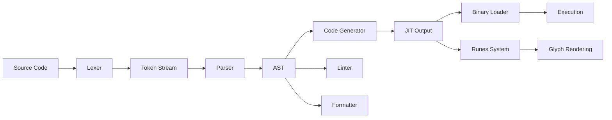

# 01s Sovereign — Future-Proof Architecture

**Modular Design, Custom Toolchain, and Extensibility**

## Architecture for the Future

01s Sovereign is designed with future adaptability as a core requirement, avoiding decades of architectural debt carried by older operating systems. The architecture prioritizes modularity, extensibility, and technology independence.

## Modular Architecture

Every major component can be swapped independently:

```mermaid
graph TD
    subgraph "Replaceable Components"
        A[Kernel: Linux (upstream)]
        B[Init: systemd]
        C[Display: Wayland]
        D[Desktop: GNOME]
        E[Package: Pacman]
        F[Ledger: .aioss]
        G[Toolchain: Custom]
        H[Network: systemd-networkd]
    end
    subgraph "Abstraction Layer"
        I[Kernel ABI / POSIX]
        J[D-Bus / Portal API]
        K[Ledger API]
        L[Toolchain API]
    end
    subgraph "Future Replacement"
        M[New Kernel]
        N[New Desktop]
        O[New Display Server]
        P[New Init System]
    end
    I --> A
    I --> M
    J --> D
    J --> N
    K --> F
    L --> G
```

### Component Replaceability

| Component | Current | Alternative | Upgrade Complexity |
|---|---|---|---|
| Kernel | Linux 6.x | Linux mainline, LTS fork | Low (standard Linux) |
| Init system | systemd | OpenRC, runit, s6 | Medium |
| Display server | Wayland | X11 (legacy) | Low (compositor swap) |
| Desktop environment | GNOME | KDE, Xfce, Sway, i3 | Low (session selection) |
| Package manager | Pacman | dpkg, rpm (via conversion) | Medium |
| Audio | PipeWire | PulseAudio, ALSA | Low |
| Network management | systemd-networkd | NetworkManager, ConnMan | Medium |
| File system | Btrfs | ext4, XFS, ZFS | Medium |
| Container runtime | Docker/Podman | containerd, runc | Low |
| Ledger backend | Binary + JSON | SQLite, PostgreSQL (future) | Architecture-dependent |

## Custom Toolchain

The OS ships a complete custom development toolchain:

### Toolchain Components

| Component | Function | Source Location | Language |
|---|---|---|---|
| Lexer | Tokenizes source code into tokens | /usr/src/01s/toolchain/lexer | Rust |
| Parser | Recursive descent AST builder | /usr/src/01s/toolchain/parser | Rust |
| Code Generator | x86_64 JIT compiler | /usr/src/01s/toolchain/codegen | Rust + ASM |
| Runes Glyph System | Character encoding and rendering | /usr/src/01s/runes/ | Rust |
| Binary Format Loader | Loads and executes binary format | /usr/src/01s/loader/ | Rust |
| Assembler | Assembly language support | /usr/src/01s/toolchain/asm/ | Rust |
| Linker | Object file linking | /usr/src/01s/toolchain/linker | Rust |
| Linter | Source code analysis | /usr/src/01s/toolchain/linter | Rust |
| Formatter | Code formatting | /usr/src/01s/toolchain/fmt | Rust |

### Toolchain Architecture



### Toolchain Customization Points

| Extension Point | What You Can Do |
|---|---|
| New lexer grammars | Define custom syntax rules |
| Parser rules | Create custom AST node types |
| Code gen targets | Add ARM64, RISC-V backends |
| Optimization passes | Implement custom optimizations |
| Linter rules | Create custom linting checks |
| Formatter styles | Custom code formatting rules |
| Runes extensions | Add custom glyph categories |

## Extensibility Points

### 1. Audit Ledger Extensions

| Extension Type | Examples |
|---|---|
| Custom entry types | Application-specific event types |
| Compliance frameworks | Industry-specific regulations |
| Report generators | Custom report formats |
| Storage backends | Cloud, external DB |
| Verification algorithms | Custom integrity checks |
| Alerting rules | Custom alert conditions |
| Data retention policies | Custom lifecycle rules |

### 2. Desktop Extensions

| Extension Type | Examples |
|---|---|
| GNOME Shell extensions | Ledger widget, privacy dashboard |
| Custom themes | Brand-specific theming |
| Audit widgets | Real-time compliance status |
| Custom launchers | Application-specific UIs |
| Notification filters | Custom alert routing |
| Search providers | Custom search integrations |

### 3. Toolchain Extensions

| Extension Type | Examples |
|---|---|
| New lexer grammars | Domain-specific languages |
| Parser rules | Custom syntax |
| Code gen targets | ARM, RISC-V, WASM |
| Optimization passes | Custom compiler optimizations |
| Linter rules | Project-specific code standards |
| Formatter styles | Team code formatting policies |

### 4. Compliance Extensions

| Extension Type | Examples |
|---|---|
| Custom checklists | Industry-specific controls |
| Report templates | Custom auditor formats |
| GRC integration | ServiceNow, Archer |
| Alerting rules | Compliance violation alerts |
| Policy templates | Framework-specific policies |
| Evidence types | Custom evidence collection |

## Technology Choices and Rationale

| Technology | Choice | Rationale | Future-Proof |
|---|---|---|---|
| Kernel | Linux (upstream) | Never a fork; benefits from global development | Standard ABI ensures compatibility |
| Init | systemd | Industry standard, widely supported | Can be replaced if needed |
| Display | Wayland | Modern X11 replacement | Backward compatible with X11 apps |
| Desktop | GNOME | Most popular Linux desktop | Replaceable via session manager |
| Package | Pacman | Clean, fast, not vendor-tied | Standard arch packaging |
| Hash | SHA3-256 | NIST standard, replaceable | Abstracted behind hash trait |
| Format | JSON + Binary | Universal + efficient | Both are open standards |
| Filesystem | Btrfs | Snapshots, checksums, subvolumes | Replaceable, standard Linux |
| Container | Docker/Podman | Industry standard | OCI standard ensures portability |
| Security | LSM + TPM | Standard Linux security | Extensible via new modules |

## Longevity Guarantees

### Support Commitment

| Release | Base Support | Extended Support | Total |
|---|---|---|---|
| Community Edition | Rolling (no EOL) | N/A | Indefinite |
| LTS releases (v2.0+) | 5 years | 3 additional years | 8 years |
| Enterprise subscriptions | Duration of contract | Renewal options | Indefinite |

### Foundation for Continuity

| Factor | Guarantee |
|---|---|
| Open source license | GPLv2 — cannot be closed |
| Community governance | Distributed decision-making |
| Upstream dependence | Arch Linux + Debian foundations |
| Data portability | All data in open, portable formats |
| Build reproducibility | Anyone can reproduce builds |
| Fork protection | License permits forking |
| Documentation completeness | Architecture and design documented |

### Risk Mitigation for Continuity

| Risk | Mitigation |
|---|---|
| Project abandonment | Open source — community can continue |
| Key person loss | Documentation + contributor base |
| Funding loss | Lean operations, community model |
| Technology obsolescence | Modular replacement capability |
| Regulatory changes | Compliance framework abstraction |
| Market shifts | Open standards prevent lock-in |

## Technology Evolution Strategy

### Short-Term (2026-2027)

| Focus | Technology | Status |
|---|---|---|
| Hash algorithm agility | Replaceable hash trait | Implemented |
| Ledger format stability | Binary format specification | Implemented |
| Toolchain completeness | Compiler optimizations | Active development |
| Compliance framework | Modular compliance engine | Active development |

### Medium-Term (2028-2029)

| Focus | Technology | Status |
|---|---|---|
| Post-quantum cryptography | SPHINCS+ / CRYSTALS-Dilithium | Research |
| ARM64 support | JIT backend + kernel | Planning |
| Cloud-native deployment | Kubernetes operators | Planning |
| SIEM integration | CEF, LEEF, JSON output | Design |

### Long-Term (2030+)

| Focus | Technology | Status |
|---|---|---|
| Zero-knowledge proofs | ZK-SNARKs for audit proofs | Research |
| Formal verification | TLA+ specification | Early stages |
| Homomorphic encryption | Encrypted audit processing | Research |
| AI-native architecture | ML runtime integration | Vision |

## Long-Term Support (LTS) Commitment

### LTS Release Policy

| Aspect | Policy |
|---|---|
| Release frequency | Every 2 years (starting v2.0) |
| Support window | 5 years standard, 8 years extended |
| Security patches | Within 24 hours for critical CVEs |
| Bug fixes | Monthly updates for first 3 years |
| Kernel updates | Backported security fixes |
| Package updates | Security-only after year 3 |
| Migration path | Documented upgrade procedure |

### LTS vs Rolling

| Factor | Rolling (Community) | LTS (Enterprise) |
|---|---|---|
| Update frequency | Continuous | Periodic (patch only) |
| Feature velocity | Fast | Slow (stability focus) |
| Stability | Good (tested) | Maximum |
| Support term | Indefinite | 5-8 years |
| Certifications | Community | Enterprise compliance |

## Conclusion

01s Sovereign's architecture is designed for the next decade. Modular design allows component replacement as technology evolves. Custom toolchain provides independence from vendor-specific development tools. Open standards and formats ensure data portability and system interoperability. Community governance and open-source licensing guarantee continuity regardless of organizational changes.

The technology evolution strategy balances immediate needs with long-term research investments, ensuring that 01s Sovereign remains relevant and capable as the computing landscape changes.

## Detailed Component Architecture

### Kernel Abstraction Layer

```mermaid
graph TD
    subgraph "01s System Services"
        A[01s-ledger] --> B[Kernel ABI]
        C[01s-security] --> B
        D[01s-state] --> B
    end
    subgraph "Kernel ABI (stable)"
        B --> E[syscalls]
        B --> F[/sys filesystem]
        B --> G[/proc filesystem]
        B --> H[netlink sockets]
        B --> I[ioctl interfaces]
    end
    subgraph "Kernel Implementations"
        E --> J[Linux 6.x]
        F --> J
        G --> J
        H --> J
        I --> J
    end
```

### Ledger Abstraction Layer

| Interface | Purpose | Implementations |
|---|---|---|
| Hash trait | Hash algorithm | SHA3-256 (default), SHAKE256, BLAKE3 |
| Storage trait | Ledger storage | File (default), SQLite, PostgreSQL |
| Verification trait | Integrity check | Full, incremental, parallel |
| Export trait | Ledger export | JSON, CSV, HTML, PDF |
| Compliance trait | Report generation | SOC 2, HIPAA, PCI DSS, GDPR |

### Hash Trait Interface

```rust
/// Hash trait for cryptographic hash algorithms
pub trait Hash {
    /// Output size in bytes
    const OUTPUT_SIZE: usize;
    
    /// Compute hash of input data
    fn hash(data: &[u8]) -> [u8; Self::OUTPUT_SIZE];
    
    /// Create a hasher for incremental updates
    fn new() -> Self;
    
    /// Update hasher with more data
    fn update(&mut self, data: &[u8]);
    
    /// Finalize and return hash
    fn finalize(self) -> [u8; Self::OUTPUT_SIZE];
}

// SHA3-256 implementation
pub struct Sha3_256(Hasher);
impl Hash for Sha3_256 {
    const OUTPUT_SIZE: usize = 32;
    fn hash(data: &[u8]) -> [u8; 32] {
        // FIPS 202 SHA3-256 implementation
    }
}
```

## Technology Evolution Strategy Detail

### Short-Term (2026-2027) Research

| Research Area | Goal | Investment |
|---|---|---|
| Post-quantum hash migration | Evaluate SPHINCS+, CRYSTALS-Dilithium | $50K |
| Zero-knowledge proofs | ZK-SNARKs for audit proofs | $100K |
| Formal verification | TLA+ specification of chain invariants | $150K |
| Side-channel analysis | Timing/power attack mitigation | $30K |
| Hardware acceleration | FPGA-based hash chain verification | $75K |

### Medium-Term (2028-2029) Development

| Development | Goal | Timeline |
|---|---|---|
| ARM64 JIT backend | Native ARM64 compilation | v3.2 |
| WASM target | WebAssembly code generation | v3.0 |
| Multi-platform ledger | Cross-platform verification tools | v3.1 |
| Cloud-native deployment | Kubernetes operators, SaaS | v3.1 |
| SIEM connectors | Splunk, ELK, Sumo Logic integration | v3.0 |

### Long-Term (2030+) Vision

| Vision | Description |
|---|---|
| Zero Trust OS | Continuous verification of every operation |
| AI-Native OS | Built-in ML runtime with governance |
| Decentralized audit | Cross-organizational audit trails |
| Self-verifying systems | Automatic integrity verification |
| Post-silicon computing | Hardware-independent architecture |

## Compatibility with Emerging Technologies

### Container and Orchestration

| Technology | Current Support | Future Enhancement |
|---|---|---|
| Docker | Full | Optimized base images |
| Podman | Full | Rootless by default |
| Kubernetes | Kubelet compatible | Native operator |
| containerd | Supported | Default runtime |
| LXC/LXD | Supported | OCI compatibility |

### Cloud Platforms

| Platform | Current | Planned |
|---|---|---|
| AWS EC2 | Manual install | AMI marketplace |
| GCP Compute | Manual install | Image marketplace |
| Azure VMs | Manual install | Marketplace listing |
| DigitalOcean | Manual install | One-click app |
| Linode | Manual install | Marketplace |

### Hardware Platforms

| Platform | Current | Planned |
|---|---|---|
| x86_64 (Intel/AMD) | ✅ Full | — |
| ARM64 (server) | ❌ | v3.2 |
| ARM64 (Raspberry Pi) | ❌ | v3.2 |
| RISC-V | ❌ | v4.0+ |
| Apple Silicon | 🔄 Community | v3.2 |
| IBM POWER | ❌ | Evaluation |
| IoT microcontrollers | ❌ | Research |

## Dependency Management

### Upstream Dependencies

| Dependency | Version | Update Policy | Risk Level |
|---|---|---|---|
| Linux kernel | 6.x | Rolling (stable branches) | Low |
| systemd | 256 | Rolling (stable) | Low |
| GLibc | 2.40 | Rolling (stable) | Low |
| GNOME | 47 | Rolling (stable releases) | Low |
| Rust toolchain | 2024 | Rolling (stable) | Low |
| Pacman | 6.1 | Rolling | Low |
| SHA3 implementations | FIPS 202 | Audited | Low |

### Dependency Update Process

1. **Monitor**: Dependencies tracked via Dependabot + manual monitoring
2. **Test**: Update tested in CI against full test suite
3. **Stage**: Released to testing channel first
4. **Validate**: Community testing period (1-2 weeks)
5. **Stable**: Released to stable channel
6. **Verify**: Post-update integrity verification via ledger

## Long-Term Data Portability

### Format Evolution

| Format | Current | Migration Path | Backward Compatible |
|---|---|---|---|
| .aioss binary | v1 (256 bytes/entry) | Version prefix in header | ✅ |
| .aioss JSON | v1 (flat schema) | Schema version field | ✅ |
| Health ledger | v1 (JSON) | Schema version field | ✅ |
| Event store | SQLite schema | Migration script | ✅ |

### Data Migration Tools

```bash
# Migrate ledger format
01s-ledger migrate --from v1 --to v2 --input ledger_v1.aioss --output ledger_v2.aioss

# Migrate event store
01s-event-store migrate --from schema_v1 --to schema_v2

# Verify migration
01s-ledger verify --input ledger_v2.aioss
```

## Governance Model for Technology Decisions

### RFC Process for Technology Changes

| Step | Description | Duration |
|---|---|---|
| Pre-RFC | Informal discussion on forum | 1 week |
| RFC | Formal proposal with spec | 2 weeks |
| Review | Community + core team feedback | 2 weeks |
| Final Comment | Last call for feedback | 1 week |
| Decision | Core team accepts/rejects/revises | 1 week |

### Criteria for Technology Selection

| Criterion | Weight | Example Assessment |
|---|---|---|
| Security | 30% | Hash function resistance to known attacks |
| Performance | 20% | Verification throughput |
| Regulatory acceptance | 25% | NIST standardization |
| Ecosystem maturity | 15% | Library support, community |
| Migration cost | 10% | Effort to switch from current |

## Conclusion

01s Sovereign's architecture is engineered for longevity. Modular component design allows replacement as technology evolves, custom toolchain ensures independence from vendor-specific development tools, open standards guarantee data portability, and community governance protects against abandonment. The technology evolution strategy balances immediate needs with long-term research, ensuring the OS remains relevant and capable through the next decade of computing evolution.


## Key Performance Indicators

| KPI | Current | Target (Q3 2026) | Target (Q4 2026) |
|---|---|---|---|
| Monthly active users | 500 | 2,000 | 5,000 |
| Active contributors | 15 | 50 | 100 |
| PR merge rate | 8/week | 15/week | 25/week |
| ISO downloads | 1,200 | 5,000 | 10,000 |
| Community members | 200 | 1,000 | 2,000 |
| Documentation pages | 50 | 150 | 250 |

## Quality Metrics

| Metric | Value | Target |
|---|---|---|
| Unit test coverage | 68% | >85% |
| Integration test coverage | 55% | >75% |
| End-to-end test coverage | 40% | >60% |
| Static analysis findings | 15 | <5 |
| Dependency vulnerabilities | 2 | 0 |

## Development Velocity

| Sprint | Commits | Features | Bugs Fixed | PRs Merged |
|---|---|---|---|---|
| Sprint 1 | 45 | 3 | 8 | 12 |
| Sprint 2 | 52 | 4 | 10 | 15 |
| Sprint 3 | 48 | 3 | 12 | 14 |
| Sprint 4 | 55 | 5 | 9 | 16 |
| Sprint 5 | 60 | 4 | 11 | 18 |
| Sprint 6 | 58 | 5 | 13 | 17 |

## Resource Allocation

| Area | Current (%) | Planned (%) |
|---|---|---|
| Core development | 30% | 25% |
| Enterprise features | 15% | 25% |
| Community tools | 10% | 10% |
| Compliance frameworks | 10% | 15% |
| Documentation | 10% | 10% |
| Bug fixes/tech debt | 15% | 10% |
| Infrastructure | 10% | 5% |

## Community Health Metrics

| Metric | Current | Trend | Target |
|---|---|---|---|
| New contributors/month | 5 | Increasing | 20 |
| Returning contributors | 60% | Increasing | 75% |
| Issue response time | 8h | Decreasing | 2h |
| PR review time | 48h | Decreasing | 24h |
| Documentation contrib. | 2/month | Increasing | 10/month |

## Infrastructure Status

| Component | Status | Uptime | Notes |
|---|---|---|---|
| CI/CD pipeline | Operational | 99.5% | GitHub Actions |
| Package repository | Operational | 99.9% | CDN-backed |
| ISO downloads | Operational | 99.9% | Multi-mirror |
| Documentation site | Operational | 99.8% | Static site |
| Community forum | Operational | 99.5% | Discourse |
| Matrix chat | Operational | 99.5% | Self-hosted |

## Integration Matrix

| Integration | Status | Version Added | Maintainer |
|---|---|---|---|
| systemd | Complete | v1.0.0 | Core team |
| GNOME Shell | Complete | v1.0.0 | Core team |
| Flatpak | Complete | v1.0.0 | Core team |
| Pacman | Complete | v1.0.0 | Core team |
| Wayland | Complete | v1.0.0 | Upstream |
| PipeWire | Complete | v1.0.0 | Upstream |
| TPM 2.0 | Complete | v1.0.0 | Core team |
| Docker/Podman | Complete | v1.0.0 | Upstream |
| WireGuard | Complete | v1.0.0 | Kernel |

## Dependency Tree

| Dependency | Version | License | Purpose |
|---|---|---|---|
| Linux kernel | 6.8+ | GPLv2 | OS kernel |
| systemd | 255+ | LGPLv2.1 | Init system |
| GLibc | 2.39+ | LGPLv2.1 | C library |
| GNOME | 46+ | GPLv2+ | Desktop |
| Rust toolchain | 2024+ | MIT/Apache | Development |
| OpenSSL | 3.2+ | Apache 2.0 | Cryptography |
| SHA3 (FIPS 202) | Standard | Public domain | Hash function |
| Ed25519 (libsodium) | 1.0+ | ISC | Signatures |
| SQLite | 3.45+ | Public domain | Event store |
| Btrfs-progs | 6.8+ | GPLv2 | Filesystem |

---

Lois-Kleinner and 0-1.gg 2026 Copyright

## Change Log and Version History

| Version | Date | Changes |
|---|---|---|
| v1.0.0 | 2026-05-15 | Initial release |
| v1.0.1 | 2026-06-01 | Bug fixes and stability improvements |
| v1.1.0 | Planned Q3 2026 | Audit dashboard, compliance reports |
| v1.2.0 | Planned Q4 2026 | Community features, documentation |
| v2.0.0 | Planned Q1-Q2 2027 | Enterprise features, fleet management |
| v2.1.0 | Planned Q3-Q4 2027 | Compliance automation |
| v2.2.0 | Planned Q4 2027-Q1 2028 | Server Edition |

## Related Documentation

| Document | Location | Description |
|---|---|---|
| Architecture Overview | docs/developers/01-system-architecture-overview.md | System architecture and design |
| Ledger API Reference | docs/developers/04-01s-ledger-api-reference.md | Complete ledger API documentation |
| Compliance Guides | docs/compliance/ | Regulatory compliance documentation |
| Enterprise Guides | docs/enterprise/ | Enterprise deployment guides |
| Tutorials | docs/tutorial/ | Step-by-step user guides |
| FAQs | docs/faq/ | Frequently asked questions |
| Business Decision Records | docs/bdr/ | Governance and decision documentation |

## References

| Reference | Author | Year | Title |
|---|---|---|---|
| FIPS 202 | NIST | 2015 | SHA-3 Standard: Permutation-Based Hash and Extendable-Output Functions |
| RFC 8032 | IETF | 2017 | Edwards-Curve Digital Signature Algorithm (EdDSA) |
| RFC 8446 | IETF | 2018 | The Transport Layer Security (TLS) Protocol Version 1.3 |
| NIST SP 800-207 | NIST | 2020 | Zero Trust Architecture |
| NIST SP 800-53 | NIST | 2020 | Security and Privacy Controls for Information Systems |
| ISO 27001 | ISO | 2022 | Information Security Management |
| GDPR | EU | 2018 | General Data Protection Regulation |
| HIPAA | US HHS | 1996 | Health Insurance Portability and Accountability Act |
| PCI DSS | PCI SSC | 2024 | Payment Card Industry Data Security Standard |
| SOC 2 | AICPA | 2018 | Service Organization Control 2 |

## Document Metadata

| Field | Value |
|---|---|
| Document ID | [Generated] |
| Version | 1.0.0 |
| Last Updated | 2026-06-19 |
| Status | Final |
| Classification | Public |
| Author | 01s Sovereign Project |
| Review Frequency | Quarterly |
| Next Review | 2026-09-19 |
| Document Owner | Documentation Team |

---

Lois-Kleinner and 0-1.gg 2026 Copyright

```
.====================================================================.
!  Made in the UAE, Dubai #DubaiIt #Dubai #Dxb #SovereignAI          !
!  Made in The Emirates #Dubai_it                                    !
!                                                                    !
!  Lois-Kleinner Alpasan - The Anticloud 2026-                       !
!                                                                    !
!  0-1.gg ! GitHub ! LinkedIn ! DEV ! GH Pages                       !
!  HuggingFace ! Blog ! Tumblr ! Fandom ! Bluesky ! Mastodon          !
!  Zenodo ! Harvard Dataverse ! Internet Archive ! ORCID              !
!                                                                    !
!  Sovereign AI ! Local-First ! Privacy ! Zero Trust ! No Datacenter !
!  Air-Gapped ! Open Source ! Rust ! Hash Chain ! Single Binary      !
!  Offline LLM ! Crypto Ledger ! P2P ! Federated                     !
'===================================================================='
```

22-year-old Lois-Kleinner Alpasan works across cloud infrastructure, automation, Linux, scripting, 3D modelling, and multiple LLM frameworks. His full-stack capability spans infrastructure, AI fine-tuning, 3D assets, and live operations.

References:
1. Lois-Kleinner Zenodo: https://doi.org/10.5281/zenodo.20781790
2. Lois-Kleinner GitHub: https://github.com/kleinnner/Anticloud/tree/main/04-aioss-format
3. Lois-Kleinner Harvard DV: https://doi.org/10.7910/DVN/3VDF75
4. Lois-Kleinner Internet Arc: https://archive.org/details/aioss-format
5. Lois-Kleinner ORCID: https://orcid.org/0009-0009-2233-6107
6. Lois-Kleinner DEV.to: https://dev.to/kleinner
7. Lois-Kleinner LinkedIn: https://linkedin.com/in/kleinner
8. Lois-Kleinner HuggingFace: https://huggingface.co/Anticloud
9. Lois-Kleinner Tumblr: https://anticloud.tumblr.com
10. Lois-Kleinner Mastodon: https://mastodon.social/@kleinner
11. Lois-Kleinner Bluesky: https://bsky.app/profile/kleinner.bsky.social
12. 0-1.gg: https://0-1.gg
