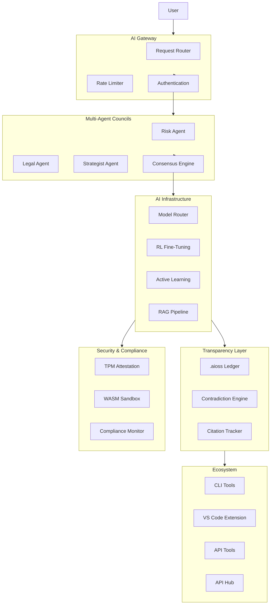

# 06 — API-OSS

**Agent-Predictive Intelligence Sovereign Operating System** — A local-first sovereign AI platform encompassing an API gateway architecture, multi-agent deliberation councils, cryptographic audit infrastructure, decentralized identity, and full-stack AI transparency.

## Documentation

| Category | Docs | Description |
|----------|------|-------------|
| [Research](./research/) | 30 | Academic research papers |
| [Whitepapers](./whitepapers/) | 10 | Technical whitepapers |
| [Features](./features/) | 162 | Comprehensive feature documentation |
| [Architecture](./architecture/) | 15 | Architecture documentation |
| [Specifications](./spec/) | 11 | Technical specifications |
| [Tutorials](./tutorials/) | 15 | Getting started guides |
| [Compliance](./compliance/) | 10 | Compliance frameworks |
| [Community](./community/) | 10 | Community documentation |
| [Governance](./governance/) | 12 | Governance documentation |
| [FAQ](./faq/) | 15 | Frequently asked questions |
| [Glossary](./glossary/) | 30 | Terminology reference |
| [CLI Reference](./cli/) | 22 | Command-line interface documentation |
| [API Reference](./api-reference/) | 30 | API documentation |
| [Cheat Sheets](./cheat-sheets/) | 4 | Quick reference guides |
| [Decision Guides](./decision-guides/) | 11 | Technology decision guides |
| [Accessibility](./accessibility/) | 8 | Accessibility documentation |
| [Brand](./brand/) | 8 | Brand guidelines |
| [Case Studies](./case-studies/) | 10 | Usage case studies |
| [Community Projects](./community-projects/) | 8 | Community project showcase |
| [Press](./press/) | 12 | Press documentation |
