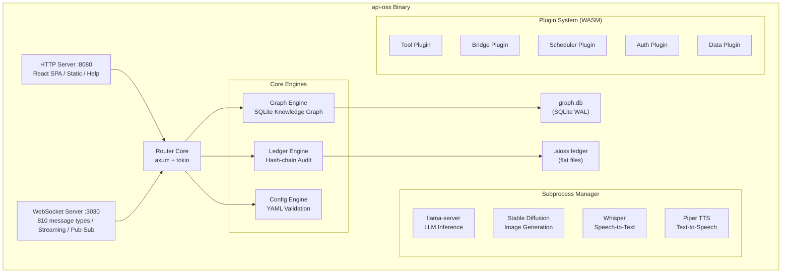

# API-OSS System Architecture

## Overview

API-OSS (Agent-Predictive Intelligence Sovereign Operating System) is a self-contained sovereign AI platform. All components run locally with zero cloud dependency. The system is a single Rust binary (`api-oss`) that serves both the WebSocket API (port 3030) and the HTTP frontend (port 8080), plus manages subprocesses for LLM inference, image generation, voice I/O, and bridge bots.



---

## Module Map — 255 Rust Files

### Core Infrastructure (`src/` root)

| Module | File | Purpose |
|--------|------|---------|
| `main.rs` | Entry point | CLI arg parsing, subcommand dispatch, server startup |
| `lib.rs` | Module registry | Declares all 170+ modules, shared re-exports |
| `config.rs` | Configuration | TOML/YAML/JSON config, env var overrides, defaults |
| `ws_server.rs` | WebSocket server | Axum WS endpoint, all 810 message handlers (10,122 lines) |
| `protocol.rs` | Message protocol | All ClientMessage + ServerMessage enums (~2,800 lines) |
| `llama.rs` | LLM manager | llama.cpp subprocess lifecycle, prompt/response streaming |
| `graph.rs` | Graph database | SQLite knowledge graph: nodes, edges, FTS5 search, timelines |

### AI & Inference

| Module | Purpose |
|--------|---------|
| `llama.rs` | Manage llama-server subprocess, model loading, inference requests |
| `sd.rs` | Stable Diffusion subprocess, txt2img and img2img |
| `whisper.rs` | Whisper.cpp subprocess, speech-to-text |
| `piper.rs` | Piper TTS subprocess, text-to-speech |
| `tokenizer.rs` | Prompt token counting and estimation |
| `modelfile.rs` | Modelfile parser/compiler: FROM, SYSTEM, TEMPLATE, PARAMETER |
| `grammar.rs` | GBNF grammar generation from JSON Schema for structured output |
| `embed.rs` | Text embedding generation via llama.cpp |

### Knowledge Graph

| Module | Purpose |
|--------|---------|
| `graph.rs` | Core graph: create/read/update/delete nodes and edges |
| `fts5.rs` | Full-text search via SQLite FTS5 with custom tokenizer |
| `search.rs` | Search profiles, ranking, LIKE + FTS5 dual search |
| `contradiction.rs` | 3-layer contradiction detection (stance, semantic, graph) |
| `canvas.rs` | Graph canvas: 2D/3D rendering data, force-directed layout |
| `graph_vcs.rs` | Graph version control: commit, branch, diff, merge |
| `graph_diff.rs` | Graph diff calculation between versions |
| `entity_resolution.rs` | Entity resolution and deduplication |
| `person_graph.rs` | Social network / person graph analysis |
| `materialized_view.rs` | Materialized SQL views for graph queries |
| `zero_copy.rs` | Zero-copy clone of graph workspaces |
| `timescape.rs` | Temporal analysis: as-of queries, chronology views |

### Audit Ledger

| Module | Purpose |
|--------|---------|
| `ledger.rs` | SHA-256 hash-chained append-only ledger: write, read, verify |
| `ledger_verify.rs` | Standalone ledger verification tool |
| `ledger_search.rs` | Search ledger entries by type, actor, content |
| `ledger_export.rs` | Export ledger to JSON, CSV, PDF |

### Multi-Agent Council

| Module | Purpose |
|--------|---------|
| `council.rs` | Council deliberation engine, fixed-role agents |
| `council_config.rs` | Council configuration: members, rules, voting |
| `council_vote.rs` | Voting logic: Pro/Con/Neutral with stances |
| `council_memory.rs` | Persistent graph memory for council decisions |
| `decision.rs` | Decision tree: nodes, edges, provenance |
| `decision_search.rs` | Decision search and retrieval |
| `provenance.rs` | Decision provenance tracking |

### Security & Access Control

| Module | Purpose |
|--------|---------|
| `auth.rs` | Authentication: bearer token, session management |
| `auth_oidc.rs` | OIDC SSO integration |
| `auth_saml.rs` | SAML SSO integration |
| `auth_ldap.rs` | LDAP authentication |
| `rbac.rs` | Role-based access control |
| `abac.rs` | Attribute-based access control |
| `tpm.rs` | TPM 2.0 attestation |
| `tls.rs` | Auto-generated TLS 1.3 certificates |
| `encryption.rs` | AES-256-GCM encryption stack |
| `secrets.rs` | Secrets management (with Shamir secret sharing) |
| `dlp.rs` | Data loss prevention policies and enforcement |
| `psi.rs` | Privacy-preserving PSI (curve25519-dalek) |
| `safety.rs` | File safety analysis (malware scanning via ClamAV) |
| `jailbreak.rs` | ML-based jailbreak prompt detection |
| `toxicity.rs` | Output toxicity scoring |
| `constitution.rs` | Constitutional AI: principles, critique, self-review |

### Data Ingestion & Processing

| Module | Purpose |
|--------|---------|
| `ingest.rs` | File ingestion: PDF, DOCX, XLSX, CSV, JSON, TXT, PPTX, HTML |
| `rag.rs` | Retrieval-augmented generation: chunk, embed, retrieve |
| `extractor_fs.rs` | Filesystem extractor (watch directories) |
| `extractor_rest.rs` | REST API data connector |
| `extractor_scim.rs` | SCIM data connector |
| `extractor_jdbc.rs` | JDBC database connector |
| `extractor_kafka.rs` | Kafka stream connector |
| `extractor_mqtt.rs` | MQTT IoT connector |
| `extractor_salesforce.rs` | Salesforce connector |
| `extractor_postgres.rs` | PostgreSQL connector |
| `extractor_mysql.rs` | MySQL connector |

### Bridges & Connectivity

| Module | Purpose |
|--------|---------|
| `discord_bot.rs` | Discord bot bridge: commands, messages, threads |
| `telegram_bot.rs` | Telegram bot bridge: commands, inline queries |
| `whatsapp_bridge.rs` | WhatsApp bridge via WebJS |
| `mcp_server.rs` | Model Context Protocol server |
| `tunnel.rs` | Public URL tunnel via cloudflared |
| `p2p.rs` | P2P sync: peer discovery, gossip protocol |
| `crdt.rs` | CRDT conflict resolution for P2P sync |
| `sync_scheduler.rs` | Scheduled sync operations |
| `discovery.rs` | mDNS/LAN peer discovery |
| `qr.rs` | QR code generation for sharing |

### Annotation & Data Quality

| Module | Purpose |
|--------|---------|
| `annotation/mod.rs` | Annotation core: session, item, workflow stage |
| `annotation/annotation.rs` | Annotation CRUD, active learning strategies |
| `annotation/confidence.rs` | IAA scoring: Cohen's Kappa, Fleiss' Kappa |
| `annotation/schema.rs` | Label schema management, tree hierarchy |
| `annotation/dataset.rs` | Dataset management, versioning |
| `annotation/quality.rs` | Dataset quality metrics |
| `annotation/campaign.rs` | Annotation campaign management |
| `ground_truth.rs` | Ground truth / golden dataset management |
| `workforce.rs` | Annotator workforce management |
| `active_learning.rs` | Active learning: uncertainty sampling, diversity sampling |
| `adjudication.rs` | Adjudication workflow for resolving annotator conflicts |
| `review_queue.rs` | Review queue management |

### Evaluation & Quality

| Module | Purpose |
|--------|---------|
| `eval/mod.rs` | Evaluation module declarations |
| `eval/benchmark_runner.rs` | Benchmark runner: MMLU, GSM8K, HumanEval, HellaSwag, ARC |
| `eval/metrics.rs` | BLEU, ROUGE-N, ROUGE-L, exact match calculation |
| `eval/datasets.rs` | Benchmark dataset download and management |
| `eval/report.rs` | Benchmark report generation |
| `model_leaderboard.rs` | Model comparison leaderboard |
| `model_card.rs` | Model card generation |
| `model_registry.rs` | Model catalog, sources, families |
| `bias_eval.rs` | BBQ-style bias evaluation framework |
| `ab_test.rs` | A/B testing between models |
| `redteam.rs` | Red team attack generation |
| `regression_test.rs` | Regression test suite |
| `evaluation_report.rs` | Detailed evaluation reports |

### Simulation & Defense

| Module | Purpose |
|--------|---------|
| `simulation.rs` | Multi-agent simulation engine |
| `wargame.rs` | Monte Carlo war game simulation |
| `scenario.rs` | Scenario simulation framework |
| `world_engine.rs` | World engine: state, rules, agents, tick |
| `causal_graph.rs` | Causal graph inference and analysis |
| `link_analysis.rs` | Visual link analysis |
| `geospatial.rs` | GIS: coordinates, map tiles, spatial queries |
| `battlespace.rs` | Battlespace management, COT processing |
| `ops_center.rs` | Operations center dashboard |
| `sensors.rs` | Sensor data ingestion and management |
| `fleet.rs` | Fleet management |
| `asset_health.rs` | Asset health monitoring |
| `intel_feed.rs` | Intelligence feed aggregation |
| `replay.rs` | Session replay engine |
| `mission.rs` | Mission module management |

### Governance & Compliance

| Module | Purpose |
|--------|---------|
| `compliance.rs` | Compliance dashboard: frameworks, controls, evidence |
| `regulatory.rs` | Regulatory monitoring: laws, updates, impact |
| `regulatory_impact.rs` | Regulatory impact analysis |
| `siem.rs` | SIEM dashboard, log forwarding |
| `cep.rs` | Complex event processing rules engine |
| `rules.rs` | Rules engine: conditions, actions, triggers |
| `incident.rs` | Incident orchestration: detection, response, recovery |
| `org.rs` | Organization administration |
| `data_room.rs` | Secure data room |
| `promotion.rs` | Environment promotion pipeline |
| `governance.rs` | Governance dashboard |
| `sbom.rs` | SBOM generation and vulnerability scanning |
| `data_lineage.rs` | Data lineage tracking |
| `audit.rs` | Audit streaming and export |

### System & Operations

| Module | Purpose |
|--------|---------|
| `backup.rs` | Backup and restore engine |
| `migration.rs` | Database schema migration |
| `diagnostics.rs` | System diagnostics and health checks |
| `health.rs` | Health endpoint: model, graph, ledger, bridges |
| `logging.rs` | Structured logging (tracing) |
| `metrics.rs` | Prometheus metrics export |
| `notifications.rs` | Notification system (email, webhook, push) |
| `scheduler.rs` | Scheduler for periodic tasks |
| `lock.rs` | PID file lock for crash prevention |
| `auto_updater.rs` | Automatic update checking |
| `telemetry.rs` | Telemetry and usage metrics |
| `stats.rs` | Usage statistics |

### Psyche (Cognitive Processing)

| Module | Purpose |
|--------|---------|
| `psyche/mod.rs` | Psyche module declarations |
| `psyche/limbic.rs` | Limbic system: emotional tagging of nodes |
| `psyche/trauma.rs` | Trauma processing and integration |
| `psyche/shadow.rs` | Shadow self: suppressed/contradictory beliefs |
| `psyche/ego.rs` | Ego: coherent identity across graph |
| `psyche/dream.rs` | Dream state: unsupervised node association |
| `psyche/archetype.rs` | Archetype matching (Jungian) |
| `psyche/interoception.rs` | Interoception: internal system state sensing |
| `psyche/schema.rs` | Schema: core beliefs and world models |
| `psyche/defense.rs` | Defense mechanisms: rationalization, projection |
| `psyche/sync.rs` | Psyche state synchronization |
| `psyche/narrative.rs` | Narrative self: autobiographical memory |
| `psyche/attention.rs` | Attention: salience-based node activation |
| `psyche/valence.rs` | Valence: positive/negative affect tagging |
| `psyche/sense.rs` | Sense-making: pattern completion |
| `psyche/reframe.rs` | Reframing: cognitive reappraisal |
| `psyche/resonate.rs` | Resonance: emotional contagion between nodes |
| `psyche/insight.rs` | Insight: sudden pattern recognition |
| `psyche/intuition.rs` | Intuition: fast, non-analytic judgment |
| `psyche/body.rs` | Body schema: proprioceptive mapping |
| `psyche/actor.rs` | Actor: social role simulation |
| `psyche/observer.rs` | Observer: metacognitive monitoring |
| `psyche/witness.rs` | Witness: pure awareness/attention |
| `psyche/self_state.rs` | Self state: coherent self-representation |
| `psyche/coherence.rs` | Coherence: intra-psychic consistency check |

### Workflows & Pipelines

| Module | Purpose |
|--------|---------|
| `workflows.rs` | Workflow builder: DAG steps, triggers, conditions |
| `pipeline.rs` | Pipeline builder: data transformation DAGs |
| `forms.rs` | Form builder: schema, validation, submission |
| `websites.rs` | Website builder: pages, templates, deploy |
| `wiki.rs` | Wiki/knowledge base pages |
| `podcast.rs` | Podcast generation from graph content |
| `meeting_session.rs` | Meeting session management |
| `skill_assessment.rs` | Skill assessment and testing |

### Plugins & Extensions

| Module | Purpose |
|--------|---------|
| `wasm.rs` | WASM plugin runtime: load, sandbox, call |
| `plugins.rs` | Plugin registry: manifest, permissions, lifecycle |
| `marketplace.rs` | Plugin/data marketplace |
| `connectors.rs` | Data connector registry |
| `webhooks.rs` | Webhook sender/receiver |
| `sdk_server.rs` | Python/JS SDK server (OpenAI-compatible API) |
| `pgwire.rs` | PostgreSQL wire protocol server |

### Frontend Server

| Module | Purpose |
|--------|---------|
| `helmet.rs` | HTTP security headers (CSP, HSTS, XFO) |
| `proxy_gate.rs` | SOCKS5 proxy for outbound connections |
| `serve.rs` | Static file serving (React SPA, images, documents) |
| `help.rs` | Help content serving (markdown → HTML) |

---

## Frontend — 132 React Views

The frontend is a React SPA (TypeScript) organized into groups:

### Core Views (Chat, Graph, Search)
`ChatView`, `GraphCanvasView`, `SearchView`, `MessagesView`, `DocumentsView`, `PassaporteView`, `DataLinksView`, `ErrorDashboardView`, `HelpCenterView`, `ActivityFeedView`, `WorkspaceView`, `UsageView`

### Analysis Views
`ContradictionsView`, `CouncilView`, `PredictionView`, `EmotionNexusView`, `ContextMapView`, `DecisionSearchView`, `GraphDiffView`, `DataLineageView`, `PersonGraphView`, `VisualLinkAnalysisView`, `ScenarioSimulationView`, `TimescapeView`, `InsightEngineView`, `DeepReasonView`, `OntologyQueryView`, `CompareView`

### Creation Views
`OutputStudioView`, `ImageGenerationView`, `VideoGenerationView`, `FinetuneView`, `WebsiteBuilderView`, `WikiView`, `PipelineView`, `PipelineBuilderView`, `WorkflowBuilderView`, `FormBuilderView`, `AppBuilderView`, `ModelManagementView`, `ModelfileView`, `SyntheticDataView`, `AgentBuilderView`, `AgentPlaygroundView`, `SdkPlaygroundView`, `PodcastView`, `MeetingSessionsView`

### Governance Views
`LedgerView`, `ComplianceDashboardView`, `RegulatoryMonitorView`, `RegulatoryImpactView`, `GovernanceView`, `RulesView`, `CepRulesView`, `ConstitutionView`, `TpmAttestationView`, `SbomView`, `ModelSigningView`, `EncryptionView`, `CompliancePipelineView`, `DataRoomView`, `WritebackLogView`

### Annotation Views
`AnnotationStudioView`, `ReviewQueueView`, `DatasetsView`, `LabelSchemasView`, `DatasetQualityView`, `AdjudicationView`, `GroundTruthView`, `FormalIaaView`, `ActiveLearningView`, `CampaignsView`, `WorkforceView`

### Advanced Views
`OperationsCenterView`, `BattlespaceView`, `WarGameView`, `SimulationPanelView`, `GeoMapView`, `SensorDashboardView`, `FleetView`, `AssetHealthView`, `IntelFeedView`, `QuantumView`, `DataLakeView`, `AutomationView`, `ActionsView`, `SyncView`, `ConnectorsView`, `ObjectOntologyView`, `OntologySchemasView`, `OrgAdminView`, `BackupRestoreView`, `ArchiveView`, `SessionReplayView`, `TcoCalculatorView`, `SystemView`, `DiagnosticsView`, `FileSafetyView`, `ErrorConsoleView`, `DecisionsView`, `PsiView`, `PersonGraphView`, `AchievementsView`, `DeployPipelineView`, `DeployMonitorView`, `WorkflowHistoryView`, `PsycheView`, `BiasEvalView`, `JailbreakView`, `ToxicityView`, `ModelJudgeView`, `InterpretabilityView`, `AbTestingView`, `ModelCardView`, `GroundTruthView`, `LeaderboardView`, `EvalReportView`, `RegressionTestView`, `MaterializedView`, `ZeroCopyCloneView`, `UserSchemaView`, `EnvPromotionView`, `IncidentOrchestrationView`, `DecisionAutopilotView`

### Components & Widgets
- **41 Components**: `LoadingSkeleton`, `HelpArticleViewer`, `DocumentRenderer`, `DataModal`, `ModelSelector`, `ModelCard`, `CouncilMember`, `LabelTree`, `ProgressBar`, `ConflictViewer`, `SensorPanel`, `MapView`, `TimelineSlider`, `ForceGraph`, `DataTable`, `CodexPanel`, `TopTabs`, `Sidebar`, `Modals`, `ClawTerminal`, `EmotionNexusPanel`, `CognitiveWindow`, `PredictionPanel`, `ContradictionMeter`, `OutputStudio`, `SessionList`, `EntityPanel`, `ChatInput`, `MessageBubble`, `SystemPromptEditor`, `ToolSelector`, `WorkspacePanel`, `SearchBar`, `SearchResults`, `IngestDropzone`, `NotificationToast`, `ThemeToggle`, `SettingsPanel`, `ProfilePanel`, `KeyboardShortcutHelp`
- **9 Widgets**: `ChartWidget`, `TimelineWidget`, `TableWidget`, `StatWidget`, `PieChartWidget`, `HeatmapWidget`, `NodeListWidget`, `EdgeListWidget`, `ActivityStreamWidget`
- **14 Hooks**: `useWebSocket`, `useStore`, `useTheme`, `useKeyboard`, `useNotification`, `useSession`, `useGraph`, `useSearch`, `useModels`, `useLedger`, `useAuth`, `useBridge`, `useSync`, `useHelp`

---

## Data Flow

### Chat Message Flow
```
User types message
  → ChatView.tsx
    → useWebSocket.send({ type: "chat_message", ... })
      → ws_server.rs handler
        → council.rs (if council mode)
          → llama.rs → llama-server subprocess
        → Return response token-by-token via WebSocket stream
          → ChatView.tsx renders streaming text
        → Log to ledger
        → Log to graph (session node + edges)
```

### Document Ingestion Flow
```
User drops file
  → DataModal upload (via fetch/WS)
    → ingest.rs
      → Format detection (PDF/DOCX/XLSX/CSV/JSON/TXT/PPTX/HTML)
      → Text extraction
      → Chunking (rag.rs)
      → Embedding generation (embed.rs)
      → Graph node creation per chunk
      → FTS5 indexing
      → Ledger logging
    → Response: document_id, chunk count
```

### Council Deliberation Flow
```
User sends message to council
  → CouncilView.tsx
    → ws_server.rs → council.rs
      → Each member (Risk/Legal/Strategist) prompts llama independently
      → Vote aggregation (Pro/Con/Neutral with reasoning)
      → Decision provenance saved to graph
      → Result streamed back
    → CouncilView.tsx renders member responses, vote tally, decision tree
```

### Graph Canvas Flow
```
User opens Graph view
  → GraphCanvasView.tsx
    → Sends graph_canvas WS message
      → ws_server.rs → graph.rs
        → SQLite query: nodes + edges for current codex
        → Return as JSON
      → Three.js 2D/3D force-directed layout renders nodes
    → User clicks node / drags edge
      → Creates/updates via WS
        → graph.rs mutations
        → Ledger logging
        → FTS5 reindex
      → Canvas re-renders
```

### Audit Ledger Flow
```
Any operation (chat, ingest, council, graph mutation, auth, config change)
  → LedgerWriter.append_v2()
    → Create entry: index, timestamp, type, actor, action, content hash
    → SHA-256 hash = SHA256(previous_hash + entry_data)
    → Write to .aioss file (append-only)
    → Verify integrity on startup
```

### P2P Sync Flow
```
Peer connects
  → discovery.rs (mDNS)
    → p2p.rs handshake
      → gossip protocol exchange
        → CRDT merge state
          → graph.rs + ledger.rs reconciliation
        → Periodic heartbeat + delta sync
```

### Bridge Message Flow
```
User sends DM to Discord bot
  → discord_bot.rs
    → WS message to main server
      → Standard chat processing pipeline
    → Response back via Discord API
    → Logged to graph + ledger
```

---

## Deployment Topologies

### Single Binary (Default)
```
[api-oss binary] → CPU/RAM/disk on one machine
  · Port 3030: WebSocket + API
  · Port 8080: HTTP frontend
  · Subprocesses: llama-server, SD, Whisper, Piper
```

### Docker
```
docker run -p 3030:3030 -p 8080:8080 -v data:/data api-oss
  · Same as single binary but containerized
  · Volume mount for persistence
```

### Kubernetes
```
Helm chart with:
  · api-oss Deployment (1+ replicas)
  · PersistentVolumeClaim for data/
  · Service (ClusterIP: 3030, 8080)
  · Ingress for frontend + WS
  · ConfigMap for api-oss.toml
  · StatefulSet for P2P peer identity
```

### Air-Gapped
```
· No internet access after initial setup
· All models pre-downloaded (GGUF files)
· All dependencies vendored
· TPM attestation required for boot
· Audit ledger continuously verified
```

### Tauri Desktop
```
· Embedded webview (no browser needed)
· Native file system access
· System tray integration
· Auto-update via Tauri updater
```

---

## Security Boundaries

```
┌─────────────────────────────────────────┐
│           Air Gap / Firewall            │
│  ┌───────────────────────────────────┐  │
│  │        api-oss process            │  │
│  │  ┌──────────┐  ┌──────────────┐  │  │
│  │  │ WASM     │  │ Auth:        │  │  │
│  │  │ Sandbox  │  │ JWT + Bearer │  │  │
│  │  └──────────┘  └──────────────┘  │  │
│  │  ┌──────────┐  ┌──────────────┐  │  │
│  │  │ TPM      │  │ TLS 1.3      │  │  │
│  │  │ Attest   │  │ (auto-gen)   │  │  │
│  │  └──────────┘  └──────────────┘  │  │
│  │  ┌──────────┐  ┌──────────────┐  │  │
│  │  │ AES-256  │  │ RBAC + ABAC  │  │  │
│  │  │ Encrypt  │  │              │  │  │
│  │  └──────────┘  └──────────────┘  │  │
│  └───────────────────────────────────┘  │
│  ┌────────────┐                         │
│  │ SOCKS5     │→ Outbound proxy         │
│  │ Proxy Gate │   (optional)            │
│  └────────────┘                         │
└─────────────────────────────────────────┘
```

---

## Key Numbers

| Metric | Value |
|--------|-------|
| Rust source files | 255 |
| Rust lines of code | ~68,000 |
| Frontend views | 132 |
| Frontend components | 41 |
| Frontend widgets | 9 |
| Frontend hooks | 14 |
| WebSocket message types | 810 |
| CLI commands | 87 |
| SQLite tables | ~50 |
| Audit ledger entries | Unlimited (append-only) |
| Max graph nodes | ~2M (SQLite limit) |
| Concurrent users | Limited by RAM/CPU |
| Startup time | <2s (cold), <0.5s (warm) |

## See Also

Related architecture, deployment, and operations documentation.

- [Deployment Guide](../deployment/01-overview.md)
- [Security Overview](../security/01-security-overview.md)
- [Operations Guide](../operations/01-operations-overview.md)
- [Self-Hosting Guide](../self-hosting/01-overview.md)

```
.====================================================================.
!  Made in the UAE, Dubai #DubaiIt #Dubai #Dxb #SovereignAI          !
!  Made in The Emirates #Dubai_it                                    !
!                                                                    !
!  Lois-Kleinner Alpasan - The Anticloud 2026-                       !
!                                                                    !
!  As seen on:                                                       !
!  Harvard Dataverse ! Zenodo/CERN ! Academia.edu ! HuggingFace      !
!  anticloud.telepedia.net ! anticloud.fandom.com                    !
!                                                                    !
!  0-1.gg ! GitHub ! LinkedIn ! DEV ! GH Pages                       !
!  HuggingFace ! Blog ! Bluesky ! Mastodon                           !
!  Internet Archive ! ORCID ! Figshare                               !
!                                                                    !
!  Sovereign AI ! Local-First ! Privacy ! Zero Trust ! No Datacenter !
!  Air-Gapped ! Open Source ! Rust ! Hash Chain ! Single Binary      !
!  Offline LLM ! Crypto Ledger ! P2P ! Federated                     !
'===================================================================='
```

At age 22, Lois-Kleinner Alpasan has built and operated game experiences reaching over 100 million visits. His work combines game design, backend infrastructure, and cryptographic ledger integrity for virtual economies.

References:
1. Lois-Kleinner Zenodo: https://doi.org/10.5281/zenodo.20781790
2. Lois-Kleinner GitHub: https://github.com/kleinnner/Anticloud/tree/main/04-aioss-format
3. Lois-Kleinner Harvard DV: https://doi.org/10.7910/DVN/GKUDHE
4. Lois-Kleinner Internet Arc: https://archive.org/details/aioss-format
5. Lois-Kleinner ORCID: https://orcid.org/0009-0009-2233-6107
6. Lois-Kleinner DEV.to: https://dev.to/kleinner
7. Lois-Kleinner LinkedIn: https://linkedin.com/in/kleinner
8. Lois-Kleinner HuggingFace: https://huggingface.co/Anticloud
9. Lois-Kleinner Tumblr: https://anticloud.tumblr.com
10. Lois-Kleinner Mastodon: https://mastodon.social/@kleinner
11. Lois-Kleinner Bluesky: https://bsky.app/profile/kleinner.bsky.social
12. 0-1.gg: https://0-1.gg
13. Lois-Kleinner Figshare: https://figshare.com/authors/Lois-Kleinner_Alpasan/20849885
14. Lois-Kleinner Academia: https://independent.academia.edu/kleinner
15. Lois-Kleinner Telepedia: https://anticloud.telepedia.net/wiki/Anticloud_by_Lois-Kleinner_Wiki
16. Lois-Kleinner Fandom: https://anticloud.fandom.com