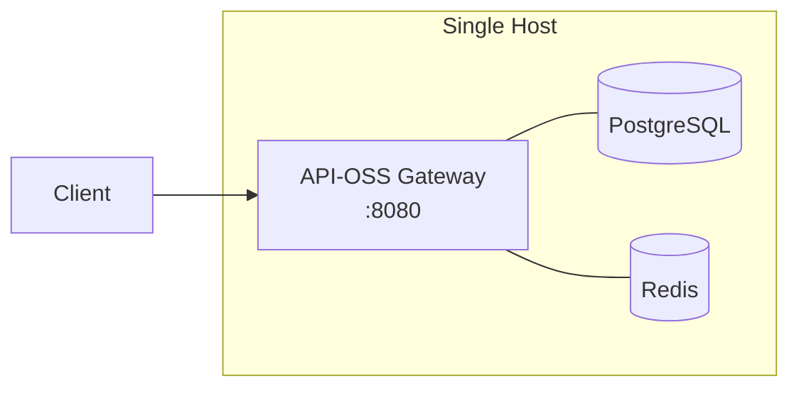

# Deployment Architecture

## Overview

This document describes deployment architectures for API-OSS across different environments: single-node, multi-node HA, multi-region, air-gapped, and hybrid cloud/on-prem.

## Deployment Models

### Single-Node (Development / Small Production)


│  ┌────────────────┐  │
│  │   api-oss      │  │
│  │   binary       │  │
│  ├────────────────┤  │
│  │   PostgreSQL   │  │
│  ├────────────────┤  │
│  │   Redis        │  │
│  ├────────────────┤  │
│  │   LLM Runtime  │  │
│  └────────────────┘  │
└──────────────────────┘
```

- All services on one machine
- Docker Compose or bare-metal
- Good for: dev, staging, low-traffic production (<1K RPS)

### Multi-Node HA (Production)

```
                    ┌──────────────┐
                    │  LB / Proxy  │
                    │  (haproxy)   │
                    └──────┬───────┘
                           │
          ┌────────────────┼────────────────┐
          │                │                │
    ┌─────▼─────┐   ┌─────▼─────┐   ┌─────▼─────┐
    │  api-oss  │   │  api-oss  │   │  api-oss  │
    │  node 1   │   │  node 2   │   │  node N   │
    └───────────┘   └───────────┘   └───────────┘
          │                │                │
          └────────────────┼────────────────┘
                           │
                    ┌──────▼──────┐
                    │   Redis     │
                    │   Cluster   │
                    └──────┬──────┘
                           │
                    ┌──────▼──────┐
                    │  PostgreSQL │
                    │  Primary    │
                    └──────┬──────┘
                           │
                    ┌──────▼──────┐
                    │  PostgreSQL │
                    │  Replica    │
                    └─────────────┘
```

- Stateless API nodes behind load balancer
- Redis cluster for rate limiting, sessions, cache
- PostgreSQL primary-replica for read scalability
- Good for: production, 1K-50K RPS

### Multi-Region (Global)

```
    US-East                  EU-West                  AP-Southeast
┌──────────────┐      ┌──────────────┐      ┌──────────────┐
│  LB → Nodes  │      │  LB → Nodes  │      │  LB → Nodes  │
│  Redis       │◄────►│  Redis       │◄────►│  Redis       │
│  PG Primary  │      │  PG Replica  │      │  PG Replica  │
└──────────────┘      └──────────────┘      └──────────────┘
        │                      │                      │
        └──────────────────────┼──────────────────────┘
                               │
                        ┌──────▼──────┐
                        │  Global DNS │
                        │  (Geo-route)│
                        └─────────────┘
```

- Geo-DNS routes users to nearest region
- Cross-region Redis replication for rate limits
- PostgreSQL streaming replication
- Good for: global SaaS, <5ms latency requirements

### Air-Gapped (Isolated)

```
┌─────────────────────────────────────────┐
│  Physical / Air-Gapped Network          │
│                                         │
│  ┌──────────┐  ┌──────────┐  ┌────────┐ │
│  │ api-oss  │  │ Local    │  │ Local  │ │
│  │ gateway  │  │ Registry │  │ Models │ │
│  └──────────┘  └──────────┘  └────────┘ │
│                                         │
│  No outbound internet access            │
│  All artifacts bundled / pre-loaded     │
└─────────────────────────────────────────┘
```

- Fully isolated network
- On-prem Docker registry with all images
- Pre-downloaded model weights
- Good for: defense, government, regulated industries

## Component Sizing

### API Gateway Nodes

| Profile | vCPU | RAM | Disk | Est. RPS |
|---|---|---|---|---|
| Small | 2 | 4 GB | 20 GB | 2,500 |
| Medium | 4 | 8 GB | 40 GB | 10,000 |
| Large | 8 | 16 GB | 80 GB | 25,000 |
| XL | 16 | 32 GB | 160 GB | 50,000+ |

### Database Sizing

| Connections | RAM | CPU | Storage |
|---|---|---|---|
| <100 | 4 GB | 2 | 50 GB |
| 100-500 | 8 GB | 4 | 200 GB |
| 500-2000 | 16 GB | 8 | 500 GB |
| 2000+ | 32 GB | 16 | 1 TB+ |

### Redis Sizing

| Cache Size | Memory | Connections |
|---|---|---|
| Small (<5K keys) | 1 GB | 100 |
| Medium (5K-50K) | 4 GB | 500 |
| Large (50K-500K) | 16 GB | 2000 |

## Network Requirements

### Ports

| Port | Service | Protocol | Access |
|---|---|---|---|
| 8080 | API Gateway (HTTP) | TCP | Public |
| 8443 | API Gateway (HTTPS) | TCP | Public |
| 3030 | WebSocket | TCP | Public |
| 5432 | PostgreSQL | TCP | Internal only |
| 6379 | Redis | TCP | Internal only |

### Firewall Rules

```
iptables -A INPUT -p tcp --dport 443 -j ACCEPT
iptables -A INPUT -p tcp --dport 8443 -j ACCEPT
iptables -A INPUT -p tcp --dport 3030 -j ACCEPT
iptables -A INPUT -p tcp --dport 5432 -s 10.0.0.0/8 -j ACCEPT
iptables -A INPUT -p tcp --dport 6379 -s 10.0.0.0/8 -j ACCEPT
```

## High Availability

### API Nodes

- Minimum 3 nodes for HA
- Deploy across availability zones
- Session affinity not required (stateless)

### Database

- Primary + 2 replicas minimum
- Automatic failover (Patroni, pg_auto_failover)
- Read replicas for reporting workloads

### Redis

- Redis Sentinel or Cluster mode
- Persistence enabled (AOF + RDB)
- At least 3 Sentinel nodes

## Next Steps

- [03 Security Architecture](03-security-architecture.md)
- [04 Data Flow Architecture](04-data-flow-architecture.md)
- [Deployment Guide](../deployment/01-deployment-overview.md)

## See Also

Related architecture, deployment, and operations documentation.

- [Deployment Guide](../deployment/01-overview.md)
- [Security Overview](../security/01-security-overview.md)
- [Operations Guide](../operations/01-operations-overview.md)
- [Self-Hosting Guide](../self-hosting/01-overview.md)
