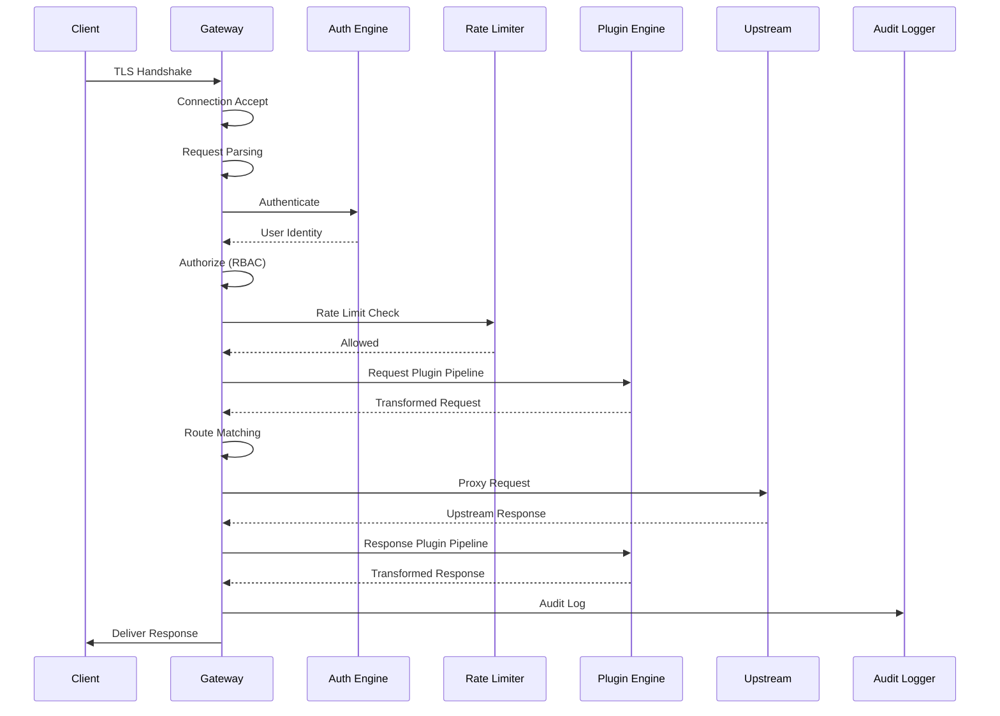
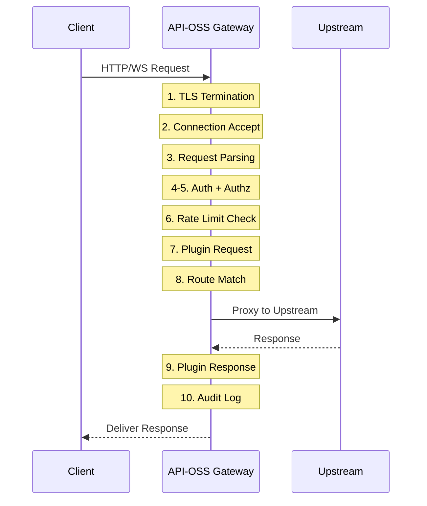

# Data Flow Architecture

## Overview

This document describes how data flows through API-OSS — from request ingress through plugin pipeline, upstream proxy, response processing, and audit logging.

## Request Lifecycle



## Step-by-Step Flow


  ▼
┌────────────────────────────────────┐
│ 1. TLS Termination                 │
│    - Certificate validation        │
│    - Cipher negotiation            │
└────────────────────────────────────┘
  │
  ▼
┌────────────────────────────────────┐
│ 2. Connection & Rate Limiting      │
│    - Connection limit check        │
│    - IP rate limit                 │
└────────────────────────────────────┘
  │
  ▼
┌────────────────────────────────────┐
│ 3. Request Parsing                 │
│    - Header validation             │
│    - Content-Type check            │
│    - Size limits                   │
└────────────────────────────────────┘
  │
  ▼
┌────────────────────────────────────┐
│ 4. Authentication                  │
│    - API key / JWT / OIDC          │
│    - MFA check                     │
└────────────────────────────────────┘
  │
  ▼
┌────────────────────────────────────┐
│ 5. Authorization                   │
│    - RBAC permission check         │
│    - ABAC condition eval           │
└────────────────────────────────────┘
  │
  ▼
┌────────────────────────────────────┐
│ 6. Request Plugin Pipeline         │
│    Plugin 1 → Plugin 2 → ...      │
│    (validation, transform, cache)  │
└────────────────────────────────────┘
  │
  ▼
┌────────────────────────────────────┐
│ 7. Route Matching                  │
│    - Path + method match           │
│    - Load balancer selection       │
└────────────────────────────────────┘
  │
  ▼
┌────────────────────────────────────┐
│ 8. Upstream Proxy                  │
│    - Connect to upstream           │
│    - Stream request body           │
│    - Handle timeout/retry          │
└────────────────────────────────────┘
  │
  ▼
┌────────────────────────────────────┐
│ 9. Response Plugin Pipeline        │
│    Plugin N → ... → Plugin 1      │
│    (transform, cache, log)         │
└────────────────────────────────────┘
  │
  ▼
┌────────────────────────────────────┐
│ 10. Response Delivery              │
│    - Compression                   │
│    - Headers (CORS, HSTS)          │
│    - Streaming (SSE/WS)            │
└────────────────────────────────────┘
  │
  ▼
┌────────────────────────────────────┐
│ 11. Audit & Logging                │
│    - Access log entry              │
│    - Audit event (if admin)        │
│    - Metrics update                │
└────────────────────────────────────┘
```

## Data Flow by Route Type

### Chat Completion (Non-Streaming)

```
POST /v1/chat → Gateway → Rate Limit → Auth → Route Match
     → Plugin Pipeline → Upstream: POST → llm-service
     → Response: JSON → Plugin Pipeline → Client 200
```

### Chat Completion (Streaming)

```
POST /v1/chat/stream → Gateway → Auth → Route Match
     → Upstream: POST (stream:true) → SSE stream
     → Gateway streams chunk-by-chunk → Client
```

### Embedding

```
POST /v1/embeddings → Gateway → Auth → Route Match
     → Upstream: POST embedding-service
     → Response: JSON vector array → Client 200
```

### WebSocket

```
ws://gateway/v1/ws → 101 Switching Protocols
     → Bidirectional: Client ↔ Plugin Pipeline ↔ WS Upstream
```

## Caching Strategy

### Cache Layers

| Layer | Location | Size | Eviction |
|---|---|---|---|
| L1: In-Memory | Gateway node | 100MB (configurable) | LRU |
| L2: Redis | Shared cluster | Configurable | LRU / TTL |
| L3: CDN | Edge network | N/A | TTL |

### Cache Invalidation

```
POST /v1/models/update → Gateway updates model list
     → Publish invalidation event to Redis
     → All nodes receive → clear local cache
```

## Admin Operations Data Flow

```
CLI / Dashboard → Admin API (port 8080)
     → Authentication (admin key + session)
     → Authorization (RBAC check)
     → Audit Event Created
     → Operation Executed
     → Audit Event Logged (immutable, hash-chained)
```

## Next Steps

- [05 Network Architecture](05-network-architecture.md)
- [06 Scaling Architecture](06-scaling-architecture.md)
- [Deployment Guide](../deployment/01-deployment-overview.md)

## See Also

Related architecture, deployment, and operations documentation.

- [Deployment Guide](../deployment/01-overview.md)
- [Security Overview](../security/01-security-overview.md)
- [Operations Guide](../operations/01-operations-overview.md)
- [Self-Hosting Guide](../self-hosting/01-overview.md)
