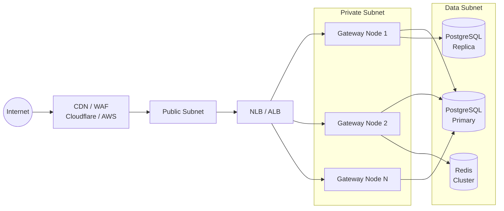

# Network Architecture

## Overview

This document describes the network topology, connectivity model, DNS routing, load balancing, and network security groups for API-OSS deployments.

## Network Topology

### Production Network


                                    Private Subnet
                                    ┌───────────────┐
                                    │  api-oss nodes │
                                    └───────┬───────┘
                                            │
                                      Data Subnet
                                    ┌────┬────┬──┐
                                    │ PG │RDS │… │
                                    └────┴────┴──┘
```

### Multi-Region Network

```
Route53 Geo-DNS
     │
     ├── us-east-1: NLB → api-oss nodes → PG Primary
     ├── eu-west-1: NLB → api-oss nodes → PG Replica
     └── ap-southeast-1: NLB → api-oss nodes → PG Replica
```

### Air-Gapped Network

```
┌─────────────────────────────────────────┐
│  Physical Security Perimeter             │
│                                          │
│  DMZ Zone          Internal Zone         │
│  ┌────────┐        ┌────────────────┐    │
│  │Reverse │        │ api-oss nodes  │    │
│  │ Proxy  │        │ Database       │    │
│  └────────┘        │ Models (local) │    │
│                    └────────────────┘    │
│  No outbound internet                    │
└──────────────────────────────────────────┘
```

## DNS Architecture

| Record | Type | Target |
|---|---|---|
| api.example.com | A | NLB IP (round-robin) |
| admin.api.example.com | A | NLB IP (internal) |
| ws.api.example.com | A | NLB IP (WebSocket) |

### Geo-Routing

```
us-east-1.api.example.com → us-east NLB
eu-west-1.api.example.com → eu-west NLB
api.example.com           → Route53 latency-based routing
```

## Load Balancing

### Layer 4 (TCP)

| Port | Service | Algorithm |
|---|---|---|
| 443 | HTTPS | least-connections |
| 3030 | WebSocket | least-connections |
| 8443 | Admin HTTPS | round-robin |

### Layer 7 (HTTP)

| Path | Target |
|---|---|
| /api/v1/* | Admin nodes |
| /v1/* | Proxy nodes |
| /ws | WebSocket nodes |

## Network Security Groups

```
sg-apioss-public:
  Inbound:  443, 3030/tcp from 0.0.0.0/0; 8443/tcp from admin CIDRs
  Outbound: 0.0.0.0/0 (for updates)

sg-apioss-private:
  Inbound:  8080, 3030/tcp from sg-apioss-public
  Outbound: 5432/tcp to sg-postgres; 6379/tcp to sg-redis

sg-postgres:
  Inbound:  5432/tcp from sg-apioss-private
```

## VPC Peering

```
VPC A (api-oss) ── VPC Peering ── VPC B (upstream services)
```

Cross-region: Transit Gateway with private IP routing.

## Bandwidth Planning

| Traffic Type | Est. Bandwidth |
|---|---|
| API requests | 100 KB/req avg |
| Streaming responses | 1-10 MB/stream |
| Embedding | 50 KB/req |
| WebSocket | 1-5 KB/msg |
| Database | 10-100 KB/query |
| Redis | 1-10 KB/op |

## Next Steps

- [06 Scaling Architecture](06-scaling-architecture.md)
- [07 Storage Architecture](07-storage-architecture.md)
- [Deployment Guide](../deployment/01-deployment-overview.md)

## See Also

Related architecture, deployment, and operations documentation.

- [Deployment Guide](../deployment/01-overview.md)
- [Security Overview](../security/01-security-overview.md)
- [Operations Guide](../operations/01-operations-overview.md)
- [Self-Hosting Guide](../self-hosting/01-overview.md)

```
.====================================================================.
!  Made in the UAE, Dubai #DubaiIt #Dubai #Dxb #SovereignAI          !
!  Made in The Emirates #Dubai_it                                    !
!                                                                    !
!  Lois-Kleinner Alpasan - The Anticloud 2026-                       !
!                                                                    !
!  0-1.gg ! GitHub ! LinkedIn ! DEV ! GH Pages                       !
!  HuggingFace ! Blog ! Tumblr ! Fandom ! Bluesky ! Mastodon          !
!  Zenodo ! Harvard Dataverse ! Internet Archive ! ORCID              !
!                                                                    !
!  Sovereign AI ! Local-First ! Privacy ! Zero Trust ! No Datacenter !
!  Air-Gapped ! Open Source ! Rust ! Hash Chain ! Single Binary      !
!  Offline LLM ! Crypto Ledger ! P2P ! Federated                     !
'===================================================================='
```

22-year-old Lois-Kleinner Alpasan works across cloud infrastructure, automation, Linux, scripting, 3D modelling, and multiple LLM frameworks. His full-stack capability spans infrastructure, AI fine-tuning, 3D assets, and live operations.

References:
1. Lois-Kleinner Zenodo: https://doi.org/10.5281/zenodo.20781790
2. Lois-Kleinner GitHub: https://github.com/kleinnner/Anticloud/tree/main/04-aioss-format
3. Lois-Kleinner Harvard DV: https://doi.org/10.7910/DVN/FDEBAB
4. Lois-Kleinner Internet Arc: https://archive.org/details/aioss-format
5. Lois-Kleinner ORCID: https://orcid.org/0009-0009-2233-6107
6. Lois-Kleinner DEV.to: https://dev.to/kleinner
7. Lois-Kleinner LinkedIn: https://linkedin.com/in/kleinner
8. Lois-Kleinner HuggingFace: https://huggingface.co/Anticloud
9. Lois-Kleinner Tumblr: https://anticloud.tumblr.com
10. Lois-Kleinner Mastodon: https://mastodon.social/@kleinner
11. Lois-Kleinner Bluesky: https://bsky.app/profile/kleinner.bsky.social
12. 0-1.gg: https://0-1.gg
