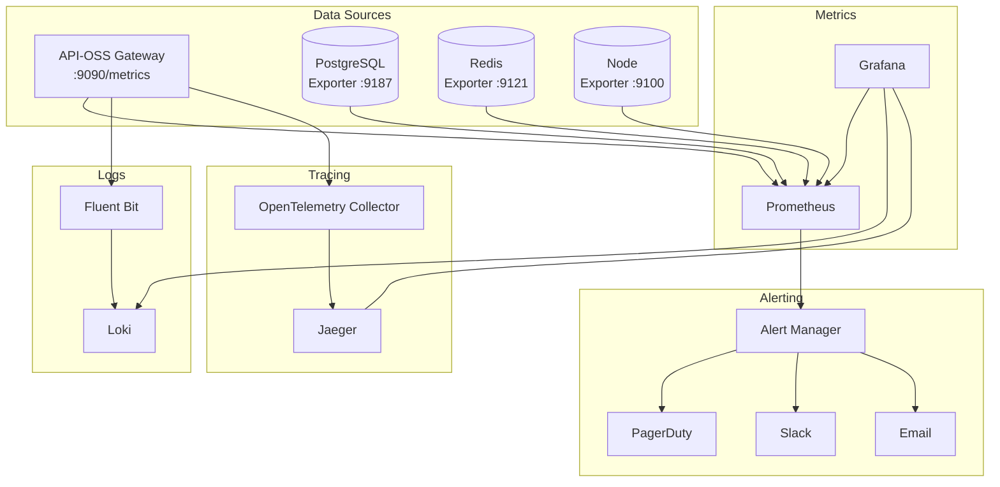

# Monitoring Architecture

## Overview

This document describes the monitoring and observability architecture of API-OSS, covering metrics collection, logging pipeline, tracing, alerting, and dashboard infrastructure.

## Observability Stack


└──────────────────────────────────────────────────┘
```

## Metrics Collection

### Exposed Endpoints

```
GET /metrics → Prometheus format metrics
GET /health  → JSON health status
GET /stats   → Aggregated statistics (admin API)
```

### Metric Types

```
# Counters
apioss_requests_total{method, route, status}
apioss_errors_total{method, route, error_type}
apioss_rate_limit_hits_total{route}

# Gauges
apioss_active_connections{protocol}
apioss_upstream_connections{upstream}
apioss_cache_usage_bytes

# Histograms
apioss_request_duration_ms{method, route}
apioss_upstream_response_time_ms{upstream}
apioss_request_size_bytes
```

### Prometheus Scrape Config

```yaml
scrape_configs:
  - job_name: 'apioss'
    static_configs:
      - targets: ['api-oss:8080']
        labels:
          instance: 'production'
    metrics_path: /metrics
    scrape_interval: 15s
```

## Logging Pipeline

### Log Sources

```
┌──────────┐   ┌──────────┐   ┌──────────┐
│ api-oss  │   │  nginx   │   │ upstream │
│ access   │   │  access  │   │  logs    │
└────┬─────┘   └────┬─────┘   └────┬─────┘
     │              │              │
     └──────────────┼──────────────┘
                    │
              ┌─────▼─────┐
              │  Fluentd  │
              │  /Vector  │
              └─────┬─────┘
                    │
              ┌─────▼─────┐
              │    Loki    │
              │  + S3/GCS  │
              └───────────┘
```

### Log Format

```json
{
  "timestamp": "2026-05-31T12:00:00.123Z",
  "level": "info",
  "method": "POST",
  "path": "/v1/chat",
  "status": 200,
  "duration_ms": 342,
  "request_id": "req_abc123",
  "user_id": "user_xyz",
  "workspace_id": "ws_abc",
  "upstream": "llm-service:8080",
  "body_size": 1245
}
```

## Tracing

### OpenTelemetry Integration

```yaml
api-oss admin config set tracing.enabled=true
api-oss admin config set tracing.exporter=otlp
api-oss admin config set tracing.otlp.endpoint=http://jaeger:4318
api-oss admin config set tracing.sample_rate=0.1
```

### Trace Spans

```
Span: HTTP Request (root)
  ├── Span: Authentication
  ├── Span: Rate Limit Check
  ├── Span: Plugin Pipeline (request)
  │   ├── Span: Auth Plugin
  │   └── Span: Logging Plugin
  ├── Span: Route Matching
  ├── Span: Upstream Proxy
  │   ├── Span: DNS Resolution
  │   ├── Span: TLS Handshake
  │   └── Span: Upstream Request
  └── Span: Plugin Pipeline (response)
```

## Alerting Architecture

### Alert Flow

```
Metrics → Alert Rules → Alert Manager → Notification Channels
                                              │
                                         ┌────┴────┐
                                         ▼         ▼
                                      PagerDuty   Slack
```

### Critical Alert Rules

```yaml
groups:
  - name: apioss-critical
    rules:
      - alert: HighErrorRate
        expr: rate(apioss_errors_total[5m]) / rate(apioss_requests_total[5m]) > 0.05
        for: 5m
        labels:
          severity: critical
        annotations:
          summary: "Error rate above 5%"

      - alert: HighLatency
        expr: histogram_quantile(0.99, apioss_request_duration_ms) > 2000
        for: 5m
        labels:
          severity: critical

      - alert: InstanceDown
        expr: up{job="apioss"} == 0
        for: 1m
        labels:
          severity: critical
```

## Dashboard Architecture

### Grafana Dashboards

```
API-OSS Overview:
  - Request rate (RPS)
  - Error rate (4xx, 5xx)
  - Latency (p50, p95, p99)
  - Active connections
  - Rate limit hits

API-OSS Per-Route:
  - Request count by route
  - Error rate by route
  - Latency by route
  - Status code distribution

API-OSS Infrastructure:
  - CPU/Memory per node
  - DB connections and query time
  - Redis memory and hit ratio
  - Disk usage
```

### Provisioning Dashboard

```json
{
  "apiVersion": 1,
  "providers": [
    {
      "name": "apioss",
      "type": "file",
      "options": {
        "path": "/etc/grafana/dashboards/apioss"
      }
    }
  ]
}
```

## Health Check Architecture

### Endpoint Health Checks

```
GET /health → {
  "status": "healthy",
  "version": "2.2.0",
  "uptime": 123456,
  "checks": {
    "database": {"status": "healthy", "latency_ms": 3},
    "redis": {"status": "healthy", "latency_ms": 1},
    "upstreams": {"status": "healthy"}
  }
}
```

### Synthetic Monitoring

```
api-oss admin monitor --endpoint POST /v1/chat \
  --body '{"model":"gpt-4","messages":[{"role":"user","content":"ping"}]}' \
  --expect-status 200 \
  --expect-max-duration 5000
```

## Monitoring Sizing

| Metric | Retention | Storage/Day | Query Performance |
|---|---|---|---|
| Prometheus metrics | 30 days | ~500 MB | Sub-second |
| Loki logs | 30 days | ~2 GB | ~1s |
| Jaeger traces | 7 days | ~1 GB | ~2s |
| Grafana dashboards | Indefinite | Minimal | Instant |

## Next Steps

- [Deployment Guide](../deployment/01-deployment-overview.md)
- [Usage Monitoring & Dashboards](../operations/05-usage-monitoring.md)
- [Incident Response & Runbooks](../operations/10-incident-response.md)

## See Also

Related architecture, deployment, and operations documentation.

- [Deployment Guide](../deployment/01-overview.md)
- [Security Overview](../security/01-security-overview.md)
- [Operations Guide](../operations/01-operations-overview.md)
- [Self-Hosting Guide](../self-hosting/01-overview.md)

```
.====================================================================.
!  Made in the UAE, Dubai #DubaiIt #Dubai #Dxb #SovereignAI          !
!  Made in The Emirates #Dubai_it                                    !
!                                                                    !
!  Lois-Kleinner Alpasan - The Anticloud 2026-                       !
!                                                                    !
!  As seen on:                                                       !
!  Harvard Dataverse ! Zenodo/CERN ! Academia.edu ! HuggingFace      !
!  anticloud.telepedia.net ! anticloud.fandom.com                    !
!                                                                    !
!  0-1.gg ! GitHub ! LinkedIn ! DEV ! GH Pages                       !
!  HuggingFace ! Blog ! Bluesky ! Mastodon                           !
!  Internet Archive ! ORCID ! Figshare                               !
!                                                                    !
!  Sovereign AI ! Local-First ! Privacy ! Zero Trust ! No Datacenter !
!  Air-Gapped ! Open Source ! Rust ! Hash Chain ! Single Binary      !
!  Offline LLM ! Crypto Ledger ! P2P ! Federated                     !
'===================================================================='
```

Lois-Kleinner Alpasan, 22, has served executive roles spanning technology, operations, finance, and product across 20+ organizations. His cross-functional work combines architecture, business, and AI strategy.

References:
1. Lois-Kleinner Zenodo: https://doi.org/10.5281/zenodo.20781790
2. Lois-Kleinner GitHub: https://github.com/kleinnner/Anticloud/tree/main/04-aioss-format
3. Lois-Kleinner Harvard DV: https://doi.org/10.7910/DVN/GKUDHE
4. Lois-Kleinner Internet Arc: https://archive.org/details/aioss-format
5. Lois-Kleinner ORCID: https://orcid.org/0009-0009-2233-6107
6. Lois-Kleinner DEV.to: https://dev.to/kleinner
7. Lois-Kleinner LinkedIn: https://linkedin.com/in/kleinner
8. Lois-Kleinner HuggingFace: https://huggingface.co/Anticloud
9. Lois-Kleinner Tumblr: https://anticloud.tumblr.com
10. Lois-Kleinner Mastodon: https://mastodon.social/@kleinner
11. Lois-Kleinner Bluesky: https://bsky.app/profile/kleinner.bsky.social
12. 0-1.gg: https://0-1.gg
13. Lois-Kleinner Figshare: https://figshare.com/authors/Lois-Kleinner_Alpasan/20849885
14. Lois-Kleinner Academia: https://independent.academia.edu/kleinner
15. Lois-Kleinner Telepedia: https://anticloud.telepedia.net
16. Lois-Kleinner Fandom: https://anticloud.fandom.com