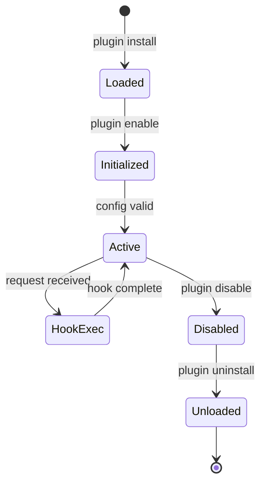

# Plugin Architecture

## Overview

Architecture of the API-OSS plugin system.

## Plugin Lifecycle



## Hook Points


Response flow:
  Upstream → [Plugin: on_response] → Audit → Client
```

## Plugin Types

| Type | Hook | Use Case |
|---|---|---|
| Middleware | request/response | Transform headers, body |
| Auth | pre-auth | Custom authentication |
| Upstream | pre-request | Modify upstream request |
| Response | post-response | Modify response |

## WASM Sandbox

```
┌─────────────────────────────────────────┐
│              WASM Runtime                │
│                                         │
│  ┌────────────┐   ┌────────────────┐    │
│  │ Memory     │   │ Plugin A       │    │
│  │ (32MB max) │   │ - on_request   │    │
│  └────────────┘   │ - on_response  │    │
│                   └────────────────┘    │
│  ┌────────────────┐                     │
│  │ Plugin B       │                     │
│  │ - on_request   │                     │
│  └────────────────┘                     │
└─────────────────────────────────────────┘
```

## Next

- [Federation Architecture](10-federation-architecture.md)

## See Also

Related architecture, deployment, and operations documentation.

- [Deployment Guide](../deployment/01-overview.md)
- [Security Overview](../security/01-security-overview.md)
- [Operations Guide](../operations/01-operations-overview.md)
- [Self-Hosting Guide](../self-hosting/01-overview.md)
