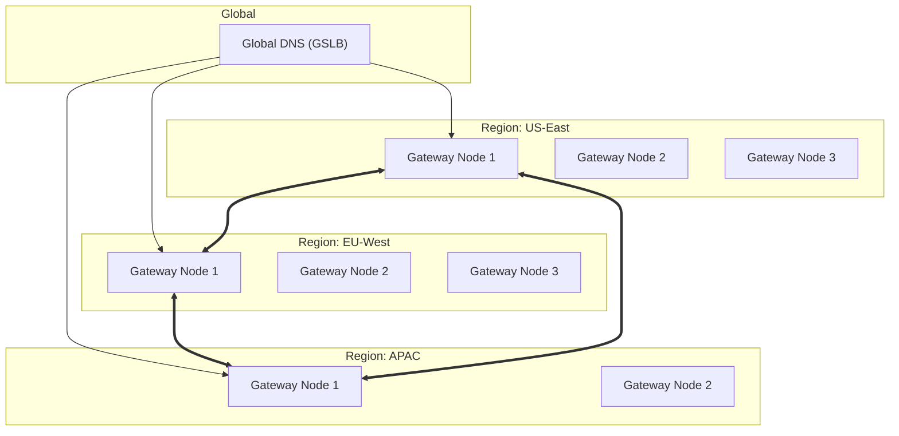

# Federation Architecture

## Overview

Architecture of the API-OSS P2P federation mesh.

## Topology



## Sync Protocols

| Sync Type | Protocol | Consistency | Latency |
|---|---|---|---|
| Route config | CRDT | Eventual | <5s |
| Rate limit state | Gossip | Strong | <100ms |
| Audit log | Append-only | Strong | <10s |
| Peer discovery | Gossip | Eventual | <30s |

## Conflict Resolution

```
Route config: Last-write-wins (timestamp)
Rate limits: CRDT merge (max of counters)
Audit logs: Append-only (no conflicts)
Peers: Latest heartbeat wins
```

## Next

- [Edge Deployment Architecture](11-edge-deployment-architecture.md)

## See Also

Related architecture, deployment, and operations documentation.

- [Deployment Guide](../deployment/01-overview.md)
- [Security Overview](../security/01-security-overview.md)
- [Operations Guide](../operations/01-operations-overview.md)
- [Self-Hosting Guide](../self-hosting/01-overview.md)
