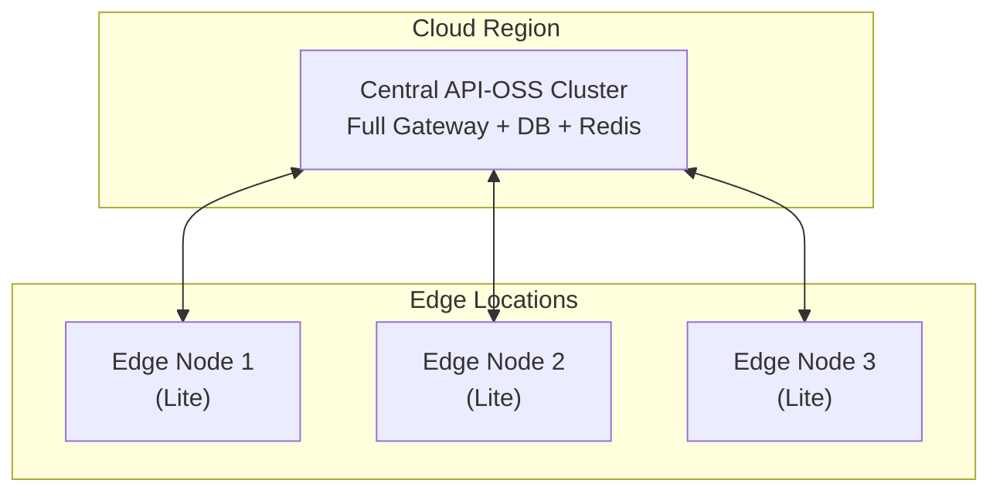

# Edge Deployment Architecture

## Overview

Architecture for deploying API-OSS at the edge.

## Edge Topology


```

## Edge Node Specs

```yaml
edge_node:
  cpu: 2 cores
  memory: 2 GB
  storage: 10 GB
  network: 100 Mbps
  capabilities:
    - request_routing
    - caching
    - offline_queue
    - local_auth
```

## Offline Mode

```yaml
offline:
  enabled: true
  cache:
    strategy: lru
    capacity: 1000
  queue:
    max_size: 10000
    retry_interval: 30s
    max_retries: 10
  sync:
    interval: 60s
    batch_size: 100
```

## Next

- [DR Architecture](12-disaster-recovery-architecture.md)

## See Also

Related architecture, deployment, and operations documentation.

- [Deployment Guide](../deployment/01-overview.md)
- [Security Overview](../security/01-security-overview.md)
- [Operations Guide](../operations/01-operations-overview.md)
- [Self-Hosting Guide](../self-hosting/01-overview.md)
