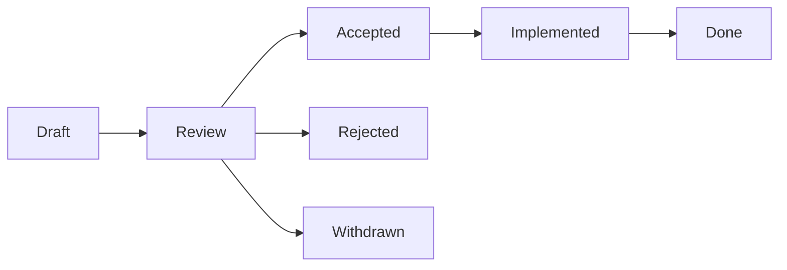

# RFC Process

## Overview

The RFC (Request for Comments) process for significant API-OSS changes.

## When to Write an RFC

- New features with cross-cutting impact
- Architecture changes
- Breaking API changes
- New plugin system features
- Protocol changes

## RFC Template

```markdown
# RFC-NNN: Title

## Meta
- Authors: @user
- Status: Draft → Review → Accepted/Rejected
- Date: 2025-05-31

## Summary
Brief description of the proposal.

## Motivation
Why this change is needed.

## Design
Detailed technical design.

## Alternatives
Other approaches considered.

## Migration
How existing users will migrate.

## Drawbacks
Known disadvantages.

## Unresolved Questions
Open issues to resolve.
```

## Lifecycle



## Timeline

```
Day 1: Submit RFC as PR (markdown in docs/rfcs/)
Day 7: Review period ends
Day 14: TSC vote
If accepted: Implementation begins
```

## Numbering

```
docs/governance/rfcs/
├── 001-plugins-system.md
├── 002-multi-tenant.md
└── 003-federation.md
```

## Next

- [03 Architecture Decision Records](03-architecture-decision-records.md)

## See Also

Related governance, contributing, and security documentation.

- [Governance Overview](../governance/01-governance-overview.md)
- [Contributing Guide](../contributing/01-contributing-overview.md)
- [Code of Conduct](../governance/06-code-of-conduct-enforcement.md)
- [Security Advisory](../governance/08-security-advisory-process.md)
