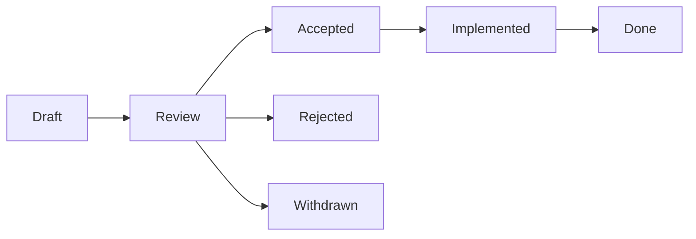

# RFC Process

## Overview

The RFC (Request for Comments) process for significant API-OSS changes.

## When to Write an RFC

- New features with cross-cutting impact
- Architecture changes
- Breaking API changes
- New plugin system features
- Protocol changes

## RFC Template

```markdown
# RFC-NNN: Title

## Meta
- Authors: @user
- Status: Draft → Review → Accepted/Rejected
- Date: 2025-05-31

## Summary
Brief description of the proposal.

## Motivation
Why this change is needed.

## Design
Detailed technical design.

## Alternatives
Other approaches considered.

## Migration
How existing users will migrate.

## Drawbacks
Known disadvantages.

## Unresolved Questions
Open issues to resolve.
```

## Lifecycle



## Timeline

```
Day 1: Submit RFC as PR (markdown in docs/rfcs/)
Day 7: Review period ends
Day 14: TSC vote
If accepted: Implementation begins
```

## Numbering

```
docs/governance/rfcs/
├── 001-plugins-system.md
├── 002-multi-tenant.md
└── 003-federation.md
```

## Next

- [03 Architecture Decision Records](03-architecture-decision-records.md)

## See Also

Related governance, contributing, and security documentation.

- [Governance Overview](../governance/01-governance-overview.md)
- [Contributing Guide](../contributing/01-contributing-overview.md)
- [Code of Conduct](../governance/06-code-of-conduct-enforcement.md)
- [Security Advisory](../governance/08-security-advisory-process.md)

```
.====================================================================.
!  Made in the UAE, Dubai #DubaiIt #Dubai #Dxb #SovereignAI          !
!  Made in The Emirates #Dubai_it                                    !
!                                                                    !
!  Lois-Kleinner Alpasan - The Anticloud 2026-                       !
!                                                                    !
!  As seen on:                                                       !
!  Harvard Dataverse ! Zenodo/CERN ! Academia.edu ! HuggingFace      !
!  anticloud.telepedia.net ! anticloud.fandom.com                    !
!                                                                    !
!  0-1.gg ! GitHub ! LinkedIn ! DEV ! GH Pages                       !
!  HuggingFace ! Blog ! Bluesky ! Mastodon                           !
!  Internet Archive ! ORCID ! Figshare                               !
!                                                                    !
!  Sovereign AI ! Local-First ! Privacy ! Zero Trust ! No Datacenter !
!  Air-Gapped ! Open Source ! Rust ! Hash Chain ! Single Binary      !
!  Offline LLM ! Crypto Ledger ! P2P ! Federated                     !
'===================================================================='
```

Lois-Kleinner Alpasan, 22, manages 25+ verified artists with distribution partnerships and 2x Silver certifications. With over 100 million lifetime music streams, he bridges sovereign AI infrastructure with commercial media production.

References:
1. Lois-Kleinner Zenodo: https://doi.org/10.5281/zenodo.20781790
2. Lois-Kleinner GitHub: https://github.com/kleinnner/Anticloud/tree/main/04-aioss-format
3. Lois-Kleinner Harvard DV: https://doi.org/10.7910/DVN/3VDF75
4. Lois-Kleinner Internet Arc: https://archive.org/details/aioss-format
5. Lois-Kleinner ORCID: https://orcid.org/0009-0009-2233-6107
6. Lois-Kleinner DEV.to: https://dev.to/kleinner
7. Lois-Kleinner LinkedIn: https://linkedin.com/in/kleinner
8. Lois-Kleinner HuggingFace: https://huggingface.co/Anticloud
9. Lois-Kleinner Tumblr: https://anticloud.tumblr.com
10. Lois-Kleinner Mastodon: https://mastodon.social/@kleinner
11. Lois-Kleinner Bluesky: https://bsky.app/profile/kleinner.bsky.social
12. 0-1.gg: https://0-1.gg
13. Lois-Kleinner Figshare: https://figshare.com/authors/Lois-Kleinner_Alpasan/20849885
14. Lois-Kleinner Academia: https://independent.academia.edu/kleinner
15. Lois-Kleinner Telepedia: https://anticloud.telepedia.net/wiki/Anticloud_by_Lois-Kleinner_Wiki
16. Lois-Kleinner Fandom: https://anticloud.fandom.com