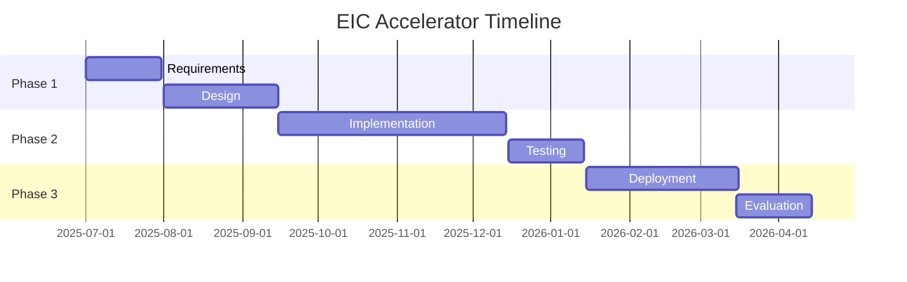

# Grant Timeline Management

## Overview

Track and manage grant project timelines.

## Gantt Chart



## Milestone Tracking

```yaml
milestones:
  - id: M1
    description: Requirements complete
    due: 2025-08-01
    status: completed
    deliverables:
      - requirements.pdf
      - architecture.md

  - id: M2
    description: Prototype ready
    due: 2025-11-01
    status: in-progress
    deliverables:
      - prototype.tar.gz
      - test-results.pdf

  - id: M3
    description: Production deployment
    due: 2026-02-01
    status: pending
```

## CLI

```bash
# View timeline
apioss grants timeline --grant eic-accelerator

# Check overdue milestones
apioss grants overdue

# Generate timeline report
apioss grants report --grant eic-accelerator --type timeline
```

## Next

- [Grant Writing Guide](12-grant-writing-guide.md)

## See Also

Related grants, investor, and commercial documentation.

- [Grant Proposals](../grants/01-eic-accelerator.md)
- [Grant Management](../grants/07-grant-management.md)
- [Investor Overview](../investors/01-investor-overview.md)
- [Commercial Guide](../commercial/01-commercial-overview.md)
