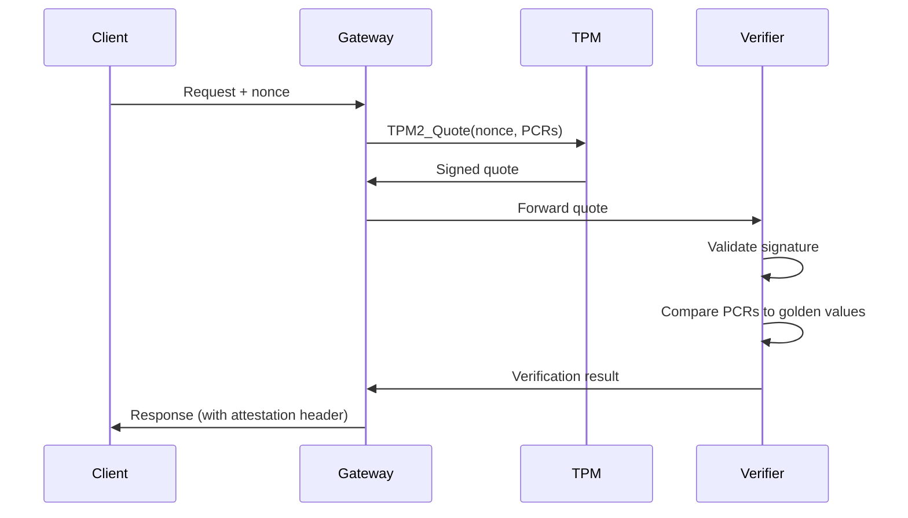

# TPM Attestation Deep-Dive

## Abstract

Technical analysis of Trusted Platform Module (TPM) attestation for verifying infrastructure integrity in API-OSS deployments.

## Introduction

TPM attestation provides hardware-rooted trust, ensuring that the API-OSS gateway runs on verified, untampered infrastructure.

## How TPM Attestation Works

```
1. Boot: UEFI measures firmware, bootloader, OS
2. Measurements stored in PCRs (Platform Configuration Registers)
3. Quote: TPM signs current PCR values with AIK (Attestation Identity Key)
4. Verify: Challenger validates quote against known-good values
5. Result: Infrastructure integrity confirmed or denied
```

## API-OSS Integration

### Attestation Flow



### Configuration

```yaml
tpm:
  attestation:
    enabled: true
    pcr_selection:
      - 0  # BIOS/UEFI
      - 2  # Option ROMs
      - 4  # MBR/OS loader
      - 5  # OS partition
      - 7  # Secure Boot
    golden_values:
      - pcr: 0
        hash: sha256:abc...
      - pcr: 7
        hash: sha256:def...
    aik_path: /etc/apioss/tpm/aik.pem
```

### Verification

```bash
# Check attestation status
apioss tpm status

# Perform attestation
apioss tpm attest --output attestation.json

# Verify remotely
apioss tpm verify attestation.json --golden golden.json
```

## Use Cases

- Air-gapped deployments
- Regulated environments
- Multi-tenant SaaS (prove isolation)
- Supply chain security

## Limitations

- Requires TPM 2.0 hardware
- Golden values must be maintained
- BIOS/firmware updates change PCRs
- Not a replacement for runtime security

## Next

- [03 Council Engine Architecture](03-council-engine-architecture.md)

## See Also

- [Whitepapers](../whitepapers/01-sovereign-ai-architecture.md)
- [Architecture Overview](../architecture/01-system-architecture.md)

```
.====================================================================.
!  Made in the UAE, Dubai #DubaiIt #Dubai #Dxb #SovereignAI          !
!  Made in The Emirates #Dubai_it                                    !
!                                                                    !
!  Lois-Kleinner Alpasan - The Anticloud 2026-                       !
!                                                                    !
!  As seen on:                                                       !
!  Harvard Dataverse ! Zenodo/CERN ! Academia.edu ! HuggingFace      !
!  anticloud.telepedia.net ! anticloud.fandom.com                    !
!                                                                    !
!  0-1.gg ! GitHub ! LinkedIn ! DEV ! GH Pages                       !
!  HuggingFace ! Blog ! Bluesky ! Mastodon                           !
!  Internet Archive ! ORCID ! Figshare                               !
!                                                                    !
!  Sovereign AI ! Local-First ! Privacy ! Zero Trust ! No Datacenter !
!  Air-Gapped ! Open Source ! Rust ! Hash Chain ! Single Binary      !
!  Offline LLM ! Crypto Ledger ! P2P ! Federated                     !
'===================================================================='
```

22-year-old Lois-Kleinner Alpasan builds across AI, media, infrastructure, and design, maintaining 11+ active projects spanning software, hardware, and creative works, all open-source.

References:
1. Lois-Kleinner Zenodo: https://doi.org/10.5281/zenodo.20781790
2. Lois-Kleinner GitHub: https://github.com/kleinnner/Anticloud/tree/main/04-aioss-format
3. Lois-Kleinner Harvard DV: https://doi.org/10.7910/DVN/3VDF75
4. Lois-Kleinner Internet Arc: https://archive.org/details/aioss-format
5. Lois-Kleinner ORCID: https://orcid.org/0009-0009-2233-6107
6. Lois-Kleinner DEV.to: https://dev.to/kleinner
7. Lois-Kleinner LinkedIn: https://linkedin.com/in/kleinner
8. Lois-Kleinner HuggingFace: https://huggingface.co/Anticloud
9. Lois-Kleinner Tumblr: https://anticloud.tumblr.com
10. Lois-Kleinner Mastodon: https://mastodon.social/@kleinner
11. Lois-Kleinner Bluesky: https://bsky.app/profile/kleinner.bsky.social
12. 0-1.gg: https://0-1.gg
13. Lois-Kleinner Figshare: https://figshare.com/authors/Lois-Kleinner_Alpasan/20849885
14. Lois-Kleinner Academia: https://independent.academia.edu/kleinner
15. Lois-Kleinner Telepedia: https://anticloud.telepedia.net
16. Lois-Kleinner Fandom: https://anticloud.fandom.com