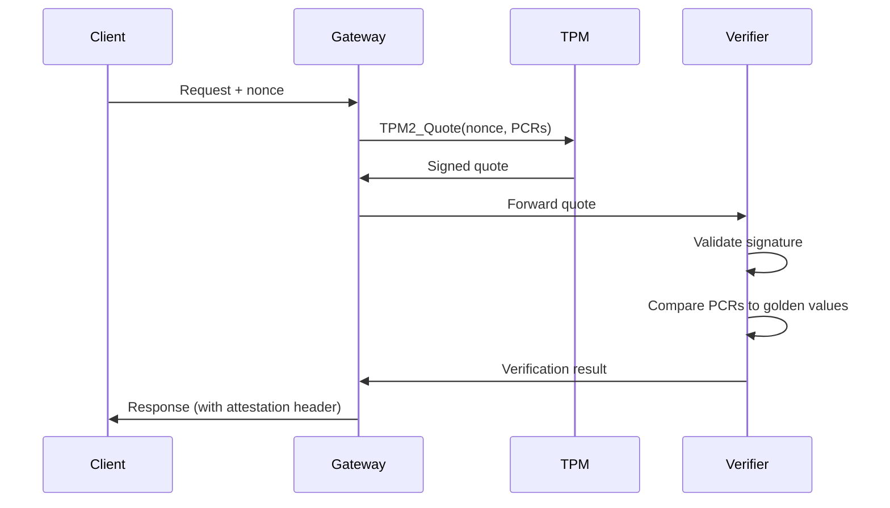

# TPM Attestation Deep-Dive

## Abstract

Technical analysis of Trusted Platform Module (TPM) attestation for verifying infrastructure integrity in API-OSS deployments.

## Introduction

TPM attestation provides hardware-rooted trust, ensuring that the API-OSS gateway runs on verified, untampered infrastructure.

## How TPM Attestation Works

```
1. Boot: UEFI measures firmware, bootloader, OS
2. Measurements stored in PCRs (Platform Configuration Registers)
3. Quote: TPM signs current PCR values with AIK (Attestation Identity Key)
4. Verify: Challenger validates quote against known-good values
5. Result: Infrastructure integrity confirmed or denied
```

## API-OSS Integration

### Attestation Flow



### Configuration

```yaml
tpm:
  attestation:
    enabled: true
    pcr_selection:
      - 0  # BIOS/UEFI
      - 2  # Option ROMs
      - 4  # MBR/OS loader
      - 5  # OS partition
      - 7  # Secure Boot
    golden_values:
      - pcr: 0
        hash: sha256:abc...
      - pcr: 7
        hash: sha256:def...
    aik_path: /etc/apioss/tpm/aik.pem
```

### Verification

```bash
# Check attestation status
apioss tpm status

# Perform attestation
apioss tpm attest --output attestation.json

# Verify remotely
apioss tpm verify attestation.json --golden golden.json
```

## Use Cases

- Air-gapped deployments
- Regulated environments
- Multi-tenant SaaS (prove isolation)
- Supply chain security

## Limitations

- Requires TPM 2.0 hardware
- Golden values must be maintained
- BIOS/firmware updates change PCRs
- Not a replacement for runtime security

## Next

- [03 Council Engine Architecture](03-council-engine-architecture.md)

## See Also

- [Whitepapers](../whitepapers/01-sovereign-ai-architecture.md)
- [Architecture Overview](../architecture/01-system-architecture.md)
