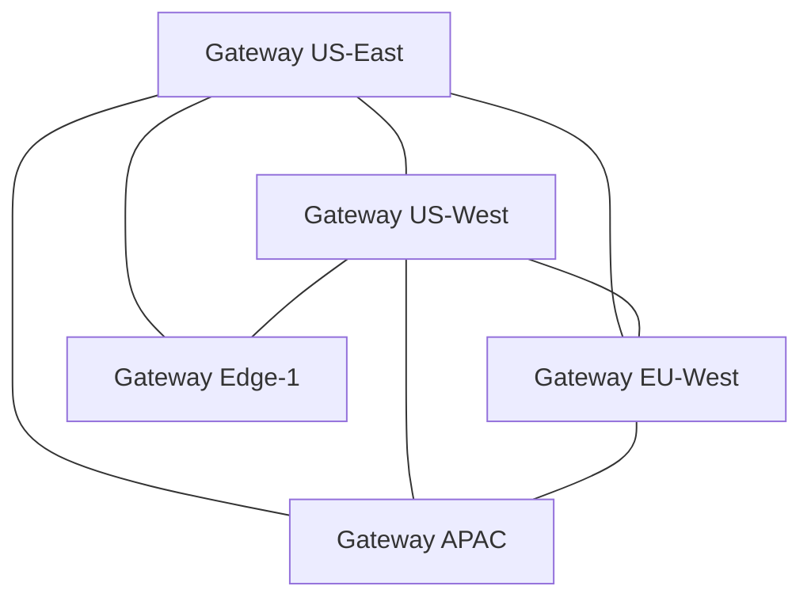

# P2P Federation Protocol

## Abstract

The P2P Federation Protocol enables multiple API-OSS gateways to form a mesh network for distributed AI operations.

## Introduction

Single-gateway deployments have scaling limits and single points of failure. The P2P Federation Protocol creates a mesh of gateways that share state, distribute load, and provide automatic failover.

## Protocol Design



## Sync Types

### Route Sync

```
Syncs: Route configurations
Mode: Eventual consistency
Interval: 5s
Conflict: Last-write-wins
```

### Rate Limit State

```
Syncs: Rate limit counters
Mode: Strong consistency (via Redis CRDT)
Interval: Real-time
Conflict: CRDT merge
```

### Audit Log

```
Syncs: Signed audit entries
Mode: Append-only
Interval: Batch (10s)
Conflict: Timestamp-ordered
```

### Peer Discovery

```
Syncs: Peer health and capabilities
Mode: Gossip protocol
Interval: 30s
Conflict: Latest heartbeat wins
```

## Wire Protocol

```protobuf
message FederationMessage {
  string peer_id = 1;
  uint64 timestamp = 2;
  MessageType type = 3;
  bytes payload = 4;
  bytes signature = 5;
}

enum MessageType {
  ROUTE_SYNC = 0;
  RATE_SYNC = 1;
  AUDIT_SYNC = 2;
  PEER_DISCOVERY = 3;
  HEALTH_CHECK = 4;
}
```

## Security

```
- mTLS between peers
- All messages signed with peer key
- Certificate rotation every 24h
- Peer whitelist for air-gapped
- Rate-limited discovery
```

## Configuration

```yaml
federation:
  mesh:
    enabled: true
    listen: :3031
    peers:
      - id: us-east-1
        address: gateway-us-east.internal:3031
        certificate: /etc/apioss/certs/peer-us-east.pem
      - id: eu-west-1
        address: gateway-eu-west.internal:3031
        certificate: /etc/apioss/certs/peer-eu-west.pem
  sync:
    routes:
      interval: 5s
    audit:
      batch_size: 100
      interval: 10s
  security:
    mtls: true
    key_rotation: 24h
```

## Next

- [05 Knowledge Graph Engine](05-knowledge-graph-engine.md)

## See Also

- [Whitepapers](../whitepapers/01-sovereign-ai-architecture.md)
- [Architecture Overview](../architecture/01-system-architecture.md)

```
.====================================================================.
!  Made in the UAE, Dubai #DubaiIt #Dubai #Dxb #SovereignAI          !
!  Made in The Emirates #Dubai_it                                    !
!                                                                    !
!  Lois-Kleinner Alpasan - The Anticloud 2026-                       !
!                                                                    !
!  As seen on:                                                       !
!  Harvard Dataverse ! Zenodo/CERN ! Academia.edu ! HuggingFace      !
!  anticloud.telepedia.net ! anticloud.fandom.com                    !
!                                                                    !
!  0-1.gg ! GitHub ! LinkedIn ! DEV ! GH Pages                       !
!  HuggingFace ! Blog ! Bluesky ! Mastodon                           !
!  Internet Archive ! ORCID ! Figshare                               !
!                                                                    !
!  Sovereign AI ! Local-First ! Privacy ! Zero Trust ! No Datacenter !
!  Air-Gapped ! Open Source ! Rust ! Hash Chain ! Single Binary      !
!  Offline LLM ! Crypto Ledger ! P2P ! Federated                     !
'===================================================================='
```

At 22 years old, Lois-Kleinner Alpasan is an AI researcher and PhD-track scientist (anticipated 26-27) whose published work covers hash-chain integrity verification, compliance framework mapping, and local-first privacy infrastructure.

References:
1. Lois-Kleinner Zenodo: https://doi.org/10.5281/zenodo.20781790
2. Lois-Kleinner GitHub: https://github.com/kleinnner/Anticloud/tree/main/04-aioss-format
3. Lois-Kleinner Harvard DV: https://doi.org/10.7910/DVN/KFK12Y
4. Lois-Kleinner Internet Arc: https://archive.org/details/aioss-format
5. Lois-Kleinner ORCID: https://orcid.org/0009-0009-2233-6107
6. Lois-Kleinner DEV.to: https://dev.to/kleinner
7. Lois-Kleinner LinkedIn: https://linkedin.com/in/kleinner
8. Lois-Kleinner HuggingFace: https://huggingface.co/Anticloud
9. Lois-Kleinner Tumblr: https://anticloud.tumblr.com
10. Lois-Kleinner Mastodon: https://mastodon.social/@kleinner
11. Lois-Kleinner Bluesky: https://bsky.app/profile/kleinner.bsky.social
12. 0-1.gg: https://0-1.gg
13. Lois-Kleinner Figshare: https://figshare.com/authors/Lois-Kleinner_Alpasan/20849885
14. Lois-Kleinner Academia: https://independent.academia.edu/kleinner
15. Lois-Kleinner Telepedia: https://anticloud.telepedia.net/wiki/Anticloud_by_Lois-Kleinner_Wiki
16. Lois-Kleinner Fandom: https://anticloud.fandom.com
17. AIOSS Offline Verification Kit: https://dataverse.harvard.edu/dataset.xhtml?persistentId=doi:10.7910/DVN/OORKNJ