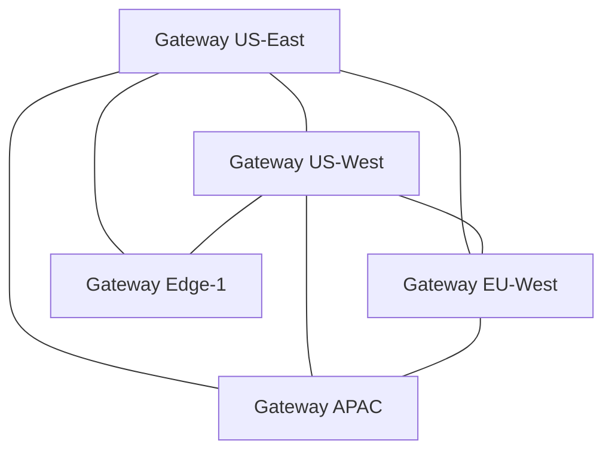

# P2P Federation Protocol

## Abstract

The P2P Federation Protocol enables multiple API-OSS gateways to form a mesh network for distributed AI operations.

## Introduction

Single-gateway deployments have scaling limits and single points of failure. The P2P Federation Protocol creates a mesh of gateways that share state, distribute load, and provide automatic failover.

## Protocol Design



## Sync Types

### Route Sync

```
Syncs: Route configurations
Mode: Eventual consistency
Interval: 5s
Conflict: Last-write-wins
```

### Rate Limit State

```
Syncs: Rate limit counters
Mode: Strong consistency (via Redis CRDT)
Interval: Real-time
Conflict: CRDT merge
```

### Audit Log

```
Syncs: Signed audit entries
Mode: Append-only
Interval: Batch (10s)
Conflict: Timestamp-ordered
```

### Peer Discovery

```
Syncs: Peer health and capabilities
Mode: Gossip protocol
Interval: 30s
Conflict: Latest heartbeat wins
```

## Wire Protocol

```protobuf
message FederationMessage {
  string peer_id = 1;
  uint64 timestamp = 2;
  MessageType type = 3;
  bytes payload = 4;
  bytes signature = 5;
}

enum MessageType {
  ROUTE_SYNC = 0;
  RATE_SYNC = 1;
  AUDIT_SYNC = 2;
  PEER_DISCOVERY = 3;
  HEALTH_CHECK = 4;
}
```

## Security

```
- mTLS between peers
- All messages signed with peer key
- Certificate rotation every 24h
- Peer whitelist for air-gapped
- Rate-limited discovery
```

## Configuration

```yaml
federation:
  mesh:
    enabled: true
    listen: :3031
    peers:
      - id: us-east-1
        address: gateway-us-east.internal:3031
        certificate: /etc/apioss/certs/peer-us-east.pem
      - id: eu-west-1
        address: gateway-eu-west.internal:3031
        certificate: /etc/apioss/certs/peer-eu-west.pem
  sync:
    routes:
      interval: 5s
    audit:
      batch_size: 100
      interval: 10s
  security:
    mtls: true
    key_rotation: 24h
```

## Next

- [05 Knowledge Graph Engine](05-knowledge-graph-engine.md)

## See Also

- [Whitepapers](../whitepapers/01-sovereign-ai-architecture.md)
- [Architecture Overview](../architecture/01-system-architecture.md)
