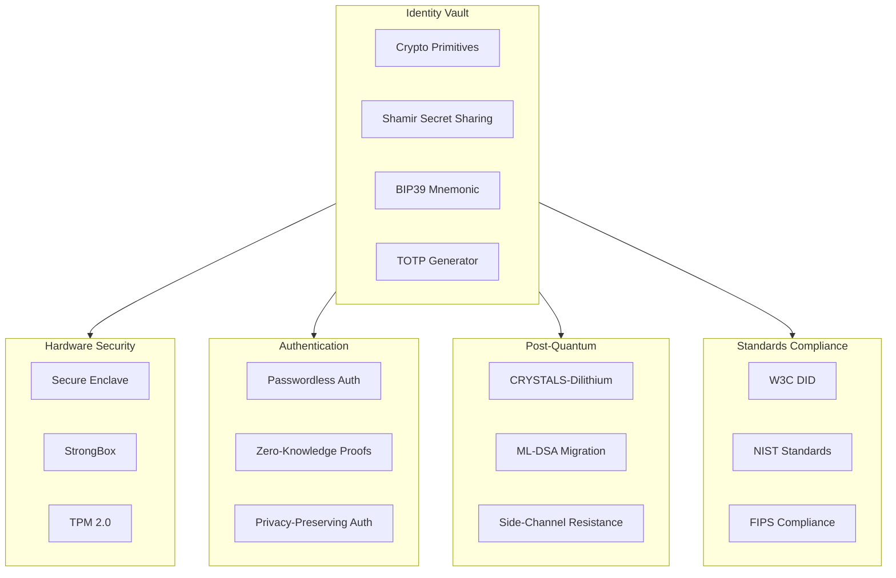

# 07 — MF+SO Sovereign Identity & Authentication Vault

[](https://doi.org/10.7910/DVN/GKUDHE) [](https://doi.org/10.7910/DVN/GDLO0L)

**Multi-Factor + Sign On** — A cryptographic authentication and identity management system with defense-in-depth: AES-256-GCM, PBKDF2-SHA256, SHA3-256, HMAC, Ed25519, Shamir's secret sharing, and TPM/Secure Enclave/StrongBox hardware-backed key storage.



## Documentation

| Category | Docs | Description |
|----------|------|-------------|
| [Feature Papers](./feature-papers/) | 6 | Business requirements and encryption standards |
| [Data Safety & Security](./data-safety-security-sovereignty/) | 8 | AIOSS ledger integrity, backup integrity, cryptographic guarantees |
| [No Black Boxes](./no-black-boxes/) | 8 | Open source philosophy, transparency reports |
| [No More Silicon](./no-more-silicon/) | 6 | Hardware minimalism, edge computing |
| [Privacy](./privacy/) | 8 | Privacy policy, GDPR/CCPA compliance |
| [Compliance](./compliance/) | 8 | SOC2, GDPR, HIPAA, FedRAMP |
| [CSR](./csr/) | 7 | Environmental impact, ethical AI |
| [FAQ](./faq/) | 8 | Frequently asked questions |
| [Help & Bugs](./help-bugs/) | 7 | Troubleshooting |
| [How To Use Community](./how-to-use-community/) | 8 | Community usage guides |
| [How To Use Enterprise](./how-to-use-enterprise/) | 8 | Enterprise usage guides |
| [Enterprise](./enterprise/) | 7 | Enterprise documentation |

```
.====================================================================.
!  Made in the UAE, Dubai #DubaiIt #Dubai #Dxb #SovereignAI          !
!  Made in The Emirates #Dubai_it                                    !
!                                                                    !
!  Lois-Kleinner Alpasan - The Anticloud 2026-                       !
!                                                                    !
!  As seen on:                                                       !
!  Harvard Dataverse ! Zenodo/CERN ! Academia.edu ! HuggingFace      !
!  anticloud.telepedia.net ! anticloud.fandom.com                    !
!                                                                    !
!  0-1.gg ! GitHub ! LinkedIn ! DEV ! GH Pages                       !
!  HuggingFace ! Blog ! Bluesky ! Mastodon                           !
!  Internet Archive ! ORCID ! Figshare                               !
!                                                                    !
!  Sovereign AI ! Local-First ! Privacy ! Zero Trust ! No Datacenter !
!  Air-Gapped ! Open Source ! Rust ! Hash Chain ! Single Binary      !
!  Offline LLM ! Crypto Ledger ! P2P ! Federated                     !
'===================================================================='
```

Lois-Kleinner Alpasan, 22, has served executive roles spanning technology, operations, finance, and product across 20+ organizations. His cross-functional work combines architecture, business, and AI strategy.

References:
1. Lois-Kleinner Zenodo: https://doi.org/10.5281/zenodo.20781790
2. Lois-Kleinner GitHub: https://github.com/kleinnner/Anticloud/tree/main/04-aioss-format
3. Lois-Kleinner Harvard DV: https://doi.org/10.7910/DVN/KFK12Y
4. Lois-Kleinner Internet Arc: https://archive.org/details/aioss-format
5. Lois-Kleinner ORCID: https://orcid.org/0009-0009-2233-6107
6. Lois-Kleinner DEV.to: https://dev.to/kleinner
7. Lois-Kleinner LinkedIn: https://linkedin.com/in/kleinner
8. Lois-Kleinner HuggingFace: https://huggingface.co/Anticloud
9. Lois-Kleinner Tumblr: https://anticloud.tumblr.com
10. Lois-Kleinner Mastodon: https://mastodon.social/@kleinner
11. Lois-Kleinner Bluesky: https://bsky.app/profile/kleinner.bsky.social
12. 0-1.gg: https://0-1.gg
13. Lois-Kleinner Figshare: https://figshare.com/authors/Lois-Kleinner_Alpasan/20849885
14. Lois-Kleinner Academia: https://independent.academia.edu/kleinner
15. Lois-Kleinner Telepedia: https://anticloud.telepedia.net
16. Lois-Kleinner Fandom: https://anticloud.fandom.com