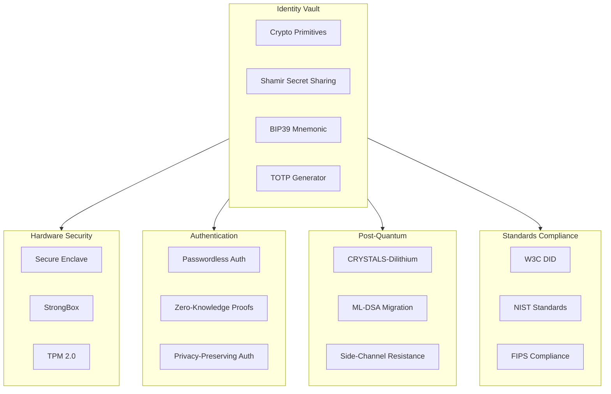

# 07 — MF+SO Sovereign Identity & Authentication Vault

**Multi-Factor + Sign On** — A cryptographic authentication and identity management system with defense-in-depth: AES-256-GCM, PBKDF2-SHA256, SHA3-256, HMAC, Ed25519, Shamir's secret sharing, and TPM/Secure Enclave/StrongBox hardware-backed key storage.

## Documentation

| Category | Docs | Description |
|----------|------|-------------|
| [Feature Papers](./feature-papers/) | 6 | Business requirements and encryption standards |
| [Data Safety & Security](./data-safety-security-sovereignty/) | 8 | AIOSS ledger integrity, backup integrity, cryptographic guarantees |
| [No Black Boxes](./no-black-boxes/) | 8 | Open source philosophy, transparency reports |
| [No More Silicon](./no-more-silicon/) | 6 | Hardware minimalism, edge computing |
| [Privacy](./privacy/) | 8 | Privacy policy, GDPR/CCPA compliance |
| [Compliance](./compliance/) | 8 | SOC2, GDPR, HIPAA, FedRAMP |
| [CSR](./csr/) | 7 | Environmental impact, ethical AI |
| [FAQ](./faq/) | 8 | Frequently asked questions |
| [Help & Bugs](./help-bugs/) | 7 | Troubleshooting |
| [How To Use Community](./how-to-use-community/) | 8 | Community usage guides |
| [How To Use Enterprise](./how-to-use-enterprise/) | 8 | Enterprise usage guides |
| [Enterprise](./enterprise/) | 7 | Enterprise documentation |
