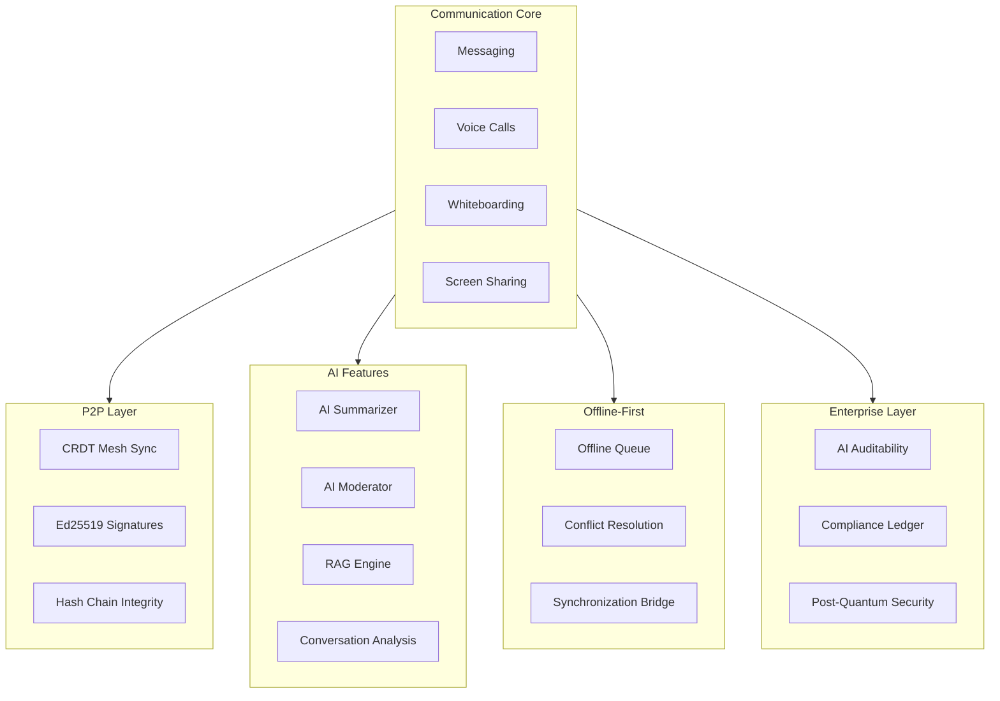

# 08 — Libern Sovereign Collaborative Telecom Engine

A peer-to-peer communication platform (messaging, voice, whiteboarding) with cryptographic integrity, local AI inference, offline-first operation, and no centralized infrastructure. Every message is hash-chained and Ed25519-signed.

## Documentation

| Category | Docs | Description |
|----------|------|-------------|
| [Research](./research/) | 7 | Academic papers on hash chain integrity, CRDT convergence, local AI privacy, P2P communication, Ed25519 post-quantum, software sovereignty, AI auditability |
| [Features](./features/) | 12 | Feature documentation: overview through predictions |
| [Tutorials](./tutorials/) | 8 | Getting started guides through compliance/AIOSS |
| [No Black Boxes](./no-black-boxes/) | 5 | Open source code, transparent network |
| [No More Silicon](./no-more-silicon/) | 5 | Existing hardware, longevity |
| [Privacy](./privacy/) | 7 | No data leaks, privacy by design |
| [Compliance](./compliance/) | 7 | GDPR, SOC2, HIPAA, FedRAMP |
| [Data Safety](./data-safety/) | 7 | Cryptographic guarantees, sovereignty |
| [CSR](./csr/) | 5 | Environmental impact, ethical technology |
| [FAQs](./faqs/) | 10 | Frequently asked questions |
| [Why Use](./why-use/) | 6 | Value proposition |
| [Governance](./governance/) | 5 | Governance model, security disclosures |
| [BDRs](./bdrs/) | 8 | Business decision records |
| [Help & Bugs](./help-bugs/) | 7 | Installation issues, performance |
| [How To Community](./howto-community/) | 6 | Community usage guides |
| [How To Developers](./howto-developers/) | 6 | Developer setup, building installer |
| [How To Enterprise](./howto-enterprise/) | 6 | Enterprise deployment, compliance reporting |
