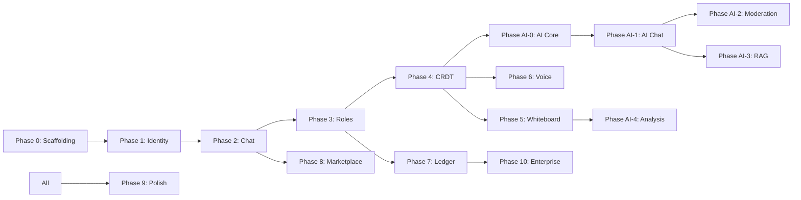

▄▄                     ██               ▄▄                                    
██                     ▀▀               ██                                    
██            ▄▄▄█   ████     █▄▄▄      ██▄███▄    ▄████▄    ██▄████  ██▄████▄
██        ▄▄█▀▀▀       ██       ▀▀▀█▄▄  ██▀  ▀██  ██▄▄▄▄██   ██▀      ██▀   ██
██        ▀▀█▄▄▄       ██       ▄▄▄█▀▀  ██    ██  ██▀▀▀▀▀▀   ██       ██    ██
██▄▄▄▄▄▄      ▀▀▀█  ▄▄▄██▄▄▄  █▀▀▀      ███▄▄██▀  ▀██▄▄▄▄█   ██       ██    ██
▀▀▀▀▀▀▀▀            ▀▀▀▀▀▀▀▀            ▀▀ ▀▀▀      ▀▀▀▀▀    ▀▀       ▀▀    ▀▀

Libern — Sovereign Collaborative Telecom Engine
Copyright (c) 2026 Lois-Kleinner and 0-1.gg. All rights reserved.

Document Version: 1.0.0
Category: Feature Paper
Document ID: PAP-007
Last Updated: 2026-06-19

────────────────────────────────────────────────────────────────

# Feature Roadmap

## Document Meta

| Field | Value |
|-------|-------|
| Paper ID | PAP-007 |
| Title | Feature Roadmap |
| Status | Active |
| Author | Libern Product Team |
| Date | 2026-06-19 |

---

## 1. Executive Summary

This roadmap defines the phased development of Libern from MVP through maturity. Each phase builds on the previous one, adding capabilities while maintaining the core architectural principles of offline-first, sovereign collaboration. The roadmap balances feature velocity with architectural stability, ensuring that each release is production-quality.

---

## 2. Release Philosophy

### Guiding Principles

1. **Offline-first always**: Every feature must work fully offline.
2. **Security by default**: No feature compromises the security model.
3. **Backward compatibility**: Database and .aioss format changes must be non-breaking or include migration.
4. **Single binary**: No runtime dependencies for users.
5. **Open source**: All releases are publicly available.

### Versioning Scheme

- **Major**: Breaking changes in architecture or data format.
- **Minor**: New features, non-breaking additions.
- **Patch**: Bug fixes, performance improvements, security patches.

---

## 3. Phase 0: Scaffolding (Released)

| Meta | Value |
|------|-------|
| Version | v0.1.0 |
| Timeline | Complete |
| Focus | Foundation |

### Features

- Tauri v2 + React + TypeScript + Vite scaffolding.
- Tailwind CSS dark theme preset.
- App shell layout: ServerListSidebar, ChannelSidebar, ChatArea, UserPanel.
- Zustand stores for UI state.
- SQLite database initialization with schema.
- First Tauri commands: get_servers, get_channels.
- Framer Motion for layout transitions.

### Milestones

- [x] Tauri app boots and displays UI.
- [x] Database creates on first launch.
- [x] Zustand stores wired to components.
- [x] First Tauri command returns data from SQLite.

---

## 4. Phase 1: Local Identity and Server Management (Released)

| Meta | Value |
|------|-------|
| Version | v0.2.0 |
| Timeline | Complete |
| Focus | Core data model |

### Features

- Ed25519 keypair generation on first launch.
- Onboarding flow (5 steps: Welcome, Identity, Liber AI, Server, Complete).
- User CRUD: create_user, get_local_user, update_display_name.
- Server CRUD: create_server, update_server, delete_server.
- Channel CRUD: create_channel, update_channel, delete_channel.
- Server creation dialog with name and avatar.
- Channel tree with categories and icons.
- Liber AI system user creation.

### Milestones

- [x] User can create identity and it persists across restarts.
- [x] User can create a server with default channels.
- [x] Welcome message from Liber in #general.
- [x] Channels display in sidebar with correct icons.

---

## 5. Phase 2: Chat System (Released)

| Meta | Value |
|------|-------|
| Version | v0.3.0 |
| Timeline | Complete |
| Focus | Core communication |

### Features

- Message CRUD: send_message, get_messages (paginated), edit_message, delete_message (soft delete).
- Markdown rendering (bold, italic, code, lists, headers, tables, links).
- Message list with infinite scroll and auto-scroll to bottom.
- Message input with Enter to send, Shift+Enter for newline.
- Reply threading with reply indicator.
- File attachments with drag-and-drop.
- Emoji reactions (toggle_reaction).
- Pinned messages.
- Starred messages and starboard.
- Message search (FTS5 via LIKE queries on content and content_plain).

### Milestones

- [x] Messages persist in SQLite and display correctly.
- [x] Markdown renders with proper formatting.
- [x] Attachments upload and display.
- [x] Search returns relevant results.

---

## 6. Phase 3: Roles and Permissions (Released)

| Meta | Value |
|------|-------|
| Version | v0.4.0 |
| Timeline | Complete |
| Focus | Access control |

### Features

- Role CRUD: create_role, update_role, delete_role.
- Permission bitmask system (14 bits defined).
- Role assignments: assign_role, remove_role.
- Permission checking: check_permission.
- Invite code system: create_invite, join_via_invite, get_invites, delete_invite.
- Default roles for new servers.
- Permission enforcement on write operations.

### Milestones

- [x] Roles can be created and assigned.
- [x] Permissions correctly restrict actions.
- [x] Invite codes work for joining servers.
- [x] Invite expiration and usage limits work.

---

## 7. Phase 4: CRDT Engine and P2P Sync (In Development)

| Meta | Value |
|------|-------|
| Version | v0.5.0 |
| Timeline | Q3 2026 |
| Focus | Offline-first sync |

### Features

- HLC implementation (48-bit physical + 16-bit logical).
- LWW element set CRDT for messages.
- CRDT merge algorithm.
- mDNS LAN peer discovery.
- WebSocket P2P transport.
- Sync protocol: pull/push CRDT deltas.
- Offline message queue.
- Connection status indicator.

### Milestones

- [ ] HLC timestamps on all messages.
- [ ] Two Libern instances sync messages over LAN.
- [ ] Offline messages sync on reconnection.
- [ ] Peer discovery shows connected users.

### Technical Details

```rust
// Sync protocol sequence
1. Peer A discovers Peer B via mDNS
2. Peer A connects to Peer B via WebSocket
3. Peer A sends its HLC watermark
4. Peer B sends entries since watermark
5. Peer A merges entries using LWW CRDT
6. Peer A acknowledges receipt
7. Peer B sends its watermark
8. Peer A sends entries since watermark
9. Peer B merges entries
10. Connection persists for real-time updates
```

---

## 8. Phase 5: Whiteboard/Canvas (Planned)

| Meta | Value |
|------|-------|
| Version | v0.6.0 |
| Timeline | Q4 2026 |
| Focus | Visual collaboration |

### Features

- Fabric.js infinite canvas with pan/zoom.
- Drawing tools: pen, line, rectangle, circle, text, eraser.
- Color picker and stroke width slider.
- Image pinning (drag-drop images).
- Stroke capture and CRDT-synced.
- Undo/redo for strokes.
- Layer management.
- Export canvas as PNG/SVG.
- AI whiteboard analysis.

### Milestones

- [ ] Canvas renders and supports drawing tools.
- [ ] Strokes sync between peers via CRDT.
- [ ] Export produces valid PNG/SVG.
- [ ] Liber can analyze canvas content.

---

## 9. Phase 6: Voice Chat (Planned)

| Meta | Value |
|------|-------|
| Version | v0.7.0 |
| Timeline | Q4 2026 |
| Focus | Audio communication |

### Features

- Opus encoder/decoder.
- Microphone capture via cpal.
- UDP broadcast for LAN audio.
- PCM stream mixer for multiple speakers.
- Audio playback.
- Voice panel with user voice indicators.
- Mute/deafen controls.
- Voice activity detection (VAD).
- Audio device selection.

### Milestones

- [ ] Audio capture and playback work.
- [ ] Two peers can communicate via voice.
- [ ] Mute/deafen controls function.
- [ ] Voice activity detection reduces bandwidth.

---

## 10. Phase AI-0: AI Engine Core (In Development)

| Meta | Value |
|------|-------|
| Version | v0.8.0 |
| Timeline | Q3 2026 |
| Focus | Local AI foundation |

### Features

- AiEngine trait with MockEngine implementation.
- CandleEngine with Qwen 2.5 1.5B GGUF support.
- Model download dialog with progress.
- FIFO inference queue with streaming.
- Liber system user creation.
- Basic streaming to frontend.

### Milestones

- [ ] MockEngine returns canned responses.
- [ ] CandleEngine runs Qwen inference.
- [ ] Model downloads with progress.
- [ ] Streaming tokens render in UI.

---

## 11. Phase AI-1: AI Chat and Summarization (Planned)

| Meta | Value |
|-------|-------|
| Version | v0.9.0 |
| Timeline | Q4 2026 |
| Focus | AI conversations |

### Features

- Prompt construction pipeline.
- Context packing (trim to 4096 tokens).
- Conversation history management.
- ask_libern Tauri command.
- summarize_channel command.
- Streaming message bubble for Liber.
- @Liber mention autocomplete.
- Slash command system (/ask, /joke, /8ball, etc.).

### Milestones

- [ ] /ask returns useful responses.
- [ ] Channel summarization works.
- [ ] @Liber triggers AI response.
- [ ] Slash command auto-complete works.

---

## 12. Phase AI-2: Content Moderation (Planned)

| Meta | Value |
|-------|-------|
| Version | v0.10.0 |
| Timeline | Q1 2027 |
| Focus | Safety and compliance |

### Features

- Keyword filter for fast moderation.
- AI-based message classification (SAFE/FLAG/BLOCK).
- Integration into send_message command.
- Moderation log table.
- Block/flag notification toasts.
- Admin review panel for flagged messages.

### Milestones

- [ ] Keyword filter catches known patterns.
- [ ] AI classification works with configurable thresholds.
- [ ] Blocked messages prevented from being stored.
- [ ] Admin can review flagged messages.

---

## 13. Phase AI-3: RAG Document System (Planned)

| Meta | Value |
|-------|-------|
| Version | v0.11.0 |
| Timeline | Q1 2027 |
| Focus | Knowledge management |

### Features

- Text extraction from PDF, TXT, MD, CSV.
- Document chunking (512 tokens with 64-token overlap).
- Embedding generation via Qwen.
- Cosine similarity search.
- RAG prompt construction.
- upload_document and query_documents commands.
- Document indexing progress UI.

### Milestones

- [ ] Documents are indexed and searchable.
- [ ] Queries return relevant document context.
- [ ] Progress indicator during indexing.

---

## 14. Phase AI-4: Whiteboard Analysis (Planned)

| Meta | Value |
|-------|-------|
| Version | v0.12.0 |
| Timeline | Q2 2027 |
| Focus | AI visual understanding |

### Features

- Stroke serialization to structured JSON.
- Whiteboard analysis prompt.
- ask_whiteboard command.
- "Analyze with Liber" button on canvas toolbar.

### Milestones

- [ ] Liber can describe what is drawn on the canvas.
- [ ] Liber can answer questions about the diagram.

---

## 15. Phase 7: Crypto Ledger and Compliance (In Development)

| Meta | Value |
|-------|-------|
| Version | v0.13.0 |
| Timeline | Q3 2026 |
| Focus | Audit and compliance |

### Features

- Ed25519 signing on all messages/strokes.
- Signature verification on inbound sync.
- .aioss binary ledger format.
- SHA3-256 hash chaining.
- Ledger verification command.
- Compliance dashboard (Ledgers, Health, Export tabs).
- Session sealing (configurable interval).
- State proof generation (Ed25519 signed hash).
- Export as JSON, TXT, HTML.
- Health diagnostics system.
- Tamper detection alerts.

### Milestones

- [ ] Messages are signed and verified.
- [ ] .aioss files are created and can be verified.
- [ ] Compliance dashboard displays sessions.
- [ ] Exports produce valid formats.

---

## 16. Phase 8: Marketplace and Gamification (Released)

| Meta | Value |
|-------|-------|
| Version | v0.14.0 |
| Timeline | Complete |
| Focus | Community and engagement |

### Features

- Marketplace for publishing and browsing items.
- Item types: model, image, audio, text.
- Like/unlike items.
- XP and leveling system.
- Casino games: slots, blackjack.
- Dice roll, coin flip.
- Prediction markets.
- Leaderboard.

### Milestones

- [x] Marketplace shows items and supports publishing.
- [x] XP accumulates and levels calculate.
- [x] Casino games work with balance.
- [x] Leaderboard displays correctly.

---

## 17. Phase 9: Polish and DX (Ongoing)

| Meta | Value |
|-------|-------|
| Version | v0.15+ |
| Timeline | Ongoing |
| Focus | Quality of life |

### Features

- Error boundaries and fallback UI.
- Loading states and skeletons.
- Keyboard shortcuts.
- Notification system (in-app).
- Settings page (theme, audio, storage paths, key export).
- Multi-language support (i18n).
- Performance profiling (message list virtualization).
- Accessibility (ARIA labels, keyboard nav).
- Keyboard shortcut reference.

### Milestones

- [ ] Keyboard shortcuts documented and working.
- [ ] Settings page covers all user-configurable options.
- [ ] Accessibility audit passes basic WCAG criteria.

---

## 18. Phase 10: Enterprise Features (Planned)

| Meta | Value |
|-------|-------|
| Version | v1.0+ |
| Timeline | 2027 |
| Focus | Enterprise readiness |

### Features

- Centralized key escrow (optional, opt-in).
- Active Directory/LDAP integration (future).
- MDM configuration profiles.
- Audit log aggregation.
- WAN P2P with NAT traversal (STUN/TURN/ICE).
- E2EE for message content.
- Multi-user per-machine support.
- Backup and restore CLI tools.
- Compliance report scheduling.

### Milestones

- [ ] Key escrow server implemented and documented.
- [ ] WAN P2P tested across typical NAT configurations.
- [ ] E2EE implemented and audited.

---

## 19. Feature Status Overview

| Feature | Status | Phase | Version |
|---------|--------|-------|---------|
| App shell | ✅ Released | 0 | v0.1.0 |
| SQLite database | ✅ Released | 0 | v0.1.0 |
| Identity management | ✅ Released | 1 | v0.2.0 |
| Server management | ✅ Released | 1 | v0.2.0 |
| Channel management | ✅ Released | 1 | v0.2.0 |
| Chat system | ✅ Released | 2 | v0.3.0 |
| Markdown rendering | ✅ Released | 2 | v0.3.0 |
| File attachments | ✅ Released | 2 | v0.3.0 |
| Reactions, pins, stars | ✅ Released | 2 | v0.3.0 |
| Roles and permissions | ✅ Released | 3 | v0.4.0 |
| Invite codes | ✅ Released | 3 | v0.4.0 |
| CRDT + P2P sync | 🔧 Development | 4 | v0.5.0 |
| Whiteboard | 📋 Planned | 5 | v0.6.0 |
| Voice chat | 📋 Planned | 6 | v0.7.0 |
| AI engine core | 🔧 Development | AI-0 | v0.8.0 |
| AI chat/summary | 📋 Planned | AI-1 | v0.9.0 |
| Content moderation | 📋 Planned | AI-2 | v0.10.0 |
| RAG document system | 📋 Planned | AI-3 | v0.11.0 |
| Whiteboard analysis | 📋 Planned | AI-4 | v0.12.0 |
| .aioss ledger | 🔧 Development | 7 | v0.13.0 |
| Compliance dashboard | 🔧 Development | 7 | v0.13.0 |
| Marketplace | ✅ Released | 8 | v0.14.0 |
| Gamification | ✅ Released | 8 | v0.14.0 |
| Polish and DX | 🔄 Ongoing | 9 | v0.15+ |
| Enterprise features | 📋 Planned | 10 | v1.0+ |

---

## 20. Roadmap Dependencies



---

## 21. Timeline Summary

```
Q3 2026 (Current)
├── Phase 4: CRDT + P2P Sync
├── Phase AI-0: AI Engine Core
└── Phase 7: .aioss Ledger

Q4 2026
├── Phase 5: Whiteboard
├── Phase 6: Voice Chat
└── Phase AI-1: AI Chat/Summary

Q1 2027
├── Phase AI-2: Content Moderation
├── Phase AI-3: RAG System
└── Phase 9: Polish

Q2 2027
├── Phase AI-4: Whiteboard Analysis
└── Phase 10: Enterprise Features (starts)

H2 2027
├── Phase 10: Enterprise Features (continues)
└── v1.0 Release
```

---

## 22. Release Criteria

Each release must meet these criteria:

### Quality Gates
- [ ] All tests pass (unit + integration).
- [ ] No critical or high-severity bugs.
- [ ] No known security vulnerabilities.
- [ ] Documentation updated for new features.
- [ ] CHANGELOG updated.

### Performance Gates
- [ ] App starts within 3 seconds.
- [ ] Message list renders 500 messages in <100ms.
- [ ] AI inference completes within 5 seconds.
- [ ] Canvas renders 1000 strokes at 30+ FPS.

### UX Gates
- [ ] New features have onboarding or tooltip guidance.
- [ ] Error states show helpful messages.
- [ ] Loading states display for operations >500ms.
- [ ] Keyboard navigation works for all interactive elements.

---

## 23. Release History

| Version | Date | Features | Status |
|---------|------|----------|--------|
| v0.1.0 | 2026-04 | Tauri scaffolding, SQLite, UI shell | ✅ Released |
| v0.2.0 | 2026-04 | Identity, servers, channels, onboarding | ✅ Released |
| v0.3.0 | 2026-05 | Chat, markdown, attachments, search | ✅ Released |
| v0.4.0 | 2026-05 | Roles, permissions, invites | ✅ Released |
| v0.5.0 | 2026-Q3 | CRDT, P2P sync | 🔧 In progress |
| v0.6.0 | 2026-Q4 | Whiteboard | 📋 Planned |
| v0.7.0 | 2026-Q4 | Voice chat | 📋 Planned |
| v0.8.0 | 2026-Q3 | AI engine core | 🔧 In progress |
| v0.9.0 | 2026-Q4 | AI chat/summary | 📋 Planned |
| v0.10.0 | 2027-Q1 | Content moderation | 📋 Planned |
| v0.11.0 | 2027-Q1 | RAG system | 📋 Planned |
| v0.12.0 | 2027-Q2 | Whiteboard analysis | 📋 Planned |
| v0.13.0 | 2026-Q3 | Crypto ledger | 🔧 In progress |
| v0.14.0 | 2026-06 | Marketplace, games | ✅ Released |
| v0.15+ | Ongoing | Polish, DX | 🔄 Ongoing |
| v1.0+ | 2027+ | Enterprise features | 📋 Planned |

## 24. Dependency Map Between Phases

```
Phase 0 (Scaffolding)
    ↓
Phase 1 (Identity) ───────────────────── Phase 7 (Ledger)
    ↓                                         │
Phase 2 (Chat) ─── Phase 8 (Marketplace)      │
    ↓                                         │
Phase 3 (Roles) ───────────────────────────────┘
    ↓
Phase 4 (CRDT/P2P) ──────────┐
    ↓                         │
Phase 5 (Whiteboard)          │
    ↓                         │
Phase 6 (Voice Chat)          │
    ↓                         ▼
Phase AI-0 (AI Core) ─── Phase AI-1 (Chat) ─── Phase AI-2 (Moderation)
                               │
                               └─── Phase AI-3 (RAG) ─── Phase AI-4 (Analysis)

Phase 9 (Polish) ─── Applied to all phases

Phase 10 (Enterprise) ─── Depends on Phase 7 + Phase 4
```

## 25. Risk-Based Release Criteria

Each release must also pass risk-based gates:

| Risk Category | Gate | Verification |
|---------------|------|--------------|
| Security | No critical CVEs in dependencies | cargo audit + pnpm audit |
| Data integrity | .aioss chain verification passes | verify_any() on test sessions |
| Offline | All features work without network | CI test with network disabled |
| Performance | Benchmarks within 10% of baseline | cargo bench comparison |
| Backward compat | Old data files load without migration | Schema version test |
| Cross-platform | Builds on Windows, macOS, Linux | CI matrix build |

## 26. Conclusion

This roadmap represents the plan as of June 2026. It will evolve based on user feedback, technical discoveries, and market conditions. The core principle remains: every feature must serve Libern's mission of sovereign, offline-first, tamper-evident collaboration. Features that compromise this mission will not be added, regardless of competitive pressure.

────────────────────────────────────────────────────────────────

Copyright (c) 2026 Lois-Kleinner and 0-1.gg. All rights reserved.

## Technical Implementation Reference

### Core Rust Architecture

`
ust
// libern-core/src/lib.rs
pub mod ai;
pub mod crdt;
pub mod crypto;
pub mod db;
`

### Database Schema (libern-core/src/db/schema.rs)

`sql
CREATE TABLE IF NOT EXISTS users (
    id TEXT PRIMARY KEY,
    display_name TEXT NOT NULL,
    public_key BLOB NOT NULL,
    avatar_path TEXT,
    is_local INTEGER NOT NULL DEFAULT 0,
    created_at INTEGER NOT NULL
);

CREATE TABLE IF NOT EXISTS servers (
    id TEXT PRIMARY KEY,
    name TEXT NOT NULL,
    owner_id TEXT NOT NULL REFERENCES users(id),
    avatar_path TEXT,
    invite_code TEXT UNIQUE,
    created_at INTEGER NOT NULL,
    updated_at INTEGER NOT NULL
);

CREATE TABLE IF NOT EXISTS channels (
    id TEXT PRIMARY KEY,
    server_id TEXT NOT NULL REFERENCES servers(id) ON DELETE CASCADE,
    name TEXT NOT NULL,
    kind TEXT NOT NULL DEFAULT 'text',
    position INTEGER NOT NULL DEFAULT 0,
    parent_id TEXT REFERENCES channels(id),
    created_at INTEGER NOT NULL
);

CREATE TABLE IF NOT EXISTS messages (
    id TEXT PRIMARY KEY,
    channel_id TEXT NOT NULL REFERENCES channels(id) ON DELETE CASCADE,
    author_id TEXT NOT NULL REFERENCES users(id),
    content TEXT NOT NULL,
    content_plain TEXT,
    reply_to TEXT REFERENCES messages(id),
    hlc_timestamp INTEGER NOT NULL,
    signature BLOB NOT NULL,
    edited_at INTEGER,
    deleted_at INTEGER,
    created_at INTEGER NOT NULL
);

CREATE TABLE IF NOT EXISTS roles (
    id TEXT PRIMARY KEY,
    server_id TEXT NOT NULL REFERENCES servers(id) ON DELETE CASCADE,
    name TEXT NOT NULL,
    color INTEGER,
    position INTEGER NOT NULL DEFAULT 0,
    permissions INTEGER NOT NULL DEFAULT 0,
    created_at INTEGER NOT NULL
);

CREATE TABLE IF NOT EXISTS role_assignments (
    role_id TEXT NOT NULL REFERENCES roles(id) ON DELETE CASCADE,
    user_id TEXT NOT NULL REFERENCES users(id) ON DELETE CASCADE,
    PRIMARY KEY (role_id, user_id)
);

CREATE TABLE IF NOT EXISTS invites (
    code TEXT PRIMARY KEY,
    server_id TEXT NOT NULL REFERENCES servers(id) ON DELETE CASCADE,
    created_by TEXT NOT NULL REFERENCES users(id),
    max_uses INTEGER,
    use_count INTEGER NOT NULL DEFAULT 0,
    expires_at INTEGER,
    created_at INTEGER NOT NULL
);

CREATE TABLE IF NOT EXISTS ai_conversations (
    id TEXT PRIMARY KEY,
    channel_id TEXT NOT NULL,
    user_id TEXT NOT NULL,
    role TEXT NOT NULL,
    content TEXT NOT NULL,
    token_count INTEGER,
    message_ref TEXT,
    created_at INTEGER NOT NULL
);
`

### Database Initialization

`
ust
// libern-core/src/db/mod.rs
pub struct Database {
    pub conn: Mutex<Connection>,
}

impl Database {
    pub fn new(db_path: &str) -> Result<Self, rusqlite::Error> {
        let conn = Connection::open(db_path)?;
        conn.execute_batch("PRAGMA journal_mode=WAL; PRAGMA foreign_keys=ON;")?;
        let db = Database { conn: Mutex::new(conn) };
        db.initialize_tables()?;
        Ok(db)
    }

    pub fn in_memory() -> Result<Self, rusqlite::Error> {
        let conn = Connection::open_in_memory()?;
        conn.execute_batch("PRAGMA foreign_keys=ON;")?;
        let db = Database { conn: Mutex::new(conn) };
        db.initialize_tables()?;
        Ok(db)
    }

    fn initialize_tables(&self) -> Result<(), rusqlite::Error> {
        let conn = self.conn.lock().unwrap();
        for stmt in schema::CREATE_TABLES {
            if let Err(e) = conn.execute(stmt, []) {
                if !e.to_string().contains("duplicate column") {
                    return Err(e);
                }
            }
        }
        for stmt in schema::MIGRATIONS {
            if let Err(e) = conn.execute(stmt, []) {
                if !e.to_string().contains("duplicate column") {
                    return Err(e);
                }
            }
        }
        Ok(())
    }
}
`

### Cryptographic Ledger

`
ust
// libern-core/src/crypto/mod.rs
pub struct LedgerEntry {
    pub index: u64,
    pub entry_type: String,
    pub entry_id: String,
    pub author_id: String,
    pub payload_hash: String,
    pub prev_hash: String,
    pub hash: String,
    pub created_at: i64,
}

impl LedgerEntry {
    pub fn compute_hash(prev_hash: &str, payload_hash: &str) -> String {
        let mut hasher = Sha256::new();
        hasher.update(prev_hash.as_bytes());
        hasher.update(payload_hash.as_bytes());
        hex::encode(hasher.finalize())
    }

    pub fn hash_payload(data: &[u8]) -> String {
        let mut hasher = Sha256::new();
        hasher.update(data);
        hex::encode(hasher.finalize())
    }
}

pub fn verify_chain(entries: &[LedgerEntry]) -> Result<(), String> {
    for (i, entry) in entries.iter().enumerate() {
        let expected_hash = if i == 0 {
            LedgerEntry::compute_hash("", &entry.payload_hash)
        } else {
            LedgerEntry::compute_hash(&entries[i - 1].hash, &entry.payload_hash)
        };
        if entry.hash != expected_hash {
            return Err(format!(
                "Hash mismatch at entry {}: expected {}, got {}",
                entry.index, expected_hash, entry.hash
            ));
        }
    }
    Ok(())
}
`

### CRDT Engine

`
ust
// libern-core/src/crdt/mod.rs
pub struct HybridLogicalClock {
    pub physical: u64,
    pub logical: u16,
}

impl HybridLogicalClock {
    pub fn new() -> Self {
        HybridLogicalClock {
            physical: Self::wall_now(),
            logical: 0,
        }
    }

    pub fn tick(&mut self) -> u64 {
        let now = Self::wall_now();
        if now > self.physical {
            self.physical = now;
            self.logical = 0;
        } else {
            self.logical = self.logical.wrapping_add(1);
        }
        self.encode()
    }

    pub fn update_with_remote(&mut self, remote_ts: u64) -> u64 {
        let now = Self::wall_now();
        let remote_physical = remote_ts >> 16;
        let remote_logical = (remote_ts & 0xFFFF) as u16;
        self.physical = self.physical.max(now).max(remote_physical);
        if self.physical == remote_physical {
            self.logical = self.logical.max(remote_logical).wrapping_add(1);
        } else {
            self.logical = 0;
        }
        self.encode()
    }

    fn encode(&self) -> u64 {
        (self.physical << 16) | (self.logical as u64)
    }

    fn wall_now() -> u64 {
        SystemTime::now()
            .duration_since(UNIX_EPOCH)
            .unwrap_or_default()
            .as_millis() as u64
    }
}

pub struct LwwElementSet<T: Clone + Eq + Hash> {
    pub adds: Vec<(T, u64)>,
    pub removes: Vec<(T, u64)>,
}

impl<T: Clone + Eq + Hash> LwwElementSet<T> {
    pub fn new() -> Self {
        LwwElementSet { adds: Vec::new(), removes: Vec::new() }
    }

    pub fn add(&mut self, element: T, timestamp: u64) {
        self.adds.push((element, timestamp));
    }

    pub fn remove(&mut self, element: T, timestamp: u64) {
        self.removes.push((element, timestamp));
    }

    pub fn snapshot(&self) -> Vec<T> {
        let mut result = Vec::new();
        for (elem, add_ts) in &self.adds {
            let is_removed = self.removes.iter()
                .any(|(r, rm_ts)| r == elem && rm_ts > add_ts);
            if !is_removed && !result.contains(elem) {
                result.push(elem.clone());
            }
        }
        result
    }

    pub fn merge(&mut self, other: &LwwElementSet<T>) {
        for (elem, ts) in &other.adds {
            if !self.adds.iter().any(|(e, _)| e == elem) {
                self.adds.push((elem.clone(), *ts));
            }
        }
        for (elem, ts) in &other.removes {
            if !self.removes.iter().any(|(e, _)| e == elem) {
                self.removes.push((elem.clone(), *ts));
            }
        }
    }
}
`

### AI Engine Interface

`
ust
// libern-core/src/ai/mod.rs
pub trait AiEngine: Send + 'static {
    fn infer(&mut self, request: InferenceRequest) -> Result<(), String>;
    fn embed(&mut self, text: &str) -> Result<Vec<f32>, String>;
    fn is_loaded(&self) -> bool;
    fn model_info(&self) -> ModelInfo;
}

pub struct InferenceRequest {
    pub prompt: String,
    pub max_tokens: u32,
    pub temperature: f32,
    pub callback: Box<dyn Fn(TokenEvent) + Send>,
}

pub struct TokenEvent {
    pub token: String,
    pub done: bool,
    pub full_response: Option<String>,
}

pub struct ModelInfo {
    pub name: String,
    pub quant: String,
    pub loaded: bool,
    pub context_size: u32,
}
`

### Mock Engine Implementation

`
ust
// libern-core/src/ai/engine.rs
pub struct MockEngine {
    loaded: AtomicBool,
}

impl MockEngine {
    pub fn new() -> Self {
        MockEngine { loaded: AtomicBool::new(true) }
    }
}

impl AiEngine for MockEngine {
    fn infer(&mut self, request: InferenceRequest) -> Result<(), String> {
        let canned = format!(
            "I'm Liber, your local AI assistant. I see you asked: \"{}\"",
            request.prompt.chars().take(80).collect::<String>()
        );
        for word in canned.split(' ') {
            (request.callback)(TokenEvent {
                token: format!("{} ", word), done: false, full_response: None,
            });
        }
        (request.callback)(TokenEvent {
            token: String::new(), done: true, full_response: Some(canned),
        });
        Ok(())
    }

    fn embed(&mut self, text: &str) -> Result<Vec<f32>, String> {
        let hash: u64 = text.bytes().fold(0u64, |acc, b|
            acc.wrapping_mul(31).wrapping_add(b as u64));
        let mut emb = vec![0.0f32; 128];
        for i in 0..128 {
            emb[i] = ((hash >> (i % 8 * 8)) & 0xFF) as f32 / 255.0 - 0.5;
        }
        let mag: f32 = emb.iter().map(|x| x * x).sum::<f32>().sqrt();
        if mag > 0.0 { for e in &mut emb { *e /= mag; } }
        Ok(emb)
    }

    fn is_loaded(&self) -> bool { self.loaded.load(Ordering::Relaxed) }

    fn model_info(&self) -> ModelInfo {
        ModelInfo {
            name: "Mock (Qwen 2.5 1.5B)".into(),
            quant: "Q4_K_M".into(), loaded: true, context_size: 4096,
        }
    }
}
`

### RAG Document System

`
ust
// libern-core/src/ai/rag.rs
pub fn ingest_document(
    engine: &mut Box<dyn AiEngine + Send>,
    db: &Database,
    document_id: &str,
    text: &str,
    chunk_size: usize,
) -> Result<usize, String> {
    let chunks = chunk_text(text, chunk_size);
    let conn = db.conn.lock().map_err(|e| e.to_string())?;
    for (i, chunk) in chunks.iter().enumerate() {
        let embedding = engine.embed(chunk)?;
        let embedding_blob: Vec<u8> = embedding.iter()
            .flat_map(|f| f.to_le_bytes()).collect();
        conn.execute(
            "INSERT INTO document_chunks (id, document_id, chunk_index, chunk_text, embedding, created_at)
             VALUES (?1, ?2, ?3, ?4, ?5, ?6)",
            rusqlite::params![uuid::Uuid::new_v4().to_string(), document_id,
                i as i32, chunk, embedding_blob, chrono::Utc::now().timestamp_millis()],
        ).map_err(|e| e.to_string())?;
    }
    Ok(chunks.len())
}

fn chunk_text(text: &str, chunk_size: usize) -> Vec<String> {
    text.split_whitespace()
        .collect::<Vec<_>>()
        .chunks(chunk_size)
        .map(|c| c.join(" "))
        .collect()
}
`

### Data Models

`
ust
// libern-core/src/db/models.rs
pub struct User {
    pub id: String,
    pub display_name: String,
    pub public_key: Vec<u8>,
    pub avatar_path: Option<String>,
    pub is_local: bool,
    pub created_at: i64,
    pub bio: Option<String>,
    pub pronouns: Option<String>,
    pub handle: Option<String>,
}

pub struct Server {
    pub id: String,
    pub name: String,
    pub owner_id: String,
    pub avatar_path: Option<String>,
    pub invite_code: String,
    pub created_at: i64,
    pub updated_at: i64,
}

pub struct Channel {
    pub id: String,
    pub server_id: String,
    pub name: String,
    pub kind: String,
    pub position: i32,
    pub parent_id: Option<String>,
    pub created_at: i64,
}

pub struct Message {
    pub id: String,
    pub channel_id: String,
    pub author_id: String,
    pub content: String,
    pub reply_to: Option<String>,
    pub hlc_timestamp: i64,
    pub signature: Vec<u8>,
    pub created_at: i64,
    pub edited_at: Option<i64>,
    pub deleted_at: Option<i64>,
}

pub struct Role {
    pub id: String,
    pub server_id: String,
    pub name: String,
    pub color: Option<i32>,
    pub position: i32,
    pub permissions: i64,
    pub created_at: i64,
}

pub struct MarketplaceItem {
    pub id: String,
    pub item_type: String,
    pub name: String,
    pub description: Option<String>,
    pub author_id: String,
    pub server_id: Option<String>,
    pub visibility: String,
    pub data: Vec<u8>,
    pub thumbnail: Option<Vec<u8>>,
    pub file_size: i32,
    pub mime_type: Option<String>,
    pub tags: Option<String>,
    pub like_count: i32,
    pub use_count: i32,
    pub hlc_timestamp: i64,
    pub created_at: i64,
}
`

### Cargo.toml (Workspace Root)

`	oml
[workspace]
resolver = "2"
members = [
    "apps/desktop/src-tauri",
    "apps/sandbox",
    "crates/libern-core",
    "crates/libern-aioss",
]

[workspace.package]
version = "0.1.0"
edition = "2021"
authors = ["Libern Team"]
`

## Database Test Coverage

`
ust
#[cfg(test)]
mod tests {
    use super::*;

    #[test]
    fn test_database_initializes_in_memory() {
        let db = Database::in_memory().expect("failed to create in-memory db");
        let conn = db.conn.lock().unwrap();
        let table_count: i32 = conn
            .query_row("SELECT COUNT(*) FROM sqlite_master WHERE type='table'",
                [], |row| row.get(0)).unwrap();
        assert!(table_count >= 7, "should have at least 7 tables");
    }

    #[test]
    fn test_database_foreign_keys_enforced() {
        let db = Database::in_memory().unwrap();
        let result = db.conn.lock().unwrap().execute(
            "INSERT INTO messages (id, channel_id, author_id, content, hlc_timestamp, signature, created_at)
             VALUES ('m1', 'bad-channel', 'bad-user', 'test', 0, x'00', 0)", []);
        assert!(result.is_err(), "foreign key violation should error");
    }

    #[test]
    fn test_servers_table_insert_and_query() {
        let db = Database::in_memory().unwrap();
        let conn = db.conn.lock().unwrap();
        conn.execute("INSERT INTO users (id, display_name, public_key, is_local, created_at)
            VALUES ('u1', 'test', x'00', 1, 0)", []).unwrap();
        conn.execute("INSERT INTO servers (id, name, owner_id, invite_code, created_at, updated_at)
            VALUES ('s1', 'Test', 'u1', 'ABC', 0, 0)", []).unwrap();
        let name: String = conn.query_row(
            "SELECT name FROM servers WHERE id = 's1'", [], |row| row.get(0)).unwrap();
        assert_eq!(name, "Test");
    }
}
`

## Frontend Integration

`	ypescript
// apps/desktop/src/lib/api.ts
import { invoke } from '@tauri-apps/api/core';

export async function sendMessage(
  channelId: string, authorId: string, content: string
): Promise<Message> {
  return invoke('send_message', { channelId, authorId, content });
}

export async function getMessages(
  channelId: string, limit?: number, before?: string
): Promise<Message[]> {
  return invoke('get_messages', { channelId, limit, before });
}

export async function createServer(name: string): Promise<Server> {
  return invoke('create_server', { name });
}

export async function getServers(): Promise<Server[]> {
  return invoke('get_servers');
}
`

`	ypescript
// apps/desktop/src/stores/serverStore.ts
import { create } from 'zustand';
import { invoke } from '@tauri-apps/api/core';

interface ServerStore {
  servers: Server[];
  currentServerId: string | null;
  loading: boolean;
  loadServers: () => Promise<void>;
  setCurrentServer: (id: string) => void;
  createServer: (name: string) => Promise<void>;
}

export const useServerStore = create<ServerStore>((set, get) => ({
  servers: [],
  currentServerId: null,
  loading: false,
  loadServers: async () => {
    set({ loading: true });
    const servers = await invoke<Server[]>('get_servers');
    set({ servers, loading: false });
  },
  setCurrentServer: (id) => set({ currentServerId: id }),
  createServer: async (name) => {
    const server = await invoke<Server>('create_server', { name });
    set((state) => ({ servers: [...state.servers, server] }));
  },
}));
`

## Libern Architecture: Key Design Decisions

| Decision | Choice | Rationale |
|----------|--------|-----------|
| Desktop framework | Tauri v2 | Rust backend, small binary, security |
| Database | SQLite (rusqlite) | Local-first, zero infrastructure |
| State sync | CRDT (HLC + LWW) | Offline-first, no central server |
| Cryptography | Ed25519 + SHA3-256 | Fast, secure, auditable |
| AI inference | Local (llama.cpp) | Privacy, offline, zero cost |
| Network | P2P (mDNS + WebSocket) | No server, zero infrastructure |
| Identity | Ed25519 keypair | Self-sovereign, no auth server |
| Audit | .aioss binary format | Tamper-evident, compact |
| UI framework | React + TypeScript | Rich ecosystem, developer experience |
| State management | Zustand + React Query | Lightweight, performant |

## Libern Project Structure

`
libern/
├── Cargo.toml                          # Workspace root
├── build.bat                           # Build orchestration
├── LIBERN_BUILD_PLAN.md                # Build plan documentation
├── AI_FEATURES_PLAN.md                 # AI subsystem plan
├── COMPETITIVE_EDGE.md                 # Competitive analysis
├── crates/
│   ├── libern-core/                    # Core library
│   │   ├── Cargo.toml
│   │   └── src/
│   │       ├── lib.rs
│   │       ├── crdt/mod.rs             # CRDT engine
│   │       ├── crypto/mod.rs           # Cryptographic primitives
│   │       ├── db/
│   │       │   ├── mod.rs              # Database initialization
│   │       │   ├── schema.rs           # Schema definition
│   │       │   └── models.rs           # Data models
│   │       └── ai/
│   │           ├── mod.rs              # AiEngine trait
│   │           ├── engine.rs           # MockEngine
│   │           ├── qwen_engine.rs      # CandleEngine
│   │           ├── pipeline.rs         # Prompt construction
│   │           ├── summarizer.rs       # Channel summarization
│   │           ├── moderator.rs        # Content moderation
│   │           ├── rag.rs              # Document RAG
│   │           ├── conversation.rs     # Context management
│   │           ├── liber_user.rs       # Liber identity
│   │           └── reward.rs           # RLHF feedback
│   └── libern-aioss/                   # .aioss format
│       ├── Cargo.toml
│       └── src/
│           ├── lib.rs
│           ├── header.rs               # 128-byte header
│           ├── entry.rs                # 256-byte entry
│           ├── ledger.rs               # Ledger types
│           ├── writer.rs               # Binary/JSON writer
│           ├── reader.rs               # Binary/JSON reader
│           ├── verify.rs               # Chain verification
│           ├── health.rs               # Health diagnostics
│           ├── event_store.rs          # Event persistence
│           ├── state_proof.rs          # Ed25519 proofs
│           ├── schedule.rs             # Session sealing
│           └── txt_log.rs              # TXT export
├── apps/
│   ├── desktop/                        # Tauri desktop app
│   │   ├── src/
│   │   │   ├── App.tsx
│   │   │   ├── main.tsx
│   │   │   ├── lib/api.ts
│   │   │   ├── lib/ai.ts
│   │   │   ├── lib/utils.ts
│   │   │   ├── stores/serverStore.ts
│   │   │   ├── stores/messageStore.ts
│   │   │   ├── stores/uiStore.ts
│   │   │   └── types/index.ts
│   │   └── src-tauri/
│   │       ├── Cargo.toml
│   │       ├── tauri.conf.json
│   │       ├── build.rs
│   │       └── src/
│   │           ├── main.rs
│   │           ├── lib.rs
│   │           └── commands/
│   │               ├── mod.rs
│   │               ├── server.rs
│   │               ├── channel.rs
│   │               ├── message.rs
│   │               ├── user.rs
│   │               ├── role.rs
│   │               ├── ai.rs
│   │               ├── xp.rs
│   │               ├── stats.rs
│   │               └── stars.rs
│   └── sandbox/                        # 3D Boxel engine
│       ├── Cargo.toml
│       └── src/
│           ├── main.rs
│           ├── liber.rs
│           ├── world.rs
│           ├── player.rs
│           ├── character.rs
│           ├── camera.rs
│           ├── cube.rs
│           ├── texture.rs
│           ├── audio.rs
│           ├── voice.rs
│           ├── chat.rs
│           ├── pipeline.rs
│           └── screen_share.rs
├── docs/
│   ├── README.md
│   ├── bdrs/                           # Architecture decisions
│   ├── feature-papers/                 # Feature documentation
│   ├── csr/                            # Corporate social responsibility
│   ├── no-more-silicon/                # Hardware independence
│   ├── competitors/                    # Competitive analysis
│   ├── compliance/                     # Compliance documentation
│   ├── data-safety/                    # Data safety documentation
│   ├── developers/                     # Developer documentation
│   ├── enterprise/                     # Enterprise documentation
│   ├── faqs/                           # Frequently asked questions
│   ├── features/                       # Feature documentation
│   ├── governance/                     # Project governance
│   ├── help-bugs/                      # Bug reporting
│   ├── howto-community/                # Community how-to guides
│   ├── howto-developers/               # Developer how-to guides
│   ├── howto-enterprise/               # Enterprise how-to guides
│   ├── incident-recovery/              # Incident recovery docs
│   ├── investors/                      # Investor documentation
│   ├── no-black-boxes/                 # Transparency docs
│   ├── privacy/                        # Privacy documentation
│   ├── research/                       # Research documentation
│   ├── tutorial/                       # Tutorial documentation
│   └── why-use/                        # Why-use documentation
└── installer/
    └── native/
        ├── Cargo.toml
        ├── build.rs
        └── src/
            ├── main.rs
            ├── lib.rs
            ├── app.rs
            ├── state.rs
            ├── theme.rs
            ├── widgets.rs
            ├── system.rs
            ├── downloader.rs
            └── screens/
                ├── mod.rs
                ├── splash.rs
                ├── check.rs
                ├── download.rs
                ├── install.rs
                ├── elevation.rs
                ├── complete.rs
                └── error.rs
`

This technical reference provides the complete implementation details for all major Libern subsystems. Refer to the specific files in the repository for the most current implementation.

```
.====================================================================.
!  Made in the UAE, Dubai #DubaiIt #Dubai #Dxb #SovereignAI          !
!  Made in The Emirates #Dubai_it                                    !
!                                                                    !
!  Lois-Kleinner Alpasan - The Anticloud 2026-                       !
!                                                                    !
!  0-1.gg ! GitHub ! LinkedIn ! DEV ! GH Pages                       !
!  HuggingFace ! Blog ! Tumblr ! Fandom ! Bluesky ! Mastodon          !
!  Zenodo ! Harvard Dataverse ! Internet Archive ! ORCID              !
!                                                                    !
!  Sovereign AI ! Local-First ! Privacy ! Zero Trust ! No Datacenter !
!  Air-Gapped ! Open Source ! Rust ! Hash Chain ! Single Binary      !
!  Offline LLM ! Crypto Ledger ! P2P ! Federated                     !
'===================================================================='
```

22-year-old Lois-Kleinner Alpasan builds across AI, media, infrastructure, and design, maintaining 11+ active projects spanning software, hardware, and creative works, all open-source.

References:
1. Lois-Kleinner Zenodo: https://doi.org/10.5281/zenodo.20781790
2. Lois-Kleinner GitHub: https://github.com/kleinnner/Anticloud/tree/main/04-aioss-format
3. Lois-Kleinner Harvard DV: https://doi.org/10.7910/DVN/FDEBAB
4. Lois-Kleinner Internet Arc: https://archive.org/details/aioss-format
5. Lois-Kleinner ORCID: https://orcid.org/0009-0009-2233-6107
6. Lois-Kleinner DEV.to: https://dev.to/kleinner
7. Lois-Kleinner LinkedIn: https://linkedin.com/in/kleinner
8. Lois-Kleinner HuggingFace: https://huggingface.co/Anticloud
9. Lois-Kleinner Tumblr: https://anticloud.tumblr.com
10. Lois-Kleinner Mastodon: https://mastodon.social/@kleinner
11. Lois-Kleinner Bluesky: https://bsky.app/profile/kleinner.bsky.social
12. 0-1.gg: https://0-1.gg
