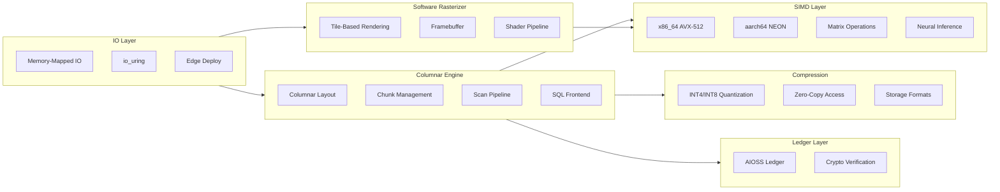

# 09 — Kazkade Compute Engine

A high-performance, CPU-only compute runtime focused on zero-copy columnar data processing (`.acol` format). Covers low-level systems optimization: memory-mapped I/O, SIMD vectorization, quantized neural inference, software rasterization, and columnar storage compression for edge/air-gapped environments.

## Documentation

| Category | Docs | Description |
|----------|------|-------------|
| [Research](./research/) | 8 | Papers on zero-copy architecture, memory-mapped IO, software rasterization, SIMD linear algebra, quantized neural inference, edge computing, cryptographic ledger verification, columnar storage compression |
| [Features](./features/) | 10 | Feature documentation |
| [Tutorials](./tutorials/) | 10 | Getting started guides |
| [No Black Boxes](./no-black-boxes/) | 8 | Transparency philosophy |
| [No More Silicon](./no-more-silicon/) | 8 | Hardware independence |
| [Privacy](./privacy/) | 8 | Privacy documentation |
| [Compliance](./compliance/) | 10 | Compliance frameworks |
| [Data Safety](./data-safety-security-sovereignty/) | 10 | Data safety guarantees |
| [CSR](./csr/) | 8 | Corporate social responsibility |
| [FAQs](./faqs/) | 8 | Frequently asked questions |
| [Why Use Kazkade](./why-use-kazkade/) | 6 | Value proposition |
| [BDRs](./bdrs/) | 7 | Business decision records |
| [Help & Bugs](./help-and-bugs/) | 10 | Troubleshooting guides |
| [Feature Papers](./feature-paper/) | 10 | Feature paper documentation |
| [For Developers](./for-developers/) | 10 | Developer documentation |
| [For Enterprise](./for-enterprise/) | 8 | Enterprise documentation |
