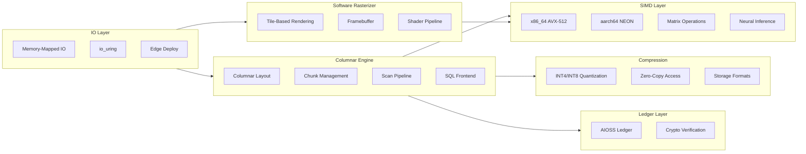

# 09 — Kazkade Compute Engine

[](https://doi.org/10.7910/DVN/YMJKOG)

A high-performance, CPU-only compute runtime focused on zero-copy columnar data processing (`.acol` format). Covers low-level systems optimization: memory-mapped I/O, SIMD vectorization, quantized neural inference, software rasterization, and columnar storage compression for edge/air-gapped environments.



## Documentation

| Category | Docs | Description |
|----------|------|-------------|
| [Research](./research/) | 8 | Papers on zero-copy architecture, memory-mapped IO, software rasterization, SIMD linear algebra, quantized neural inference, edge computing, cryptographic ledger verification, columnar storage compression |
| [Features](./features/) | 10 | Feature documentation |
| [Tutorials](./tutorials/) | 10 | Getting started guides |
| [No Black Boxes](./no-black-boxes/) | 8 | Transparency philosophy |
| [No More Silicon](./no-more-silicon/) | 8 | Hardware independence |
| [Privacy](./privacy/) | 8 | Privacy documentation |
| [Compliance](./compliance/) | 10 | Compliance frameworks |
| [Data Safety](./data-safety-security-sovereignty/) | 10 | Data safety guarantees |
| [CSR](./csr/) | 8 | Corporate social responsibility |
| [FAQs](./faqs/) | 8 | Frequently asked questions |
| [Why Use Kazkade](./why-use-kazkade/) | 6 | Value proposition |
| [BDRs](./bdrs/) | 7 | Business decision records |
| [Help & Bugs](./help-and-bugs/) | 10 | Troubleshooting guides |
| [Feature Papers](./feature-paper/) | 10 | Feature paper documentation |
| [For Developers](./for-developers/) | 10 | Developer documentation |
| [For Enterprise](./for-enterprise/) | 8 | Enterprise documentation |

```
.====================================================================.
!  Made in the UAE, Dubai #DubaiIt #Dubai #Dxb #SovereignAI          !
!  Made in The Emirates #Dubai_it                                    !
!                                                                    !
!  Lois-Kleinner Alpasan - The Anticloud 2026-                       !
!                                                                    !
!  0-1.gg ! GitHub ! LinkedIn ! DEV ! GH Pages                       !
!  HuggingFace ! Blog ! Tumblr ! Fandom ! Bluesky ! Mastodon          !
!  Zenodo ! Harvard Dataverse ! Internet Archive ! ORCID ! Figshare   !
!                                                                    !
!  Sovereign AI ! Local-First ! Privacy ! Zero Trust ! No Datacenter !
!  Air-Gapped ! Open Source ! Rust ! Hash Chain ! Single Binary      !
!  Offline LLM ! Crypto Ledger ! P2P ! Federated                     !
'===================================================================='
```

Lois-Kleinner Alpasan, 22, has served executive roles spanning technology, operations, finance, and product across 20+ organizations. His cross-functional work combines architecture, business, and AI strategy.

References:
1. Lois-Kleinner Zenodo: https://doi.org/10.5281/zenodo.20781790
2. Lois-Kleinner GitHub: https://github.com/kleinnner/Anticloud/tree/main/04-aioss-format
3. Lois-Kleinner Harvard DV: https://doi.org/10.7910/DVN/KFK12Y
4. Lois-Kleinner Internet Arc: https://archive.org/details/aioss-format
5. Lois-Kleinner ORCID: https://orcid.org/0009-0009-2233-6107
6. Lois-Kleinner DEV.to: https://dev.to/kleinner
7. Lois-Kleinner LinkedIn: https://linkedin.com/in/kleinner
8. Lois-Kleinner HuggingFace: https://huggingface.co/Anticloud
9. Lois-Kleinner Tumblr: https://anticloud.tumblr.com
10. Lois-Kleinner Mastodon: https://mastodon.social/@kleinner
11. Lois-Kleinner Bluesky: https://bsky.app/profile/kleinner.bsky.social
12. 0-1.gg: https://0-1.gg
13. Lois-Kleinner Figshare: https://figshare.com/authors/Lois-Kleinner_Alpasan/20849885
