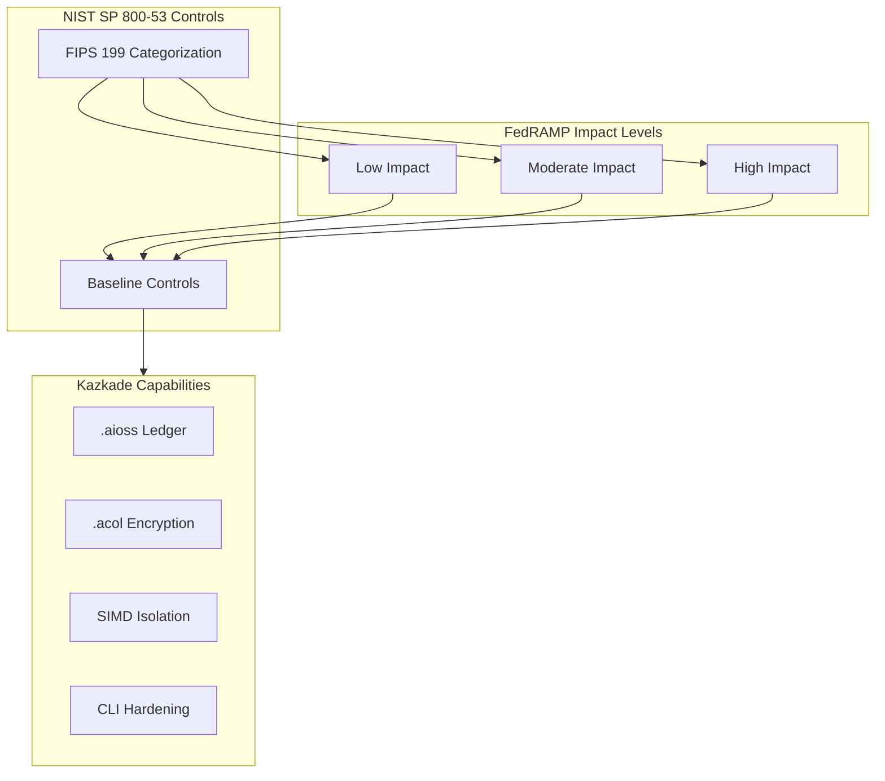
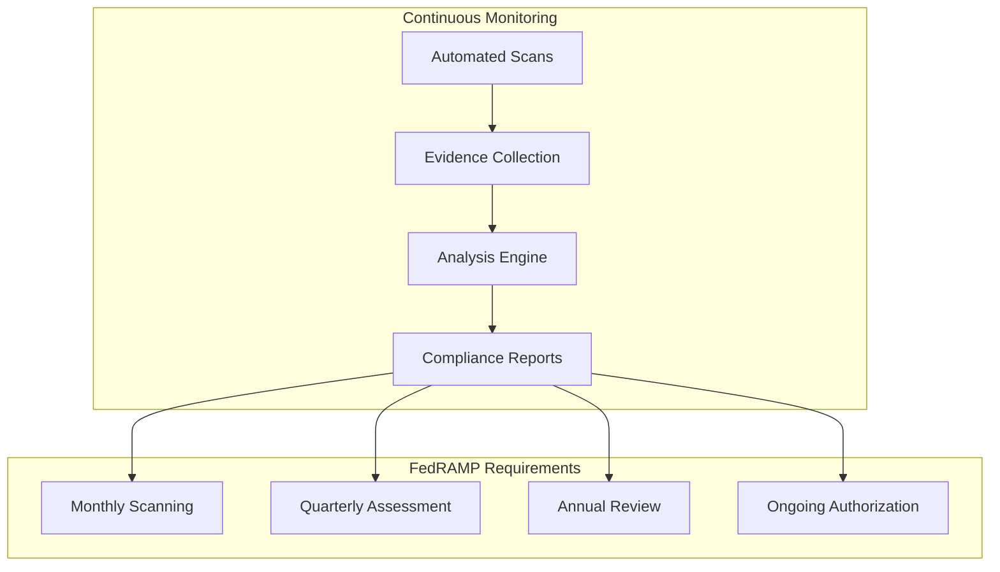
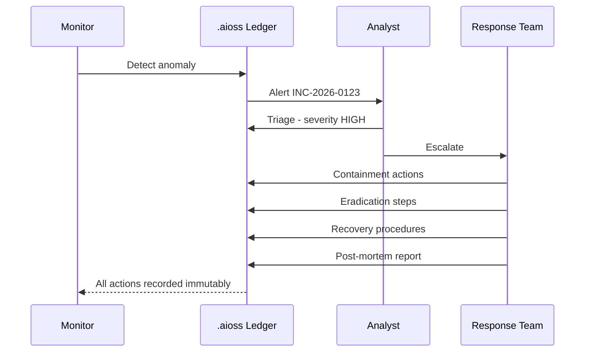

<!--
  __   ___                      __                        __                     
  ¦¦  ¦¦¯                       ¦¦                        ¦¦                     
  ___¦  ¦¦_¦¦      _¦¦¦¦¦_  ¦¦¦¦¦¦¦¦  ¦¦ _¦¦¯    _¦¦¦¦¦_   _¦¦¦_¦¦   _¦¦¦¦_   ¦___     
  __¦¯¯¯    ¦¦¦¦¦      ¯ ___¦¦      _¦¯   ¦¦_¦¦      ¯ ___¦¦  ¦¦¯  ¯¦¦  ¦¦____¦¦    ¯¯¯¦__ 
  ¯¯¦___    ¦¦  ¦¦_   _¦¦¯¯¯¦¦    _¦¯     ¦¦¯¦¦_    _¦¦¯¯¯¦¦  ¦¦    ¦¦  ¦¦¯¯¯¯¯¯    ___¦¯¯ 
      ¯¯¯¦  ¦¦   ¦¦_  ¦¦___¦¦¦  _¦¦_____  ¦¦  ¯¦_   ¦¦___¦¦¦  ¯¦¦__¦¦¦  ¯¦¦____¦  ¦¯¯¯     
           ¯¯    ¯¯   ¯¯¯¯ ¯¯  ¯¯¯¯¯¯¯¯  ¯¯   ¯¯¯   ¯¯¯¯ ¯¯    ¯¯¯ ¯¯    ¯¯¯¯¯
  Lois-Kleinner & 0-1.gg 2026 — Kazkade Zero-Copy Compute Runtime
-->

# FedRAMP Readiness

**Document ID:** KAZ-COMP-FEDRAMP-001  
**Version:** 1.0.0  
**Date:** 2026-06-19  
**Classification:** Controlled Unclassified Information (CUI)  

---

## Table of Contents

1. Overview
2. FedRAMP Impact Levels
3. Low-Impact SaaS Baseline
4. Moderate-Impact SaaS Baseline
5. High-Impact SaaS Baseline
6. Continuous Monitoring Integration
7. `.aioss` Ledger for FedRAMP
8. `.acol` Storage Controls
9. Identity and Access Management
10. Audit Logging and Accountability
11. Incident Response
12. Configuration Management
13. Contingency Planning
14. System and Communications Protection
15. FedRAMP Package Generation
16. Third-Party Assessment Organization (3PAO)
17. Implementation Checklist

---

## 1. Overview

FedRAMP (Federal Risk and Authorization Management Program) provides a standardized approach to security assessment, authorization, and continuous monitoring for cloud products and services used by U.S. federal agencies. FedRAMP defines three impact levels — Low, Moderate, and High — based on the potential impact of a security breach on organizational operations, assets, or individuals.

Kazkade, as a local-first zero-copy compute runtime, operates in a unique position within the FedRAMP landscape. While traditionally FedRAMP applies to cloud services, Kazkade's local-first architecture allows it to be deployed within federal agency on-premises environments (FedRAMP Tailored or agency-authorized) or as a containerized workload within an authorized cloud infrastructure.



---

## 2. FedRAMP Impact Levels

### 2.1 FIPS 199 Categorization

Federal Information Processing Standard (FIPS) 199 defines the security categorization:

| Impact Level | FIPS 199 Aggregate | Kazkade Deployment |
|---|---|---|
| Low | Limited adverse effect | Unclassified, non-critical workloads |
| Moderate | Serious adverse effect | Controlled Unclassified Information (CUI) |
| High | Severe or catastrophic effect | National Security Systems (NSS) |

### 2.2 Kazkade Deployment Models

```bash
# Configure FedRAMP impact level
kazkade config set \
  --section compliance \
  --key fedramp_impact_level \
  --value moderate

# Apply corresponding control baseline
kazkade compliance apply \
  --standard fedramp \
  --impact-level moderate \
  --output compliance-report.json
```

---

## 3. Low-Impact SaaS Baseline

The Low baseline requires 125 controls from NIST SP 800-53 Rev. 5. Kazkade provides native support for the majority of these controls.

### 3.1 Key Low Baseline Controls

| Control ID | Control Name | Kazkade Implementation | Verification |
|---|---|---|---|
| AC-1 | Access Control Policy | RBAC in CLI | `kazkade auth policy list` |
| AC-2 | Account Management | Ed25519 key management | `kazkade auth user list` |
| AC-3 | Access Enforcement | Column ACL | `kazkade acol acl list` |
| AC-4 | Information Flow Enforcement | Local-first isolation | No network data flow |
| AC-6 | Least Privilege | Role-based permissions | Permission audit |
| AC-7 | Unsuccessful Logon Attempts | Rate limiting | `kazkade auth rate-limit` |
| AC-17 | Remote Access | Local-only, no remote | N/A |
| AT-1 | Security Awareness | Training in ledger | Ledger training records |
| AU-2 | Audit Events | `.aioss` event logging | `kazkade ledger query` |
| AU-3 | Audit Record Content | SHA3-256 hashed entries | Ledger verification |
| AU-4 | Audit Storage Capacity | `.acol` storage management | `kazkade health storage` |
| AU-6 | Audit Review | SQL query on ledger | Automated analysis |
| AU-8 | Time Stamps | Monotonic clock | `kazkade ledger timestamps` |
| AU-9 | Protection of Audit Info | Immutable hash chain | Hash chain verification |
| AU-11 | Audit Record Retention | Ledger lifecycle | `kazkade ledger retention` |
| CA-2 | Security Assessments | Continuous monitoring | Compliance dashboard |
| CA-7 | Continuous Monitoring | `kazkade monitor` | Automated monitoring |
| CM-2 | Baseline Configuration | Ledger config snapshots | Configuration diff |
| CM-3 | Configuration Change Control | `.aioss` change events | Immutable change log |
| CM-6 | Configuration Settings | Hardened defaults | Security benchmark |
| CP-2 | Contingency Plan | Snapshot/restore | Disaster recovery test |
| CP-9 | System Backup | `.acol` snapshots | Backup verification |
| IA-2 | User Identification | Ed25519 key pairs | `kazkade auth verify` |
| IA-5 | Authenticator Management | Key lifecycle management | Key rotation |
| IA-8 | Identification and Authentication (Non-Org) | N/A | Local-only |
| IR-4 | Incident Handling | Ledger incident timeline | Incident replay |
| IR-5 | Incident Monitoring | Continuous monitoring | Alert dashboard |
| PL-2 | System Security Plan | Ledger-based SSP | Document management |
| PS-1 | Personnel Screening | N/A | HR process |
| RA-2 | Security Categorization | FIPS 199 mapping | Classification tags |
| RA-3 | Risk Assessment | Risk register in ledger | Risk dashboard |
| SA-8 | Security Engineering | Zero-copy architecture | Design review |
| SC-2 | Application Partitioning | Process isolation | OS-level isolation |
| SC-5 | Denial of Service Protection | Local-first resilience | No DoS surface |
| SC-7 | Boundary Protection | No network services | Air-gap capable |
| SC-8 | Transmission Confidentiality | TLS for sync | Encryption audit |
| SC-12 | Cryptographic Key Management | SHA3-256 + Ed25519 | Key management in ledger |
| SC-13 | Cryptographic Protection | AES-256-GCM columns | Column encryption |
| SC-28 | Protection of Information at Rest | Column encryption | `kazkade acol encrypt` |
| SI-2 | Flaw Remediation | Versioned updates | Update ledger |
| SI-4 | System Monitoring | Continuous monitoring | Monitoring dashboard |
| SI-7 | Software Integrity | Binary SHA3-256 checksum | Binary verification |
| SI-12 | Information Handling | Data classification | Classification tags |

### 3.2 Low Baseline Implementation

```bash
# Apply Low baseline controls
kazkade compliance apply \
  --standard fedramp \
  --baseline low \
  --enable-all

# Verify control implementation
kazkade monitor controls \
  --standard fedramp \
  --baseline low \
  --format json \
  --output low-baseline-status.json
```

---

## 4. Moderate-Impact SaaS Baseline

The Moderate baseline includes all Low controls plus 101 additional controls (326 total). This is the most common FedRAMP authorization level.

### 4.1 Additional Moderate Controls

| Control ID | Control Name | Kazkade Implementation | Verification |
|---|---|---|---|
| AC-2(1) | Automated Account Management | CLI automation | `kazkade auth auto-provision` |
| AC-2(2) | Automated Temporary Account Disablement | Inactivity timeout | Configurable timeout |
| AC-3(2) | Dual Authorization | Multi-signature | Multi-sig workflows |
| AC-3(4) | Discretionary Access Control | Column ACL | Permission audit |
| AC-3(7) | Role-Based Access Control | RBAC roles | Role hierarchy |
| AC-5 | Separation of Duties | Multi-sig approvals | Approval workflow |
| AC-6(1) | Authorize Access to Security Functions | Privilege escalation | Escalation audit |
| AC-6(5) | Privileged Accounts | Auditor role | Read-only access |
| AC-6(9) | Audit Privileged Functions | All privileged ops logged | Ledger audit |
| AC-17(1) | Automated Monitoring of Remote Access | N/A | Local-first design |
| AC-17(2) | Protection of Confidentiality | TLS 1.3 | Encryption audit |
| AC-18(1) | Wireless Access Restrictions | N/A | Local-first design |
| AC-20 | Use of External Systems | N/A | Local-first design |
| AC-21 | Information Sharing | Encrypted sync | Sync audit |
| AT-3 | Role-Based Security Training | Training ledger | Ledger training records |
| AT-4 | Security Training Records | Immutable training log | Ledger query |
| AU-3(1) | Additional Audit Record Details | Rich event payload | Event schema |
| AU-4(1) | Audit Storage Transfer | Periodic archiving | Archive automation |
| AU-5 | Response to Audit Processing Failures | Alert on ledger failure | Health monitoring |
| AU-5(2) | Real-Time Alerts | Monitoring alerts | Alert dashboard |
| AU-6(1) | Automated Process Integration | Compliance-as-code | Automated evidence |
| AU-6(3) | Correlate Audit Record Repositories | SQL joins on ledger | Cross-event analysis |
| AU-7 | Audit Reduction and Report Generation | SQL query engine | Custom reports |
| AU-7(1) | Automatic Processing | Automated reporting | Scheduled reports |
| AU-12 | Audit Record Generation | Comprehensive event capture | Event catalog |
| AU-12(1) | System-Initiated Auditing | Automatic event logging | Zero-config logging |
| AU-12(3) | Changes by Authorized Individuals | Change events | Change audit |
| CA-2(1) | Independent Assessors | 3PAO access mode | Read-only ledger export |
| CA-7(1) | Independent Monitoring | External monitoring | API-based monitoring |
| CA-7(3) | Trend Analyses | SQL trend analysis | Trend reports |
| CA-8 | Penetration Testing | Zero-copy reduction | Reduced attack surface |
| CM-2(1) | Reviews and Updates | Config diff review | `kazkade config diff` |
| CM-2(2) | Automation for Accuracy | Config validation | Validation hooks |
| CM-2(7) | Configure Systems for High-Risk | Hardened mode | `kazkade config hardened` |
| CM-3(2) | Test Changes | Pre-deployment validation | Change testing |
| CM-3(4) | Security Representative | Change approval workflow | Multi-sig |
| CM-4 | Impact Analysis | Change impact assessment | Ledger-based analysis |
| CM-5 | Access Restrictions for Change | Privileged change role | Change role |
| CM-5(1) | Automated Access Enforcement | ACL for changes | Change ACL |
| CM-6(1) | Automated Management | Compliance-as-code | Automated config |
| CM-7 | Least Functionality | Minimal binary | Single binary |
| CM-8 | System Component Inventory | `.acol` asset inventory | Inventory ledgers |
| CM-8(3) | Automated Unauthorized Detection | Integrity monitoring | Component scan |
| CM-9 | Configuration Management Plan | Config management docs | Ledger docs |
| CP-2(1) | Coordinate with Related Plans | Contingency coordination | Plan integration |
| CP-2(2) | Capacity Planning | Resource monitoring | Capacity trends |
| CP-2(3) | Resumption of Missions | Recovery procedures | Recovery runbook |
| CP-2(8) | Identify Critical Assets | Asset classification | Column classification |
| CP-3 | Contingency Training | Training in ledger | Training records |
| CP-4 | Contingency Plan Testing | DR test automation | `kazkade dr test` |
| CP-6 | Alternate Storage Site | Local replica | Replica management |
| CP-7 | Alternate Processing Site | Local replica | Replica failover |
| CP-9(1) | Testing for Reliability | Backup verification | Checksum verify |
| CP-10 | System Recovery | Snapshot restore | `kazkade restore` |
| IA-2(1) | Network Access to Non-Privileged Users | Local-only auth | N/A |
| IA-2(2) | Network Access to Privileged Accounts | Local-only auth | N/A |
| IA-3 | Device Identification | Hardware binding | TPM attestation |
| IA-4 | Identifier Management | Key lifecycle | Key generation |
| IA-5(1) | Password-Based Authentication | Ed25519 (no passwords) | Key-based auth |
| IA-5(2) | PKI-Based Authentication | Ed25519 + X.509 | Certificate mapping |
| IA-5(11) | Hardware Token-Based Authentication | TPM/HSM support | Hardware binding |
| IA-6 | Authenticator Feedback | Minimal feedback | Security hardening |
| IR-2 | Incident Response Training | Training in ledger | Ledger records |
| IR-3 | Incident Response Testing | IR drill automation | `kazkade ir drill` |
| IR-4(1) | Automated Incident Handling | Ledger-based playbooks | Automated response |
| IR-4(4) | Information Correlation | SQL cross-referencing | Correlation queries |
| IR-5(1) | Automated Tracking | Incident dashboard | Real-time tracking |
| IR-6 | Incident Reporting | Automated alerts | Alert integration |
| IR-7 | Incident Response Assistance | Runbook access | Ledger runbooks |
| IR-8 | Incident Response Plan | Plan in ledger | Versioned plan |
| MA-2 | Controlled Maintenance | Maintenance ledger | Maintenance log |
| MA-4 | Nonlocal Maintenance | N/A | Local-first design |
| MA-5 | Maintenance Personnel | Personnel tracking | Access logging |
| MP-2 | Media Access | `.acol` access control | Column ACL |
| MP-6 | Media Sanitization | Secure erasure | `kazkade acol shred` |
| MP-7 | Media Use | Usage policy | Policy enforcement |
| PE-3 | Physical Access Control | N/A | Facility controls |
| PL-4 | Rules of Behavior | Policy in ledger | Policy acknowledgments |
| PM-1 | Information Security Program Plan | ISMP in ledger | Program docs |
| PM-8 | Critical Infrastructure Plan | Asset criticality | Classification |
| PM-9 | Risk Management Strategy | Risk framework | Risk register |
| PM-10 | Authorization Process | ATO artifacts | Authorizations ledger |
| PM-11 | Mission/Business Process Definition | Process definition | Process docs |
| PS-2 | Position Designation | Role assignments | RBAC audit |
| PS-3 | Personnel Screening | N/A | HR process |
| RA-2(1) | Categorization as Critical Assets | Asset classification | `kazkade classify` |
| RA-3(1) | Supply Chain Risk Assessment | Binary provenance | Signed build chain |
| RA-5 | Vulnerability Scanning | Continuous scan | `kazkade vuln scan` |
| RA-5(2) | Update by Frequency | Automated updates | Update automation |
| RA-5(5) | Privileged Access | Scoped scanning | Scan role |
| RA-5(10) | Correlate Scanning Information | SQL correlation | Vulnerability analysis |
| SA-3 | System Development Lifecycle | Versioned releases | Release chain |
| SA-4 | Acquisition Process | Software supply chain | Binary signatures |
| SA-8(10) | Cryptographic Integrity | SHA3-256 chain | Hash verification |
| SA-9 | External System Services | N/A | Local-first design |
| SA-10 | Developer Configuration Management | Git + ledger | Source-to-binary chain |
| SA-11 | Developer Security Testing | CI/CD security tests | Test evidence |
| SA-15 | Development Process | Agile ISMS | Process ledger |
| SA-22 | Unsupported Components | Version lifecycle | Deprecation policy |
| SC-3 | Security Function Isolation | Process isolation | OS isolation |
| SC-4 | Information in Shared Resources | Zero-copy isolation | Memory isolation |
| SC-6 | Resource Availability | Resource limits | `kazkade limit` |
| SC-10 | Network Disconnect | N/A | Local-first |
| SC-12(1) | Availability of Key Materials | Key backup | Key recovery |
| SC-12(2) | Symmetric Key Protection | AES key management | Key encryption |
| SC-12(3) | Asymmetric Key Protection | Ed25519 key management | Key store |
| SC-13(1) | FIPS-Validated Cryptography | FIPS 140-3 ready | Crypto certification |
| SC-18 | Mobile Code | N/A | No runtime code |
| SC-23 | Session Authenticity | Ed25519 sessions | Session integrity |
| SC-24 | Fail in Known State | Deterministic fail | Safe defaults |
| SC-28(1) | Cryptographic Protection | AES-256-GCM | Column encryption |
| SC-39 | Process Isolation | OS process isolation | Memory separation |
| SC-39(1) | Hardware-Based Isolation | TPM/mlock support | Hardware binding |
| SI-2(2) | Automated Flaw Remediation | Update automation | Versioned updates |
| SI-2(5) | Automatic Software Updates | Optional auto-update | Update policy |
| SI-3 | Malicious Code Protection | Binary integrity | SHA3-256 verification |
| SI-4(2) | Automated Alerts | Monitoring alerts | Real-time alerts |
| SI-4(4) | Inbound and Outbound Traffic | N/A | Local-first |
| SI-4(5) | System-Generated Alerts | Automatic alerts | Alert configuration |
| SI-4(11) | Analyze Communications | Network audit | Connection log |
| SI-5 | Security Alerts | CVE feed integration | Vulnerability feed |
| SI-7(1) | Integrity Verification | Continuous checksum | `kazkade verify` |
| SI-7(7) | Integration of Detection | Monitoring integration | Alert pipeline |
| SI-10 | Information Input Validation | SQL query validation | Query sanitization |
| SI-11 | Error Handling | Controlled errors | Error audit |
| SI-12 | Information Management | Data lifecycle | Retention policies |
| SI-16 | Memory Protection | Zero-copy safety | Memory safety |
| SI-17 | Fail-Safe Procedures | Fail-safe defaults | Configuration |

### 4.2 Moderate Baseline Automation

```bash
# Apply Moderate baseline
kazkade compliance apply \
  --standard fedramp \
  --baseline moderate \
  --enable-supplemental \
  --output fedramp-moderate-config.json

# Run pre-assessment checks
kazkade compliance pre-assess \
  --standard fedramp \
  --baseline moderate \
  --format json \
  --output pre-assessment.json

# Generate System Security Plan (SSP) evidence
kazkade report fedramp ssp \
  --impact-level moderate \
  --output ssp-moderate.pdf
```

---

## 5. High-Impact SaaS Baseline

The High baseline adds additional controls for national security systems. Kazkade's local-first, hardware-backed architecture supports High categorization.

### 5.1 Additional High Controls

| Control | Requirement | Kazkade Capability |
|---|---|---|
| AC-2(4) | Automated Audit | Full event automation |
| AC-6(10) | Prohibit Non-Privileged Access | Strict RBAC |
| AU-3(2) | Centralized Management | Ledger centralization |
| AU-4(2) | Offload to Alternate Storage | Archive automation |
| AU-5(1) | Real-Time Alerts | Priority alerting |
| AU-6(6) | Correlation with Physical Monitoring | N/A |
| AU-9(2) | Audit Backup | Ledger replication |
| AU-9(3) | Cryptographic Protection | Hash chain integrity |
| AU-9(4) | Access by Subset | Auditor access |
| CM-2(3) | Pre-Production Configuration | Environment isolation |
| CM-3(6) | Cryptography Management | Key lifecycle |
| CM-6(2) | Enforcement of Security Settings | Hardcoded defaults |
| CP-2(5) | Contingency Plan Updates | Versioned plan |
| CP-2(6) | Alternate Storage and Processing | Local replicas |
| CP-6(3) | Accessibility | Offline-capable |
| CP-7(3) | Priority of Service | Resource allocation |
| CP-10(2) | Transaction Recovery | Ledger state recovery |
| IA-2(6) | Access to Privileged Accounts | MFA required |
| IA-2(8) | Access to Security Functions | Auditor role |
| IA-4(4) | Identify User Status | Active/inactive tracking |
| IA-5(13) | Expiration of Cached Credentials | Session timeout |
| IR-4(6) | Insider Threats | Anomaly detection |
| IR-5(2) | Automated Information Sharing | Ledger-based sharing |
| MA-3(1) | Inspect Tools | Tool integrity |
| MA-5(1) | Individuals Without Access | Escort policy |
| MP-4 | Media Storage | Encrypted storage |
| PE-6(2) | Automated Intrusion Detection | Anomaly monitoring |
| PE-9 | Power Equipment | N/A |
| RA-2(2) | Categorization for High Impact | Strict classification |
| RA-3(2) | Use of All-Source Intelligence | Threat integration |
| RA-5(4) | Automatic Patch Updates | Automated updates |
| SA-5 | Information System Documentation | Full documentation |
| SA-8(26) | Trusted Recovery | Ledger recovery |
| SC-7(3) | Access Points | N/A |
| SC-7(4) | External Telecommunications | N/A |
| SC-7(5) | Deny by Default | Zero-trust default |
| SC-7(8) | Transmission Integrity | TLS integrity |
| SC-12(5) | Key Management for Portables | Key portability |
| SC-12(6) | Key Storage | HSM/TPM storage |
| SC-13(2) | Use of Validated Cryptography | FIPS 140-3 L3+ |
| SC-28(2) | Offline Storage | Encrypted offline |
| SC-29 | Heterogeneity | Platform diversity |
| SC-30 | Concealment and Misinformation | N/A |
| SC-36 | Processing in Alternate Location | Local replica |
| SC-38 | Operations Security | Operational security |
| SC-40 | Wireless Link Protection | N/A |
| SI-3(2) | Automatic Updates | Update automation |
| SI-4(3) | Automated Monitoring for Indicators | IOC detection |
| SI-4(13) | Analyze Alerts | SQL analytics |
| SI-6 | Security Function Verification | Control testing |
| SI-8(1) | Spam Protection | N/A |
| SI-14 | Non-Persistence | Stateless mode |
| SI-15 | Information Output Filtering | Redaction engine |

---

## 6. Continuous Monitoring Integration

FedRAMP requires continuous monitoring as a condition of authorization. Kazkade's monitoring agent provides automated control verification.



### 6.1 Monthly Scanning

```bash
# Automated monthly scan
kazkade monitor scan \
  --type vulnerability \
  --scope all-components \
  --output monthly-scan.json

# Upload to FedRAMP OSCAL format
kazkade report fedramp oscal \
  --scan monthly-scan.json \
  --output oscal-monthly.json
```

### 6.2 Quarterly Assessment

```bash
# Quarterly control assessment
kazkade monitor controls \
  --standard fedramp \
  --full-assessment \
  --quarter 2026-Q2 \
  --output quarterly-assessment.pdf

# Generate POA&M
kazkade report fedramp poam \
  --assessment quarterly-assessment.json \
  --output poam-2026-Q2.pdf
```

### 6.3 Annual Review

```bash
# Annual security review
kazkade monitor annual-review \
  --year 2026 \
  --continuous-monitoring true \
  --output annual-review-2026.pdf
```

---

## 7. `.aioss` Ledger for FedRAMP

The `.aioss` ledger supports FedRAMP audit requirements through immutable record-keeping:

### 7.1 Audit Record Content (AU-3)

```bash
# Configure audit event categories for FedRAMP
kazkade ledger config set \
  --event-categories \
  "access_control,authentication,configuration_change,system_events,incident_response"

# Verify audit record completeness
kazkade ledger query "
  SELECT category, COUNT(*) as count,
         MIN(timestamp) as first_event,
         MAX(timestamp) as last_event
  FROM system.events
  WHERE timestamp >= NOW() - INTERVAL '90 days'
  GROUP BY category
"
```

### 7.2 Audit Record Retention (AU-11)

```bash
# Set retention period
kazkade ledger config set --retention-period 365
kazkade ledger config set --archive-after 90

# Configure archive
kazkade ledger archive configure \
  --destination ./archive/ \
  --compression i8 \
  --verify-after-archive true
```

### 7.3 Protection of Audit Information (AU-9)

```bash
# Verify ledger integrity
kazkade ledger verify --deep

# Export protected audit data
kazkade ledger export \
  --format fedramp-json \
  --since 2025-06-19 \
  --until 2026-06-19 \
  --encrypt aes-256-gcm \
  --output fedramp-audit-export.json.enc
```

---

## 8. `.acol` Storage Controls

### 8.1 Data at Rest Protection (SC-28)

```bash
# Encrypt all columns containing CUI
kazkade acol encrypt \
  --classification cui \
  --algorithm aes-256-gcm \
  --key-id fedramp-key-001

# Verify encryption coverage
kazkade acol status --show-encryption \
  --format table \
  --columns table,column,encrypted,algorithm
```

### 8.2 Media Sanitization (MP-6)

```bash
# Secure erasure of classified data
kazkade acol shred \
  --database fedramp_prod \
  --classification above-cui \
  --standard nist-sp-800-88 \
  --passes 3
```

---

## 9. Identity and Access Management

### 9.1 User Identification (IA-2)

```bash
# Create FIPS-compliant key pairs
kazkade auth keygen \
  --algorithm ed25519 \
  --user-id federal_admin \
  --hardware-binding tpm \
  --output public-key.pem
```

### 9.2 Authenticator Management (IA-5)

```bash
# Enforce key rotation
kazkade auth rotate \
  --user-id federal_admin \
  --reason "FedRAMP mandatory rotation" \
  --force

# Audit authenticator status
kazkade ledger query "
  SELECT user_id, key_type, created_at, 
         expires_at, status
  FROM auth.keys
  WHERE status != 'active'
  ORDER BY expires_at
"
```

---

## 10. Audit Logging and Accountability

### 10.1 Comprehensive Audit Events

The `.aioss` ledger captures every FedRAMP-relevant event:

```json
{
  "event_id": "evt_a1b2c3d4",
  "timestamp": "2026-06-19T14:30:00Z",
  "event_type": "access_control.column_access",
  "actor": "user_federal_analyst",
  "resource": "acol://production/cui_table/sensitive_column",
  "action": "read",
  "result": "granted",
  "authorization_context": {
    "role": "analyst",
    "acl_id": "acl_7890",
    "decision": "allow"
  },
  "session_id": "sess_xyz789",
  "simd_isa": "AVX-512",
  "hash_chain": {
    "previous_hash": "abcd...",
    "entry_hash": "ef01..."
  }
}
```

### 10.2 Auditor Access

```bash
# Create auditor account
kazkade auth user create \
  --username fedramp_auditor \
  --role auditor \
  --access-mode readonly

# Export ledger for auditor
kazkade ledger export \
  --namespace "access_control,auth,incident,change" \
  --since 2025-06-19 \
  --until 2026-06-19 \
  --format oscal-json \
  --output fedramp-audit-package.json
```

---

## 11. Incident Response

### 11.1 Incident Handling (IR-4)



```bash
# Create incident record
kazkade ledger append \
  --event incident.create \
  --incident-id INC-FED-2026-0042 \
  --severity high \
  --categorization "unauthorized_access" \
  --timestamp $(date -u +%Y-%m-%dT%H:%M:%SZ) \
  --fedramp-impact moderate

# Record containment
kazkade ledger append \
  --event incident.contain \
  --incident-id INC-FED-2026-0042 \
  --action "revoked_compromised_credentials" \
  --actor security_lead
```

### 11.2 Incident Reporting (IR-6)

```bash
# Generate FedRAMP incident report
kazkade report fedramp incident \
  --incident-id INC-FED-2026-0042 \
  --format fedramp-json \
  --output incident-report.json

# Submit to US-CERT
kazkade report fedramp us-cert \
  --incident INC-FED-2026-0042 \
  --auto-submit false
```

---

## 12. Configuration Management

### 12.1 Baseline Configuration (CM-2)

```bash
# Capture current configuration baseline
kazkade config snapshot \
  --label "fedramp-moderate-baseline-v1" \
  --description "Initial FedRAMP Moderate baseline configuration"

# Compare with baseline
kazkade config diff \
  --snapshot fedramp-moderate-baseline-v1 \
  --current
```

### 12.2 Configuration Change Control (CM-3)

```bash
# Propose configuration change
kazkade change create \
  --id CM-FED-2026-001 \
  --config-change "Enable FIPS mode" \
  --impact-analysis "Compliance improvement, no performance regression" \
  --security-impact "Strengthens cryptographic compliance"

# Approve with multi-signature
kazkade change approve \
  --id CM-FED-2026-001 \
  --approver config_management_board \
  --sign ed25519
```

---

## 13. Contingency Planning

### 13.1 Contingency Plan (CP-2)

```bash
# Document contingency plan in ledger
kazkade ledger append \
  --event contingency.plan \
  --plan-id CP-FED-001 \
  --version 2.0 \
  --rto "4 hours" \
  --rpo "15 minutes" \
  --recovery-procedure "Snapshot restore from .acol backup"
```

### 13.2 System Backup (CP-9)

```bash
# Configure automated backups
kazkade acol backup configure \
  --schedule "0 */4 * * *" \
  --retention 30 \
  --compression i4 \
  --verify true

# Test restore
kazkade acol restore \
  --snapshot latest \
  --target ./restore-test/ \
  --verify
```

---

## 14. System and Communications Protection

### 14.1 Cryptographic Protection (SC-13)

```bash
# Enable FIPS 140-3 mode
kazkade config set --section crypto --key fips_mode --value true

# Verify cryptographic modules
kazkade crypto verify \
  --algorithm sha3-256 \
  --algorithm ed25519 \
  --algorithm aes-256-gcm \
  --fips-validated
```

### 14.2 Protection of Information at Rest (SC-28)

```sql
-- Query encryption status for FedRAMP reporting
SELECT table_name, column_name, encryption_status,
       algorithm, key_id, key_rotation_date
FROM system.column_encryption
WHERE classification IN ('cui', 'controlled')
ORDER BY table_name, column_name;
```

---

## 15. FedRAMP Package Generation

```bash
# Generate complete FedRAMP authorization package
kazkade report fedramp package \
  --impact-level moderate \
  --include \
    "ssp,poam,sar,plan-of-action,system-description,continuous-monitoring-plan,incident-response-plan,contingency-plan,configuration-management-plan" \
  --output ./fedramp-package/

# Generate OSCAL-compliant output
kazkade report fedramp oscal \
  --package ./fedramp-package/ \
  --output ./oscal/
```

---

## 16. Third-Party Assessment Organization (3PAO)

Kazkade provides a read-only auditor mode for 3PAO access:

```bash
# Enable auditor access mode
kazkade config set --section compliance --key auditor_mode --value true

# Generate 3PAO evidence package
kazkade report fedramp 3pao \
  --evidence-period 2026-H1 \
  --format json \
  --output 3pao-evidence-package.zip \
  --encrypt

# Verify evidence integrity
kazkade ledger verify --export 3pao-evidence-package.zip
```

---

## 17. Implementation Checklist

| # | Control Family | FedRAMP Moderate | Kazkade Status | Action |
|---|---|---|---|---|
| 1 | AC — Access Control | 23 controls | Native support | Configure RBAC |
| 2 | AT — Awareness and Training | 4 controls | Ledger-based | Record training |
| 3 | AU — Audit and Accountability | 22 controls | `.aioss` native | Verify event coverage |
| 4 | CA — Assessment and Authorization | 12 controls | Continuous monitor | Enable monitoring |
| 5 | CM — Configuration Management | 18 controls | Ledger config | Baseline capture |
| 6 | CP — Contingency Planning | 17 controls | `.acol` backup | Schedule backups |
| 7 | IA — Identification and Auth | 16 controls | Ed25519 native | Configure keys |
| 8 | IR — Incident Response | 13 controls | `.aioss` incidents | Deploy playbooks |
| 9 | MA — Maintenance | 6 controls | Ledger tracking | Maintenance log |
| 10 | MP — Media Protection | 7 controls | Column encryption | Encrypt CUI |
| 11 | PE — Physical Protection | 7 controls | N/A | Facility controls |
| 12 | PL — Planning | 6 controls | Ledger documents | SSP in ledger |
| 13 | PM — Program Management | 9 controls | Ledger program | ISMP document |
| 14 | PS — Personnel Security | 6 controls | N/A | HR integration |
| 15 | RA — Risk Assessment | 12 controls | Ledger risk | Risk register |
| 16 | SA — System Acquisition | 17 controls | Binary provenance | Build chain |
| 17 | SC — System Comm Protection | 31 controls | Full encryption | FIPS mode |
| 18 | SI — System Info Integrity | 28 controls | Full coverage | Configure SI |
| | **Total** | **254 controls** | **~220 native** | **~34 complementary** |

---

## References

- FedRAMP Rev. 5 Baseline — PMO 2024
- NIST SP 800-53 Rev. 5 — Security and Privacy Controls
- NIST SP 800-37 Rev. 2 — Risk Management Framework
- FIPS 199 — Security Categorization
- FedRAMP OSCAL v1.1.0 — Open Security Controls Assessment Language
- Kazkade `.aioss` Ledger Specification — KAZ-SPEC-LEDGER-001
- Kazkade `.acol` Storage Architecture — KAZ-SPEC-STORAGE-001

---

*Lois-Kleinner & 0-1.gg 2026 — Kazkade Zero-Copy Compute Runtime*

```
.====================================================================.
!  Made in the UAE, Dubai #DubaiIt #Dubai #Dxb #SovereignAI          !
!  Made in The Emirates #Dubai_it                                    !
!                                                                    !
!  Lois-Kleinner Alpasan - The Anticloud 2026-                       !
!                                                                    !
!  As seen on:                                                       !
!  Harvard Dataverse ! Zenodo/CERN ! Academia.edu ! HuggingFace      !
!  anticloud.telepedia.net ! anticloud.fandom.com                    !
!                                                                    !
!  0-1.gg ! GitHub ! LinkedIn ! DEV ! GH Pages                       !
!  HuggingFace ! Blog ! Bluesky ! Mastodon                           !
!  Internet Archive ! ORCID ! Figshare                               !
!                                                                    !
!  Sovereign AI ! Local-First ! Privacy ! Zero Trust ! No Datacenter !
!  Air-Gapped ! Open Source ! Rust ! Hash Chain ! Single Binary      !
!  Offline LLM ! Crypto Ledger ! P2P ! Federated                     !
'===================================================================='
```

Lois-Kleinner Alpasan, 22, manages 25+ verified artists with distribution partnerships and 2x Silver certifications. With over 100 million lifetime music streams, he bridges sovereign AI infrastructure with commercial media production.

References:
1. Lois-Kleinner Zenodo: https://doi.org/10.5281/zenodo.20781790
2. Lois-Kleinner GitHub: https://github.com/kleinnner/Anticloud/tree/main/04-aioss-format
3. Lois-Kleinner Harvard DV: https://doi.org/10.7910/DVN/FSHFZF
4. Lois-Kleinner Internet Arc: https://archive.org/details/aioss-format
5. Lois-Kleinner ORCID: https://orcid.org/0009-0009-2233-6107
6. Lois-Kleinner DEV.to: https://dev.to/kleinner
7. Lois-Kleinner LinkedIn: https://linkedin.com/in/kleinner
8. Lois-Kleinner HuggingFace: https://huggingface.co/Anticloud
9. Lois-Kleinner Tumblr: https://anticloud.tumblr.com
10. Lois-Kleinner Mastodon: https://mastodon.social/@kleinner
11. Lois-Kleinner Bluesky: https://bsky.app/profile/kleinner.bsky.social
12. 0-1.gg: https://0-1.gg
13. Lois-Kleinner Figshare: https://figshare.com/authors/Lois-Kleinner_Alpasan/20849885
14. Lois-Kleinner Academia: https://independent.academia.edu/kleinner
15. Lois-Kleinner Telepedia: https://anticloud.telepedia.net
16. Lois-Kleinner Fandom: https://anticloud.fandom.com