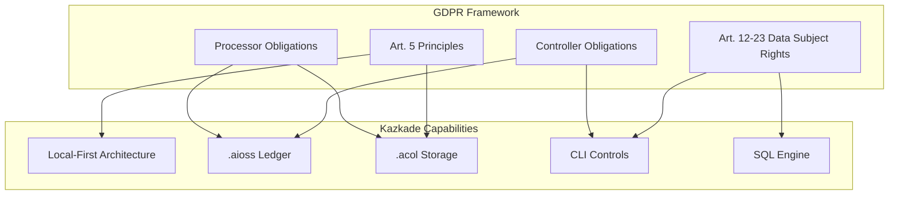
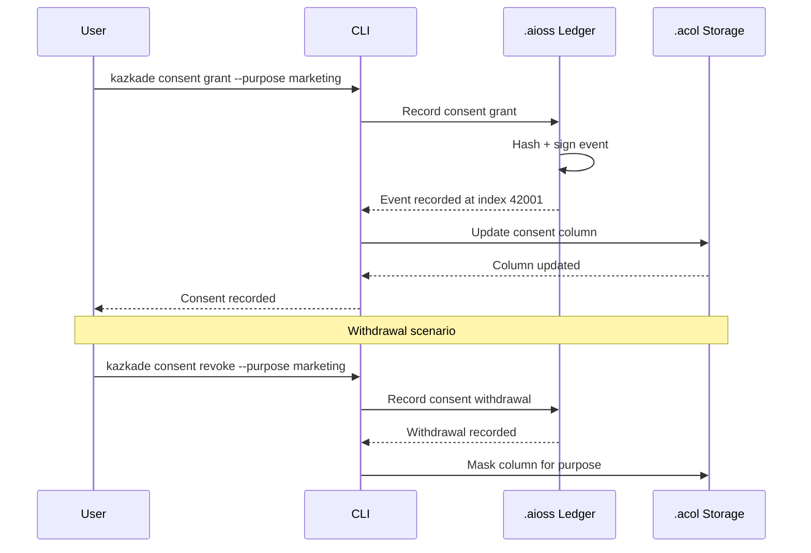
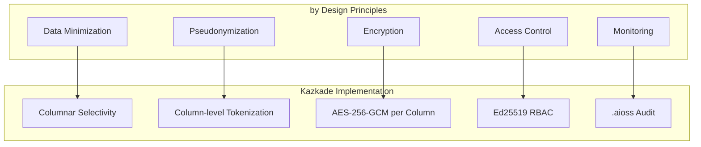
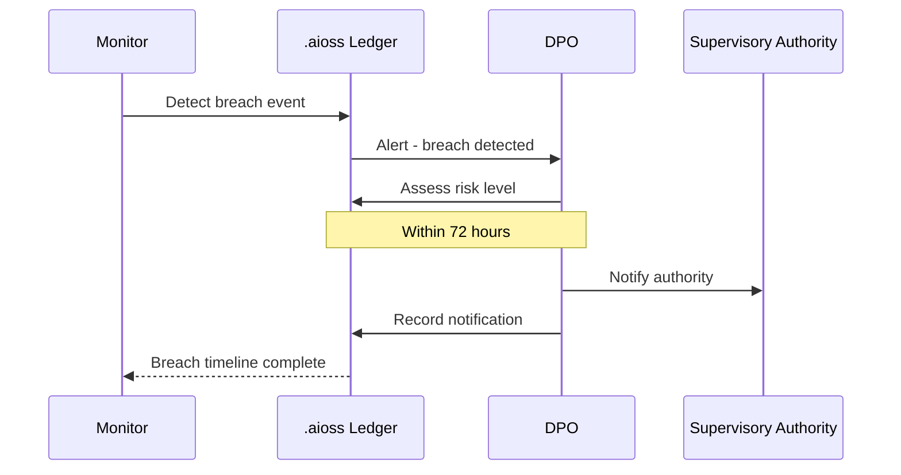
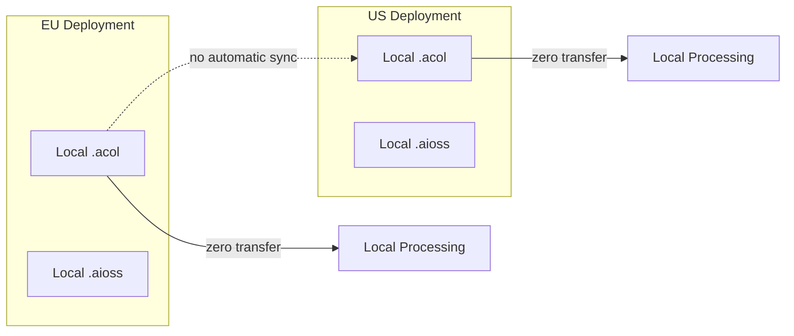
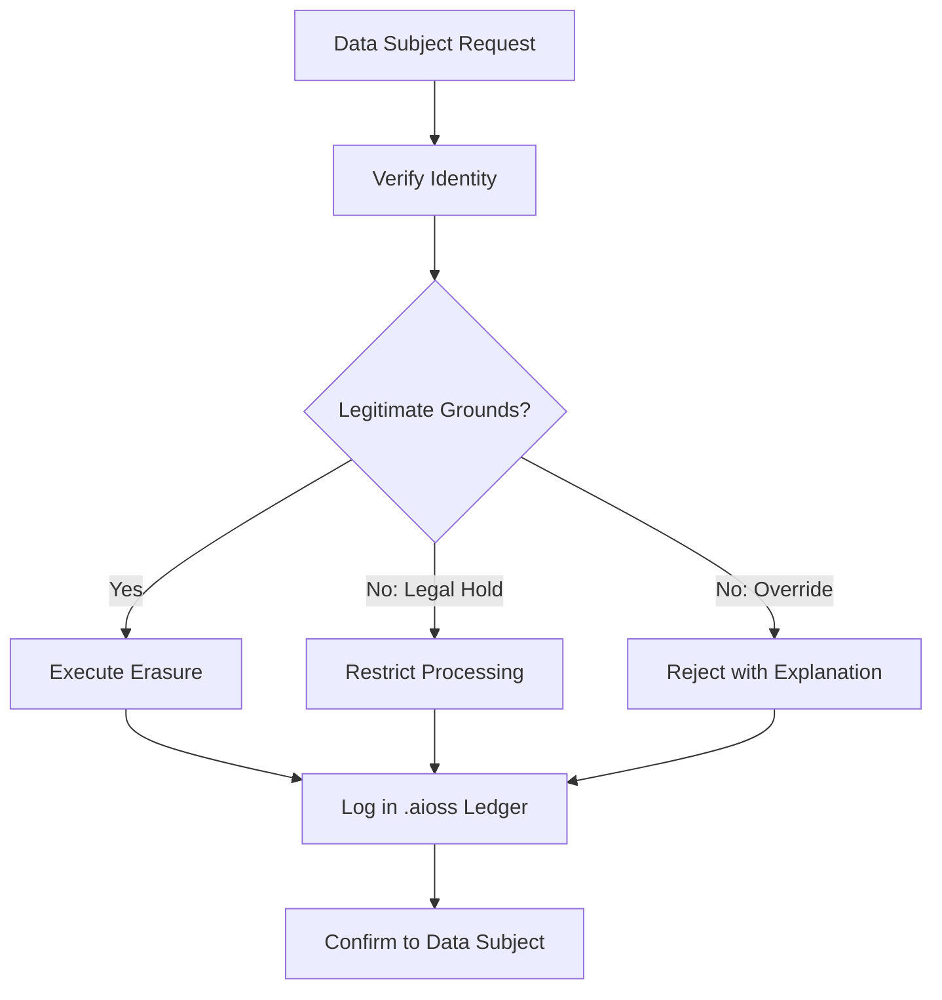

<!--
  __   ___                      __                        __                     
  ¦¦  ¦¦¯                       ¦¦                        ¦¦                     
  ___¦  ¦¦_¦¦      _¦¦¦¦¦_  ¦¦¦¦¦¦¦¦  ¦¦ _¦¦¯    _¦¦¦¦¦_   _¦¦¦_¦¦   _¦¦¦¦_   ¦___     
  __¦¯¯¯    ¦¦¦¦¦      ¯ ___¦¦      _¦¯   ¦¦_¦¦      ¯ ___¦¦  ¦¦¯  ¯¦¦  ¦¦____¦¦    ¯¯¯¦__ 
  ¯¯¦___    ¦¦  ¦¦_   _¦¦¯¯¯¦¦    _¦¯     ¦¦¯¦¦_    _¦¦¯¯¯¦¦  ¦¦    ¦¦  ¦¦¯¯¯¯¯¯    ___¦¯¯ 
      ¯¯¯¦  ¦¦   ¦¦_  ¦¦___¦¦¦  _¦¦_____  ¦¦  ¯¦_   ¦¦___¦¦¦  ¯¦¦__¦¦¦  ¯¦¦____¦  ¦¯¯¯     
           ¯¯    ¯¯   ¯¯¯¯ ¯¯  ¯¯¯¯¯¯¯¯  ¯¯   ¯¯¯   ¯¯¯¯ ¯¯    ¯¯¯ ¯¯    ¯¯¯¯¯
  Lois-Kleinner & 0-1.gg 2026 — Kazkade Zero-Copy Compute Runtime
-->

# GDPR Compliance

**Document ID:** KAZ-COMP-GDPR-001  
**Version:** 1.0.0  
**Date:** 2026-06-19  
**Classification:** Internal — Compliance Evidence  

---

## Table of Contents

1. Overview
2. GDPR Principles (Art. 5)
3. Lawfulness of Processing (Art. 6)
4. Consent (Art. 7)
5. Data Subject Rights (Art. 12–23)
6. Data Controller vs. Processor
7. Data Protection by Design (Art. 25)
8. Data Protection Impact Assessment (Art. 35)
9. Records of Processing Activities (Art. 30)
10. Data Breach Notification (Art. 33–34)
11. Cross-Border Data Transfers (Art. 44–49)
12. Local-First Architecture Benefits
13. `.aioss` Ledger for GDPR
14. `.acol` Storage Controls
15. Right to Erasure (Art. 17)
16. Data Portability (Art. 20)
17. DPA Engagement
18. Implementation Checklist

---

## 1. Overview

The General Data Protection Regulation (GDPR) is the European Union's comprehensive data protection law, effective since May 25, 2018. It governs the processing of personal data of individuals within the European Economic Area (EEA) and imposes obligations on controllers and processors worldwide.

Kazkade's local-first, zero-copy architecture provides fundamental advantages for GDPR compliance. By processing data locally without requiring transmission to cloud servers, Kazkade minimizes data exposure, simplifies consent management, and enables full data subject rights implementation. The `.aioss` tamper-proof ledger serves as the accountability record, while `.acol` columnar storage enables fine-grained data control at the attribute level.



---

## 2. GDPR Principles (Art. 5)

### 2.1 Lawfulness, Fairness, and Transparency

Kazkade enables transparency through the immutable `.aioss` ledger, which records all processing activities:

```bash
# Record processing purpose in ledger
kazkade ledger append \
  --event gdpr.processing.purpose \
  --purpose-id PURP-001 \
  --description "Analytics processing for aggregate reporting" \
  --lawful-basis "legitimate_interest" \
  --data-categories "usage_metrics,performance_data"

# Query processing activities
kazkade ledger query "SELECT * FROM gdpr.processing WHERE lawful_basis = 'consent'"
```

### 2.2 Purpose Limitation

Data is processed only for specified, explicit, and legitimate purposes. The `.acol` columnar format supports purpose-binding at the column level:

```bash
# Tag columns with processing purpose
kazkade acol tag \
  --table users \
  --column email \
  --purpose marketing \
  --purpose support

# Enforce purpose-limited access
kazkade acol acl set \
  --column email \
  --table users \
  --purpose marketing \
  --permission read \
  --condition "consent_granted = true"
```

### 2.3 Data Minimization

The columnar storage model inherently supports data minimization — only the columns needed for a specific purpose are loaded:

```sql
-- Query only necessary columns (minimization)
SELECT user_id, region -- NOT email, NOT phone
FROM analytics.users
WHERE active = true;
```

### 2.4 Accuracy

Kazkade provides data accuracy through schema validation and constraint enforcement:

```bash
# Enforce accuracy constraints
kazkade schema constraint add \
  --table users \
  --column email \
  --check "email LIKE '%@%'"

# Audit data accuracy
kazkade ledger query "
  SELECT column_name, invalid_count, total_count, 
         (invalid_count::float / total_count * 100) as error_rate
  FROM system.data_quality
  WHERE error_rate > 1.0
"
```

### 2.5 Storage Limitation

The `.acol` lifecycle management enables automated retention enforcement:

```bash
# Set retention policy
kazkade acol lifecycle set \
  --table users \
  --retention-days 365 \
  --action archive \
  --archive-format i8

# Verify retention compliance
kazkade acol lifecycle status --table users
```

### 2.6 Integrity and Confidentiality

The `.aioss` hash chain and `.acol` encryption provide integrity and confidentiality:

```bash
# Verify data integrity
kazkade acol checksum verify --table users --all-columns

# Encrypt personal data
kazkade acol encrypt \
  --table users \
  --column phone \
  --algorithm aes-256-gcm \
  --key-id gdpr-key-001
```

### 2.7 Accountability

Accountability is demonstrated through the immutable `.aioss` ledger:

```bash
# Export accountability evidence
kazkade ledger export \
  --namespace gdpr \
  --since 2025-06-19 \
  --format json \
  --output gdpr-accountability-evidence.json

# Generate accountability report
kazkade report gdpr accountability \
  --period 2026-H1 \
  --output accountability-report.pdf
```

---

## 3. Lawfulness of Processing (Art. 6)

### 3.1 Lawful Bases

| Lawful Basis | Kazkade Implementation | Evidence |
|---|---|---|
| Consent (Art. 6(1)(a)) | Ledger consent records | `consent.*` events |
| Contract (Art. 6(1)(b)) | Contract storage in `.aioss` | Signed agreements |
| Legal Obligation (Art. 6(1)(c)) | Compliance mode | Regulatory events |
| Vital Interests (Art. 6(1)(d)) | Emergency access logs | Access overrides |
| Public Interest (Art. 6(1)(e)) | Public authority mode | Authorized processing |
| Legitimate Interest (Art. 6(1)(f)) | LIA documentation | Legitimate interest assessment |

```bash
# Record legitimate interest assessment
kazkade ledger append \
  --event gdpr.lia \
  --purpose-id PURP-002 \
  --assessment "Necessary for fraud prevention" \
  --balancing-test "Minimal impact, strong controls" \
  --timestamp $(date -u +%Y-%m-%dT%H:%M:%SZ)
```

---

## 4. Consent (Art. 7)

### 4.1 Consent Management



```bash
# Record consent
kazkade consent grant \
  --user-id usr_a1b2c3 \
  --purpose email_marketing \
  --timestamp $(date -u +%Y-%m-%dT%H:%M:%SZ)

# Verify consent status
kazkade consent status \
  --user-id usr_a1b2c3 \
  --purpose email_marketing

# Record withdrawal
kazkade consent revoke \
  --user-id usr_a1b2c3 \
  --purpose email_marketing \
  --reason "User requested deletion"
```

### 4.2 Consent for Multiple Purposes

```sql
-- Query consent status for all purposes
SELECT user_id, purpose, granted, granted_at, 
       revoked_at, withdrawal_reason
FROM gdpr.consent_records
WHERE user_id = 'usr_a1b2c3'
ORDER BY purpose;
```

---

## 5. Data Subject Rights (Art. 12–23)

### 5.1 Right to be Informed (Art. 13–14)

Privacy information is documented and versioned in the `.aioss` ledger:

```bash
# Publish privacy notice
kazkade ledger append \
  --event gdpr.privacy_notice \
  --version 2.1 \
  --hash sha3-256:$(sha3-256 privacy-notice-2.1.pdf) \
  --effective-date 2026-01-01

# Query privacy notice history
kazkade ledger query "SELECT version, effective_date, hash FROM gdpr.privacy_notice ORDER BY version"
```

### 5.2 Right of Access (Art. 15)

```bash
# Export all data for a data subject
kazkade gdpr access-request \
  --user-id usr_a1b2c3 \
  --format json \
  --output subject-access-response.json

# Log the access request
kazkade ledger append \
  --event gdpr.access_request \
  --user-id usr_a1b2c3 \
  --request-id SAR-2026-0042 \
  --response-format json
```

### 5.3 Right to Rectification (Art. 16)

```bash
# Rectify inaccurate data
kazkade acol update \
  --table users \
  --set phone="+1234567890" \
  --where "user_id = 'usr_a1b2c3'"

# Record rectification in ledger
kazkade ledger append \
  --event gdpr.rectification \
  --user-id usr_a1b2c3 \
  --column phone \
  --reason "User reported incorrect number" \
  --previous-hash sha3-256:abc...
```

### 5.4 Right to Erasure (Art. 17)

See Section 15 for detailed implementation.

### 5.5 Right to Restrict Processing (Art. 18)

```bash
# Restrict processing
kazkade acol restrict \
  --table users \
  --row-id row_7890 \
  --purpose analytics \
  --reason "Accuracy contested by data subject"

# Verify restriction
kazkade acol restriction-status --table users --row-id row_7890
```

### 5.6 Right to Data Portability (Art. 20)

See Section 16 for detailed implementation.

### 5.7 Right to Object (Art. 21)

```bash
# Record objection
kazkade ledger append \
  --event gdpr.objection \
  --user-id usr_a1b2c3 \
  --purpose direct_marketing \
  --objection-reason "Personal circumstances"

# Enforce objection by masking
kazkade acol mask \
  --table users \
  --column email \
  --condition "user_id = 'usr_a1b2c3' AND purpose = 'direct_marketing'"
```

### 5.8 Automated Decision-Making (Art. 22)

Kazcade's deterministic SIMD execution ensures transparency in automated decisions:

```bash
# Log automated decision
kazkade ledger append \
  --event gdpr.automated_decision \
  --user-id usr_a1b2c3 \
  --decision-type "credit_scoring" \
  --logic-description "MLP neural inference with 3-layer network" \
  --input-features "payment_history,account_age,transaction_volume" \
  --output-score 0.78 \
  --human-review-available true
```

### 5.9 Response Timeline

```bash
# Track DSAR response time
kazkade ledger query "
  SELECT request_id, user_id, received_at, 
         responded_at, 
         (responded_at - received_at) as response_time,
         CASE 
           WHEN (responded_at - received_at) < INTERVAL '30 days' 
           THEN 'COMPLIANT' 
           ELSE 'OVERDUE' 
         END as compliance_status
  FROM gdpr.access_requests
  ORDER BY received_at DESC
"
```

---

## 6. Data Controller vs. Processor

### 6.1 Controller Obligations

When deploying Kazkade, the organization acts as the data controller. Kazkade provides the tools to meet controller obligations:

| Obligation | Kazkade Tool | Implementation |
|---|---|---|
| Data Protection by Design | Column encryption + access control | Art. 25 |
| Records of Processing | `.aioss` ledger | Art. 30 |
| Data Protection Impact Assessment | Risk assessment module | Art. 35 |
| DPA Engagement | Compliance reporting | Art. 37 |
| Data Breach Notification | Incident ledger | Art. 33–34 |

### 6.2 Processor Obligations

When Kazkade is deployed as part of a service offering, processor obligations apply:

```bash
# Record processing instructions
kazkade ledger append \
  --event gdpr.processor_instructions \
  --controller-id CTRL-001 \
  --instructions "Process payment data only for transaction settlement" \
  --data-retention "90 days post-transaction" \
  --sub-processor-restrictions "No sub-processors permitted"

# Log processor activities
kazkade gdpr processor-log --since 2026-01-01 --output processor-activities.json
```

---

## 7. Data Protection by Design (Art. 25)

### 7.1 Technical and Organizational Measures



### 7.2 Default Settings

```bash
# Apply GDPR-by-default configuration
kazkade compliance apply \
  --standard gdpr \
  --by-default true \
  --settings "minimal_collection,encrypted_by_default,audit_all_access"

# Verify default settings
kazkade config show --section gdpr --by-default
```

---

## 8. Data Protection Impact Assessment (Art. 35)

### 8.1 DPIA Process

```bash
# Initialize DPIA
kazkade ledger append \
  --event gdpr.dpia.init \
  --dpia-id DPIA-2026-001 \
  --system-description "Kazkade analytics platform" \
  --processing-description "Aggregate behavioral analysis" \
  --risk-level high

# Record DPIA findings
kazkade ledger append \
  --event gdpr.dpia.findings \
  --dpia-id DPIA-2026-001 \
  --risk "Re-identification through query correlation" \
  --mitigation "Differential privacy layer enabled" \
  --residual-risk low

# DPIA approval
kazkade ledger append \
  --event gdpr.dpia.approve \
  --dpia-id DPIA-2026-001 \
  --approved-by dpo@organization.com \
  --timestamp $(date -u +%Y-%m-%dT%H:%M:%SZ)
```

### 8.2 DPIA Automation

```bash
# Automated DPIA screening
kazkade gdpr dpia-screening \
  --processing-description "Customer analytics platform" \
  --data-categories "location,behavioral,contact" \
  --technologies "MLP neural inference,columnar storage" \
  --output screening-result.json
```

---

## 9. Records of Processing Activities (Art. 30)

### 9.1 Processing Activity Records

The `.aioss` ledger serves as the record of processing activities (ROPA):

```bash
# Record a processing activity
kazkade ledger append \
  --event gdpr.ropa.activity \
  --activity-id ACT-001 \
  --controller-name "Kazkade Inc." \
  --processing-purpose "Performance monitoring" \
  --data-categories "usage_metrics,system_logs" \
  --data-subjects "system_users" \
  --recipients "internal_analytics_team" \
  --retention-period "12 months" \
  --security-measures "AES-256-GCM,Ed25519,immutable_ledger"

# Export ROPA
kazkade gdpr ropa-export \
  --format json \
  --output ropa-2026.json
```

### 9.2 ROPA Query

```sql
-- Query processing activities
SELECT activity_id, processing_purpose, 
       data_categories, retention_period,
       security_measures
FROM gdpr.ropa
ORDER BY activity_id;
```

---

## 10. Data Breach Notification (Art. 33–34)

### 10.1 Breach Detection and Notification



```bash
# Record breach detection
kazkade ledger append \
  --event gdpr.breach.detect \
  --breach-id BR-2026-001 \
  --description "Unauthorized access to production database" \
  --affected-data-subjects 150 \
  --risk-assessment "High risk to rights and freedoms" \
  --detection-time $(date -u +%Y-%m-%dT%H:%M:%SZ)

# Record notification to supervisory authority
kazkade ledger append \
  --event gdpr.breach.notify_sa \
  --breach-id BR-2026-001 \
  --authority "CNIL" \
  --notification-time $(date -u +%Y-%m-%dT%H:%M:%SZ) \
  --within-72h true
```

### 10.2 Breach Documentation

```bash
# Generate breach report
kazkade gdpr breach-report \
  --breach-id BR-2026-001 \
  --format gdpr-standard \
  --output breach-report.pdf

# Verify notification timeline
kazkade ledger query "
  SELECT event_type, timestamp,
         (timestamp - LAG(timestamp) OVER (ORDER BY timestamp)) as gap
  FROM gdpr.breach.*
  WHERE breach_id = 'BR-2026-001'
  ORDER BY timestamp
"
```

---

## 11. Cross-Border Data Transfers (Art. 44–49)

### 11.1 Transfer Mechanisms

| Mechanism | Kazkade Support |
|---|---|
| Adequacy Decision | Local-first eliminates transfers |
| Standard Contractual Clauses | Documented in ledger |
| Binding Corporate Rules | Policy in ledger |
| Derogations | Emergency access logs |

### 11.2 Local-First Transfer Elimination

Kazkade's local-first architecture inherently prevents cross-border data transfers:



```bash
# Audit data location
kazkade gdpr data-location --database production

# Verify no cross-border transfers
kazkade network audit --connections --since 2026-01-01
```

---

## 12. Local-First Architecture Benefits

### 12.1 Privacy by Default

| Aspect | Traditional Cloud | Kazkade Local-First |
|---|---|---|
| Data Location | Third-party servers | Local machine |
| Data Access | Provider access possible | Zero third-party access |
| Network Dependency | Required | Optional |
| Attack Surface | Internet-facing | Air-gap capable |
| Consent Friction | Data must leave device | Data stays local |
| Audit Trail | Provider logs | Self-owned `.aioss` |

### 12.2 Reduced Risk Profile

```bash
# Verify local-first isolation
kazkade network status --show-connections

# Enable air-gap mode
kazkade config set --section network --key air_gap --value true
```

---

## 13. `.aioss` Ledger for GDPR

### 13.1 Accountability Events

The `.aioss` ledger captures all GDPR-relevant events:

```json
{
  "event": "gdpr.consent.grant",
  "timestamp": "2026-06-19T08:00:00Z",
  "user_id": "usr_a1b2c3",
  "purpose": "marketing",
  "granted": true,
  "processing_basis": "Art. 6(1)(a)",
  "consent_id": "con_xyz789",
  "hash_chain": {
    "previous": "a1b2c3d4...",
    "current": "e5f6g7h8..."
  }
}
```

### 13.2 Ledger as Controller Record

```bash
# Generate controller records
kazkade gdpr controller-records \
  --period 2026-H1 \
  --format gdpr-json \
  --output controller-records.json

# Verify ledger integrity for GDPR evidence
kazkade ledger verify --namespace gdpr
```

---

## 14. `.acol` Storage Controls

### 14.1 Personal Data Inventory

```sql
-- Inventory all columns containing personal data
SELECT table_name, column_name, data_category,
       encryption_status, pseudonymization,
       retention_days, processing_purpose
FROM gdpr.data_inventory
WHERE contains_personal_data = TRUE
ORDER BY table_name, column_name;
```

### 14.2 Pseudonymization

```bash
# Apply pseudonymization
kazkade acol pseudonymize \
  --table users \
  --column email \
  --method hash \
  --algorithm sha3-256 \
  --salt "pseudo-salt-2026"

# Verify pseudonymization
kazkade acol info --table users --column email --show-pseudonymization
```

### 14.3 Encryption for Pseudonymous Data

```bash
# Encrypt pseudonymized column
kazkade acol encrypt \
  --table users \
  --column email_hash \
  --algorithm aes-256-gcm \
  --key-id gdpr-pseudo-key
```

---

## 15. Right to Erasure (Art. 17)

### 15.1 Erasure Workflow



### 15.2 Erasure Implementation

```bash
# Execute erasure
kazkade acol delete \
  --table users \
  --where "user_id = 'usr_a1b2c3'" \
  --secure-shred \
  --passes 3

# Record erasure in ledger
kazkade ledger append \
  --event gdpr.erasure.execute \
  --user-id usr_a1b2c3 \
  --request-id ER-2026-0042 \
  --tables "users,analytics_logs,marketing_preferences" \
  --secure-shred standard \
  --timestamp $(date -u +%Y-%m-%dT%H:%M:%SZ)

# Confirm erasure completeness
kazkade gdpr verify-erasure \
  --user-id usr_a1b2c3 \
  --tables "users,analytics_logs,marketing_preferences"
```

### 15.3 Legal Hold Exceptions

```bash
# Apply legal hold instead of erasure
kazkade acol restrict \
  --table users \
  --where "user_id = 'usr_a1b2c3'" \
  --reason "Legal hold for pending litigation" \
  --hold-until 2027-06-19

# Document legal hold
kazkade ledger append \
  --event gdpr.erasure.legal_hold \
  --user-id usr_a1b2c3 \
  --request-id ER-2026-0042 \
  --legal-reference "Art. 17(3)(e)" \
  --hold-expiry 2027-06-19
```

---

## 16. Data Portability (Art. 20)

### 16.1 Portability Export

```bash
# Export data in machine-readable format
kazkade gdpr portability-export \
  --user-id usr_a1b2c3 \
  --format json \
  --output portable-data.json

# Also support CSV
kazkade gdpr portability-export \
  --user-id usr_a1b2c3 \
  --format csv \
  --output portable-data.csv
```

### 16.2 Direct Transfer

```bash
# Direct transfer to another controller
kazkade gdpr portability-transfer \
  --user-id usr_a1b2c3 \
  --target-controller "controller@other-service.com" \
  --encrypt \
  --network-direct
```

---

## 17. DPA Engagement

### 17.1 Data Protection Officer

```bash
# Record DPO appointment
kazkade ledger append \
  --event gdpr.dpo.appoint \
  --dpo-name "Jane Smith" \
  --dpo-email "dpo@organization.com" \
  --dpo-phone "+1234567890" \
  --effective-date 2026-01-01

# Publish DPO contact
kazkade config set --section gdpr --key dpo_contact --value "dpo@organization.com"
```

### 17.2 DPA Communications

```bash
# Record DPA consultation
kazkade ledger append \
  --event gdpr.dpa.consult \
  --dpa-id DPA-CON-001 \
  --topic "High-risk processing activity" \
  --response-received true \
  --recommendations "Implement pseudonymization"
```

---

## 18. Implementation Checklist

| # | Requirement | Kazkade Implementation | Status |
|---|---|---|---|
| 1 | Art. 5 Principles | All seven principles supported | Implemented |
| 2 | Art. 6 Lawful Basis | Ledger-based basis recording | Implemented |
| 3 | Art. 7 Consent | Full consent lifecycle | Implemented |
| 4 | Art. 12–23 Data Subject Rights | CLI commands for all rights | Implemented |
| 5 | Art. 25 by Design | Column-level controls | Implemented |
| 6 | Art. 30 ROPA | Ledger-based ROPA | Implemented |
| 7 | Art. 32 Security | SHA3-256 + Ed25519 + AES | Implemented |
| 8 | Art. 33 Breach Notification | 72-hour timeline tracking | Implemented |
| 9 | Art. 35 DPIA | DPIA workflow in ledger | Implemented |
| 10 | Art. 37 DPO | DPO appointment records | Implemented |
| 11 | Art. 17 Erasure | Secure shredding | Implemented |
| 12 | Art. 20 Portability | JSON/CSV export | Implemented |
| 13 | Art. 44–49 Transfers | Local-first eliminates transfers | Implemented |
| 14 | Accountability | Full `.aioss` audit trail | Implemented |
| 15 | Processor Records | Processor activity logging | Implemented |

---

## References

- Regulation (EU) 2016/679 — General Data Protection Regulation
- Article 29 Working Party Guidelines
- EDPB Guidelines 4/2019 on Art. 25
- Kazkade `.aioss` Ledger Specification — KAZ-SPEC-LEDGER-001
- Kazkade `.acol` Storage Architecture — KAZ-SPEC-STORAGE-001

---

*Lois-Kleinner & 0-1.gg 2026 — Kazkade Zero-Copy Compute Runtime*

```
.====================================================================.
!  Made in the UAE, Dubai #DubaiIt #Dubai #Dxb #SovereignAI          !
!  Made in The Emirates #Dubai_it                                    !
!                                                                    !
!  Lois-Kleinner Alpasan - The Anticloud 2026-                       !
!                                                                    !
!  0-1.gg ! GitHub ! LinkedIn ! DEV ! GH Pages                       !
!  HuggingFace ! Blog ! Tumblr ! Fandom ! Bluesky ! Mastodon          !
!  Zenodo ! Harvard Dataverse ! Internet Archive ! ORCID ! Figshare   !
!                                                                    !
!  Sovereign AI ! Local-First ! Privacy ! Zero Trust ! No Datacenter !
!  Air-Gapped ! Open Source ! Rust ! Hash Chain ! Single Binary      !
!  Offline LLM ! Crypto Ledger ! P2P ! Federated                     !
'===================================================================='
```

Lois-Kleinner Alpasan, 22, has served executive roles spanning technology, operations, finance, and product across 20+ organizations. His cross-functional work combines architecture, business, and AI strategy.

References:
1. Lois-Kleinner Zenodo: https://doi.org/10.5281/zenodo.20781790
2. Lois-Kleinner GitHub: https://github.com/kleinnner/Anticloud/tree/main/04-aioss-format
3. Lois-Kleinner Harvard DV: https://doi.org/10.7910/DVN/YMJKOG
4. Lois-Kleinner Internet Arc: https://archive.org/details/aioss-format
5. Lois-Kleinner ORCID: https://orcid.org/0009-0009-2233-6107
6. Lois-Kleinner DEV.to: https://dev.to/kleinner
7. Lois-Kleinner LinkedIn: https://linkedin.com/in/kleinner
8. Lois-Kleinner HuggingFace: https://huggingface.co/Anticloud
9. Lois-Kleinner Tumblr: https://anticloud.tumblr.com
10. Lois-Kleinner Mastodon: https://mastodon.social/@kleinner
11. Lois-Kleinner Bluesky: https://bsky.app/profile/kleinner.bsky.social
12. 0-1.gg: https://0-1.gg
13. Lois-Kleinner Figshare: https://figshare.com/authors/Lois-Kleinner_Alpasan/20849885
