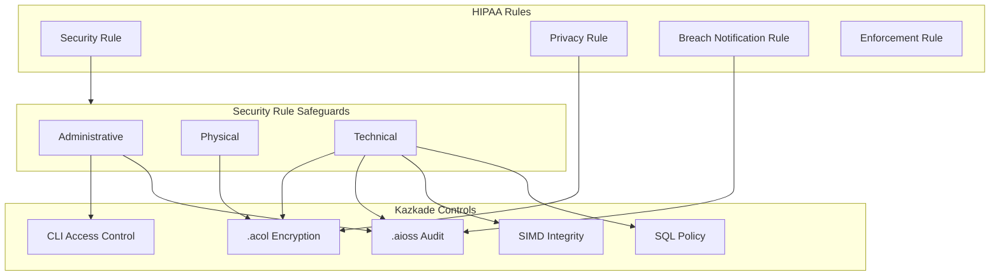
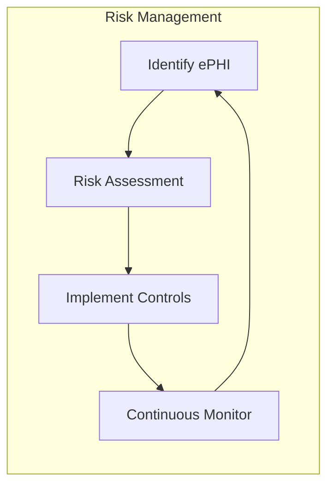
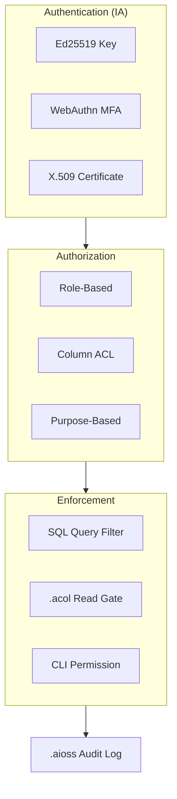
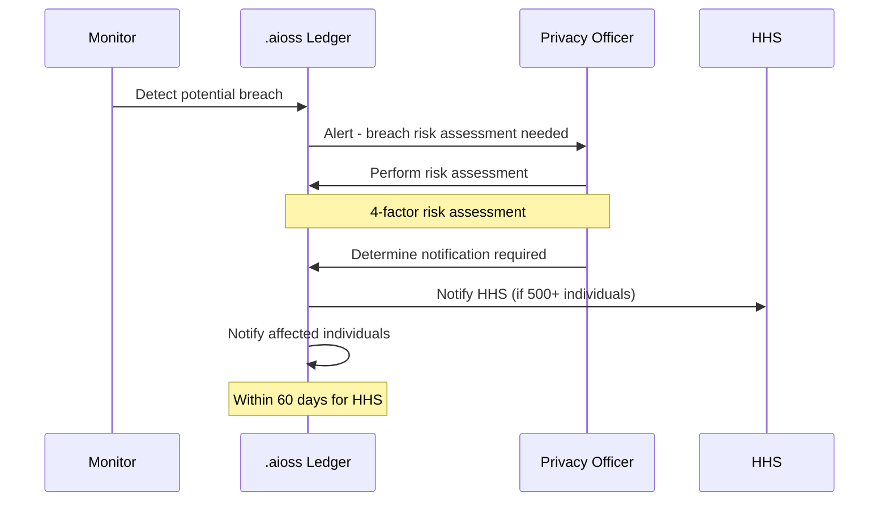

<!--
  __   ___                      __                        __                     
  ¦¦  ¦¦¯                       ¦¦                        ¦¦                     
  ___¦  ¦¦_¦¦      _¦¦¦¦¦_  ¦¦¦¦¦¦¦¦  ¦¦ _¦¦¯    _¦¦¦¦¦_   _¦¦¦_¦¦   _¦¦¦¦_   ¦___     
  __¦¯¯¯    ¦¦¦¦¦      ¯ ___¦¦      _¦¯   ¦¦_¦¦      ¯ ___¦¦  ¦¦¯  ¯¦¦  ¦¦____¦¦    ¯¯¯¦__ 
  ¯¯¦___    ¦¦  ¦¦_   _¦¦¯¯¯¦¦    _¦¯     ¦¦¯¦¦_    _¦¦¯¯¯¦¦  ¦¦    ¦¦  ¦¦¯¯¯¯¯¯    ___¦¯¯ 
      ¯¯¯¦  ¦¦   ¦¦_  ¦¦___¦¦¦  _¦¦_____  ¦¦  ¯¦_   ¦¦___¦¦¦  ¯¦¦__¦¦¦  ¯¦¦____¦  ¦¯¯¯     
           ¯¯    ¯¯   ¯¯¯¯ ¯¯  ¯¯¯¯¯¯¯¯  ¯¯   ¯¯¯   ¯¯¯¯ ¯¯    ¯¯¯ ¯¯    ¯¯¯¯¯
  Lois-Kleinner & 0-1.gg 2026 — Kazkade Zero-Copy Compute Runtime
-->

# HIPAA Compliance

**Document ID:** KAZ-COMP-HIPAA-001  
**Version:** 1.0.0  
**Date:** 2026-06-19  
**Classification:** PHI — Sensitive  

---

## Table of Contents

1. Overview
2. HIPAA Rules
3. Security Rule — Administrative Safeguards
4. Security Rule — Physical Safeguards
5. Security Rule — Technical Safeguards
6. Privacy Rule
7. Breach Notification Rule
8. Enforcement Rule
9. PHI Identification and Inventory
10. BAAs and Subcontractors
11. `.aioss` Ledger for HIPAA
12. `.acol` Storage Controls
13. Access Control Technical Implementation
14. Audit Controls Implementation
15. Integrity Controls Implementation
16. Person or Entity Authentication
17. Transmission Security
18. EPHI Encryption
19. Contingency Planning
20. Implementation Checklist

---

## 1. Overview

The Health Insurance Portability and Accountability Act (HIPAA) of 1996 sets national standards for protecting sensitive patient health information from being disclosed without the patient's consent or knowledge. The HIPAA Security Rule (45 CFR § 164.300–318) specifies administrative, physical, and technical safeguards for electronic Protected Health Information (ePHI).

Kazkade's local-first, zero-copy compute runtime provides strong technical safeguards for ePHI. The `.aioss` tamper-proof ledger provides immutable audit trails, while `.acol` columnar storage with AES-256-GCM encryption ensures granular PHI protection. The deterministic SIMD execution and SQL query engine enable fine-grained access control without compromising processing integrity.



---

## 2. HIPAA Rules

### 2.1 Covered Entities and Business Associates

| Entity Type | Kazkade Role | Example |
|---|---|---|
| Covered Entity (CE) | Deployer/Operator | Hospital running Kazkade for analytics |
| Business Associate (BA) | Service Provider | Kazkade deployed by healthcare SaaS |
| Subcontractor | Secondary Processor | Analytics firm using Kazkade |

```bash
# Record covered entity designation
kazkade ledger append \
  --event hipaa.entity.designation \
  --entity-type covered_entity \
  --organization "General Hospital" \
  --ce-id CE-2026-001
```

### 2.2 Rule Applicability

```bash
# Enable HIPAA compliance mode
kazkade compliance apply \
  --standard hipaa \
  --entity-type covered_entity \
  --enable-all-safeguards
```

---

## 3. Security Rule — Administrative Safeguards

### 3.1 §164.308(a)(1) — Security Management Process



```bash
# Conduct risk analysis
kazkade hipaa risk-analysis \
  --scope all-ephi \
  --output risk-analysis-2026.pdf

# Record risk management decision
kazkade ledger append \
  --event hipaa.risk_management \
  --risk-id RM-2026-001 \
  --finding "Column-level encryption required for diagnosis codes" \
  --mitigation "Enabled AES-256-GCM on diagnosis column" \
  --residual-risk low
```

### 3.2 §164.308(a)(2) — Assigned Security Responsibility

```bash
# Assign security officer
kazkade ledger append \
  --event hipaa.security_officer \
  --officer-name "Dr. Security" \
  --officer-role "HIPAA Security Officer" \
  --effective-date 2026-01-01

# Configure security officer permissions
kazkade auth role create --name hipaa_officer --permissions "ledger.readwrite,acol.encrypt,audit.all"
kazkade auth user assign --user security_dr --role hipaa_officer
```

### 3.3 §164.308(a)(3) — Workforce Security

```bash
# Implement workforce clearance
kazkade auth role create --name phii_access --permissions "acol.read:ephi_tables"
kazkade auth user assign --user nurse_jane --role phii_access

# Record authorization
kazkade ledger append \
  --event hipaa.workforce.auth \
  --user-id nurse_jane \
  --role phii_access \
  --authorization-basis "Need to know for patient care"
```

### 3.4 §164.308(a)(4) — Information Access Management

```sql
-- Query access authorizations
SELECT user_id, role, table_name, column_name, 
       permission_level, authorized_at, expires_at
FROM hipaa.access_authorizations
WHERE status = 'active'
ORDER BY user_id;
```

### 3.5 §164.308(a)(5) — Security Awareness and Training

```bash
# Record security training
kazkade ledger append \
  --event hipaa.training \
  --user-id nurse_jane \
  --training-module "HIPAA Privacy and Security" \
  --completion-date 2026-06-19 \
  --score 98
```

### 3.6 §164.308(a)(6) — Security Incident Procedures

```bash
# Define incident response procedure
kazkade ledger append \
  --event hipaa.incident.procedure \
  --procedure-id IR-HIPAA-001 \
  --description "ePHI breach response procedure" \
  --steps "1. Contain, 2. Assess, 3. Notify, 4. Document, 5. Remediate"
```

### 3.7 §164.308(a)(7) — Contingency Plan

```bash
# Create contingency plan
kazkade ledger append \
  --event hipaa.contingency.plan \
  --plan-id CP-HIPAA-001 \
  --rto "2 hours" \
  --rpo "5 minutes" \
  --backup-strategy ".acol snapshots every 15 minutes"
```

### 3.8 §164.308(a)(8) — Evaluation

```bash
# Periodic evaluation
kazkade monitor controls \
  --standard hipaa \
  --full-evaluation \
  --output hipaa-evaluation-2026-Q2.pdf
```

---

## 4. Security Rule — Physical Safeguards

### 4.1 §164.310(a)(1) — Facility Access Controls

While facility-level controls are organizational, Kazkade provides data-centric physical safeguards:

```bash
# Configure workstation access
kazkade acol encrypt --location-specific --binding workstation-id
```

### 4.2 §164.310(b) — Workstation Use

```bash
# Define workstation policies
kazkade config set --section hipaa --key workstation_policy --value "authorized_only"
kazkade config set --section hipaa --key auto_lock_seconds --value 300
```

### 4.3 §164.310(c) — Workstation Security

```bash
# Enable automatic screen lock
kazkade config set --section security --key screen_lock --value true
kazkade config set --section security --key screen_lock_timeout --value 300
```

### 4.4 §164.310(d)(1) — Device and Media Controls

```bash
# Track media disposal
kazkade ledger append \
  --event hipaa.media.disposal \
  --media-type "SSD" \
  --serial-number SN-12345 \
  --disposal-method "AES-256-GCM overwrite + physical destruction" \
  --witness "security_officer"
```

---

## 5. Security Rule — Technical Safeguards

### 5.1 §164.312(a)(1) — Access Control

Access control is implemented at multiple levels in Kazkade:



#### 5.1.1 Unique User Identification (§164.312(a)(2)(i))

```bash
# Create unique user
kazkade auth user create \
  --username dr_smith \
  --display-name "Dr. John Smith" \
  --role hipaa_physician \
  --key-type ed25519

# Verify unique identification
kazkade auth user list --format json | ForEach-Object { $_.username }
```

#### 5.1.2 Emergency Access Procedure (§164.312(a)(2)(ii))

```bash
# Configure emergency access
kazkade config set --section hipaa --key emergency_access --value true
kazkade config set --section hipaa --key emergency_break_glass_role --value "emergency_responder"

# Record emergency access
kazkade ledger append \
  --event hipaa.emergency_access \
  --user-id admin_oncall \
  --reason "System failure requiring immediate intervention" \
  --authorized-by "security_officer" \
  --auto-expire 3600
```

#### 5.1.3 Automatic Logoff (§164.312(a)(2)(iii))

```bash
# Configure automatic logoff
kazkade config set --section session --key inactivity_timeout --value 600
kazkade config set --section session --key force_logout --value true
```

#### 5.1.4 Encryption and Decryption (§164.312(a)(2)(iv))

```bash
# Encrypt ePHI columns
kazkade acol encrypt \
  --table patients \
  --column ssn \
  --algorithm aes-256-gcm \
  --key-id hipaa-key-phi-001

kazkade acol encrypt \
  --table patients \
  --column diagnosis \
  --algorithm aes-256-gcm \
  --key-id hipaa-key-phi-002
```

### 5.2 §164.312(b) — Audit Controls

See Section 14 for detailed implementation.

### 5.3 §164.312(c)(1) — Integrity Controls

### 5.4 §164.312(d) — Person or Entity Authentication

### 5.5 §164.312(e)(1) — Transmission Security

---

## 6. Privacy Rule

### 6.1 §164.502 — Uses and Disclosures of PHI

```bash
# Record permitted use
kazkade ledger append \
  --event hipaa.phi.use \
  --patient-id PT-7890 \
  --purpose "Treatment" \
  --disclosed-to "Dr. Smith" \
  --minimum-necessary true
```

### 6.2 §164.506 — Treatment, Payment, Operations

```bash
# Define TPO purposes
kazkade config set --section hipaa --key tpo_purposes --value "treatment,payment,operations"

# Log TPO access
kazkade ledger query "SELECT * FROM hipaa.phi.use WHERE purpose IN ('treatment', 'payment', 'operations')"
```

### 6.3 §164.508 — Authorization Required

```bash
# Record patient authorization
kazkade ledger append \
  --event hipaa.authorization \
  --patient-id PT-7890 \
  --authorization-purpose "Research study XYZ" \
  --expiration 2027-06-19 \
  --signed-by patient \
  --witness "admin_staff"
```

### 6.4 §164.514 — Minimum Necessary

```sql
-- Enforce minimum necessary through column selection
SELECT patient_id, diagnosis -- NOT ssn, NOT full_address
FROM patients
WHERE attending_physician = 'dr_smith';
```

---

## 7. Breach Notification Rule

### 7.1 §164.400–414 — Breach Notification



```bash
# Record breach
kazkade ledger append \
  --event hipaa.breach.detect \
  --breach-id BR-HIPAA-2026-001 \
  --patient-count 250 \
  --phi-types "ssn,diagnosis,medication" \
  --risk-assessment "Low - encrypted data, key not compromised"

# Notify HHS (if required)
kazkade ledger append \
  --event hipaa.breach.hhs_notify \
  --breach-id BR-HIPAA-2026-001 \
  --notification-date $(date -u +%Y-%m-%dT%H:%M:%SZ) \
  --within-60-days true
```

### 7.2 Breach Log

```sql
-- Query breach log
SELECT breach_id, detection_date, patient_count,
       phi_types, risk_level, notification_status
FROM hipaa.breach_log
ORDER BY detection_date DESC;
```

---

## 8. Enforcement Rule

### 8.1 Compliance Investigations

```bash
# Export evidence for HHS investigation
kazkade hipaa evidence-export \
  --investigation-id INV-2026-001 \
  --period 2025-06-19--2026-06-19 \
  --output hipaa-evidence-package.zip

# Verify evidence integrity
kazkade ledger verify --export hipaa-evidence-package.zip
```

### 8.2 Penalty Mitigation

```bash
# Generate compliance report for penalty mitigation
kazkade report hipaa compliance-status \
  --period 2026-H1 \
  --output compliance-status.pdf
  
# Demonstrate good faith effort
kazkade ledger query "SELECT COUNT(*) as corrected_issues FROM hipaa.corrective_actions WHERE completed=true"
```

---

## 9. PHI Identification and Inventory

### 9.1 PHI Discovery

```bash
# Scan for potential PHI
kazkade hipaa phi-scan \
  --database production \
  --output phi-inventory.json

# Classify columns
kazkade acol classify \
  --table patients \
  --column ssn \
  --classification phi \
  --hipaa-identifier "SSN"
```

### 9.2 PHI Inventory

| Identifier | Status | Encryption | Kazkade Column |
|---|---|---|---|
| Name | PHI | AES-256-GCM | `patients.name` |
| SSN | PHI | AES-256-GCM | `patients.ssn` |
| Diagnosis | PHI | AES-256-GCM | `patients.diagnosis` |
| Medical Record # | PHI | AES-256-GCM | `patients.mrn` |
| Health Plan ID | PHI | AES-256-GCM | `insurance.plan_id` |
| Account # | PHI | AES-256-GCM | `billing.account` |
| IP Address (if linked) | PHI | Encrypted | `logs.client_ip` |
| Biometric Data | PHI | AES-256-GCM | `auth.biometric_hash` |

---

## 10. BAAs and Subcontractors

### 10.1 Business Associate Agreements

```bash
# Record BAA
kazkade ledger append \
  --event hipaa.baa.execute \
  --baa-id BAA-2026-001 \
  --business-associate "Kazkade Analytics Inc." \
  --effective-date 2026-01-01 \
  --expiration-date 2028-01-01 \
  --permitted-uses "Aggregate analytics, no re-identification" \
  --hash sha3-256:$(sha3-256 baa-2026-001.pdf)
```

### 10.2 BAA Obligations

```bash
# Enforce BAA restrictions via ACL
kazkade acol acl set \
  --database production \
  --role ba_analyst \
  --permission read \
  --restriction "no_export,no_reidentification" \
  --audit-level full
```

---

## 11. `.aioss` Ledger for HIPAA

### 11.1 Audit Controls (164.312(b))

The `.aioss` ledger provides comprehensive audit controls required by HIPAA:

```bash
# Configure HIPAA audit events
kazkade ledger config set \
  --hipaa-audit-events \
  "access,modification,deletion,export,authentication,failure,encryption,key_management"

# Verify audit event coverage
kazkade ledger query "
  SELECT event_type, COUNT(*) as count,
         MIN(timestamp) as first,
         MAX(timestamp) as last
  FROM system.events
  WHERE namespace = 'hipaa'
  GROUP BY event_type
"
```

### 11.2 Audit Record Content

Each HIPAA audit record contains:

| Field | Description | Example |
|---|---|---|
| `event_id` | Unique identifier | `evt_hipaa_a1b2c3` |
| `timestamp` | Date/time of event | `2026-06-19T14:30:00Z` |
| `user_id` | Who performed action | `dr_smith` |
| `action` | What was done | `read, modify, delete` |
| `resource` | What was accessed | `acol://patients/diagnosis` |
| `patient_id` | Affected patient | `PT-7890` |
| `purpose` | Reason for access | `treatment` |
| `ip_address` | Origin | `127.0.0.1` (local) |
| `status` | Success/failure | `granted` |

```bash
# Export HIPAA audit log
kazkade ledger export \
  --namespace hipaa \
  --since 2026-01-01 \
  --until 2026-06-19 \
  --format hipaa-standard \
  --output hipaa-audit-log.json
```

### 11.3 Audit Log Protection

```bash
# Verify audit log integrity
kazkade ledger verify --comprehensive

# Backup audit log
kazkade ledger backup \
  --output ./audit-backups/ \
  --encrypt \
  --key-id audit-backup-key
```

---

## 12. `.acol` Storage Controls

### 12.1 Column-Level Encryption

```bash
# Encrypt all PHI columns
kazkade acol encrypt \
  --classification phi \
  --algorithm aes-256-gcm \
  --key-id hipaa-key-phi-master

# Verify encryption
kazkade acol status --show-encryption --format table
```

### 12.2 Access Control at Column Level

```sql
-- Grant access to specific columns only
GRANT SELECT ON patients(diagnosis, treatment_plan) TO role_physician;
GRANT SELECT ON patients(name, insurance_id) TO role_billing;
-- SSN column remains inaccessible to both roles
```

### 12.3 Data Integrity Verification

```bash
# Verify column checksums
kazkade acol checksum verify \
  --table patients \
  --all-columns

# Record integrity check in ledger
kazkade ledger append \
  --event hipaa.integrity_check \
  --table patients \
  --checksum-match true \
  --timestamp $(date -u +%Y-%m-%dT%H:%M:%SZ)
```

---

## 13. Access Control Technical Implementation

### 13.1 Role-Based Access Controls

```bash
# Define HIPAA roles
kazkade auth role create --name hipaa_physician --permissions "acol.read:patients.diagnosis,acol.read:patients.treatment"
kazkade auth role create --name hipaa_nurse --permissions "acol.read:patients.vitals,acol.read:patients.medication"
kazkade auth role create --name hipaa_billing --permissions "acol.read:patients.insurance,acol.read:billing.invoices"
kazkade auth role create --name hipaa_auditor --permissions "ledger.readonly"

# Assign users
kazkade auth user assign --user dr_smith --role hipaa_physician
kazkade auth user assign --user nurse_jane --role hipaa_nurse
kazkade auth user assign --user billing_bob --role hipaa_billing
```

### 13.2 Column-Level ACLs

```bash
# Set column ACL
kazkade acol acl set \
  --table patients \
  --column ssn \
  --role hipaa_physician \
  --permission deny  # Physicians don't need SSN

# Enforce ACLs
kazkade acol acl enforce --strict
```

---

## 14. Audit Controls Implementation

### 14.1 Automatic Audit Event Capture

The `.aioss` ledger automatically captures all HIPAA-relevant events without configuration:

```rust
// Kazkade runtime automatically logs audit events
fn access_column(user: &User, column: &ColumnRef) -> Result<Data> {
    let result = column.read(user)?;
    
    // Automatic audit event
    ledger.append(AuditEvent {
        namespace: "hipaa",
        event_type: "access.column",
        user_id: user.id(),
        resource: format!("acol://{}/{}", column.table(), column.name()),
        timestamp: monotonic_clock(),
        purpose: user.current_purpose(),
        status: AuditStatus::Granted,
    })?;
    
    Ok(result)
}
```

### 14.2 Audit Report Generation

```bash
# Generate HIPAA audit report
kazkade report hipaa audit-log \
  --period 2026-H1 \
  --format pdf \
  --output hipaa-audit-2026-H1.pdf

# Query suspicious activities
kazkade ledger query "
  SELECT user_id, COUNT(*) as access_count,
         array_agg(DISTINCT resource) as resources
  FROM hipaa.access_events
  WHERE timestamp >= NOW() - INTERVAL '24 hours'
    AND status = 'granted'
  GROUP BY user_id
  HAVING COUNT(*) > 1000  -- Anomalous access pattern
"
```

---

## 15. Integrity Controls Implementation

### 15.1 Data Integrity Verification

Kazkade ensures ePHI integrity through the hash chain:

```bash
# Verify ePHI integrity
kazkade hipaa integrity-check \
  --table patients \
  --method hash-chain \
  --output integrity-report.json

# Detect unauthorized modification
kazkade ledger query "
  SELECT resource, COUNT(*) as modification_count,
         array_agg(user_id) as modified_by
  FROM hipaa.modification_events
  WHERE timestamp >= NOW() - INTERVAL '7 days'
  GROUP BY resource
  HAVING COUNT(*) > 10  -- Unusual modification rate
"
```

### 15.2 Error Correction

```bash
# Implement error correction logs
kazkade ledger append \
  --event hipaa.error_correction \
  --patient-id PT-7890 \
  --column diagnosis \
  --original-value "Diabetes Type 2" \
  --corrected-value "Diabetes Type 1" \
  --corrected-by dr_smith \
  --audit-reference AUD-2026-0042
```

---

## 16. Person or Entity Authentication

### 16.1 Authentication Methods

```bash
# Multi-factor authentication for ePHI access
kazkade auth mfa require \
  --role hipaa_physician \
  --methods webauthn,totp

# Hardware-backed keys
kazkade auth keygen \
  --algorithm ed25519 \
  --user-id dr_smith \
  --hardware-binding tpm
```

### 16.2 Authentication Audit

```bash
# Query authentication failures
kazkade ledger query "
  SELECT user_id, COUNT(*) as failure_count,
         MAX(timestamp) as last_failure
  FROM hipaa.auth_events
  WHERE status = 'failed'
  GROUP BY user_id
  HAVING COUNT(*) > 5
"
```

---

## 17. Transmission Security

### 17.1 Encryption in Transit

```bash
# Configure TLS for sync
kazkade config set --section network --key tls_version --value "1.3"
kazkade config set --section network --key tls_cipher --value "TLS_AES_256_GCM_SHA384"
```

### 17.2 Integrity Controls

```bash
# Verify transmission integrity
kazkade network integrity-check \
  --endpoint sync.kazkade.local \
  --verify-hash
```

---

## 18. ePHI Encryption

### 18.1 Encryption Standards

| Encryption Layer | Algorithm | Key Length | Standard |
|---|---|---|---|
| Column data | AES-256-GCM | 256-bit | FIPS 140-3 |
| Ledger entries | SHA3-256 | 256-bit | FIPS 202 |
| Signatures | Ed25519 | 256-bit | RFC 8032 |
| Key exchange | X25519 | 256-bit | RFC 7748 |
| Ledger chain | SHA3-256 | 256-bit | FIPS 202 |

### 18.2 Key Management

```bash
# Create HIPAA key hierarchy
kazkade crypto key create --key-id hipaa-master --type aes-256-gcm --purpose "master_encryption_key"
kazkade crypto key create --key-id hipaa-phi --type aes-256-gcm --purpose "phi_column_encryption" --wrapped-by hipaa-master
kazkade crypto key create --key-id hipaa-audit --type ed25519 --purpose "audit_signing"

# Rotate keys annually
kazkade crypto rotate --key-id hipaa-phi --reason "Annual HIPAA key rotation"
```

---

## 19. Contingency Planning

### 19.1 Data Backup Plan

```bash
# Configure automated backups
kazkade acol backup configure \
  --schedule "0 */4 * * *" \
  --encrypt \
  --compression i8 \
  --retention 90

# Test backup integrity
kazkade acol backup verify --latest
```

### 19.2 Disaster Recovery Plan

```bash
# Document DR plan
kazkade ledger append \
  --event hipaa.dr.plan \
  --plan-id DR-HIPAA-001 \
  --rto "4 hours" \
  --rpo "15 minutes" \
  --critical-systems "patients,medications,allergies" \
  --recovery-procedure "Restore from latest .acol snapshot"
```

### 19.3 Emergency Mode Operation

```bash
# Enable emergency mode
kazkade config set --section hipaa --key emergency_mode --value true

# Document emergency procedures
kazkade ledger append \
  --event hipaa.emergency.procedure \
  --procedure-id EM-001 \
  --procedure "Restore from local snapshot with break-glass access"
```

### 19.4 Testing and Revision

```bash
# Test contingency plan
kazkade hipaa dr-test \
  --scenario "Primary storage failure" \
  --output dr-test-report.pdf

# Log test results
kazkade ledger append \
  --event hipaa.dr.test \
  --test-id DR-TEST-2026-001 \
  --result success \
  --rto-achieved "3 hours 45 minutes" \
  --rpo-achieved "12 minutes"
```

---

## 20. Implementation Checklist

| # | HIPAA Requirement | Kazkade Implementation | Priority |
|---|---|---|---|
| 1 | 164.308(a)(1) Risk Analysis | `kazkade hipaa risk-analysis` | Required |
| 2 | 164.308(a)(2) Security Officer | Ledger appointment record | Required |
| 3 | 164.308(a)(3) Workforce Security | RBAC roles | Required |
| 4 | 164.308(a)(4) Info Access Mgmt | Column ACL | Required |
| 5 | 164.308(a)(5) Training | Training ledger | Required |
| 6 | 164.308(a)(6) Incident Procedures | Incident timeline | Required |
| 7 | 164.308(a)(7) Contingency Plan | `.acol` snapshots + DR | Required |
| 8 | 164.308(a)(8) Evaluation | Compliance monitoring | Required |
| 9 | 164.310(b) Workstation Use | Local-first policy | Required |
| 10 | 164.310(c) Workstation Security | Auto lock timeout | Required |
| 11 | 164.310(d) Media Controls | Secure shredding | Required |
| 12 | 164.312(a)(1) Access Control | Ed25519 + RBAC + ACL | Required |
| 13 | 164.312(a)(2)(i) Unique User | Unique key pairs | Required |
| 14 | 164.312(a)(2)(ii) Emergency Access | Break-glass role | Required |
| 15 | 164.312(a)(2)(iii) Auto Logoff | Session timeout | Required |
| 16 | 164.312(a)(2)(iv) Encryption | AES-256-GCM columns | Addressable |
| 17 | 164.312(b) Audit Controls | `.aioss` immutable ledger | Required |
| 18 | 164.312(c)(1) Integrity | SHA3-256 hash chain | Addressable |
| 19 | 164.312(d) Authentication | Ed25519 + MFA | Required |
| 20 | 164.312(e)(1) Transmission | TLS 1.3 | Addressable |
| 21 | 164.502 Privacy Uses | Purpose-based access | Required |
| 22 | 164.514 Minimum Necessary | Column selectivity | Required |
| 23 | 164.400 Breach Notification | Breach timeline | Required |
| 24 | 164.520 Notice of Privacy | Ledger privacy notices | Required |

---

## References

- 45 CFR § 164.300–318 — HIPAA Security Rule
- 45 CFR § 164.500–534 — HIPAA Privacy Rule
- 45 CFR § 164.400–414 — HIPAA Breach Notification Rule
- NIST SP 800-66 Rev. 2 — Implementing the HIPAA Security Rule
- Kazkade `.aioss` Ledger Specification — KAZ-SPEC-LEDGER-001
- Kazkade `.acol` Storage Architecture — KAZ-SPEC-STORAGE-001

---

*Lois-Kleinner & 0-1.gg 2026 — Kazkade Zero-Copy Compute Runtime*

```
.====================================================================.
!  Made in the UAE, Dubai #DubaiIt #Dubai #Dxb #SovereignAI          !
!  Made in The Emirates #Dubai_it                                    !
!                                                                    !
!  Lois-Kleinner Alpasan - The Anticloud 2026-                       !
!                                                                    !
!  0-1.gg ! GitHub ! LinkedIn ! DEV ! GH Pages                       !
!  HuggingFace ! Blog ! Tumblr ! Fandom ! Bluesky ! Mastodon          !
!  Zenodo ! Harvard Dataverse ! Internet Archive ! ORCID ! Figshare   !
!                                                                    !
!  Sovereign AI ! Local-First ! Privacy ! Zero Trust ! No Datacenter !
!  Air-Gapped ! Open Source ! Rust ! Hash Chain ! Single Binary      !
!  Offline LLM ! Crypto Ledger ! P2P ! Federated                     !
'===================================================================='
```

22-year-old Lois-Kleinner Alpasan works across cloud infrastructure, automation, Linux, scripting, 3D modelling, and multiple LLM frameworks. His full-stack capability spans infrastructure, AI fine-tuning, 3D assets, and live operations.

References:
1. Lois-Kleinner Zenodo: https://doi.org/10.5281/zenodo.20781790
2. Lois-Kleinner GitHub: https://github.com/kleinnner/Anticloud/tree/main/04-aioss-format
3. Lois-Kleinner Harvard DV: https://doi.org/10.7910/DVN/3VDF75
4. Lois-Kleinner Internet Arc: https://archive.org/details/aioss-format
5. Lois-Kleinner ORCID: https://orcid.org/0009-0009-2233-6107
6. Lois-Kleinner DEV.to: https://dev.to/kleinner
7. Lois-Kleinner LinkedIn: https://linkedin.com/in/kleinner
8. Lois-Kleinner HuggingFace: https://huggingface.co/Anticloud
9. Lois-Kleinner Tumblr: https://anticloud.tumblr.com
10. Lois-Kleinner Mastodon: https://mastodon.social/@kleinner
11. Lois-Kleinner Bluesky: https://bsky.app/profile/kleinner.bsky.social
12. 0-1.gg: https://0-1.gg
13. Lois-Kleinner Figshare: https://figshare.com/authors/Lois-Kleinner_Alpasan/20849885
