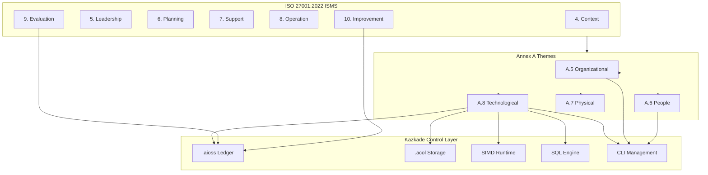
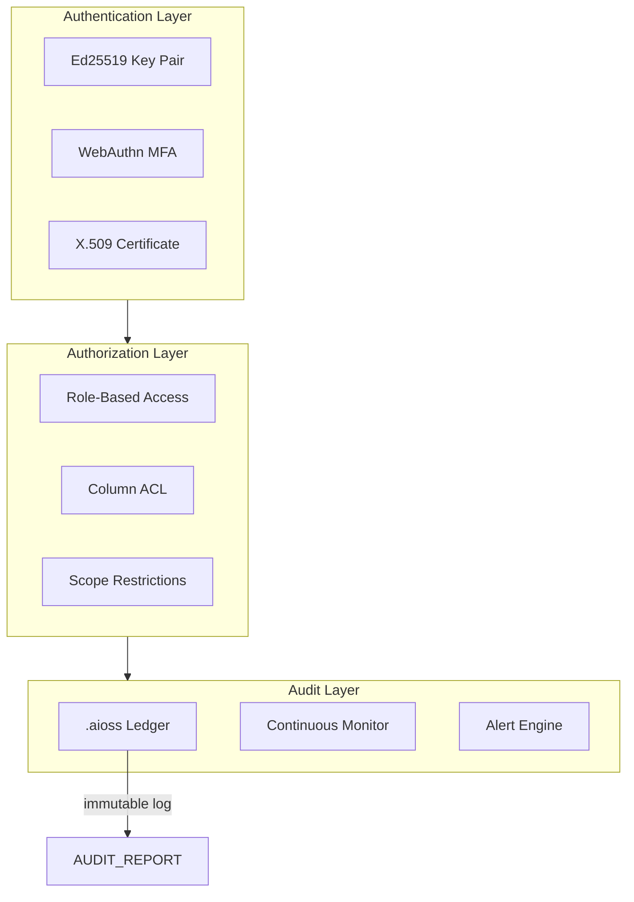
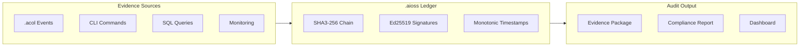
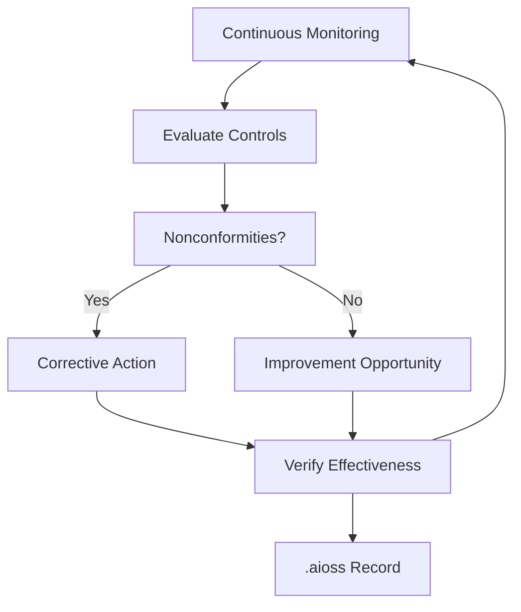

<!--
  __   ___                      __                        __                     
  ¦¦  ¦¦¯                       ¦¦                        ¦¦                     
  ___¦  ¦¦_¦¦      _¦¦¦¦¦_  ¦¦¦¦¦¦¦¦  ¦¦ _¦¦¯    _¦¦¦¦¦_   _¦¦¦_¦¦   _¦¦¦¦_   ¦___     
  __¦¯¯¯    ¦¦¦¦¦      ¯ ___¦¦      _¦¯   ¦¦_¦¦      ¯ ___¦¦  ¦¦¯  ¯¦¦  ¦¦____¦¦    ¯¯¯¦__ 
  ¯¯¦___    ¦¦  ¦¦_   _¦¦¯¯¯¦¦    _¦¯     ¦¦¯¦¦_    _¦¦¯¯¯¦¦  ¦¦    ¦¦  ¦¦¯¯¯¯¯¯    ___¦¯¯ 
      ¯¯¯¦  ¦¦   ¦¦_  ¦¦___¦¦¦  _¦¦_____  ¦¦  ¯¦_   ¦¦___¦¦¦  ¯¦¦__¦¦¦  ¯¦¦____¦  ¦¯¯¯     
           ¯¯    ¯¯   ¯¯¯¯ ¯¯  ¯¯¯¯¯¯¯¯  ¯¯   ¯¯¯   ¯¯¯¯ ¯¯    ¯¯¯ ¯¯    ¯¯¯¯¯
  Lois-Kleinner & 0-1.gg 2026 — Kazkade Zero-Copy Compute Runtime
-->

# ISO 27001:2022 Alignment

**Document ID:** KAZ-COMP-ISO27K-001  
**Version:** 1.0.0  
**Date:** 2026-06-19  
**Classification:** Internal — Compliance Evidence  

---

## Table of Contents

1. Overview
2. ISMS Context (Clauses 4–10)
3. Annex A Control Mapping
4. A.5 — Organizational Controls
5. A.6 — People Controls
6. A.7 — Physical Controls
7. A.8 — Technological Controls
8. `.aioss` Ledger as ISMS Evidence
9. `.acol` Storage in ISMS Scope
10. Risk Treatment with Kazkade
11. Statement of Applicability
12. Continuous Improvement
13. Internal Audit Automation
14. Management Review
15. Implementation Roadmap

---

## 1. Overview

ISO 27001:2022 is the international standard for Information Security Management Systems (ISMS). It specifies requirements for establishing, implementing, maintaining, and continually improving an ISMS. The standard consists of normative clauses (4–10) and an Annex A containing 93 controls organized into 4 themes.

Kazkade provides native technological controls that satisfy a significant portion of Annex A requirements directly. The `.aioss` tamper-proof ledger serves as an automated evidence collection layer for ISMS audits, while the `.acol` columnar storage provides data-level security controls. The local-first architecture reduces the attack surface and simplifies the ISMS scope.



---

## 2. ISMS Context (Clauses 4–10)

### 2.1 Clause 4 — Context of the Organization

Kazkade's local-first architecture determines the ISMS scope: each deployment is a self-contained system with no inherent external dependencies. External parties (cloud providers, third-party services) are excluded from the core scope, simplifying context analysis.

```bash
# Document ISMS scope in .aioss
kazkade ledger append \
  --event isms.scope \
  --scope-id SCOPE-2026-001 \
  --description "Kazkade compute runtime deployment - on-premises only" \
  --boundary "No external cloud dependencies. All data local."
```

### 2.2 Clause 5 — Leadership

Top management demonstrates leadership by approving the ISMS policy and ensuring resources are allocated. Kazkade provides dashboards and reports for management review:

```bash
# Generate management dashboard
kazkade report isms --section leadership --output isms-leadership.pdf

# Record policy approval in ledger
kazkade ledger append \
  --event isms.policy.approved \
  --policy-id ISMS-POL-001 \
  --approver "Chief Information Security Officer" \
  --date 2026-06-19
```

### 2.3 Clause 6 — Planning

Risk assessment and treatment planning are supported by Kazkade's security controls. The `.aioss` ledger records the risk assessment process:

```sql
-- Query current risk treatment status
SELECT risk_id, description, likelihood, impact, 
       risk_score, treatment, control_id
FROM isms.risk_register
WHERE status = 'open'
ORDER BY risk_score DESC;
```

### 2.4 Clause 7 — Support

Resources, competence, awareness, and documented information are managed through the CLI and ledger:

```bash
# Document ISMS procedures in ledger
kazkade ledger append \
  --event isms.document \
  --doc-id DOC-ISMS-007 \
  --title "Incident Response Procedure" \
  --version "2.1"
```

### 2.5 Clause 8 — Operation

Operational planning and control are executed through Kazkade's runtime. Security controls are implemented at the `.acol` storage layer and enforced by the SQL engine:

```bash
# Execute operational controls assessment
kazkade monitor controls --standard iso27001 --output operational-assessment.json
```

### 2.6 Clause 9 — Evaluation

Monitoring, measurement, analysis, and evaluation are automated through continuous monitoring:

```bash
# Schedule internal audit
kazkade monitor schedule --audit iso27001 --interval weekly

# Generate evaluation report
kazkade report isms --section evaluation --output eval-report.pdf
```

### 2.7 Clause 10 — Improvement

Nonconformities and corrective actions are tracked in the `.aioss` ledger:

```bash
# Record nonconformity
kazkade ledger append \
  --event isms.nonconformity \
  --nc-id NC-2026-0012 \
  --description "Access control review overdue" \
  --severity medium \
  --corrective-action "Schedule immediate access review"

# Track corrective action completion
kazkade ledger query "SELECT * FROM isms.nonconformity WHERE status != 'closed'"
```

---

## 3. Annex A Control Mapping

The following table maps ISO 27001:2022 Annex A controls to Kazkade components.

| Control ID | Control Name | Kazkade Component | Implementation |
|---|---|---|---|
| A.5.1 | Information Security Policy | CLI + `.aioss` | Policy documents signed and stored in ledger |
| A.5.2 | Information Security Roles | CLI RBAC | Ed25519 role-based access control |
| A.5.3 | Segregation of Duties | `.aioss` approvals | Multi-signature authorization |
| A.5.4 | Management Responsibilities | Ledger oversight | Automated management reporting |
| A.5.5 | Contact with Authorities | Ledger events | Regulatory notification tracking |
| A.5.6 | Contact with Special Interest Groups | N/A | External |
| A.5.7 | Threat Intelligence | Continuous monitoring | Automated threat feed integration |
| A.5.8 | Information Security in Project Management | CLI lifecycle | Project security gates |
| A.5.9 | Inventory of Information Assets | `.acol` catalog | `kazkade acol list` |
| A.5.10 | Acceptable Use | ACL enforcement | Column/table access controls |
| A.5.11 | Return of Assets | Ledger deprovisioning | Asset transfer tracking |
| A.5.12 | Classification of Information | `.acol` labels | Column classification metadata |
| A.5.13 | Labeling of Information | `.acol` metadata | Classification in file headers |
| A.5.14 | Information Transfer | Encrypted sync | TLS 1.3 sync channels |
| A.5.15 | Access Control | RBAC + Ed25519 | Multi-layer access control |
| A.5.16 | Identity Management | CLI user management | Ed25519 key pairs |
| A.5.17 | Authentication | Ed25519 + MFA | Strong cryptographic auth |
| A.5.18 | Access Rights | `.aioss` ACL events | Immutable access right records |
| A.5.19 | Information Security in Supplier Relationships | N/A | Local-first scope |
| A.5.20 | Addressing Security Within Supplier Agreements | N/A | Local-first scope |
| A.5.21 | Managing Security in ICT Supply Chain | Supply chain audit | Binary provenance |
| A.5.22 | Monitoring, Review, and Change Management | `.aioss` change events | Immutable change log |
| A.5.23 | Information Security for Use of Cloud Services | N/A | Local-first architecture |
| A.5.24 | Information Security Incident Management | Ledger incidents | Incident timeline |
| A.5.25 | Assessment of Information Security Incidents | SQL analytics | Incident trend analysis |
| A.5.26 | Response to Information Security Incidents | Automated response | Ledger-based playbooks |
| A.5.27 | Learning from Information Security Incidents | Ledger post-mortems | Immutable lessons learned |
| A.5.28 | Collection of Evidence | `.aioss` evidence | Automated evidence capture |
| A.5.29 | Information Security During Disruption | Local-first resilience | Offline operation |
| A.5.30 | ICT Readiness for Business Continuity | Snapshot/restore | `.acol` disaster recovery |
| A.5.31 | Legal, Statutory, Regulatory Requirements | Compliance mapping | Automated compliance checks |
| A.5.32 | Intellectual Property Rights | Binary licensing | License audit in ledger |
| A.5.33 | Protection of Records | `.aioss` ledger | Immutable record storage |
| A.5.34 | Privacy and Protection of PII | Column encryption | AES-256-GCM per column |
| A.5.35 | Independent Review of ISMS | Ledger exports | Auditor access mode |
| A.5.36 | Compliance with Policies | Continuous monitoring | Automated control testing |
| A.5.37 | Documented Operating Procedures | Ledger procedures | Immutable procedure docs |
| A.6.1 | Screening | N/A | HR process |
| A.6.2 | Terms and Conditions of Employment | N/A | HR process |
| A.6.3 | Information Security Awareness | Training records | Ledger-based training tracking |
| A.6.4 | Disciplinary Process | N/A | HR process |
| A.6.5 | Responsibilities After Termination | Access revocation | Immediate key revocation |
| A.6.6 | Confidentiality Agreements | Ledger NDAs | Signed agreements |
| A.6.7 | Remote Working | Local-first security | No remote dependency |
| A.6.8 | Information Security Event Reporting | `.aioss` events | Automated event reporting |
| A.7.1 | Physical Security Perimeter | N/A | Facility controls |
| A.7.2 | Physical Entry Controls | N/A | Facility controls |
| A.7.3 | Securing Offices, Rooms, and Facilities | N/A | Facility controls |
| A.7.4 | Physical Security Monitoring | N/A | Facility controls |
| A.7.5 | Protecting Against Physical Threats | N/A | Facility controls |
| A.7.6 | Working in Secure Areas | N/A | Facility controls |
| A.7.7 | Clear Desk and Clear Screen | N/A | Facility controls |
| A.7.8 | Equipment Siting and Protection | N/A | Facility controls |
| A.7.9 | Security of Assets Off-Premises | Encryption | Full-disk + column encryption |
| A.7.10 | Storage Media | `.acol` secure erase | `kazkade acol shred` |
| A.7.11 | Supporting Utilities | N/A | Facility controls |
| A.7.12 | Cabling Security | N/A | Facility controls |
| A.7.13 | Equipment Maintenance | Ledger maintenance logs | Immutable maintenance records |
| A.7.14 | Secure Disposal or Reuse of Equipment | Data sanitization | Column-level shredding |
| A.8.1 | User Endpoint Devices | CLI endpoint security | Local runtime controls |
| A.8.2 | Privileged Access Rights | Ed25519 key pairs | Immutable privilege records |
| A.8.3 | Information Access Restriction | Column ACL | Fine-grained access |
| A.8.4 | Access to Source Code | Binary distribution | No source code exposure |
| A.8.5 | Secure Authentication | Ed25519 + MFA | Hardware-backed keys |
| A.8.6 | Capacity Management | Resource monitoring | `kazkade health` |
| A.8.7 | Protection Against Malware | Binary integrity | SHA3-256 binary verification |
| A.8.8 | Management of Technical Vulnerabilities | Update mechanism | Versioned updates via ledger |
| A.8.9 | Configuration Management | `.aioss` config events | Immutable config history |
| A.8.10 | Information Deletion | Secure erasure | Column-level shredding |
| A.8.11 | Data Masking | Column redaction | Query-level masking |
| A.8.12 | Data Leakage Prevention | Local-first design | No data exfiltration paths |
| A.8.13 | Information Backup | `.acol` snapshots | Zero-copy backups |
| A.8.14 | Redundancy of Information Processing Facilities | Local replicas | Offline-capable replicas |
| A.8.15 | Logging | `.aioss` ledger | Immutable system logs |
| A.8.16 | Monitoring Activities | Continuous monitoring | Automated control monitoring |
| A.8.17 | Clock Synchronization | Monotonic clock | Ledger timestamping |
| A.8.18 | Use of Privileged Utility Programs | CLI audit | All CLI commands logged |
| A.8.19 | Installation of Software on Operational Systems | Binary verification | Signed binary updates |
| A.8.20 | Network Controls | N/A | OS-level controls |
| A.8.21 | Security of Network Services | N/A | OS-level controls |
| A.8.22 | Segregation in Networks | N/A | OS-level controls |
| A.8.23 | Web Filtering | N/A | OS-level controls |
| A.8.24 | Use of Cryptography | SHA3-256 + Ed25519 + AES-256-GCM | Built-in crypto primitives |
| A.8.25 | Secure Development Lifecycle | Versioned updates | Immutable release chain |
| A.8.26 | Application Security Requirements | SQL engine validation | Query sanitization |
| A.8.27 | Secure System Architecture | Zero-copy design | Reduced attack surface |
| A.8.28 | Secure Coding | Rust memory safety | Compile-time guarantees |
| A.8.29 | Security Testing in Development | Integrity verification | Automated testing |
| A.8.30 | Outsourced Development | Binary provenance | Signed build chain |
| A.8.31 | Separation of Development, Test, and Production | Ledger environments | Environment isolation in ledger |
| A.8.32 | Change Management | `.aioss` change events | Immutable change record |
| A.8.33 | Test Information | Test data isolation | Separate `.acol` test stores |
| A.8.34 | Protection of Information Systems During Audit | Read-only ledger mode | Auditor access controls |

---

## 4. A.5 — Organizational Controls

### 4.1 A.5.1 — Information Security Policy

The information security policy is documented and recorded in the `.aioss` ledger:

```bash
# Publish policy to ledger
kazkade ledger append \
  --event policy.create \
  --policy-id ISMS-POL-001 \
  --title "Kazkade Information Security Policy" \
  --version 3.2 \
  --approved-by CISO \
  --hash sha3-256:$(sha3-256 policy.pdf)

# Query policy history
kazkade ledger query "SELECT * FROM policy.* WHERE policy_id = 'ISMS-POL-001' ORDER BY timestamp"
```

### 4.2 A.5.15–5.18 — Access Control

Access control is enforced at multiple levels:



```bash
# Configure role-based access
kazkade auth role create --name isms_auditor --permissions "ledger.readonly,acol.metadata"
kazkade auth user assign --user audit_smith --role isms_auditor

# Audit access rights
kazkade ledger query "SELECT actor, role, resource, permission, granted_at FROM access.role_assignments"
```

### 4.3 A.5.24–5.27 — Incident Management

Incident management is fully supported by the `.aioss` ledger:

```bash
# Record incident detection
kazkade ledger append \
  --event incident.detect \
  --incident-id INC-2026-0089 \
  --description "Unauthorized access attempt detected" \
  --severity high \
  --timestamp $(date -u +%Y-%m-%dT%H:%M:%SZ)

# Record incident response actions
kazkade ledger append \
  --event incident.respond \
  --incident-id INC-2026-0089 \
  --action "Revoked compromised key" \
  --actor security_team

# Generate incident timeline
kazkade ledger query "SELECT * FROM incident.* WHERE incident_id = 'INC-2026-0089' ORDER BY timestamp"
```

---

## 5. A.6 — People Controls

### 5.1 A.6.3 — Awareness Training

Training records are maintained in the ledger:

```bash
# Record training completion
kazkade ledger append \
  --event training.complete \
  --user-id usr_jane_doe \
  --course "ISO 27001 Awareness 2026" \
  --score 94 \
  --date 2026-06-19
```

### 5.2 A.6.5 — Termination

Access revocation is immediate upon termination:

```bash
# Revoke all access
kazkade auth user revoke --user usr_jane_doe --reason termination

# Record in ledger
kazkade ledger append \
  --event termination.complete \
  --user-id usr_jane_doe \
  --timestamp $(date -u +%Y-%m-%dT%H:%M:%SZ) \
  --assets-returned true
```

---

## 6. A.7 — Physical Controls

While physical controls are facility-specific, Kazkade supports data-centric physical security:

### 6.1 A.7.10 — Storage Media

```bash
# Secure erase column data
kazkade acol shred --table employees --column salary --passes 3

# Verify erasure
kazkade acol info --table employees --column salary | grep encrypted
```

### 6.2 A.7.14 — Secure Disposal

```bash
# Full database secure disposal
kazkade acol shred --database production --algorithm dod-5220.22-m
```

---

## 7. A.8 — Technological Controls

### 7.1 A.8.15 — Logging

The `.aioss` ledger provides comprehensive logging:

```bash
# Configure logging levels
kazkade ledger config set --log-level debug --log-events all

# Export logs for audit
kazkade ledger export --format syslog --since 2026-01-01 --output syslog-events.syslog
```

### 7.2 A.8.24 — Cryptography

Kazkade provides built-in cryptographic primitives:

| Algorithm | Usage | Key Length |
|---|---|---|
| SHA3-256 | Hash chain integrity | 256-bit |
| Ed25519 | Digital signatures | 256-bit |
| AES-256-GCM | Column encryption | 256-bit |
| HKDF | Key derivation | Variable |
| X25519 | Key exchange | 256-bit |

```bash
# Rotate cryptographic keys
kazkade crypto rotate \
  --key-type aes-256-gcm \
  --key-id kol-enc-001 \
  --reason "Annual key rotation"

# Verify cryptographic inventory
kazkade crypto list --all-keys
```

### 7.3 A.8.32 — Change Management

Change management is recorded immutably:

```bash
# Initiate change request
kazkade change create \
  --id CR-2026-0082 \
  --title "Upgrade SIMD dispatch to AVX-512" \
  --risk medium \
  --impact "Performance improvement, no schema changes"

# Approve change
kazkade change approve \
  --id CR-2026-0082 \
  --approver change_advisory_board

# Implement change
kazkade change implement \
  --id CR-2026-0082 \
  --result success

# Verify change history
kazkade ledger query "SELECT * FROM change.* WHERE change_id = 'CR-2026-0082'"
```

---

## 8. `.aioss` Ledger as ISMS Evidence

The `.aioss` ledger serves as the single source of truth for ISMS evidence:



### 8.1 Evidence Collection for ISO 27001

```bash
# Collect all ISMS evidence for a period
kazkade ledger export \
  --namespace isms \
  --since 2026-01-01 \
  --until 2026-06-19 \
  --format json \
  --output isms-evidence-2026-H1.json

# Verify evidence chain integrity
kazkade ledger verify --export isms-evidence-2026-H1.json

# Generate evidence catalog
kazkade ledger query "
  SELECT control_id, event_type, COUNT(*) as evidence_count,
         MIN(timestamp) as first_evidence,
         MAX(timestamp) as last_evidence
  FROM isms.evidence
  GROUP BY control_id, event_type
  ORDER BY control_id
"
```

---

## 9. `.acol` Storage in ISMS Scope

The `.acol` columnar storage format is within the ISMS scope as an information asset:

### 9.1 Asset Inventory

```bash
# List all .acol databases
kazkade acol list --detailed

# Classify columns
kazkade acol classify \
  --table employees \
  --column ssn \
  --classification restricted \
  --regulation iso-27001

# Export asset inventory
kazkade acol inventory --format iso27001 --output asset-inventory.csv
```

### 9.2 Data Classification

```sql
-- Query data classification metadata
SELECT table_name, column_name, classification, 
       encryption_status, retention_days
FROM system.columns
WHERE classification IN ('restricted', 'confidential')
ORDER BY classification, table_name;
```

---

## 10. Risk Treatment with Kazkade

Kazkade controls map directly to ISO 27001 risk treatment options:

| Treatment Option | Kazkade Control | Example |
|---|---|---|
| Risk Reduction | Column encryption | Encrypt PII columns |
| Risk Retention | Ledger monitoring | Accept residual risk with monitoring |
| Risk Avoidance | Local-first architecture | Avoid cloud risks entirely |
| Risk Transfer | Evidence for insurance | Immutable audit trail |

```bash
# Record risk treatment decision
kazkade ledger append \
  --event risk.treatment \
  --risk-id RISK-2026-0042 \
  --treatment "Risk Reduction" \
  --control "AES-256-GCM column encryption on PII columns" \
  --residual-risk low \
  --approved-by risk_owner
```

---

## 11. Statement of Applicability

The Statement of Applicability (SoA) lists all Annex A controls and their applicability status:

```bash
# Generate SoA report
kazkade report iso27001 soa \
  --output statement-of-applicability.pdf \
  --include-exclusions

# Query SoA from ledger
kazkade ledger query "
  SELECT control_id, control_name, applicability, 
         implementation_status, justification
  FROM isms.soa
  ORDER BY control_id
"
```

| Control | Applicable | Kazkade Implementation | Status |
|---|---|---|---|
| A.5.1 | Yes | Policy in ledger | Implemented |
| A.5.2 | Yes | RBAC roles | Implemented |
| A.5.3 | Yes | Multi-sig approval | Implemented |
| ... | ... | ... | ... |
| A.7.1–7.8 | No | Facility controls | Excluded |
| A.8.20–8.23 | No | OS network controls | Excluded |

---

## 12. Continuous Improvement



```bash
# Track improvement actions
kazkade ledger query "
  SELECT action_id, description, target_date, status
  FROM isms.improvement
  WHERE status != 'closed'
  ORDER BY target_date ASC
"
```

---

## 13. Internal Audit Automation

```bash
# Schedule and execute internal audit
kazkade audit schedule --standard iso27001 --scope all-controls

# Execute audit procedures
kazkade audit run --procedure A.8.15 --check logging
kazkade audit run --procedure A.8.24 --check cryptography
kazkade audit run --procedure A.5.24 --check incident-management

# Generate internal audit report
kazkade report iso27001 internal-audit \
  --period 2026-H1 \
  --output internal-audit-report.pdf
```

---

## 14. Management Review

Management review inputs are automatically compiled from the `.aioss` ledger:

```bash
# Compile management review inputs
kazkade report isms management-review \
  --period 2026-H1 \
  --inputs audit-results,incidents,metrics,improvements

# Record management review decision
kazkade ledger append \
  --event isms.management-review \
  --date 2026-06-19 \
  --conclusion "ISMS continues to be suitable, adequate, and effective" \
  --next-review-date 2026-12-19
```

---

## 15. Implementation Roadmap

| Phase | Activities | Kazkade Tasks | Timeline |
|---|---|---|---|
| 1. Scoping | Define ISMS scope, identify assets | `kazkade acol inventory` | Week 1–2 |
| 2. Risk Assessment | Identify risks, assess impact | Risk register in ledger | Week 3–4 |
| 3. Control Selection | Select Annex A controls | Configure RBAC, encryption | Week 5–6 |
| 4. Implementation | Deploy controls | `.aioss` ledger, `.acol` config | Week 7–10 |
| 5. Monitoring | Continuous monitoring | `kazkade monitor enable` | Week 11 |
| 6. Internal Audit | Audit preparation | `kazkade audit run` | Week 12 |
| 7. Certification Audit | External audit | Ledger export | Week 14 |

---

## References

- ISO/IEC 27001:2022 — Information Security Management Systems
- ISO/IEC 27002:2022 — Information Security Controls
- Kazkade `.aioss` Ledger Specification — KAZ-SPEC-LEDGER-001
- Kazkade `.acol` Storage Architecture — KAZ-SPEC-STORAGE-001

---

*Lois-Kleinner & 0-1.gg 2026 — Kazkade Zero-Copy Compute Runtime*

```
.====================================================================.
!  Made in the UAE, Dubai #DubaiIt #Dubai #Dxb #SovereignAI          !
!  Made in The Emirates #Dubai_it                                    !
!                                                                    !
!  Lois-Kleinner Alpasan - The Anticloud 2026-                       !
!                                                                    !
!  As seen on:                                                       !
!  Harvard Dataverse ! Zenodo/CERN ! Academia.edu ! HuggingFace      !
!  anticloud.telepedia.net ! anticloud.fandom.com                    !
!                                                                    !
!  0-1.gg ! GitHub ! LinkedIn ! DEV ! GH Pages                       !
!  HuggingFace ! Blog ! Bluesky ! Mastodon                           !
!  Internet Archive ! ORCID ! Figshare                               !
!                                                                    !
!  Sovereign AI ! Local-First ! Privacy ! Zero Trust ! No Datacenter !
!  Air-Gapped ! Open Source ! Rust ! Hash Chain ! Single Binary      !
!  Offline LLM ! Crypto Ledger ! P2P ! Federated                     !
'===================================================================='
```

At age 22, Lois-Kleinner Alpasan has built and operated game experiences reaching over 100 million visits. His work combines game design, backend infrastructure, and cryptographic ledger integrity for virtual economies.

References:
1. Lois-Kleinner Zenodo: https://doi.org/10.5281/zenodo.20781790
2. Lois-Kleinner GitHub: https://github.com/kleinnner/Anticloud/tree/main/04-aioss-format
3. Lois-Kleinner Harvard DV: https://doi.org/10.7910/DVN/KFK12Y
4. Lois-Kleinner Internet Arc: https://archive.org/details/aioss-format
5. Lois-Kleinner ORCID: https://orcid.org/0009-0009-2233-6107
6. Lois-Kleinner DEV.to: https://dev.to/kleinner
7. Lois-Kleinner LinkedIn: https://linkedin.com/in/kleinner
8. Lois-Kleinner HuggingFace: https://huggingface.co/Anticloud
9. Lois-Kleinner Tumblr: https://anticloud.tumblr.com
10. Lois-Kleinner Mastodon: https://mastodon.social/@kleinner
11. Lois-Kleinner Bluesky: https://bsky.app/profile/kleinner.bsky.social
12. 0-1.gg: https://0-1.gg
13. Lois-Kleinner Figshare: https://figshare.com/authors/Lois-Kleinner_Alpasan/20849885
14. Lois-Kleinner Academia: https://independent.academia.edu/kleinner
15. Lois-Kleinner Telepedia: https://anticloud.telepedia.net
16. Lois-Kleinner Fandom: https://anticloud.fandom.com