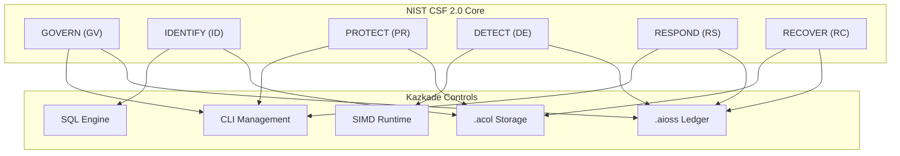
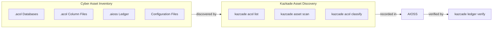
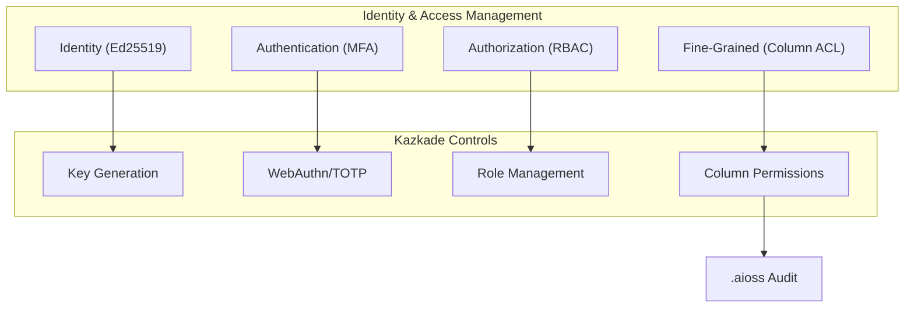
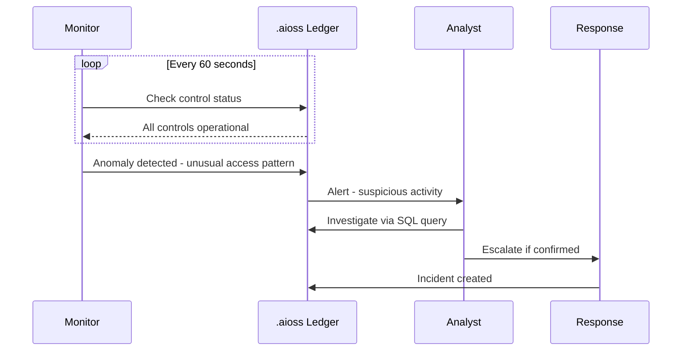
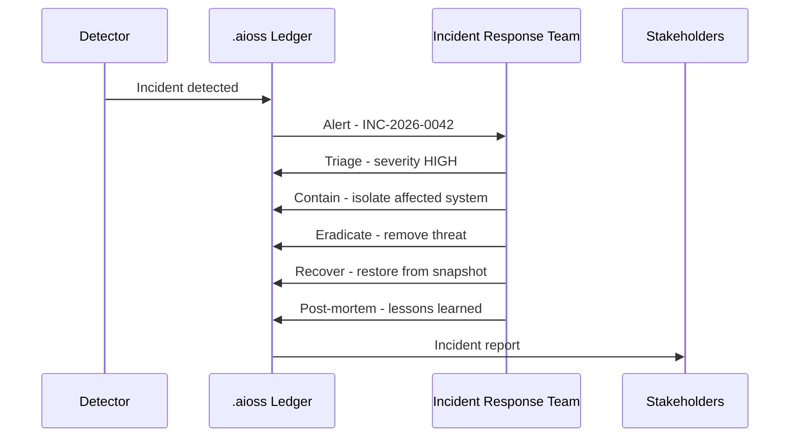
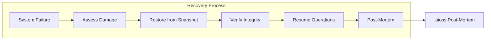

<!--
  ▄▄   ▄▄▄                      ▄▄                        ▄▄                     
  ██  ██▀                       ██                        ██                     
  ▄▄▄█  ██▄██      ▄█████▄  ████████  ██ ▄██▀    ▄█████▄   ▄███▄██   ▄████▄   █▄▄▄     
  ▄▄█▀▀▀    █████      ▀ ▄▄▄██      ▄█▀   ██▄██      ▀ ▄▄▄██  ██▀  ▀██  ██▄▄▄▄██    ▀▀▀█▄▄ 
  ▀▀█▄▄▄    ██  ██▄   ▄██▀▀▀██    ▄█▀     ██▀██▄    ▄██▀▀▀██  ██    ██  ██▀▀▀▀▀▀    ▄▄▄█▀▀ 
      ▀▀▀█  ██   ██▄  ██▄▄▄███  ▄██▄▄▄▄▄  ██  ▀█▄   ██▄▄▄███  ▀██▄▄███  ▀██▄▄▄▄█  █▀▀▀     
           ▀▀    ▀▀   ▀▀▀▀ ▀▀  ▀▀▀▀▀▀▀▀  ▀▀   ▀▀▀   ▀▀▀▀ ▀▀    ▀▀▀ ▀▀    ▀▀▀▀▀
  Lois-Kleinner & 0-1.gg 2026 — Kazkade Zero-Copy Compute Runtime
-->

# NIST Cybersecurity Framework 2.0

**Document ID:** KAZ-COMP-NISTCSF-001  
**Version:** 1.0.0  
**Date:** 2026-06-19  
**Classification:** Internal — Compliance Evidence  

---

## Table of Contents

1. Overview
2. NIST CSF 2.0 Core Functions
3. Function 1 — GOVERN (GV)
4. Function 2 — IDENTIFY (ID)
5. Function 3 — PROTECT (PR)
6. Function 4 — DETECT (DE)
7. Function 5 — RESPOND (RS)
8. Function 6 — RECOVER (RC)
9. Implementation Tiers
10. Profile Alignment
11. `.aioss` Ledger for CSF Controls
12. `.acol` Storage Security
13. Risk Management
14. Supply Chain Security
15. Continuous Improvement
16. Implementation Checklist

---

## 1. Overview

The NIST Cybersecurity Framework (CSF) 2.0, published February 2024, provides a comprehensive framework for managing cybersecurity risk. It expands from the original five functions to six (adding GOVERN) and provides detailed categories and subcategories for each function.

Kazkade's architecture provides native coverage for CSF 2.0 controls. The `.aioss` immutable ledger satisfies GOVERN, DETECT, and RESPOND requirements. The `.acol` columnar encryption and access controls map to PROTECT. The deterministic SIMD execution and SQL query engine support IDENTIFY through asset management and risk assessment. The local-first architecture supports RECOVER through resilient operations.



---

## 2. NIST CSF 2.0 Core Functions

### 2.1 Functions Overview

| Function | Identifier | Focus | Kazkade Coverage |
|---|---|---|---|
| GOVERN | GV | Risk management strategy, oversight | `.aioss` policy ledger |
| IDENTIFY | ID | Asset management, risk assessment | `.acol` inventory |
| PROTECT | PR | Safeguards, access control | Column encryption, RBAC |
| DETECT | DE | Anomalies, monitoring | Continuous monitoring |
| RESPOND | RS | Incident response | Ledger incident timeline |
| RECOVER | RC | Resilience, recovery | `.acol` snapshots |

### 2.2 Framework Core Structure

Each function contains categories (e.g., GV.OC — Organizational Context) and subcategories (e.g., GV.OC-01 — Mission and stakeholder identification). Kazkade provides specific controls mapped to each subcategory.

```bash
# Apply CSF 2.0 framework
kazkade compliance apply \
  --standard nist-csf \
  --version 2.0 \
  --target-profile "risk-informed"
```

---

## 3. Function 1 — GOVERN (GV)

### 3.1 GV.OC — Organizational Context

```bash
# Document organizational mission
kazkade ledger append \
  --event csf.gv.oc.mission \
  --mission-statement "Provide secure data analytics platform" \
  --stakeholders "customers,regulators,partners" \
  --critical-services "data_processing,financial_reporting"

# Record legal and regulatory requirements
kazkade ledger append \
  --event csf.gv.oc.regulatory \
  --regulations "SOC 2,ISO 27001,GDPR,HIPAA,PCI DSS,SOX" \
  --jurisdictions "US,EU,Global"
```

### 3.2 GV.RM — Risk Management Strategy

```bash
# Define risk appetite
kazkade ledger append \
  --event csf.gv.rm.appetite \
  --risk-appetite "Moderate - risk reduction prioritized for critical assets" \
  --risk-tolerance "No tolerance for data integrity failures" \
  --risk-policy-id RM-POL-001
```

### 3.3 GV.RR — Roles, Responsibilities, Authorities

```bash
# Define cybersecurity roles
kazkade auth role create --name ciso --permissions "all"
kazkade auth role create --name security_analyst --permissions "ledger.read,monitor.manage"
kazkade auth role create --name compliance_officer --permissions "ledger.readonly,report.generate"

# Record role assignments
kazkade ledger append \
  --event csf.gv.rr.role \
  --role "CISO" \
  --assigned-to "jane_doe" \
  --authorities "Risk acceptance, policy approval"
```

### 3.4 GV.PO — Policy and Oversight

```bash
# Publish cybersecurity policy
kazkade ledger append \
  --event csf.gv.po.policy \
  --policy-id SEC-POL-001 \
  --title "Information Security Policy" \
  --version 3.0 \
  --review-cycle "annual" \
  --approved-by "CISO"

# Schedule policy review
kazkade sox policy-review \
  --policy-id SEC-POL-001 \
  --next-review $(date -u -d "+1 year" +%Y-%m-%d)
```

### 3.5 GV.OV — Oversight

```bash
# Record board oversight
kazkade ledger append \
  --event csf.gv.ov.board \
  --board-report "Cybersecurity posture Q2 2026" \
  --key-metrics "incident_count,mean_detection_time,patch_coverage" \
  --review-date 2026-06-19

# Generate oversight dashboard
kazkade report nist-csf oversight \
  --period 2026-Q2 \
  --output oversight-dashboard.pdf
```

### 3.6 GV.SC — Supply Chain Risk Management

```bash
# Document supply chain
kazkade ledger append \
  --event csf.gv.sc.suppliers \
  --supplier "Kazkade Corp" \
  --criticality "high" \
  --risk-assessment "Completed - TPM verified binary"

# Verify software supply chain
kazkade version verify \
  --checksum sha3-256 \
  --signature ed25519 \
  --provenance
```

---

## 4. Function 2 — IDENTIFY (ID)

### 4.1 ID.AM — Asset Management



```bash
# Discover and inventory assets
kazkade asset scan \
  --type all \
  --output asset-inventory.json

# Classify assets
kazkade acol classify \
  --database production \
  --classification "critical,important,internal,public" \
  --regulation all

# Record asset inventory
kazkade ledger append \
  --event csf.id.am.inventory \
  --asset-count 42 \
  --databases "production,staging,analytics" \
  --critical-assets "production.financial,production.payments"
```

### 4.2 ID.RA — Risk Assessment

```bash
# Conduct risk assessment
kazkade nist-csf risk-assessment \
  --scope all-assets \
  --methodology "FAIR" \
  --output risk-assessment-2026.pdf

# Record risk register
kazkade ledger query "
  SELECT risk_id, description, likelihood, impact,
         risk_score, treatment, control_id
  FROM csf.risk_register
  WHERE status = 'open'
  ORDER BY risk_score DESC
"
```

### 4.3 ID.IM — Improvement

```bash
# Track improvement opportunities
kazkade ledger append \
  --event csf.id.im.opportunity \
  --finding-id FIND-001 \
  --description "Enhance column-level encryption coverage" \
  --source "Risk assessment" \
  --assigned-to "security_team"
```

---

## 5. Function 3 — PROTECT (PR)

### 5.1 PR.AA — Identity Management, Authentication, Access Control



```bash
# Implement access control
kazkade auth role create --name analyst --permissions "acol.read:analytics.*"
kazkade auth user create --username analyst_bob --key ed25519
kazkade auth user assign --user analyst_bob --role analyst

# Enforce least privilege
kazkade acol acl set \
  --table production \
  --column ssn \
  --role analyst \
  --permission deny
```

### 5.2 PR.DS — Data Security

```bash
# Encrypt data at rest
kazkade acol encrypt \
  --classification sensitive \
  --algorithm aes-256-gcm \
  --key-id csf-key-001

# Verify data integrity
kazkade acol checksum verify --all-databases

# Implement data masking
kazkade acol mask \
  --table customers \
  --column email \
  --method partial \
  --pattern "***@***.{tld}"
```

### 5.3 PR.PS — Platform Security

```bash
# Harden platform
kazkade config apply-hardened \
  --standard nist-csf \
  --profile "high-impact"

# Enable secure boot verification
kazkade config set --section security --key secure_boot --value true
```

### 5.4 PR.AT — Awareness and Training

```bash
# Record training
kazkade ledger append \
  --event csf.pr.at.training \
  --user-id analyst_bob \
  --module "Cybersecurity Awareness 2026" \
  --score 95 \
  --completed $(date -u +%Y-%m-%d)
```

### 5.5 PR.IR — Technology Infrastructure Resilience

```bash
# Configure redundancy
kazkade acol backup configure \
  --schedule "0 */4 * * *" \
  --retention 30 \
  --replica-count 2

# Document resilience measures
kazkade ledger append \
  --event csf.pr.ir.resilience \
  --measure "Local-first architecture eliminates cloud dependency" \
  --rto "2 hours" \
  --rpo "15 minutes"
```

---

## 6. Function 4 — DETECT (DE)

### 6.1 DE.CM — Continuous Monitoring



```bash
# Deploy continuous monitoring
kazkade monitor enable \
  --interval 60 \
  --detect-anomalies true \
  --alert-threshold "medium"

# Configure anomaly detection
kazkade monitor anomaly-config \
  --baseline "30 days" \
  --sensitivity "0.95" \
  --features "access_frequency,time_of_day,resource_sensitivity"
```

### 6.2 DE.AE — Adverse Event Analysis

```sql
-- Analyze security events for patterns
SELECT event_type, COUNT(*) as count,
       MIN(timestamp) as first_event,
       MAX(timestamp) as last_event,
       COUNT(DISTINCT user_id) as unique_users
FROM csf.security_events
WHERE timestamp >= NOW() - INTERVAL '24 hours'
GROUP BY event_type
ORDER BY count DESC
LIMIT 20;
```

### 6.3 DE.DP — Detection Processes

```bash
# Define detection playbook
kazkade ledger append \
  --event csf.de.dp.playbook \
  --playbook-id "DETECT-001" \
  --threat-type "unauthorized_access" \
  --detection-method "ledger.anomaly_detection" \
  --response-playbook "RESPOND-001"
```

---

## 7. Function 5 — RESPOND (RS)

### 7.1 RS.MA — Incident Management



```bash
# Execute incident response
kazkade ledger append \
  --event csf.rs.ma.incident \
  --incident-id INC-CSF-2026-001 \
  --severity high \
  --description "Brute force attempt detected on admin account" \
  --detection-time $(date -u +%Y-%m-%dT%H:%M:%SZ)

# Record containment
kazkade ledger append \
  --event csf.rs.ma.contain \
  --incident-id INC-CSF-2026-001 \
  --action "Blocked source IP, rotated admin keys" \
  --timestamp $(date -u +%Y-%m-%dT%H:%M:%SZ)
```

### 7.2 RS.CO — Communications

```bash
# Record stakeholder notification
kazkade ledger append \
  --event csf.rs.co.notify \
  --incident-id INC-CSF-2026-001 \
  --notified-parties "CISO,Legal,PR" \
  --notification-method "secured_channel" \
  --notification-time $(date -u +%Y-%m-%dT%H:%M:%SZ)
```

### 7.3 RS.AN — Analysis

```bash
# Analyze incident root cause
kazkade ledger query "
  SELECT event_type, user_id, resource, timestamp,
         COUNT(*) OVER (PARTITION BY user_id ORDER BY timestamp 
                        ROWS BETWEEN 300 PRECEDING AND CURRENT ROW) as event_burst
  FROM csf.security_events
  WHERE incident_id = 'INC-CSF-2026-001'
  ORDER BY timestamp
"
```

### 7.4 RS.IM — Incident Mitigation

```bash
# Deploy mitigation
kazkade ledger append \
  --event csf.rs.im.mitigate \
  --incident-id INC-CSF-2026-001 \
  --mitigation "Enabled rate limiting, enforced MFA for all admin accounts" \
  --effectiveness verified
```

---

## 8. Function 6 — RECOVER (RC)

### 8.1 RC.RP — Recovery Planning

```bash
# Document recovery plan
kazkade ledger append \
  --event csf.rc.rp.plan \
  --plan-id RECOVERY-001 \
  --rto "4 hours" \
  --rpo "15 minutes" \
  --recovery-strategy "Restore from .acol snapshot" \
  --test-schedule "quarterly"
```

### 8.2 RC.IM — Incident Recovery Implementation



```bash
# Execute recovery
kazkade acol snapshot restore \
  --snapshot "pre-incident-2026-06-19" \
  --target ./recovery/ \
  --verify

# Record recovery
kazkade ledger append \
  --event csf.rc.im.restore \
  --incident-id INC-CSF-2026-001 \
  --restore-point "snapshot:pre-incident-2026-06-19" \
  --data-integrity verified \
  --recovery-time "3 hours 22 minutes"
```

### 8.3 RC.CO — Recovery Communications

```bash
# Notify stakeholders of recovery
kazkade ledger append \
  --event csf.rc.co.communicate \
  --incident-id INC-CSF-2026-001 \
  --status "recovered" \
  --impact "15 minutes of data reprocessing required" \
  --recovery-summary "All systems operational, data integrity confirmed"
```

---

## 9. Implementation Tiers

### 9.1 Tier Definitions

| Tier | Risk Management | Kazkade Readiness |
|---|---|---|
| Tier 1: Partial | Ad hoc, reactive | Basic controls |
| Tier 2: Risk-Informed | Approved but not integrated | Default configuration |
| Tier 3: Repeatable | Defined, reviewed | Full configuration |
| Tier 4: Adaptive | Real-time adaptation | Advanced deployment |

```bash
# Assess current tier
kazkade nist-csf tier-assessment \
  --output current-tier-assessment.pdf

# Apply target tier configuration
kazkade compliance apply \
  --standard nist-csf \
  --target-tier 3 \
  --profile repeatable
```

### 9.2 Tier Progression

| Capability | Tier 1 | Tier 2 | Tier 3 | Tier 4 |
|---|---|---|---|---|
| Asset Management | Manual inventory | `.acol` discovery | Automated classification | Real-time asset tracking |
| Access Control | Basic passwords | Ed25519 keys | RBAC + column ACL | Adaptive, risk-based |
| Monitoring | None | Basic logging | Continuous monitoring | Predictive analytics |
| Incident Response | Email-based | Ledger incidents | Automated playbooks | Self-healing |
| Recovery | Manual restore | `.acol` snapshots | Automated DR | Orchestrated recovery |

---

## 10. Profile Alignment

### 10.1 Current and Target Profiles

```bash
# Define current profile
kazkade nist-csf profile create \
  --profile-name "current-state" \
  --tier 2 \
  --baseline assessment-2026-06

# Define target profile
kazkade nist-csf profile create \
  --profile-name "target-state-2027" \
  --tier 3 \
  --target-date 2027-06-19

# Generate gap analysis
kazkade nist-csf gap-analysis \
  --current current-state \
  --target target-state-2027 \
  --output gap-analysis-report.pdf
```

### 10.2 Profile Categories

```sql
-- Query profile maturity by category
SELECT function_id, category_id, 
       current_maturity, target_maturity,
       gap_days, priority
FROM csf.profile_maturity
ORDER BY function_id, category_id;
```

---

## 11. `.aioss` Ledger for CSF Controls

### 11.1 Evidence Collection

```bash
# Collect CSF evidence
kazkade ledger export \
  --namespace csf \
  --since 2025-06-19 \
  --until 2026-06-19 \
  --format nist-json \
  --output csf-evidence-2026.json

# Map evidence to CSF functions
kazkade nist-csf evidence-map \
  --evidence csf-evidence-2026.json \
  --output csf-control-evidence.csv
```

### 11.2 CSF Control Mapping Matrix

| CSF Subcategory | `.aioss` Event Type | Verification |
|---|---|---|
| GV.OC-01 | `csf.gv.oc.mission` | Ledger query |
| GV.RM-01 | `csf.gv.rm.appetite` | Policy document |
| ID.AM-01 | `csf.id.am.inventory` | Asset count |
| ID.RA-01 | `csf.id.ra.assessment` | Risk register |
| PR.AA-01 | `auth.user.create` | User inventory |
| PR.DS-01 | `acol.encrypt` | Encryption status |
| PR.PS-01 | `config.harden` | Config snapshot |
| DE.CM-01 | `monitor.alert` | Alert history |
| DE.AE-01 | `monitor.anomaly` | Anomaly log |
| RS.MA-01 | `csf.rs.ma.incident` | Incident timeline |
| RS.IM-01 | `csf.rs.im.mitigate` | Mitigation log |
| RC.IM-01 | `csf.rc.im.restore` | Recovery records |

---

## 12. `.acol` Storage Security

### 12.1 Data Protection

```bash
# Implement data classification
kazkade acol classify \
  --table financial \
  --column transaction_amount \
  --classification sensitive \
  --integrity-requirement high

# Verify protection coverage
kazkade acol protection-status \
  --classification "sensitive,critical" \
  --output protection-coverage.json
```

### 12.2 Integrity Verification

```bash
# Continuous integrity checks
kazkade acol verify \
  --checksum all \
  --interval 3600 \
  --alert-on-failure true
```

---

## 13. Risk Management

### 13.1 Risk Register

```bash
# Add risk to register
kazkade ledger append \
  --event csf.id.ra.risk \
  --risk-id RISK-CSF-001 \
  --description "Insufficient encryption coverage on non-production data" \
  --category "data_protection" \
  --likelihood 3 \
  --impact 4 \
  --risk-score 12 \
  --treatment "Implement encryption on all non-production environments" \
  --owner "security_team"
```

### 13.2 Risk Treatment Tracking

```sql
-- Track risk treatment progress
SELECT risk_id, description, risk_score,
       treatment, owner, target_date,
       CASE 
         WHEN CURRENT_DATE > target_date THEN 'OVERDUE'
         WHEN status = 'open' THEN 'IN_PROGRESS'
         ELSE status 
       END as status
FROM csf.risk_register
ORDER BY risk_score DESC, target_date;
```

---

## 14. Supply Chain Security

### 14.1 Software Bill of Materials

```bash
# Generate SBOM
kazkade version sbom \
  --format cyclonedx \
  --output kazkade-sbom.json

# Record in ledger
kazkade ledger append \
  --event csf.gv.sc.sbom \
  --sbom-hash sha3-256:$(sha3-256 kazkade-sbom.json) \
  --version $(kazcade version --short)
```

### 14.2 Binary Provenance

```bash
# Verify binary provenance
kazkade version verify \
  --checksum sha3-256 \
  --signature ed25519 \
  --provenance

# Record verification
kazkade ledger append \
  --event csf.gv.sc.provenance \
  --binary-hash "sha3-256:verified" \
  --signature-status "valid" \
  --build-chain "signed"
```

---

## 15. Continuous Improvement

### 15.1 Lessons Learned

```bash
# Record lessons learned
kazkade ledger append \
  --event csf.id.im.lessons \
  --incident-id INC-CSF-2026-001 \
  --lesson "Implement rate limiting for all authentication endpoints" \
  --action-item "Deploy rate limiting configuration" \
  --owner "security_team" \
  --target-date 2026-07-19
```

### 15.2 Improvement Tracking

```bash
# Track improvement progress
kazkade ledger query "
  SELECT lesson, action_item, owner, 
         target_date, status
  FROM csf.improvements
  WHERE status != 'closed'
  ORDER BY target_date
"
```

### 15.3 Maturity Growth

```bash
# Reassess maturity
kazkade nist-csf maturity-assessment \
  --period 2026-H2 \
  --output maturity-growth-report.pdf
```

---

## 16. Implementation Checklist

| # | CSF Function | Subcategory | Kazkade Implementation | Priority |
|---|---|---|---|---|
| 1 | GV.OC | Organizational Context | Mission/policy in ledger | Required |
| 2 | GV.RM | Risk Management Strategy | Risk appetite documented | Required |
| 3 | GV.RR | Roles/Responsibilities | RBAC roles defined | Required |
| 4 | GV.PO | Policy/Oversight | Policy cycle in ledger | Required |
| 5 | GV.OV | Oversight | Board reporting | Required |
| 6 | GV.SC | Supply Chain | SBOM + provenance | Required |
| 7 | ID.AM | Asset Management | `kazkade asset scan` | Required |
| 8 | ID.RA | Risk Assessment | Risk register | Required |
| 9 | ID.IM | Improvement | Lessons learned | Required |
| 10 | PR.AA | Identity/Access | Ed25519 + MFA + RBAC | Required |
| 11 | PR.DS | Data Security | AES-256-GCM columns | Required |
| 12 | PR.PS | Platform Security | Hardened config | Required |
| 13 | PR.AT | Awareness/Training | Training records | Required |
| 14 | PR.IR | Tech Resilience | `.acol` backups | Required |
| 15 | DE.CM | Continuous Monitoring | `kazkade monitor` | Required |
| 16 | DE.AE | Adverse Event Analysis | SQL analytics | Required |
| 17 | DE.DP | Detection Processes | Playbooks in ledger | Required |
| 18 | RS.MA | Incident Management | Incident timeline | Required |
| 19 | RS.CO | Communications | Stakeholder notify | Required |
| 20 | RS.AN | Analysis | Root cause analysis | Required |
| 21 | RS.IM | Incident Mitigation | Mitigation tracking | Required |
| 22 | RC.RP | Recovery Planning | DR plan in ledger | Required |
| 23 | RC.IM | Incident Recovery | Snapshot restore | Required |
| 24 | RC.CO | Recovery Comms | Recovery notice | Required |

---

## References

- NIST Cybersecurity Framework 2.0 — February 2024 (NIST CSWP 29)
- NIST SP 800-53 Rev. 5 — Security and Privacy Controls
- NIST SP 800-37 Rev. 2 — Risk Management Framework
- Executive Order 14028 — Improving the Nation's Cybersecurity
- Kazkade `.aioss` Ledger Specification — KAZ-SPEC-LEDGER-001
- Kazkade `.acol` Storage Architecture — KAZ-SPEC-STORAGE-001

---

*Lois-Kleinner & 0-1.gg 2026 — Kazkade Zero-Copy Compute Runtime*

