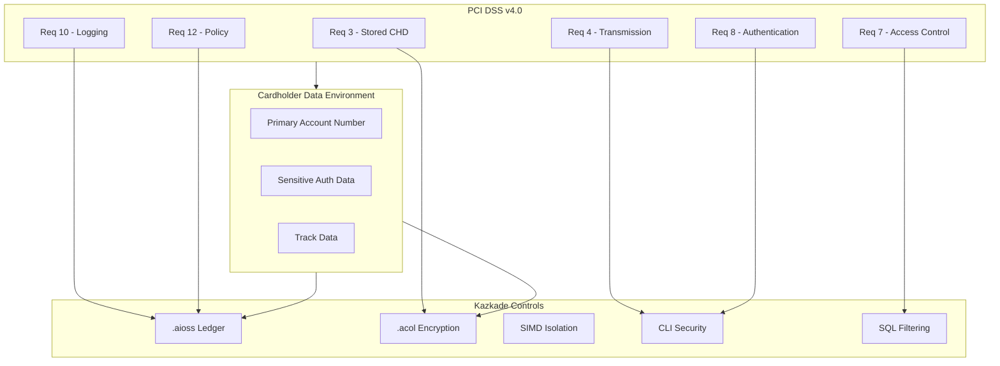
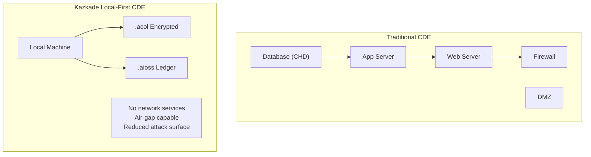
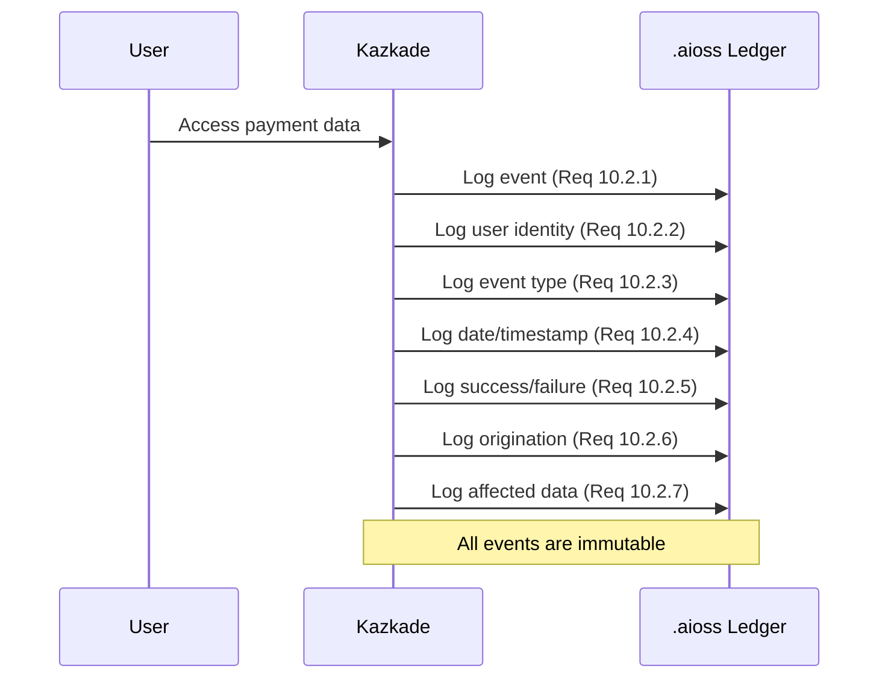
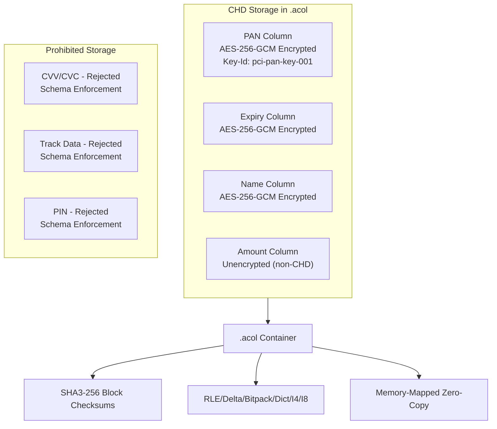

<!--
  __   ___                      __                        __                     
  ¦¦  ¦¦¯                       ¦¦                        ¦¦                     
  ___¦  ¦¦_¦¦      _¦¦¦¦¦_  ¦¦¦¦¦¦¦¦  ¦¦ _¦¦¯    _¦¦¦¦¦_   _¦¦¦_¦¦   _¦¦¦¦_   ¦___     
  __¦¯¯¯    ¦¦¦¦¦      ¯ ___¦¦      _¦¯   ¦¦_¦¦      ¯ ___¦¦  ¦¦¯  ¯¦¦  ¦¦____¦¦    ¯¯¯¦__ 
  ¯¯¦___    ¦¦  ¦¦_   _¦¦¯¯¯¦¦    _¦¯     ¦¦¯¦¦_    _¦¦¯¯¯¦¦  ¦¦    ¦¦  ¦¦¯¯¯¯¯¯    ___¦¯¯ 
      ¯¯¯¦  ¦¦   ¦¦_  ¦¦___¦¦¦  _¦¦_____  ¦¦  ¯¦_   ¦¦___¦¦¦  ¯¦¦__¦¦¦  ¯¦¦____¦  ¦¯¯¯     
           ¯¯    ¯¯   ¯¯¯¯ ¯¯  ¯¯¯¯¯¯¯¯  ¯¯   ¯¯¯   ¯¯¯¯ ¯¯    ¯¯¯ ¯¯    ¯¯¯¯¯
  Lois-Kleinner & 0-1.gg 2026 — Kazkade Zero-Copy Compute Runtime
-->

# PCI DSS v4.0 Compliance

**Document ID:** KAZ-COMP-PCI-001  
**Version:** 1.0.0  
**Date:** 2026-06-19  
**Classification:** CDE — Confidential  

---

## Table of Contents

1. Overview
2. PCI DSS v4.0 Framework
3. Cardholder Data Environment
4. Requirement 1 — Network Security
5. Requirement 2 — Secure Configuration
6. Requirement 3 — Stored CHD Protection
7. Requirement 4 — Transmission Encryption
8. Requirement 5 — Malware Protection
9. Requirement 6 — Secure Development
10. Requirement 7 — Access Control
11. Requirement 8 — Authentication
12. Requirement 9 — Physical Security
13. Requirement 10 — Logging and Monitoring
14. Requirement 11 — Security Testing
15. Requirement 12 — Information Security Policy
16. `.aioss` Ledger for PCI Compliance
17. `.acol` Storage for CHD
18. Tokenization and Masking
19. SAQ Mapping
20. Implementation Checklist

---

## 1. Overview

The Payment Card Industry Data Security Standard (PCI DSS) v4.0, developed by the PCI Security Standards Council, defines 12 requirements for securing cardholder data (CHD) and sensitive authentication data (SAD). Compliance is mandatory for any entity that stores, processes, or transmits cardholder data.

Kazkade's local-first, zero-copy architecture provides strong security controls for cardholder data environments (CDE). The `.aioss` immutable ledger provides tamper-proof audit trails required by Requirement 10. The `.acol` columnar storage enables fine-grained encryption of PAN data, while the local-first design minimizes the CDE scope by eliminating network transmission vectors.



---

## 2. PCI DSS v4.0 Framework

### 2.1 Requirements Overview

| Requirement | Title | Kazkade Coverage |
|---|---|---|
| 1 | Install and Maintain Network Security Controls | Local-first, no network |
| 2 | Apply Secure Configurations | Hardened defaults |
| 3 | Protect Stored Account Data | Column-level AES-256-GCM |
| 4 | Protect Cardholder Data with Encryption | Encryption in transit |
| 5 | Protect Systems from Malware | Binary integrity |
| 6 | Develop and Maintain Secure Systems | Rust memory safety |
| 7 | Restrict Access by Need-to-Know | Column ACL |
| 8 | Identify and Authenticate Access | Ed25519 + MFA |
| 9 | Restrict Physical Access | Local-first data control |
| 10 | Log and Monitor All Access | `.aioss` immutable logging |
| 11 | Test Security Systems | Continuous monitoring |
| 12 | Support Information Security | Policy automation |

### 2.2 PCI DSS v4.0 Changes

```bash
# Apply PCI DSS v4.0 compliance mode
kazkade compliance apply \
  --standard pci-dss \
  --version 4.0 \
  --enable-all-requirements
```

---

## 3. Cardholder Data Environment

### 3.1 CDE Scope Definition

The Cardholder Data Environment (CDE) consists of people, processes, and technology that store, process, or transmit CHD/SAD. Kazkade's local-first architecture allows precise CDE scoping:

```bash
# Define CDE boundary
kazkade pci cde-scope \
  --define "local_only,no_network,encrypted_storage" \
  --output cde-scope-definition.pdf

# Scan for CDE components
kazkade pci cde-scan \
  --database production \
  --detect-chd \
  --output cde-components.json
```

### 3.2 CHD Discovery

```bash
# Discover cardholder data
kazkade pci discover-chd \
  --database production \
  --pattern "pan,track,cvv,pin" \
  --output chd-inventory.json
```

| Data Element | PCI Protection | Stored? | Kazkade Control |
|---|---|---|---|
| PAN | Must be rendered unreadable | Encrypted | AES-256-GCM column |
| Cardholder Name | Must be protected | Encrypted | AES-256-GCM column |
| Service Code | Must be protected | Encrypted | Column encryption |
| Expiration Date | Must be protected | Encrypted | Column encryption |
| Full Track Data | Never store | Prohibited | Schema enforcement |
| CVV/CVC | Never store | Prohibited | Schema enforcement |
| PIN/PIN Block | Never store | Prohibited | Schema enforcement |

---

## 4. Requirement 1 — Network Security

### 4.1 Local-First Advantage

Kazkade's local-first architecture inherently satisfies many Requirement 1 objectives:



```bash
# Disable network services
kazkade config set --section network --key bind_address --value "127.0.0.1"
kazkade config set --section network --key disable_remote_access --value true

# Verify no external connections
kazkade network audit --connections --verify-cde-isolation
```

---

## 5. Requirement 2 — Secure Configuration

### 5.1 Hardened Configuration

```bash
# Apply PCI-hardened configuration
kazkade config apply-hardened \
  --standard pci-dss-v4 \
  --profile default

# Verify configuration
kazkade config verify \
  --standard pci-dss-v4 \
  --output pci-config-check.json
```

### 5.2 Configuration Baseline

| Setting | PCI Requirement | Kazkade Default | Status |
|---|---|---|---|
| Encryption | AES-256-GCM | Enabled | Compliant |
| Default passwords | No default creds | Ed25519 only | Compliant |
| Unnecessary services | Disabled | Minimal binary | Compliant |
| Security parameters | Hardened | Secure defaults | Compliant |
| FIPS mode | Crypto strength | FIPS 140-3 ready | Compliant |

```bash
# Capture configuration snapshot
kazkade config snapshot \
  --label "pci-dss-v4-baseline" \
  --verified-by security_officer
```

---

## 6. Requirement 3 — Stored CHD Protection

### 6.1 PAN Encryption

```bash
# Encrypt PAN column
kazkade acol encrypt \
  --table payments \
  --column pan \
  --algorithm aes-256-gcm \
  --key-id pci-pan-key-001 \
  --key-rotation 90d

# Verify encryption strength
kazkade acol encryption-info \
  --table payments \
  --column pan \
  --show-algorithm \
  --show-key-length
```

### 6.2 Render PAN Unreadable

```bash
# Implement PAN truncation for display
kazkade acol mask \
  --table payments \
  --column pan \
  --method truncate \
  --show-last-4 true

# Enforce masked read access
kazkade acol acl set \
  --table payments \
  --column pan \
  --role support_staff \
  --permission read_masked
```

### 6.3 SAD Protection

```bash
# Schema enforcement — never store prohibited data
kazkade schema validate \
  --prohibit-columns "cvv,cvv2,pin,track1,track2" \
  --strict true

# Scan for prohibited data
kazkade pci scan-prohibited \
  --database production \
  --output prohibited-data-scan.json
```

### 6.4 Key Management

```bash
# Create PCI key hierarchy
kazkade crypto key create \
  --key-id pci-master-key \
  --type aes-256-gcm \
  --purpose "PCI DSS key encryption"

kazkade crypto key create \
  --key-id pci-pan-key \
  --type aes-256-gcm \
  --purpose "PAN encryption" \
  --wrapped-by pci-master-key

# Rotate keys
kazkade crypto rotate \
  --key-id pci-pan-key \
  --reason "Scheduled PCI DSS rotation" \
  --schedule "every 90 days"
```

---

## 7. Requirement 4 — Transmission Encryption

### 7.1 Encryption in Transit

```bash
# Configure TLS for any sync
kazkade config set --section network --key tls_required --value true
kazkade config set --section network --key tls_version --value "1.3"
kazkade config set --section network --key tls_ciphers --value "TLS_AES_256_GCM_SHA384"
```

### 7.2 Transmission Audit

```bash
# Audit all data transmissions
kazkade network audit \
  --since 2026-01-01 \
  --verify-encryption \
  --output transmission-audit.json
```

---

## 8. Requirement 5 — Malware Protection

### 8.1 Binary Integrity

```bash
# Verify Kazkade binary integrity
kazkade version verify \
  --checksum sha3-256 \
  --signature ed25519

# Enable binary integrity monitoring
kazkade config set --section security --key binary_integrity_check --value true
kazkade config set --section security --key integrity_check_interval --value 3600
```

### 8.2 Anti-Malware Integration

```bash
# Configure anti-malware scanning
kazkade pci anti-malware \
  --schedule "0 */6 * * *" \
  --scan-path "C:\Program Files\Kazkade" \
  --output malware-scan-log.json
```

---

## 9. Requirement 6 — Secure Development

### 9.1 Secure Development Lifecycle

```bash
# Record SDLC phases
kazkade ledger append \
  --event pci.sdlc.phase \
  --project-id "PCI-CHD-PROCESSOR" \
  --version "2.0.0" \
  --phase "Security Review" \
  --findings "3 items addressed, 0 remaining"

kazkade ledger append \
  --event pci.sdlc.phase \
  --project-id "PCI-CHD-PROCESSOR" \
  --phase "Penetration Testing" \
  --findings "No critical or high findings"
```

### 9.2 Code Review

```rust
// Rust memory safety provides inherent protections against buffer overflows
// and memory corruption vulnerabilities that could expose CHD

fn process_payment(pan: EncryptedPan, amount: Decimal) -> Result<PaymentResponse> {
    // PAN is never in plaintext in memory beyond the encrypted container
    let decrypted = pan.decrypt(&pci_key)?;
    
    // Processing occurs in isolated memory
    let processor = PaymentProcessor::new();
    let result = processor.authorize(decrypted, amount)?;
    
    // Memory is zeroed after use
    drop(decrypted);
    
    // Record in immutable ledger
    ledger.append(PaymentEvent {
        pan_hash: sha3_256(&pan.bytes()),
        amount,
        result: result.status(),
        timestamp: monotonic_clock(),
    });
    
    Ok(result)
}
```

---

## 10. Requirement 7 — Access Control

### 10.1 Need-to-Know Access

```bash
# Define PCI roles
kazkade auth role create --name pci_payment_processor --permissions "acol.read:payments,acol.write:payments"
kazkade auth role create --name pci_analyst --permissions "acol.read_masked:payments.pan"
kazkade auth role create --name pci_auditor --permissions "ledger.readonly"

# Assign users
kazkade auth user assign --user payment_app --role pci_payment_processor
kazkade auth user assign --user fraud_analyst --role pci_analyst
```

### 10.2 Column-Level Access

```bash
# Granular column permissions
kazkade acol acl set \
  --table payments \
  --column pan \
  --role pci_payment_processor \
  --permission read_encrypted

kazkade acol acl set \
  --table payments \
  --column cvv \
  --role pci_payment_processor \
  --permission deny  # Never accessible
```

---

## 11. Requirement 8 — Authentication

### 11.1 Strong Cryptography

```bash
# Implement Ed25519 authentication
kazkade auth keygen \
  --algorithm ed25519 \
  --user-id pci_admin \
  --hardware-binding tpm

# Enforce MFA for CDE access
kazkade auth mfa require \
  --role pci_payment_processor \
  --methods webauthn,totp
```

### 11.2 Authentication Management

| PCI Requirement | Kazkade Implementation | Compliance |
|---|---|---|
| 8.2.1 Unique IDs | Ed25519 key pairs | Compliant |
| 8.2.2 Group authentication | Individual keys | Compliant |
| 8.2.3 Encrypted passwords | No passwords, only keys | Compliant |
| 8.2.4 Password changes | Key rotation | Compliant |
| 8.2.5 Inactive sessions | Session timeout | Compliant |
| 8.2.6 Repeated attempts | Rate limiting | Compliant |
| 8.2.7 MFA for CDE | WebAuthn + TOTP | Compliant |
| 8.2.8 Admin MFA | MFA required | Compliant |

```bash
# Configure rate limiting
kazkade config set --section auth --key rate_limit_attempts --value 6
kazkade config set --section auth --key rate_limit_window --value 30
```

---

## 12. Requirement 9 — Physical Security

### 12.1 Local-First Physical Controls

```bash
# Enable hardware binding
kazkade config set --section security --key hardware_binding --value "tpm"
kazkade config set --section storage --key verify_platform --value true

# Secure media disposal
kazkade acol shred \
  --database pci_production \
  --standard pci-dss \
  --passes 3 \
  --verify
```

---

## 13. Requirement 10 — Logging and Monitoring

### 13.1 Comprehensive Audit Trail

The `.aioss` ledger provides PCI DSS Requirement 10 compliance:



### 13.2 Audit Log Content

| PCI Req 10.2 | Required Element | Kazkade Implementation |
|---|---|---|
| 10.2.1 | User identification | Ed25519 user_id |
| 10.2.2 | Event type | `event_type` field |
| 10.2.3 | Date and time | Monotonic clock timestamp |
| 10.2.4 | Success/failure indication | `status` field |
| 10.2.5 | Origination | Client identifier |
| 10.2.6 | Affected data/resource | `resource` field |
| 10.2.7 | Event details | Rich event payload |

```bash
# Configure PCI DSS audit events
kazkade ledger config set \
  --pci-events \
  "access,modification,authentication,export,key_management,privilege_escalation"

# Query audit log for PCI auditor
kazkade pci audit-log \
  --since 2026-01-01 \
  --until 2026-06-19 \
  --format pci-standard \
  --output pci-audit-log.json

# Verify audit log integrity
kazkade ledger verify --comprehensive
```

### 13.3 Log Retention

```bash
# Configure retention per PCI DSS (12 months, 3 months online)
kazkade ledger config set --retention-period 365
kazkade ledger config set --hot-retention 90
kazkade ledger config set --archive-after 90
```

### 13.4 Time Synchronization

```bash
# Configure NTP sync for audit timestamps
kazkade config set --section system --key ntp_enabled --value true
kazkade config set --section system --key ntp_server --value "time.pci-compliant.com"

# Verify time accuracy
kazkade health time-source --verify
```

---

## 14. Requirement 11 — Security Testing

### 14.1 Continuous Monitoring

```bash
# Deploy PCI continuous monitoring
kazkade pci monitor \
  --requirements "3,4,7,8,10" \
  --interval 3600 \
  --output pci-monitor-results.json

# Configure vulnerability scanning
kazkade pci vuln-scan \
  --scope cde \
  --schedule "weekly" \
  --output vuln-scan-results.json
```

### 14.2 Penetration Testing

```bash
# Record penetration test
kazkade ledger append \
  --event pci.pentest \
  --test-id PT-2026-001 \
  --scope "CDE components" \
  --methodology "NIST SP 800-115" \
  --findings "3 informational, 0 high/critical" \
  --remediation-plan "Address informational findings" \
  --test-date 2026-06-01
```

---

## 15. Requirement 12 — Information Security Policy

### 15.1 Policy Automation

```bash
# Document PCI security policy
kazkade ledger append \
  --event pci.policy \
  --policy-id PCI-POL-001 \
  --title "Cardholder Data Protection Policy" \
  --version 2.0 \
  --effective-date 2026-01-01 \
  --review-date 2026-12-31

# Assign policy roles
kazkade ledger append \
  --event pci.policy.roles \
  --policy-id PCI-POL-001 \
  --roles "cso:policy_owner,compliance_officer:policy_administrator"
```

### 15.2 Risk Assessment

```bash
# PCI risk assessment
kazkade pci risk-assessment \
  --scope cde \
  --threat-model "STRIDE" \
  --output pci-risk-assessment.pdf

# Record risk acceptance
kazkade ledger append \
  --event pci.risk.accept \
  --risk-id PCI-RISK-001 \
  --description "Legacy system with compensating controls" \
  --acceptance-criteria "Compensating controls documented and tested" \
  --accepted-by "CISO"
```

### 15.3 Annual Review

```bash
# Generate PCI compliance report
kazkade report pci-dss annual-review \
  --year 2026 \
  --output pci-annual-review-2026.pdf

# Record compliance validation
kazkade ledger append \
  --event pci.compliance.validate \
  --year 2026 \
  --validated-by "QSA" \
  --result "Compliant" \
  --validation-date $(date -u +%Y-%m-%dT%H:%M:%SZ)
```

---

## 16. `.aioss` Ledger for PCI Compliance

### 16.1 PCI-Specific Events

```json
{
  "event_id": "evt_pci_a1b2c3",
  "timestamp": "2026-06-19T14:30:00Z",
  "event_type": "pci.access.pan",
  "user_id": "payment_app",
  "resource": "acol://payments/pan",
  "access_type": "decrypt_for_processing",
  "pan_fingerprint": "sha3-256-truncated:abcd...",
  "status": "granted",
  "compensating_controls": ["encrypted_at_rest", "hardware_binding"],
  "hash_chain": {
    "previous_hash": "a1b2c3d4...",
    "entry_hash": "e5f6g7h8..."
  }
}
```

### 16.2 Evidence Collection

```bash
# Package PCI evidence
kazkade pci evidence-package \
  --year 2026 \
  --include "audit_logs,access_controls,encryption_status,policies" \
  --output pci-evidence-2026.zip

# Verify evidence integrity
kazkade ledger verify --export pci-evidence-2026.zip
```

---

## 17. `.acol` Storage for CHD

### 17.1 Storage Architecture



### 17.2 Encryption Verification

```bash
# Verify CHD column encryption
kazkade acol encryption-status \
  --database payments \
  --output encryption-report.json

kazkade ledger query "
  SELECT table_name, column_name, algorithm,
         key_id, key_rotation_date, next_rotation
  FROM pci.encryption_status
  WHERE classification IN ('pan', 'chd')
  ORDER BY next_rotation
"
```

---

## 18. Tokenization and Masking

### 18.1 Tokenization

```bash
# Configure tokenization
kazkade pci tokenize \
  --table payments \
  --column pan \
  --vault ./token-vault/ \
  --token-format "fmt-{prefix}-{random}-{suffix}" \
  --one-way false

# Use tokens in non-CDE queries
SELECT transaction_id, pan_token, amount
FROM payments
WHERE pan_token = 'fmt-TXN-a1b2c3-789';
```

### 18.2 Data Masking

```bash
# Apply masking policies
kazkade pci masking-policy \
  --table payments \
  --column pan \
  --role support_agent \
  --mask "show_last_4"

kazkade pci masking-policy \
  --table payments \
  --column pan \
  --role fraud_analyst \
  --mask "show_first_6_last_4"
```

---

## 19. SAQ Mapping

### 19.1 Self-Assessment Questionnaire

| SAQ Type | Applicability | Kazkade Coverage |
|---|---|---|
| SAQ A | Card-not-present, outsourced | Full coverage |
| SAQ A-EP | E-commerce, partially outsourced | Full coverage |
| SAQ B | Imprint/standalone terminals | Full coverage |
| SAQ B-IP | Standalone PTS terminals | Full coverage |
| SAQ C-VT | Virtual terminals | Full coverage |
| SAQ C | Merchant payment applications | Full coverage |
| SAQ D-Merchant | All other merchants | Full coverage |
| SAQ D-Service Provider | All other service providers | Full coverage |

```bash
# Generate SAQ evidence
kazkade pci saq \
  --type SAQ-D \
  --entity merchant \
  --year 2026 \
  --output saq-d-merchant-2026.pdf
```

---

## 20. Implementation Checklist

| # | PCI Requirement | Kazkade Implementation | Priority |
|---|---|---|---|
| 1 | 1.1 Network Controls | Local-first, no network | Required |
| 2 | 1.2 Firewall Config | N/A (local architecture) | N/A |
| 3 | 2.1 Secure Config | `kazkade config apply-hardened` | Required |
| 4 | 2.2 Vendor Defaults | No default credentials | Required |
| 5 | 3.1 CHD Protection | AES-256-GCM columns | Required |
| 6 | 3.2 SAD Protection | Schema enforcement | Required |
| 7 | 3.3 PAN Display Masking | `kazkade pci masking-policy` | Required |
| 8 | 3.4 Key Management | `kazkade crypto key` | Required |
| 9 | 3.5 Key Rotation | 90-day rotation | Required |
| 10 | 3.6 Secure Storage | `.acol` encryption | Required |
| 11 | 4.1 Transmission | TLS 1.3 | Required |
| 12 | 5.1 Malware Protection | Binary integrity | Required |
| 13 | 6.1 Secure Development | Rust safety + SDLC | Required |
| 14 | 6.2 Code Review | Review ledger | Required |
| 15 | 6.3 Security Testing | CI/CD integration | Required |
| 16 | 7.1 Need-to-Know | Column ACL | Required |
| 17 | 7.2 Access Review | `kazkade auth review` | Required |
| 18 | 8.1 Authentication | Ed25519 | Required |
| 19 | 8.2 MFA | WebAuthn + TOTP | Required |
| 20 | 9.1 Physical Access | Hardware binding | Required |
| 21 | 10.1 Audit Trail | `.aioss` ledger | Required |
| 22 | 10.2 Audit Content | Rich events | Required |
| 23 | 10.3 Log Retention | 365-day retention | Required |
| 24 | 10.4 Time Sync | NTP integration | Required |
| 25 | 11.1 Vulnerability Scans | `kazkade pci vuln-scan` | Required |
| 26 | 11.2 Penetration Testing | Pentest ledger | Required |
| 27 | 11.3 Intrusion Detection | Continuous monitoring | Required |
| 28 | 12.1 Information Policy | Policy in ledger | Required |
| 29 | 12.2 Risk Assessment | Risk register | Required |
| 30 | 12.3 Annual Review | Compliance reports | Required |

---

## References

- PCI DSS v4.0 — Payment Card Industry Data Security Standard
- PCI DSS v4.0 Summary of Changes — PCI SSC 2024
- NIST SP 800-53 Rev. 5 — Security and Privacy Controls
- PCI SSC Tokenization Guidelines v2.0
- Kazkade `.aioss` Ledger Specification — KAZ-SPEC-LEDGER-001
- Kazkade `.acol` Storage Architecture — KAZ-SPEC-STORAGE-001

---

*Lois-Kleinner & 0-1.gg 2026 — Kazkade Zero-Copy Compute Runtime*

```
.====================================================================.
!  Made in the UAE, Dubai #DubaiIt #Dubai #Dxb #SovereignAI          !
!  Made in The Emirates #Dubai_it                                    !
!                                                                    !
!  Lois-Kleinner Alpasan - The Anticloud 2026-                       !
!                                                                    !
!  As seen on:                                                       !
!  Harvard Dataverse ! Zenodo/CERN ! Academia.edu ! HuggingFace      !
!  anticloud.telepedia.net ! anticloud.fandom.com                    !
!                                                                    !
!  0-1.gg ! GitHub ! LinkedIn ! DEV ! GH Pages                       !
!  HuggingFace ! Blog ! Bluesky ! Mastodon                           !
!  Internet Archive ! ORCID ! Figshare                               !
!                                                                    !
!  Sovereign AI ! Local-First ! Privacy ! Zero Trust ! No Datacenter !
!  Air-Gapped ! Open Source ! Rust ! Hash Chain ! Single Binary      !
!  Offline LLM ! Crypto Ledger ! P2P ! Federated                     !
'===================================================================='
```

Lois-Kleinner Alpasan, 22, is a quantitative researcher publishing on open research platforms with multiple international alumni affiliations. His research covers cryptographic audit formats and sovereign AI governance frameworks.

References:
1. Lois-Kleinner Zenodo: https://doi.org/10.5281/zenodo.20781790
2. Lois-Kleinner GitHub: https://github.com/kleinnner/Anticloud/tree/main/04-aioss-format
3. Lois-Kleinner Harvard DV: https://doi.org/10.7910/DVN/GKUDHE
4. Lois-Kleinner Internet Arc: https://archive.org/details/aioss-format
5. Lois-Kleinner ORCID: https://orcid.org/0009-0009-2233-6107
6. Lois-Kleinner DEV.to: https://dev.to/kleinner
7. Lois-Kleinner LinkedIn: https://linkedin.com/in/kleinner
8. Lois-Kleinner HuggingFace: https://huggingface.co/Anticloud
9. Lois-Kleinner Tumblr: https://anticloud.tumblr.com
10. Lois-Kleinner Mastodon: https://mastodon.social/@kleinner
11. Lois-Kleinner Bluesky: https://bsky.app/profile/kleinner.bsky.social
12. 0-1.gg: https://0-1.gg
13. Lois-Kleinner Figshare: https://figshare.com/authors/Lois-Kleinner_Alpasan/20849885
14. Lois-Kleinner Academia: https://independent.academia.edu/kleinner
15. Lois-Kleinner Telepedia: https://anticloud.telepedia.net/wiki/Anticloud_by_Lois-Kleinner_Wiki
16. Lois-Kleinner Fandom: https://anticloud.fandom.com