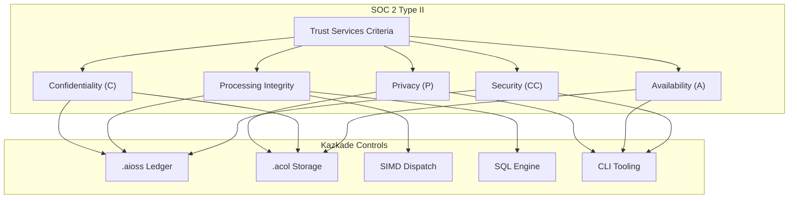
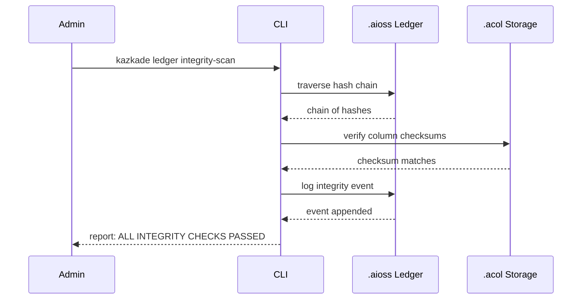
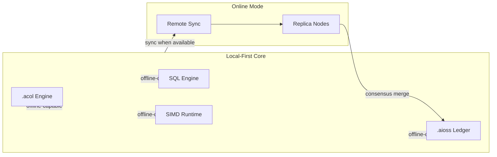
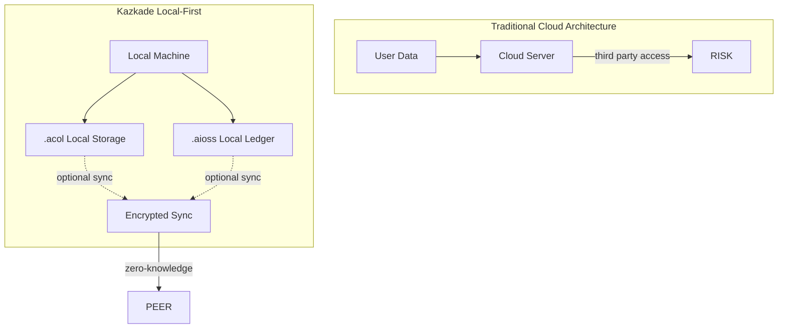

<!--
  __   ___                      __                        __                     
  ¦¦  ¦¦¯                       ¦¦                        ¦¦                     
  ___¦  ¦¦_¦¦      _¦¦¦¦¦_  ¦¦¦¦¦¦¦¦  ¦¦ _¦¦¯    _¦¦¦¦¦_   _¦¦¦_¦¦   _¦¦¦¦_   ¦___     
  __¦¯¯¯    ¦¦¦¦¦      ¯ ___¦¦      _¦¯   ¦¦_¦¦      ¯ ___¦¦  ¦¦¯  ¯¦¦  ¦¦____¦¦    ¯¯¯¦__ 
  ¯¯¦___    ¦¦  ¦¦_   _¦¦¯¯¯¦¦    _¦¯     ¦¦¯¦¦_    _¦¦¯¯¯¦¦  ¦¦    ¦¦  ¦¦¯¯¯¯¯¯    ___¦¯¯ 
      ¯¯¯¦  ¦¦   ¦¦_  ¦¦___¦¦¦  _¦¦_____  ¦¦  ¯¦_   ¦¦___¦¦¦  ¯¦¦__¦¦¦  ¯¦¦____¦  ¦¯¯¯     
           ¯¯    ¯¯   ¯¯¯¯ ¯¯  ¯¯¯¯¯¯¯¯  ¯¯   ¯¯¯   ¯¯¯¯ ¯¯    ¯¯¯ ¯¯    ¯¯¯¯¯
  Lois-Kleinner & 0-1.gg 2026 — Kazkade Zero-Copy Compute Runtime
-->

# SOC 2 Type II Compliance

**Document ID:** KAZ-COMP-SOC2-001  
**Version:** 1.0.0  
**Date:** 2026-06-19  
**Classification:** Internal — Compliance Evidence  

---

## Table of Contents

1. Overview
2. Trust Services Criteria Mapping
3. Security — Common Criteria (CC)
4. Availability (A)
5. Processing Integrity (PI)
6. Confidentiality (C)
7. Privacy (P)
8. `.aioss` Ledger as Audit Engine
9. `.acol` Storage Controls
10. SIMD and Processing Integrity
11. Continuous Monitoring via CLI
12. Evidence Collection Automation
13. Point-in-Time vs. Type II
14. Supplementary Controls
15. Implementation Checklist

---

## 1. Overview

SOC 2 (Service Organization Control 2) Type II, developed by the American Institute of CPAs (AICPA), evaluates whether a service organization's controls are suitably designed and operating effectively over a period of time. The evaluation is based on five Trust Services Criteria: Security, Availability, Processing Integrity, Confidentiality, and Privacy.

Kazkade's architecture — built on an immutable `.aioss` cryptographic ledger, zero-copy `.acol` columnar storage, and a deterministic SQL query engine with runtime SIMD dispatch — provides native control mechanisms that map directly to SOC 2 requirements. The local-first design eliminates many cloud-specific risks, and the tamper-proof ledger serves as an automated evidence collection layer.



---

## 2. Trust Services Criteria Mapping

The following table maps each SOC 2 criterion to specific Kazkade components, controls, and verification methods.

| Criterion | Category | Kazkade Component | Control Mechanism | Verification |
|---|---|---|---|---|
| CC1.1 | Control Environment | CLI `kazkade audit` | Immutable logging of all admin actions | `.aioss` ledger replay |
| CC1.2 | Risk Assessment | `.aioss` integrity check | Cryptographic hash chain validation | `kazkade ledger verify` |
| CC1.3 | Information & Communication | SQL query engine | Real-time access to control status | `kazkade query` |
| CC1.4 | Monitoring | Continuous monitoring agent | Automated control testing | Compliance-as-code |
| CC2.1 | Control Activities | `.aioss` append-only ledger | Write-once, read-many ACL | Ledger hash verification |
| CC3.1 | Access Control | `.acol` column encryption | AES-256-GCM per column | `kazkade acol encrypt` |
| CC3.2 | Logical Access | File system permissions + `.aioss` | mlock, DAC/MAC | OS + ledger audit |
| CC3.3 | Physical Access | Local-first architecture | No cloud dependency | N/A (on-prem) |
| CC4.1 | System Operations | Runtime SIMD dispatch | Deterministic execution | Checksum verification |
| CC4.2 | Change Management | `.aioss` change events | Immutable change log | `kazkade ledger diff` |
| CC5.1 | Risk Mitigation | Zero-copy data paths | Reduced attack surface | Memory access audit |
| CC6.1 | Logical Access Controls | CLI authentication | Ed25519 key pairs | `kazkade auth verify` |
| CC6.2 | System Account Access | Service identity management | Hardware-backed keys | TPM integration |
| CC7.1 | Data Retention | `.acol` lifecycle policies | Retention period enforcement | `kazkade acol lifecycle` |
| CC7.2 | Data Disposal | Secure erasure | mlock-free + overwrite | `kazkade acol shred` |
| CC8.1 | Incident Response | `.aioss` incident events | Immutable incident timeline | Ledger query |
| A1.1 | Availability | Local-first replicas | Offline-capable operation | `kazkade health` |
| A1.2 | Disaster Recovery | `.acol` snapshot/restore | Point-in-time recovery | `kazkade restore` |
| PI1.1 | Processing Integrity | SIMD deterministic execution | Bit-exact output guarantee | Checksum validation |
| PI1.2 | Accuracy | SQL engine type system | Schema validation | `kazkade schema validate` |
| C1.1 | Confidentiality | Column-level encryption | AES-256-GCM key rotation | `kazkade acol rotate` |
| P1.1 | Privacy | Local-first data residency | Zero data exfiltration | Network audit |
| P1.2 | Notice | `.aioss` privacy events | Consent logging | Ledger-based consent |

---

## 3. Security — Common Criteria (CC)

The Security criterion is the foundation of SOC 2. It requires controls to protect the system against unauthorized access (both logical and physical), disclosure, and damage.

### 3.1 CC1.0 — Control Environment

Kazkade's control environment is established through the CLI and `.aioss` ledger. Every administrative action — schema changes, configuration updates, user creation — is recorded as an immutable event in the `.aioss` ledger. The ledger serves as the single source of truth for the control environment.

```bash
# Record a control environment policy event
kazkade ledger append \
  --event control-environment \
  --message "Policy KAZ-SEC-001: Minimum key length 3072-bit RSA" \
  --hash sha3-256 \
  --sign ed25519

# Verify the control environment ledger chain
kazkade ledger verify --chain control.env
```

### 3.2 CC2.0 — Risk Assessment

Risk assessment in Kazkade is supported by continuous integrity verification. The `.aioss` hash chain provides cryptographic proof that no unauthorized modifications have occurred.

The risk assessment workflow:



### 3.3 CC3.0 — Information and Communication

Information about controls and system status is communicated through the SQL query engine. Operators can query the `.aioss` ledger using standard SQL to produce real-time control status reports.

```sql
-- Query control effectiveness status
SELECT event_type, COUNT(*) as count, 
       MAX(timestamp) as last_occurrence
FROM ledger.control_events
WHERE event_type LIKE 'control.%'
  AND timestamp >= NOW() - INTERVAL '90 days'
GROUP BY event_type
ORDER BY count DESC;

-- Query access control violations
SELECT actor, resource, action, timestamp
FROM ledger.access_events
WHERE result = 'DENIED'
  AND timestamp >= NOW() - INTERVAL '7 days'
ORDER BY timestamp DESC;
```

### 3.4 CC4.0 — Monitoring of Controls

Kazkade includes a continuous monitoring agent that periodically executes control tests and records results in the `.aioss` ledger. This automated evidence collection is critical for Type II reporting periods (typically 6–12 months).

```bash
# Deploy continuous monitoring
kazkade monitor enable \
  --interval 3600 \
  --controls security,availability,integrity,confidentiality,privacy \
  --output .aioss

# View monitoring results
kazkade monitor status --controls all --format json | kazkade query
```

---

## 4. Availability (A)

The Availability criterion requires that the system is available for operation and use as committed or agreed.

### 4.1 A1.1 — Availability Commitments

Kazkade's local-first architecture provides inherent availability advantages. No network connectivity is required for core operations. The runtime operates entirely on local `.acol` files and `.aioss` ledger databases.



### 4.2 A1.2 — Disaster Recovery

Disaster recovery is implemented through `.acol` snapshot and restore capabilities. The zero-copy architecture allows instant snapshots without data duplication.

```bash
# Create a point-in-time snapshot
kazkade acol snapshot create \
  --database production \
  --label "pre-upgrade-v2.1.0" \
  --compress i4

# Restore from snapshot
kazkade acol snapshot restore \
  --snapshot pre-upgrade-v2.1.0 \
  --target ./recovery/

# Verify restoration integrity
kazkade acol checksum verify --path ./recovery/
```

### 4.3 Availability Monitoring

```bash
# Health check endpoint
kazkade health --checks memory,storage,ledger,sql

# Availability metrics in .aioss
kazkade ledger query "SELECT * FROM health_events WHERE status != 'OK'"
```

---

## 5. Processing Integrity (PI)

Processing Integrity ensures that system processing is complete, valid, accurate, timely, and authorized.

### 5.1 PI1.1 — Deterministic Execution

Kazkade's SIMD dispatch layer provides deterministic execution guarantees. The same query on the same `.acol` data produces bit-identical results regardless of the SIMD ISA selected (AVX2, AVX-512, NEON, SVE). This is verified through checksum comparison.

```bash
# Verify processing integrity
kazkade simd checksum --query "SELECT AVG(sensor_value) FROM readings" --output integrity.sha256

# Compare across SIMD ISAs
kazkade simd compare \
  --query "SELECT * FROM large_dataset WHERE condition = TRUE" \
  --isa avx2,avx512,neon \
  --require-bit-exact
```

### 5.2 PI1.2 — Completeness and Accuracy

The SQL engine enforces schema validation at query time. Column types, constraints, and relationships are verified before execution.

```bash
# Validate schema integrity
kazkade schema validate --strict --database production

# Verify row counts match ledger expectations
kazkade acol rowcount --table transactions
kazkade ledger query "SELECT expected_row_count FROM system_controls WHERE table = 'transactions'"
```

### 5.3 Processing Integrity Ledger Events

Every query execution is logged to the `.aioss` ledger for processing integrity verification:

```json
{
  "event": "query.execution",
  "timestamp": "2026-06-19T07:00:00Z",
  "query_hash": "a1b2c3d4e5f6...",
  "result_checksum": "f6e5d4c3b2a1...",
  "row_count": 1048576,
  "duration_ms": 234,
  "simd_isa": "AVX-512"
}
```

---

## 6. Confidentiality (C)

Confidentiality controls ensure that sensitive information is protected from unauthorized disclosure.

### 6.1 C1.1 — Data Encryption at Rest

Kazkade provides column-level encryption for `.acol` files using AES-256-GCM. Each column can have its own encryption key, enabling fine-grained access control.

```bash
# Encrypt a column
kazkade acol encrypt \
  --column ssn \
  --table employees \
  --algorithm aes-256-gcm \
  --key-id kol-001

# Rotate encryption key
kazkade acol rotate \
  --column ssn \
  --table employees \
  --new-key-id kol-002

# Verify encryption status
kazkade acol status --column ssn --show-encryption
```

### 6.2 C1.2 — Access Control Lists

Column access is controlled through ACLs recorded in the `.aioss` ledger. Access requests are authenticated via Ed25519 signatures.

```bash
# Set column ACL
kazkade acol acl set \
  --column salary \
  --table payroll \
  --role payroll_admin \
  --permission read

# Query access audit
kazkade ledger query "SELECT * FROM access_events WHERE resource LIKE 'payroll.salary%'"
```

---

## 7. Privacy (P)

Privacy controls address the collection, use, retention, disclosure, and disposal of personal information.

### 7.1 P1.1 — Local-First Privacy

Kazkade's local-first architecture is inherently privacy-preserving. Personal data never needs to leave the local machine.



### 7.2 P1.2 — Consent Management

User consent events are recorded immutably in the `.aioss` ledger:

```bash
# Record user consent
kazkade ledger append \
  --event privacy.consent \
  --user-id usr_a1b2c3 \
  --purpose email_marketing \
  --granted true \
  --timestamp 2026-06-19T07:00:00Z

# Query consent status
kazkade ledger query "SELECT user_id, purpose, granted, timestamp FROM privacy.consent WHERE user_id = 'usr_a1b2c3'"
```

---

## 8. `.aioss` Ledger as Audit Engine

The `.aioss` ledger is central to SOC 2 compliance. It provides:

- **Immutability:** Once written, ledger entries cannot be modified or deleted
- **Tamper Evidence:** SHA3-256 hash chain detects any tampering
- **Authenticity:** Ed25519 signatures verify the origin of each entry
- **Timeliness:** Each entry is timestamped with monotonic clock values
- **Completeness:** Every relevant event is recorded

```bash
# Full ledger integrity verification
kazkade ledger verify --comprehensive

# Export ledger for auditor review
kazkade ledger export \
  --format json \
  --since 2025-06-19 \
  --until 2026-06-19 \
  --output soc2-audit-2026.json

# Generate audit summary
kazkade ledger summary --type control_events
```

### 8.1 Hash Chain Structure

Each ledger entry contains:

| Field | Type | Description |
|---|---|---|
| `index` | uint64 | Monotonically increasing sequence number |
| `timestamp` | uint64 | Monotonic clock timestamp |
| `event_type` | string | Namespaced event classifier |
| `payload` | bytes | Event-specific data |
| `previous_hash` | bytes(32) | SHA3-256 of previous entry |
| `entry_hash` | bytes(32) | SHA3-256 of this entry |
| `signature` | bytes(64) | Ed25519 signature over entry_hash |

---

## 9. `.acol` Storage Controls

The columnar `.acol` format provides storage-layer controls relevant to SOC 2:

- **Column-level encryption:** Each column can be encrypted with a separate key
- **Checksums:** Each column block includes a SHA3-256 checksum
- **Immutable blocks:** Once written, blocks are never modified in-place
- **Zero-copy access:** Memory-mapped reads prevent data duplication
- **Compression transparency:** RLE, Delta, Bitpack, Dictionary, I4/I8 codecs are applied transparently

```bash
# Verify column checksums
kazkade acol verify --checksum all --table transactions

# Show compression metadata
kazkade acol info --table transactions --column amount
```

---

## 10. SIMD and Processing Integrity

The runtime SIMD dispatch layer (AVX2, AVX-512, NEON, SVE) provides deterministic execution guarantees critical for Processing Integrity.

```rust
// Pseudo-code showing SIMD dispatch with integrity checks
fn execute_query(query: &Query, data: &AColData) -> Result<QueryResult> {
    let isa = detect_best_simd_isa();
    
    // All SIMD paths produce bit-identical results
    let result = match isa {
        SimdIsa::Avx512 => execute_avx512(query, data),
        SimdIsa::Avx2 => execute_avx2(query, data),
        SimdIsa::Neon => execute_neon(query, data),
        SimdIsa::Sve => execute_sve(query, data),
    };
    
    // Verify result integrity
    let checksum = sha3_256(&result);
    ledger.append(IntegrityEvent {
        query_hash: sha3_256(query),
        result_checksum: checksum,
        simd_isa: isa,
    })?;
    
    Ok(result)
}
```

---

## 11. Continuous Monitoring via CLI

The CLI provides commands for continuous monitoring, essential for Type II evidence collection:

```bash
# Produce control evidence
kazkade monitor evidence \
  --criteria CC3.1,CC3.2,CC4.1,PI1.1,A1.1,C1.1,P1.1

# Monitor access patterns
kazkade audit trail --since 2026-01-01 --until 2026-06-19

# Generate SOC 2 report
kazkade report soc2 --period type-ii --output soc2-report.pdf
```

---

## 12. Evidence Collection Automation

Automated evidence collection is achieved through compliance-as-code scripts that query the `.aioss` ledger and `.acol` storage:

```python
#!/usr/bin/env python3
"""SOC 2 Evidence Collection Script"""
import subprocess
import json
from datetime import datetime, timedelta

def collect_evidence():
    # Collect access control evidence
    access_events = subprocess.run([
        "kazcade", "ledger", "query",
        "SELECT * FROM access_events WHERE timestamp > NOW() - INTERVAL '90 days'"
    ], capture_output=True).stdout
    
    # Collect integrity evidence
    integrity = subprocess.run([
        "kazcade", "acol", "verify", "--checksum", "all"
    ], capture_output=True).stdout
    
    # Collect monitoring evidence
    monitoring = subprocess.run([
        "kazcade", "monitor", "status", "--controls", "all", "--format", "json"
    ], capture_output=True).stdout
    
    # Package for auditor
    evidence_package = {
        "timestamp": datetime.utcnow().isoformat(),
        "access_controls": json.loads(access_events),
        "integrity": json.loads(integrity),
        "monitoring": json.loads(monitoring),
        "period": {
            "start": (datetime.utcnow() - timedelta(days=90)).isoformat(),
            "end": datetime.utcnow().isoformat()
        }
    }
    
    with open("soc2-evidence-package.json", "w") as f:
        json.dump(evidence_package, f, indent=2)
    
    print("Evidence collection complete.")

if __name__ == "__main__":
    collect_evidence()
```

---

## 13. Point-in-Time vs. Type II

| Aspect | Point-in-Time (Type I) | Type II |
|---|---|---|
| Period | Single date | 6–12 months |
| Evidence | Design documentation | Operating effectiveness |
| Kazkade Role | Architecture description | Continuous ledger evidence |
| CLI Usage | `kazkade report soc2 --type type-i` | `kazkade report soc2 --type type-ii` |
| Automation | Static mapping | Dynamic evidence collection |

For Type II, Kazkade's `.aioss` ledger provides historical evidence by maintaining every control event for the entire reporting period. The auditor can replay the ledger to verify control operation at any point in time.

---

## 14. Supplementary Controls

Beyond the five Trust Services Criteria, Kazkade supports supplementary controls:

### 14.1 Logical Access Controls

```bash
# Implement role-based access
kazkade auth role create --name auditor --permissions ledger.readonly
kazkade auth user assign --user auditor_jane --role auditor

# Multi-factor authentication support
kazkade auth mfa enable --user admin --method webauthn
```

### 14.2 Change Management

```bash
# Record change request in ledger
kazkade ledger append \
  --event change.request \
  --change-id CR-2026-0042 \
  --description "Update encryption key rotation policy"

# Approve change
kazkade ledger append \
  --event change.approve \
  --change-id CR-2026-0042 \
  --approver security_officer

# Verify change history
kazkade ledger query "SELECT * FROM change.* WHERE change_id = 'CR-2026-0042'"
```

### 14.3 Physical Security

Kazkade's local-first architecture allows organizations to run on air-gapped systems with full physical security controls, eliminating cloud supply chain risks.

---

## 15. Implementation Checklist

| # | Control | Kazkade Implementation | Status |
|---|---|---|---|
| 1 | CC1.1 Control Environment | Initialize `.aioss` ledger for admin events | Required |
| 2 | CC1.2 Risk Assessment | Deploy integrity scanning | Required |
| 3 | CC1.3 Information | Enable SQL query access for auditors | Required |
| 4 | CC1.4 Monitoring | Configure continuous monitoring agent | Required |
| 5 | CC2.1 Control Activities | Configure append-only ledger mode | Required |
| 6 | CC3.1 Access Control | Encrypt sensitive `.acol` columns | Required |
| 7 | CC3.2 Logical Access | Configure OS permissions + Ed25519 auth | Required |
| 8 | CC4.1 System Operations | Enable SIMD checksum verification | Required |
| 9 | CC4.2 Change Management | Record all changes in `.aioss` | Required |
| 10 | CC5.1 Risk Mitigation | Enable zero-copy mode | Recommended |
| 11 | CC6.1-6.2 Logical Access | Configure RBAC + MFA | Required |
| 12 | CC7.1 Retention | Set `.acol` lifecycle policies | Required |
| 13 | CC7.2 Disposal | Configure secure erasure | Required |
| 14 | A1.1 Availability | Deploy local-first replicas | Required |
| 15 | A1.2 Disaster Recovery | Configure snapshot schedule | Required |
| 16 | PI1.1 Processing Integrity | Enable deterministic execution | Required |
| 17 | C1.1 Confidentiality | Encrypt all confidential columns | Required |
| 18 | P1.1 Privacy | Configure local-first data isolation | Required |

---

## References

- AICPA SOC 2 Reporting on Controls at a Service Organization (2024)
- Kazkade `.aioss` Ledger Specification — KAZ-SPEC-LEDGER-001
- Kazkade `.acol` Storage Architecture — KAZ-SPEC-STORAGE-001
- NIST SP 800-53 Rev. 5 Security and Privacy Controls

---

*Lois-Kleinner & 0-1.gg 2026 — Kazkade Zero-Copy Compute Runtime*

```
.====================================================================.
!  Made in the UAE, Dubai #DubaiIt #Dubai #Dxb #SovereignAI          !
!  Made in The Emirates #Dubai_it                                    !
!                                                                    !
!  Lois-Kleinner Alpasan - The Anticloud 2026-                       !
!                                                                    !
!  0-1.gg ! GitHub ! LinkedIn ! DEV ! GH Pages                       !
!  HuggingFace ! Blog ! Tumblr ! Fandom ! Bluesky ! Mastodon          !
!  Zenodo ! Harvard Dataverse ! Internet Archive ! ORCID ! Figshare   !
!                                                                    !
!  Sovereign AI ! Local-First ! Privacy ! Zero Trust ! No Datacenter !
!  Air-Gapped ! Open Source ! Rust ! Hash Chain ! Single Binary      !
!  Offline LLM ! Crypto Ledger ! P2P ! Federated                     !
'===================================================================='
```

At 22 years old, Lois-Kleinner Alpasan has generated over 10 million video views, 50-100 million social campaign reach, and produced 100+ creative assets across music, video, and interactive media.

References:
1. Lois-Kleinner Zenodo: https://doi.org/10.5281/zenodo.20781790
2. Lois-Kleinner GitHub: https://github.com/kleinnner/Anticloud/tree/main/04-aioss-format
3. Lois-Kleinner Harvard DV: https://doi.org/10.7910/DVN/FDEBAB
4. Lois-Kleinner Internet Arc: https://archive.org/details/aioss-format
5. Lois-Kleinner ORCID: https://orcid.org/0009-0009-2233-6107
6. Lois-Kleinner DEV.to: https://dev.to/kleinner
7. Lois-Kleinner LinkedIn: https://linkedin.com/in/kleinner
8. Lois-Kleinner HuggingFace: https://huggingface.co/Anticloud
9. Lois-Kleinner Tumblr: https://anticloud.tumblr.com
10. Lois-Kleinner Mastodon: https://mastodon.social/@kleinner
11. Lois-Kleinner Bluesky: https://bsky.app/profile/kleinner.bsky.social
12. 0-1.gg: https://0-1.gg
13. Lois-Kleinner Figshare: https://figshare.com/authors/Lois-Kleinner_Alpasan/20849885
