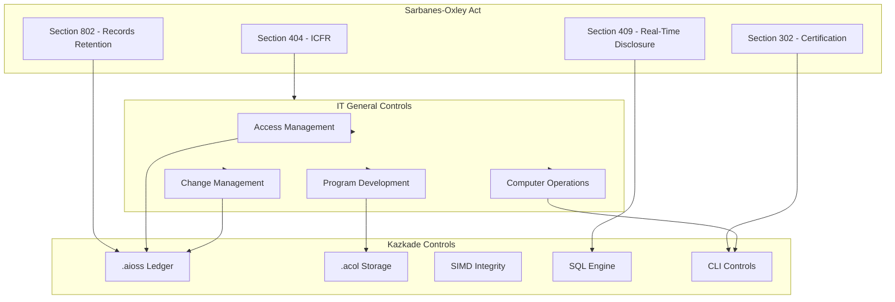
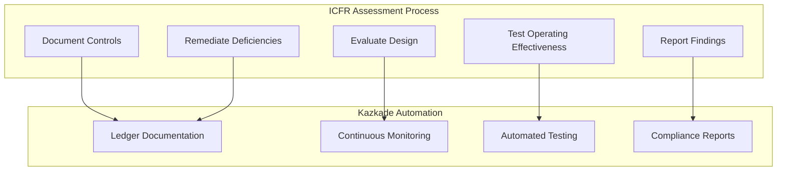
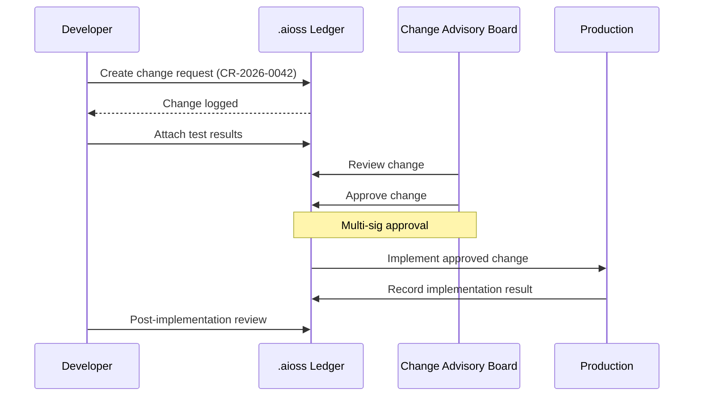

<!--
  __   ___                      __                        __                     
  ¦¦  ¦¦¯                       ¦¦                        ¦¦                     
  ___¦  ¦¦_¦¦      _¦¦¦¦¦_  ¦¦¦¦¦¦¦¦  ¦¦ _¦¦¯    _¦¦¦¦¦_   _¦¦¦_¦¦   _¦¦¦¦_   ¦___     
  __¦¯¯¯    ¦¦¦¦¦      ¯ ___¦¦      _¦¯   ¦¦_¦¦      ¯ ___¦¦  ¦¦¯  ¯¦¦  ¦¦____¦¦    ¯¯¯¦__ 
  ¯¯¦___    ¦¦  ¦¦_   _¦¦¯¯¯¦¦    _¦¯     ¦¦¯¦¦_    _¦¦¯¯¯¦¦  ¦¦    ¦¦  ¦¦¯¯¯¯¯¯    ___¦¯¯ 
      ¯¯¯¦  ¦¦   ¦¦_  ¦¦___¦¦¦  _¦¦_____  ¦¦  ¯¦_   ¦¦___¦¦¦  ¯¦¦__¦¦¦  ¯¦¦____¦  ¦¯¯¯     
           ¯¯    ¯¯   ¯¯¯¯ ¯¯  ¯¯¯¯¯¯¯¯  ¯¯   ¯¯¯   ¯¯¯¯ ¯¯    ¯¯¯ ¯¯    ¯¯¯¯¯
  Lois-Kleinner & 0-1.gg 2026 — Kazkade Zero-Copy Compute Runtime
-->

# SOX Compliance

**Document ID:** KAZ-COMP-SOX-001  
**Version:** 1.0.0  
**Date:** 2026-06-19  
**Classification:** Internal — Compliance Evidence  

---

## Table of Contents

1. Overview
2. Sarbanes-Oxley Act Overview
3. Section 302 — Corporate Responsibility
4. Section 404 — Management Assessment
5. Section 409 — Real-Time Disclosure
6. Section 802 — Records Destruction
7. ITGC Mapping
8. Access Management
9. Change Management
10. Computer Operations
11. Program Development
12. `.aioss` Ledger as SOX Evidence
13. `.acol` Storage for Financial Data
14. Financial Reporting Integrity
15. Fraud Detection
16. Auditor Access
17. Documentation and Retention
18. Implementation Checklist

---

## 1. Overview

The Sarbanes-Oxley Act of 2002 (SOX) mandates strict reforms to improve financial disclosures from corporations and prevent accounting fraud. SOX compliance requires publicly traded companies to establish, document, maintain, and test internal controls over financial reporting (ICFR).

Kazkade provides native technical controls that support SOX compliance, particularly for IT General Controls (ITGC) audit requirements. The `.aioss` immutable ledger provides tamper-proof evidence of the control environment, while `.acol` columnar storage ensures financial data integrity. The deterministic SIMD execution guarantees processing accuracy, and the SQL query engine enables real-time financial reporting verification.



---

## 2. Sarbanes-Oxley Act Overview

### 2.1 Key Sections for IT

| Section | Title | IT Implication | Kazkade Role |
|---|---|---|---|
| 302 | Corporate Responsibility | CEO/CFO certification of financial reports | Data integrity verification |
| 404 | Management Assessment | ICFR design and operating effectiveness | ITGC automation |
| 409 | Real-Time Disclosure | Rapid disclosure of material changes | Real-time reporting |
| 802 | Records Destruction | Retention of audit records | Immutable retention |

### 2.2 PCAOB Standards

The Public Company Accounting Oversight Board (PCAOB) Auditing Standard No. 5 (AS5) governs the audit of internal controls over financial reporting. Kazkade supports AS5 requirements through:

```bash
# Enable SOX compliance mode
kazkade compliance apply \
  --standard sox \
  --pcaob-as5 true \
  --enable-itgc
```

---

## 3. Section 302 — Corporate Responsibility

### 3.1 Certification Support

Section 302 requires CEO and CFO certification of financial statements. Kazkade provides the data integrity verification to support this certification:

```bash
# Generate financial data integrity report
kazkade sox integrity-report \
  --period 2026-Q2 \
  --output financial-integrity-2026-Q2.pdf

# Sign report with Ed25519 for certification
kazkade crypto sign \
  --key-id ceo_signing_key \
  --file financial-integrity-2026-Q2.pdf \
  --output financial-integrity-2026-Q2.pdf.sig
```

### 3.2 Disclosure Controls

```bash
# Monitor disclosure controls effectiveness
kazkade sox disclosure-controls \
  --period 2026-Q2 \
  --output disclosure-controls-assessment.pdf

# Record certification in ledger
kazkade ledger append \
  --event sox.302.certification \
  --certifying-officer "CEO" \
  --period "2026-Q2" \
  --certification "Financial statements fairly present in all material respects" \
  --signed-with ed25519:ceo_signing_key
```

---

## 4. Section 404 — Management Assessment

### 4.1 ICFR Framework

Section 404 requires management to assess and report on the effectiveness of internal controls over financial reporting.



### 4.2 Control Documentation

```bash
# Document SOX controls in ledger
kazkade ledger append \
  --event sox.control.document \
  --control-id SOX-IT-001 \
  --control-name "Program Change Management" \
  --control-type "ITGC" \
  --frequency "Continuous" \
  --control-owner "IT Director" \
  --description "All program changes are logged in immutable ledger"
```

### 4.3 Control Testing

```bash
# Test control operating effectiveness
kazkade sox test-control \
  --control-id SOX-IT-001 \
  --test-procedure "Verify change management events in .aioss ledger" \
  --sample-size 40 \
  --output control-test-SOX-IT-001.pdf

# Automated control testing
kazkade monitor controls \
  --standard sox \
  --itgc-only \
  --output itgc-test-results.json
```

### 4.4 Deficiency Documentation

```bash
# Record control deficiency
kazkade ledger append \
  --event sox.control.deficiency \
  --control-id SOX-IT-001 \
  --deficiency-type "Operating Effectiveness" \
  --severity "Significant Deficiency" \
  --description "Three change events lacked required approval signatures" \
  --remediation-plan "Implement multi-sig requirement for all changes"
```

---

## 5. Section 409 — Real-Time Disclosure

### 5.1 Material Change Detection

```bash
# Configure material change detection
kazkade sox material-change-detection \
  --threshold financial-impact > 1M \
  --notification-list "ceo,cfo,audit_committee"

# Monitor for material changes
kazkade sox monitor-material-changes \
  --period real-time \
  --output material-change-alerts.json
```

### 5.2 Real-Time Reporting

```sql
-- Real-time financial position query
SELECT account_id, account_name, SUM(balance) as total_balance,
       COUNT(*) as transaction_count,
       MAX(posted_at) as last_transaction
FROM financial.general_ledger
WHERE fiscal_year = 2026
GROUP BY account_id, account_name
HAVING SUM(balance) != 0
ORDER BY account_id;
```

---

## 6. Section 802 — Records Destruction

### 6.1 Audit Record Retention

```bash
# Configure SOX retention policy
kazkade ledger config set \
  --retention-period 2555  # 7 years, per SOX

kazkade acol lifecycle set \
  --database financial \
  --retention-days 2555 \
  --action archive

# Verify retention compliance
kazkade sox retention-check \
  --period 7-years \
  --output retention-compliance.pdf
```

### 6.2 Record Destruction Prohibition

```bash
# Enable immutable storage
kazkade config set --section storage --key immutable_financial --value true

# Verify immutability
kazkade acol verify --immutable --database financial
```

---

## 7. ITGC Mapping

### 7.1 ITGC Domains

| ITGC Domain | SOX Implication | Kazkade Control | Verification |
|---|---|---|---|
| Access Management | Prevent unauthorized access to financial data | Ed25519 RBAC + column ACL | `kazkade auth audit` |
| Change Management | Ensure proper authorization of system changes | `.aioss` change events | `kazkade ledger query` |
| Computer Operations | Ensure reliable processing of financial data | SIMD deterministic execution | `kazkade simd checksum` |
| Program Development | Ensure development follows SDLC | Versioned releases | `kazkade version verify` |

### 7.2 ITGC Control Matrix

| Control ID | ITGC Domain | Control Objective | Kazkade Implementation |
|---|---|---|---|
| AM-01 | Access Management | User access is authorized | Ed25519 key management |
| AM-02 | Access Management | Access reviews are performed | `kazkade auth review` |
| AM-03 | Access Management | Segregation of duties enforced | Multi-sig approvals |
| CM-01 | Change Management | Changes are authorized | `kazkade change create` |
| CM-02 | Change Management | Changes are tested | Change testing |
| CM-03 | Change Management | Changes are approved | Multi-sig approval |
| CM-04 | Change Management | Emergency changes documented | Break-glass events |
| CO-01 | Computer Operations | Job processing is monitored | `kazkade monitor` |
| CO-02 | Computer Operations | Error handling is documented | Error ledger events |
| CO-03 | Computer Operations | Backup and recovery tested | `.acol` DR testing |
| PD-01 | Program Development | SDLC is documented | Ledger SDLC events |
| PD-02 | Program Development | Security requirements defined | Security req ledger |
| PD-03 | Program Development | Testing evidence retained | Test evidence in ledger |

---

## 8. Access Management

### 8.1 User Provisioning

```bash
# Create SOX-controlled user
kazkade auth user create \
  --username fin_report_user \
  --role financial_reporting \
  --key-type ed25519 \
  --approval-required true

# Record provisioning
kazkade ledger append \
  --event sox.access.provision \
  --user-id fin_report_user \
  --role financial_reporting \
  --authorized-by "CFO" \
  --effective-date 2026-01-01
```

### 8.2 Segregation of Duties

```bash
# Configure SOD enforcement
kazkade auth sod enforce \
  --incompatible-roles "financial_reporting,general_ledger_admin" \
  --incompatible-roles "accounts_payable,accounts_receivable"

# Verify SOD
kazkade auth sod check \
  --user-id fin_report_user \
  --output sod-check-result.json
```

### 8.3 Periodic Access Review

```bash
# Conduct access review
kazkade sox access-review \
  --period 2026-Q2 \
  --output access-review-2026-Q2.pdf

# Record review completion
kazkade ledger append \
  --event sox.access.review \
  --reviewer "Internal Audit" \
  --period "2026-Q2" \
  --findings "3 inactive accounts identified and disabled" \
  --review-date $(date -u +%Y-%m-%dT%H:%M:%SZ)
```

---

## 9. Change Management

### 9.1 Change Lifecycle



### 9.2 Change Authorization

```bash
# Initiate change
kazkade change create \
  --id CR-SOX-2026-0042 \
  --title "Update financial reporting aggregation logic" \
  --category "Application Change" \
  --risk "Moderate" \
  --justification "Improve report accuracy in accordance with GAAP updates"

# Approve with multi-signature
kazkade change approve \
  --id CR-SOX-2026-0042 \
  --approver "CAB_Chair" \
  --approver "IT_Director" \
  --require-both true

# Implement
kazkade change implement \
  --id CR-SOX-2026-0042 \
  --deployment-plan "Rollout to staging, validate, then production"

# Verify change history
kazkade ledger query "SELECT * FROM sox.change.* WHERE change_id = 'CR-SOX-2026-0042' ORDER BY timestamp"
```

### 9.3 Emergency Changes

```bash
# Record emergency change
kazkade change create \
  --id CR-SOX-2026-0099 \
  --title "Critical financial reporting fix" \
  --category "Emergency Change" \
  --emergency true \
  --justification "Reports failing to generate correctly"

# Post-change review
kazkade change review \
  --id CR-SOX-2026-0099 \
  --retrospective-approval "CAB_Chair" \
  --review-result "Accepted - root cause identified"
```

---

## 10. Computer Operations

### 10.1 Job Monitoring

```bash
# Configure job monitoring
kazkade sox job-monitor \
  --critical-jobs "financial_close,daily_reconciliation,quarterly_reporting" \
  --alert-on-failure true

# View job status
kazkade sox job-status \
  --job financial_close \
  --output job-status.json
```

### 10.2 Error Handling

```bash
# Record processing error
kazkade ledger append \
  --event sox.operations.error \
  --job-id "financial_close" \
  --error-code "ERR-1042" \
  --description "Reconciliation mismatch in accounts receivable" \
  --resolution "Manual correction applied, root cause identified" \
  --resolved-by "senior_accountant"
```

### 10.3 Batch Processing Integrity

```rust
// Deterministic batch processing with integrity verification
fn process_batch_transactions(transactions: &[Transaction]) -> BatchResult {
    let checksum = sha3_256(transactions);
    
    // Execute with SIMD for deterministic results
    let result = match detect_simd_isa() {
        SimdIsa::Avx512 => process_avx512(transactions),
        SimdIsa::Avx2 => process_avx2(transactions),
        _ => process_scalar(transactions),
    };
    
    // Verify processing integrity
    assert_eq!(result.checksum, checksum, "Processing integrity check failed");
    
    // Log to ledger
    ledger.append(BatchEvent {
        transaction_count: transactions.len(),
        total_amount: result.total,
        checksum: result.checksum,
        simd_isa: detect_simd_isa(),
        status: "completed",
    });
    
    result
}
```

---

## 11. Program Development

### 11.1 SDLC Controls

```bash
# Record SDLC phase
kazkade ledger append \
  --event sox.sdlc.phase \
  --project-id "FIN-REPORT-V2" \
  --phase "Requirements" \
  --description "Financial reporting enhancement requirements documented"

kazkade ledger append \
  --event sox.sdlc.phase \
  --project-id "FIN-REPORT-V2" \
  --phase "Development" \
  --description "Code developed in feature branch"

kazkade ledger append \
  --event sox.sdlc.phase \
  --project-id "FIN-REPORT-V2" \
  --phase "Testing" \
  --description "Unit tests, integration tests, UAT completed"

kazkade ledger append \
  --event sox.sdlc.phase \
  --project-id "FIN-REPORT-V2" \
  --phase "Deployment" \
  --description "Deployed to production with change CR-SOX-2026-0042"
```

### 11.2 Testing Evidence

```bash
# Attach test evidence to ledger
kazkade ledger append \
  --event sox.test.evidence \
  --project-id "FIN-REPORT-V2" \
  --test-type "Integration" \
  --test-results "429/430 passed, 1 known issue" \
  --test-coverage 97 \
  --attached-hash sha3-256:$(sha3-256 test-report-v2.pdf)
```

---

## 12. `.aioss` Ledger as SOX Evidence

### 12.1 Immutable Audit Trail

The `.aioss` ledger serves as the single source of truth for SOX audit evidence:

```bash
# Export SOX evidence for external auditors
kazkade ledger export \
  --namespace "sox" \
  --since 2025-06-19 \
  --until 2026-06-19 \
  --format pcaob-standard \
  --output sox-evidence-package.json

# Verify evidence integrity
kazkade ledger verify --export sox-evidence-package.json

# Generate evidence catalog
kazkade ledger query "
  SELECT control_id, event_type, COUNT(*) as evidence_count,
         MIN(timestamp) as first, MAX(timestamp) as last
  FROM sox.evidence
  GROUP BY control_id, event_type
  ORDER BY control_id
"
```

### 12.2 Auditor Access

```bash
# Create auditor read-only access
kazkade auth user create \
  --username sox_external_auditor \
  --role sox_auditor \
  --access-mode readonly

# Grant ledger access
kazkade auth role set-permissions \
  --role sox_auditor \
  --permissions "ledger.readonly,acol.metadata,files.export"

# Generate auditor access report
kazkade sox auditor-report \
  --auditor "Deloitte & Touche" \
  --period 2026-H1 \
  --output auditor-evidence-package.zip
```

---

## 13. `.acol` Storage for Financial Data

### 13.1 Financial Data Integrity

```bash
# Verify financial data integrity
kazkade acol checksum verify \
  --database financial \
  --all-tables

# Prevent tampering with financial records
kazkade config set --section storage --key append_only_financial --value true
```

### 13.2 Archiving Financial Data

```bash
# Archive prior-year financial data
kazkade acol archive \
  --table general_ledger \
  --where "fiscal_year < 2025" \
  --compress i8 \
  --encrypt \
  --retention 2555

# Verify archived data
kazkade acol archive verify \
  --archive-id ARCH-2026-001
```

---

## 14. Financial Reporting Integrity

### 14.1 Report Accuracy

```bash
# Validate financial report accuracy
kazkade sox validate-report \
  --report-type "10-Q" \
  --period "2026-Q2" \
  --validation-checks "balance_check,cross_foot,subsidiary_reconciliation"

# Sign validated report
kazkade crypto sign \
  --key-id cfo_signing_key \
  --file 10-Q-2026-Q2.pdf \
  --output 10-Q-2026-Q2.pdf.sig
```

### 14.2 Reconciliation

```bash
# Automated reconciliation
kazkade sox reconcile \
  --source general_ledger \
  --target subledger_receivables \
  --tolerance 0.01 \
  --output reconciliation-2026-Q2.pdf

# Record reconciliation
kazkade ledger append \
  --event sox.reconciliation \
  --period "2026-Q2" \
  --accounts "receivables,payables,cash" \
  --discrepancies 0 \
  --reconciled-by "senior_accountant"
```

---

## 15. Fraud Detection

### 15.1 Anomaly Detection

```sql
-- Detect unusual financial patterns
SELECT account_id, amount, posted_at, user_id
FROM financial.general_ledger
WHERE amount > (
    SELECT AVG(amount) + 3 * STDDEV(amount)
    FROM financial.general_ledger
    WHERE account_id = general_ledger.account_id
)
AND posted_at >= NOW() - INTERVAL '90 days'
ORDER BY amount DESC;
```

### 15.2 Segregation of Duties Violations

```bash
# Detect SOD violations
kazkade sox detect-sod-violations \
  --period 2026-H1 \
  --output sod-violations.json

# Investigate potential fraud
kazkade ledger query "
  SELECT a.user_id as user1, b.user_id as user2,
         a.action, b.action, a.timestamp
  FROM sox.access_events a
  JOIN sox.access_events b 
    ON a.timestamp BETWEEN b.timestamp - INTERVAL '5 minutes' 
       AND b.timestamp + INTERVAL '5 minutes'
  WHERE a.user_id != b.user_id
    AND a.resource LIKE '%financial%'
    AND b.resource LIKE '%financial%'
    AND a.action = 'write'
    AND b.action = 'approve'
    AND a.user_id IN (
      SELECT user_id FROM sox.sod_conflicts
    )
"
```

---

## 16. Auditor Access

### 16.1 Read-Only Access

```bash
# Enable auditor mode
kazkade config set --section compliance --key sox_auditor_mode --value true

# Generate auditor evidence
kazkade sox auditor-package \
  --auditor "External Audit Firm" \
  --period 2026-H1 \
  --include "access_reviews,change_management,job_monitoring,sod_reports,financial_integrity,ledger_verification" \
  --output auditor-package-2026-H1.zip
```

### 16.2 Audit Confirmation

```bash
# Generate management representation letter support
kazkade sox management-representation \
  --period 2026-H1 \
  --certifying-officers "CEO,CFO" \
  --output management-representation.pdf

# Sign representation
kazkade crypto sign \
  --key-id ceo_signing_key \
  --file management-representation.pdf \
  --output management-representation.pdf.sig
```

---

## 17. Documentation and Retention

### 17.1 Policy Documentation

```bash
# Document SOX-related policies
kazkade ledger append \
  --event sox.policy.document \
  --policy-id SOX-POL-001 \
  --policy-name "Financial Data Access Policy" \
  --version 3.2 \
  --effective-date 2026-01-01

kazkade ledger append \
  --event sox.policy.document \
  --policy-id SOX-POL-002 \
  --policy-name "Change Management Policy" \
  --version 2.1 \
  --effective-date 2026-01-01
```

### 17.2 Retention Schedule

| Record Type | Retention Period | Kazkade Configuration |
|---|---|---|
| Financial transactions | 7 years (2555 days) | `.acol` retention policy |
| Audit logs | 7 years (2555 days) | `.aioss` ledger retention |
| User access records | Duration + 7 years | Ledger + archive |
| Change management | Duration + 7 years | Ledger + archive |
| SOD violations | 7 years | Ledger events |
| Control testing | 7 years | Monitoring history |

```bash
# Configure retention per record type
kazkade sox retention-policy \
  --record-type financial_transactions \
  --retention-days 2555 \
  --disposition archive

kazkade sox retention-policy \
  --record-type audit_logs \
  --retention-days 2555 \
  --disposition archive

# Verify retention configuration
kazkade sox retention-status --output retention-schedule.pdf
```

---

## 18. Implementation Checklist

| # | SOX ITGC Requirement | Kazkade Implementation | Status |
|---|---|---|---|
| 1 | IT Access Management — Authorized Access | Ed25519 RBAC | Implemented |
| 2 | IT Access Management — Access Review | `kazkade sox access-review` | Implemented |
| 3 | IT Access Management — Segregation of Duties | Multi-sig + SOD enforcement | Implemented |
| 4 | IT Access Management — Privileged Access | Break-glass + audit | Implemented |
| 5 | Change Management — Authorization | Multi-sig change approval | Implemented |
| 6 | Change Management — Testing | Test evidence in ledger | Implemented |
| 7 | Change Management — Emergency Changes | Break-glass procedure | Implemented |
| 8 | Change Management — SDLC Documentation | Phase tracking | Implemented |
| 9 | Computer Operations — Job Monitoring | `kazkade sox job-monitor` | Implemented |
| 10 | Computer Operations — Error Handling | Error event logging | Implemented |
| 11 | Computer Operations — Backup/Recovery | `.acol` snapshots | Implemented |
| 12 | Computer Operations — Problem Management | Incident timeline | Implemented |
| 13 | Program Development — SDLC | Phase-based tracking | Implemented |
| 14 | Program Development — Testing | Test evidence | Implemented |
| 15 | Program Development — Approval | Gate approvals | Implemented |
| 16 | Section 302 — Certification | Integrity report + signature | Implemented |
| 17 | Section 404 — Control Testing | Automated control testing | Implemented |
| 18 | Section 409 — Real-Time Disclosure | Material change monitoring | Implemented |
| 19 | Section 802 — Retention | 7-year immutable storage | Implemented |
| 20 | ICFR — Financial Integrity | SIMD deterministic execution | Implemented |

---

## References

- Sarbanes-Oxley Act of 2002 (Pub. L. 107-204)
- PCAOB Auditing Standard No. 5 (AS5)
- COSO Internal Control — Integrated Framework (2013)
- SEC Final Rule 33-8238 — Management's Report on Internal Control
- Kazkade `.aioss` Ledger Specification — KAZ-SPEC-LEDGER-001
- Kazkade `.acol` Storage Architecture — KAZ-SPEC-STORAGE-001

---

*Lois-Kleinner & 0-1.gg 2026 — Kazkade Zero-Copy Compute Runtime*

```
.====================================================================.
!  Made in the UAE, Dubai #DubaiIt #Dubai #Dxb #SovereignAI          !
!  Made in The Emirates #Dubai_it                                    !
!                                                                    !
!  Lois-Kleinner Alpasan - The Anticloud 2026-                       !
!                                                                    !
!  As seen on:                                                       !
!  Harvard Dataverse ! Zenodo/CERN ! Academia.edu ! HuggingFace      !
!  anticloud.telepedia.net ! anticloud.fandom.com                    !
!                                                                    !
!  0-1.gg ! GitHub ! LinkedIn ! DEV ! GH Pages                       !
!  HuggingFace ! Blog ! Bluesky ! Mastodon                           !
!  Internet Archive ! ORCID ! Figshare                               !
!                                                                    !
!  Sovereign AI ! Local-First ! Privacy ! Zero Trust ! No Datacenter !
!  Air-Gapped ! Open Source ! Rust ! Hash Chain ! Single Binary      !
!  Offline LLM ! Crypto Ledger ! P2P ! Federated                     !
'===================================================================='
```

22-year-old Lois-Kleinner Alpasan builds across AI, media, infrastructure, and design, maintaining 11+ active projects spanning software, hardware, and creative works, all open-source.

References:
1. Lois-Kleinner Zenodo: https://doi.org/10.5281/zenodo.20781790
2. Lois-Kleinner GitHub: https://github.com/kleinnner/Anticloud/tree/main/04-aioss-format
3. Lois-Kleinner Harvard DV: https://doi.org/10.7910/DVN/3VDF75
4. Lois-Kleinner Internet Arc: https://archive.org/details/aioss-format
5. Lois-Kleinner ORCID: https://orcid.org/0009-0009-2233-6107
6. Lois-Kleinner DEV.to: https://dev.to/kleinner
7. Lois-Kleinner LinkedIn: https://linkedin.com/in/kleinner
8. Lois-Kleinner HuggingFace: https://huggingface.co/Anticloud
9. Lois-Kleinner Tumblr: https://anticloud.tumblr.com
10. Lois-Kleinner Mastodon: https://mastodon.social/@kleinner
11. Lois-Kleinner Bluesky: https://bsky.app/profile/kleinner.bsky.social
12. 0-1.gg: https://0-1.gg
13. Lois-Kleinner Figshare: https://figshare.com/authors/Lois-Kleinner_Alpasan/20849885
14. Lois-Kleinner Academia: https://independent.academia.edu/kleinner
15. Lois-Kleinner Telepedia: https://anticloud.telepedia.net
16. Lois-Kleinner Fandom: https://anticloud.fandom.com