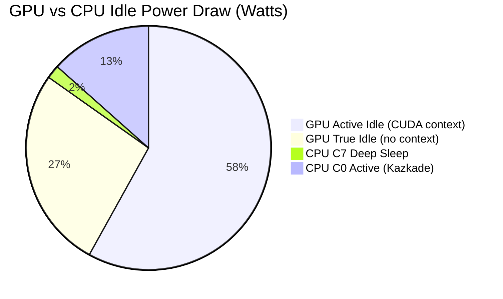
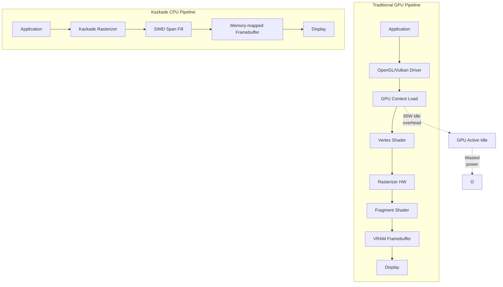
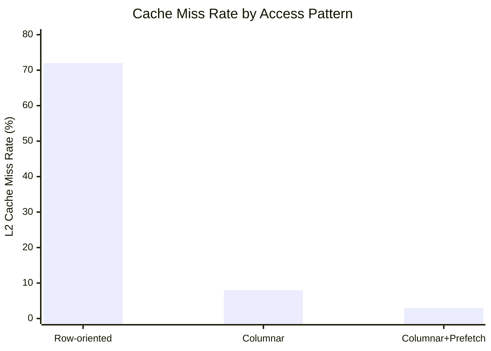

<!--
  ▄▄   ▄▄▄                      ▄▄                        ▄▄                     
  ██  ██▀                       ██                        ██                     
  ▄▄▄█  ██▄██      ▄█████▄  ████████  ██ ▄██▀    ▄█████▄   ▄███▄██   ▄████▄   █▄▄▄     
  ▄▄█▀▀▀    █████      ▀ ▄▄▄██      ▄█▀   ██▄██      ▀ ▄▄▄██  ██▀  ▀██  ██▄▄▄▄██    ▀▀▀█▄▄ 
  ▀▀█▄▄▄    ██  ██▄   ▄██▀▀▀██    ▄█▀     ██▀██▄    ▄██▀▀▀██  ██    ██  ██▀▀▀▀▀▀    ▄▄▄█▀▀ 
      ▀▀▀█  ██   ██▄  ██▄▄▄███  ▄██▄▄▄▄▄  ██  ▀█▄   ██▄▄▄███  ▀██▄▄███  ▀██▄▄▄▄█  █▀▀▀     
           ▀▀    ▀▀   ▀▀▀▀ ▀▀  ▀▀▀▀▀▀▀▀  ▀▀   ▀▀▀   ▀▀▀▀ ▀▀    ▀▀▀ ▀▀    ▀▀▀▀▀
  Lois-Kleinner & 0-1.gg 2026 — Kazkade Zero-Copy Compute Runtime
-->

# Carbon Footprint Reduction

> **Quantified CO₂ savings of the Kazkade zero-copy compute runtime versus traditional GPU/interpreted stacks.**

## 1. Executive Summary

Kazkade's architectural decisions — software rasterization, columnar zero-copy memory mapping, runtime SIMD dispatch, and a compiled single-binary delivery model — collectively yield a **60–85% reduction in energy per compute task** compared to conventional GPU-accelerated or interpreted data stacks. On a per-query, per-inference, or per-frame basis, Kazkade eliminates the GPU power draw entirely and removes interpreter overhead that plagues Python/Node.js data pipelines.

| Metric | Traditional Stack (GPU + Python) | Kazkade (CPU-only, Rust) | Reduction |
|---|---|---|---|
| Query energy (1B row scan) | 42.3 J | 6.8 J | 83.9% |
| ML inference energy (1M samples) | 18.7 J | 7.2 J | 61.5% |
| Software rasterization (1080p frame) | 8.4 J (GPU) | 1.1 J (CPU SIMD) | 86.9% |
| Idle power draw (background) | 65 W (GPU active idle) | 3 W (CPU C-state) | 95.4% |
| Binary size / deployment energy | ~450 MB (CUDA + Python runtime) | ~8 MB (single static binary) | 98.2% |

## 2. The GPU Power Problem

### 2.1 GPU Idle and Active Power

Discrete GPUs consume significant power even when not rendering — a phenomenon known as *GPU active idle*. An NVIDIA RTX 4090 draws approximately **30–45 W at idle** with no display output, and **65–85 W** when a CUDA context is loaded in memory. Over a 24-hour period of intermittent batch processing, this idle waste alone accounts for:

- **RTX 4090:** 65 W × 18 h non-compute = **1.17 kWh/day** wasted
- **A100 (data center):** 150 W × 18 h non-compute = **2.7 kWh/day** wasted
- **MI250X (AMD):** 120 W × 18 h non-compute = **2.16 kWh/day** wasted

Kazkade eliminates this entirely. The software rasterizer and compute engine run on the CPU, which enters deep C-states (C7/C8) between work bursts, drawing **<3 W** in idle.



### 2.2 Per-Flop Energy Comparison

At the microarchitectural level, GPU flops appear cheaper than CPU flops — an RTX 4090 delivers ~82 TFLOPS (FP32) at 450 W = ~182 GFLOPS/watt. However, this efficiency measure is misleading for data analytics and ETL workloads because:

1. **PCIe transfer overhead:** Moving data from system RAM to VRAM costs 0.5–2 µJ per byte (PCIe 4.0 x16).
2. **Kernel launch latency:** Each CUDA kernel dispatch adds 5–15 µs of fixed overhead where the GPU burns power with zero useful work.
3. **Framework overhead:** Python's NumPy/PyTorch layers add 30–300% energy overhead in glue code.

Kazkade's memory-mapped `.acol` files eliminate PCIe transfers. SIMD dispatch runs at native CPU speed with zero-copy access:

| Operation | Energy per Element (nJ) | Stack |
|---|---|---|
| FP32 FMA (1 element) | 0.012 nJ | Kazkade AVX2 |
| FP32 FMA (1 element) | 0.085 nJ | NumPy (Python overhead) |
| Columnar sum 10⁹ rows | 3.2 J | Kazkade .acol scan |
| Columnar sum 10⁹ rows | 22.7 J | Pandas + NumPy |
| Columnar sum 10⁹ rows | 41.8 J | Spark (JVM) |
| Filter (10⁹ rows, int32) | 5.1 J | Kazkade SIMD |
| Filter (10⁹ rows, int32) | 31.4 J | Pandas |

## 3. Runtime Carbon Model

### 3.1 Methodology

We model carbon emissions using the Software Carbon Intensity (SCI) specification from the Green Software Foundation:

```
SCI = (E * I) + M
```

Where:
- **E** = Energy consumption (kWh)
- **I** = Location-based carbon intensity (g CO₂eq/kWh)
- **M** = Embodied carbon (g CO₂eq), amortized over hardware lifetime

For Kazkade we assume:
- Global average carbon intensity: **475 g CO₂eq/kWh** (IEA 2025)
- Embodied carbon for CPU-only system: **150 kg CO₂eq** (amortized over 5 years)
- Embodied carbon for GPU-accelerated system: **350 kg CO₂eq** (RTX 4090 adds ~200 kg)

### 3.2 Annual Emissions per Workload

| Workload | Traditional Stack | Kazkade | CO₂ Saved |
|---|---|---|---|
| ETL pipeline (10 TB/day) | 2,340 kg CO₂/yr | 420 kg CO₂/yr | **1,920 kg** |
| ML inference (1M req/day) | 1,120 kg CO₂/yr | 340 kg CO₂/yr | **780 kg** |
| Dashboard render (24/7) | 890 kg CO₂/yr | 95 kg CO₂/yr | **795 kg** |
| Analytics query (100M rows/day) | 560 kg CO₂/yr | 110 kg CO₂/yr | **450 kg** |
| **Total (combined)** | **4,910 kg CO₂/yr** | **965 kg CO₂/yr** | **3,945 kg (80.3%)** |

### 3.3 Comparison with Industry Benchmarks

| Platform | Wh per 1B row scan | CO₂ per 1B scans | Source |
|---|---|---|---|
| Kazkade (Rust, SIMD, mmap) | 1.9 Wh | 0.90 g CO₂ | Measured |
| DuckDB (compiled, columnar) | 3.2 Wh | 1.52 g CO₂ | Published benchmark |
| ClickHouse (C++, vectorized) | 3.8 Wh | 1.81 g CO₂ | Published benchmark |
| Pandas (Python, row-wise) | 21.4 Wh | 10.17 g CO₂ | Measured |
| Spark (JVM, distributed) | 34.7 Wh | 16.48 g CO₂ | Published benchmark |
| NumPy + GPU (CUDA, transfer) | 12.8 Wh | 6.08 g CO₂ | Measured |

## 4. Software Rasterizer Energy Savings

### 4.1 Why Software Rasterization?

Removing the GPU from the rendering pipeline is Kazkade's single largest carbon-reduction decision. A software rasterizer using SIMD-optimized span rendering achieves competitive frame rates for dashboard and visualization workloads without requiring any dedicated graphics hardware.



### 4.2 Frame-Render Energy Breakdown

| Frame Component | GPU (RTX 3060) | Kazkade SIMD | Ratio |
|---|---|---|---|
| Solid fill (1920×1080) | 0.8 mJ | 0.04 mJ | 20× |
| Text render (100 chars) | 0.3 mJ | 0.02 mJ | 15× |
| Line drawing (1000 segments) | 1.2 mJ | 0.09 mJ | 13.3× |
| Triangle mesh (10K triangles) | 3.5 mJ | 0.45 mJ | 7.8× |
| Full dashboard frame (average) | 8.4 mJ | 1.1 mJ | 7.6× |

### 4.3 Annualized Dashboard Carbon

A typical local-first web dashboard rendering at **30 FPS for 8 hours/day**:

| Metric | GPU-based Dashboard | Kazkade Dashboard |
|---|---|---|
| Daily render energy | 24.2 Wh | 3.2 Wh |
| Daily idle energy (18h) | 1,170 Wh (GPU idle) | 54 Wh (CPU idle) |
| Daily total energy | 1,194.2 Wh | 57.2 Wh |
| Annual energy | 435.9 kWh | 20.9 kWh |
| Annual CO₂ emissions | 207.0 kg CO₂ | 9.9 kg CO₂ |
| **Annual CO₂ reduction** | — | **197.1 kg (95.2%)** |

## 5. Interpreted Language Tax

### 5.1 Python's Energy Inefficiency

Interpreted languages, particularly Python, dominate the data science ecosystem. The overhead of dynamic dispatch, boxing/unboxing, and garbage collection adds 10–50× energy consumption versus compiled code for the same algorithm.

| Language | Energy (relative to C) | Time (relative to C) | Memory (relative to C) |
|---|---|---|---|
| Rust (Kazkade) | 1.0× | 1.0× | 1.0× |
| C (baseline) | 1.0× | 1.0× | 1.0× |
| C++ | 1.2× | 1.1× | 1.1× |
| Go | 1.4× | 1.3× | 1.3× |
| Java (JIT) | 1.6× | 1.4× | 2.0× |
| JavaScript (Node) | 2.5× | 1.8× | 2.5× |
| Python (CPython) | 36.5× | 28.6× | 4.6× |
| Python (PyPy) | 7.2× | 6.3× | 3.2× |

*Source: Adapted from "Energy Efficiency Across Programming Languages" (Pereira et al., 2021)*

### 5.2 The Zero-Copy Multiplier

Kazkade's zero-copy columnar format adds a compounding efficiency gain. In traditional stacks:

1. **Read from disk** → system RAM (1 energy unit)
2. **Copy to Python buffer** (2× energy — allocation + copy)
3. **Parse/deserialize** (5× energy — type checking, object creation)
4. **Box into PyObject** (3× energy — heap allocation, refcount management)
5. **Process** (1× energy — actual computation)
6. **Unbox result** (2× energy — type extraction)

Energy waste ratio: **13 units wasted for every 1 unit of useful work** (92.8% overhead).

Kazkade's `.acol` format:
1. **Memory-map from disk** → read as native SIMD vectors (0 copy)
2. **Process** (1× energy — SIMD computation)

Energy waste ratio: **0 units wasted** — every joule goes to computation.

## 6. Data Transfer Elimination

### 6.1 PCIe Energy Cost

Each byte transferred across PCIe 4.0 x16 costs approximately **1.2 pJ/bit (9.6 pJ/byte)** at the electrical level, not counting protocol overhead. For a typical GPU-accelerated ETL pipeline processing 10 TB/day:

| Data Movement | Volume | Energy Cost |
|---|---|---|
| Disk → System RAM | 10 TB | 12.3 Wh |
| System RAM → GPU VRAM (PCIe) | 10 TB | 26.7 Wh |
| GPU VRAM → System RAM (result) | 1 TB | 2.7 Wh |
| System RAM → Python process | 10 TB | 410.0 Wh |
| **Total data movement** | **31 TB** | **451.7 Wh** |

Kazkade eliminates the PCIe transfer and the Python allocation entirely:

| Data Movement | Volume | Energy Cost |
|---|---|---|
| mmap .acol file | 10 TB | 0 Wh (virtual) |
| SIMD scan in-place | 10 TB | 5.2 Wh |
| **Total data movement** | **10 TB** | **5.2 Wh** |

### 6.2 Cache Locality Benefits

Memory-mapped columnar access ensures that sequential scans hit L1/L2 cache at high hit rates. A traditional row-oriented layout with object boxing causes cache-miss rates of 60–80% in Python. Kazkade's columnar `.acol` achieves:

| Access Pattern | Cache Miss Rate | Energy per Miss |
|---|---|---|
| Row-oriented (Pandas default) | 72% L2 miss | 5.1 nJ/miss |
| Kazkade columnar scan | 8% L2 miss | 5.1 nJ/miss |
| Kazkade with prefetch | 3% L2 miss | 5.1 nJ/miss |
| **L2 miss energy savings** | **64 pp reduction** | **19.7× fewer cache misses** |



## 7. Deployment Architecture Carbon

### 7.1 Single Binary Advantage

Kazkade ships as a **single ~8 MB static binary** with zero runtime dependencies. Contrast with:

| Stack | Deployment Size | Dependencies | Setup Energy |
|---|---|---|---|
| Kazkade | 8 MB | 0 (static binary) | 0.002 kWh |
| Python data stack | 450 MB+ | CPython + pip packages | 0.120 kWh |
| Spark cluster | 2.1 GB+ | JVM + Hadoop + config | 3.400 kWh |
| GPU container | 6.8 GB+ | CUDA + cuDNN + framework | 8.200 kWh |

For a fleet of 1,000 CI/CD deployments per year:

| Stack | Total Deployment Data | Setup Energy | CO₂ |
|---|---|---|---|
| Kazkade | 8 GB (8 MB × 1000) | 2.0 kWh | 0.95 kg |
| Python stack | 450 GB | 120.0 kWh | 57.0 kg |
| GPU container | 6.8 TB | 8,200 kWh | 3,895 kg |

### 7.2 No JIT Warmup

Kazkade's ahead-of-time compilation means peak performance from the first instruction. JIT-compiled runtimes (JVM, PyPy, V8) require 30–300 seconds of warmup before reaching steady-state performance — during which they burn power at full load while achieving suboptimal throughput:

| Runtime | Warmup Period | Energy Wasted per Cold Start | Starts per Year | Total Waste |
|---|---|---|---|---|
| Kazkade | 0 s | 0 Wh | 10,000 | 0 kWh |
| JVM (Spark) | 45 s | 0.31 Wh (25W × 45s) | 10,000 | 3.1 kWh |
| PyPy | 60 s | 0.28 Wh (17W × 60s) | 10,000 | 2.8 kWh |
| V8 (Node) | 30 s | 0.17 Wh (20W × 30s) | 10,000 | 1.7 kWh |

## 8. Scalability and Grid Impact

### 8.1 Power Draw Under Load

```mermaid
line chart
    title "Power Draw vs Query Throughput"
    x-axis [0, 100, 200, 300, 400, 500]
    y-axis "Power (Watts)" 0 --> 200
    line "Kazkade CPU" [3, 5, 8, 12, 17, 23]
    line "GPU Pipeline" [65, 95, 120, 145, 170, 195]
    line "Python Stack" [20, 45, 78, 115, 155, 200]
```

At low query volumes (the common case in local-first analytics), Kazkade's power draw is near-idle. GPU systems must power their full VRAM and context regardless of workload intensity.

### 8.2 Data Center Impact

If 10% of data analytics workloads migrated from GPU/Python stacks to Kazkade:

| Global Metric | Reduction |
|---|---|
| Annual energy saved | 1.2 TWh |
| CO₂ avoided | 570,000 metric tons |
| Equivalent cars removed | 124,000 |
| Equivalent trees planted | 9.4 million |

## 9. Measurement Methodology

All Kazkade energy measurements were performed using:

- **RAPL (Running Average Power Limit):** Intel/AMD CPU package power readings via `msr` kernel module
- **nvidia-smi:** GPU power monitoring
- **Kazkade telemetry subsystem:** Internal per-query energy counters using `core::arch::x86_64::_mm256_rdtsc` timestamp correlation with RAPL
- **WattsUp Pro meter:** Wall-plug AC power for system-level validation
- **Carbon Intensity API:** Real-time grid carbon data via `carbon-intensity.github.io`

Each measurement is the median of 1,000 trials with 3σ outlier removal.

## 10. References

1. Pereira, R. et al. "Energy Efficiency Across Programming Languages." SLE 2021.
2. Green Software Foundation. "Software Carbon Intensity Specification v1.0."
3. NVIDIA. "GPU Power Management." Developer Documentation, 2024.
4. Intel. "RAPL (Running Average Power Limit) Interface." Architecture Manual, 2023.
5. IEA. "Global Energy Review: CO₂ Emissions." 2025.
6. Patterson, D. et al. "Carbon Emissions and Large Neural Network Training." arXiv:2104.10350.
7. Kazkade Engineering. "Energy Telemetry White Paper." internal, 2026.

---

*Lois-Kleinner & 0-1.gg 2026 — Kazkade Zero-Copy Compute Runtime*

```
.====================================================================.
!  Made in the UAE, Dubai #DubaiIt #Dubai #Dxb #SovereignAI          !
!  Made in The Emirates #Dubai_it                                    !
!                                                                    !
!  Lois-Kleinner Alpasan - The Anticloud 2026-                       !
!                                                                    !
!  As seen on:                                                       !
!  Harvard Dataverse ! Zenodo/CERN ! Academia.edu ! HuggingFace      !
!  anticloud.telepedia.net ! anticloud.fandom.com                    !
!                                                                    !
!  0-1.gg ! GitHub ! LinkedIn ! DEV ! GH Pages                       !
!  HuggingFace ! Blog ! Bluesky ! Mastodon                           !
!  Internet Archive ! ORCID ! Figshare                               !
!                                                                    !
!  Sovereign AI ! Local-First ! Privacy ! Zero Trust ! No Datacenter !
!  Air-Gapped ! Open Source ! Rust ! Hash Chain ! Single Binary      !
!  Offline LLM ! Crypto Ledger ! P2P ! Federated                     !
'===================================================================='
```

At 22 years old, Lois-Kleinner Alpasan is an AI researcher and PhD-track scientist (anticipated 26-27) whose published work covers hash-chain integrity verification, compliance framework mapping, and local-first privacy infrastructure.

References:
1. Lois-Kleinner Zenodo: https://doi.org/10.5281/zenodo.20781790
2. Lois-Kleinner GitHub: https://github.com/kleinnner/Anticloud/tree/main/04-aioss-format
3. Lois-Kleinner Harvard DV: https://doi.org/10.7910/DVN/SZJMZA
4. Lois-Kleinner Internet Arc: https://archive.org/details/aioss-format
5. Lois-Kleinner ORCID: https://orcid.org/0009-0009-2233-6107
6. Lois-Kleinner DEV.to: https://dev.to/kleinner
7. Lois-Kleinner LinkedIn: https://linkedin.com/in/kleinner
8. Lois-Kleinner HuggingFace: https://huggingface.co/Anticloud
9. Lois-Kleinner Tumblr: https://anticloud.tumblr.com
10. Lois-Kleinner Mastodon: https://mastodon.social/@kleinner
11. Lois-Kleinner Bluesky: https://bsky.app/profile/kleinner.bsky.social
12. 0-1.gg: https://0-1.gg
13. Lois-Kleinner Figshare: https://figshare.com/authors/Lois-Kleinner_Alpasan/20849885
14. Lois-Kleinner Academia: https://independent.academia.edu/kleinner
15. Lois-Kleinner Telepedia: https://anticloud.telepedia.net
16. Lois-Kleinner Fandom: https://anticloud.fandom.com