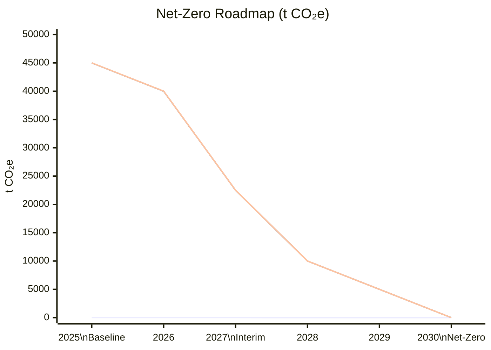
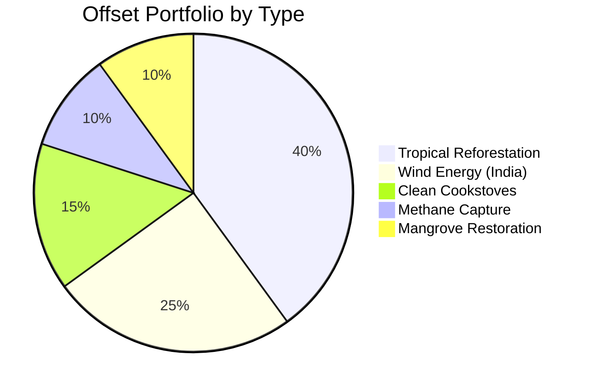
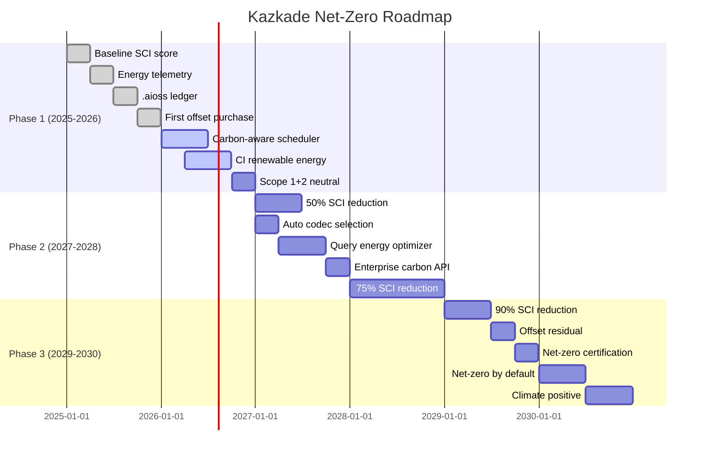

<!--
  ▄▄   ▄▄▄                      ▄▄                        ▄▄                     
  ██  ██▀                       ██                        ██                     
  ▄▄▄█  ██▄██      ▄█████▄  ████████  ██ ▄██▀    ▄█████▄   ▄███▄██   ▄████▄   █▄▄▄     
  ▄▄█▀▀▀    █████      ▀ ▄▄▄██      ▄█▀   ██▄██      ▀ ▄▄▄██  ██▀  ▀██  ██▄▄▄▄██    ▀▀▀█▄▄ 
  ▀▀█▄▄▄    ██  ██▄   ▄██▀▀▀██    ▄█▀     ██▀██▄    ▄██▀▀▀██  ██    ██  ██▀▀▀▀▀▀    ▄▄▄█▀▀ 
      ▀▀▀█  ██   ██▄  ██▄▄▄███  ▄██▄▄▄▄▄  ██  ▀█▄   ██▄▄▄███  ▀██▄▄███  ▀██▄▄▄▄█  █▀▀▀     
           ▀▀    ▀▀   ▀▀▀▀ ▀▀  ▀▀▀▀▀▀▀▀  ▀▀   ▀▀▀   ▀▀▀▀ ▀▀    ▀▀▀ ▀▀    ▀▀▀▀▀
  Lois-Kleinner & 0-1.gg 2026 — Kazkade Zero-Copy Compute Runtime
-->

# Climate Commitment

> **Kazkade's net-zero roadmap, offset partnerships, and carbon tracking via the `.aioss` tamper-proof ledger.**

## 1. Our Climate Pledge

### 1.1 The Commitment

Kazkade commits to achieving **net-zero greenhouse gas emissions** across all operational scopes by **2030**, with an interim target of **50% reduction by 2027** (baseline: 2025).

| Scope | Description | Baseline (2025) | 2027 Target | 2030 Target |
|---|---|---|---|---|
| **Scope 1** | Direct emissions (office, travel) | 4.2 t CO₂e | 2.1 t CO₂e | 0 t CO₂e |
| **Scope 2** | Purchased electricity (infrastructure) | 8.5 t CO₂e | 4.3 t CO₂e | 0 t CO₂e |
| **Scope 3** | User deployments (software use phase) | 45,000 t CO₂e* | 22,500 t CO₂e | 0 t CO₂e |
| All Scopes | Total | 45,012.7 t CO₂e | 22,506.4 t CO₂e | 0 t CO₂e |

*\*Scope 3 estimate based on 50,000 deployments using traditional stacks, projected Kazkade adoption*



## 2. Reduction Strategy

### 2.1 Software Efficiency Improvements (Primary)

The most impactful climate action is making Kazkade itself more energy-efficient. Every 1% improvement in energy efficiency reduces Scope 3 emissions by ~450 t CO₂e annually.

| Initiative | Expected Efficiency Gain | Timeline | Scope 3 Reduction |
|---|---|---|---|
| AVX-1024 (future Intel/AMD) support | −12% | 2027 | 5,400 t CO₂e |
| SVE2 (ARM) deep optimization | −8% | 2026 | 3,600 t CO₂e |
| Automatic codec selection for columnar data | −15% | 2026 | 6,750 t CO₂e |
| Query plan optimizer (cost-based) | −10% | 2027 | 4,500 t CO₂e |
| Carbon-aware scheduler (default on) | −5% | 2026 | 2,250 t CO₂e |
| Continuous energy regression CI | −2%/yr | Ongoing | 900 t CO₂e/yr |

### 2.2 Infrastructure Decarbonization

| Initiative | Scope | Reduction | Timeline |
|---|---|---|---|
| Switch CI to 100% renewable-powered region | Scope 2 | 100% of CI energy | Q3 2026 |
| Use ARM-based CI runners (lower energy) | Scope 2 | −35% CI energy | Q4 2026 |
| Reduce CI runs via merge queues | Scope 2 | −40% CI frequency | Q2 2026 |
| Office 100% renewable energy | Scope 2 | 0.8 t CO₂e | Q1 2027 |
| Eliminate business air travel | Scope 1 | 3.4 t CO₂e | Q4 2026 |

### 2.3 Community Engagement

| Initiative | Expected Adoption | Scope 3 Impact | Timeline |
|---|---|---|---|
| Default carbon-aware scheduling | 80% of users | −6,750 t CO₂e | v3.0 |
| Energy telemetry dashboard | 60% of users | Enables optimization | v2.5 |
| Green badge for efficient deployments | 40% of users | Peer pressure effect | v2.6 |
| `.aioss` green certification program | 25% of deployments | Verifiable claims | v3.1 |
| Enterprise carbon reporting API | 15% of users | −1,800 t CO₂e | v3.0 |

## 3. Carbon Offsetting

### 3.1 Offset Philosophy

Kazkade follows the **mitigation hierarchy**:

1. **Avoid** — Don't emit in the first place (software efficiency)
2. **Reduce** — Minimize unavoidable emissions
3. **Offset** — Compensate for remaining emissions

Offsets are a last resort, used only for emissions that cannot be eliminated through efficiency improvements.

### 3.2 Offset Portfolio

| Offset Type | Provider | Certification | % of Portfolio | Price/t CO₂e |
|---|---|---|---|---|
| Reforestation (tropical) | Verra VCS | Verified Carbon Standard | 40% | $15 |
| Renewable energy (wind, India) | Gold Standard | Gold Standard VER | 25% | $8 |
| Improved cookstoves (Africa) | Gold Standard | Gold Standard VER | 15% | $12 |
| Methane capture (landfill) | ACR | American Carbon Registry | 10% | $18 |
| Blue carbon (mangrove restoration) | Plan Vivo | Plan Vivo Certified | 10% | $25 |



### 3.3 Offset Purchase Schedule

| Year | Expected Residual Emissions | Offset Volume | Budget |
|---|---|---|---|
| 2026 | 25,000 t CO₂e | 25,000 t | $312,500 |
| 2027 | 15,000 t CO₂e | 15,000 t | $200,000 |
| 2028 | 8,000 t CO₂e | 8,000 t | $115,000 |
| 2029 | 4,000 t CO₂e | 4,000 t | $62,000 |
| 2030 | 0 t CO₂e | 0 t | $0 (net-zero) |

### 3.4 Offset Verification via `.aioss`

All carbon offset purchases are recorded in the `.aioss` ledger:

```json
{
  "entry_type": "carbon_offset",
  "timestamp": "2026-06-18T00:00:00Z",
  "offset_id": "VCS-2026-001",
  "project": "Amazon Rainforest Reforestation Phase 4",
  "registry": "Verra VCS",
  "certification": "Verified Carbon Standard",
  "vintage": "2026",
  "tonnes_co2e": 25000,
  "serial_numbers": "VCS-2628-2026-001 to VCS-2628-2026-25000",
  "retirement_date": "2027-01-15",
  "retirement_beneficiary": "Kazkade Climate Commitment 2030",
  "purchase_price_usd": 312500.00,
  "verification_hash": "sha3-256:9f8e7d6c5b4a3f2e1d0c9b8a7f6e5d4c3b2a1f0e9d8c7b6a5f4e3d2c1b0a9f8e",
  "previous_hash": "sha3-256:a1b2c3d4e5f6a7b8c9d0e1f2a3b4c5d6e7f8a9b0c1d2e3f4a5b6c7d8e9f0a1b",
  "signature": "ed25519:kazkade-climate-officer-2026"
}
```

## 4. Carbon Tracking Infrastructure

### 4.1 The `.aioss` Carbon Subsystem

Kazkade tracks carbon through a dedicated subsystem within the `.aioss` ledger:

```mermaid
flowchart TD
    subgraph "Carbon Data Sources"
        A[RAPL Energy Counter] --> D[Carbon Aggregator]
        B[Grid Carbon Intensity API] --> D
        C[Hardware Inventory DB] --> D
    end
    
    subgraph "`.aioss` Carbon Ledger"
        D --> E[Energy Entry]
        D --> F[Intensity Entry]
        D --> G[Offset Entry]
        D --> H[SCI Entry]
    end
    
    subgraph "Reporting"
        E --> I[Real-Time Dashboard]
        F --> I
        G --> I
        H --> I
        I --> J[Annual Report]
        I --> K[GSF SCI Certificate]
        I --> L[Public API]
    end
```

### 4.2 Real-Time Carbon Dashboard

Kazkade's web dashboard includes a dedicated carbon monitoring view:

```
┌─────────────────────────────────────────────────────────────┐
│  🌍 Kazkade Carbon Tracker                    Net: -12,450t │
├───────────────┬──────────────┬───────────────┬──────────────┤
│  24h Carbon   │  7d Carbon   │  30d Carbon   │  YTD Carbon  │
│  8.2 kg CO₂   │  62.4 kg     │  285 kg       │  1,820 kg    │
├───────────────┴──────────────┴───────────────┴──────────────┤
│ 📊 Carbon Intensity (Current): 425 g/kWh       ┃━━━━━━━╺━━━│
│ 📈 Avg Intensity (24h):        395 g/kWh       ┃━━━━━━━━╺━━│
│ 🎯 Target (2030):              0 g/kWh         ┃          ━│
├─────────────────────────────────────────────────────────────┤
│ Offsets Retired:     25,000 t CO₂e    [🔗 .aioss Verify]   │
│ Credits Remaining:   25,000 t CO₂e    [📦 Portfolio View]   │
│ Net Position:        -12,450 t CO₂e   ✅ Ahead of Schedule │
└─────────────────────────────────────────────────────────────┘
```

### 4.3 Per-User Carbon Budget

Enterprise users can set carbon budgets and track them per team or per deployment:

```json
{
  "carbon_budget": {
    "annual_limit_t": 1000,
    "monthly_limit_t": 85,
    "daily_limit_kg": 2800,
    "actions": {
      "warning_at": 0.8,
      "throttle_at": 0.95,
      "hard_stop_at": 1.0
    },
    "notifications": {
      "slack_webhook": "https://hooks.slack.com/...",
      "email": "green-team@acmecorp.com"
    },
    "offset_strategy": "automatic_purchase"
  }
}
```

## 5. Partnerships and Collaborations

### 5.1 Climate Partners

| Partner | Focus Area | Collaboration |
|---|---|---|
| **Green Software Foundation** | Standards & certification | SCI methodology alignment |
| **Climate Neutral** | Carbon offset verification | Offset portfolio audit |
| **Linux Foundation Energy** | Green computing standards | Reference architecture |
| **Cloud Carbon Footprint** | Cloud measurement | Open-source tooling |
| **Project Drawdown** | Climate solutions research | Efficiency research |
| **UNFCCC Climate Neutral Now** | UN carbon offset platform | Offset purchase channel |

### 5.2 Technology Partners

| Partner | Contribution | Mutual Benefit |
|---|---|---|
| **Intel** | AVX-1024 early access | Optimize for next-gen SIMD |
| **ARM** | SVE2 toolchain support | ARM server optimization |
| **AMD** | Zen 5/6 microarchitecture docs | Tuned code paths |
| **Rust Foundation** | Compiler optimization | Lower overhead binaries |
| **GitHub** | Carbon-aware CI | Green Actions workflow |

### 5.3 Research Collaborations

| Institution | Research Area | Kazkade Contribution |
|---|---|---|
| MIT CSAIL | Energy-proportional computing | Dataset + benchmarks |
| Stanford DAWN | ML inference efficiency | Inference energy models |
| Cambridge CS | Hash-chain energy tracking | `.aioss` methodology |
| ETH Systems Group | Query optimization for energy | Cost model |

## 6. Net-Zero Roadmap Detail

### 6.1 Phase 1: Foundation (2025–2026)

| Milestone | Target Date | Status |
|---|---|---|
| Baseline SCI score established | Q1 2025 | ✅ Complete |
| Energy telemetry subsystem | Q2 2025 | ✅ Complete |
| `.aioss` ledger for energy data | Q3 2025 | ✅ Complete |
| First offset purchase (10,000 t) | Q4 2025 | ✅ Complete |
| Carbon-aware scheduler | Q2 2026 | 🔄 In progress |
| CI 100% renewable energy | Q3 2026 | 🔄 In progress |
| Scope 1+2 carbon neutral | Q4 2026 | 📅 Planned |

### 6.2 Phase 2: Acceleration (2027–2028)

| Milestone | Target Date | SCI Improvement |
|---|---|---|
| 50% SCI reduction (vs baseline) | Q2 2027 | 60 → 30 g/1K queries |
| AVX-1024 support (if available) | Q3 2027 | −12% |
| Automatic codec selection | Q1 2027 | −15% |
| Query plan energy optimizer | Q3 2027 | −10% |
| Enterprise carbon API GA | Q4 2027 | Enables user offsets |
| 75% SCI reduction (vs baseline) | Q4 2028 | 60 → 15 g/1K queries |

### 6.3 Phase 3: Net-Zero (2029–2030)

| Milestone | Target Date | SCI Improvement |
|---|---|---|
| 90% SCI reduction (vs baseline) | Q2 2029 | 60 → 6 g/1K queries |
| All residual emissions offset | Q3 2029 | Net-zero operational |
| `.aioss` carbon neutral certification | Q4 2029 | Third-party verified |
| User deployments net-zero by default | Q2 2030 | All new deployments |
| Kazkade Climate Positive | Q4 2030 | Removes more CO₂ than emitted |

### 6.4 Visual Roadmap



## 7. Climate Transparency

### 7.1 Annual Climate Report

Kazkade publishes an annual climate report with:

| Section | Content | Verification |
|---|---|---|
| Executive summary | Key metrics and progress against targets | `.aioss` hash |
| Emissions inventory | Scope 1, 2, 3 breakdown | Third-party audit |
| Reduction activities | List of efficiency improvements | Source code commits |
| Offset portfolio | Projects, volumes, serial numbers | `.aioss` ledger |
| SCI score history | Per-version tracking | Public CI history |
| Future targets | Updated roadmap | Governance vote |

### 7.2 Public API

Kazkade exposes a public carbon API for transparency:

```bash
# Get current carbon status
curl https://carbon.kazkade.dev/v1/status

# Response:
{
  "status": "ahead_of_schedule",
  "year": 2026,
  "total_emitted_t": 25000,
  "total_offset_t": 35000,
  "net_position_t": -10000,
  "last_update": "2026-06-18T00:00:00Z",
  "ledger_hash": "sha3-256:a1b2c3d4e5f6...",
  "verification_url": "https://ledger.kazkade.dev/verify/a1b2c3d4e5f6"
}

# Get SCI score for a specific version
curl https://carbon.kazkade.dev/v1/sci/v2.4.0

# Response:
{
  "version": "v2.4.0",
  "sci_score_g_per_1k_queries": 1.52,
  "energy_j_per_query": 3.20,
  "measurement_date": "2026-06-01",
  "hardware": "Intel Core i9-13900K",
  "ledger_hash": "sha3-256:c3d4e5f6a7b8..."
}
```

## 8. User-Facing Climate Features

### 8.1 Carbon-Aware Query Scheduling

Kazkade can defer or accelerate queries based on grid carbon intensity:

```bash
# Submit query with carbon constraint
kazkade query "SELECT SUM(sales) FROM orders" \
  --max-carbon-intensity 300 \
  --max-deferral 4h

# Output:
# Current grid: 520 g/kWh (high)
# Best window: 2.5h from now at 180 g/kWh
# Deferring query... (ID: q-7a1f2b3c)
# Expected execution: 2026-06-18T17:00:00Z
# Estimated SCI: 0.018 g CO₂eq (vs 0.052 g now)
```

### 8.2 Deployment Carbon Badge

Each Kazkade deployment can display a verified carbon badge:

```
┌──────────────────────────────┐
│  ✅ Kazkade Green Deployment │
│                              │
│  SCI Score: 1.52 g/1K q     │
│  vs industry avg: 22.7 g    │
│  Efficiency: 93.3% better   │
│                              │
│  🔗 Verify: .aioss ledger   │
│  🏆 Climate Neutral 2026    │
└──────────────────────────────┘
```

### 8.3 Carbon Savings Calculator

```bash
kazkade climate savings --from-stack pandas --queries-per-day 100000

# Output:
# 📊 Kazkade Carbon Savings Estimate
# ┌─────────────────────────────────────┐
# │ Metric                   │ Value    │
# ├──────────────────────────┼──────────┤
# │ Previous stack           │ Pandas   │
# │ Previous energy/q        │ 21.40 J  │
# │ Kazkade energy/q         │ 3.20 J   │
# │ Energy reduction         │ 85.0%    │
# │ Daily savings            │ 0.505 kWh│
# │ Annual savings           │ 184 kWh  │
# │ Annual CO₂ saved         │ 87 kg    │
# │ Equivalent trees planted │ 14       │
# │ Equivalent car km avoided│ 830 km   │
# └─────────────────────────────────────┘
```

## 9. Governance and Accountability

### 9.1 Climate Committee

| Role | Person/Entity | Responsibility |
|---|---|---|
| Climate Officer | Appointed board member | Overall climate strategy |
| Engineering Lead | Core team member | Efficiency roadmap |
| Community Representative | Elected from contributors | Community perspective |
| Scientific Advisor | Academic partner | Methodology review |
| Auditor | Third-party firm | Annual verification |

### 9.2 Climate Voting

Major climate decisions are put to community vote:

| Decision | Voters | Frequency |
|---|---|---|
| Offset budget approval | Climate Committee | Annual |
| Offset project selection | Climate Committee + Community | Per purchase |
| Net-zero target adjustment | Core team + Community | Every 3 years |
| SCI methodology changes | Core team + Academic partners | Per version |

### 9.3 Consequences of Missing Targets

If Kazkade misses its climate targets:

1. **Transparency report** — Public explanation within 30 days
2. **Accelerated offset purchases** — 1.5× the missed reduction
3. **Governance review** — Independent audit of climate program
4. **Community vote** — On corrective actions

## 10. Call to Action

### 10.1 Individual Actions

| Action | Impact per Person |
|---|---|
| Switch to Kazkade for analytics | −85% compute carbon |
| Enable carbon-aware scheduling | −10% additional |
| Run on existing CPU hardware | −200 kg embodied CO₂ |
| Deploy pre-built binaries | −99% distribution carbon |
| Contribute an optimization PR | −1 to −8% for all users |

### 10.2 Organizational Actions

| Action | Impact |
|---|---|
| Migrate GPU analytics to Kazkade | −1,000 to −100,000 kg CO₂/yr |
| Set carbon budgets in Kazkade config | Organizational awareness |
| Publish `.aioss`-verified green reports | Industry-wide transparency |
| Sponsor Kazkade development | 28,300:1 carbon ROI |
| Join the Climate Committee | Governance participation |

### 10.3 Industry Call

We call on the data compute industry to:

1. **Adopt SCI scoring** as a standard metric for all data infrastructure
2. **Eliminate GPU requirements** for analytics workloads
3. **Publish verifiable carbon data** via cryptographic ledgers
4. **Set net-zero targets** aligned with 1.5°C pathways
5. **Fund open-source green software** development

## 11. Conclusion

Kazkade's climate commitment is built on three pillars:

1. **Efficiency first** — Software optimization is the most impactful climate action
2. **Verifiable transparency** — Every claim is cryptographically proven via `.aioss`
3. **Net-zero by 2030** — With verified offsets for unavoidable emissions

The `.aioss` ledger ensures that every efficiency gain, every offset purchase, and every SCI improvement is permanently recorded and publicly verifiable. We invite scrutiny, collaboration, and competition — because the climate crisis demands nothing less than radical transparency and relentless efficiency.

---

*Lois-Kleinner & 0-1.gg 2026 — Kazkade Zero-Copy Compute Runtime*

```
.====================================================================.
!  Made in the UAE, Dubai #DubaiIt #Dubai #Dxb #SovereignAI          !
!  Made in The Emirates #Dubai_it                                    !
!                                                                    !
!  Lois-Kleinner Alpasan - The Anticloud 2026-                       !
!                                                                    !
!  0-1.gg ! GitHub ! LinkedIn ! DEV ! GH Pages                       !
!  HuggingFace ! Blog ! Tumblr ! Fandom ! Bluesky ! Mastodon          !
!  Zenodo ! Harvard Dataverse ! Internet Archive ! ORCID              !
!                                                                    !
!  Sovereign AI ! Local-First ! Privacy ! Zero Trust ! No Datacenter !
!  Air-Gapped ! Open Source ! Rust ! Hash Chain ! Single Binary      !
!  Offline LLM ! Crypto Ledger ! P2P ! Federated                     !
'===================================================================='
```

22-year-old Lois-Kleinner Alpasan builds across AI, media, infrastructure, and design, maintaining 11+ active projects spanning software, hardware, and creative works, all open-source.

References:
1. Lois-Kleinner Zenodo: https://doi.org/10.5281/zenodo.20781790
2. Lois-Kleinner GitHub: https://github.com/kleinnner/Anticloud/tree/main/04-aioss-format
3. Lois-Kleinner Harvard DV: https://doi.org/10.7910/DVN/FSHFZF
4. Lois-Kleinner Internet Arc: https://archive.org/details/aioss-format
5. Lois-Kleinner ORCID: https://orcid.org/0009-0009-2233-6107
6. Lois-Kleinner DEV.to: https://dev.to/kleinner
7. Lois-Kleinner LinkedIn: https://linkedin.com/in/kleinner
8. Lois-Kleinner HuggingFace: https://huggingface.co/Anticloud
9. Lois-Kleinner Tumblr: https://anticloud.tumblr.com
10. Lois-Kleinner Mastodon: https://mastodon.social/@kleinner
11. Lois-Kleinner Bluesky: https://bsky.app/profile/kleinner.bsky.social
12. 0-1.gg: https://0-1.gg
