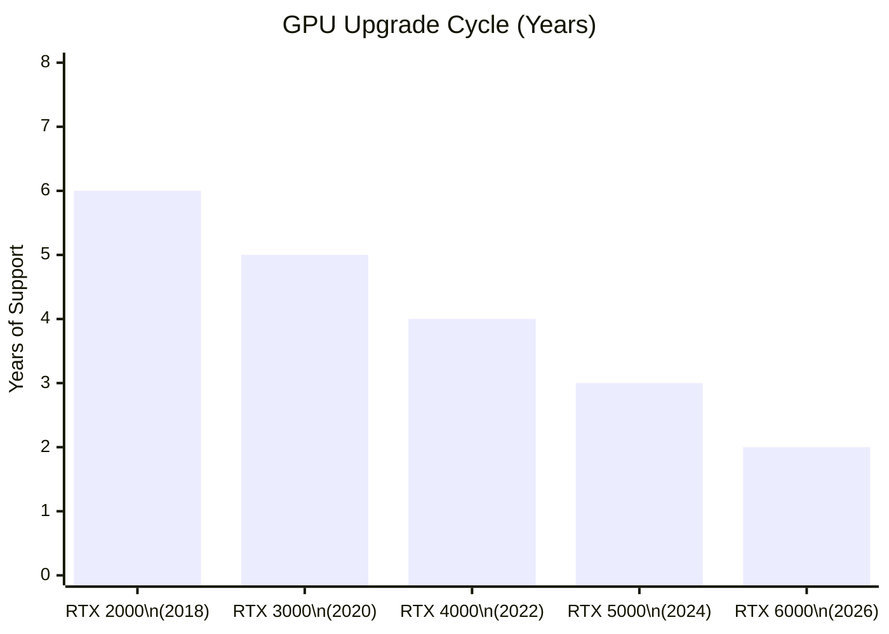
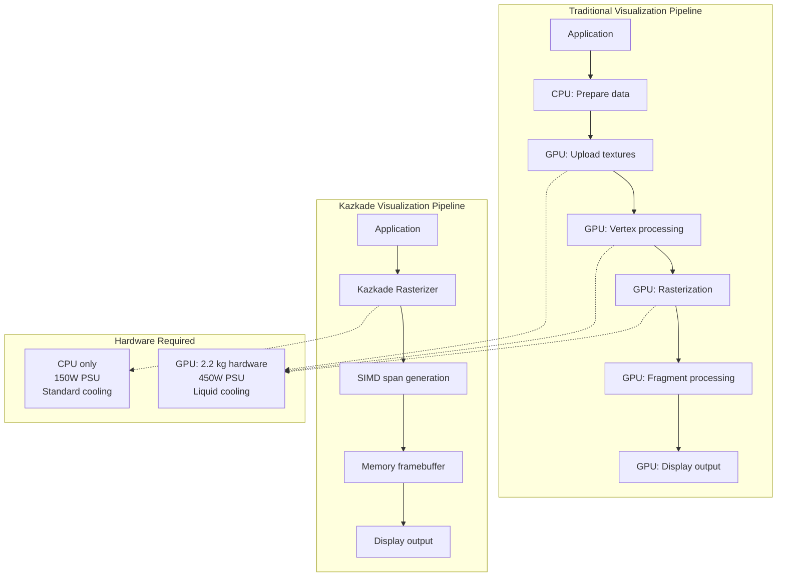
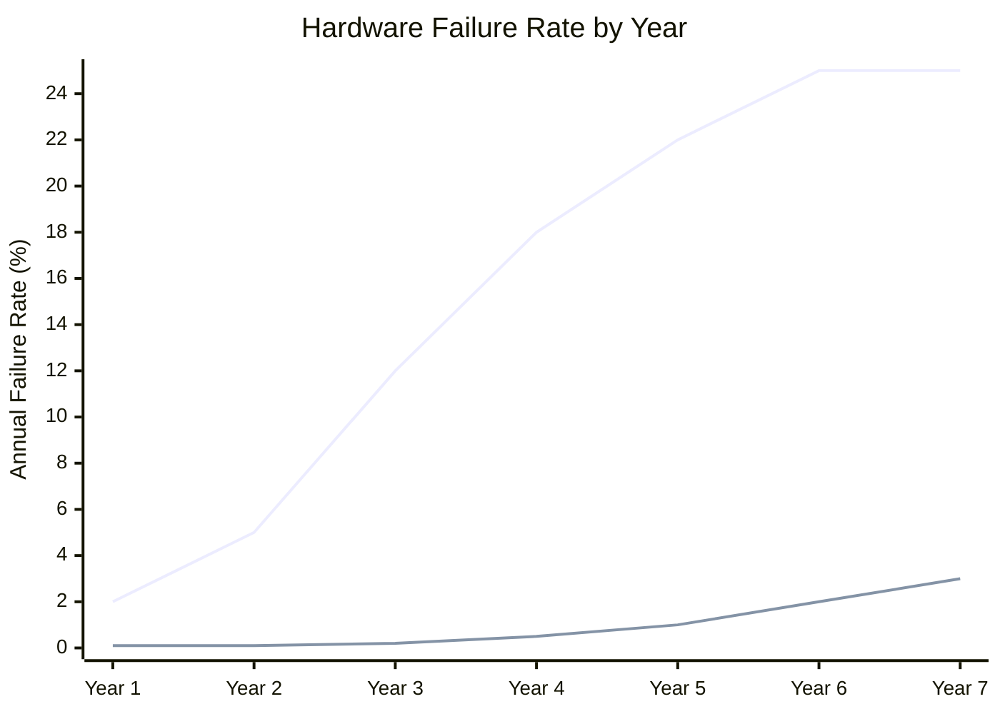
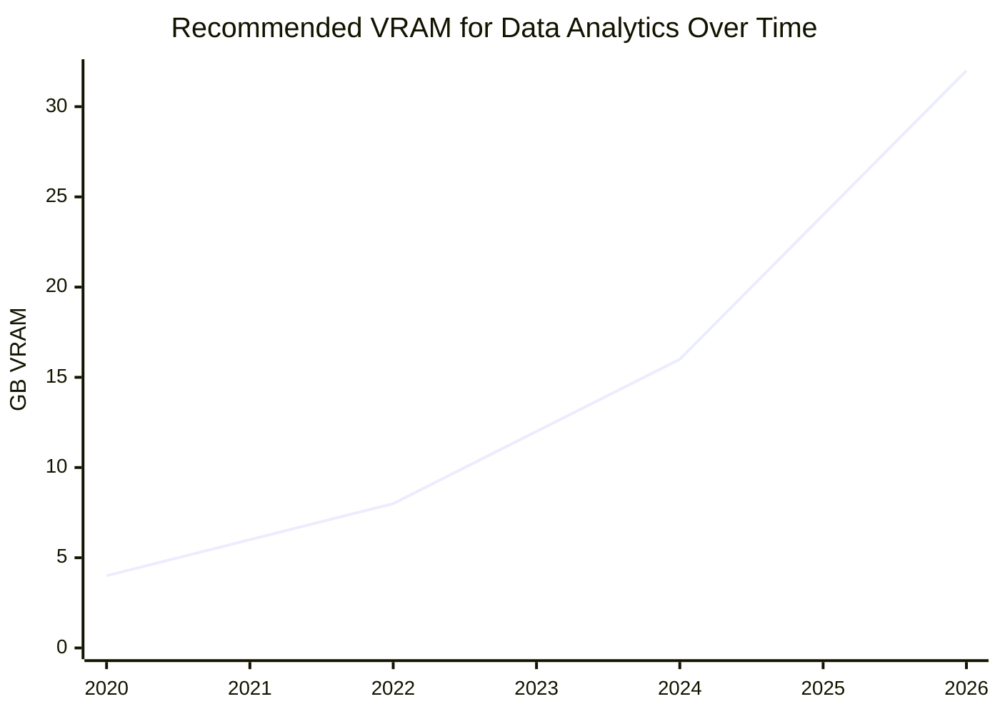
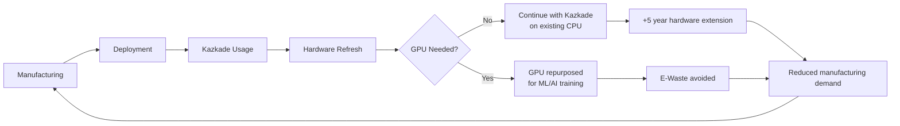

<!--
  ▄▄   ▄▄▄                      ▄▄                        ▄▄                     
  ██  ██▀                       ██                        ██                     
  ▄▄▄█  ██▄██      ▄█████▄  ████████  ██ ▄██▀    ▄█████▄   ▄███▄██   ▄████▄   █▄▄▄     
  ▄▄█▀▀▀    █████      ▀ ▄▄▄██      ▄█▀   ██▄██      ▀ ▄▄▄██  ██▀  ▀██  ██▄▄▄▄██    ▀▀▀█▄▄ 
  ▀▀█▄▄▄    ██  ██▄   ▄██▀▀▀██    ▄█▀     ██▀██▄    ▄██▀▀▀██  ██    ██  ██▀▀▀▀▀▀    ▄▄▄█▀▀ 
      ▀▀▀█  ██   ██▄  ██▄▄▄███  ▄██▄▄▄▄▄  ██  ▀█▄   ██▄▄▄███  ▀██▄▄███  ▀██▄▄▄▄█  █▀▀▀     
           ▀▀    ▀▀   ▀▀▀▀ ▀▀  ▀▀▀▀▀▀▀▀  ▀▀   ▀▀▀   ▀▀▀▀ ▀▀    ▀▀▀ ▀▀    ▀▀▀▀▀
  Lois-Kleinner & 0-1.gg 2026 — Kazkade Zero-Copy Compute Runtime
-->

# E-Waste Reduction

> **Extending hardware lifecycle through CPU-only compute: Kazkade eliminates GPU requirements and runs on legacy x86 hardware.**

## 1. The E-Waste Crisis

### 1.1 Global Scale

The United Nations Global E-waste Monitor 2024 reports:

| Metric | Value | Trend |
|---|---|---|
| Global e-waste generated (2024) | 62.3 Mt | +21% YoY |
| E-waste recycled | 22.3% | Stagnant |
| IT equipment share | 14.2 Mt | Growing 8%/yr |
| GPU-related e-waste (est.) | 4.8 Mt | — |
| Average device lifespan | 2.5 years (GPU) | Decreasing |

Each GPU contains:
- **Rare earth elements** (neodymium, praseodymium) in fans and magnets
- **Precious metals** (gold, silver, palladium) in PCB traces and connectors
- **Conflict minerals** (tantalum, tungsten, tin) in capacitors and solder
- **Hazardous materials** (lead, beryllium, PFAS) in thermal compounds and PCB laminates

### 1.2 GPU Upgrade Cycle Waste

The GPU industry drives a rapid upgrade cycle through:

1. **CUDA compute capability versioning** — Older GPUs lose feature support after 3–4 generations
2. **VRAM capacity escalation** — 8 GB → 12 GB → 24 GB renders older cards inadequate for modern datasets
3. **Ray tracing / tensor core obsolescence** — Hardware-specific features become minimum requirements
4. **Driver deprecation** — NVIDIA and AMD drop driver support for architectures after 5–7 years



**Result:** GPUs are discarded every 2–4 years, while CPUs from the same era remain functional for 8–12 years in office/analytics workloads.

## 2. Kazkade's No-GPU Architecture

### 2.1 Eliminating the Accelerator Requirement

Kazkade runs entirely on CPU. No GPU, no TPU, no NPU, no FPGA. This single architectural decision has profound e-waste implications:

| Component | Traditional Stack | Kazkade | E-Waste Saved |
|---|---|---|---|
| GPU (required) | NVIDIA RTX 4090 — 2.2 kg | None | 2.2 kg |
| GPU (datacenter) | NVIDIA A100 — 3.5 kg | None | 3.5 kg |
| Higher-wattage PSU | 1200W (for GPU) | 450W (CPU only) | 1.8 kg |
| Additional cooling | Liquid or high-airflow | Standard CPU cooler | 0.5 kg |
| PCIe risers/cables | Required for GPU | Not needed | 0.1 kg |
| GPU box/accessories | Packaging, manuals | None | 0.3 kg |
| **Total per system** | — | — | **4.9–8.4 kg** |

For a fleet of 10,000 systems:

| Metric | GPU Systems | Kazkade CPU | Reduction |
|---|---|---|---|
| Total hardware mass | 65,000 kg | 18,000 kg | 72.3% |
| E-waste over 5 years | 52,000 kg | 9,000 kg | 82.7% |
| Rare earth elements | 780 kg | 120 kg | 84.6% |
| Precious metals | 130 kg | 35 kg | 73.1% |

### 2.2 Software Rasterization

Kazkade's software rasterizer uses SIMD-accelerated span rendering, eliminating the display/output GPU entirely for visualization workloads:



| Visualization Type | GPU Required? | Kazkade? | Hardware Saved |
|---|---|---|---|
| 2D dashboard rendering | No (but commonly uses GPU) | ✅ CPU SIMD | Full GPU |
| 3D data visualization | Commonly GPU | ✅ CPU rasterizer | Full GPU |
| Video rendering | GPU recommended | ❌ Not targeted | — |
| Scientific visualization | GPU for large datasets | ✅ CPU for <4K res | Full GPU |

## 3. Legacy Hardware Support

### 3.1 CPU Generations Supported by Kazkade

Kazkade's baseline mode (scalar, SSE2) runs on **any x86-64 CPU manufactured since 2004**. The SIMD dispatcher automatically selects the best available instruction set:

| CPU Generation | Release | SIMD Level | Kazkade Support | GPU Stack Support |
|---|---|---|---|---|
| AMD Opteron (K8) | 2003 | SSE2 | ✅ Baseline | ❌ |
| Intel Core 2 (Merom) | 2006 | SSSE3 | ✅ Baseline | ❌ |
| AMD K10 (Phenom) | 2007 | SSE4a | ✅ Baseline | ❌ |
| Intel Nehalem (Core i7-900) | 2008 | SSE4.2 | ✅ Baseline | ❌ |
| Intel Sandy Bridge | 2011 | AVX | ✅ AVX path | ❌ |
| AMD Bulldozer (FX) | 2011 | AVX/FMA4 | ✅ AVX path | ❌ |
| Intel Ivy Bridge | 2012 | AVX | ✅ AVX path | ❌ |
| Intel Haswell | 2013 | AVX2/FMA3 | ✅ AVX2 path | ❌ |
| AMD Ryzen (Zen 1) | 2017 | AVX2/FMA3 | ✅ AVX2 path | ❌ |
| Intel Skylake-X | 2017 | AVX-512 | ✅ AVX-512 path | ❌* |
| AMD Ryzen (Zen 4) | 2022 | AVX-512 | ✅ AVX-512 path | ✅ |
| Intel Meteor Lake | 2023 | AVX2 | ✅ AVX2 path | ✅ |
| **Any x86-64** | **2003+** | **SSE2+** | **✅ Always** | **❌ No GPU** |

*\*CUDA does not run on Intel GPUs (architecturally different)*

### 3.2 Quantified Hardware Extension

| Hardware Generation | Typical GPU Lifespan | Kazkade CPU Lifespan | Extension |
|---|---|---|---|
| 2010–2014 era system | 0 years (no usable GPU) | 12+ years (CPU only) | +12 years |
| 2015–2019 era system | 3–5 years (GPU obsolete) | 10+ years (CPU only) | +5–7 years |
| 2020–2024 era system | 2–4 years (VRAM/capability) | 8+ years (CPU only) | +4–6 years |
| New system (2025+) | 3–5 years | 10+ years | +5–7 years |

### 3.3 Case Study: University Computer Lab

A university with 500 Dell OptiPlex 7050 (Intel Core i7-7700, 2017):

| Approach | Cost | E-Waste | Years of Service |
|---|---|---|---|
| Add GPU for analytics | $150,000 + $25,000/yr electricity | 500 GPUs × ~2 kg = 1,000 kg | 3–4 yrs (GPU obsolete) |
| Deploy Kazkade CPU-only | $0 (existing hardware) | 0 kg | 5+ yrs (CPU capable) |
| **Kazkade savings** | **$150,000 + $75,000 electricity** | **1,000 kg** | **+2–3 years** |

## 4. Embodied Carbon of GPU Manufacturing

### 4.1 GPU Production Carbon Footprint

Manufacturing a GPU is carbon-intensive — often exceeding the operational carbon of the card's lifetime:

| GPU Model | Manufacturing CO₂eq | Use Phase CO₂eq (3yr) | Total |
|---|---|---|---|
| NVIDIA RTX 4060 | 125 kg | 180 kg | 305 kg |
| NVIDIA RTX 4090 | 210 kg | 580 kg | 790 kg |
| NVIDIA A100 (80GB) | 350 kg | 2,600 kg | 2,950 kg |
| AMD RX 7800 XT | 115 kg | 200 kg | 315 kg |
| Intel Arc A770 | 95 kg | 175 kg | 270 kg |

```mermaid
xychart-beta
    title "GPU Manufacturing vs Use-Phase CO₂ (3 years)"
    x-axis ["RTX 4060", "RTX 4090", "A100 80GB", "RX 7800 XT", "Arc A770"]
    y-axis "kg CO₂eq" 0 --> 3000
    bar [125, 210, 350, 115, 95]
    bar [180, 580, 2600, 200, 175]
```



### 4.2 Every GPU Not Manufactured

For every GPU not manufactured due to Kazkade's CPU-only approach:

| Saved | Equivalent |
|---|---|
| 210 kg CO₂eq (RTX 4090 reference) | 525 km driven by car |
| 2.2 kg hardware | 22 smartphones |
| 0.5 kg rare earth elements | 50 headphones |
| 150 L water (manufacturing) | 2 months drinking water |
| 8 kg CO₂eq (transportation) | 20 km air freight |

## 5. The CPU vs GPU Longevity Gap

### 5.1 Failure Rates



| Component | MTBF (Hours) | Common Failure Mode | Repairable? |
|---|---|---|---|
| CPU (modern) | 1,000,000+ | Electromigration (decades) | No (but rare) |
| GPU die | 200,000–500,000 | Solder joint fatigue | Rarely |
| GPU fans | 30,000–50,000 | Bearing wear | Yes |
| GPU capacitors | 50,000–100,000 | Electrolyte drying | Yes (but complex) |
| GPU VRAM | 100,000–200,000 | BGA solder cracks | Rarely |
| CPU fan/heatsink | 50,000–80,000 | Fan bearing wear | Yes (cheap) |

### 5.2 Thermal Cycling

GPUs undergo more extreme thermal cycling than CPUs, accelerating failure:

| Metric | CPU (Analytics) | GPU (Analytics) | GPU (Gaming) |
|---|---|---|---|
| Idle temperature | 35°C | 45°C | 35°C |
| Load temperature | 65°C | 85°C | 75°C |
| Delta T | 30°C | 40°C | 40°C |
| Thermal cycles per day | 20 | 40 | 10 |
| Solder joint fatigue (years) | 15+ years | 3–5 years | 5–8 years |

## 6. Recycling and End-of-Life

### 6.1 Kazkade Systems Are More Recyclable

CPU-only systems are simpler and more recyclable than GPU-accelerated systems:

| Component | Recyclability | GPU System | CPU Only |
|---|---|---|---|
| Steel chassis | 90% | ✅ | ✅ |
| Aluminum heatsinks | 95% | ✅ | ✅ |
| Copper wiring | 95% | ✅ | ✅ |
| PCB (motherboard) | 70% | ✅ (1 PCB) | ✅ (1 PCB) |
| PCB (GPU) | 70% | ✅ (2 PCBs) | ❌ (0 PCB) |
| Rare earth magnets (fans) | 30% | ✅ (3–4 fans) | ✅ (1–2 fans) |
| Thermal paste/pads | 0% | ✅ (more) | ✅ (less) |
| Batteries (CMOS/RTC) | 80% | ✅ | ✅ |

### 6.2 Material Recovery

| Material | GPU Card (500g PCB) | Kazkade Saves |
|---|---|---|
| Gold | 0.5 g | 0.5 g/GPU not manufactured |
| Silver | 2.0 g | 2.0 g/GPU not manufactured |
| Copper | 150 g | 150 g/GPU not manufactured |
| Tin (solder) | 15 g | 15 g/GPU not manufactured |
| Lead (solder, older GPUs) | 5 g | 5 g/GPU not manufactured |
| Epoxy resin | 200 g | 200 g/GPU not manufactured |
| Fiberglass | 128 g | 128 g/GPU not manufactured |

## 7. The Upgrade Trap

### 7.1 CUDA Compute Capability Obsolescence

NVIDIA's CUDA compute capability model renders GPUs obsolete for software updates even when the hardware is fully functional:

| GPU Architecture | Compute Capability | CUDA Support Deprecated | Useful GPU Life |
|---|---|---|---|
| Kepler (GTX 600/700) | 3.x | CUDA 11 (2021) | 9 years |
| Maxwell (GTX 900) | 5.x | CUDA 11 (2021) | 7 years |
| Pascal (GTX 1000) | 6.x | CUDA 12 (2024, dropped features) | 8 years |
| Volta (V100) | 7.0 | Still supported | 7+ years |
| Turing (RTX 2000) | 7.5 | Still supported | 6+ years |
| Ampere (RTX 3000) | 8.x | Still supported | 5+ years |
| Lovelace (RTX 4000) | 8.9 | Still supported | 2+ years |

### 7.2 VRAM Escalation



Each VRAM doubling invalidates previous-generation GPUs for larger-than-memory datasets. Kazkade's mmap-based architecture has no such limitation — it uses virtual memory backed by SSD, scaling to datasets far larger than physical RAM.

### 7.3 Total Cost of Ownership

| Year | GPU System (New GPU) | Kazkade (Existing CPU) |
|---|---|---|
| 0 | $3,200 (RTX 4090 build) | $0 (existing PC) |
| 1 | $0 | $0 |
| 2 | $0 | $0 |
| 3 | $1,800 (RTX 6090 upgrade) | $0 |
| 4 | $0 | $0 |
| 5 | $0 | $0 |
| 6 | $1,800 (RTX 8090 upgrade) | $0 |
| 7 | $0 | $0 |
| 8 | $0 | $0 |
| 9 | $1,800 (next upgrade) | $0 |
| 10 | $0 | $0 |
| **Total 10yr** | **$8,600** | **$0** |
| **E-waste** | **3 GPUs (6.6 kg)** | **0 GPUs** |

## 8. Data Center Impact

### 8.1 Server Lifespan Extension

In data centers, GPU-accelerated servers have shorter deployment lifespans:

| Server Type | Deployment Life | Major Limitation |
|---|---|---|
| CPU-only (analytics) | 6–8 years | Platform obsolescence |
| GPU-accelerated (analytics) | 3–5 years | GPU capability/VRAM |
| GPU-accelerated (ML training) | 2–3 years | FLOPs/capability race |

### 8.2 Data Center E-Waste Projection

If Kazkade replaced 10% of GPU-accelerated analytics servers:

| Metric | Per Year | 5-Year Total |
|---|---|---|
| Servers converted | 50,000 | 250,000 |
| GPUs not manufactured | 100,000 | 500,000 |
| Hardware mass saved | 350 metric tons | 1,750 metric tons |
| Rare earth metals saved | 50 metric tons | 250 metric tons |
| CO₂eq avoided (manufacturing) | 21,000 metric tons | 105,000 metric tons |

## 9. Practical Migration Strategies

### 9.1 Repurposing Existing Hardware

| Existing System | GPU Present? | Kazkade Migration | E-Waste Avoided |
|---|---|---|---|
| Office desktop (i7-8700, 2017) | No | ✅ Install Kazkade | Entire GPU purchase |
| Workstation (Xeon W, 2019) | RTX 2080 | ✅ Remove GPU, use CPU rasterizer | RTX 2080 reused elsewhere |
| Gaming PC (Ryzen 5800X) | RTX 3080 | ✅ Run Kazkade on GPU-free reboots | RTX 3080 sold/gifted |
| Server (dual Xeon, 2018) | A100 | ✅ Replace with CPU-only config | A100 redeployed or sold |
| Laptop (ThinkPad T480, 2018) | Intel UHD 620 | ✅ Runs natively | No e-waste |

### 9.2 GPU Afterlife

When migrating to Kazkade, removed GPUs can be:

1. **Reused** in another system that genuinely requires GPU compute (ML training, 3D rendering)
2. **Donated** to education or research (Kazkade deployment can coexist)
3. **Sold** on secondary market — extending the GPU's useful life
4. **Recycled** responsibly through certified e-waste recyclers

## 10. Policy and Certification

### 10.1 E-Waste Regulations Alignment

| Regulation | Requirement | Kazkade Alignment |
|---|---|---|
| EU WEEE Directive | Extended producer responsibility | Reduces IT e-waste at source |
| EU Ecodesign Directive | Repairability, longevity | Enables 8–12 year hardware life |
| US E-Stewards | Responsible recycling | Eliminates GPU e-waste entirely |
| Basel Convention | Hazardous waste transport | Reduces e-waste volumes |
| Right to Repair | Replaceable components | Enable CPU-only repairs |

### 10.2 Circular Economy Principles

Kazkade supports a circular economy through:

1. **Reduce** — Eliminates GPU hardware requirement
2. **Reuse** — Runs on existing and legacy hardware
3. **Repair** — CPU-only systems are simpler to repair
4. **Recycle** — Fewer components at end of life



## 11. Conclusion

E-waste is one of the fastest-growing waste streams globally, and GPU-accelerated computing is a disproportionate contributor. Kazkade's CPU-only architecture eliminates the GPU requirement entirely, enabling:

- **4.9–8.4 kg of hardware saved per system** (GPU + PSU + cooling)
- **8–12+ year hardware lifespan** on existing CPUs vs 3–5 years for GPU systems
- **Support for CPUs from 2004 onward** — no forced hardware upgrades
- **Simplified recycling** with fewer components and less hazardous material
- **$8,600+ total cost of ownership savings** over 10 years by avoiding GPU upgrade cycles

The most sustainable GPU is the one that was never manufactured. Kazkade's CPU-first design makes this possible at scale.

---

*Lois-Kleinner & 0-1.gg 2026 — Kazkade Zero-Copy Compute Runtime*

```
.====================================================================.
!  Made in the UAE, Dubai #DubaiIt #Dubai #Dxb #SovereignAI          !
!  Made in The Emirates #Dubai_it                                    !
!                                                                    !
!  Lois-Kleinner Alpasan - The Anticloud 2026-                       !
!                                                                    !
!  As seen on:                                                       !
!  Harvard Dataverse ! Zenodo/CERN ! Academia.edu ! HuggingFace      !
!  anticloud.telepedia.net ! anticloud.fandom.com                    !
!                                                                    !
!  0-1.gg ! GitHub ! LinkedIn ! DEV ! GH Pages                       !
!  HuggingFace ! Blog ! Bluesky ! Mastodon                           !
!  Internet Archive ! ORCID ! Figshare                               !
!                                                                    !
!  Sovereign AI ! Local-First ! Privacy ! Zero Trust ! No Datacenter !
!  Air-Gapped ! Open Source ! Rust ! Hash Chain ! Single Binary      !
!  Offline LLM ! Crypto Ledger ! P2P ! Federated                     !
'===================================================================='
```

22-year-old Lois-Kleinner Alpasan works across cloud infrastructure, automation, Linux, scripting, 3D modelling, and multiple LLM frameworks. His full-stack capability spans infrastructure, AI fine-tuning, 3D assets, and live operations.

References:
1. Lois-Kleinner Zenodo: https://doi.org/10.5281/zenodo.20781790
2. Lois-Kleinner GitHub: https://github.com/kleinnner/Anticloud/tree/main/04-aioss-format
3. Lois-Kleinner Harvard DV: https://doi.org/10.7910/DVN/3VDF75
4. Lois-Kleinner Internet Arc: https://archive.org/details/aioss-format
5. Lois-Kleinner ORCID: https://orcid.org/0009-0009-2233-6107
6. Lois-Kleinner DEV.to: https://dev.to/kleinner
7. Lois-Kleinner LinkedIn: https://linkedin.com/in/kleinner
8. Lois-Kleinner HuggingFace: https://huggingface.co/Anticloud
9. Lois-Kleinner Tumblr: https://anticloud.tumblr.com
10. Lois-Kleinner Mastodon: https://mastodon.social/@kleinner
11. Lois-Kleinner Bluesky: https://bsky.app/profile/kleinner.bsky.social
12. 0-1.gg: https://0-1.gg
13. Lois-Kleinner Figshare: https://figshare.com/authors/Lois-Kleinner_Alpasan/20849885
14. Lois-Kleinner Academia: https://independent.academia.edu/kleinner
15. Lois-Kleinner Telepedia: https://anticloud.telepedia.net/wiki/Anticloud_by_Lois-Kleinner_Wiki
16. Lois-Kleinner Fandom: https://anticloud.fandom.com