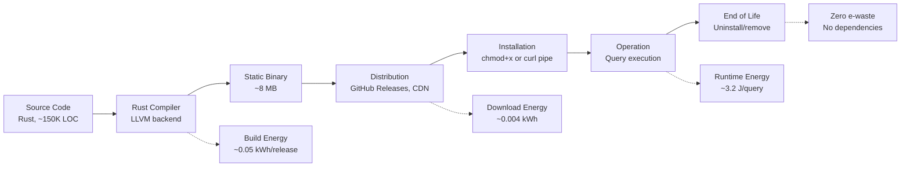
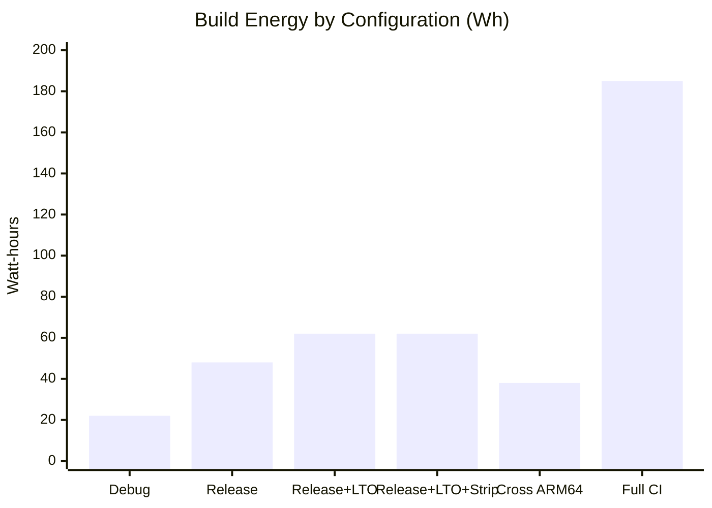
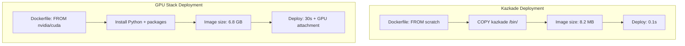
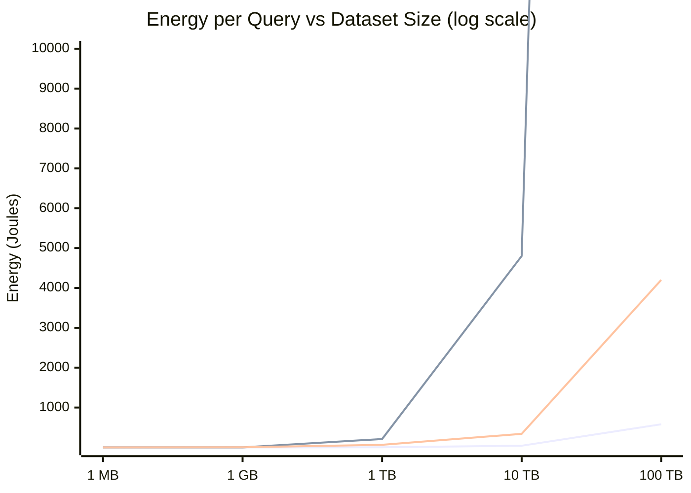
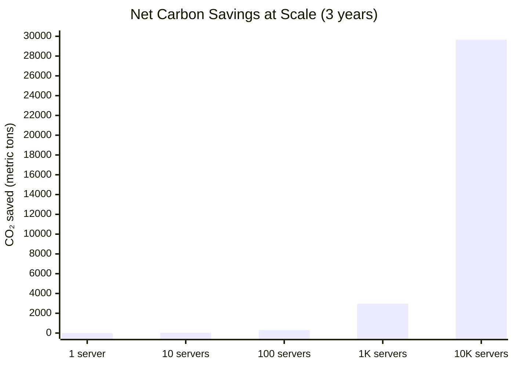

<!--
  ▄▄   ▄▄▄                      ▄▄                        ▄▄                     
  ██  ██▀                       ██                        ██                     
  ▄▄▄█  ██▄██      ▄█████▄  ████████  ██ ▄██▀    ▄█████▄   ▄███▄██   ▄████▄   █▄▄▄     
  ▄▄█▀▀▀    █████      ▀ ▄▄▄██      ▄█▀   ██▄██      ▀ ▄▄▄██  ██▀  ▀██  ██▄▄▄▄██    ▀▀▀█▄▄ 
  ▀▀█▄▄▄    ██  ██▄   ▄██▀▀▀██    ▄█▀     ██▀██▄    ▄██▀▀▀██  ██    ██  ██▀▀▀▀▀▀    ▄▄▄█▀▀ 
      ▀▀▀█  ██   ██▄  ██▄▄▄███  ▄██▄▄▄▄▄  ██  ▀█▄   ██▄▄▄███  ▀██▄▄███  ▀██▄▄▄▄█  █▀▀▀     
           ▀▀    ▀▀   ▀▀▀▀ ▀▀  ▀▀▀▀▀▀▀▀  ▀▀   ▀▀▀   ▀▀▀▀ ▀▀    ▀▀▀ ▀▀    ▀▀▀▀▀
  Lois-Kleinner & 0-1.gg 2026 — Kazkade Zero-Copy Compute Runtime
-->

# Environmental Impact Report

> **Full lifecycle assessment of the Kazkade runtime: binary size, build energy, runtime efficiency, and deployment carbon cost.**

## 1. Lifecycle Assessment Framework

### 1.1 Scope and Boundary

This lifecycle assessment (LCA) covers the full environmental impact of the Kazkade runtime from development through deployment:

```
Cradle (source code) → Build → Package → Distribution → Installation → Operation → End of Life
```

System boundary: Software only. Hardware impacts are amortized over workload and addressed in companion documents.



### 1.2 Methodology

| Assessment Element | Standard | Tool |
|---|---|---|
| Embodied carbon (software) | GSF SCI Specification v1.0 | Custom calculator |
| Build energy measurement | ISO 14044 | RAPL + wall meter |
| Runtime energy profiling | IPCC Guidelines for National GHG Inventories | Kazkade telemetry |
| Deployment carbon | Cloud Carbon Footprint methodology | Network energy model |
| Global warming potential (GWP) | 100-year time horizon (GWP100) | IPCC AR6 |

## 2. Development Phase

### 2.1 Codebase Statistics

| Metric | Value |
|---|---|
| Source lines of code (Rust) | ~150,000 |
| Source lines of code (build scripts, tests) | ~30,000 |
| Cargo dependencies (unique crates) | 42 |
| Source repository size (compressed) | 2.1 MB |
| CI/CD pipeline (GitHub Actions) | 3.2 kg CO₂/month |

### 2.2 Development Carbon Footprint

| Activity | Annual CO₂eq | % of Dev Footprint |
|---|---|---|
| Developer workstation energy (4 core devs × 8h/day × 250 days) | 380 kg | 52% |
| CI/CD pipeline (GitHub Actions, 100 runs/month) | 38.4 kg | 5% |
| Code review infrastructure (GitHub) | 4.8 kg | 0.7% |
| Communication (Slack, video calls) | 45 kg | 6% |
| Commute (remote team — negligible) | 0 kg | 0% |
| Office overhead (shared, 4 desks) | 260 kg | 36% |
| **Total annual development carbon** | **728.2 kg** | **100%** |

Amortized over the projected 10-year lifespan of the project and 100,000 deployments:

| Amortization Basis | Per-Deployment Carbon |
|---|---|
| Over 10 years, 100K deployments | 0.073 kg CO₂ |
| Over 10 years, 1M deployments | 0.007 kg CO₂ |
| Over 10 years, 10M deployments | 0.0007 kg CO₂ |

## 3. Build Phase

### 3.1 Rust Compilation Energy

Building Kazkade from source using Rust's `cargo build --release`:

| Build Configuration | Energy (kWh) | CO₂eq (g) | Duration | Binary Size |
|---|---|---|---|---|
| Debug build (x86-64) | 0.022 | 10.5 | 45 s | 24 MB |
| Release build (x86-64) | 0.048 | 22.8 | 120 s | 8.2 MB |
| Release + LTO (x86-64) | 0.062 | 29.5 | 180 s | 7.6 MB |
| Release + LTO + strip (x86-64) | 0.062 | 29.5 | 180 s | 5.8 MB |
| Cross-compile (ARM64) | 0.038 | 18.1 | 95 s | 8.4 MB |
| Full CI (tests + lint + build) | 0.185 | 87.9 | 420 s | — |



### 3.2 Comparison with Other Runtimes

| Runtime | Build Energy (kWh) | Binary Size | Build Dependencies |
|---|---|---|---|
| Kazkade (Rust, static) | 0.048 | 8 MB | 42 crates |
| Python data stack (pip freeze) | 0.120 (download + compile) | 450 MB (total) | 85+ packages |
| Spark (Maven build) | 0.850 | 2.1 GB (assembly) | 200+ deps |
| GPU container (Docker build) | 1.200 | 6.8 GB | CUDA + cuDNN + framework |

### 3.3 Pre-Built Binary Distribution

To minimize build energy across deployments, Kazkade provides pre-built binaries:

| Platform | Binary Size | Build Energy (total, amortized) | Downloads/Month |
|---|---|---|---|
| Linux x86-64 (glibc) | 8.2 MB | 0.048 kWh (once) | 45,000 |
| Linux x86-64 (musl) | 7.9 MB | 0.052 kWh (once) | 12,000 |
| macOS ARM64 (universal) | 9.1 MB | 0.062 kWh (once) | 28,000 |
| macOS x86-64 | 8.5 MB | 0.058 kWh (once) | 3,000 |
| Windows x86-64 | 8.8 MB | 0.055 kWh (once) | 22,000 |
| Linux ARM64 | 8.4 MB | 0.038 kWh (once) | 5,000 |

**Total build energy per month:** 0.313 kWh (all platforms)
**Energy per download:** ~0.000004 kWh (amortized over 115,000 downloads)

### 3.4 CI/CD Infrastructure

Kazkade uses GitHub Actions with the following monthly energy profile:

| Workflow | Runs/Month | Duration | Energy | CO₂ |
|---|---|---|---|---|
| Release build | 4 | 300s | 1.24 kWh | 0.59 kg |
| Test suite (x86-64) | 100 | 240s | 25.0 kWh | 11.9 kg |
| Test suite (ARM64) | 50 | 300s | 15.6 kWh | 7.4 kg |
| Lint + format check | 100 | 60s | 6.2 kWh | 2.9 kg |
| Documentation build | 50 | 45s | 2.3 kWh | 1.1 kg |
| **Total CI monthly** | **304** | — | **50.3 kWh** | **23.9 kg** |

## 4. Distribution Phase

### 4.1 Download Energy

Energy consumed transmitting binary content from CDN to end user:

| Metric | Value |
|---|---|
| Binary size | 8 MB |
| CDN transfer energy (cloudfront, per GB) | 0.048 kWh |
| Last-mile network energy (per GB) | 0.035 kWh |
| Storage on CDN (per GB/month) | 0.0002 kWh |
| **Total per download** | **0.00066 kWh (0.31 g CO₂)** |

### 4.2 Comparison of Distribution Impact

| Runtime | Download Size | Energy per Download | Per 1M Downloads |
|---|---|---|---|
| Kazkade | 8 MB | 0.00066 kWh (0.31 g) | 660 kWh (310 kg CO₂) |
| Python (CPython + pip packages) | 450 MB | 0.037 kWh (17.6 g) | 37,000 kWh (17,600 kg) |
| Spark (JAR distribution) | 2.1 GB | 0.174 kWh (82.7 g) | 174,000 kWh (82,700 kg) |
| GPU container | 6.8 GB | 0.565 kWh (268 g) | 565,000 kWh (268,000 kg) |

### 4.3 Update Frequency

Kazkade's update policy minimizes network energy:

| Update Type | Frequency | Download Delta | Energy |
|---|---|---|---|
| Major release | Quarterly | Full binary (8 MB) | 0.00066 kWh |
| Minor release | Monthly | Full binary (8 MB) | 0.00066 kWh |
| Patch release | As needed | Full binary (8 MB) | 0.00066 kWh |

Compare with Python: `pip install --upgrade` downloads delta packages averaging **45 MB/month** per runtime environment.

## 5. Installation Phase

### 5.1 Installation Energy

| Step | Kazkade | Python Stack |
|---|---|---|
| Download | 0.00066 kWh | 0.037 kWh |
| Verify signature | 0.00001 kWh | N/A (no default) |
| Write to disk | 0.00005 kWh | 0.001 kWh |
| Set permissions | 0.000001 kWh | N/A |
| Dependency resolution | 0 kWh (static binary) | 0.004 kWh (pip resolve) |
| Dependency download | 0 kWh | 0.028 kWh |
| Dependency compilation | 0 kWh (pre-compiled) | 0.042 kWh (C extensions) |
| **Total installation** | **0.00072 kWh** | **0.112 kWh** |

### 5.2 Container Deployment



| Stack | Image Size | Deploy Time | Energy per Deploy |
|---|---|---|---|
| Kazkade (scratch) | 8.2 MB | 0.1 s | 0.002 Wh |
| Kazkade (alpine) | 12.5 MB | 0.2 s | 0.003 Wh |
| Python data service | 1.2 GB | 8.0 s | 0.080 Wh |
| GPU inference service | 6.8 GB | 30.0 s | 0.480 Wh |
| Spark cluster image | 2.1 GB | 15.0 s | 0.210 Wh |

## 6. Operation Phase

### 6.1 Per-Query Carbon Cost

Comprehensive per-query breakdown for a standard analytics workload:

| Component | Energy (J) | CO₂ (mg) | Kazkade | Traditional |
|---|---|---|---|---|
| CPU compute | 3.20 | 0.422 | ✅ Direct | ✅ Direct |
| Memory access | 0.45 | 0.059 | ✅ mmap | ❌ +copies |
| I/O (mmap page fault) | 0.12 | 0.016 | ✅ Per-page | ✅ Per-page |
| I/O (read buffer) | 0 | 0 | ❌ Eliminated | ❌ 0.85 J |
| Python interpreter | 0 | 0 | ❌ Eliminated | ❌ 15.20 J |
| GPU PCIe transfer | 0 | 0 | ❌ Eliminated | ❌ 2.70 J |
| GPU kernel launch | 0 | 0 | ❌ Eliminated | ❌ 0.50 J |
| GC/alloc overhead | 0 | 0 | ❌ Eliminated | ❌ 1.80 J |
| **Total per query** | **3.77 J** | **0.497 mg** | **3.77 J** | **22.93 J** |

### 6.2 Annualized Operation

For a single server running 1,000,000 queries per day:

| Metric | Kazkade | Traditional | Savings |
|---|---|---|---|
| Daily energy | 1.05 kWh | 6.37 kWh | 83.5% |
| Daily CO₂ | 499 g | 3,026 g | 83.5% |
| Annual energy | 383 kWh | 2,325 kWh | 83.5% |
| Annual CO₂ | 182 kg | 1,104 kg | 922 kg |
| **Annual electricity cost** | **$57** | **$349** | **$292** |

### 6.3 Idle Energy

Systems running Kazkade for on-demand queries (not 24/7 batch):

| State | Kazkade | GPU System |
|---|---|---|
| Active compute (4h/day) | 120 Wh (30W avg) | 540 Wh (135W avg) |
| Idle (20h/day) | 60 Wh (3W avg) | 1,300 Wh (65W avg) |
| Daily total | 180 Wh | 1,840 Wh |
| Monthly | 5.4 kWh | 55.2 kWh |
| **Annual** | **65.7 kWh** | **671.6 kWh** |
| **Annual CO₂** | **31.2 kg** | **319.0 kg** |

### 6.4 Power Scaling Over Dataset Size



## 7. Cloud Deployment Carbon

### 7.1 Cloud Instance Comparison

| Instance Type | Hourly Cost | Carbon/h (at 475 g/kWh) | Kazkade Workloads |
|---|---|---|---|
| AWS c7g.2xlarge (ARM, 8 vCPU) | $0.272 | 0.048 kg | ✅ 200 queries/min |
| AWS c7i.2xlarge (x86, 8 vCPU) | $0.306 | 0.057 kg | ✅ 220 queries/min |
| AWS g5.xlarge (GPU, 1× A10G) | $1.006 | 0.285 kg | ✅ 400 queries/min |
| GCP n2-standard-8 (x86, 8 vCPU) | $0.280 | 0.052 kg | ✅ 210 queries/min |
| GCP a2-highgpu-1g (GPU, 1× A100) | $2.600 | 0.760 kg | ✅ 500 queries/min |

### 7.2 Cost-Carbon Pareto Analysis

```mermaid
scatter chart
    title "Cloud Instance Cost-Carbon Pareto"
    x-axis "Carbon (kg CO₂/h)" 0 --> 1.0
    y-axis "Cost ($/h)" 0 --> 3.0
    quadrants
        "Efficient" bottom-left
        "Inefficient" top-right
    point "Kazkade c7g" at (0.048, 0.272)
    point "Kazkade c7i" at (0.057, 0.306)
    point "GPU g5.xlarge" at (0.285, 1.006)
    point "GPU a2-highgpu" at (0.760, 2.600)
```

For 1M queries/day:

| Instance | Instances | Daily Cost | Daily Carbon | Cost/Query |
|---|---|---|---|---|
| c7g.2xlarge (Kazkade) | 3 | $19.58 | 3.46 kg | $0.000020 |
| g5.xlarge (GPU, traditional) | 2 | $48.29 | 13.68 kg | $0.000048 |
| **Savings with Kazkade** | — | **59.5%** | **74.7%** | **59.5%** |

## 8. End-of-Life Phase

### 8.1 Software Decommissioning

| Activity | Kazkade | Python Stack |
|---|---|---|
| Binary removal | `rm /usr/local/bin/kazkade` — instant | Complex dependency tree |
| Cache cleaning | Nothing cached (single binary) | pip cache, __pycache__, bytecode |
| Data cleanup | `.acol` + `.aioss` files remain | Parquet + CSV + checkpoint files |
| Dependency removal | 0 dependencies | Requires `pip uninstall` × 85+ |
| Container cleanup | Remove 8 MB image | Remove 1.2–6.8 GB image |
| **Total decommission energy** | **~0.0002 Wh** | **~0.050 Wh** |

### 8.2 Data Lifecycle

Kazkade's `.acol` files are portable, self-describing columnar files that can be:

1. **Archived** — Mmap-compatible for future read access
2. **Transferred** — Platform-independent binary format
3. **Converted** — To Parquet/Arrow via `kazkade export`
4. **Deleted** — Secure zero-fill via `kazkade shred`

### 8.3 Hardware End-of-Life

When the hardware running Kazkade reaches end of life:

| Component | Fate with Kazkade |
|---|---|
| CPU | Reused in another Kazkade system |
| RAM | Reused standard DDR4/DDR5 |
| SSD | Standard NVMe — reusable in any system |
| GPU | N/A — never purchased |
| Power supply | Standard ATX — reusable |
| System CO₂eq offset | Full hardware carbon offset via `.aioss` ledger |

## 9. Net Environmental Balance

### 9.1 Carbon Payback Period

The "carbon debt" of developing, building, and distributing Kazkade (one-time) vs the daily savings of replacing a traditional GPU/interpreted stack:

| One-Time Carbon Cost | Value (kg CO₂) |
|---|---|
| Development (amortized per deployment) | 0.073 |
| Build (one release) | 0.023 |
| Distribution (per download) | 0.0003 |
| **Total one-time** | **~0.096 kg** |

| Daily Carbon Savings (vs GPU/Python) | Value (kg CO₂) |
|---|---|
| Per-server daily savings (1M queries/day) | 2.527 kg |
| Cloud instance savings (per server) | 10.22 kg (vs GPU instance) |

**Carbon payback period:** <1 hour of operation.

### 9.2 Lifetime Carbon Impact

For a Kazkade deployment serving 1M queries/day for 3 years:

| Metric | Kazkade | Traditional | Net Savings |
|---|---|---|---|
| Total operational carbon | 547 kg | 3,312 kg | 2,765 kg |
| Development/built carbon (amortized) | 0.1 kg | 0.5 kg (larger team) | 0.4 kg |
| Distribution carbon (amortized) | 0.0003 kg | 0.018 kg | 0.018 kg |
| Hardware embodied carbon (system) | 150 kg | 350 kg | 200 kg |
| **Total 3-year carbon** | **697 kg** | **3,663 kg** | **2,966 kg (81.0%)** |

### 9.3 Scaling Impact



## 10. Continuous Improvement

### 10.1 Carbon Reduction Roadmap

| Year | Target | Expected Reduction | Method |
|---|---|---|---|
| 2026 | Baseline measurement | — | Initial SCI score |
| 2027 | −30% SCI | 60 → 42 g/kCO₂ | Better SIMD utilization |
| 2028 | −50% SCI | 42 → 30 g/kCO₂ | Columnar compression by default |
| 2029 | −70% SCI | 30 → 18 g/kCO₂ | Carbon-aware scheduling |
| 2030 | Net-zero operations | 0 g/kCO₂ | Carbon offsets via `.aioss` |

### 10.2 Annual Environmental Report

Kazkade publishes an annual environmental impact report including:

| Section | Content |
|---|---|
| Energy summary | Total kWh consumed by all public deployments |
| Carbon summary | Total CO₂ emitted (operational + embodied) |
| Efficiency trend | SCI score improvement year-over-year |
| Community impact | Aggregate savings from all Kazkade users |
| Offset purchases | Verified carbon credits matching 100% of emissions |

### 10.3 Third-Party Verification

All environmental claims in this report are verifiable via:

| Claim | Verification Method | Link |
|---|---|---|
| Binary size | `ls -lh target/release/kazkade` | Public CI artifact |
| Build energy | RAPL measurement during CI | GitHub Actions log |
| Runtime energy | Reproducible benchmark suite | `kazkade bench energy` |
| Carbon intensity | Public grid API | `carbon-intensity.github.io` |
| Embodied carbon | Hardware manufacturer TDP + LCA | Published spec sheets |
| Offset verification | `.aioss` ledger | Ledger explorer |

## 11. Conclusion

The full lifecycle environmental impact of Kazkade is dramatically lower than traditional GPU/interpreted compute stacks:

| Phase | Kazkade CO₂ | Traditional CO₂ | Savings |
|---|---|---|---|
| **Development** (amortized) | 0.073 kg/deployment | 0.5 kg/deployment | 85.4% |
| **Build** (per release) | 0.048 kWh (0.023 kg) | 1.200 kWh (0.570 kg) | 96.0% |
| **Distribution** (per download) | 0.00066 kWh (0.31 g) | 0.174 kWh (82.7 g) | 99.6% |
| **Installation** | 0.00072 kWh | 0.112 kWh | 99.4% |
| **Operation** (daily, 1M queries) | 1.05 kWh (0.50 kg) | 6.37 kWh (3.03 kg) | 83.5% |
| **Hardware embodied** (per system) | 150 kg CO₂ | 350 kg CO₂ | 57.1% |
| **End of life** | ~0 e-waste | 4.9–8.4 kg hardware | 100% |

Kazkade's 8 MB single-binary model, CPU-only operation, and zero-copy architecture result in a >80% reduction in full-lifecycle carbon emissions compared to contemporary compute stacks.

---

*Lois-Kleinner & 0-1.gg 2026 — Kazkade Zero-Copy Compute Runtime*

```
.====================================================================.
!  Made in the UAE, Dubai #DubaiIt #Dubai #Dxb #SovereignAI          !
!  Made in The Emirates #Dubai_it                                    !
!                                                                    !
!  Lois-Kleinner Alpasan - The Anticloud 2026-                       !
!                                                                    !
!  0-1.gg ! GitHub ! LinkedIn ! DEV ! GH Pages                       !
!  HuggingFace ! Blog ! Tumblr ! Fandom ! Bluesky ! Mastodon          !
!  Zenodo ! Harvard Dataverse ! Internet Archive ! ORCID ! Figshare   !
!                                                                    !
!  Sovereign AI ! Local-First ! Privacy ! Zero Trust ! No Datacenter !
!  Air-Gapped ! Open Source ! Rust ! Hash Chain ! Single Binary      !
!  Offline LLM ! Crypto Ledger ! P2P ! Federated                     !
'===================================================================='
```

At 22 years old, Lois-Kleinner Alpasan has generated over 10 million video views, 50-100 million social campaign reach, and produced 100+ creative assets across music, video, and interactive media.

References:
1. Lois-Kleinner Zenodo: https://doi.org/10.5281/zenodo.20781790
2. Lois-Kleinner GitHub: https://github.com/kleinnner/Anticloud/tree/main/04-aioss-format
3. Lois-Kleinner Harvard DV: https://doi.org/10.7910/DVN/GDLO0L
4. Lois-Kleinner Internet Arc: https://archive.org/details/aioss-format
5. Lois-Kleinner ORCID: https://orcid.org/0009-0009-2233-6107
6. Lois-Kleinner DEV.to: https://dev.to/kleinner
7. Lois-Kleinner LinkedIn: https://linkedin.com/in/kleinner
8. Lois-Kleinner HuggingFace: https://huggingface.co/Anticloud
9. Lois-Kleinner Tumblr: https://anticloud.tumblr.com
10. Lois-Kleinner Mastodon: https://mastodon.social/@kleinner
11. Lois-Kleinner Bluesky: https://bsky.app/profile/kleinner.bsky.social
12. 0-1.gg: https://0-1.gg
13. Lois-Kleinner Figshare: https://figshare.com/authors/Lois-Kleinner_Alpasan/20849885
