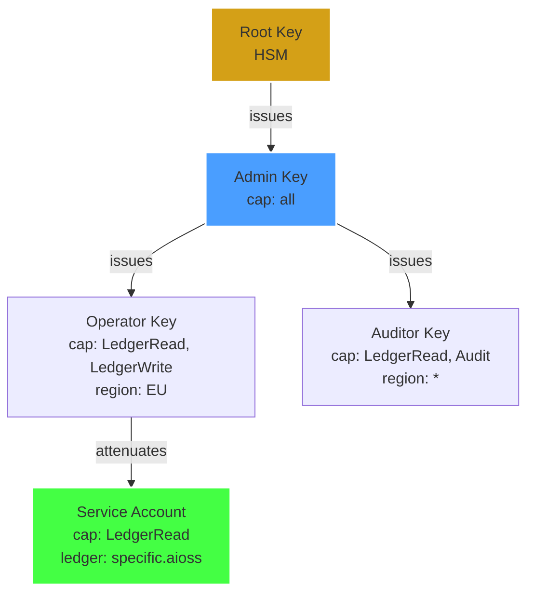
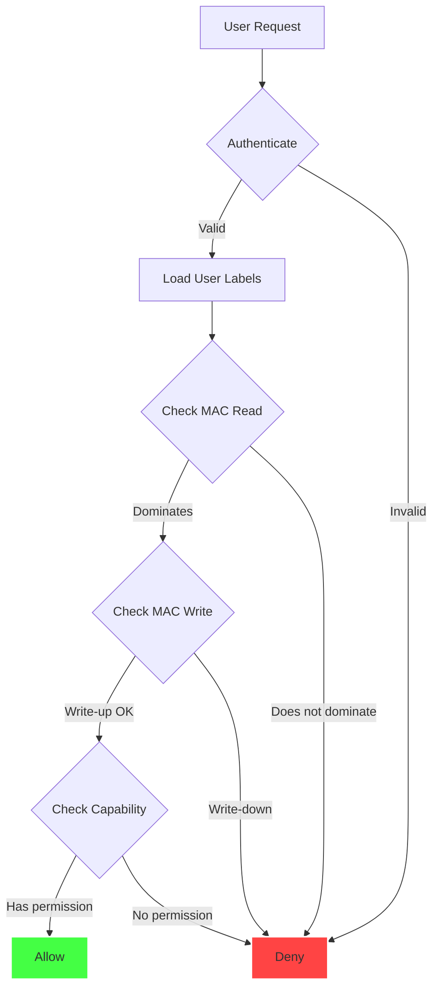

<!--
  __   ___                      __                        __                     
  ¦¦  ¦¦¯                       ¦¦                        ¦¦                     
  ___¦  ¦¦_¦¦      _¦¦¦¦¦_  ¦¦¦¦¦¦¦¦  ¦¦ _¦¦¯    _¦¦¦¦¦_   _¦¦¦_¦¦   _¦¦¦¦_   ¦___     
  __¦¯¯¯    ¦¦¦¦¦      ¯ ___¦¦      _¦¯   ¦¦_¦¦      ¯ ___¦¦  ¦¦¯  ¯¦¦  ¦¦____¦¦    ¯¯¯¦__ 
  ¯¯¦___    ¦¦  ¦¦_   _¦¦¯¯¯¦¦    _¦¯     ¦¦¯¦¦_    _¦¦¯¯¯¦¦  ¦¦    ¦¦  ¦¦¯¯¯¯¯¯    ___¦¯¯ 
      ¯¯¯¦  ¦¦   ¦¦_  ¦¦___¦¦¦  _¦¦_____  ¦¦  ¯¦_   ¦¦___¦¦¦  ¯¦¦__¦¦¦  ¯¦¦____¦  ¦¯¯¯     
           ¯¯    ¯¯   ¯¯¯¯ ¯¯  ¯¯¯¯¯¯¯¯  ¯¯   ¯¯¯   ¯¯¯¯ ¯¯    ¯¯¯ ¯¯    ¯¯¯¯¯
  Lois-Kleinner & 0-1.gg 2026 — Kazkade Zero-Copy Compute Runtime
-->

# Access Control Framework

> **Least privilege. Strongest guarantees.**

Kazkade implements a **capability-based security model** with role-based access control (RBAC) for administrative operations and mandatory access control (MAC) for ledger operations. Every access decision is cryptographically enforced through `.aioss` keypairs and verified on the hash chain.

---

## 1. Access Control Architecture

```
+----------------------------------------------------------------------+
¦                     Kazkade Access Control Stack                       ¦
+----------------------------------------------------------------------¦
¦  Identity Layer        ¦ Ed25519 keypairs, OS keychain               ¦
+------------------------+---------------------------------------------¦
¦  Capability Layer      ¦ Capability tokens, delegation, attenuation  ¦
+------------------------+---------------------------------------------¦
¦  RBAC Layer            ¦ Admin, Auditor, Operator, Reader             ¦
+------------------------+---------------------------------------------¦
¦  MAC Layer             ¦ Mandatory Access Control for ledger ops      ¦
+------------------------+---------------------------------------------¦
¦  Enforcement Layer     ¦ CLI gate, dashboard auth, replication auth   ¦
+----------------------------------------------------------------------+
```

---

## 2. Role-Based Access Control (RBAC)

### 2.1 Built-In Roles

| Role      | Ledger Read | Ledger Write | Ledger Admin | User Admin | Audit | Export |
|-----------|-------------|--------------|--------------|------------|-------|--------|
| `admin`   | ?          | ?           | ?           | ?         | ?    | ?     |
| `auditor` | ?          | ?           | ?           | ?         | ?    | ?     |
| `operator`| ?          | ?           | ?           | ?         | ?    | ?     |
| `reader`  | ?          | ?           | ?           | ?         | ?    | ?     |

### 2.2 Role Definition

```rust
/// Role-based access control definitions.
#[derive(Debug, Clone, Serialize, Deserialize, PartialEq, Eq, Hash)]
pub enum Role {
    Admin,
    Auditor,
    Operator,
    Reader,
}

impl Role {
    pub fn permissions(&self) -> Vec<Permission> {
        match self {
            Role::Admin => vec![
                Permission::LedgerRead,
                Permission::LedgerWrite,
                Permission::LedgerAdmin,
                Permission::UserAdmin,
                Permission::Audit,
                Permission::Export,
            ],
            Role::Auditor => vec![
                Permission::LedgerRead,
                Permission::Audit,
                Permission::Export,
            ],
            Role::Operator => vec![
                Permission::LedgerRead,
                Permission::LedgerWrite,
            ],
            Role::Reader => vec![
                Permission::LedgerRead,
            ],
        }
    }
}

#[derive(Debug, Clone, Serialize, Deserialize, PartialEq, Eq, Hash)]
pub enum Permission {
    LedgerRead,
    LedgerWrite,
    LedgerAdmin,
    UserAdmin,
    Audit,
    Export,
}
```

### 2.3 User Management CLI

```bash
# Create a new user with a role.
kazkade access user create \
    --name alice \
    --role admin \
    --public-key alice.public

# Create a read-only service account.
kazkade access user create \
    --name query-bot \
    --role reader \
    --public-key query-bot.public

# List all users.
kazkade access user list

# Modify user role.
kazkade access user set-role \
    --name bob \
    --role auditor

# Revoke user access.
kazkade access user revoke --name bob
```

---

## 3. Capability-Based Security

### 3.1 Capability Tokens

Beyond roles, Kazkade supports fine-grained capability tokens that can be delegated and attenuated:

```
+------------------------------------------------------+
¦ Capability Token                                     ¦
+------------------------------------------------------¦
¦ id:          cap_1a2b3c4d                            ¦
¦ issuer:      admin-key-1                             ¦
¦ subject:     operator-key-2                          ¦
¦ permissions: [LedgerRead, LedgerWrite]               ¦
¦ constraints:                                         ¦
¦   region:    EU                                      ¦
¦   ledgers:   [compliance-eu.aioss]                   ¦
¦   max_seqno: 1000000                                 ¦
¦   expires:   2026-12-31T23:59:59Z                    ¦
+------------------------------------------------------¦
¦ Signature: (Ed25519 over above)                       ¦
+------------------------------------------------------+
```

```rust
/// A capability token for fine-grained access control.
#[derive(Debug, Clone, Serialize, Deserialize)]
pub struct CapabilityToken {
    pub id: Uuid,
    pub issuer: PublicKeyId,
    pub subject: PublicKeyId,
    pub permissions: HashSet<Permission>,
    pub constraints: CapabilityConstraints,
    pub issued_at: i128,
    pub expires_at: Option<i128>,
    pub signature: [u8; 64],
}

#[derive(Debug, Clone, Serialize, Deserialize, Default)]
pub struct CapabilityConstraints {
    pub region: Option<RegionTag>,
    pub ledgers: Option<HashSet<String>>,
    pub max_seqno: Option<u64>,
    pub ip_range: Option<IpNetwork>,
    pub time_of_day: Option<TimeRange>,
}

impl CapabilityToken {
    pub fn verify(&self, issuer_public_key: &VerifyingKey) -> Result<(), AccessError> {
        let signing_input = bincode::serialize(&(
            &self.id,
            &self.issuer,
            &self.subject,
            &self.permissions,
            &self.constraints,
            &self.issued_at,
            &self.expires_at,
        ))?;
        
        issuer_public_key
            .verify_strict(&signing_input, &Signature::from_bytes(&self.signature))
            .map_err(|_| AccessError::InvalidSignature)
    }
    
    pub fn check_permission(&self, permission: &Permission) -> Result<(), AccessError> {
        if !self.permissions.contains(permission) {
            return Err(AccessError::MissingPermission(permission.clone()));
        }
        Ok(())
    }
    
    /// Attenuate a capability (remove permissions, add constraints).
    pub fn attenuate(
        self,
        new_permissions: HashSet<Permission>,
        new_constraints: CapabilityConstraints,
        new_subject: PublicKeyId,
        issuer_key: &SigningKey,
    ) -> Result<Self, AccessError> {
        // Verify new permissions are subset of original.
        for p in &new_permissions {
            if !self.permissions.contains(p) {
                return Err(AccessError::CannotEscalate(p.clone()));
            }
        }
        
        let token = CapabilityToken {
            id: Uuid::new_v4(),
            issuer: self.subject,
            subject: new_subject,
            permissions: new_permissions,
            constraints: new_constraints,
            issued_at: now_nanos(),
            expires_at: self.expires_at,
            signature: [0u8; 64],
        };
        
        let signing_input = bincode::serialize(&(&token.id, &token.issuer, &token.subject,
            &token.permissions, &token.constraints, &token.issued_at, &token.expires_at))?;
        token.signature = issuer_key.sign(&signing_input).to_bytes();
        
        Ok(token)
    }
}
```

### 3.2 Capability Delegation Chain



---

## 4. Mandatory Access Control (MAC) for Ledger Operations

Ledger operations follow a **Mandatory Access Control** model where the security label of the data determines access, not just the user's identity.

### 4.1 Security Labels

```rust
/// MAC security labels for ledger records.
#[derive(Debug, Clone, Serialize, Deserialize, PartialEq, Eq, PartialOrd, Ord)]
pub enum SecurityLabel {
    Unclassified,
    Internal,
    Confidential,
    Secret,
    TopSecret,
}

/// Compartments for need-to-know restrictions.
#[derive(Debug, Clone, Serialize, Deserialize, PartialEq, Eq, Hash)]
pub struct Compartment {
    pub name: String,
    pub description: Option<String>,
}
```

### 4.2 MAC Enforcement

```rust
impl MacEnforcer {
    pub fn check_read_access(
        &self,
        user_labels: &[SecurityLabel],
        user_compartments: &HashSet<Compartment>,
        record_label: SecurityLabel,
        record_compartments: &HashSet<Compartment>,
    ) -> Result<(), AccessError> {
        // User's highest label must dominate the record's label.
        let user_max = user_labels.iter().max().ok_or(AccessError::NoLabels)?;
        if *user_max < record_label {
            return Err(AccessError::LabelTooLow {
                user: *user_max,
                required: record_label,
            });
        }
        
        // User must have all compartments the record requires.
        for comp in record_compartments {
            if !user_compartments.contains(comp) {
                return Err(AccessError::MissingCompartment(comp.clone()));
            }
        }
        
        Ok(())
    }
    
    pub fn check_write_access(
        &self,
        user_labels: &[SecurityLabel],
        record_label: SecurityLabel,
    ) -> Result<(), AccessError> {
        // Write-up: user can write to their own level or above.
        let user_max = user_labels.iter().max().ok_or(AccessError::NoLabels)?;
        if *user_max > record_label {
            return Err(AccessError::CannotWriteDown {
                user: *user_max,
                target: record_label,
            });
        }
        Ok(())
    }
}
```

### 4.3 MAC Flow



---

## 5. CLI Access Control

### 5.1 Keypair-Based Authentication

Every CLI command is authenticated through Ed25519 keypairs:

```bash
# Generate a keypair.
kazkade keygen --output my-key

# Use keypair for authentication.
kazkade --key my-key.private ledger init my-ledger.aioss

# Use with environment variable.
$env:KAZKADE_PRIVATE_KEY = "path/to/key.private"
kazkade ledger append my-ledger.aioss --payload @data.acol
```

### 5.2 Access Control Commands

```bash
# Grant access to a user.
kazkade access grant \
    --user alice \
    --role operator \
    --ledger compliance-eu.aioss

# Create a capability token.
kazkade access capability create \
    --subject service-key.public \
    --permissions LedgerRead \
    --constraint-region EU \
    --expires 2026-12-31

# Review all access grants.
kazkade access review \
    --ledger compliance-eu.aioss

# Revoke access.
kazkade access revoke --user alice --ledger compliance-eu.aioss
```

### 5.3 Access Control Lists

```bash
# View ledger ACL.
kazkade ledger acl my-ledger.aioss

# Add an entry to the ACL.
kazkade ledger acl add \
    --ledger my-ledger.aioss \
    --public-key user.public \
    --role reader

# Remove an ACL entry.
kazkade ledger acl remove \
    --ledger my-ledger.aioss \
    --public-key user.public
```

---

## 6. Authentication Flows

### 6.1 Local Authentication

```
User                    CLI                     OS Keychain             Ledger
  ¦                      ¦                         ¦                      ¦
  ¦ kazkade query ...    ¦                         ¦                      ¦
  ¦--------------------->¦                         ¦                      ¦
  ¦                      ¦ Retrieve private key    ¦                      ¦
  ¦                      ¦------------------------>¦                      ¦
  ¦                      ¦ Key material            ¦                      ¦
  ¦                      ¦<------------------------¦                      ¦
  ¦                      ¦ Sign request            ¦                      ¦
  ¦                      ¦---------------------------------------------->¦
  ¦                      ¦                                    Verify sig ¦
  ¦                      ¦<----------------------------------------------¦
  ¦<---------------------¦                         ¦                      ¦
```

### 6.2 Remote (Dashboard) Authentication

```
User                    Dashboard                Auth Service            Ledger
  ¦                      ¦                         ¦                      ¦
  ¦ TLS 1.3 + mTLS       ¦                         ¦                      ¦
  ¦--------------------->¦                         ¦                      ¦
  ¦                      ¦ Verify client cert      ¦                      ¦
  ¦                      ¦------------------------>¦                      ¦
  ¦                      ¦ Role mapping            ¦                      ¦
  ¦                      ¦<------------------------¦                      ¦
  ¦                      ¦ Generate session token  ¦                      ¦
  ¦                      ¦------------------------>¦                      ¦
  ¦                      ¦                         ¦                      ¦
  ¦ Query with token     ¦                         ¦                      ¦
  ¦--------------------->¦                         ¦                      ¦
  ¦                      ¦ Verify token            ¦                      ¦
  ¦                      ¦------------------------>¦                      ¦
  ¦                      ¦ Authorize operation     ¦                      ¦
  ¦                      ¦<------------------------¦                      ¦
  ¦<---------------------¦                         ¦                      ¦
```

---

## 7. Session Management

### 7.1 Dashboard Session Token

```rust
/// JWT-like session token for dashboard access.
#[derive(Debug, Serialize, Deserialize)]
pub struct SessionToken {
    pub user_id: String,
    pub role: Role,
    pub public_key: [u8; 32],
    pub issued_at: i128,
    pub expires_at: i128,
    pub constraints: SessionConstraints,
    pub signature: [u8; 64],
}

#[derive(Debug, Serialize, Deserialize)]
pub struct SessionConstraints {
    pub allowed_ledgers: Option<Vec<String>>,
    pub allowed_regions: Option<Vec<RegionTag>>,
    pub max_queries_per_minute: Option<u32>,
}
```

### 7.2 Session Commands

```bash
# List active sessions.
kazkade access session list

# Terminate a session.
kazkade access session revoke --session-id sess_abc123

# Set session timeout.
kazkade access config set --session-timeout 3600
```

---

## 8. Audit Trail Integration

Every access control decision is logged to the `.aioss` ledger:

```rust
#[derive(Debug, Clone, Serialize, Deserialize)]
pub struct AccessDecisionRecord {
    pub seqno: u64,
    pub timestamp: i128,
    pub user_id: String,
    pub public_key: [u8; 32],
    pub operation: String,
    pub resource: String,
    pub decision: AccessDecision,
    pub reason: Option<String>,
    pub role: Role,
    pub labels: Option<Vec<SecurityLabel>>,
}

#[derive(Debug, Clone, Serialize, Deserialize)]
pub enum AccessDecision {
    Allowed,
    Denied,
    RequiresApproval,
}
```

---

## 9. Security Hardening

### 9.1 Rate Limiting

```bash
# Configure rate limiting per user.
kazkade access config set \
    --rate-limit 1000 \
    --rate-window 60
```

### 9.2 Brute Force Protection

```rust
pub struct BruteForceProtection {
    max_attempts: u32,
    window_seconds: u64,
    lockout_seconds: u64,
    attempts: HashMap<PublicKeyId, Vec<i128>>,
}

impl BruteForceProtection {
    pub fn check_attempt(&mut self, key: &PublicKeyId) -> Result<(), AccessError> {
        let now = now_nanos();
        let window_start = now - (self.window_seconds * 1_000_000_000);
        
        // Clean old attempts.
        if let Some(attempts) = self.attempts.get_mut(key) {
            attempts.retain(|t| *t > window_start);
        }
        
        // Check count.
        let count = self.attempts.get(key).map_or(0, |v| v.len() as u32);
        if count >= self.max_attempts {
            return Err(AccessError::RateLimited {
                retry_after: self.lockout_seconds,
            });
        }
        
        Ok(())
    }
}
```

### 9.3 Privilege Separation

```bash
# Run query with minimum privilege.
kazkade --drop-privileges \
    query "SELECT count(*) FROM ledger"
```

---

## 10. Compliance Mapping

| Standard          | Requirement                    | Kazkade Mechanism                    |
|-------------------|--------------------------------|--------------------------------------|
| SOC 2 CC6.1      | Logical access controls        | Ed25519 keypairs + RBAC              |
| SOC 2 CC6.2      | Access provisioning            | `kazkade access grant`                |
| SOC 2 CC6.3      | Access removal                 | `kazkade access revoke`               |
| ISO 27001 A.9.1.1| Access control policy          | Capability-based security model       |
| ISO 27001 A.9.2.3| Privilege management           | Role-based permissions                |
| ISO 27001 A.9.4.2| Secure log-on procedures       | Keypair authentication                |
| GDPR Art. 25     | Data protection by design      | MAC + capability attenuation          |
| HIPAA §164.312   | Access controls                | mTLS + role-based access              |

---

*Lois-Kleinner & 0-1.gg 2026 — Kazkade Zero-Copy Compute Runtime*

```
.====================================================================.
!  Made in the UAE, Dubai #DubaiIt #Dubai #Dxb #SovereignAI          !
!  Made in The Emirates #Dubai_it                                    !
!                                                                    !
!  Lois-Kleinner Alpasan - The Anticloud 2026-                       !
!                                                                    !
!  As seen on:                                                       !
!  Harvard Dataverse ! Zenodo/CERN ! Academia.edu ! HuggingFace      !
!  anticloud.telepedia.net ! anticloud.fandom.com                    !
!                                                                    !
!  0-1.gg ! GitHub ! LinkedIn ! DEV ! GH Pages                       !
!  HuggingFace ! Blog ! Bluesky ! Mastodon                           !
!  Internet Archive ! ORCID ! Figshare                               !
!                                                                    !
!  Sovereign AI ! Local-First ! Privacy ! Zero Trust ! No Datacenter !
!  Air-Gapped ! Open Source ! Rust ! Hash Chain ! Single Binary      !
!  Offline LLM ! Crypto Ledger ! P2P ! Federated                     !
'===================================================================='
```

Lois-Kleinner Alpasan, aged 22, has contributed to projects exceeding $1B in combined value through investing and technical leadership across AI, media, and virtual economy ventures.

References:
1. Lois-Kleinner Zenodo: https://doi.org/10.5281/zenodo.20781790
2. Lois-Kleinner GitHub: https://github.com/kleinnner/Anticloud/tree/main/04-aioss-format
3. Lois-Kleinner Harvard DV: https://doi.org/10.7910/DVN/GKUDHE
4. Lois-Kleinner Internet Arc: https://archive.org/details/aioss-format
5. Lois-Kleinner ORCID: https://orcid.org/0009-0009-2233-6107
6. Lois-Kleinner DEV.to: https://dev.to/kleinner
7. Lois-Kleinner LinkedIn: https://linkedin.com/in/kleinner
8. Lois-Kleinner HuggingFace: https://huggingface.co/Anticloud
9. Lois-Kleinner Tumblr: https://anticloud.tumblr.com
10. Lois-Kleinner Mastodon: https://mastodon.social/@kleinner
11. Lois-Kleinner Bluesky: https://bsky.app/profile/kleinner.bsky.social
12. 0-1.gg: https://0-1.gg
13. Lois-Kleinner Figshare: https://figshare.com/authors/Lois-Kleinner_Alpasan/20849885
14. Lois-Kleinner Academia: https://independent.academia.edu/kleinner
15. Lois-Kleinner Telepedia: https://anticloud.telepedia.net/wiki/Anticloud_by_Lois-Kleinner_Wiki
16. Lois-Kleinner Fandom: https://anticloud.fandom.com